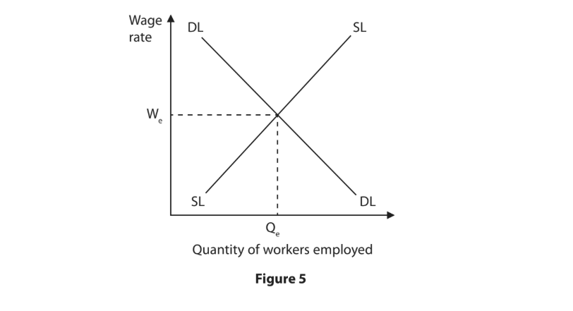
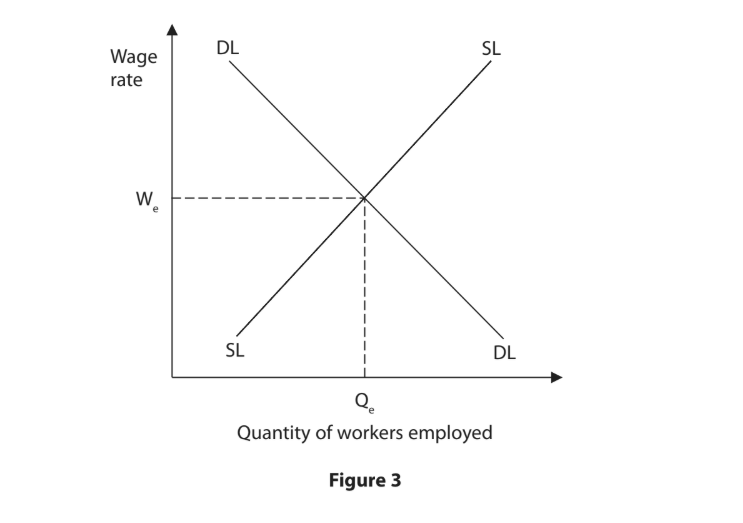

# Exam Questions — The Labour Market
**Business Economics** · Edexcel IGCSE Economics (4EC1)
> Source: [https://www.savemyexams.com/igcse/economics/edexcel/17/topic-questions/business-economics/the-labour-market/exam-questions/](https://www.savemyexams.com/igcse/economics/edexcel/17/topic-questions/business-economics/the-labour-market/exam-questions/) · 22 questions · total 110 marks

## Q1 — easy — 1 marks · exam-questions

### 3((a)) — 1 mark — multiple_choice — from paper June 2024 · Paper 1
An increase in which **one **of the following is most likely to cause a decrease in the supply of labour?
- **A.** The retirement age
- **B.** The school‐leaving age
- **C.** The population
- **D.** The demand for the final product

## Q2 — easy — 1 marks · exam-questions

### 1((d)) — 1 mark — command: state — structured — from paper June 2024 · Paper 1R
State **one **factor that may affect the supply of labour.

## Q3 — easy — 2 marks · exam-questions

### 2((c)) — 2 marks — command: what — structured — from paper Jan 2023 · Paper 1R
What is meant by the term trade union?

## Q4 — easy — 1 marks · exam-questions

### 2((a)) — 1 mark — multiple_choice — from paper June 2022 · Paper 1R
Which **one **of the following would lead to an increase in the supply of labour?
- **A.** Decrease in the retirement age
- **B.** Increase in the school-leaving age
- **C.** Increase in female participation
- **D.** Decrease in population

## Q5 — easy — 1 marks · exam-questions

### 2((b)) — 1 mark — multiple_choice — from paper Nov 2021 · Paper 1
A trade union is an organisation that aims to protect
- **A.** consumer interests
- **B.** the environment
- **C.** employee rights
- **D.** the government

## Q6 — easy — 1 marks · exam-questions

### 3((a)) — 1 mark — multiple_choice — from paper Jan 2020 · Paper 1R
Which **one **of the following is most likely to cause an increase in the supply of labour?
- **A.** A higher retirement age
- **B.** A higher school-leaving age
- **C.** A fall in population
- **D.** A fall in demand for the final product

## Q7 — easy — 1 marks · exam-questions

### 2((b)) — 1 mark — multiple_choice — from paper Nov 2020 · Paper 1R
Which **one** of the following is an example of derived demand?
- **A.** Consumer demand for clothes to wear
- **B.** Tourist demand for foreign holidays
- **C.** Producer demand for labour to make goods
- **D.** Student demand for computer games to play

## Q8 — medium — 3 marks · exam-questions

### 2((f)) — 3 marks — command: explain — structured — from paper Nov 2023 · Paper 1
In 2028, the lowest age at which workers can receive a private pension in the UK will rise from 55 to 57. This means that the age of retirement will increase for many people.

Explain **one **advantage for firms of an increase in the retirement age.

## Q9 — medium — 3 marks · exam-questions

### 1((h)) — 3 marks — command: explain — structured — from paper June 2021 · Paper 1
In 2015, the school‐leaving age in England was raised from 16 to 18.

Explain **one **possible effect on the supply of labour of the school‐leaving age being raised.

## Q10 — medium — 6 marks · exam-questions

### 3((d)) — 6 marks — command: analyse — structured — from paper Jan 2020 · Paper 1
Technology has been used to perform some of the jobs previously done for many years by humans, for example, robots in factories and self-checkout machines. This substitution of capital for labour is likely to increase as technology advances. At most call centres, humans currently respond to customer queries but Google has developed an automated assistant. Many telecom firms have switched to using calls made by these automated assistants.

With reference to the data above and your knowledge of economics, analyse how the demand for labour might be affected by the use of machines.

## Q11 — medium — 6 marks · exam-questions

### 4((b)) — 6 marks — command: analyse — structured — from paper Nov 2020 · Paper 1
Tony Simpson is an artist whose income comes from selling his paintings to small craft shops. However, sales have recently fallen due to the closure of many of these types of shops. To avoid the risk of unemployment, he is considering training to become an art teacher by applying to a government scheme. This would provide an income while Tony is training to be a teacher.

With reference to the data above and your knowledge of economics, analyse how an increased ability to move to different types of employment might affect the supply of labour.

## Q12 — medium — 3 marks · exam-questions

### 3((c)) — 3 marks — command: draw — structured — from paper Nov 2020 · Paper 1R
Using the diagram below, draw the effects of an increase in the retirement age on the labour market in a country. Label the new curve, the new equilibrium wage rate and the new equilibrium quantity of workers employed.

## Q13 — medium — 6 marks · exam-questions

### 3((d)) — 6 marks — command: analyse — structured — from paper June 2019 · Paper 1
Firms in Canada, the world’s second largest country, have been struggling to find the labour needed for specialist positions such as computer engineers and web designers. The ‘Global Talent Stream’ is a government programme that provides firms with a quick way to hire highly skilled foreign workers. High costs and long time commitments often stop Canadians from training. Although a processing fee is payable for each new employee, firms have welcomed the programme.

(Source: adapted from [http://www.canada.ca/en/employment-socialdevelopment/](http://www.canada.ca/en/employment-socialdevelopment/))

With reference to the data above and your knowledge of economics, analyse why Canadian firms may have been struggling to hire the labour they need.

## Q14 — medium — 3 marks · exam-questions

### 3((c)) — 3 marks — command: draw — structured — from paper June 2022 · Paper 1
On the diagram below, draw the effects of an increase in the school-leaving age on the labour market in a country. Label the new curve, the new equilibrium wage rate and the new equilibrium quantity of workers employed.

## Q15 — hard — 9 marks · exam-questions

### 2((g)) — 9 marks — command: assess — structured — from paper Nov 2024 · Paper 1
In April 2023, 2.5 million German transport workers and their employers agreed to a deal that ended an employment dispute. The dispute had caused major disruption on railways and at airports, due to strike action.

Although Germany’s second largest trade union, Verdi, had been arguing for a 10.5% increase in pay, each worker instead received a 5.5% increase.

With reference to the data above and your knowledge of economics, assess  the effectiveness of trade unions in increasing wages, such as for the transport workers in Germany.

## Q16 — hard — 9 marks · exam-questions

### 3((e)) — 9 marks — command: assess — structured — from paper Jan 2023 · Paper 1
In 2021, Morrisons, a leading UK-based supermarket chain, became the first in the retail industry to pay workers at least £10 per hour. This increased its hourly wage rate from £9.20 to at least £10 per hour for its 110,000 workers. This increase was a result of negotiations with the trade union, Usdaw. The majority of Morrisons’ workers are trade union members.

(Source adapted from: h[ttps://www.hrmagazine.co.uk/content/news/morrisons-is-the-first-](https://www.hrmagazine.co.uk/content/news/morrisons-is-the-first-)uk-supermarket-to-pay-minimum-10-an-hour)

With reference to the data above and your knowledge of economics, assess the impact of trade union activity on Morrisons and its employees.

## Q17 — hard — 9 marks · exam-questions

### 3((e)) — 9 marks — command: assess — structured — from paper Jan 2023 · Paper 1R
Dubai in the UAE has a population of more than 2.5 million people. Immigrant workers make up over 80% of this population. Many of the immigrants provide construction, cleaning or care services.

(Source adapted from: [https://www.futurelearn.com/info/courses/migration-theories/0/](https://www.futurelearn.com/info/courses/migration-theories/0/)steps/35094)

With reference to the data above and your knowledge of economics, assess the benefits to Dubai of employing such a high proportion of migrant labour.

## Q18 — hard — 9 marks · exam-questions

### 2((h)) — 9 marks — command: assess — structured — from paper June 2022 · Paper 2
In England, there has been an increase in the number of science, maths and modern language graduates. Some of these graduates choose to enter the teaching profession with these qualifications. Many are encouraged to do so by a government bonus payment of £9000, only available to graduates in these subjects. However, many do not stay in the profession for more than one or two years. This is due to problems of long working hours, bureaucracy and student behaviour. Those with science qualifications often find different types of employment quite easily.

(Source adapted from: [https://www.theguardian.com/education/2019/oct/05/science-and-](https://www.theguardian.com/education/2019/oct/05/science-and-)language-teachers-to-get-9000-staying-on-bonus)

With reference to the data above and your knowledge of economics, assess whether an increase in the number of people with skills and qualifications will always lead to an increase in the supply of teachers.

## Q19 — hard — 9 marks · exam-questions

### 3((e)) — 9 marks — command: assess — structured — from paper June 2022 · Paper 1
Each year, in the UK there are an increasing number of shops closing down in town centres. At least 10% of all shops have been empty for the last five years. At the same time online sales are growing and reached more than 20% of total retail sales in 2019.

The continuing development of technology has made it easier for consumers to buy online. However, this is at a cost to some shop employees whose jobs have been replaced by machines that send out online orders from warehouses.

With reference to the data above and your knowledge of economics, assess whether the availability of substitutes, such as machines, will reduce the demand for labour.

## Q20 — hard — 9 marks · exam-questions

### 3((e)) — 9 marks — command: assess — structured — from paper Nov 2021 · Paper 1
The current retirement age in Singapore is 62. However, it will gradually be raised to 63 in 2022 and to 65 by 2030. People are living longer and the life expectancy in the country is now over 84 years.

The manufacturing sector contributes almost 25% of Singapore’s Gross Domestic Product (GDP). The financial services sector, which is growing, is also making a significant contribution to GDP.

With reference to the data above and your knowledge of economics, assess whether raising the retirement age is likely to be the most effective method to increase the supply of labour.

## Q21 — hard — 9 marks · exam-questions

### 2((g)) — 9 marks — command: assess — structured — from paper Jan 2020 · Paper 2
A new report from New Zealand Kiwifruit Growers Incorporated showed a serious shortage of seasonal workers. This could slow down the kiwifruit industry’s predicted growth. The report showed that the industry will require an additional 7,000 seasonal workers if it is to double in size by 2027. Revenue from the sale of kiwifruits was predicted to increase from NZ\$2.1bn in 2017 to NZ\$4bn by 2027. At the start of the 2018 season, the industry was short of 1,200 workers with 70% of the crop still to be picked.

(Source adapted from: [https://www.nzherald.co.nz/business/news/article.cfm?c_id=3&objectid=12099643](https://www.nzherald.co.nz/business/news/article.cfm?c_id=3&objectid=12099643))

With reference to the data above and your knowledge of economics, assess the ways a country such as New Zealand could reduce the shortage of seasonal workers.

## Q22 — hard — 9 marks · exam-questions

### 3((f)) — 9 marks — command: assess — structured — from paper June 2019 · Paper 1R
**South Africa has a new trade union federation **

The newly formed trade union group, the South African Federation of Trade Unions (SAFTU), aims to represent workers in the country. In the past, trade unions in South Africa have played an important role, but the influence of trade unions has declined globally in recent years. SAFTU has nearly 700,000 members and is the second largest group of trade unions in South Africa.

(Source: adapted from [http://theconversation.com/south-africa-has-a-new-](http://theconversation.com/south-africa-has-a-new-)trade-union-federation-can-it-break-the-mould-76609)

With reference to the data above and your knowledge of economics, assess how trade unions, such as those in the SAFTU, might have an impact on the labour market.
