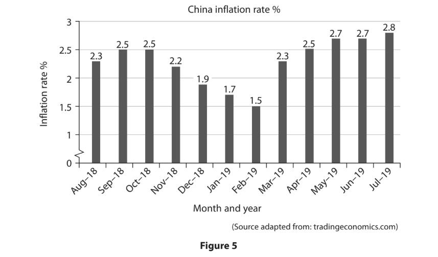
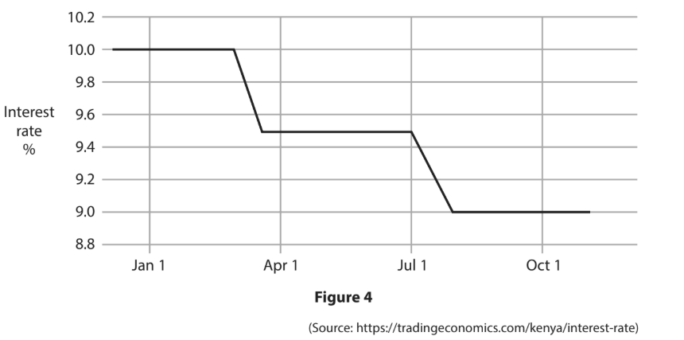
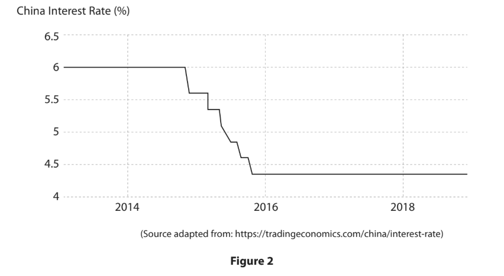
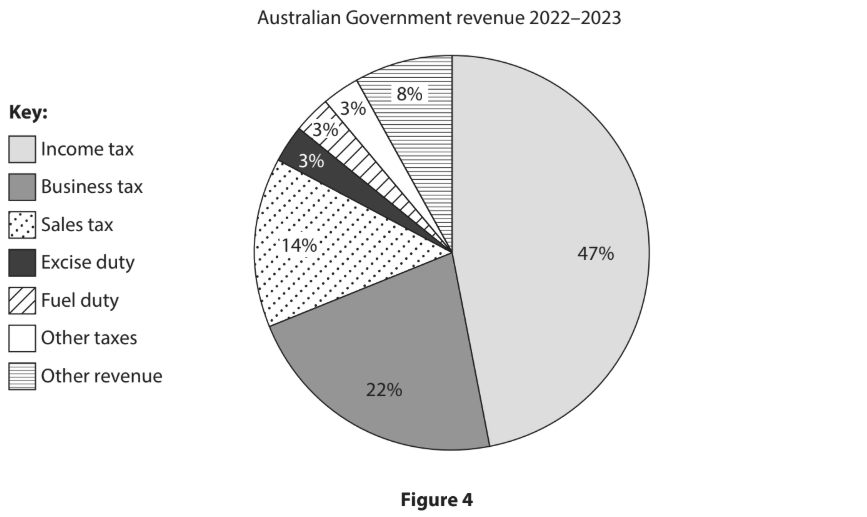
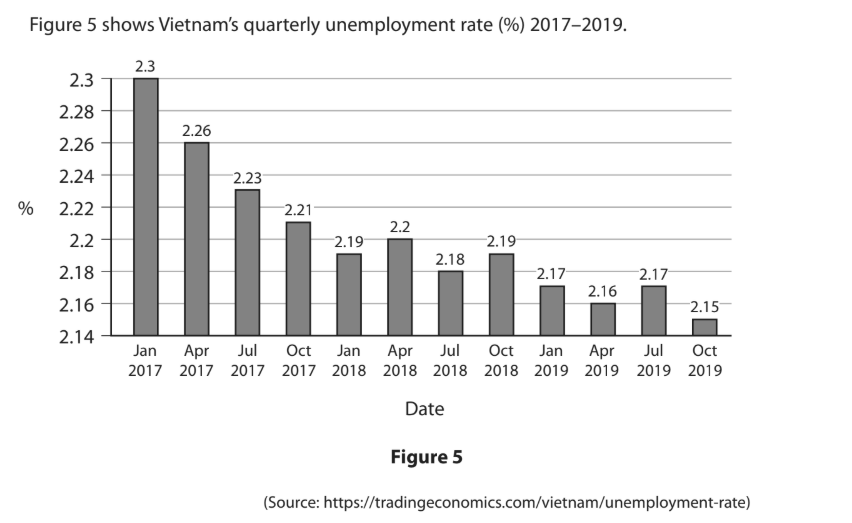
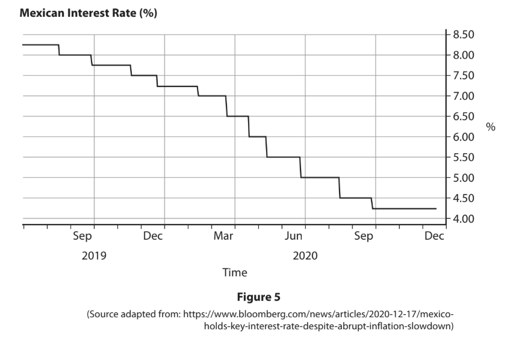
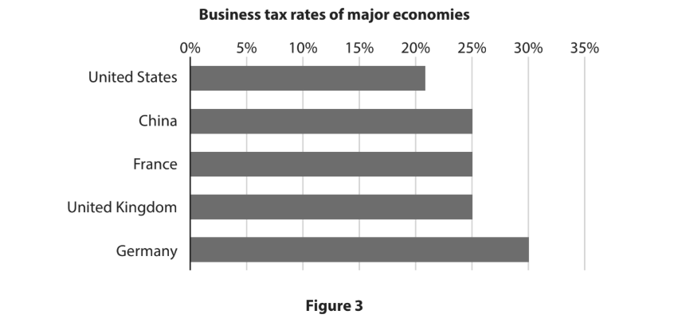

# Exam Questions — Government Policies
**Government & the Economy** · Edexcel IGCSE Economics (4EC1)
> Source: [https://www.savemyexams.com/igcse/economics/edexcel/17/topic-questions/government-and-the-economy/government-policies/exam-questions/](https://www.savemyexams.com/igcse/economics/edexcel/17/topic-questions/government-and-the-economy/government-policies/exam-questions/) · 48 questions · total 293 marks

## Q1 — easy — 2 marks · exam-questions

### 1((e)) — 2 marks — command: calculate — structured — from paper June 2024 · Paper 2
Figure 1 shows selected UK Government receipts from taxation in February 2023.

|   | £bn |
|---|---|
| Income tax | 20.0 |
| Sales tax (VAT/GST) | 14.3 |
| Business tax | 7.6 |
| Excise duties | 3.7 |
| Customs duties | 0.4 |

**Figure 1**

Calculate the** total amount of revenue** in £bn raised by direct taxes in February 2023. You are advised to show your working.

## Q2 — easy — 20 marks · exam-questions

### 4((a)) — 2 marks — command: calculate — structured — from paper June 2024 · Paper 2
Figure 5 shows the government revenue and expenditure for Canada in 2021–2022.

|   | Canadian dollars  CAD\$bn |
|---|---|
| **Total revenue** | 38.815 |
| **Total expenditure** | 35.897 |

**Figure 5**

Calculate the **fiscal deficit or surplus** in CAD\$bn for Canada in 2021–2022. You are advised to show your working.

### 4((b)) — 6 marks — command: analyse — structured — from paper June 2024 · Paper 2
In April 2023, the inflation rate in Canada fell to 5.2%. The Governor of the Bank of Canada, Tiff Macklem, said, “Interest rates may have to stay at 4.5% to ensure inflation declines to the Bank of Canada’s 2% target”.

With reference to the data above and your knowledge of economics, analyse the relationship between inflation and interest rates for a country such as Canada.

### 4((c)) — 12 marks — command: evaluate — structured — from paper June 2024 · Paper 2
In March 2023, the unemployment rate in Canada stayed at 5% for the fourth consecutive month. There are one million job vacancies and the country is suffering from structural unemployment. A quarter of these job vacancies are  for low skilled jobs.

To address these skills shortages, the Canadian Government is launching several new education and training programmes.

- **Skills for success:** Helping Canadians at all ability levels improve their foundation and transferable skills, such as digital skills.
- **Financial support for adult learners:** \$815m over five years which covers up to 50% of training fees.
- **Labour mobility improvements: **\$595m over six years to make it more affordable to travel to where the jobs are.

With reference to the data above and your knowledge of economics, evaluate the possible advantages of using education and training to reduce structural unemployment for a country such as Canada.

## Q3 — easy — 7 marks · exam-questions

### 1((c)) — 2 marks — command: what — structured — from paper June 2024 · Paper 2R
What is meant by the term monetary policy?

### 1((e)) — 2 marks — command: calculate — structured — from paper June 2024 · Paper 2R
Figure 1 shows selected UK Government receipts from taxation in February 2023.

|   | £bn |
|---|---|
| Income tax | 20.0 |
| Sales tax (VAT/GST) | 14.3 |
| Business taxes | 7.6 |
| Excise duties | 3.7 |
| Customs duties | 0.4 |

**Figure 1**

Calculate the** total amount of revenue** in £bn raised by indirect taxes in February 2023. You are advised to show your working.

### 1((g)) — 3 marks — command: explain — structured — from paper June 2024 · Paper 2R
In September 2022, the Indian Government deregulated the telecommunications sector. This included reducing the taxes and fees that telecom companies had to pay to the government and allowing more firms to enter the market.

Explain **one** advantage of deregulation for a country such as India.

## Q4 — easy — 1 marks · exam-questions

### 3((a)) — 1 mark — multiple_choice — from paper June 2024 · Paper 2R
A government has a total expenditure of €700bn and a total revenue of 800bn.

What is the fiscal deficit/surplus?
- **A.** €1500bn deficit
- **B.** €100bn deficit
- **C.** €1500bn surplus
- **D.** €100bn surplus

## Q5 — easy — 2 marks · exam-questions

### 2((d)) — 2 marks — command: what — structured — from paper Nov 2024 · Paper 2
What is meant by the term asset purchasing?

## Q6 — easy — 3 marks · exam-questions

### 1((b)) — 1 mark — multiple_choice — from paper Jan 2023 · Paper 2
Which **one **of the following is an example of a supply-side policy to increase output?
- **A.** Increasing income tax
- **B.** Increasing interest rates
- **C.** Increasing the school-leaving age
- **D.** Increasing business taxes

### 1((e)) — 2 marks — command: calculate — structured — from paper Jan 2023 · Paper 2
Figure 1 shows the income tax rates for the UK in 2020–2021. Sofia earns £35000 as a teacher. This means Sofia only pays 20% tax on £22500 of her salary.

| Taxable income | Tax rate (%) |
|---|---|
| 0 to £12500 | 0% |
| £12501 to £50000 | 20% |
| £50001 to £150000 | 40% |
| Over £150000 | 45% |

**Figure 1**

(Source: [https://www.gov.uk/income-tax-rates](https://www.gov.uk/income-tax-rates))

Calculate the **net pay** in £ for Sofia. You are advised to show your working.

## Q7 — easy — 8 marks · exam-questions

### 1((c)) — 2 marks — command: what — structured — from paper Jan 2023 · Paper 2R
What is meant by the term deregulation?

### 1((h)) — 6 marks — command: analyse — structured — from paper Jan 2023 · Paper 2R
In 2020, the Vietnamese Government aimed to have an additional 1 million people working in the Information Technology (IT) sector. Unemployed workers were offered IT training courses in colleges and IT centres across Vietnam.

Analyse the impact of education and training on the productive potential of a country such as Vietnam.

## Q8 — easy — 1 marks · exam-questions

### 2((b)) — 1 mark — multiple_choice — from paper Jan 2023 · Paper 2R
What would be the annual amount of interest earned on £7000 of savings if the interest rate was 3% per annum?
- **A.** £21
- **B.** £210
- **C.** £2333
- **D.** £7210

## Q9 — easy — 1 marks · exam-questions

### 1((b)) — 1 mark — multiple_choice — from paper Nov 2023 · Paper 2
Which **one **of the following describes a fiscal surplus?
- **A.** The value of imports is less than the value of exports
- **B.** The value of imports is greater than the value of exports
- **C.** Government revenue is less than government expenditure
- **D.** Government revenue is greater than government expenditure

## Q10 — easy — 7 marks · exam-questions

### 1((b)) — 1 mark — multiple_choice — from paper June 2022 · Paper 2
An increase in which **one **of the following would be most likely to encourage saving?
- **A.** Interest rate
- **B.** Income tax rate
- **C.** Exchange rate
- **D.** Indirect tax rate

### 1((h)) — 6 marks — command: analyse — structured — from paper June 2022 · Paper 2
The rate of Value Added Tax (VAT), a type of indirect taxation in the UK, is 20%.

With reference to the data above and your knowledge of economics, analyse how a reduction in indirect taxation is likely to affect the standard of living in a country such as the UK.

## Q11 — easy — 7 marks · exam-questions

### 3((a)) — 1 mark — multiple_choice — from paper June 2022 · Paper 2
Which **one **of the following is an example of deregulation?
- **A.** Introducing a national minimum wage rate
- **B.** More health and safety laws
- **C.** Introducing licences for firms to operate
- **D.** More firms allowed to enter a market

### 3((d)) — 6 marks — command: analyse — structured — from paper June 2022 · Paper 2
Nauru is a tiny island country in Micronesia, northeast of Australia. It has a population of 10,824. In 2019, Nauru had a fiscal surplus of 16.1% of GDP.

With reference to the data above and your knowledge of economics, analyse the benefits of having a fiscal surplus for a country such as Nauru.

## Q12 — easy — 14 marks · exam-questions

### 4((a)) — 2 marks — command: calculate — structured — from paper June 2022 · Paper 2
Figure 4 shows the \$618bn spent by India on existing infrastructure projects in 2019.

| Existing infrastructure projects | \$bn |
|---|---|
| Renewable energy | 200 |
| Railways | 147 |
| Roads and highways | 109 |
| Metro rail | 109 |
| Smart cities | 32 |
| Airports and ports | 21 |
| **Total** | **618** |

**Figure 4**

(Source adapted from: [https://www.businessinsider.in/Nearly-half-of-Narendra-Modis-1-4-](https://www.businessinsider.in/Nearly-half-of-Narendra-Modis-1-4-)trillion-new-infrastructure-promise-may-be-already-approved-projects/Existing-promises/ slideshow/68795905.cms)

Calculate, to two decimal places, **the percentage** of spending on all existinginfrastructure projects that was spent on renewable energy in India in 2019. You are advised to show your working.

### 4((c)) — 12 marks — command: evaluate — structured — from paper June 2022 · Paper 2
The growth of India’s gross domestic product (GDP) slowed to 4.5% in the quarter ending September 2019, the lowest point for 6 years. The fiscal deficit was 3.4% of GDP and was estimated to increase to 3.7% by 2020. This came at a time when the Prime Minister, Narendra Modi, announced plans to spend \$1.5 trillion on infrastructure. The expenditure on these projects is expected to be 1.1% of GDP by 2025.

“Building new roads, rail links, airports and other social and economic infrastructure such as smart cities is essential for attracting investments and making India a \$5 trillion economy,” said Finance Minister Nirmala Sitharaman.

This spending on infrastructure will be a huge opportunity for Indian construction, road and cement companies such as GMR Group, Dilip Buildcon and Ultratech. Domestic steel prices are predicted to increase due to the higher demand from  infrastructure projects.

Source adapted from: [https://www.bloomberg.com/news/articles/2019-12-31/india-plans-1-](https://www.bloomberg.com/news/articles/2019-12-31/india-plans-1-) 5-trillion-infrastructure-spending-to-spur-growth

With reference to the data above and your knowledge of economics, evaluate the effectiveness of spending on infrastructure to increase total output in a country such as India.

## Q13 — easy — 12 marks · exam-questions

### 2((b)) — 1 mark — multiple_choice — from paper June 2022 · Paper 2R
Which **one **of the following is a role of a central bank?
- **A.** Investing in firms
- **B.** Raising taxes
- **C.** Asset purchasing
- **D.** Lending money to individuals

### 2((d)) — 2 marks — command: what — structured — from paper June 2022 · Paper 2R
What is meant by the term fiscal surplus?

### 2((g)) — 9 marks — command: assess — structured — from paper June 2022 · Paper 2R
The local government in Alberta, Canada, is doubling its infrastructure budget for 2020–2021 to Canadian \$1.9bn to try to prevent job losses. Alberta had lost 117,000 jobs in March 2020, bringing the unemployment rate to 8.7%.

The additional funding will go towards repairing roads, bridges and upgrading technology in schools and universities.

(Source: [https://edmontonjournal.com/news/politics/covid-19-jason-kenney-announces-](https://edmontonjournal.com/news/politics/covid-19-jason-kenney-announces-) infrastructure-spending-to-counter-job-losses/)

With reference to the data above and your knowledge of economics, assess the effectiveness of infrastructure spending to reduce unemployment in a country such as Canada.

## Q14 — easy — 2 marks · exam-questions

### 1((e)) — 2 marks — command: calculate — structured — from paper June 2021 · Paper 2
Figure 1 shows the government revenue and expenditure in rupees crore for India in 2019–2020.

|   | Indian rupees crore (Rs) |
|---|---|
| Total revenue | 2 080 201 |
| Total expenditure | 2 784 200 |

**Figure 1**

Calculate the **fiscal surplus/deficit in Indian rupees crore (Rs)** for India in 2019–2020. You are advised to show your working.

## Q15 — easy — 1 marks · exam-questions

### 3((a)) — 1 mark — multiple_choice — from paper June 2021 · Paper 2
Figure 3 shows selected UK Government receipts from taxation in 2019.

|   | £bn |
|---|---|
| Sales tax (VAT) | 186.3 |
| Income tax | 268.3 |
| Tariffs | 31.9 |
| Business tax | 53.4 |

**Figure 3**

What is the total amount of revenue raised by indirect taxes?
- **A.** £454.6bn
- **B.** £321.7bn
- **C.** £218.2bn
- **D.** £85.3bn

## Q16 — easy — 14 marks · exam-questions

### 4((a)) — 2 marks — command: calculate — structured — from paper June 2021 · Paper 2
Zhang Li had 8000 Yuan (¥) in her savings account. The annual interest rate for this savings account was 2.25%.

Calculate how much** interest, in Yuan (¥)**, Zhang Li received in one year. You are advised to show your working.

### 4((c)) — 12 marks — command: evaluate — structured — from paper June 2021 · Paper 2
Since March 2019 the overall inflation rate for China has been above 2%. In July 2019, China’s food prices increased by 9.1% from the previous year. In particular, meat prices rose by 27% due to the spread of infectious animal diseases. At the same time fresh fruit prices rose by 39.1% as the Chinese fruit supply had been affected by severe weather.

China’s central bank is called the People’s Bank of China (PBOC). The PBOC has the responsibility of maintaining price stability and promoting growth through the management of monetary policy.

With reference to the data above and your knowledge of economics, evaluate the effectiveness of monetary policy in controlling inflation in a country such as China.

## Q17 — easy — 7 marks · exam-questions

### 1((b)) — 1 mark — multiple_choice — from paper Nov 2021 · Paper 2
Which **one **of the following names is given to the government policy that aims to increase the productive capacity of the economy?
- **A.** Trade
- **B.** Fiscal
- **C.** Supply-side
- **D.** Exchange rate

### 1((h)) — 6 marks — command: analyse — structured — from paper Nov 2021 · Paper 2
Kenya’s annual inflation rate increased to 6.27% in July 2019 from 5.7% in the previous month. Kenya’s central bank base rate for July was 9%.

With reference to the data above and your knowledge of economics, nalyse how monetary policy can be used to control inflation in a country such as Kenya.

## Q18 — easy — 2 marks · exam-questions

### 2((d)) — 2 marks — command: what — structured — from paper Nov 2021 · Paper 2
What is meant by the term fiscal policy?

## Q19 — easy — 1 marks · exam-questions

### 3((a)) — 1 mark — multiple_choice — from paper Nov 2021 · Paper 2
Figure 3 shows selected UK Government receipts from taxation in 2019.

|   | £bn |
|---|---|
| Sales tax (VAT) | 186.3 |
| Income tax | 268.3 |
| Tariffs | 31.9 |
| Business tax | 53.4 |

**Figure 3**

What is the total amount of revenue raised by direct taxes?
- **A.** £454.6bn
- **B.** £321.7bn
- **C.** £218.2bn
- **D.** £85.3bn

## Q20 — easy — 2 marks · exam-questions

### 1((d)) — 2 marks — command: what — structured — from paper Jan 2020 · Paper 2
What is meant by the term trade-off?

## Q21 — easy — 1 marks · exam-questions

### 2((b)) — 1 mark — multiple_choice — from paper Jan 2020 · Paper 2
To improve the standard of living, which **one **of the following is a government likely to reduce?
- **A.** Welfare payments
- **B.** Subsidies for housing
- **C.** Education
- **D.** Indirect taxes

## Q22 — easy — 16 marks · exam-questions

### 3((a)) — 1 mark — multiple_choice — from paper Jan 2020 · Paper 2
A fiscal surplus occurs when
- **A.** a country exports more than it imports
- **B.** government revenue is greater than government expenditure
- **C.** a country imports more than it exports
- **D.** government expenditure is greater than government revenue

### 3((d)) — 6 marks — command: analyse — structured — from paper Jan 2020 · Paper 2
In November 2018, the South African Monetary Policy Committee decided to increase interest rates by 0.25% to 6.75%. This decision affected the currency of South Africa, the Rand.

Analyse the likely impact of an increase in interest rates on the currency of South Africa.

### 3((e)) — 9 marks — command: assess — structured — from paper Jan 2020 · Paper 2
US President Donald Trump introduced lower business taxes in the hope of making the US more competitive globally. In 2017, business taxes in the US were 35% and a new lower rate of 21% was introduced in 2018. Donald Trump has plans to lower this to 15% in the future.

With reference to the data above and your knowledge of economics, assess the likely effectiveness of lower business taxes in stimulating investment in a country such as the US.

## Q23 — easy — 8 marks · exam-questions

### 4((a)) — 2 marks — command: calculate — structured — from paper Jan 2020 · Paper 2
Figure 4 shows Kenya’s interest rate (%) from January to October 2018.

Calculate the **percentage chang**e in Kenya’s interest rate between January and October 2018. You are advised to show your working.

### 4((b)) — 6 marks — command: analyse — structured — from paper Jan 2020 · Paper 2
The annual rate of inflation in Kenya was 5.7% in September 2018 and fell to 5.53% in October 2018.

Analyse how monetary policy could be used to further reduce the rate of inflation in Kenya.

## Q24 — easy — 1 marks · exam-questions

### 3((a)) — 1 mark — multiple_choice — from paper Jan 2020 · Paper 2R
Which **one **of the following policies is most likely to reduce the rate of inflation?
- **A.** Lower interest rates
- **B.** Increased money supply
- **C.** Higher government spending
- **D.** Higher taxation

## Q25 — easy — 1 marks · exam-questions

### 2((b)) — 1 mark — multiple_choice — from paper Nov 2020 · Paper 2
Which supply-side policy involves the removal of government controls?
- **A.** Deregulation
- **B.** Education and training
- **C.** Lower business taxes
- **D.** Infrastructure spending

## Q26 — easy — 10 marks · exam-questions

### 3((a)) — 1 mark — multiple_choice — from paper Nov 2020 · Paper 2
Which **one **of the following is likely to be a trade-off as a result of increased economic growth?
- **A.** Increased employment
- **B.** Increased inflation
- **C.** Higher standards of living
- **D.** Higher fiscal surplus

### 3((e)) — 9 marks — command: assess — structured — from paper Nov 2020 · Paper 2
China’s central bank has recently eased monetary policy due to slowing in economic growth. This included bringing down interest rates to 4.35%.

With reference to the data above and your knowledge of economics, assess the likely effectiveness of monetary policy in increasing economic growth for a country such as China.

## Q27 — easy — 8 marks · exam-questions

### 4((a)) — 2 marks — command: calculate — structured — from paper Nov 2020 · Paper 2
Figure 3 shows the government revenue and expenditure (€m) for Estonia in 2018.

| 2018 | €m |
|---|---|
| Government revenue | 8119601 |
| Government expenditure | 8197243 |
| Fiscal surplus/deficit |   |

(Source adapted from: [https://www.stat.ee/53721](https://www.stat.ee/53721))

**Figure 3**

Calculate in €m the** fiscal surplus/deficit **for Estonia in 2018. You are advised to show your working.

### 4((b)) — 6 marks — command: analyse — structured — from paper Nov 2020 · Paper 2
Estonia’s annual inflation rate increased to 4.4% in October 2018.

Analyse how the Estonian Government might use fiscal policy to control inflation.

## Q28 — easy — 4 marks · exam-questions

### 1((c)) — 2 marks — command: what — structured — from paper Nov 2020 · Paper 2R
What is meant by the term central bank?

### 1((e)) — 2 marks — command: calculate — structured — from paper Nov 2020 · Paper 2R
Figure 1 shows the income tax rates for Cyprus in 2018. George earns €21000 as a manager. This means George only pays tax on €1500.

Calculate the** net pay** in euros (€) for George. You are advised to show your working.

## Q29 — easy — 14 marks · exam-questions

### 2((d)) — 2 marks — command: what — structured — from paper Nov 2020 · Paper 2R
What is meant by the term infrastructure?

### 2((e)) — 3 marks — command: explain — structured — from paper Nov 2020 · Paper 2R
In 2018 the average number of job seekers in Germany decreased by 0.5% to 5.2% and was lower than at any time since 1991.

Explain **one **impact of falling unemployment rates on tax revenue for a country such as Germany.

### 2((g)) — 9 marks — command: assess — structured — from paper Nov 2020 · Paper 2R
In May 2018, South Korea’s unemployment rate for people aged 15–29 increased to 11.6%. In several global competitiveness reports South Korea has recently been criticised for having too many rules and regulations. Experts have advised the South Korean Government to reduce some employment regulations for service sectors such as finance, transport and tourism in order to create more jobs.

With reference to the data above and your knowledge of economics, assess the effectiveness of deregulation in reducing unemployment in South Korea.

## Q30 — easy — 1 marks · exam-questions

### 3((b)) — 1 mark — multiple_choice — from paper Nov 2020 · Paper 2R
Monetary policy would involve changes in which one of the following?
- **A.** Government spending
- **B.** Interest rates
- **C.** Taxation
- **D.** Balance of payments

## Q31 — easy — 2 marks · exam-questions

### 4((a)) — 2 marks — command: calculate — structured — from paper Nov 2020 · Paper 2R
Figure 3 shows the amount the US spent on education in 2017–2018.

| Fiscal Year | \$bn |
|---|---|
| 2017 | 68 |
| 2018 | 59 |

(Source adapted from: [https://www2.ed.gov/about/overview/budget/budget18/summary/18summary.pdf](https://www2.ed.gov/about/overview/budget/budget18/summary/18summary.pdf))

**Figure 3**

Calculate to two decimal places the **percentage change** in the amount spent on education in the US from 2017–2018. You are advised to show your working.

## Q32 — easy — 10 marks · exam-questions

### 1((c)) — 2 marks — command: what — structured — from paper June 2019 · Paper 2
What is meant by the term interest rate?

### 1((d)) — 2 marks — command: describe — structured — from paper June 2019 · Paper 2
Describe **one **impact on consumers of a decrease in interest rates.

### 1((h)) — 6 marks — command: analyse — structured — from paper June · 2019
In January 2018, Australia had an unemployment rate of 5.5%.

Analyse how the Australian government might reduce unemployment by using fiscal policy.

## Q33 — easy — 2 marks · exam-questions

### 2((d)) — 2 marks — command: what — structured — from paper June 2019 · Paper 2
What is meant by the term supply-side policy?

## Q34 — easy — 1 marks · exam-questions

### 2((b)) — 1 mark — multiple_choice — from paper June 2019 · Paper 2R
What is the name of the policy that focuses on interest rate changes?
- **A.** Deregulation
- **B.** Exchange rate
- **C.** Monetary
- **D.** Fiscal

## Q35 — easy — 1 marks · exam-questions

### 3((b)) — 1 mark — multiple_choice — from paper June 2019 · Paper 2R
Which **one **of the following is an example of an indirect tax?
- **A.** Inheritance tax
- **B.** Income tax
- **C.** Business tax
- **D.** Value added tax

## Q36 — medium — 3 marks · exam-questions

### 2((e)) — 3 marks — command: explain — structured — from paper June 2024 · Paper 2R
In March 2020, the European Central Bank (ECB) purchased €1.85 trillion worth of assets including government bonds and corporate bonds.

Explain **one **benefit of asset purchasing by a central bank such as the ECB.

## Q37 — medium — 12 marks · exam-questions

### 3((c)) — 3 marks — command: explain — structured — from paper Nov 2024 · Paper 2
In March 2023, as part of its supply‐side policy, the Italian Government announced business taxes would be reduced from 27% to 24% in January 2024.

Explain the likely impact on productivity of this change in business taxes for a country such as Italy.

### 3((e)) — 9 marks — command: assess — structured — from paper Nov 2024 · Paper 2
Australia has a progressive income tax system. Individuals are allowed to earn \$18200 before paying any tax. The rate of tax payable increases as income gets higher. In recent years, income tax has been the fastest growing source of government revenue in Australia.

With reference to the data above and your knowledge of economics, assess whether income tax is a reliable source of government revenue for a country  such as Australia.

## Q38 — medium — 3 marks · exam-questions

### 1((g)) — 3 marks — command: explain — structured — from paper June 2022 · Paper 2R
In March 2020, the Bank of England reduced interest rates from 0.75% to 0.10%. This decision affected the UK pound (£).

Explain the likely impact of a decrease in UK interest rates on the UK pound (£).

## Q39 — medium — 3 marks · exam-questions

### 2((e)) — 3 marks — command: explain — structured — from paper Jan 2020 · Paper 2R
India set a target for its fiscal deficit of 3.3% of its GDP for the year ending March 2019.

Explain **one **reason why the Indian Government’s fiscal deficit is likely to stimulate economic growth.

## Q40 — medium — 6 marks · exam-questions

### 3((d)) — 6 marks — command: analyse — structured — from paper Nov 2023 · Paper 2
In December 2022, the US Federal Reserve raised interest rates for the seventh time that year to 4.5%, its highest level in 15 years. Interest rates are predicted to increase to 5.25% by the end of 2023.

With reference to the data above and your knowledge of economics, analyse how monetary policy can help to reduce inflation in a country such as the US.

## Q41 — medium — 6 marks · exam-questions

### 4((b)) — 6 marks — command: analyse — structured — from paper June 2022 · Paper 2R

With reference to the data above and your knowledge of economics, analyse the impact of falling unemployment rates on tax revenues for a country such as Vietnam.

## Q42 — medium — 6 marks · exam-questions

### 1((h)) — 6 marks — command: analyse — structured — from paper Jan 2020 · Paper 2R
Vietnam has progressive income tax rates that range from 5% to 35% depending on income.

Analyse how a reduction in direct taxation is likely to affect the standard of living in a country such as Vietnam.

## Q43 — medium — 6 marks · exam-questions

### 1((h)) — 6 marks — command: analyse — structured — from paper June 2019 · Paper 2R
The Government of Singapore had a fiscal surplus of 1.3% of GDP in 2016 and it is expected to have a 0.4% of GDP surplus in 2017.

Analyse the impact of a fiscal surplus on a country such as Singapore.

## Q44 — hard — 9 marks · exam-questions

### 3((e)) — 9 marks — command: assess — structured — from paper Jan 2023 · Paper 2
The number of unemployed people in Spain reached 4 million in February 2021. This was a rise of 44,436 people from the previous month and was the highest level since May 2016. This was the fifth monthly increase in unemployment. The sectors most affected included tourism and commerce. The only sector that made a recovery was construction.

With reference to the data above and your knowledge of economics, assess the likely benefits of lowering taxes to reduce unemployment for a country such as Spain.

## Q45 — hard — 12 marks · exam-questions

### 4((c)) — 12 marks — command: evaluate — structured — from paper Jan 2023 · Paper 2
In December 2020, Mexico had its biggest fall in GDP for nearly 100 years. Its GDP fell by 9.3% compared to 2019. Inflation was at 3.3% and had exceeded its target rate of 3% in August and October 2020.

Mexico's central bank kept its interest rate at 4.25% in December 2020. This followed 11 reductions in interest rates and the central bank said it needed time to assess the country's economic situation.

With reference to the data above and your knowledge of economics, evaluate the effectiveness of monetary policy in increasing total output in a country such as Mexico.

## Q46 — hard — 12 marks · exam-questions

### 4((c)) — 12 marks — command: evaluate — structured — from paper Jan 2023 · Paper 2R
The Egyptian economy is expected to grow between 2.8% and 4% in the financial year 2020–2021. Even higher levels of economic growth are forecast for the following year.

Unemployment rates have fallen to 7.3% in the third quarter of 2020 from 7.8% in 2019. Egypt's annual inflation rate increased to 6.3% in 2020, up from 2.7% in 2019.

(Source adapted from: [https://www.arabnews.com/node/1770221/business-economy](https://www.arabnews.com/node/1770221/business-economy))

With reference to the data above and your knowledge of economics, evaluate the extent to which fiscal policy can be used to control inflation in a country  such as Egypt.

## Q47 — hard — 9 marks · exam-questions

### 2((g)) — 9 marks — command: assess — structured — from paper Nov 2023 · Paper 2
In April 2023, the UK Government increased the business tax rate from 19% to 25%. The higher rate is expected to raise around £18bn in additional tax revenue per year. The change brings the UK’s business tax rate to the same rate as other large economies.

Due to this tax change, Associated British Foods, the owner of Primark and other firms, is expected to pay an additional £20m in tax per year.

With reference to the data above and your knowledge of economics, assess the disadvantages of higher business tax rates on investment in a country such as the UK.

## Q48 — hard — 12 marks · exam-questions

### 4((c)) — 12 marks — command: evaluate — structured — from paper Jan 2020 · Paper 2R
A report by accountancy firm PwC said that the UK could boost its GDP by around £40bn a year if it reduces the number of young people who are not in education, employment or training. The UK only ranks 19th out of 35 countries on this latest report, with Germany performing the best in the EU.

John Hawksworth, chief economist at PwC UK, comments, “Employers need to work with universities, schools and other educational providers to ensure young people have the skills they need for the age of automation. They also need to help in retraining older workers to adapt to these new technologies”.

With reference to the data above and your knowledge of economics, evaluate whether an increase in education and training is the most effective way to reduce unemployment for a country such as the UK.
