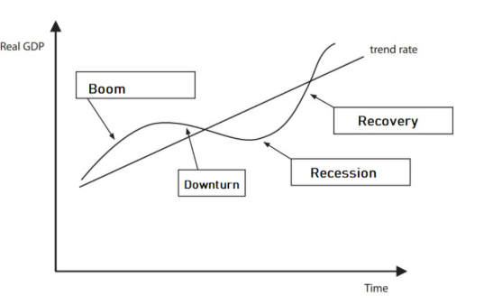
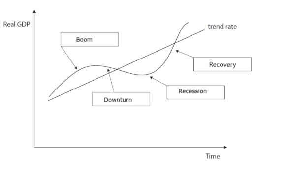
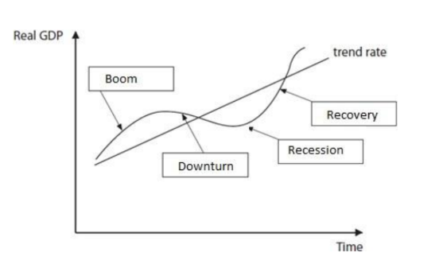
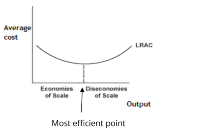
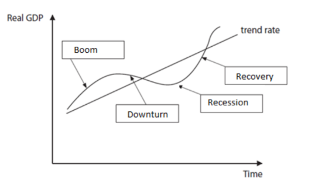

# Mark Schemes — The Macroeconomic Objectives
**Government & the Economy** · Edexcel IGCSE Economics (4EC1)

## Q1 — easy — 8 marks · exam-questions

### 1((b)) — 1 marks
**Correct answer: B** — Total value of goods and services produced within an economy

**Final answer:** **The correct answer is B**

GDP measures the total value of the goods and services **produced** within an economy over a period of time, which is why it is used as the measure of economic growth

**A** is incorrect as GDP measures production rather than the value of goods traded, and trading an existing item does not add to output

**C** is incorrect as exports are only one part of what an economy produces, the rest is sold at home

**D** is incorrect as imports are produced in other countries, so their value is not part of this country's GDP

### 1((c)) — 2 marks
The current account is a record of all a country's transactions with the rest of the world** [1]** relating to international trade, in which the value of its exports and imports of goods and services is recorded** [1]**

**[2 marks]**

> **[mark-scheme]**
> Award up to 2 marks for a correct definition, 1 mark for reference to a record of transactions and 1 mark for reference to international trade or to exports and imports
> 
> Accept any other correct and appropriate wording

### 1((d)) — 2 marks
One way is air pollution** [1]**, because factories burning fossil fuels release large quantities of greenhouse gases and other emissions into the atmosphere as they produce goods** [1]**

**[2 marks]**

> **[mark-scheme]**
> Award 1 mark for reference to a way and 1 mark for development of that way
> 
> Accept any other appropriate response, e.g. water pollution (1) where waste from production is discharged into rivers and seas (1), noise pollution (1) from machinery and transport disturbing nearby residents (1), or visual pollution (1) where industrial buildings and waste spoil the landscape (1)

> **[exam-tip]**
> - Name a **type** of pollution rather than writing 'pollution', examiner reports on this course are consistent that the general word on its own is not rewarded
> - Give one way and develop it, listing several types cannot earn the second mark

### 1((g)) — 3 marks
One reason is that growth raises the demand for goods and services** [1]**, because incomes rise as an economy expands and households spend more** [1]**, so when supply cannot keep up, as happened globally in 2021, buyers compete for the goods available and prices are bid up, which is demand-pull inflation** [1]**

**[3 marks]**

> **[mark-scheme]**
> Award 1 mark for identifying a relevant reason
> 
> Award 1 mark for developing the reason
> 
> Award 1 mark for the response being in context
> 
> **Alternative content**
> 
> The answer above is just one example of a response to this question. Other reasons could include:
> 
> - Rapid growth means firms compete for scarce resources and labour, pushing up costs and causing cost-push inflation
> - An economy growing beyond its productive capacity overheats, so the extra demand shows up in prices rather than in output
> 
> Accept any other appropriate response

> **[exam-tip]**
> - Name the type of inflation you are explaining, demand-pull or cost-push, it shows the examiner which mechanism you are using
> - The stem tells you inflation followed 'problems with the supply of goods', so build the mismatch between demand and supply into the chain

## Q2 — easy — 8 marks · exam-questions

### 2((b)) — 1 marks
**Correct answer: D** — Cyclical

**Final answer:** **The correct answer is D**

Cyclical unemployment rises and falls with the business cycle, because a downturn reduces total demand, so firms need fewer workers and lay staff off until demand recovers

**A** is incorrect as structural unemployment arises from a mismatch between workers' skills and the jobs available

**B** is incorrect as seasonal unemployment is caused by demand for labour varying at different times of the year

**C** is incorrect as frictional unemployment affects workers who are between jobs or moving to a new career

### 2((c)) — 1 marks
**Falling output and lower GDP****[1 mark]**

> **[mark-scheme]**
> Award 1 mark for one possible impact
> 
> Accept any other appropriate response, e.g. a leakage from the economy, difficulty finding the foreign currency reserves needed to fund the deficit, inflationary pressure, or rising unemployment

### 2((e)) — 3 marks
One way is that progressive taxation funds support for those on the lowest incomes** [1]**, because US earners on the highest incomes pay 37% while those on low incomes pay only 10%, so most of the revenue comes from the wealthy** [1]**, and that revenue pays for unemployment benefits, healthcare and education which raise the living standards of Americans who are struggling financially** [1]**

**[3 marks]**

> **[mark-scheme]**
> Award 1 mark for identifying a relevant way
> 
> Award 1 mark for developing the way
> 
> Award 1 mark for the response being in context
> 
> **Alternative content**
> 
> The answer above is just one example of a response to this question. Other ways could include:
> 
> - It narrows the income gap directly, since taking a larger proportion from high earners leaves a smaller burden on those with low incomes
> - A low starting rate of 10% means low-paid work still pays, which encourages people into employment rather than leaving them dependent on benefits
> 
> Accept any other appropriate response

> **[exam-tip]**
> - The context mark comes from the figures, using the 10% and 37% rates shows exactly what makes the system progressive
> - Take the chain to the point where poverty falls, an answer that stops at 'the rich pay more tax' has not explained how that helps the poorest

### 2((f)) — 3 marks

**[3 marks]**

> **[mark-scheme]**
> Award 1 mark for boom, labelled
> 
> Award 1 mark for downturn, labelled
> 
> Award 1 mark for recovery, labelled

> **[exam-tip]**
> - Recession is already given, so work back and forward from it: output peaks in the **boom**, slows through the **downturn** into that recession, then rises again in the **recovery**
> - The specification requires you to be able to annotate the economic cycle on a diagram, not only describe it in words, so practise labelling the curve itself
> - Put each label against the correct section of the curve, a label in the wrong box earns nothing even if the four names are all present

## Q3 — easy — 1 marks · exam-questions

### 1((b)) — 1 marks
**Correct answer: C** — Unemployment caused by individuals choosing not to work

**Final answer:** **The correct answer is C**

Voluntary unemployment is where people are able to work but choose not to take the jobs available, often because the pay on offer is close to what they receive without working

**A** is incorrect as unemployment caused by a lack of demand for a particular skill is structural unemployment

**B** is incorrect as unemployment caused by changes in the business cycle is cyclical unemployment

**D** is incorrect as unemployment caused by seasonal fluctuations in the demand for labour is seasonal unemployment

## Q4 — easy — 13 marks · exam-questions

### 2((a)) — 1 marks
**Correct answer: B** — Number of unemployed/Total labour force × 100

**Final answer:** **The correct answer is B**

The unemployment rate measures the proportion of people available for work who cannot find it, so the number unemployed is divided by the total labour force and multiplied by 100

**A** is incorrect as dividing the labour force by the total population gives the labour force participation rate, not the unemployment rate

**C** is incorrect as dividing the number employed by the labour force gives the employment rate, the opposite measure

**D** is incorrect as dividing by the total population includes children, students and retired people who are not part of the labour force, so it understates the rate

### 2((c)) — 1 marks
**An improvement in the quality of domestic goods****[1 mark]**

> **[mark-scheme]**
> Award 1 mark for one possible reason
> 
> Accept any other appropriate response, e.g. poorer quality foreign goods, a lower price of domestic goods, a higher price of foreign goods, a depreciating exchange rate, or the value of exports being greater than the value of imports

### 2((d)) — 2 marks
Relative poverty is where a household's standard of living is below** [1]** the typical living standards of the society in which it lives** [1]**

**[2 marks]**

> **[mark-scheme]**
> Award up to 2 marks for a correct definition, 1 mark for reference to standard of living and 1 mark for reference to typical standards in that society
> 
> Accept any other correct and appropriate wording

> **[exam-tip]**
> - Examiner reports on this course record candidates confusing relative poverty with **absolute** poverty and scoring nothing as a result. Relative poverty compares a household with others in the same country, absolute poverty is about being unable to afford the basics of survival at all
> - Where the EU measure is used, marks are given for reference to 60% of the **median** income, not the average income

### 2((g)) — 9 marks
Recovery is the phase of the economic cycle that follows a downturn, in which economic activity increases again.** [K]** China grew by only 3% in 2022 but exports rose 14.8% in 2023 and the services and construction sectors reached a 12-year high by March,** [Ap]** so firms in those sectors are producing more and need more workers to do it.** [An]** Because the demand for labour is derived from the demand for what workers produce, rising orders lead directly to recruitment, so unemployment falls. Recovery also feeds on itself,** [An]** since newly employed workers have incomes to spend, consumer confidence rises and the extra spending creates further jobs, and improving conditions encourage people to start businesses of their own, which creates employment for others too.

However, firms will only hire if they believe the recovery will last.** [Ev]** The extract says China's export recovery is expected to be temporary because interest rate rises in many economies are likely to weaken global demand,** [Ap]** so employers may meet the current orders with overtime and temporary contracts rather than permanent jobs, and unemployment would barely fall.** [An]** The 5% growth target may not be met at all. Firms may also use the improving conditions to invest in automation rather than labour, replacing jobs with machines,** [An]** and because some sectors recover faster than others, workers whose skills belong to the slower ones remain structurally unemployed even while services and construction are booming.

**[9 marks]**

> **[mark-scheme]**
> This is a ‘levelled response’ question
> 
> - **[Ap]** = application to the data given  (3 marks)
> - **[An]** = analysis / chain of reasoning (3 marks)
> - **[Ev]** = evaluation (3 marks)
> 
> Although there are no separate **[K] marks**, both application and analysis must be built on **clear and accurate economic knowledge and understanding**
> 
> Therefore, each KAA paragraph should follow:
> 
> - Valid knowledge point → Application → Analysis
> - Each valid point made in the answer does not equal a mark, the response is judged holistically against the level descriptors
> 
> **Mark allocation**
> 
> A 9 mark (Level 3) answer will include examples which demonstrate:
> 
> - **Application [Ap]** — clear knowledge and understanding by developing relevant points. Appropriate application of economic terms, concepts, theories and calculations
> - **Analysis [An]** — Information presented will demonstrate excellent selectivity and organisation. Interpretation of economic information will be excellent, with a thorough analysis of issues
> - **Evaluation [Ev]** — Offers more than one viewpoint. The argument is well balanced and coherent, leading to an evaluation that demonstrates full understanding and awareness
> 
> **Alternative content**
> 
> The answer above is just one example of how to respond to this question. Additional information which could be used in the answer includes:
> 
> - Rising consumer confidence during a recovery increases spending, which stimulates further job creation
> - More people may start their own firms as conditions improve, creating jobs for themselves and others
> - On the other side, firms uncertain about the sustainability of the recovery may hold off recruiting altogether
> - Any other relevant and valid analysis is acceptable

> **[exam-tip]**
> - The strongest counter-argument is handed to you in the extract, the recovery is 'expected to be temporary' because of weaker global demand, so firms may not commit to permanent hiring
> - Use the figures, 3% growth in 2022, exports up 14.8%, the 12-year high and the 5% target all earn application marks
> - No conclusion is required at 9 marks, but both sides must be developed to matching depth

## Q5 — easy — 4 marks · exam-questions

### 3((b)) — 1 marks
**Correct answer: B** — The cost of updates to the website due to higher prices for shoes

**Final answer:** **The correct answer is B**

Menu costs are the costs a firm faces in changing its prices during a period of inflation, and for an online shop that means the work of updating the website every time prices rise

**A** is incorrect as the cost of raw materials is a cost of production, which the firm pays whatever is happening to prices

**C** is incorrect as the cost to consumers of looking for the lowest price describes shoe leather costs, not menu costs

**D** is incorrect as shipping and handling fees are a cost of selling online rather than a cost of changing prices

### 3((c)) — 3 marks

**[3 marks]**

> **[mark-scheme]**
> Award 1 mark for boom, labelled
> 
> Award 1 mark for downturn, labelled
> 
> Award 1 mark for recession, labelled. Slump or depression is accepted in place of recession

> **[exam-tip]**
> - Recovery is already given, so continue round the curve from there: output rises to its peak in the **boom**, slows through the **downturn**, then falls in the **recession**
> - Examiner reports confirm that 'slump' and 'depression' are accepted alternatives to recession, but boom and downturn have no substitutes
> - The specification requires you to be able to annotate the economic cycle on a diagram, not only describe it in writing

## Q6 — easy — 7 marks · exam-questions

### 3((b)) — 1 marks
**Correct answer: B** — £1300

**Final answer:** **The correct answer is B**

The index rose from 120 to 130, an increase of 10 ÷ 120 × 100 = 8.33%, and £1,200 increased by 8.33% is £1,300. The same answer comes from £1,200 × (130 ÷ 120)

**A** is incorrect as £1,210 is £1,200 with the change in the index added to it as if it were pounds, but 10 is a change in index points, not a price

**C** is incorrect as £1,330 is £1,200 + 130, which adds the whole index value to the price

**D** is incorrect as £1,450 adds both index numbers to the original price

### 3((d)) — 6 marks
Regulations are rules made by a government to control how firms and individuals behave, and they protect the environment by setting a legal limit rather than relying on firms to act voluntarily.** [K]** The Clean Air Act sets air quality standards in the US and regulates the emissions produced by cars, trucks and buses,** [Ap]** so every vehicle sold must meet a maximum level of pollution per mile.** [An]** Because manufacturers cannot sell a vehicle that fails the standard, they are forced to invest in cleaner engines and exhaust technology, so the pollution released by road transport falls even though no individual driver has chosen to pollute less. Regulation works where the market fails,** [An]** since firms have no private incentive to reduce emissions when the cost of the pollution falls on third parties rather than on themselves. The standards are also enforceable,** [Ap]** and because breaking them brings prosecution and fines that would cost far more than compliance, firms have a strong financial reason to obey, which makes the improvement in US air quality reliable rather than voluntary.** [An]**

**[6 marks]**

> **[mark-scheme]**
> This is a ‘levelled response’ question
> 
> - **[Ap]** = application to the data given  (3 marks)
> - **[An]** = analysis / chain of reasoning (3 marks)
> 
> Although there are no separate **[K] marks**, both application and analysis must be built on **clear and accurate economic knowledge and understanding**
> 
> Therefore, each KAA paragraph should follow:
> 
> - Valid knowledge point → Application → Analysis
> - Each valid point made in the answer does not equal a mark, the response is judged holistically against the level descriptors
> 
> **Mark allocation**
> 
> Answers are placed into one of three levels.  **A level 3 answer (5-6 marks)**, will specifically:
> 
> - Demonstrate clear knowledge and understanding by developing relevant points and include appropriate application of economic terms, concepts, theories and calculations
> - Information presented will demonstrate excellent selectivity and organisation. Interpretation of economic information will be excellent, with a thorough analysis of issues
> 
> **Alternative content**
> 
> The answer above is just one example of how to respond to this question. Additional information which could be used in the answer includes:
> 
> - Regulations set standards that limit the quantity of pollutants released into the environment
> - Governments can enforce regulations, and the negative consequences of breaking them mean most firms comply
> - Any other relevant and valid analysis is acceptable

> **[exam-tip]**
> - Name the Clean Air Act and the vehicles it covers, an answer about regulation in general will not reach the top level
> - The question asks **how** regulations help, so build a chain from the rule to the change in behaviour to the fall in pollution
> - No counter-argument and no conclusion is required, analyse is always one-sided

## Q7 — easy — 8 marks · exam-questions

### 4((a)) — 2 marks
Percentage change = (change ÷ original) × 100

((\$3,385.09bn − \$3,150.31bn) ÷ \$3,150.31bn) × 100 = (\$234.78bn ÷ \$3,150.31bn) × 100 **[1 mark]**

**= 7.45%** **[1 mark]**

> **[mark-scheme]**
> Award 2 marks for calculating the percentage change in GDP
> 
> Award 2 marks if the percentage change in GDP is accurately calculated as 7.45%, even if no calculations are shown
> 
> Award 1 mark if the percentage change in GDP is calculated as 7.45 with no percentage sign, even if no calculations are shown
> 
> Do not award marks for the formula alone

> **[exam-tip]**
> - Divide by the **2021** figure, the earlier year, dividing by the 2022 figure is the commonest error on percentage-change questions
> - Include the % sign and give two decimal places, an answer of 7.45 alone scores only 1 mark under this mark scheme
> - Both figures are in \$bn, so the units cancel and there is no need to convert them

### 4((b)) — 6 marks
Benefit payments are direct payments and provisions from a government to those on very low incomes, intended to raise their living standards to a minimum acceptable level.** [K]** The Indian Government offers cash transfers, food rations and training courses to very low-income individuals and families,** [Ap]** and each works in a different way. Cash transfers give households money they can spend on the essentials they could not otherwise afford, such as housing and healthcare,** [An]** so their standard of living rises immediately and they are lifted above the level at which they cannot meet basic needs. Food rations attack absolute poverty even more directly, because a household that is fed is healthier and better able to work,** [An]** so the support also protects its future earning power. The training courses for unemployed workers are different again,** [Ap]** because they raise skills rather than income, so those workers can find employment and earn a wage of their own,** [An]** which lifts them out of poverty permanently rather than only for as long as the payments continue.

**[6 marks]**

> **[mark-scheme]**
> This is a ‘levelled response’ question
> 
> - **[Ap]** = application to the data given  (3 marks)
> - **[An]** = analysis / chain of reasoning (3 marks)
> 
> Although there are no separate **[K] marks**, both application and analysis must be built on **clear and accurate economic knowledge and understanding**
> 
> Therefore, each KAA paragraph should follow:
> 
> - Valid knowledge point → Application → Analysis
> - Each valid point made in the answer does not equal a mark, the response is judged holistically against the level descriptors
> 
> **Mark allocation**
> 
> Answers are placed into one of three levels.  **A level 3 answer (5-6 marks)**, will specifically:
> 
> - Demonstrate clear knowledge and understanding by developing relevant points and include appropriate application of economic terms, concepts, theories and calculations
> - Information presented will demonstrate excellent selectivity and organisation. Interpretation of economic information will be excellent, with a thorough analysis of issues
> 
> **Alternative content**
> 
> The answer above is just one example of how to respond to this question. Additional information which could be used in the answer includes:
> 
> - Benefit payments reduce the financial stress on working families and improve their wellbeing as well as their income
> - Better nutrition and health improve productivity, so the support can raise output as well as living standards
> - Any other relevant and valid analysis is acceptable

> **[exam-tip]**
> - Three types of support are named in the stem, choosing one or two and developing them fully beats mentioning all three in passing
> - Note that training works differently from cash and food, it raises earning power rather than topping up income, and saying so shows real understanding
> - No counter-argument and no conclusion is required, analyse is always one-sided

## Q8 — easy — 9 marks · exam-questions

### 2((a)) — 1 marks
**Correct answer: C** — invisible exports

**Final answer:** **The correct answer is C**

Tourism is a service, so it is invisible, and foreign visitors spending money in Canada are buying a Canadian service, which brings money into the country and counts as an export

**A** is incorrect as visible exports are physical goods sold to other countries

**B** is incorrect as visible imports are physical goods bought from other countries

**D** is incorrect as invisible imports are services bought from abroad, which take money out of Canada, for example Canadians holidaying overseas

### 2((b)) — 1 marks
**Correct answer: A** — An increase in fines

**Final answer:** **The correct answer is A**

Higher fines raise the cost of breaking environmental law, so firms have a stronger financial incentive to pollute less

**B** is incorrect as issuing more pollution permits raises the total amount of pollution allowed in the market

**C** is incorrect as reducing regulation removes controls on how much firms may pollute

**D** is incorrect as providing fewer parks means less land is protected from development

### 2((c)) — 1 marks
**Damage to the environment****[1 mark]**

> **[mark-scheme]**
> Award 1 mark for one correct disadvantage
> 
> Accept any other appropriate response, e.g. inflation, or the using up of unsustainable resources

### 2((e)) — 3 marks
One reason is to help households meet their basic needs** [1]**, because families on the lowest incomes may not be able to afford enough food, heating or suitable housing** [1]**, so the £37.2m package announced in March 2021 gives Scottish low-income households the money to cover those essentials and lifts them out of poverty** [1]**

**[3 marks]**

> **[mark-scheme]**
> Award 1 mark for identifying a relevant reason
> 
> Award 1 mark for developing the reason
> 
> Award 1 mark for the response being in context
> 
> **Alternative content**
> 
> The answer above is just one example of a response to this question. Other reasons could include:
> 
> - To raise standards of living, since low-income households can then afford a wider range of goods and services and fewer live in relative poverty
> - For ethical reasons, because a wealthy society may judge it wrong to leave some households unable to meet basic needs
> - To reduce future government spending, since children who grow up out of poverty are more likely to work and pay tax as adults
> 
> Accept any other appropriate response

> **[exam-tip]**
> - There are no marks for defining poverty or inequality, name the reason first and then develop it
> - The context mark comes from the stem, so use the £37.2m figure or refer to Scotland rather than writing about governments in general

### 2((f)) — 3 marks

**[3 marks]**

> **[mark-scheme]**
> Award 1 mark for downturn, labelled
> 
> Award 1 mark for recession, labelled
> 
> Award 1 mark for recovery, labelled
> 
> Depression or slump is accepted in place of recession

> **[exam-tip]**
> - Boom is already given, so work round the curve in order from there: output slows through the **downturn**, falls in the **recession**, then rises again in the **recovery**
> - Examiner reports confirm that 'depression' and 'slump' are accepted in place of recession, but the other two labels have no alternatives
> - The specification requires you to be able to annotate the economic cycle on a diagram, not just describe it in writing, so practise labelling the curve itself

## Q9 — easy — 10 marks · exam-questions

### 3((a)) — 1 marks
**Correct answer: A** — 25%

**Final answer:** **The correct answer is A**

The rate of inflation is the percentage change in the index: (150 − 120) ÷ 120 × 100 = 25%

**B** is incorrect as 30 is simply 150 − 120, the change in the index rather than the percentage change

**C** is incorrect as 50% would be the rise measured from a base of 100, but the starting figure here is 120

**D** is incorrect as 150 is the new value of the index, not the increase in prices

### 3((c)) — 3 marks
One impact is that revenue from direct taxes falls** [1]**, because the extra people out of work no longer earn a wage and so pay no income tax, relying on benefits instead** [1]**, so as UK unemployment rose by 1.3% to 5.1% the government collected less income tax while also paying out more in support** [1]**

**[3 marks]**

> **[mark-scheme]**
> Award 1 mark for identifying a relevant impact
> 
> Award 1 mark for developing the impact
> 
> Award 1 mark for the response being in context
> 
> **Alternative content**
> 
> The answer above is just one example of a response to this question. Other impacts could include:
> 
> - Indirect tax revenue falls, because with fewer people in work, spending on goods and services declines and less VAT is collected
> - Corporation tax receipts fall, since weaker consumer spending reduces firms' profits
> 
> Accept any other appropriate response

> **[exam-tip]**
> - Say which **type** of tax revenue you mean, direct or indirect, a general answer about 'less tax' is unlikely to earn the development mark
> - The context mark comes from the stem, so use the 5.1% rate or the 1.3% rise

### 3((d)) — 6 marks
Business activity creates external costs, damage borne by third parties rather than by the firm itself, and mining is one of the clearest examples.** [K]** Extracting lithium in Chile uses roughly 2 million litres of water for every tonne produced,** [Ap]** and because that water is drawn from lakes and groundwater in an already dry region, less is left for local residents, for farming and for wildlife.** [An]** Farmers who lose access to water produce less, and communities may have to travel further or pay more for the water they need, so the cost of the mining falls on people who receive none of the profit from it. Mining also damages the environment directly through the large holes dug into the landscape,** [Ap]** which creates visual pollution, while the machinery generates noise and air pollution for anyone living nearby.** [An]** Roads then have to be built to move the lithium from the mines to market, so lorries add further noise and exhaust emissions along the whole route, spreading the damage well beyond the mine site itself.** [An]**

**[6 marks]**

> **[mark-scheme]**
> This is a ‘levelled response’ question
> 
> - **[Ap]** = application to the data given  (3 marks)
> - **[An]** = analysis / chain of reasoning (3 marks)
> 
> Although there are no separate **[K] marks**, both application and analysis must be built on **clear and accurate economic knowledge and understanding**
> 
> Therefore, each KAA paragraph should follow:
> 
> - Valid knowledge point → Application → Analysis
> - Each valid point made in the answer does not equal a mark, the response is judged holistically against the level descriptors
> 
> **Mark allocation**
> 
> Answers are placed into one of three levels.  **A level 3 answer (5-6 marks)**, will specifically:
> 
> - Demonstrate clear knowledge and understanding by developing relevant points and include appropriate application of economic terms, concepts, theories and calculations
> - Information presented will demonstrate excellent selectivity and organisation. Interpretation of economic information will be excellent, with a thorough analysis of issues
> 
> **Alternative content**
> 
> The answer above is just one example of how to respond to this question. Additional information which could be used in the answer includes:
> 
> - Water pollution, if chemicals used to process the lithium enter local water supplies
> - The four types of pollution named in the specification, visual, noise, air and water, all arise from mining operations
> - Any other relevant and valid analysis is acceptable

> **[exam-tip]**
> - The 2 million litres per tonne figure is the strongest piece of application available, use it rather than saying mining 'uses a lot of water'
> - Take the chain as far as the people affected, an answer that stops at 'mining causes pollution' has not shown the external cost
> - No counter-argument and no conclusion is required, analyse is always one-sided

## Q10 — easy — 8 marks · exam-questions

### 4((a)) — 2 marks
Unemployment rate = (number unemployed ÷ labour force) × 100

(2,769,491 ÷ 51,011,033) × 100 **[1 mark]**

**= 5.43%** **[1 mark]**

> **[mark-scheme]**
> Award 1 mark for showing the calculation
> 
> Award 1 mark for the correct answer
> 
> Award 2 marks if the unemployment rate is accurately calculated as 5.43%, even if no calculations are shown
> 
> Award 1 mark if the correct answer 5.43 is shown but with no % sign, with or without calculations
> 
> Do not award marks for the formula alone

> **[exam-tip]**
> - Divide by the **labour force**, not by the population of Mexico, the rate measures the share of those available for work who cannot find it
> - Include the % sign and give two decimal places, an answer of 5.43 alone scores only 1 mark under this mark scheme
> - Show the working, as the question advises, since it earns a mark even when the final figure is wrong

### 4((b)) — 6 marks
Cost-push inflation occurs when firms' costs of production rise and they pass those costs on as higher prices.** [K]** Mexico's minimum wage rose by 15% to 141.7 pesos in 2021 and nearly 11 million workers are paid at that rate,** [Ap]** so a large share of the country's employers face a substantial increase in their wage bill at the same time. Since wages are one of the biggest costs most firms carry,** [An]** businesses that cannot absorb the rise will raise the prices they charge in order to protect their profit margins, and because so many firms are affected at once the general price level rises rather than the price of one or two goods. There is also a demand-side effect,** [Ap]** because those 11 million workers now have 15% more income to spend within the Mexican economy,** [An]** so total demand rises, and if Mexican firms cannot increase output quickly enough to match it, buyers compete for the goods available and prices are bid up, which is demand-pull inflation.** [An]**

**[6 marks]**

> **[mark-scheme]**
> This is a ‘levelled response’ question
> 
> - **[Ap]** = application to the data given  (3 marks)
> - **[An]** = analysis / chain of reasoning (3 marks)
> 
> Although there are no separate **[K] marks**, both application and analysis must be built on **clear and accurate economic knowledge and understanding**
> 
> Therefore, each KAA paragraph should follow:
> 
> - Valid knowledge point → Application → Analysis
> - Each valid point made in the answer does not equal a mark, the response is judged holistically against the level descriptors
> 
> **Mark allocation**
> 
> Answers are placed into one of three levels.  **A level 3 answer (5-6 marks)**, will specifically:
> 
> - Demonstrate clear knowledge and understanding by developing relevant points and include appropriate application of economic terms, concepts, theories and calculations
> - Information presented will demonstrate excellent selectivity and organisation. Interpretation of economic information will be excellent, with a thorough analysis of issues
> 
> **Alternative content**
> 
> The answer above is just one example of how to respond to this question. Additional information which could be used in the answer includes:
> 
> - Either route on its own, cost-push or demand-pull, can reach the top level if developed thoroughly
> - Firms may respond by employing fewer workers instead of raising prices, which limits the inflationary effect
> - Any other relevant and valid analysis is acceptable

> **[exam-tip]**
> - Name the type of inflation you are explaining, cost-push or demand-pull, both are creditworthy and naming them shows the economics
> - Use the figures, the 15% rise and the 11 million workers show why the effect on the whole price level could be significant
> - No counter-argument and no conclusion is required, analyse is always one-sided

## Q11 — easy — 7 marks · exam-questions

### 1((a)) — 1 marks
**Correct answer: B** — Unemployment

**Final answer:** **The correct answer is B**

The International Labour Organisation provides the internationally agreed measure of unemployment, counting people who are without work, available to start and actively seeking a job

**A** is incorrect as economic growth is measured by the percentage change in GDP

**C** is incorrect as government spending is decided by the government itself rather than measured by the ILO

**D** is incorrect as inflation is measured using the consumer price index

### 1((b)) — 1 marks
**Correct answer: A** — Income tax

**Final answer:** **The correct answer is A**

UK income tax is charged in bands, with higher earners paying a larger percentage of their income in tax, which is what makes a tax progressive

**B** is incorrect as VAT is an indirect tax charged at the same rate on spending, so lower earners pay a larger share of their income and it is regressive

**C** is incorrect as excise duties are indirect taxes charged on individual items such as fuel and alcohol

**D** is incorrect as an import tariff is charged as a set percentage on imported goods regardless of the buyer's income

### 1((d)) — 2 marks
One negative impact is damage to the environment** [1]**, because producing more goods and services means factories burning more fuel and using more raw materials, which increases pollution and waste** [1]**

**[2 marks]**

> **[mark-scheme]**
> Award 1 mark for reference to a valid negative impact and 1 mark for development of that impact
> 
> Accept any other appropriate response, e.g. inflation (1) because demand may grow faster than the economy can produce (1), or the depletion of finite resources (1) as higher output uses up non-renewable materials more quickly (1)

> **[exam-tip]**
> - Give one impact and then develop it, a list of drawbacks cannot earn the second mark
> - There are no marks for defining economic growth on a 'describe' question

### 1((g)) — 3 marks
The impact is that workers' wages buy more than they used to** [1]**, because Mexico's minimum wage rose by 20% while annual inflation was only 3.4%, so pay is rising far faster than prices** [1]**, which means real incomes rise and minimum wage workers in Mexico can afford more goods and services than before** [1]**

**[3 marks]**

> **[mark-scheme]**
> Award 1 mark for identifying a relevant impact
> 
> Award 1 mark for developing the impact
> 
> Award 1 mark for the response being in context
> 
> **Alternative content**
> 
> The answer above is just one example of a response to this question. Other impacts could include:
> 
> - Firms face fewer wage demands, because employees no longer need a rise simply to maintain their standard of living
> - Higher real incomes raise spending, which can add to inflationary pressure in the Mexican economy
> - Firms' costs rise faster than the prices they can charge, which squeezes profit margins
> 
> Accept any other appropriate response

> **[exam-tip]**
> - The comparison is the point of the question, put the 20% wage rise next to the 3.4% inflation rate and say which is larger
> - Use the term **real** income, wages rising faster than prices means purchasing power increases even though prices are still going up

## Q12 — easy — 4 marks · exam-questions

### 2((a)) — 1 marks
**Correct answer: C** — Structural

**Final answer:** **The correct answer is C**

Structural unemployment happens when an industry declines permanently, so the skills those workers have are no longer needed anywhere in the economy and the jobs do not come back

**A** is incorrect as seasonal unemployment occurs when demand for labour varies at different times of the year, and a permanent closure is not seasonal

**B** is incorrect as voluntary unemployment is where people choose not to work, whereas these miners have lost their jobs

**D** is incorrect as cyclical unemployment is caused by fluctuations in the economic cycle, and the workers return when demand recovers

### 2((e)) — 3 marks
One way is noise pollution** [1]**, because aircraft are constantly landing and taking off throughout the day** [1]**, so the residents of the houses that surround the airport on the edge of the city have to live with a level of noise they did not choose and are not compensated for** [1]**

**[3 marks]**

> **[mark-scheme]**
> Award 1 mark for identifying a relevant way
> 
> Award 1 mark for developing the way
> 
> Award 1 mark for the response being in context
> 
> **Alternative content**
> 
> The answer above is just one example of a response to this question. Other ways could include:
> 
> - Air pollution, since fumes from aircraft landing and taking off worsen air quality for the surrounding area
> - Visual pollution, because terminals, runways and car parks replace open land on the edge of the city
> - Congestion and emissions from the road traffic travelling to and from the airport
> 
> Accept any other appropriate response

> **[exam-tip]**
> - Name a **type** of pollution rather than writing 'pollution', examiner reports on this course are consistent that the general word alone is not creditworthy
> - The context mark comes from the stem, so refer to the aircraft or to the houses surrounding the airport

## Q13 — easy — 8 marks · exam-questions

### 4((a)) — 2 marks
Percentage change = (change ÷ original) × 100

((\$3,561 − \$3,043) ÷ \$3,043) × 100 **[1 mark]**

**= 17.02%** **[1 mark]**

> **[mark-scheme]**
> Award 1 mark for showing the calculation
> 
> Award 1 mark for the correct answer
> 
> Award 2 marks if the percentage change is accurately calculated as 17.02%, even if no calculations are shown
> 
> Award 1 mark if the correct answer 17.02 is shown but with no % sign, with or without calculations
> 
> Do not award any marks for the formula alone

> **[exam-tip]**
> - Divide the change by the **2019** figure, the earlier year, dividing by the 2020 figure is the commonest error here
> - Include the % sign and give two decimal places, an answer of 17.02 alone scores only 1 mark under this mark scheme
> - Show the working, as the question advises, because it earns a mark even when the final figure is wrong

### 4((b)) — 6 marks
A current account deficit occurs when the value of a country's imports exceeds the value of its exports.** [K]** Figure 4 shows Egypt in deficit in every quarter from January 2018 to October 2020, with the shortfall reaching as much as \$3,827.8m,** [Ap]** so this is a persistent position rather than a one-off. A deficit is a leakage from the circular flow, because money spent on imports leaves Egypt rather than circulating within it,** [An]** so demand for domestically produced goods is lower than it would otherwise be, output falls short of what Egyptian firms could produce and jobs are lost, which in turn reduces the income tax and indirect tax the government collects. A continuous deficit also suggests Egyptian firms are struggling to compete,** [Ap]** either on price or on quality, so the underlying problem persists from quarter to quarter.** [An]** Financing the gap uses up foreign currency reserves, and once those run low Egypt must borrow from abroad or allow its exchange rate to depreciate,** [An]** which raises the cost of every import the country still needs.

**[6 marks]**

> **[mark-scheme]**
> This is a ‘levelled response’ question
> 
> - **[Ap]** = application to the data given  (3 marks)
> - **[An]** = analysis / chain of reasoning (3 marks)
> 
> Although there are no separate **[K] marks**, both application and analysis must be built on **clear and accurate economic knowledge and understanding**
> 
> Therefore, each KAA paragraph should follow:
> 
> - Valid knowledge point → Application → Analysis
> - Each valid point made in the answer does not equal a mark, the response is judged holistically against the level descriptors
> 
> **Mark allocation**
> 
> Answers are placed into one of three levels.  **A level 3 answer (5-6 marks)**, will specifically:
> 
> - Demonstrate clear knowledge and understanding by developing relevant points and include appropriate application of economic terms, concepts, theories and calculations
> - Information presented will demonstrate excellent selectivity and organisation. Interpretation of economic information will be excellent, with a thorough analysis of issues
> 
> **Alternative content**
> 
> The answer above is just one example of how to respond to this question. Additional information which could be used in the answer includes:
> 
> - A continuous deficit shows Egypt becoming increasingly dependent on imports over time
> - A deficit can put downward pressure on the exchange rate, causing a depreciation
> - Any other relevant and valid analysis is acceptable

> **[exam-tip]**
> - The word 'continuous' is doing the work in this question, use Figure 4 to show that every quarter is in deficit rather than describing a single figure
> - Name the mechanism, a deficit is a leakage from the circular flow, and follow it through to output, jobs and tax revenue
> - No counter-argument and no conclusion is required, analyse is always one-sided

## Q14 — easy — 1 marks · exam-questions

### 2((b)) — 1 marks
**Correct answer: D** — Increasing technological advancements

**Final answer:** **The correct answer is D**

Better technology raises productivity, so the same quantity of resources produces more goods and services, which is exactly what economic growth means

**A** is incorrect as a falling population reduces both the workforce available to produce and the demand for goods and services

**B** is incorrect as falling productivity means each worker produces less, so output falls rather than rises

**C** is incorrect as rising unemployment leaves more resources unused, so the economy produces less than it could

## Q15 — easy — 7 marks · exam-questions

### 1((a)) — 1 marks
**Correct answer: D** — working conditions

**Final answer:** **The correct answer is D**

A trade union exists to represent its members, negotiating with employers to improve their pay, hours and working conditions

**A** is incorrect as trade unions represent employees rather than pursuing the profit objectives of firms

**B** is incorrect as raising government tax revenue is not an aim of trade union activity

**C** is incorrect as protecting the environment is the concern of other organisations, not of a trade union

### 1((c)) — 2 marks
Economies of scale are falling average costs** [1]** that a firm enjoys as it expands its scale of production** [1]**

**[2 marks]**

> **[mark-scheme]**
> Award up to 2 marks for a correct definition, 1 mark for reference to falling average costs and 1 mark for reference to expansion of the firm
> 
> Accept any other correct and appropriate wording

### 1((e)) — 1 marks
**Excess supply is where the quantity supplied is greater than the quantity demanded at the current price****[1 mark]**

> **[mark-scheme]**
> Award 1 mark for a correct definition
> 
> Accept any other correct and appropriate wording

### 1((h)) — 3 marks
One advantage is that consumers may pay lower prices** [1]**, because a privately owned firm has a profit motive and so has a strong incentive to cut waste and produce as efficiently as possible** [1]**, so the food company can produce at a lower cost per unit and pass some of that saving on to Brazilian shoppers** [1]**

**[3 marks]**

> **[mark-scheme]**
> Award 1 mark for identifying an advantage
> 
> Award 1 mark for developing the response
> 
> Award 1 mark for the response being in context
> 
> **Alternative content**
> 
> The answer above is just one example of a response to this question. Other advantages could include:
> 
> - Better quality, because a private firm needs to retain its customers in order to make a profit, so it has an incentive to improve its food products
> - More choice, if the privatised firm innovates or widens its range to attract customers
> - Better service, since private owners must compete for custom rather than relying on state ownership
> 
> Accept any other appropriate response

> **[exam-tip]**
> - The question asks about **consumers**, so the chain must end with something shoppers gain, not with the firm making more profit
> - There are no marks for defining privatisation, name the advantage first and then develop why it follows

## Q16 — easy — 6 marks · exam-questions

### 2((c)) — 2 marks
Opportunity cost is the cost of the next best alternative** [1]** that is given up when a choice is made** [1]**

**[2 marks]**

> **[mark-scheme]**
> Award up to 2 marks for a correct definition, 1 mark for reference to the next best alternative and 1 mark for reference to it being given up when making a choice
> 
> Accept any other correct and appropriate wording

### 2((d)) — 2 marks
Fixed costs do not change with output, so they are the rent and the advertising. Raw materials and labour vary with output, so both are excluded

20,250 + 5,125 **[1 mark]**

**= 25,375 Tk** **[1 mark]**

> **[mark-scheme]**
> Award 1 mark for showing the correct calculation
> 
> Award 1 mark for calculating the correct total fixed costs
> 
> Award 2 marks if total fixed costs are correctly calculated as 25,375 Tk, even if no calculations are shown
> 
> Award 1 mark if total fixed costs are calculated as 25,375 with no currency stated, even if no calculations are shown
> 
> Do not award marks for the formula alone

> **[exam-tip]**
> - Sort the costs before adding anything. The question tells you labour is 'paid in direct proportion to output', which makes it a variable cost, and raw materials vary with output too
> - Advertising is a fixed cost even though it feels optional, the firm pays the same whether it makes one garment or a thousand
> - Write the currency, Tk, in the final answer

### 2((e)) — 2 marks
An entrepreneur takes the risk of setting up a business and organises the other factors of production** [1]**, bringing land, labour and capital together so that goods and services can actually be produced** [1]**

**[2 marks]**

> **[mark-scheme]**
> Award 1 mark for reference to a valid reason and 1 mark for development of that reason
> 
> Accept any other appropriate response, e.g. an entrepreneur comes up with the business idea and takes the risk (1) so this contribution is classed as enterprise, the fourth factor of production (1)

> **[exam-tip]**
> - Give one reason and develop it, listing what entrepreneurs do cannot earn the second mark
> - There are no marks for defining the factors of production on a 'describe' question, go straight to the reason

## Q17 — easy — 13 marks · exam-questions

### 3((b)) — 1 marks
**Correct answer: D** — decrease quantity of labour demanded and increase the wage rate

**Final answer:** **The correct answer is D**

A minimum wage set above the equilibrium raises the wage employers must pay, and because labour now costs more, firms demand a smaller quantity of it

**A** is incorrect as employers demand less labour, not more, and the wage rate is higher than the equilibrium rather than lower

**B** is incorrect as employers are less likely to demand labour once its price has been forced up

**C** is incorrect as the wage rate will be higher than the equilibrium, since that is what setting a minimum above it means

### 3((c)) — 3 marks

**[3 marks]**

> **[mark-scheme]**
> Award 1 mark for economies of scale labelled
> 
> Award 1 mark for diseconomies of scale labelled
> 
> Award 1 mark for the point at which the firm is most efficient labelled

> **[exam-tip]**
> - Nothing shifts here, you are labelling the curve you are given. Economies of scale are the downward-sloping section, diseconomies of scale the upward-sloping section
> - The most efficient point is the lowest point of the LRAC curve, where average cost is at its minimum, mark it precisely at the bottom of the curve rather than somewhere nearby
> - All three marks depend on the labels being clear and in the right place, so use arrows or brackets to show exactly which part of the curve each label refers to

### 3() — 9 marks
A firm's aims may include maximising profit, maximising sales or, as in Simona's case, caring for its customers.** [K]** Simona has prioritised customer care by charging low prices and not charging for late arrivals or last-minute cancellations,** [Ap]** but that flexibility has left appointments unavailable for weeks, so customers have gone elsewhere and revenue has fallen to the point where she cannot repay her bank loan.** [An]** Raising prices and charging a fee for late arrivals and cancellations would increase the revenue earned from each appointment, and the fee would discourage the behaviour that wastes slots in the first place, so more of her working day would be spent on paying customers. Both changes therefore address the financial problem directly,** [An]** making the loan repayments manageable and reducing the risk that the business fails altogether.

However, the low prices and the flexibility are the very things that attracted Simona's customers.** [Ev]** Many may use her salon precisely because it is cheap and forgiving about timekeeping,** [Ap]** so raising prices and adding a fee could drive away the price-sensitive customers she still has and damage the reputation for customer care she has built.** [An]** In that case revenue falls further and the financial problems get worse rather than better. It may be that the real cause of the lost custom is the weeks-long wait for an appointment,** [An]** so managing the appointment book more carefully could solve the problem while keeping the customer-focused approach she believes in.

**[9 marks]**

> **[mark-scheme]**
> This is a ‘levelled response’ question
> 
> - **[Ap]** = application to the data given  (3 marks)
> - **[An]** = analysis / chain of reasoning (3 marks)
> - **[Ev]** = evaluation (3 marks)
> 
> Although there are no separate **[K] marks**, both application and analysis must be built on **clear and accurate economic knowledge and understanding**
> 
> Therefore, each KAA paragraph should follow:
> 
> - Valid knowledge point → Application → Analysis
> - Each valid point made in the answer does not equal a mark, the response is judged holistically against the level descriptors
> 
> **Mark allocation**
> 
> A 9 mark (Level 3) answer will include examples which demonstrate:
> 
> - **Application [Ap]** — clear knowledge and understanding by developing relevant points. Appropriate application of economic terms, concepts, theories and calculations
> - **Analysis [An]** — Information presented will demonstrate excellent selectivity and organisation. Interpretation of economic information will be excellent, with a thorough analysis of issues
> - **Evaluation [Ev]** — Offers more than one viewpoint. The argument is well balanced and coherent, leading to an evaluation that demonstrates full understanding and awareness
> 
> **Alternative content**
> 
> The answer above is just one example of how to respond to this question. Additional information which could be used in the answer includes:
> 
> - The price elasticity of demand for hairdressing in Simona's area determines how many customers she loses when prices rise
> - The changes could allow her to keep prioritising customer care while still solving the financial difficulty
> - On the other side, a poorly communicated fee may damage trust even among customers who stay
> - Any other relevant and valid analysis is acceptable

> **[exam-tip]**
> - Evaluate the changes themselves before suggesting anything else Simona could do, criticising the plan is evaluation, listing alternatives is not
> - Build both sides to matching depth, an unbalanced answer is the commonest reason marks are lost here
> - No conclusion is required at 9 marks

## Q18 — easy — 2 marks · exam-questions

### 4((a)) — 2 marks
Percentage change = (change ÷ original) × 100

((\$22,950 − \$20,250) ÷ \$20,250) × 100 = (\$2,700 ÷ \$20,250) × 100 **[1 mark]**

**= 13.33%** **[1 mark]**

> **[mark-scheme]**
> Award 1 mark for showing the correct calculation
> 
> Award 1 mark for the correct percentage change
> 
> Award 2 marks if the percentage change is correctly calculated as 13.33%, even if no calculations are shown
> 
> Award 1 mark if the percentage change is calculated as 13.33 with no percentage sign, even if no calculations are shown
> 
> Do not award marks for the formula alone

> **[exam-tip]**
> - The question asks for the change between 2020 and 2022, so ignore the 2021 figure entirely, it is there to distract you
> - Divide the change by the **original** 2020 figure, not by the 2022 figure, this is the commonest error on percentage-change questions
> - Include the % sign and give the answer to two decimal places as the question instructs

## Q19 — easy — 9 marks · exam-questions

### 1((c)) — 2 marks
Imports are goods and services purchased by consumers, firms or the government in one country** [1]** that have been produced in another country** [1]**

**[2 marks]**

> **[mark-scheme]**
> Award 1 mark for reference to goods or services being purchased and 1 mark for reference to their coming from another country
> 
> Accept any other correct and appropriate wording

> **[exam-tip]**
> - The examiner report for this paper repeats that "'what is meant by' questions always have two marks and require two parts to explain the term", so build the answer in two halves
> - It also states plainly: 'do not use examples for what is meant by questions as marks cannot be given for these', naming a product a country imports earns nothing

### 1((d)) — 2 marks
One reason is to reduce poverty and inequality** [1]**, because benefit payments give money directly to those with little or no income of their own so that they can meet their basic needs such as food, heating and housing** [1]**

**[2 marks]**

> **[mark-scheme]**
> Award 1 mark for reference to a valid reason and 1 mark for development of that reason
> 
> Accept any other appropriate response, e.g. for ethical reasons (1) because a society may judge it wrong to leave anyone without the means to live (1), to raise the standard of living (1) so that households can afford a minimum acceptable quality of life (1), or to redistribute income (1) from higher earners who pay tax to those with the lowest incomes (1)

> **[exam-tip]**
> - The examiner report for this paper is clear that 'some candidates gave several reasons but only 1 mark can be awarded if these reasons are not developed or explained'
> - Its advice is worth following exactly: 'only give one reason and make sure you fully explain this reason', and 'select a reason that you are able to fully explain'

### 1((e)) — 2 marks
Current account = exports − imports

£646.7bn − £689.9bn **[1 mark]**

**= −£43.2bn (a deficit)** **[1 mark]**

> **[mark-scheme]**
> Award 1 mark for showing the calculation
> 
> Award 1 mark for the correct answer
> 
> Award 2 marks if the correct answer of −£43.2bn is shown with the pound symbol, even if no calculations are shown
> 
> Award 1 mark if −43.2bn is shown with no £ sign, with or without calculations
> 
> Stating that the current account is in deficit is accepted in place of the negative sign
> 
> Do not award marks for the formula alone

> **[exam-tip]**
> - The examiner report for this paper warns that 'often candidates incorrectly calculated Imports – Exports', it is **exports minus imports**, and getting it the wrong way round turns a deficit into a surplus
> - The report also states that 'if the £ sign, the bn or the negative sign was missing, then 1 mark could only be awarded for the working', so all three must appear in the final answer
> - It confirms that 'marks were awarded for stating the current account was a deficit rather than using a negative sign', writing the word deficit is a safe alternative

### 1((g)) — 3 marks
One reason is the high quality of Norway's domestic goods** [1]**, because goods that are better made than those produced elsewhere attract stronger demand from foreign buyers** [1]**, so Norway's export earnings exceed its spending on imports and more money flows into the country than out, producing the surplus of 19.07bn NOK** [1]**

**[3 marks]**

> **[mark-scheme]**
> Award 1 mark for identifying a relevant reason
> 
> Award 1 mark for developing the reason
> 
> Award 1 mark for the response being in context
> 
> **Alternative content**
> 
> The answer above is just one example of a response to this question. Other reasons could include:
> 
> - Lower prices for domestic goods, which reduce demand for imports so less money flows out of the country
> - A depreciation of the krone, making Norwegian exports cheaper abroad and imports dearer at home
> - Strong world demand for a major export such as oil and gas
> 
> Accept any other appropriate response

> **[exam-tip]**
> - A surplus needs money flowing **in** to exceed money flowing **out**, so make clear whether your reason works through exports rising or imports falling
> - The context mark comes from the stem, so use the 19.07bn NOK figure or name Norway rather than writing about surpluses in general

## Q20 — easy — 7 marks · exam-questions

### 2((b)) — 1 marks
**Correct answer: B** — An increase in environmental damage

**Final answer:** **The correct answer is B**

Producing more goods and services uses more energy and raw materials and generates more waste and pollution, so environmental damage tends to rise as an economy grows

**A** is incorrect as unemployment should fall during growth, since firms need more workers to produce the extra output

**C** is incorrect as investment is likely to increase, because firms expanding to meet higher demand buy more capital

**D** is incorrect as tax revenues are likely to rise, since more people are earning and firms are making higher profits

### 2((c)) — 1 marks
**Structural unemployment****[1 mark]**

> **[mark-scheme]**
> Award 1 mark for one type
> 
> Accept any other appropriate response, e.g. cyclical, seasonal, voluntary or frictional unemployment

> **[exam-tip]**
> - The examiner report for this paper awards the mark simply for 'correctly identifying frictional unemployment as a type of unemployment' and adds: 'you do not need to fully explain your answer for the State question so do not waste time doing this'

### 2((d)) — 2 marks
Recovery is the phase of the economic cycle that follows a recession** [1]**, in which GDP starts to rise again as confidence returns and economic activity increases** [1]**

**[2 marks]**

> **[mark-scheme]**
> Award 1 mark for reference to the economic cycle or to following a recession, and 1 mark for reference to an increase in economic activity
> 
> Accept any other correct and appropriate wording

> **[exam-tip]**
> - The examiner report for this paper repeats that 'candidates are required to give two parts to explain the economic term' and that 'no marks are awarded for examples', so place the phase in the cycle and then say what is happening to output

### 2((e)) — 3 marks
One impact is that shoe leather costs rise** [1]**, because with inflation at 12.2% the prices of everyday goods such as bread and meat are changing quickly and vary from shop to shop** [1]**, so Nigerian consumers spend far more time and effort searching for the cheapest supplier than they would if prices were stable** [1]**

**[3 marks]**

> **[mark-scheme]**
> Award 1 mark for identifying a relevant impact
> 
> Award 1 mark for developing the impact
> 
> Award 1 mark for the response being in context
> 
> **Alternative content**
> 
> The answer above is just one example of a response to this question. Other developments could include:
> 
> - Firms as well as consumers face shoe leather costs, since they must search for cheaper suppliers of ingredients and materials
> - The time spent searching has an opportunity cost, because it could have been spent working or on leisure
> 
> Accept any other appropriate response

> **[exam-tip]**
> - The examiner report for this paper found this 'a challenging question for many candidates because many did not understand what was meant by shoe leather costs', with 'lots of candidates' thinking 'this was about the price of shoes or the making of shoes'
> - Shoe leather costs are the time and effort spent shopping around when prices are rising quickly, the name comes from wearing out your shoes walking between shops. The report is clear that without 'some fundamental understanding of this economic concept' no marks can be awarded at all

## Q21 — easy — 4 marks · exam-questions

### 3((b)) — 1 marks
**Correct answer: C** — An increase in wage rates

**Final answer:** **The correct answer is C**

Cost-push inflation happens when firms' costs of production rise and they pass those higher costs on as higher prices, and wages are one of the largest costs most firms face

**A** is incorrect as an improvement in productivity means more output from the same inputs, which lowers the cost per unit rather than raising it

**B** is incorrect as better weather increases the supply of raw materials such as crops, which reduces costs and eases cost-push inflation

**D** is incorrect as an increase in consumption raises total demand, so it causes demand-pull inflation rather than cost-push inflation

### 3((c)) — 3 marks
One reason is to protect the environment** [1]**, because a subsidy lowers the cost of producing wind and solar power so firms supply more of it and can charge a lower price** [1]**, which encourages UK consumers to switch away from fossil fuels and reduces the pollution and greenhouse gases burning them creates** [1]**

**[3 marks]**

> **[mark-scheme]**
> Award 1 mark for identifying a relevant reason
> 
> Award 1 mark for developing the reason
> 
> Award 1 mark for the response being in context
> 
> **Alternative content**
> 
> The answer above is just one example of a response to this question. Other reasons could include:
> 
> - Renewable energy generates external benefits, so the free market would under-provide it without government support
> - Subsidies help a young industry grow to the scale at which it can compete with established fossil fuel producers
> - Developing domestic renewable energy reduces reliance on imported fuel, which improves the current account
> 
> Accept any other appropriate response

> **[exam-tip]**
> - There are no marks for defining a subsidy, name the reason first and then work through how the subsidy achieves it
> - The context mark comes from the stem, so refer to wind or solar energy in the UK rather than writing about subsidies in general

## Q22 — easy — 5 marks · exam-questions

### 1((a)) — 1 marks
**Correct answer: D** — An airline cuts jobs during a global recession

**Final answer:** **The correct answer is D**

Cyclical unemployment is caused by a fall in total demand during a downturn or recession, and a global recession reduces the demand for air travel, so the airline needs fewer staff

**A** is incorrect as factory workers losing their jobs to machines is structural unemployment, caused by a lasting change in how the industry produces

**B** is incorrect as hotels employing fewer workers in winter is seasonal unemployment

**C** is incorrect as workers waiting to start a new job are frictionally unemployed

### 1((d)) — 2 marks
Education helps to reduce inequality and poverty** [1]**, because it gives people the skills and qualifications employers are looking for, so they can find work and earn a higher income than they otherwise could** [1]**

**[2 marks]**

> **[mark-scheme]**
> Award 1 mark for reference to reducing inequality and poverty and 1 mark for reference to skills
> 
> Accept any other appropriate response, e.g. education raises productivity (1) so workers can command higher wages over their lifetime (1), or free education gives children from low-income families the same opportunities as wealthier ones (1) which narrows the income gap in the next generation (1)

> **[exam-tip]**
> - Give one impact and then develop it, a list of things education does cannot earn the second mark
> - There are no marks for defining inequality or poverty on a 'describe' question

### 1((e)) — 2 marks
110.2 − 100 **[1 mark]**

**= 10.2%** **[1 mark]**

> **[mark-scheme]**
> Award 1 mark for showing the calculation
> 
> Award 1 mark for the correct answer
> 
> Award 2 marks if the correct answer of 10.2% is shown with the percentage sign, even if no calculations are shown
> 
> Award 1 mark if the answer given is 10.2 with no percentage sign, with or without calculations shown
> 
> Do not award marks for the formula alone

> **[exam-tip]**
> - The base year is set at 100, so an index of 110.2 means prices are 10.2% higher than in 2015, simply subtract 100
> - Always write the % sign, an answer of 10.2 alone scores only 1 mark under this mark scheme
> - This is total inflation across the whole four years, not the inflation rate in any single year

## Q23 — easy — 7 marks · exam-questions

### 2((c)) — 1 marks
**Demand-pull inflation****[1 mark]**

> **[mark-scheme]**
> Award 1 mark for one type
> 
> Accept cost-push inflation

> **[exam-tip]**
> - The examiner report for this paper awards the mark simply 'for correctly identifying demand-pull inflation as a type of inflation' and adds: 'you do not need to fully explain your answer for the State question so do not waste time doing this'
> - There are only two types on the specification, demand-pull and cost-push, so learn both names

### 2((e)) — 3 marks
One disadvantage is greater damage to the environment** [1]**, because removing environmental controls means Indonesian mining firms no longer have to limit the pollution and land damage their operations cause** [1]**, so as one of the world's largest coal exporters expands production, air and water pollution rise and local communities bear the external cost** [1]**

**[3 marks]**

> **[mark-scheme]**
> Award 1 mark for identifying a relevant disadvantage
> 
> Award 1 mark for developing the disadvantage
> 
> Award 1 mark for the response being in context
> 
> **Alternative content**
> 
> The answer above is just one example of a response to this question. Other disadvantages could include:
> 
> - Worse working conditions or safety standards for miners once controls are removed
> - Faster depletion of Indonesia's finite coal reserves
> - Long-term costs to the government of cleaning up the damage, which may outweigh the short-term gains from higher output
> 
> Accept any other appropriate response

> **[exam-tip]**
> - There are no marks for defining deregulation, identify the disadvantage first and then develop why it follows
> - The context mark comes from the stem, so refer to Indonesian mining or to coal rather than writing about deregulation in general

### 2((f)) — 3 marks

**[3 marks]**

> **[mark-scheme]**
> Award 1 mark for boom, labelled correctly
> 
> Award 1 mark for recession, labelled correctly
> 
> Award 1 mark for recovery, labelled correctly
> 
> Depression or slump is accepted in place of recession

> **[exam-tip]**
> - The examiner report for this paper notes that this 'was a popular question with many candidates being able to score all 3 marks by correctly labelling phases of the economic cycle', and confirms that 'depression and slump was accepted in place of recession'
> - The report also reminds candidates that 'the specification does state candidates must be able to annotate the economic cycle on a diagram and not just in written form', so practise labelling the curve itself
> - Work round the curve in order rather than guessing: the peak is the boom, output then falls through the downturn into recession, and the upswing that follows is the recovery

## Q24 — easy — 17 marks · exam-questions

### 3((a)) — 1 marks
**Correct answer: C** — The costs of searching for cheaper suppliers when inflation is high

**Final answer:** **The correct answer is C**

Shoe leather costs are the time and effort spent searching for the lowest prices when inflation is high, so called because rapid price changes send buyers from supplier to supplier looking for the best deal

**A** is incorrect as the cost of raw materials used to make a good is a variable cost of production

**B** is incorrect as the cost of communication is an input cost the firm pays whatever is happening to inflation

**D** is incorrect as the cost to firms of having to make repeated price changes is known as menu costs

### 3((b)) — 1 marks
**Correct answer: D** — Higher quality of domestic goods

**Final answer:** **The correct answer is D**

If domestic goods improve in quality, both foreign and domestic buyers are more willing to choose them, so exports rise and imports fall, which moves the current account towards a surplus

**A** is incorrect as lower priced foreign goods would encourage consumers to buy more imports, reducing a surplus

**B** is incorrect as higher priced domestic goods would reduce the demand for exports, reducing a surplus

**C** is incorrect as lower import tariffs make imported goods cheaper, so imports rise and the surplus falls

### 3((d)) — 6 marks
Deflation is a persistent fall in the general price level, meaning the inflation rate is negative, and consumer confidence is the outlook consumers have towards the economy.** [K]** Singapore experienced deflation in February 2020 for the first time since January 2010, caused mainly by falling prices for airfares and holidays after the government lockdown stopped people travelling.** [Ap]** Falling prices of this kind are a signal that demand across the economy has collapsed rather than that consumers are being offered a bargain,** [An]** so households read them as evidence that the economy is in trouble and become more anxious and cautious about their own jobs and incomes. Once consumers expect prices to keep falling,** [Ap]** they have every reason to wait, because the same holiday or car will cost less next month,** [An]** so spending on consumer durables is postponed. That postponed spending weakens demand further and prices fall again, so confidence declines in a self-reinforcing cycle.** [An]**

**[6 marks]**

> **[mark-scheme]**
> This is a ‘levelled response’ question
> 
> - **[Ap]** = application to the data given  (3 marks)
> - **[An]** = analysis / chain of reasoning (3 marks)
> 
> Although there are no separate **[K] marks**, both application and analysis must be built on **clear and accurate economic knowledge and understanding**
> 
> Therefore, each KAA paragraph should follow:
> 
> - Valid knowledge point → Application → Analysis
> - Each valid point made in the answer does not equal a mark, the response is judged holistically against the level descriptors
> 
> **Mark allocation**
> 
> Answers are placed into one of three levels.  **A level 3 answer (5-6 marks)**, will specifically:
> 
> - Demonstrate clear knowledge and understanding by developing relevant points and include appropriate application of economic terms, concepts, theories and calculations
> - Information presented will demonstrate excellent selectivity and organisation. Interpretation of economic information will be excellent, with a thorough analysis of issues
> 
> **Alternative content**
> 
> The answer above is just one example of how to respond to this question. Additional information which could be used in the answer includes:
> 
> - Confidence may instead **improve**, since falling prices raise the real value of consumers' incomes and make goods more affordable. The examiner report confirms both viewpoints were rewarded
> - Uncertainty caused by prices changing in an unfamiliar direction is itself enough to make consumers cautious
> - Any other relevant and valid analysis is acceptable

> **[exam-tip]**
> - The examiner report for this paper warns that 'some candidates misread the question and gave responses about why there could have been deflation rather than the impact of changing prices on consumer confidence', the question is about the effect, not the cause
> - The report confirms that arguing confidence might **improve** was also rewarded, provided the focus stays on consumer confidence
> - It also states that 'a response with one really detailed impact could score all 6 marks whereas a response that lists a series of impacts might only score 1 or 2 marks', depth beats coverage on every levelled question

### 3((e)) — 9 marks
Benefit payments are payments made by a government to ensure people have a minimum standard of living, and Universal Credit is the UK's payment for those on low incomes or out of work.** [K]** Figure 3 shows a single adult under 25 receiving £342.72 a month and a couple both over 25 receiving £594.04,** [Ap]** money that goes directly to households with little or no income of their own.** [An]** Because it is targeted at the poorest, every pound raises the living standards of those who need it most, allowing them to afford food, heating and other basic necessities, so relative poverty falls and the gap between the richest and poorest households narrows. Redistribution of this kind also contributes to a more cohesive society,** [An]** since fewer people are left unable to participate in normal life.

However, benefit payments can weaken the incentive to work.** [Ev]** A household receiving £594.04 a month loses part of that payment as soon as it starts earning,** [Ap]** so the gain from taking a low-paid job may be small, and some families find themselves in the poverty trap, little better off in work than out of it.** [An]** The payments must also be funded by taxpayers, so there is an opportunity cost: the same money could have been spent on schools or hospitals, and higher taxes to pay for it may themselves discourage effort.** [An]** Benefits only top up incomes month by month rather than raising anyone's earning power, so they treat the symptom of poverty rather than its cause.

**[9 marks]**

> **[mark-scheme]**
> This is a ‘levelled response’ question
> 
> - **[Ap]** = application to the data given  (3 marks)
> - **[An]** = analysis / chain of reasoning (3 marks)
> - **[Ev]** = evaluation (3 marks)
> 
> Although there are no separate **[K] marks**, both application and analysis must be built on **clear and accurate economic knowledge and understanding**
> 
> Therefore, each KAA paragraph should follow:
> 
> - Valid knowledge point → Application → Analysis
> - Each valid point made in the answer does not equal a mark, the response is judged holistically against the level descriptors
> 
> **Mark allocation**
> 
> A 9 mark (Level 3) answer will include examples which demonstrate:
> 
> - **Application [Ap]** — clear knowledge and understanding by developing relevant points. Appropriate application of economic terms, concepts, theories and calculations
> - **Analysis [An]** — Information presented will demonstrate excellent selectivity and organisation. Interpretation of economic information will be excellent, with a thorough analysis of issues
> - **Evaluation [Ev]** — Offers more than one viewpoint. The argument is well balanced and coherent, leading to an evaluation that demonstrates full understanding and awareness
> 
> **Alternative content**
> 
> The answer above is just one example of how to respond to this question. Additional information which could be used in the answer includes:
> 
> - Benefit payments reduce relative poverty directly, since they raise the incomes of those furthest below the median
> - Progressive taxation or investment in education are longer-term alternatives, and a combination of methods is likely to work best
> - Any other relevant and valid analysis is acceptable

> **[exam-tip]**
> - The examiner report for this paper is emphatic that 'it is important that the economic concept in the question is evaluated BEFORE considering alternative methods', so criticise benefit payments themselves first and mention progressive taxation or education only afterwards
> - It also warns that 'many candidates just copied out the information provided rather than answering the question so scored 0 marks', quote the figures from Figure 3 as evidence inside an argument
> - No conclusion is required at 9 marks, but both sides must be developed to matching depth

## Q25 — easy — 14 marks · exam-questions

### 4((a)) — 2 marks
Percentage change = (change ÷ original) × 100

((\$2,715 − \$2,590) ÷ \$2,590) × 100 **[1 mark]**

**= 4.83%** **[1 mark]**

> **[mark-scheme]**
> Award 1 mark for showing the calculation
> 
> Award 1 mark for the correct answer
> 
> Award 2 marks if the percentage change is accurately calculated as 4.83%, with or without workings shown
> 
> Award 1 mark if the % sign is missing, i.e. 4.83, with or without calculations shown
> 
> Do not award marks for the formula alone

> **[exam-tip]**
> - The mark scheme is explicit that an answer without the % sign scores only 1 mark, and the question asks for two decimal places, so 4.83% and nothing less
> - Divide the **change** by the **original** figure. Dividing by the 2019 value instead of the 2018 value is the commonest slip on percentage-change questions
> - Show the working, as the question advises, since correct working still earns a mark when the final figure is wrong

### 4((c)) — 12 marks
Taxation can be imposed on activities that damage the environment so that consumers pay the full social cost of what they do rather than only their private cost.** [K]** Air pollution in Vietnam is severe, linked to up to 60,000 deaths in 2018 and costing about 5% of GDP each year, and transport is one of its main causes, with 3.6 million automobiles and 58 million motorbikes, many of them old and with limited emission control.** [Ap]** Raising the environmental tax on petrol and diesel by 33% would push fuel prices up sharply, so drivers would make fewer journeys and some would switch to public transport,** [An]** cutting the emissions those vehicles produce and easing the daily traffic jams. The tax would also raise \$2.4bn a year, \$650.2m more than at present,** [Ap]** which the government could spend on better public transport or on other pollution reduction schemes, so the environmental gain comes from both the fall in driving and the use of the revenue.** [An]**

However, a tax only cuts pollution if people actually drive less.** [Ev]** Most of these journeys are made to get to work or to deliver goods, and in cities where public transport is limited there is often no alternative,** [Ap]** so demand for petrol and diesel is likely to be price inelastic and a 33% rise may reduce fuel use only slightly.** [An]** In that case the tax raises revenue while air quality barely improves, and because fuel is an input into almost everything, dearer transport pushes up the price of goods across Vietnam and adds to inflation, hitting low-income households hardest. Vietnam's public transport network may also be unable to absorb the passengers who do switch,** [An]** so the policy could create congestion of a different kind.

Overall, whether the tax is effective depends on how responsive Vietnamese drivers can be, and that depends on what alternatives exist.** [Ev]** If the \$650.2m of extra revenue is spent on expanding public transport and on subsidies to scrap old vehicles or buy electric ones, drivers gain a genuine choice, demand becomes more elastic over time and emissions fall substantially; but if the tax is imposed without those alternatives, it functions mainly as a way of raising revenue from people who have no option but to pay, so a combination of taxation with subsidies and regulation would protect Vietnam's environment more effectively than taxation alone.** [Ev]**

**[12 marks]**

> **[mark-scheme]**
> This is a ‘levelled response’ question
> 
> - **[Ap]** = application to the data given  (4 marks)
> - **[An]** = analysis / chain of reasoning (4 marks)
> - **[Ev]** = evaluation (4 marks)
> 
> Although there are no separate **[K] marks**, both application and analysis must be built on **clear and accurate economic knowledge and understanding**
> 
> Therefore, each KAA paragraph should follow:
> 
> - Valid knowledge point → Application → Analysis
> - Each valid point made in the answer does not equal a mark, the response is judged holistically against the level descriptors
> 
> A concluding paragraph is essential to scoring evaluation marks
> 
> **Mark allocation**
> 
> A 12 mark (Level 3) answer will include answers which:
> 
> - **Application [Ap]** — Demonstrates specific and accurate knowledge and understanding by developing relevant points. Appropriate application of economic terms, concepts, theories and calculations
> - **Analysis [An]** — Information presented will demonstrate excellent selectivity and organisation. Chain of reasoning will be coherent and logical. Interpretation of economic information will be excellent with a thorough analysis of issues
> - **Evaluation [Ev]** — Offers more than one viewpoint. The argument is well balanced and coherent, leading to an evaluation that demonstrates full understanding and awareness. A supported judgement or conclusion is present
> 
> **Alternative content**
> 
> The answer above is just one example of how to respond to this question. Additional information which could be used in the answer includes:
> 
> - Taxation gives firms and consumers a market incentive to switch to less damaging forms of transport
> - Higher fuel taxes reduce the income households have available for other goods and services
> - Subsidies for scrapping old vehicles or for buying electric ones could phase out the most polluting vehicles directly
> - Fines and pollution permits are further alternatives to taxation
> - Credit any valid alternative evaluation

> **[exam-tip]**
> - The examiner report for this paper says this question 'always discriminates between the candidates that can accurately use economic concepts to evaluate a course of action and those that approach the question from a common sense approach and simply copy out the extract'
> - It identifies the strongest counter-argument as 'the elasticity of petrol and diesel' and the inflationary effect of a 33% rise, so build your second side around price elasticity of demand
> - The report stresses that 'a conclusion is required for this question and often this was lacking or was a repetition of earlier points rather than making a final judgement', and warns against leaving the 12-marker until you have run out of time

## Q26 — easy — 6 marks · exam-questions

### 1((a)) — 1 marks
**Correct answer: C** — Seasonal

**Final answer:** **The correct answer is C**

Seasonal unemployment occurs where demand for a product only exists at particular times of the year, so workers in industries such as tourism, farming and winter sports are laid off out of season

**A** is incorrect as structural unemployment is caused by changes in whole industries, such as the long-term decline of manufacturing

**B** is incorrect as cyclical unemployment is caused by falling demand during a downturn in the economic cycle

**D** is incorrect as voluntary unemployment results from people choosing not to work

### 1((c)) — 2 marks
A recession is a fall in a country's GDP** [1]** that lasts for two successive quarters** [1]**

**[2 marks]**

> **[mark-scheme]**
> Award 1 mark for reference to a fall in GDP and 1 mark for reference to the time period
> 
> Accept any other correct and appropriate wording

### 1((g)) — 3 marks
One benefit is that a national park protects a large area of land from development** [1]**, because restrictions stop business activities that would damage it, and over 12% of the Lake District National Park is woodland kept in this way** [1]**, so the UK Government preserves habitats and absorbs carbon without having to pay firms to stop using the land** [1]**

**[3 marks]**

> **[mark-scheme]**
> Award 1 mark for identifying a relevant benefit
> 
> Award 1 mark for developing the benefit
> 
> Award 1 mark for the response being in context
> 
> **Alternative content**
> 
> The answer above is just one example of a response to this question. Other benefits could include:
> 
> - Parks provide recreational space, and the 19.17 million visitors to the Lake District in 2018 bring trade to local firms and tax revenue to the government
> - Encouraging exercise improves public health, which reduces government spending on healthcare
> - Parks are a public good the free market would not provide, so government provision corrects a market failure
> 
> Accept any other appropriate response

> **[exam-tip]**
> - The question asks for a benefit to the **government**, so an answer about what visitors enjoy needs to be taken one step further, to lower spending or higher revenue
> - The context mark comes from the figures, so use the 19.17 million visitors or the 12% woodland cover rather than writing about parks in general

## Q27 — easy — 16 marks · exam-questions

### 2((b)) — 1 marks
**Correct answer: B** — Low GDP per capita

**Final answer:** **The correct answer is B**

GDP per capita is the average output, and therefore roughly the average income, per person, so a low figure means most people in that country have very little to live on

**A** is incorrect as high literacy rates help people gain jobs and earn an income, which reduces poverty rather than causing it

**C** is incorrect as low rates of tax mean people keep more of the income they earn

**D** is incorrect as high employment rates mean more people are in paid work and earning

### 2((c)) — 3 marks
**Higher imports****[1 mark]**

> **[mark-scheme]**
> Award 1 mark for one correct effect
> 
> Accept any other appropriate response, e.g. lower exports, a worsened balance of payments, an increased deficit, or a worsened surplus

### 2((e)) — 3 marks
One impact is that consumer confidence is likely to fall** [1]**, because unemployment in Argentina rising by 1% to 10.1%, its highest level in 13 years, leaves workers who still have jobs fearing for their own security** [1]**, so they cut back on spending and save more instead, delaying large purchases until they feel certain of their income** [1]**

**[3 marks]**

> **[mark-scheme]**
> Award 1 mark for identifying a relevant impact
> 
> Award 1 mark for developing the impact
> 
> Award 1 mark for the response being in context
> 
> **Alternative content**
> 
> The answer above is just one example of a response to this question. Other impacts could include:
> 
> - Household incomes fall as more people lose work, so spending across the economy declines and consumers become more pessimistic about the future
> - Consumers may borrow less, since they are unwilling to take on debt they may not be able to repay
> 
> Accept any other appropriate response

> **[exam-tip]**
> - There are no marks for defining unemployment here, name the impact on confidence first and then develop it
> - The context mark comes from the stem, so use the 10.1% rate or the fact that it is a 13-year high

### 2((g)) — 9 marks
Taxation can be imposed on activities that damage the environment so that consumers and producers pay the full social cost of what they consume, not just the private cost.** [K]** Germany is considering raising the tax on meat from the reduced rate of 7% to the standard rate of 19%,** [Ap]** which would push up the price of meat sharply for consumers. Faced with a higher price, households would buy less meat and switch towards alternatives,** [An]** so fewer animals would be reared and the methane they produce, which the United Nations puts at 14.5% of greenhouse gas emissions, would fall. The tax also raises revenue for the German Government,** [An]** which can be spent on other pollution reduction schemes or on improving animal welfare, so the policy tackles the problem from two directions at once.

However, a tax only reduces pollution if consumers actually change what they buy.** [Ev]** Meat is a staple in the German diet and many households regard it as a necessity, so demand is likely to be fairly price inelastic,** [Ap]** which means a rise from 7% to 19% may reduce consumption only slightly while raising a great deal of revenue.** [An]** In that case emissions barely fall and the main effect is on household budgets, with low-income families hit hardest because food takes up a larger share of their spending. German farmers would also lose income if demand did fall,** [An]** and other policies such as subsidies for meat alternatives, regulation of farming methods or fines for the worst polluters might reduce emissions more reliably than a tax.

**[9 marks]**

> **[mark-scheme]**
> This is a ‘levelled response’ question
> 
> - **[Ap]** = application to the data given  (3 marks)
> - **[An]** = analysis / chain of reasoning (3 marks)
> - **[Ev]** = evaluation (3 marks)
> 
> Although there are no separate **[K] marks**, both application and analysis must be built on **clear and accurate economic knowledge and understanding**
> 
> Therefore, each KAA paragraph should follow:
> 
> - Valid knowledge point → Application → Analysis
> - Each valid point made in the answer does not equal a mark, the response is judged holistically against the level descriptors
> 
> **Mark allocation**
> 
> A 9 mark (Level 3) answer will include examples which demonstrate:
> 
> - **Application [Ap]** — clear knowledge and understanding by developing relevant points. Appropriate application of economic terms, concepts, theories and calculations
> - **Analysis [An]** — Information presented will demonstrate excellent selectivity and organisation. Interpretation of economic information will be excellent, with a thorough analysis of issues
> - **Evaluation [Ev]** — Offers more than one viewpoint. The argument is well balanced and coherent, leading to an evaluation that demonstrates full understanding and awareness
> 
> **Alternative content**
> 
> The answer above is just one example of how to respond to this question. Additional information which could be used in the answer includes:
> 
> - Taxation provides a market incentive to switch to meat alternatives that cause less environmental damage
> - On the other side, higher taxes reduce the choice of food low-income families can afford
> - Subsidies, fines or pollution permits are alternatives, and a combination of methods may protect the environment best
> - Any other relevant and valid analysis is acceptable

> **[exam-tip]**
> - Evaluate **taxation itself** before you mention alternatives. Examiner reports on this course are explicit that the concept in the question must be evaluated first, and that listing alternative policies is not by itself evaluation
> - Price elasticity of demand is the sharpest evaluation tool here, if demand for meat is inelastic the tax raises revenue without cutting emissions much
> - No conclusion is required at 9 marks, but both sides must be developed to matching depth

## Q28 — easy — 5 marks · exam-questions

### 1((c)) — 2 marks
A downturn is the phase of the economic cycle in which GDP is still growing** [1]** but is growing more slowly than before** [1]**

**[2 marks]**

> **[mark-scheme]**
> Award 1 mark for reference to GDP or the economic cycle and 1 mark for reference to the speed of growth
> 
> Accept any other correct and appropriate wording

> **[exam-tip]**
> - A downturn is not a recession. Output is still rising in a downturn, it is only rising more slowly, whereas in a recession GDP actually falls
> - Two marks means two parts to the answer, name the phase and then say what is happening to the rate of growth

### 1((g)) — 3 marks
One disadvantage is damage to the environment** [1]**, because growth of 4.9% means Malaysian firms are using more resources and energy to produce more goods and services** [1]**, so more waste and pollution are created, harming the health of local people and the natural environment they depend on** [1]**

**[3 marks]**

> **[mark-scheme]**
> Award 1 mark for identifying a relevant disadvantage
> 
> Award 1 mark for developing the disadvantage
> 
> Award 1 mark for the response being in context
> 
> **Alternative content**
> 
> The answer above is just one example of a response to this question. Other disadvantages could include:
> 
> - An increase in inflation, since growth of 4.9% means firms compete for scarce resources and costs rise, causing cost-push inflation
> - Rising inequality, if the gains from growth go mainly to those who already have high incomes
> - Depletion of finite natural resources as output expands
> 
> Accept any other appropriate response

> **[exam-tip]**
> - There are no marks for defining economic growth here, go straight to the disadvantage
> - The context mark comes from the stem, so use the 4.9% figure or name Malaysia rather than writing about growth in general

## Q29 — easy — 14 marks · exam-questions

### 2((b)) — 1 marks
**Correct answer: C** — Relative poverty

**Final answer:** **The correct answer is C**

Relative poverty compares a household with the society around it, so someone is in relative poverty when their standard of living is below what is typical for the average person in that country

**A** is incorrect as absolute poverty is about not having the means to survive at all, rather than a comparison with others

**B** is incorrect as income distribution describes the range of incomes across an economy rather than one person's position

**D** is incorrect as the poverty trap refers to the disincentive effect of losing benefit payments as income rises

### 2((c)) — 1 marks
**Higher demand for exports****[1 mark]**

> **[mark-scheme]**
> Award 1 mark for one correct effect
> 
> Accept any other appropriate response, e.g. lower demand for imports, an improved balance of payments, a reduced deficit, or an improved surplus

### 2((e)) — 3 marks
One impact is that business confidence is likely to fall** [1]**, because with unemployment in Venezuela rising from 35% to around 44%, far fewer people have an income to spend on goods and services** [1]**, so firms expect their sales to fall and become more cautious about investing or taking on new staff** [1]**

**[3 marks]**

> **[mark-scheme]**
> Award 1 mark for identifying a relevant impact
> 
> Award 1 mark for developing the impact
> 
> Award 1 mark for the response being in context
> 
> **Alternative content**
> 
> The answer above is just one example of a response to this question. Other impacts could include:
> 
> - Firms delay or cancel investment plans because they doubt they will earn a return on them
> - Businesses may cut their own workforces in anticipation of weaker demand, which raises unemployment further
> - A minority of firms may become more confident about recruiting, since a large pool of available workers keeps wage costs down
> 
> Accept any other appropriate response

> **[exam-tip]**
> - The examiner report for this paper warns that 'many candidates gave a definition of unemployment which cannot be rewarded', start with the impact instead
> - The report confirms the first mark can be 'as simple as stating that business confidence is likely to fall', so say it plainly and then spend your effort on the development and the context

### 2((g)) — 9 marks
Healthcare provides the medicines and treatments that raise the overall health of a nation, and its external benefits to society exceed the private benefit to the patient, which is why governments provide it.** [K]** England spent £129bn on healthcare in 2018–19, rising to nearly £134bn by 2019–20, and access is free at the point of use,** [Ap]** so people on the lowest incomes receive treatment they could never afford privately and their illnesses are treated quickly.** [An]** That directly reduces inequality, because the poorest gain a service worth thousands of pounds without paying for it, and it reduces poverty, because people who are fit and well can work and earn an income rather than being kept out of the labour force by untreated illness. A healthier workforce also takes less sick leave and is more productive,** [An]** which supports economic growth, while the health service itself employs large numbers of nurses, doctors and support staff.

However, £134bn is a very large sum to commit to one policy.** [Ev]** Every pound spent on healthcare is a pound that cannot be spent on education, housing or welfare benefits,** [Ap]** so there is a substantial opportunity cost and other policies might reduce poverty faster.** [An]** Because the service is free at the point of use, demand for it is effectively unlimited, so it is persistently overstretched and patients face long waits, which limits how much it actually improves the lives of the poorest. Investment in health also works slowly,** [An]** since a healthier population takes years to translate into higher earnings, whereas progressive taxation or benefit payments raise the incomes of the poorest immediately.

**[9 marks]**

> **[mark-scheme]**
> This is a ‘levelled response’ question
> 
> - **[Ap]** = application to the data given  (3 marks)
> - **[An]** = analysis / chain of reasoning (3 marks)
> - **[Ev]** = evaluation (3 marks)
> 
> Although there are no separate **[K] marks**, both application and analysis must be built on **clear and accurate economic knowledge and understanding**
> 
> Therefore, each KAA paragraph should follow:
> 
> - Valid knowledge point → Application → Analysis
> - Each valid point made in the answer does not equal a mark, the response is judged holistically against the level descriptors
> 
> **Mark allocation**
> 
> A 9 mark (Level 3) answer will include examples which demonstrate:
> 
> - **Application [Ap]** — clear knowledge and understanding by developing relevant points. Appropriate application of economic terms, concepts, theories and calculations
> - **Analysis [An]** — Information presented will demonstrate excellent selectivity and organisation. Interpretation of economic information will be excellent, with a thorough analysis of issues
> - **Evaluation [Ev]** — Offers more than one viewpoint. The argument is well balanced and coherent, leading to an evaluation that demonstrates full understanding and awareness
> 
> **Alternative content**
> 
> The answer above is just one example of how to respond to this question. Additional information which could be used in the answer includes:
> 
> - Healthcare creates many jobs, including in building and staffing new hospitals, which reduces unemployment
> - Free access improves life expectancy across all age groups, not only among the poorest
> - On the other side, some individuals may take less care of their own health knowing treatment is free
> - Education or progressive taxation may reduce inequality and poverty more effectively, so a combination of methods is likely to work best
> - Any other relevant and valid analysis is acceptable

> **[exam-tip]**
> - The examiner report for this paper notes that successful candidates discussed 'how if people could access free medical care to treat illnesses, this could prolong life expectancy and therefore help contribute to economic growth', that is the chain to build
> - Keep answering the question asked, this is about reducing **inequality and poverty**, not about whether the health service is good in general
> - No conclusion is required at 9 marks, but both sides must be developed to matching depth

## Q30 — medium — 12 marks · exam-questions

### 2((e)) — 3 marks
One reason is that environmental protection raises the cost of doing business** [1]**, because Chinese factories restricted on coal consumption and emissions must invest in cleaner equipment and technology to comply** [1]**, so their costs rise, output is limited and some firms cut jobs, which slows the rate of economic growth** [1]**

**[3 marks]**

> **[mark-scheme]**
> Award 1 mark for identifying a relevant reason
> 
> Award 1 mark for developing the reason
> 
> Award 1 mark for the response being in context
> 
> **Alternative content**
> 
> The answer above is just one example of a response to this question. Other reasons could include:
> 
> - Restrictions limit business activity directly, since a factory capped on emissions cannot produce as much as it otherwise would
> - The job losses described in the stem reduce incomes and spending, which lowers demand and slows growth further
> - Firms may relocate to countries with weaker environmental rules, taking output and employment with them
> 
> Accept any other appropriate response

> **[exam-tip]**
> - A trade-off means gaining one thing at the cost of another, so your chain must end with growth being lower, not just with firms facing rules
> - The context mark comes from the stem, so refer to China's restrictions on coal consumption and emissions or to the job losses they caused

### 2((g)) — 9 marks
Structural unemployment is caused by a mismatch between the skills workers can offer and the skills employers want, and new technology is one of its commonest causes.** [K]** Artificial intelligence can now perform repetitive and routine work more quickly and accurately than people, so roles built on data entry, basic computer code or standard written reports can be automated,** [Ap]** which is why IBM has stopped recruiting for 7,800 jobs and BT expects AI to replace 10,000 by 2030.** [An]** Those workers are not temporarily laid off but permanently displaced, because the jobs themselves cease to exist. Many are unlikely to have the skills the new AI and technology roles demand,** [An]** so they cannot simply move across into the work being created, and structural unemployment rises.

However, technology destroys some jobs while creating others.** [Ev]** AI systems have to be developed, maintained and supervised, so demand rises for skilled IT professionals and for entirely new roles that did not exist before,** [Ap]** and some displaced workers will move into them, particularly if retraining is available.** [An]** AI also raises productivity, so firms produce more at lower cost, and the economic growth that follows creates jobs in non-routine and creative work that AI cannot easily do. The same technology has expanded remote working,** [An]** which widens the range of jobs an individual can realistically apply for, so how far structural unemployment actually rises depends on how quickly workers can retrain and how many new roles appear.

**[9 marks]**

> **[mark-scheme]**
> This is a ‘levelled response’ question
> 
> - **[Ap]** = application to the data given  (3 marks)
> - **[An]** = analysis / chain of reasoning (3 marks)
> - **[Ev]** = evaluation (3 marks)
> 
> Although there are no separate **[K] marks**, both application and analysis must be built on **clear and accurate economic knowledge and understanding**
> 
> Therefore, each KAA paragraph should follow:
> 
> - Valid knowledge point → Application → Analysis
> - Each valid point made in the answer does not equal a mark, the response is judged holistically against the level descriptors
> 
> **Mark allocation**
> 
> A 9 mark (Level 3) answer will include examples which demonstrate:
> 
> - **Application [Ap]** — clear knowledge and understanding by developing relevant points. Appropriate application of economic terms, concepts, theories and calculations
> - **Analysis [An]** — Information presented will demonstrate excellent selectivity and organisation. Interpretation of economic information will be excellent, with a thorough analysis of issues
> - **Evaluation [Ev]** — Offers more than one viewpoint. The argument is well balanced and coherent, leading to an evaluation that demonstrates full understanding and awareness
> 
> **Alternative content**
> 
> The answer above is just one example of how to respond to this question. Additional information which could be used in the answer includes:
> 
> - The roles named in the stem, including Wall Street traders, salespeople and journalists, show how widely the effect could spread
> - New industries related to AI may emerge and absorb some of the displaced workers
> - Growth driven by higher productivity can create jobs in non-routine and creative roles that are less exposed to automation
> - Any other relevant and valid analysis is acceptable

> **[exam-tip]**
> - The question names **structural** unemployment specifically, so make clear these jobs disappear permanently rather than returning when demand recovers
> - The IBM and BT figures are the strongest application available, quote them rather than writing generally about AI
> - No conclusion is required at 9 marks, but both sides must be developed to matching depth

## Q31 — medium — 9 marks · exam-questions

### 1((g)) — 3 marks
One reason is that tourism workers are only needed at certain times of the year** [1]**, because French hotels, ski resorts and attractions are busy during the holiday seasons and far quieter outside them** [1]**, so once the season ends employers no longer need those staff and some of the 2 million people the sector employs become seasonally unemployed** [1]**

**[3 marks]**

> **[mark-scheme]**
> Award 1 mark for identifying a relevant reason
> 
> Award 1 mark for developing the reason
> 
> Award 1 mark for the response being in context
> 
> **Alternative content**
> 
> The answer above is just one example of a response to this question. Other developments could include:
> 
> - The demand for labour is derived from the demand for holidays, so when tourist numbers fall the demand for tourism workers falls with them
> - Firms take on temporary contracts for the season precisely because they know the work will end
> 
> Accept any other appropriate response

> **[exam-tip]**
> - There are no marks for defining seasonal unemployment, explain why it happens in this sector instead
> - The context mark comes from the stem, so refer to French tourism or to the 2 million people it employs

### 1((h)) — 6 marks
A current account surplus means a country is exporting a greater value of goods and services than it is importing.** [K]** Australia recorded a surplus of \$18.1bn in December 2020, a rise of \$4.4bn on the previous quarter,** [Ap]** so far more money is flowing into the country from foreign buyers than is leaving it to pay for imports, and the gap is widening. Because those exports have to be produced, Australian firms need more workers to make them,** [An]** so employment rises and the wages those workers earn are spent within Australia, raising demand for domestic goods and services as well. Higher output means faster economic growth and a higher GDP,** [An]** which raises average incomes and standards of living. The surplus also leaves Australia holding foreign currency it has earned but not spent,** [Ap]** giving it reserves to invest abroad or to draw on if the economy later runs into difficulty.** [An]**

**[6 marks]**

> **[mark-scheme]**
> This is a ‘levelled response’ question
> 
> - **[Ap]** = application to the data given  (3 marks)
> - **[An]** = analysis / chain of reasoning (3 marks)
> 
> Although there are no separate **[K] marks**, both application and analysis must be built on **clear and accurate economic knowledge and understanding**
> 
> Therefore, each KAA paragraph should follow:
> 
> - Valid knowledge point → Application → Analysis
> - Each valid point made in the answer does not equal a mark, the response is judged holistically against the level descriptors
> 
> **Mark allocation**
> 
> Answers are placed into one of three levels.  **A level 3 answer (5-6 marks)**, will specifically:
> 
> - Demonstrate clear knowledge and understanding by developing relevant points and include appropriate application of economic terms, concepts, theories and calculations
> - Information presented will demonstrate excellent selectivity and organisation. Interpretation of economic information will be excellent, with a thorough analysis of issues
> 
> **Alternative content**
> 
> The answer above is just one example of how to respond to this question. Additional information which could be used in the answer includes:
> 
> - A surplus is an injection into the circular flow, so it raises total demand within the Australian economy
> - Strong export earnings support the value of the currency and make imports easier to pay for
> - Any other relevant and valid analysis is acceptable

> **[exam-tip]**
> - Do not confuse a current account surplus with a fiscal surplus, examiner reports on this course record candidates scoring nothing for that mistake. A current account surplus is about exports and imports, not about government income and spending
> - Use both figures, the \$18.1bn surplus and the \$4.4bn rise on the previous quarter
> - No counter-argument and no conclusion is required, analyse is always one-sided

## Q32 — medium — 9 marks · exam-questions

### 3((c)) — 3 marks
One reason is that better quality goods raise demand for Pakistan's exports** [1]**, because overseas buyers choosing between suppliers will pick the better-made product** [1]**, so more money flows into Pakistan from abroad and net exports rise, which is what produced the \$1.64bn surplus and the four before it** [1]**

**[3 marks]**

> **[mark-scheme]**
> Award 1 mark for identifying a relevant reason
> 
> Award 1 mark for developing the reason
> 
> Award 1 mark for the response being in context
> 
> **Alternative content**
> 
> The answer above is just one example of a response to this question. Other reasons could include:
> 
> - Better domestic quality reduces imports, since Pakistani consumers no longer need to buy from abroad to get the standard they want, so less money flows out
> - Higher quality allows firms to charge more for the same volume of exports, raising export earnings without selling more units
> 
> Accept any other appropriate response

> **[exam-tip]**
> - Decide which side of the current account your reason works through, exports rising or imports falling, and follow that one route to the end
> - The context mark comes from the stem, so use the \$1.64bn surplus or the fact that it was the fifth in a row

### 3((d)) — 6 marks
Healthcare is a merit good whose social benefit exceeds the private benefit to the patient, which is why governments fund it rather than leaving it to the market.** [K]** In China the government now pays over 90% of patients' medical bills,** [Ap]** so households on low incomes can be treated for illnesses they could never have afforded privately.** [An]** Without that support many would go untreated and would be unable to work, losing their income and falling into poverty, so paying the bills protects the earning power of the poorest and reduces poverty directly, which is exactly what the policy is intended to do. A healthier population also takes less time off sick and works more productively,** [An]** so firms produce more from the same workforce, output rises and economic growth improves standards of living across China. Treating illness quickly raises life expectancy across all age groups,** [Ap]** and the health service itself employs large numbers of doctors, nurses and support staff, so the investment creates jobs as well as improving health.** [An]**

**[6 marks]**

> **[mark-scheme]**
> This is a ‘levelled response’ question
> 
> - **[Ap]** = application to the data given  (3 marks)
> - **[An]** = analysis / chain of reasoning (3 marks)
> 
> Although there are no separate **[K] marks**, both application and analysis must be built on **clear and accurate economic knowledge and understanding**
> 
> Therefore, each KAA paragraph should follow:
> 
> - Valid knowledge point → Application → Analysis
> - Each valid point made in the answer does not equal a mark, the response is judged holistically against the level descriptors
> 
> **Mark allocation**
> 
> Answers are placed into one of three levels.  **A level 3 answer (5-6 marks)**, will specifically:
> 
> - Demonstrate clear knowledge and understanding by developing relevant points and include appropriate application of economic terms, concepts, theories and calculations
> - Information presented will demonstrate excellent selectivity and organisation. Interpretation of economic information will be excellent, with a thorough analysis of issues
> 
> **Alternative content**
> 
> The answer above is just one example of how to respond to this question. Additional information which could be used in the answer includes:
> 
> - Immunisation programmes are a clear case where the social benefit exceeds the private benefit, since protecting one person protects others
> - Any other relevant and valid analysis is acceptable

> **[exam-tip]**
> - Use the 90% figure, it is the only data in the stem and it earns the application marks
> - The question says **benefits**, so give no drawbacks, no counter-argument and no conclusion are required on an analyse question
> - One thoroughly developed chain can reach full marks, a list of benefits will not

## Q33 — medium — 6 marks · exam-questions

### 4((b)) — 6 marks
Unemployment occurs when people who are actively seeking work are unable to find a job, and business confidence is how optimistic firms feel about their future trading conditions.** [K]** Figure 5 shows Indian unemployment rising from a low of 3.4% in July 2017 to 23.5% in April 2020,** [Ap]** so almost a quarter of the workforce has no earned income and must rely on savings or state support.** [An]** Because the unemployed spend far less than they did when working, demand for goods and services across India falls sharply, and firms see their sales and revenue decline. Falling revenue makes firms pessimistic about the future,** [An]** so they postpone investment and stop recruiting, and some cut their own workforces, which pushes unemployment higher still and reduces demand further. Consumer confidence falls alongside it, because even workers who keep their jobs fear losing them and cut back on spending,** [Ap]** so firms face weaker demand than the unemployment figure alone suggests and business confidence falls further.** [An]**

**[6 marks]**

> **[mark-scheme]**
> This is a ‘levelled response’ question
> 
> - **[Ap]** = application to the data given  (3 marks)
> - **[An]** = analysis / chain of reasoning (3 marks)
> 
> Although there are no separate **[K] marks**, both application and analysis must be built on **clear and accurate economic knowledge and understanding**
> 
> Therefore, each KAA paragraph should follow:
> 
> - Valid knowledge point → Application → Analysis
> - Each valid point made in the answer does not equal a mark, the response is judged holistically against the level descriptors
> 
> **Mark allocation**
> 
> Answers are placed into one of three levels.  **A level 3 answer (5-6 marks)**, will specifically:
> 
> - Demonstrate clear knowledge and understanding by developing relevant points and include appropriate application of economic terms, concepts, theories and calculations
> - Information presented will demonstrate excellent selectivity and organisation. Interpretation of economic information will be excellent, with a thorough analysis of issues
> 
> **Alternative content**
> 
> The answer above is just one example of how to respond to this question. Additional information which could be used in the answer includes:
> 
> - Firms may become more confident about recruiting, since a large pool of available workers keeps wage costs down
> - The sharpness of the rise matters as well as its size, an increase this sudden gives firms no time to adjust
> - Any other relevant and valid analysis is acceptable

> **[exam-tip]**
> - Use the graph, quoting the movement from 3.4% in July 2017 to 23.5% in April 2020 is far stronger than saying unemployment 'went up'
> - Finish every chain at **business** confidence, an answer about how unemployment affects households has not yet answered the question
> - No counter-argument and no conclusion is required, analyse is always one-sided

## Q34 — medium — 15 marks · exam-questions

### 3((d)) — 6 marks
Healthcare is a merit good whose social benefit exceeds the private benefit to the individual treated, which is why governments fund it rather than leaving it to the market.** [K]** Slovenia spent €3.05bn on healthcare in 2019, including money specifically aimed at reducing waiting times for treatment,** [Ap]** so illnesses are treated sooner and life expectancy improves across all age groups.** [An]** A population treated quickly spends less time off sick, so the workforce is available for more of the year and labour productivity rises, which raises output and supports economic growth. The extra €104m to cover higher wage rates for healthcare staff also helps the government recruit and retain nurses and doctors,** [Ap]** which both protects the quality of the service and creates well-paid employment, reducing unemployment.** [An]** Better health also reduces poverty and inequality, because people who are fit and well can work and earn an income rather than being kept out of the labour force by untreated illness.** [An]**

**[6 marks]**

> **[mark-scheme]**
> This is a ‘levelled response’ question
> 
> - **[Ap]** = application to the data given  (3 marks)
> - **[An]** = analysis / chain of reasoning (3 marks)
> 
> Although there are no separate **[K] marks**, both application and analysis must be built on **clear and accurate economic knowledge and understanding**
> 
> Therefore, each KAA paragraph should follow:
> 
> - Valid knowledge point → Application → Analysis
> - Each valid point made in the answer does not equal a mark, the response is judged holistically against the level descriptors
> 
> **Mark allocation**
> 
> Answers are placed into one of three levels.  **A level 3 answer (5-6 marks)**, will specifically:
> 
> - Demonstrate clear knowledge and understanding by developing relevant points and include appropriate application of economic terms, concepts, theories and calculations
> - Information presented will demonstrate excellent selectivity and organisation. Interpretation of economic information will be excellent, with a thorough analysis of issues
> 
> **Alternative content**
> 
> The answer above is just one example of how to respond to this question. Additional information which could be used in the answer includes:
> 
> - Immunisation programmes are a clear case where the social benefit exceeds the private benefit, since protecting one person protects others too
> - Better health improves standards of living directly, which is a macroeconomic objective in its own right
> - Any other relevant and valid analysis is acceptable

> **[exam-tip]**
> - Use the two figures in the stem, the €3.05bn total and the €104m for staff wages support two different chains of reasoning
> - Finish each chain at a benefit to the Slovenian economy, better health on its own is not yet economics
> - No counter-argument and no conclusion is required, analyse is always one-sided

### 3((e)) — 9 marks
Economic growth is an increase in the level of output produced by a nation and is one of the main macroeconomic objectives.** [K]** Turkmenistan has seen annual GDP growth of 6.2%, driven mainly by oil and natural gas extraction, which accounts for more than 60% of GDP,** [Ap]** so firms in that sector need more workers as they expand, and employment rises.** [An]** Figure 4 shows GDP per capita climbing steadily from \$4,129.5 in 2009 to \$7,467.9 in 2018, so on average people have far more income than a decade ago and can buy more goods and services, which raises standards of living. Growth on this scale also gives the government more tax revenue to spend on public services,** [An]** and it can reduce poverty among the 50% of the labour force working in agriculture if the gains spread beyond the energy sector.

However, not all growth benefits an economy equally.** [Ev]** Growth of 6.2% is rapid, and if demand rises faster than the economy can produce, the result is demand-pull inflation, while competition for scarce resources pushes up costs and causes cost-push inflation as well.** [An]** Because more than 60% of GDP comes from extracting oil and gas, Turkmenistan is depleting finite resources,** [Ap]** so today's growth comes at the cost of tomorrow's, and the extraction itself creates pollution and waste. The distribution of the gains is also uncertain: agriculture employs half the workforce but produces only 10% of GDP,** [An]** so the wealth generated by the energy sector may reach relatively few people and inequality could widen even as GDP per capita rises.

**[9 marks]**

> **[mark-scheme]**
> This is a ‘levelled response’ question
> 
> - **[Ap]** = application to the data given  (3 marks)
> - **[An]** = analysis / chain of reasoning (3 marks)
> - **[Ev]** = evaluation (3 marks)
> 
> Although there are no separate **[K] marks**, both application and analysis must be built on **clear and accurate economic knowledge and understanding**
> 
> Therefore, each KAA paragraph should follow:
> 
> - Valid knowledge point → Application → Analysis
> - Each valid point made in the answer does not equal a mark, the response is judged holistically against the level descriptors
> 
> **Mark allocation**
> 
> A 9 mark (Level 3) answer will include examples which demonstrate:
> 
> - **Application [Ap]** — clear knowledge and understanding by developing relevant points. Appropriate application of economic terms, concepts, theories and calculations
> - **Analysis [An]** — Information presented will demonstrate excellent selectivity and organisation. Interpretation of economic information will be excellent, with a thorough analysis of issues
> - **Evaluation [Ev]** — Offers more than one viewpoint. The argument is well balanced and coherent, leading to an evaluation that demonstrates full understanding and awareness
> 
> **Alternative content**
> 
> The answer above is just one example of how to respond to this question. Additional information which could be used in the answer includes:
> 
> - Rising GDP per capita indicates higher average incomes, which is a direct benefit to consumers
> - On the other side, an economy growing this fast may overheat
> - Negative externalities such as pollution and waste rise alongside output
> - Any other relevant and valid analysis is acceptable

> **[exam-tip]**
> - Use the bar chart as well as the text, quoting GDP per capita rising from \$4,129.5 to \$7,467.9 is stronger evidence of improving living standards than the growth rate alone
> - The contrast between agriculture employing 50% of workers but producing 10% of GDP is the sharpest evaluation point available here
> - No conclusion is required at 9 marks, but both sides must be developed to matching depth

## Q35 — medium — 6 marks · exam-questions

### 4((b)) — 6 marks
Inflation is the rate at which the general level of prices for goods and services is rising within an economy.** [K]** China's annual inflation rate rose to 2.8% in July 2019, the highest since February 2018,** [Ap]** so prices for Chinese households were climbing faster than they had for well over a year. If wages do not rise by at least the same amount, the purchasing power of each individual's income falls,** [An]** so the same monthly pay buys fewer goods and services than before and living standards decline, with the effect felt most sharply by low-income households who spend most of their income on food and other essentials. Rising prices also impose shoe leather costs,** [Ap]** because individuals have to spend time comparing prices and searching for the best deals rather than simply buying where they always did,** [An]** and inflation discourages saving, since money left in an account loses value if the interest paid on it is below 2.8%.** [An]**

**[6 marks]**

> **[mark-scheme]**
> This is a ‘levelled response’ question
> 
> - **[Ap]** = application to the data given  (3 marks)
> - **[An]** = analysis / chain of reasoning (3 marks)
> 
> Although there are no separate **[K] marks**, both application and analysis must be built on **clear and accurate economic knowledge and understanding**
> 
> Therefore, each KAA paragraph should follow:
> 
> - Valid knowledge point → Application → Analysis
> - Each valid point made in the answer does not equal a mark, the response is judged holistically against the level descriptors
> 
> **Mark allocation**
> 
> Answers are placed into one of three levels.  **A level 3 answer (5-6 marks)**, will specifically:
> 
> - Demonstrate clear knowledge and understanding by developing relevant points and include appropriate application of economic terms, concepts, theories and calculations
> - Information presented will demonstrate excellent selectivity and organisation. Interpretation of economic information will be excellent, with a thorough analysis of issues
> 
> **Alternative content**
> 
> The answer above is just one example of how to respond to this question. Additional information which could be used in the answer includes:
> 
> - Individuals may push for higher wages to keep pace with prices, which in turn raises firms' costs
> - Those on fixed incomes, such as pensioners, are hit hardest because their income cannot adjust
> - Any other relevant and valid analysis is acceptable

> **[exam-tip]**
> - The question asks about **individuals**, so finish every chain with what happens to a person's purchasing power or behaviour, not with what happens to firms or the government
> - Use the 2.8% figure and the fact that it is the highest since February 2018, both are application marks waiting to be earned
> - No counter-argument and no conclusion is required, analyse is always one-sided

## Q36 — medium — 15 marks · exam-questions

### 3((d)) — 6 marks
Taxation can be placed on activities that damage the environment so that consumers and producers pay the full social cost of what they do, rather than only their own private cost.** [K]** The UK environmental group wants higher taxation on the petrol and diesel used by cars and trucks,** [Ap]** which would raise the price of fuel substantially for every road user. Because demand for fuel responds to price over time, drivers would make fewer journeys and haulage firms would plan their routes more carefully,** [An]** so less fuel is burned and the air pollution from road transport falls. A fuel tax also creates a market incentive to switch away from petrol and diesel altogether,** [Ap]** since electric vehicles, rail and buses become relatively cheaper, so consumers and firms move towards forms of transport that do far less environmental damage.** [An]** The tax raises revenue for the UK Government at the same time,** [An]** which can be used to fund pollution reduction schemes and improve air quality further.

**[6 marks]**

> **[mark-scheme]**
> This is a ‘levelled response’ question
> 
> - **[Ap]** = application to the data given  (3 marks)
> - **[An]** = analysis / chain of reasoning (3 marks)
> 
> Although there are no separate **[K] marks**, both application and analysis must be built on **clear and accurate economic knowledge and understanding**
> 
> Therefore, each KAA paragraph should follow:
> 
> - Valid knowledge point → Application → Analysis
> - Each valid point made in the answer does not equal a mark, the response is judged holistically against the level descriptors
> 
> **Mark allocation**
> 
> Answers are placed into one of three levels.  **A level 3 answer (5-6 marks)**, will specifically:
> 
> - Demonstrate clear knowledge and understanding by developing relevant points and include appropriate application of economic terms, concepts, theories and calculations
> - Information presented will demonstrate excellent selectivity and organisation. Interpretation of economic information will be excellent, with a thorough analysis of issues
> 
> **Alternative content**
> 
> The answer above is just one example of how to respond to this question. Additional information which could be used in the answer includes:
> 
> - Taxation makes the polluter pay, internalising the external cost of the pollution created
> - The revenue raised can fund public transport, which gives drivers a realistic alternative
> - Any other relevant and valid analysis is acceptable

> **[exam-tip]**
> - The examiner report for this paper says this question 'was well answered by the vast majority of candidates', with strong responses showing 'the link between increasing the level of taxation on diesel and petrol so that people switched to alternative modes of transport'
> - The report confirms that 'credit was also given for how the government could use the additional revenue to tackle pollution', so the revenue route is a second full chain if you need one
> - The question asks for advantages only, so no counter-argument and no conclusion, analyse is always one-sided

### 3((e)) — 9 marks
GDP is the market value of all final goods and services a country produces in a year, and a rise in it is the standard measure of economic growth.** [K]** Because every country calculates it the same way, Ghana's predicted 8.8% growth rate can be compared directly with other emerging economies and with the world average,** [Ap]** and the extract shows it is double the emerging-economy rate, which tells us at a glance how quickly Ghana is developing.** [An]** GDP is also used as an indicator of living standards, since more output generally means more income and more goods and services available per person,** [An]** so a growth rate of 8.8% suggests Ghanaians are becoming better off after a period when the country was close to economic collapse.

However, GDP has real limitations as a measure.** [Ev]** Unless the figures are adjusted for inflation, rising prices can make output look as though it has grown when it has not, so only real GDP reflects true growth.** [An]** GDP also omits the hidden or informal economy, which is large in developing countries like Ghana, so the official figure understates actual activity.** [Ap]** It says nothing about how the extra income is shared, and Ghana's growth is driven by crude oil extraction, an industry that employs relatively few people, so much of the population could remain in poverty while GDP rises sharply.** [An]** Nor does GDP subtract the environmental damage that oil extraction causes, so it can rise even as the wellbeing of Ghanaians falls.

**[9 marks]**

> **[mark-scheme]**
> This is a ‘levelled response’ question
> 
> - **[Ap]** = application to the data given  (3 marks)
> - **[An]** = analysis / chain of reasoning (3 marks)
> - **[Ev]** = evaluation (3 marks)
> 
> Although there are no separate **[K] marks**, both application and analysis must be built on **clear and accurate economic knowledge and understanding**
> 
> Therefore, each KAA paragraph should follow:
> 
> - Valid knowledge point → Application → Analysis
> - Each valid point made in the answer does not equal a mark, the response is judged holistically against the level descriptors
> 
> **Mark allocation**
> 
> A 9 mark (Level 3) answer will include examples which demonstrate:
> 
> - **Application [Ap]** — clear knowledge and understanding by developing relevant points. Appropriate application of economic terms, concepts, theories and calculations
> - **Analysis [An]** — Information presented will demonstrate excellent selectivity and organisation. Interpretation of economic information will be excellent, with a thorough analysis of issues
> - **Evaluation [Ev]** — Offers more than one viewpoint. The argument is well balanced and coherent, leading to an evaluation that demonstrates full understanding and awareness
> 
> **Alternative content**
> 
> The answer above is just one example of how to respond to this question. Additional information which could be used in the answer includes:
> 
> - GDP allows comparisons between countries and over time, which is why it is used worldwide
> - Statistical errors in collecting the data reduce its accuracy, particularly in developing economies
> - GDP does not measure the quality of goods and services or improvements in wellbeing
> - Any other relevant and valid analysis is acceptable

> **[exam-tip]**
> - The examiner report for this paper found that 'only a few candidates were able to give the usefulness of GDP as a measure of growth', while the limitations were handled well, so the side most students neglect is the case **for** GDP
> - It also warns that 'many candidates just copied out the extract', use the 8.8% figure and the reliance on oil as evidence in an argument rather than repeating them
> - No conclusion is required at 9 marks, but both sides must be developed to matching depth

## Q37 — medium — 3 marks · exam-questions

### 3((c)) — 3 marks
One reason is that low and stable inflation supports business and consumer confidence** [1]**, because when prices are rising slowly and predictably, at around 3% as in Cyprus, firms and households can judge what things will cost in future** [1]**, so they are willing to plan ahead, invest and spend rather than holding back because they cannot tell what their money will be worth** [1]**

**[3 marks]**

> **[mark-scheme]**
> Award 1 mark for identifying a reason
> 
> Award 1 mark for developing the reason
> 
> Award 1 mark for the response being in context
> 
> **Alternative content**
> 
> The answer above is just one example of a response to this question. Other reasons could include:
> 
> - To keep Cyprus internationally competitive, since exports sell better if rivals have higher inflation, which in turn protects jobs
> - To attract foreign direct investment, since investors avoid economies where prices are unstable
> - To protect living standards, since low inflation means wages keep their purchasing power
> - To reduce uncertainty for firms deciding whether to expand
> 
> Accept any other appropriate response

> **[exam-tip]**
> - The examiner report for this paper found the question 'poorly answered with many candidates only giving a definition of inflation rather than explaining why this is a government objective', and states that 'for the 3 mark Explain questions, marks cannot be awarded for definitions of the key terms'
> - The report credits context gained either from 'the use of the data in the question or the application of economic concepts', so quoting the 3% rate or naming Cyprus both work

## Q38 — medium — 3 marks · exam-questions

### 3((c)) — 3 marks
One impact is a fall in demand for Egyptian exports** [1]**, because inflation rising from 16% to 17.7% pushes up the price of Egyptian goods faster than those produced elsewhere** [1]**, so foreign buyers switch to cheaper suppliers, export earnings fall and the current account moves further into deficit** [1]**

**[3 marks]**

> **[mark-scheme]**
> Award 1 mark for identifying a relevant impact
> 
> Award 1 mark for developing the impact
> 
> Award 1 mark for the response being in context
> 
> **Alternative content**
> 
> The answer above is just one example of a response to this question. Other impacts could include:
> 
> - An increase in imports, because inflation of 17.7% makes foreign goods look cheap beside Egyptian ones, so consumers buy imports instead and the current account worsens
> - A larger current account deficit overall, as exports fall and imports rise together
> 
> Accept any other appropriate response

> **[exam-tip]**
> - The examiner report for this paper says the question 'was poorly done with many candidates just defining inflation and defining the current account' and confirms that 'marks are not awarded for definitions in any of the 3 mark Explain questions'
> - It also explains how to earn the context mark: 'for using the inflation figures (and not just stating the inflation figures)', so make the 17.7% do work in the argument rather than simply quoting it
> - Choose one route, exports or imports, and follow it through to the current account

## Q39 — medium — 6 marks · exam-questions

### 4((b)) — 6 marks
A current account surplus means a country is exporting a greater value of goods and services than it is importing.** [K]** China's current account has been in surplus throughout the period shown, reaching a high of over \$900bn in January 2016,** [Ap]** so foreign buyers are spending far more on Chinese output than Chinese buyers spend abroad. Because those exports must be produced, Chinese firms need more workers to make them,** [An]** so employment rises and unemployment falls, and the wages those workers earn are spent within China, raising demand for domestic goods and services as well. Higher output means faster economic growth and a higher GDP,** [An]** which raises average incomes and standards of living. The surplus also leaves China holding foreign currency it has earned but not spent,** [Ap]** giving it reserves to invest abroad or to draw on if the economy later runs into difficulty.** [An]**

**[6 marks]**

> **[mark-scheme]**
> This is a ‘levelled response’ question
> 
> - **[Ap]** = application to the data given  (3 marks)
> - **[An]** = analysis / chain of reasoning (3 marks)
> 
> Although there are no separate **[K] marks**, both application and analysis must be built on **clear and accurate economic knowledge and understanding**
> 
> Therefore, each KAA paragraph should follow:
> 
> - Valid knowledge point → Application → Analysis
> - Each valid point made in the answer does not equal a mark, the response is judged holistically against the level descriptors
> 
> **Mark allocation**
> 
> Answers are placed into one of three levels.  **A level 3 answer (5-6 marks)**, will specifically:
> 
> - Demonstrate clear knowledge and understanding by developing relevant points and include appropriate application of economic terms, concepts, theories and calculations
> - Information presented will demonstrate excellent selectivity and organisation. Interpretation of economic information will be excellent, with a thorough analysis of issues
> 
> **Alternative content**
> 
> The answer above is just one example of how to respond to this question. Additional information which could be used in the answer includes:
> 
> - The surplus is an injection into the circular flow, so it raises total demand within the Chinese economy
> - Strong export earnings can support the value of the currency and make it easier to pay for imports
> - Any other relevant and valid analysis is acceptable

> **[exam-tip]**
> - The examiner report for this paper warns that 'some candidates did confuse a current account surplus with a fiscal surplus so did not achieve any marks', a current account surplus is about exports and imports, not about government income and spending
> - The report also notes that 'many candidates again evaluated which was not required for this type of question', so give the benefits only
> - Use the chart, quoting the peak of over \$900bn in January 2016 is what turns a general answer into an applied one

## Q40 — hard — 9 marks · exam-questions

### 3((e)) — 9 marks
A recession is two consecutive quarters of negative economic growth.** [K]** German GDP fell by 0.4% in the fourth quarter of 2022 as record inflation of 10.4% cut consumer spending and business investment in buildings and machinery,** [Ap]** and that fall in spending is itself the mechanism by which a recession reduces inflation.** [An]** With households buying less and firms investing less, total demand across the German economy falls, so businesses can no longer raise prices without losing customers and must compete on price instead, which slows the rate at which prices rise. Weaker demand also lowers firms' costs,** [An]** because wage pressure eases when unemployment is rising and the prices of raw materials fall when fewer producers are bidding for them, so the 10.4% inflation rate should come down from both directions.

However, how far inflation falls depends on what is causing it.** [Ev]** Germany's inflation stems largely from an energy crisis, with high gas and oil prices,** [Ap]** and those are cost-push pressures set on world markets rather than by German demand, so a German recession does little to bring them down.** [An]** Firms facing dearer energy must still pass the cost on, which keeps prices rising even while output falls. The policy response matters too: a central bank fighting a recession is likely to keep interest rates low to encourage borrowing and spending,** [An]** and that expansionary monetary policy supports demand and can keep inflation high even though growth is weak.

**[9 marks]**

> **[mark-scheme]**
> This is a ‘levelled response’ question
> 
> - **[Ap]** = application to the data given  (3 marks)
> - **[An]** = analysis / chain of reasoning (3 marks)
> - **[Ev]** = evaluation (3 marks)
> 
> Although there are no separate **[K] marks**, both application and analysis must be built on **clear and accurate economic knowledge and understanding**
> 
> Therefore, each KAA paragraph should follow:
> 
> - Valid knowledge point → Application → Analysis
> - Each valid point made in the answer does not equal a mark, the response is judged holistically against the level descriptors
> 
> **Mark allocation**
> 
> A 9 mark (Level 3) answer will include examples which demonstrate:
> 
> - **Application [Ap]** — clear knowledge and understanding by developing relevant points. Appropriate application of economic terms, concepts, theories and calculations
> - **Analysis [An]** — Information presented will demonstrate excellent selectivity and organisation. Interpretation of economic information will be excellent, with a thorough analysis of issues
> - **Evaluation [Ev]** — Offers more than one viewpoint. The argument is well balanced and coherent, leading to an evaluation that demonstrates full understanding and awareness
> 
> **Alternative content**
> 
> The answer above is just one example of how to respond to this question. Additional information which could be used in the answer includes:
> 
> - Lower input prices, including wages and raw materials, reduce firms' production costs and so ease cost-push inflation
> - The effect depends on whether Germany's inflation is demand-pull or cost-push, which is the key evaluative distinction here
> - Any other relevant and valid analysis is acceptable

> **[exam-tip]**
> - The whole question turns on the demand-pull versus cost-push distinction, a recession cuts demand-pull inflation but does little about cost-push inflation coming from world energy prices
> - Use the two figures, the 0.4% fall in GDP and the 10.4% inflation rate, on both sides of the argument
> - No conclusion is required at 9 marks, but both sides must be developed to matching depth

## Q41 — hard — 12 marks · exam-questions

### 4((c)) — 12 marks
National parks are a way for a government to correct market failure, because the free market would not protect land that generates benefits nobody can charge for.** [K]** Costa Rica has set aside more than 25% of its territory for conservation across 30 national parks, protecting the 5% of the world's wildlife species that live in a country covering only 0.03% of the earth's surface,** [Ap]** so the parks preserve biodiversity that would otherwise be lost to farming, logging or development.** [An]** Protection also has commercial value: by charging an entry fee the government turns conservation into revenue, and the parks contribute almost \$2 billion to the Costa Rican economy. With 122,465 tourists visiting in just two weeks of 2021,** [Ap]** local economies near the parks gain jobs and spending in hotels, shops, restaurants and tour companies, so conservation supports incomes rather than competing with them.** [An]**

However, protecting a quarter of a country's land is not costless.** [Ev]** Creating and maintaining 30 national parks requires significant public funding, which has an opportunity cost for a government that could have spent the money on healthcare or education,** [Ap]** and setting land aside for conservation closes off mining, logging, large-scale agriculture and property development, so output and jobs are lost in those sectors.** [An]** Local communities may face restrictions on land they have traditionally used, which is a source of real conflict. The tourism the parks attract can also damage the very environment it depends on,** [An]** because 122,465 visitors in a fortnight means erosion, litter and disturbance to wildlife unless the numbers are carefully managed.

Overall, whether providing national parks is the best way for Costa Rica to protect its environment depends on how well the visitor numbers are managed and on how the revenue is used.** [Ev]** Because the parks generate almost \$2 billion and fund themselves through entry fees, they achieve something taxation or pollution permits cannot, protecting habitat while giving local people a financial reason to want it protected; but if tourism grows faster than the parks can absorb, the conservation gain is eroded, so the policy works best alongside other measures rather than on its own.** [Ev]**

**[12 marks]**

> **[mark-scheme]**
> This is a ‘levelled response’ question
> 
> - **[Ap]** = application to the data given  (4 marks)
> - **[An]** = analysis / chain of reasoning (4 marks)
> - **[Ev]** = evaluation (4 marks)
> 
> Although there are no separate **[K] marks**, both application and analysis must be built on **clear and accurate economic knowledge and understanding**
> 
> Therefore, each KAA paragraph should follow:
> 
> - Valid knowledge point → Application → Analysis
> - Each valid point made in the answer does not equal a mark, the response is judged holistically against the level descriptors
> 
> A concluding paragraph is essential to scoring evaluation marks
> 
> **Mark allocation**
> 
> A 12 mark (Level 3) answer will include answers which:
> 
> - **Application [Ap]** — Demonstrates specific and accurate knowledge and understanding by developing relevant points. Appropriate application of economic terms, concepts, theories and calculations
> - **Analysis [An]** — Information presented will demonstrate excellent selectivity and organisation. Chain of reasoning will be coherent and logical. Interpretation of economic information will be excellent with a thorough analysis of issues
> - **Evaluation [Ev]** — Offers more than one viewpoint. The argument is well balanced and coherent, leading to an evaluation that demonstrates full understanding and awareness. A supported judgement or conclusion is present
> 
> **Alternative content**
> 
> The answer above is just one example of how to respond to this question. Additional information which could be used in the answer includes:
> 
> - Parks protect natural resources and ecosystem services, supporting other industries such as fishing and timber over the long term
> - Access to green space improves public health, reducing healthcare costs and absence from work
> - National parks contribute to national identity and pride, which helps attract international visitors and investment
> - On the other side, taxation and pollution permits are alternative tools the Costa Rican Government could use instead
> - Credit any valid alternative evaluation

> **[exam-tip]**
> - Evaluate the parks themselves before turning to alternatives such as taxation, examiner reports on this course are explicit that listing other policies is not by itself evaluation
> - The figures are unusually rich here, the 5% of world species, the 25% of territory, the \$2 billion and the 122,465 visitors all earn application marks
> - Make the conclusion a judgement that says what the outcome depends on, examiner reports repeatedly record 12-mark conclusions that merely repeat earlier points

## Q42 — hard — 9 marks · exam-questions

### 3((e)) — 9 marks
Education is a merit good that creates external benefits, so its social benefit is greater than the private benefit to the student, and a free market would under-provide it.** [K]** Norwegian public universities charge no tuition fees and the government spends more on education as a percentage of GDP than any other country,** [Ap]** so students who could never have afforded fees still go to university and gain qualifications. Those graduates move into more highly skilled jobs, which raises the productivity of the Norwegian workforce and increases output and living standards for everyone, not only for the graduates themselves.** [An]** Norway also has one of the lowest unemployment rates in the world,** [Ap]** which suggests the system is producing workers whose skills employers actually want, so the government spends less on welfare benefits and collects more in income tax, partly paying for the policy itself.** [An]**

However, funding all education is extremely expensive.** [Ev]** Spending a larger share of GDP on education than any other country means a substantial opportunity cost, because that money could have gone to healthcare, infrastructure or pensions,** [Ap]** and it is difficult to put a monetary value on external benefits, so the government cannot easily prove the spending is worthwhile.** [An]** The benefits also take a long time to appear, since a student starting university today will not be a productive graduate for several years, and there is no guarantee they will stay: if Norwegian-educated graduates emigrate, Norway bears the cost while another country enjoys the benefit.** [An]**

**[9 marks]**

> **[mark-scheme]**
> This is a ‘levelled response’ question
> 
> - **[Ap]** = application to the data given  (3 marks)
> - **[An]** = analysis / chain of reasoning (3 marks)
> - **[Ev]** = evaluation (3 marks)
> 
> Although there are no separate **[K] marks**, both application and analysis must be built on **clear and accurate economic knowledge and understanding**
> 
> Therefore, each KAA paragraph should follow:
> 
> - Valid knowledge point → Application → Analysis
> - Each valid point made in the answer does not equal a mark, the response is judged holistically against the level descriptors
> 
> **Mark allocation**
> 
> A 9 mark (Level 3) answer will include examples which demonstrate:
> 
> - **Application [Ap]** — clear knowledge and understanding by developing relevant points. Appropriate application of economic terms, concepts, theories and calculations
> - **Analysis [An]** — Information presented will demonstrate excellent selectivity and organisation. Interpretation of economic information will be excellent, with a thorough analysis of issues
> - **Evaluation [Ev]** — Offers more than one viewpoint. The argument is well balanced and coherent, leading to an evaluation that demonstrates full understanding and awareness
> 
> **Alternative content**
> 
> The answer above is just one example of how to respond to this question. Additional information which could be used in the answer includes:
> 
> - Private benefits plus external benefits equal social benefits, so the case rests on the positive spillover effect of education
> - Paying for education may be cheaper for the government than paying welfare benefits to the unemployed
> - On the other side, whether graduates find successful employment depends on factors beyond the education system itself
> - Any other relevant and valid analysis is acceptable

> **[exam-tip]**
> - Use the language of externalities, naming the positive spillover from education is what lifts this above a common-sense answer about qualifications being useful
> - Both details in the stem earn application marks: the record share of GDP spent on education and the very low unemployment rate
> - No conclusion is required at 9 marks, but both sides must be developed to matching depth

## Q43 — hard — 9 marks · exam-questions

### 2((g)) — 9 marks
Benefit payments are payments made by a government to ensure people have a minimum standard of living.** [K]** The Canada Child Benefit is calculated on income, so the amount a family receives falls as its income rises and the highest earners receive nothing at all,** [Ap]** which means the money goes directly to the households that need it most and none is wasted on those who do not.** [An]** The scheme has distributed more than CAD\$23.3bn to around 3.7 million families and has lifted over 300,000 children out of poverty, so it reduces both relative poverty and inequality quickly and can be targeted precisely at the group the government wants to help.** [An]** A tax-free monthly payment matched to the cost of living also gives families enough security to cover childcare, which can allow parents to return to work and earn an income of their own.

However, benefit payments bring problems of their own.** [Ev]** Because the payment falls as income rises, a family that earns more loses part of its benefit and therefore keeps only a fraction of the extra it earns,** [Ap]** which is the poverty trap and acts as a disincentive to work.** [An]** The CAD\$23.3bn must also be funded by Canadian taxpayers, so there is an opportunity cost: that money could have been spent on schools, hospitals or infrastructure instead, and higher-income households who receive nothing may resent paying for a benefit they cannot claim.** [An]** Other routes to redistribution, such as progressive taxation or investment in education, may raise incomes permanently rather than topping them up month by month.

**[9 marks]**

> **[mark-scheme]**
> This is a ‘levelled response’ question
> 
> - **[Ap]** = application to the data given  (3 marks)
> - **[An]** = analysis / chain of reasoning (3 marks)
> - **[Ev]** = evaluation (3 marks)
> 
> Although there are no separate **[K] marks**, both application and analysis must be built on **clear and accurate economic knowledge and understanding**
> 
> Therefore, each KAA paragraph should follow:
> 
> - Valid knowledge point → Application → Analysis
> - Each valid point made in the answer does not equal a mark, the response is judged holistically against the level descriptors
> 
> **Mark allocation**
> 
> A 9 mark (Level 3) answer will include examples which demonstrate:
> 
> - **Application [Ap]** — clear knowledge and understanding by developing relevant points. Appropriate application of economic terms, concepts, theories and calculations
> - **Analysis [An]** — Information presented will demonstrate excellent selectivity and organisation. Interpretation of economic information will be excellent, with a thorough analysis of issues
> - **Evaluation [Ev]** — Offers more than one viewpoint. The argument is well balanced and coherent, leading to an evaluation that demonstrates full understanding and awareness
> 
> **Alternative content**
> 
> The answer above is just one example of how to respond to this question. Additional information which could be used in the answer includes:
> 
> - Benefit payments help create a more cohesive society by raising the living standards of the poorest
> - Support with childcare costs may allow more mothers to return to work and contribute to the economy
> - On the other side, not everyone is entitled to the benefit, which could cause resentment among those who pay for it
> - A combination of methods, rather than benefits alone, may reduce inequality and poverty most effectively
> - Any other relevant and valid analysis is acceptable

> **[exam-tip]**
> - The examiner report for this paper notes that the counter argument 'mainly focused on the opportunity cost of using benefit payments in the long term', so that is the safest second side to develop
> - Use the figures, CAD\$23.3bn, 3.7 million families and 300,000 children lifted out of poverty are what turn a general answer into an applied one
> - The report confirms 'a conclusion was not required for the 9 mark Assess questions', so use the time to build both sides instead

## Q44 — hard — 12 marks · exam-questions

### 4((c)) — 12 marks
A trade-off arises where having more of one thing means accepting less of another.** [K]** Economic growth means producing more goods and services, and that requires more energy, more raw materials and more transport,** [Ap]** which is why a booming US economy in 2018 brought increased industrial production, more truck and air travel and more workplaces to heat. American carbon dioxide emissions therefore rose that year even though large numbers of coal-fired power stations closed and consumers bought nearly double the number of electric cars,** [An]** so the extra activity outweighed the cleaner technology. Protecting the environment more strictly would mean taxation, regulation, fines or pollution permits that raise firms' costs,** [An]** so output and growth would slow, which is the same trade-off working in the opposite direction.

However, the trade-off may be far more limited than it first appears.** [Ev]** Growth creates the wealth that pays for cleaner technology: it is precisely because American incomes are rising that consumers can afford electric cars rather than cheaper petrol ones,** [Ap]** and it is wealthier economies that can afford to close coal-fired power stations and switch to low-carbon generation, as the USA has begun to do.** [An]** Not every industry pollutes either, so growth in services or in renewable energy adds to GDP without adding to emissions, and policies such as recycling and reusing cut waste while economic activity continues to expand.** [An]**

Overall, whether the USA faces a genuine trade-off depends on the kind of growth it pursues and on how quickly clean technology is adopted.** [Ev]** If growth continues to come mainly from industrial production, freight and air travel, emissions will keep rising and the country will struggle to meet its international commitments on greenhouse gases, so the trade-off is real and sharp; but if the wealth created by growth is directed fast enough into low-carbon energy and electric transport, output can rise while emissions fall and the trade-off largely disappears. Much therefore rests on the priorities the US government chooses to set.** [Ev]**

**[12 marks]**

> **[mark-scheme]**
> This is a ‘levelled response’ question
> 
> - **[Ap]** = application to the data given  (4 marks)
> - **[An]** = analysis / chain of reasoning (4 marks)
> - **[Ev]** = evaluation (4 marks)
> 
> Although there are no separate **[K] marks**, both application and analysis must be built on **clear and accurate economic knowledge and understanding**
> 
> Therefore, each KAA paragraph should follow:
> 
> - Valid knowledge point → Application → Analysis
> - Each valid point made in the answer does not equal a mark, the response is judged holistically against the level descriptors
> 
> A concluding paragraph is essential to scoring evaluation marks
> 
> **Mark allocation**
> 
> A 12 mark (Level 3) answer will include answers which:
> 
> - **Application [Ap]** — Demonstrates specific and accurate knowledge and understanding by developing relevant points. Appropriate application of economic terms, concepts, theories and calculations
> - **Analysis [An]** — Information presented will demonstrate excellent selectivity and organisation. Chain of reasoning will be coherent and logical. Interpretation of economic information will be excellent with a thorough analysis of issues
> - **Evaluation [Ev]** — Offers more than one viewpoint. The argument is well balanced and coherent, leading to an evaluation that demonstrates full understanding and awareness. A supported judgement or conclusion is present
> 
> **Alternative content**
> 
> The answer above is just one example of how to respond to this question. Additional information which could be used in the answer includes:
> 
> - Growth uses up scarce and unsustainable resources, so the trade-off can be developed through resource depletion rather than emissions
> - Environmental policies raise firms' costs, so stricter protection may reduce competitiveness and slow growth
> - On the other side, many economies are switching to low-carbon technologies that allow growth and lower pollution together
> - Credit any valid alternative evaluation

> **[exam-tip]**
> - The examiner report for this paper found 'the counter argument was poorly attempted with many candidates unable to provide any evaluation', so plan the second side before you begin writing
> - The report also warns that 'many candidates did just copy of large chunks of the information', use the electric cars and the closed power stations as evidence in an argument rather than repeating them
> - It confirms 'a conclusion was required for this question and this was often lacking or was just a repeat of the points made previously', so make the final paragraph a judgement that says what the answer depends on
