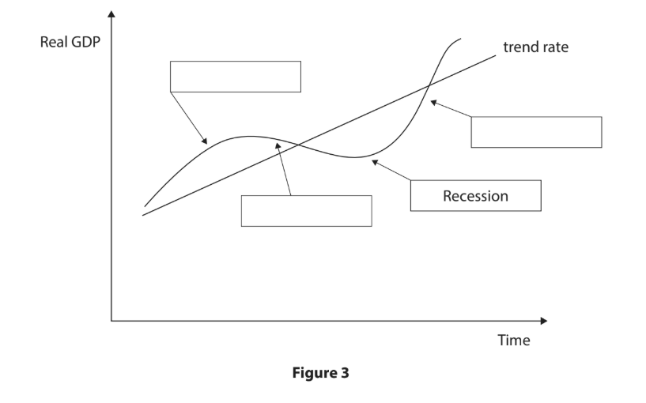
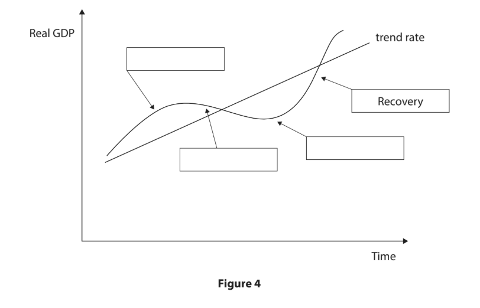
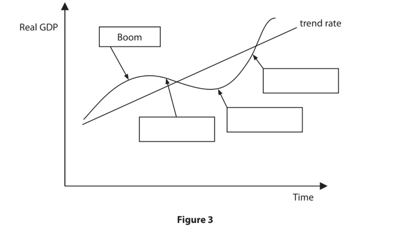
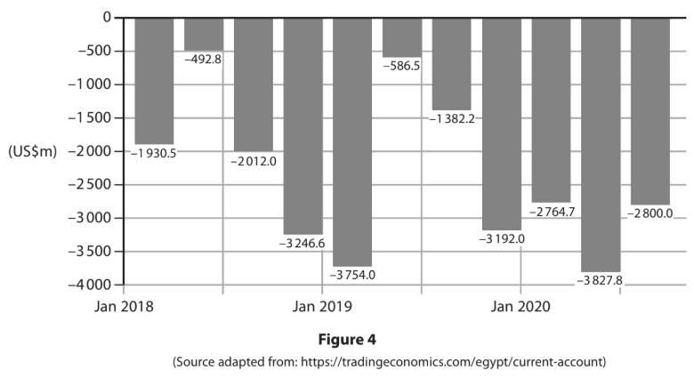
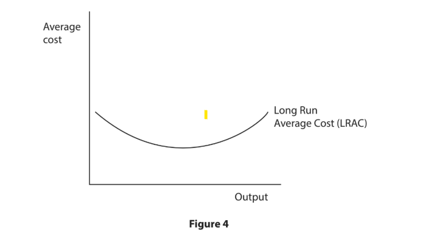
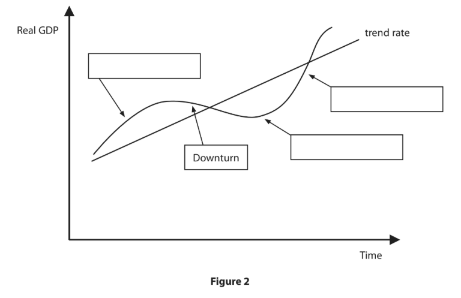
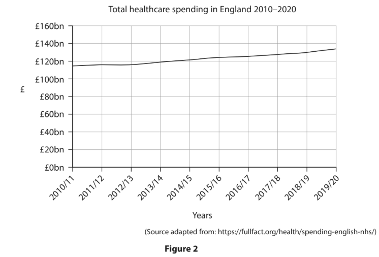
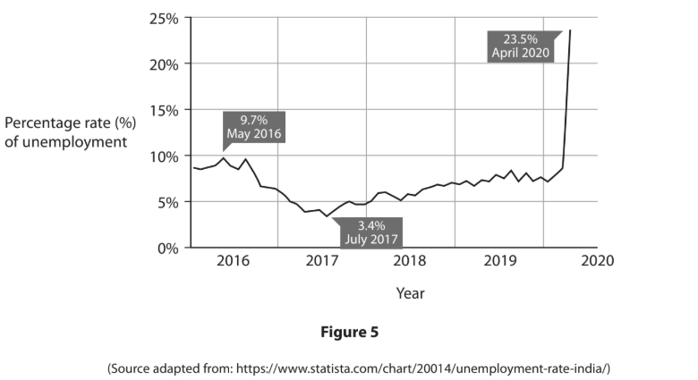
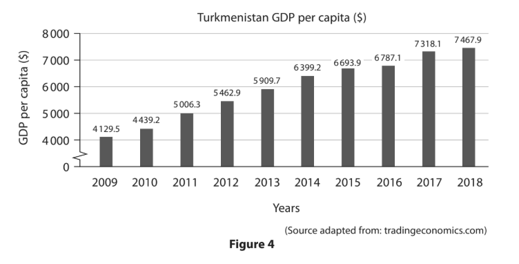
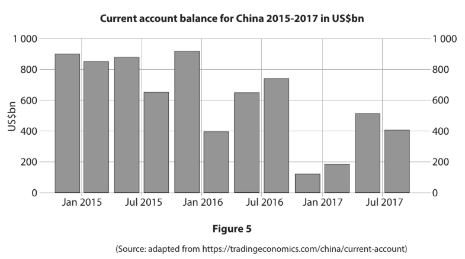

# Exam Questions — The Macroeconomic Objectives
**Government & the Economy** · Edexcel IGCSE Economics (4EC1)
> Source: [https://www.savemyexams.com/igcse/economics/edexcel/17/topic-questions/government-and-the-economy/the-macroeconomic-objectives/exam-questions/](https://www.savemyexams.com/igcse/economics/edexcel/17/topic-questions/government-and-the-economy/the-macroeconomic-objectives/exam-questions/) · 44 questions · total 363 marks

## Q1 — easy — 8 marks · exam-questions

### 1((b)) — 1 mark — multiple_choice — from paper June 2024 · Paper 2
Which one of the following is a measurement of gross domestic product (GDP)?
- **A.** Total value of goods and services traded within an economy
- **B.** Total value of goods and services produced within an economy
- **C.** Total value of goods and services exported by an economy
- **D.** Total value of goods and services imported by an economy

### 1((c)) — 2 marks — command: what — structured — from paper June 2024 · Paper 2
What is meant by the term the current account on the balance of payments?

### 1((d)) — 2 marks — command: describe — structured — from paper June 2024 · Paper 2
Describe **one** way business activity can damage the environment.

### 1((g)) — 3 marks — command: explain — structured — from paper June 2024 · Paper 2
In 2021, the global economy experienced a period of rapid growth. This growth was accompanied by rising inflation in many parts of the world due to problems with the supply of goods.

Explain **one** reason why there may be a link between economic growth and inflation for an economy.

## Q2 — easy — 8 marks · exam-questions

### 2((b)) — 1 mark — multiple_choice — from paper June 2024 · Paper 2
Which **one **of the following types of unemployment is caused by changes in the business cycle?
- **A.** Structural
- **B.** Seasonal
- **C.** Frictional
- **D.** Cyclical

### 2((c)) — 1 mark — command: state — structured — from paper June 2024 · Paper 2
State **one** possible impact of a current account deficit.

### 2((e)) — 3 marks — command: explain — structured — from paper June 2024 · Paper 2
The US has a progressive taxation system for income tax rates. In 2023, the income tax rates ranged from 10% for individuals on low incomes, up to 37% for those on the highest incomes.

Explain one way progressive taxation can help to reduce poverty for a country such as the US.

### 2((f)) — 3 marks — command: draw — structured — from paper June 2024 · Paper 2
Using the diagram below, label the remaining three stages of the economic cycle in the boxes on the diagram.

## Q3 — easy — 1 marks · exam-questions

### 1((b)) — 1 mark — multiple_choice — from paper June 2024 · Paper 2R
Which **one** of the following describes voluntary unemployment?
- **A.** Unemployment caused by a lack of demand for a particular skill
- **B.** Unemployment caused by changes in the business cycle
- **C.** Unemployment caused by individuals choosing not to work
- **D.** Unemployment caused by seasonal fluctuations in the demand for labour

## Q4 — easy — 13 marks · exam-questions

### 2((a)) — 1 mark — multiple_choice — from paper June 2024 · Paper 2R
Which **one** of the following is the calculation for the rate of unemployment in a country?
- **A.** Total labour force/Total population × 100
- **B.** Number of unemployed/Total labour force × 100
- **C.** Number of employed/Total labour force × 100
- **D.** Total unemployment/Total population × 100

### 2((c)) — 1 mark — command: state — structured — from paper June 2024 · Paper 2R
State **one **possible reason for a current account surplus.

### 2((d)) — 2 marks — command: what — structured — from paper June 2024 · Paper 2R
What is meant by the term relative poverty?

### 2((g)) — 9 marks — command: assess — structured — from paper June 2024 · Paper 2R
The Chinese economy only grew by 3% in 2022. However, in 2023 exports increased by 14.8% compared to the previous year, suggesting that China would achieve its growth target of 5%.

By March 2023, China was experiencing an economic recovery with the services and construction sectors reaching a 12‐year high.

However, China’s export recovery is expected to be temporary. This is because of possible weaker global demand due to interest rate rises in many economies.

With reference to the data above and your knowledge of economics, assess how a recovery may affect unemployment for a country such as China.

## Q5 — easy — 4 marks · exam-questions

### 3((b)) — 1 mark — multiple_choice — from paper June 2024 · Paper 2R
Which **one **of the following is an example of a menu cost for Nike in its online shop during times of inflation?
- **A.** The cost of raw materials for producing Nike shoes
- **B.** The cost of updates to the website due to higher prices for shoes
- **C.** The cost to consumers of looking for the lowest price of shoes
- **D.** The cost of shipping and handling fees for online orders

### 3((c)) — 3 marks — command: draw — structured — from paper June 2024 · Paper 2R
Using the diagram below label the remaining three stages of the economic cycle in the boxes on the diagram.

## Q6 — easy — 7 marks · exam-questions

### 3((b)) — 1 mark — multiple_choice — from paper Nov 2024 · Paper 2
The price of a basket of goods and services was £1200. The consumer price index (CPI) increased from 120 to 130.

Calculate the new price of the basket of goods and services.
- **A.** £1210
- **B.** £1300
- **C.** £1330
- **D.** £1450

### 3((d)) — 6 marks — command: analyse — structured — from paper Nov 2024 · Paper 2
The Clean Air Act (CAA) is an important regulation that sets standards for air quality in the US. The CAA regulates emissions from cars, trucks and buses.

With reference to the data above and your knowledge of economics, analyse how regulations can help to protect the environment in a country such as the US.

## Q7 — easy — 8 marks · exam-questions

### 4((a)) — 2 marks — command: calculate — structured — from paper Nov 2024 · Paper 2
Figure 5 shows the gross domestic product (GDP) for India in 2021 and 2022.

|   | 2021 | 2022 |
|---|---|---|
| GDP (\$bn) | 3150.31 | 3385.09 |

Calculate, to two decimal places, the **percentage change in GDP** for India between 2021 and 2022. You are advised to show your working.

### 4((b)) — 6 marks — command: analyse — structured — from paper Nov 2024 · Paper 2
The Indian Government offers many different benefit payments and other provisions to very low‐income individuals and families to help to reduce poverty. These include cash transfers, food rations and training courses for unemployed workers.

With reference to the data above and your knowledge of economics, analyse how benefits offered by the government can help to reduce poverty for a country such as India.

## Q8 — easy — 9 marks · exam-questions

### 2((a)) — 1 mark — multiple_choice — from paper Jan 2023 · Paper 2
Money earned from foreign tourists visiting Canada is shown in Canada’s current account on the balance of payments as:
- **A.** visible exports
- **B.** visible imports
- **C.** invisible exports
- **D.** invisible imports

### 2((b)) — 1 mark — multiple_choice — from paper Jan 2023 · Paper 2
Which **one **of the following is likely to help protect the environment?
- **A.** An increase in fines
- **B.** An increase in pollution permits
- **C.** A reduction in regulation
- **D.** A reduction in the provision of parks

### 2((c)) — 1 mark — command: state — structured — from paper Jan 2023 · Paper 2
State **one **possible disadvantage of economic growth.

### 2((e)) — 3 marks — command: explain — structured — from paper Jan 2023 · Paper 2
In March 2021, the Scottish Government announced a package of measures worth £37.2m. This money is to be given to low income households to tackle poverty and inequality in Scotland.

Explain **one **possible reason why the Scottish Government wants to reduce poverty and inequality.

### 2((f)) — 3 marks — command: draw — structured — from paper Jan 2023 · Paper 2
Using the diagram below, label the remaining **three **stages of the economic cycle in the boxes on the diagram.

## Q9 — easy — 10 marks · exam-questions

### 3((a)) — 1 mark — multiple_choice — from paper Jan 2023 · Paper 2
What was the rate of inflation if the consumer price index (CPI) of a country rose from 120 to 150?
- **A.** 25%
- **B.** 30%
- **C.** 50%
- **D.** 150%

### 3((c)) — 3 marks — command: explain — structured — from paper Jan 2023 · Paper 2
In December 2020, the UK unemployment rate was 5.1%. This was an increase of 1.3% from September 2020.

Explain **one **likely impact on UK tax revenue from rising unemployment rates.

### 3((d)) — 6 marks — command: analyse — structured — from paper Jan 2023 · Paper 2
Lithium is used in batteries to power various electrical and electronic goods including mobile phones and electric cars. Lithium has to be mined from the ground and large deposits are found in countries such as Chile. Lithium mining uses a lot of water – approximately 2 million litres per tonne of lithium.

Analyse how business activity can damage the environment in a country such as Chile.

## Q10 — easy — 8 marks · exam-questions

### 4((a)) — 2 marks — command: calculate — structured — from paper Jan 2023 · Paper 2
Figure 4 shows labour force information for Mexico in the third quarter of 2020.

| Labour force | 51,011,033 |
|---|---|
| Number of unemployed | 2,769,491 |

**Figure 4**
(Source adapted from: [https://tradingeconomics.com/mexico/unemployed-persons](https://tradingeconomics.com/mexico/unemployed-persons))

Calculate, to two decimal places, the** rate of unemployment **for Mexico in the third quarter of 2020. You are advised to show your working.

### 4((b)) — 6 marks — command: analyse — structured — from paper Jan 2023 · Paper 2
In Mexico the minimum wage was increased by 15% to 141.7 pesos (US \$7.15) in 2021. Nearly 11 million workers in Mexico are paid the minimum wage.

Analyse the impact of increasing wages on inflation in Mexico.

## Q11 — easy — 7 marks · exam-questions

### 1((a)) — 1 mark — multiple_choice — from paper Jan 2023 · Paper 2R
What does the International Labour Organisation (ILO) measure?
- **A.** Economic growth
- **B.** Unemployment
- **C.** Government spending
- **D.** Inflation

### 1((b)) — 1 mark — multiple_choice — from paper Jan 2023 · Paper 2R
Which **one** of the following is considered to be a progressive tax in the UK?
- **A.** Income tax
- **B.** Value added tax (VAT)
- **C.** Excise duties
- **D.** Import tariff

### 1((d)) — 2 marks — command: describe — structured — from paper Jan 2023 · Paper 2R
Describe **one **negative impact of economic growth.

### 1((g)) — 3 marks — command: explain — structured — from paper Jan 2023 · Paper 2R
Mexico's annual inflation rate was 3.4% in 2020. The minimum wage was increased by 20% from 2019.

Explain the impact of wages rising faster than inflation on a country such as Mexico.

## Q12 — easy — 4 marks · exam-questions

### 2((a)) — 1 mark — multiple_choice — from paper Jan 2023 · Paper 2R
Which type of unemployment would result from the permanent closure of a coal mine?
- **A.** Seasonal
- **B.** Voluntary
- **C.** Structural
- **D.** Cyclical

### 2((e)) — 3 marks — command: explain — structured — from paper Jan 2023 · Paper 2R
An airport is a key part of most large urban areas. They are usually found on the edge of cities and are often surrounded by houses.

Explain **one** way an airport can cause damage to the environment.

## Q13 — easy — 8 marks · exam-questions

### 4((a)) — 2 marks — command: calculate — structured — from paper Jan 2023 · Paper 2R
Figure 3 shows the gross domestic product (GDP) per capita for Egypt in 2019 and 2020.

|   | **2019 ** | **2020** |
|---|---|---|
| **GDP per capita US\$** | 3043 | 3561 |

**Figure 3**

(Source adapted from: a gdp-per-capita-in-egypt/)

Calculate, to two decimal places, the **percentage change in GDP per capita** in Egypt between 2019 and 2020. You are advised to show your working.

### 4((b)) — 6 marks — command: analyse — structured — from paper Jan 2023 · Paper 2R
Figure 4 shows the quarterly current account deficit (US\$m) for Egypt from January 2018 until October 2020.

Analyse the possible impact on Egypt of having a continuous current account deficit.

## Q14 — easy — 1 marks · exam-questions

### 2((b)) — 1 mark — multiple_choice — from paper Nov 2023 · Paper 1
Which **one** of the following is a possible cause of positive economic growth?
- **A.** Decreasing population
- **B.** Decreasing productivity
- **C.** Increasing unemployment
- **D.** Increasing technological advancements

## Q15 — easy — 7 marks · exam-questions

### 1((a)) — 1 mark — multiple_choice — from paper Nov 2023 · Paper 2
A trade union is an organisation that aims to improve
- **A.** profit margins
- **B.** tax revenue
- **C.** the environment
- **D.** working conditions

### 1((c)) — 2 marks — command: what — structured — from paper Nov 2023 · Paper 2
What is meant by the term economies of scale?

### 1((e)) — 1 mark — command: define — structured — from paper Nov 2023 · Paper 2
Define the term excess supply.

### 1((h)) — 3 marks — command: explain — structured — from paper Nov 2023 · Paper 2
The Brazilian Government announced plans to privatise one of its state-owned food companies.

Explain **one** possible advantage of privatisation for consumers in Brazil.

## Q16 — easy — 6 marks · exam-questions

### 2((c)) — 2 marks — command: what — structured — from paper Nov 2023 · Paper 2
What is meant by the term opportunity cost?

### 2((d)) — 2 marks — command: calculate — structured — from paper Nov 2023 · Paper 2
Figure 3 shows some of the production costs in March for a firm manufacturing clothing in Bangladesh.

| Production costs | Bangladeshi Taka (Tk) |
|---|---|
| Rent | 20 250 |
| Raw materials | 10 050 |
| Advertising | 5 125 |
| Labour (paid in direct proportion to output) | 105 000 |

Calculate the** total fixed costs **for the firm in March. You are advised to show your working.

### 2((e)) — 2 marks — command: describe — structured — from paper Nov 2023 · Paper 2
Describe **one** reason why an entrepreneur is a factor of production.

## Q17 — easy — 13 marks · exam-questions

### 3((b)) — 1 mark — multiple_choice — from paper Nov 2023 · Paper 2
The introduction of a minimum wage above the equilibrium wage in a labour market is most likely to
- **A.** increase quantity of labour demanded and decrease the wage rate
- **B.** increase quantity of labour demanded and increase the wage rate
- **C.** decrease quantity of labour demanded and decrease the wage rate
- **D.** decrease quantity of labour demanded and increase the wage rate

### 3((c)) — 3 marks — command: draw — structured — from paper Nov 2023 · Paper 2
On the diagram below, draw and label economies of scale, diseconomies of scale and the point at which the firm is most efficient.

### 3() — 9 marks — command: assess — structured
Simona owns a hairdressing business in Romania. She charges low prices and makes no charge when customers arrive late for appointments or make very late cancellations. She thinks customer care is more important than making a profit.

However, some customers have complained at having to wait weeks before an appointment is available. As a result, Simona has lost customers. This has  caused financial problems in repaying a loan to the bank.

In response, Simona is considering increasing her prices and charging a fee to those who arrive late or cancel without suitable notice.

With reference to the data above and your knowledge of economics, assess the benefits to Simona of making these changes.

## Q18 — easy — 2 marks · exam-questions

### 4((a)) — 2 marks — command: calculate — structured — from paper Nov 2023 · Paper 2
Figure 5 shows profit for a firm between 2020 and 2022.

| Year | Profit (\$) |
|---|---|
| 2020 | 20 250 |
| 2021 | 21 000 |
| 2022 | 22 950 |

**Figure 5**

Calculate, to two decimal places, the **percentage change in profit **for the firm between 2020 and 2022. You are advised to show your working.

## Q19 — easy — 9 marks · exam-questions

### 1((c)) — 2 marks — command: what — structured — from paper June 2022 · Paper 2
What is meant by the term imports?

### 1((d)) — 2 marks — command: describe — structured — from paper June 2022 · Paper 2
Describe **one **reason why governments make benefit payments.

### 1((e)) — 2 marks — command: calculate — structured — from paper June 2022 · Paper 2
Figure 1 shows the UK’s imports and exports for the year ending July 2019.

|   | £bn |
|---|---|
| Imports | 689.9 |
| Exports | 646.7 |
| Total UK trade | 1336.6 |

**Figure 1**

(Source: Department for International Trade: UK Trade in Numbers September 2019)

Using the data in Figure 1, calculate in £bn,** the current account** for the UK year ending July 2019. You are advised to show your working.

### 1((g)) — 3 marks — command: explain — structured — from paper June 2022 · Paper 2
Norway had a current account surplus of 19.07bn Norwegian Krone (NOK) in the fourth quarter of 2019.

Explain **one **possible reason why a country such as Norway had a current account surplus.

## Q20 — easy — 7 marks · exam-questions

### 2((b)) — 1 mark — multiple_choice — from paper June 2022 · Paper 2
Which **one **of the following is a possible impact of economic growth?
- **A.** An increase in unemployment
- **B.** An increase in environmental damage
- **C.** A reduction in investment
- **D.** A reduction in tax revenues

### 2((c)) — 1 mark — command: state — structured — from paper June 2022 · Paper 2
State **one **type of unemployment.

### 2((d)) — 2 marks — command: what — structured — from paper June 2022 · Paper 2
What is meant by the term recovery?

### 2((e)) — 3 marks — command: explain — structured — from paper June 2022 · Paper 2
Nigeria’s rate of inflation increased to 12.2% in February 2020. A rise in the price of food products, such as bread and meat, was the main reason for the increase.

Explain **one **impact of rising inflation on shoe leather costs in Nigeria.

## Q21 — easy — 4 marks · exam-questions

### 3((b)) — 1 mark — multiple_choice — from paper June 2022 · Paper 2
Which **one **of the following is likely to cause cost-push inflation?
- **A.** An improvement in productivity
- **B.** An improvement in weather conditions
- **C.** An increase in wage rates
- **D.** An increase in the consumption of goods

### 3((c)) — 3 marks — command: explain — structured — from paper June 2022 · Paper 2
The UK Government gives subsidies to firms in the renewable energy market that provide wind and solar energy.

Explain **one **reason why the UK Government gives subsidies to firms in the renewable energy market.

## Q22 — easy — 5 marks · exam-questions

### 1((a)) — 1 mark — multiple_choice — from paper June 2022 · Paper 2R
Which **one **of the following is an example of cyclical unemployment?
- **A.** Factory workers lose their jobs as more machines are used
- **B.** Hotels employ fewer workers in the winter months
- **C.** Workers are waiting to start a new job
- **D.** An airline cuts jobs during a global recession

### 1((d)) — 2 marks — command: describe — structured — from paper June 2022 · Paper 2R
Describe **one **impact that education may have on inequality and poverty.

### 1((e)) — 2 marks — command: calculate — structured — from paper June 2022 · Paperr 2R
The consumer price index (CPI) was 110.2 in 2019 and the base year was 100 in 2015.

Calculate how much **inflation **there has been between 2015 and 2019. You are advised to show your working.

## Q23 — easy — 7 marks · exam-questions

### 2((c)) — 1 mark — command: state — structured — from paper June 2022 · Paper 2R
State **one** type of inflation.

### 2((e)) — 3 marks — command: explain — structured — from paper June 2022 · Paper 2R
Indonesia is one of the largest exporters of coal in the world. In 2020, the Indonesian Government started to deregulate the mining industry by removing some environmental controls.

Explain **one **disadvantage of deregulation for a country such as Indonesia.

### 2((f)) — 3 marks — command: draw — structured — from paper June 2022 · Paper 2R
Using the diagram below label the remaining three stages of the economic cycle in the boxes on the diagram.

## Q24 — easy — 17 marks · exam-questions

### 3((a)) — 1 mark — multiple_choice — from paper June 2022 · Paper 2R
Which **one **of the following describes shoe leather costs?
- **A.** The costs of raw materials used to make a good or service
- **B.** The costs of communication used by a firm
- **C.** The costs of searching for cheaper suppliers when inflation is high
- **D.** The costs to firms of having to make repeated price changes

### 3((b)) — 1 mark — multiple_choice — from paper June 2022 · Paper 2R
Which **one** of the following may cause a current account surplus?
- **A.** Lower priced foreign goods
- **B.** Higher priced domestic goods
- **C.** Lower import tariffs on foreign goods
- **D.** Higher quality of domestic goods

### 3((d)) — 6 marks — command: analyse — structured — from paper June 2022 · Paper 2R
In February 2020, Singapore experienced deflation for the first time since January 2010. This was mainly caused by a decline in the price of airfares and holidays due to the government lockdown.

With reference to the data above and your knowledge of economics, analyse the impact of deflation on consumer confidence in a country such as Singapore.

### 3((e)) — 9 marks — command: assess — structured — from paper June 2022 · Paper 2R
The UK has a benefits payment called Universal Credit. It is a payment to help with living costs if a person is on low income or out of work.

|   | Monthly standard allowance (£) |
|---|---|
| Single adult aged under 25 years | 342.72 |
| Single adult aged over 25 years | 409.89 |
| A couple/two adults both aged under 25 years | 488.59 |
| A couple/two adults both aged over 25 years | 594.04 |

**Figure 3**

(Source adapted from: [https://www.gov.uk/universal-credit/what-youll-get](https://www.gov.uk/universal-credit/what-youll-get))

With reference to the data above and your knowledge of economics, assess the advantages of using benefit payments to redistribute income in a country such as the UK.

## Q25 — easy — 14 marks · exam-questions

### 4((a)) — 2 marks — command: calculate — structured — from paper June 2022 · Paper 2R
Figure 4 shows the change in gross domestic product (GDP) per capita for Vietnam.

|   | 2018 | 2019 |
|---|---|---|
| GDP per capita US\$ | 2590 | 2715 |

**Figure 4**

(Source adapted from: [https://www.ceicdata.com/en/indicator/vietnam/gdp-per-capita](https://www.ceicdata.com/en/indicator/vietnam/gdp-per-capita))

Calculate, to two decimal places, the **percentage increase in GDP per capita **between 2018 and 2019. You are advised to show your working.

### 4((c)) — 12 marks — command: evaluate — structured — from paper June 2022 · Paper 2R
Vietnam is struggling with high levels of air pollution. Its two biggest cities, Hanoi and Ho Chi Minh City, are now among the 15 most polluted cities in Southeast Asia. Air pollution is particularly harmful to human health causing diseases including strokes, heart disease and respiratory infections. Up to 60,000 deaths in Vietnam in 2018 were related to air pollution. On average, poor air quality reduces life expectancy by one year and costs the country about 5% of GDP per year.

Among the main causes of this pollution is transportation. Vietnam now has 3.6 million automobiles and 58 million motorbikes, mostly found in big cities. Many of these vehicles are old, with limited emission control technology. They cause daily traffic jams and are responsible for a large amount of air pollution.

The Vietnamese Government is considering whether to increase the environmental tax on petrol and diesel by 33%. The proposed tax will generate \$2.4bn each year, an annual increase of \$650.2m from current tax revenues on fuels.

(Source adapted from: [https://thediplomat.com/2020/03/vietnams-big-air-pollution-](https://thediplomat.com/2020/03/vietnams-big-air-pollution-)challenge/)

With reference to the data above and your knowledge of economics, evaluate the effectiveness of increasing taxation on petrol and diesel to protect the environment in a country such as Vietnam.

## Q26 — easy — 6 marks · exam-questions

### 1((a)) — 1 mark — multiple_choice — from paper June 2021 · Paper 2
Which type of unemployment occurs when the demand for a product is only at certain times of the year?
- **A.** Structural
- **B.** Cyclical
- **C.** Seasonal
- **D.** Voluntary

### 1((c)) — 2 marks — command: what — structured — from paper June 2021 · Paper 2
What is meant by the term recession?

### 1((g)) — 3 marks — command: explain — structured — from paper June 2021 · Paper 2
The UK has 13 national parks with the Lake District National Park being the largest and most popular. It had over 19.17 million visitors in 2018. Woodland covers over 12% of the national park.

Explain **one **benefit to the UK Government of providing parks.

## Q27 — easy — 16 marks · exam-questions

### 2((b)) — 1 mark — multiple_choice — from paper June 2021 · Paper 2
Which **one **of the following is likely to result in poverty?
- **A.** High literacy rates
- **B.** Low GDP per capita
- **C.** Low rates of tax
- **D.** High employment rates

### 2((c)) — 3 marks — command: state — structured — from paper June 2021 · Paper 2
State **one **effect on the balance of payments of improved quality of foreign goods.

### 2((e)) — 3 marks — command: explain — structured — from paper June 2021 · Paper 2
In the first quarter of 2019 the unemployment rate in Argentina increased by 1% to 10.1%. This was the highest level in 13 years.

Explain **one **impact of rising unemployment on consumer confidence for a country such as Argentina.

### 2((g)) — 9 marks — command: assess — structured — from paper June 2021 · Paper 2
In 2019, Germany was considering increasing the tax on meat to protect the environment and improve animal welfare. Currently meat in Germany has a reduced tax rate of 7%. Some political groups are arguing that this should increase to the standard 19%. According to United Nations research, methane from animals accounts for 14.5% of greenhouse gas emissions – more than the direct emissions from transport.

(Source adapted from: [https://www.independent.co.uk/environment/](https://www.independent.co.uk/environment/) german-meat-tax-environment-animal-welfare-a9045271.html)

With reference to the data above and your knowledge of economics, assess the use of taxation to protect the environment in a country such as Germany.

## Q28 — easy — 5 marks · exam-questions

### 1((c)) — 2 marks — command: what — structured — from paper Nov 2021 · Paper 2
What is meant by the term downturn?

### 1((g)) — 3 marks — command: explain — structured — from paper Nov 2021 · Paper 2
Economic growth in Malaysia increased to 4.9% between April and June 2019.

Explain **one** disadvantage of economic growth for a country such as Malaysia.

## Q29 — easy — 14 marks · exam-questions

### 2((b)) — 1 mark — multiple_choice — from paper Nov 2021 · Paper 2
Which **one **of the following terms may refer to someone having a lower standard of living in comparison to the average person in society?
- **A.** Absolute poverty
- **B.** Income distribution
- **C.** Relative poverty
- **D.** Poverty trap

### 2((c)) — 1 mark — command: state — structured — from paper Nov 2021 · Paper 2
State **one **effect on the balance of payments of improved quality of domestic goods.

### 2((e)) — 3 marks — command: explain — structured — from paper Nov 2021 · Paper 2
In December 2019 the unemployment rate in Venezuela was approximately 44%. This was much higher than the previous December’s figure of 35%.

Explain **one **impact of increasing unemployment rates on business confidence in a country such as Venezuela.

### 2((g)) — 9 marks — command: assess — structured — from paper Nov 2021 · Paper 2
Total healthcare spending in England was £129bn in 2018–2019 and was expected to rise to nearly £134bn by 2019–2020. Access to healthcare is free in England.

With reference to the data above and your knowledge of economics, assess the use of investment in healthcare to reduce the level of inequality and poverty in a country such as England.

## Q30 — medium — 12 marks · exam-questions

### 2((e)) — 3 marks — command: explain — structured — from paper Nov 2024 · Paper 2
In China there are restrictions on coal consumption and emissions from factories. These restrictions have led to job losses in some industries.

Explain **one **reason why there might be a trade‐off between economic growth and environmental protection for an economy such as China.

### 2((g)) — 9 marks — command: assess — structured — from paper Nov 2024 · Paper 2
ChatGPT is the latest example of artificial intelligence (AI)* technology. There are increased concerns that AI will cause the loss of jobs for millions of workers. This includes Wall Street traders, salespeople, writers of basic computer code and journalists.

IBM has stopped recruiting for 7,800 jobs that could be eventually replaced by AI. British Telecom (BT) predicted that AI would replace 10,000 jobs by 2030.

**The use of computer systems to perform tasks normally undertaken by humans.*

With reference to the data above and your knowledge of economics, assess the possible impact of the introduction of AI on the levels of structural unemployment.

## Q31 — medium — 9 marks · exam-questions

### 1((g)) — 3 marks — command: explain — structured — from paper Jan 2023 · Paper 2
Tourism is a major sector in the French economy. It employs around 2 million people, both directly and indirectly.

Explain **one **reason why some people in the tourism sector might suffer from seasonal unemployment in a country such as France.

### 1((h)) — 6 marks — command: analyse — structured — from paper Jan 2023 · Paper 2
In December 2020, Australia had a current account surplus of \$18.1bn, a rise of \$4.4bn on the previous quarter.

Analyse the benefits of a current account surplus for a country such as Australia.

## Q32 — medium — 9 marks · exam-questions

### 3((c)) — 3 marks — command: explain — structured — from paper Jan 2023 · Paper 2R
In November 2020, Pakistan recorded a current account surplus of \$1.64bn. This was its fifth consecutive current account surplus.

Explain **one **reason why an improvement in the quality of domestic goods may have resulted in a positive impact on Pakistan’s current account.

### 3((d)) — 6 marks — command: analyse — structured — from paper Jan 2023 · Paper 2R
China has been investing in healthcare as the main way to reduce poverty. Over 90% of the medical bills of patients are now paid by the government.

Analyse the benefits of investing in healthcare for a country such as China.

## Q33 — medium — 6 marks · exam-questions

### 4((b)) — 6 marks — command: analyse — structured — from paper June 2022 · Paper 2
Figure 5 shows the average unemployment rate (%) in India between 2016 and April 2020.

With reference to the data above and your knowledge of economics, analyse the impact of rising unemployment rates on business confidence for a country such as India.

## Q34 — medium — 15 marks · exam-questions

### 3((d)) — 6 marks — command: analyse — structured — from paper June 2021 · Paper 2
The Slovenian Government spent €3.05bn on healthcare in 2019. This included additional funding for reducing the time people were waiting for treatment and an extra €104m to cover the recent increase in wage rates for healthcare staff.

With reference to the data above and your knowledge of economics, analyse why the Slovenian Government might want to increase investment in healthcare.

### 3((e)) — 9 marks — command: assess — structured — from paper June 2021 · Paper2
In recent years Turkmenistan has been one of the fastest growing economies. The most important sector of the economy is oil and natural gas extraction, which accounts for more than 60% of GDP. Although agriculture accounts for only 10% of GDP, it employs 50% of the labour force. Turkmenistan has seen annual GDP growth rates of 6.2%.

With reference to the data above and your knowledge of economics, assess the likely benefits of economic growth for a country such as Turkmenistan.

## Q35 — medium — 6 marks · exam-questions

### 4((b)) — 6 marks — command: analyse — structured — from paper June 2021 · Paper 2
In July 2019, China’s annual inflation rate increased to 2.8%. This was the highest rate since February 2018.

With reference to the data above and your knowledge of economics, analyse the impact of inflation on individuals in a country such as China.

## Q36 — medium — 15 marks · exam-questions

### 3((d)) — 6 marks — command: analyse — structured — from paper Nov 2021 · Paper 2
A UK environmental group has called for tough action to tackle air pollution, particularly from road transport. It wants the UK Government to impose higher taxation on petrol and diesel fuel for cars and trucks.

With reference to the data above and your knowledge of economics, analyse the advantages of using taxation to help protect the environment in a country such as the UK.

### 3((e)) — 9 marks — command: assess — structured — from paper Nov 2021 · Paper 2
Just 30 years ago, Ghana was in crisis with high levels of poverty and on the edge of economic collapse. The West African nation has made a significant recovery and was predicted to be the world’s fastest growing economy in 2019.

The International Monetary Fund (IMF) estimates Ghana’s Gross Domestic Product (GDP) growth rate of 8.8% will be double that of emerging economies, and well ahead of world growth rates. Ghana is one of the world’s largest cocoa producers. Its growth is now being maintained by a different commodity, the extraction of crude oil.

(Source adapted from: [https://www.imf.org/external/datamapper/](https://www.imf.org/external/datamapper/)
NGDP_RPCH@WEO/OEMDC/ADVEC/WEOWORLD/GHA)

With reference to the data above and your knowledge of economics, assess the use of GDP as a measure of growth for a country such as Ghana.

## Q37 — medium — 3 marks · exam-questions

### 3((c)) — 3 marks — command: explain — structured — from paper Jan 2020 · Paper 2
The rate of inflation in Cyprus decreased from 3.1% in September to 3% in October.

Explain **one** reason why low and stable inflation is a macroeconomic objective for a country such as Cyprus.

## Q38 — medium — 3 marks · exam-questions

### 3((c)) — 3 marks — command: explain — structured — from paper Jan 2020 · Paper 2R
In 2018, the annual rate of inflation in Egypt was 16% in September and 17.7% in October.

Explain **one** likely impact of this change in inflation on the current account of the balance of payments for a country such as Egypt.

## Q39 — medium — 6 marks · exam-questions

### 4((b)) — 6 marks — command: analyse — structured — from paper June 2019 · Paper 2R

Analyse the benefits of a current account surplus for a country such as China.

## Q40 — hard — 9 marks · exam-questions

### 3((e)) — 9 marks — command: assess — structured — from paper June 2024 · Paper 2
Germany’s economy shrank more than expected in the fourth quarter of 2022. This raised doubts over the ability of Europe’s biggest economy to avoid a recession and recover quickly from its energy crisis due to high gas and oil prices.

Record inflation rates of 10.4% caused reductions in German consumer spending and business investment in buildings and machinery. This led to a 0.4% decrease in gross domestic product (GDP) from the previous quarter.

The effects will be felt by consumers, workers, firms and the German Government.

With reference to the data above and your knowledge of economics, assess how a recession may affect inflation in a country such as Germany.

## Q41 — hard — 12 marks · exam-questions

### 4((c)) — 12 marks — command: evaluate — structured — from paper June 2024 · Paper 2R
Costa Rica has 5% of the world’s wildlife species but occupies only 0.03% of the earth’s surface. Costa Rica takes pride in having 30 national parks, with more than 25% of the territory marked for conservation.

National parks have economic value to both national and local economies. Costa Rica takes advantage of the growing demand by tourists visiting these national parks by charging an entry fee. National parks contribute almost \$2 billion to the Costa Rican economy. 122,465 tourists visited national parks in Costa Rica in the last two weeks of 2021.

Local economies near the national parks benefit from the creation of jobs and the increased expenditure by tourists on hotels, local shops, guides, restaurants, and tours.

With reference to the data above and your knowledge of economics, evaluate the possible advantages of the government providing national parks to protect the environment in a country such as Costa Rica.

## Q42 — hard — 9 marks · exam-questions

### 3((e)) — 9 marks — command: assess — structured — from paper June 2021 · Paper 1
Public universities in Norway do not charge students any tuition fees. Education is funded by the government. In recent years Norway has spent more on education than any other country as a percentage of GDP. Norway also has one of the lowest rates of unemployment in the world.

With reference to the data above and your knowledge of economics, assess the benefits to Norway of the government funding all education.

## Q43 — hard — 9 marks · exam-questions

### 2((g)) — 9 marks — command: assess — structured — from paper Nov 2020 · Paper 2
**Canada Child Benefit (CCB) payments get a boost**

In 2018, the monthly tax-free welfare benefit for children was increased to match the cost of living in Canada.

The amount a family receives is calculated based on income. As a family’s income rises the amount of benefits decrease. Some higher income households do not receive the benefit at all. The CCB has distributed more than CAD\$23.3bn to around 3.7 million Canadian families, and has helped to remove more than 300,000 children out of poverty.

With reference to the data above and your knowledge of economics, assess the advantages of using benefit payments to redistribute income in a country such as Canada.

## Q44 — hard — 12 marks · exam-questions

### 4((c)) — 12 marks — command: evaluate — structured — from paper Nov 2020 · Paper 2R
In 2018, the USA increased its emissions of carbon dioxide. This increase happened even though large numbers of coal‐fired power stations were closed and American consumers purchased nearly double the number of electric cars. The main reason, often stated as a benefit to an economy, was high economic growth.

A booming US economy has meant increased industrial production, more truck and air travel and more offices and other workplaces to heat. The result is that the USA will have to do even more in the coming years to meet international commitments for greenhouse gas reductions by increasing its protection of the environment.

(Source adapted from: [https://www.nbcnews.com/news/us‐news/](https://www.nbcnews.com/news/us‐news/) economic‐boom‐spikes‐carbon‐emissions‐despite‐green‐tech‐gains‐n956336)

With reference to the data above and your knowledge of economics, evaluate whether there is a trade‐off between economic growth and environmental protection for a country such as the USA.
