# Mark Schemes — Demand, Supply & Market Equilibrium
**The Market System** · Edexcel IGCSE Economics (4EC1)

## Q1 — easy — 1 marks · exam-questions

### 2((a)) — 1 marks
**Correct answer: C** — 

**Final answer:** **The correct answer is C**

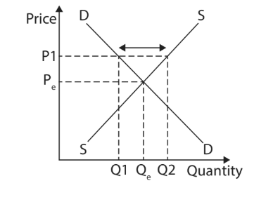

Excess supply occurs when the price sits above the equilibrium price, so the quantity producers are willing to supply is greater than the quantity consumers want to buy, leaving unsold stock

**A** is incorrect as that diagram shows excess demand, where the quantity demanded is greater than the quantity supplied

**B** is incorrect as that diagram shows an increase in supply, which is a shift of the whole supply curve rather than a gap between supply and demand

**D** is incorrect as that diagram shows a movement along the supply curve, which is caused by a change in price rather than showing excess supply

## Q2 — easy — 1 marks · exam-questions

### 2((a)) — 1 marks
**Correct answer: A** — 

**Final answer:** **The correct answer is A**

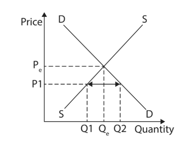

Excess demand occurs when the price sits below the equilibrium price, so the quantity consumers want to buy is greater than the quantity producers are willing to supply, leaving a shortage

**B** is incorrect as that diagram shows a movement along the demand curve, which is caused by a change in price rather than showing excess demand

**C** is incorrect as that diagram shows excess supply, where the quantity supplied is greater than the quantity demanded

**D** is incorrect as that diagram shows a decrease in demand, which is a shift of the whole demand curve rather than a gap between demand and supply

## Q3 — easy — 1 marks · exam-questions

### 3((a)) — 1 marks
**Correct answer: D** — Decreased incomes

**Final answer:** **The correct answer is D**

A fall in incomes means consumers can afford less at every price, so demand for a normal good falls and the whole demand curve shifts to the left

**A** is incorrect as increased advertising would make the product more appealing, shifting demand to the right rather than the left

**B** is incorrect as cost reductions affect producers, shifting the supply curve to the right rather than moving demand

**C** is incorrect as increased indirect taxes raise producers' costs, shifting the supply curve to the left rather than moving demand

## Q4 — easy — 2 marks · exam-questions

### 4((a)) — 2 marks
(13,600 + 14,200 + 11,700) − 33,000 **[1 mark]**

**= 6,500** **[1 mark]**

> **[mark-scheme]**
> Award 1 mark for showing correct calculation
> 
> Award 1 mark for the correct answer
> 
> Award 2 marks if excess demand is correctly calculated as 6,500, even if no calculations are shown
> 
> Do not award marks for a formula

> **[exam-tip]**
> - Examiner reports repeatedly recommend showing your working in a 'calculate' question, so an arithmetic slip does not cost you both marks
> - Add the quantity demanded across all three months first, then subtract the total quantity supplied of 33,000

## Q5 — easy — 2 marks · exam-questions

### 1((c)) — 2 marks
Supply is the quantity of a good or service that producers are willing and able to sell** [1]** at a given price in a given period of time** [1]**

**[2 marks]**

> **[mark-scheme]**
> Award 1 mark for reference to the amount producers are willing and able to sell and 1 mark for reference to price
> 
> Accept any other appropriate response

> **[exam-tip]**
> - 'What is meant by' questions carry two marks and need two parts to the definition. Examiner reports state plainly that no marks are awarded for examples, so define the term rather than giving an example of it

## Q6 — easy — 2 marks · exam-questions

### 1((b)) — 1 marks
**Correct answer: C** — An increase in demand is shown by a shift to the right

**Final answer:** **The correct answer is C**

An increase in demand means consumers want to buy more at every price, which is shown by the whole demand curve moving to the right

**A** is incorrect as the law of demand means that when the price falls the quantity demanded rises, not falls

**B** is incorrect as the demand curve slopes downwards from left to right, because a lower price attracts more buyers

**D** is incorrect as a shift to the right shows an increase in demand; a decrease in demand is shown by a shift to the left

### 1((e)) — 1 marks
**Excess supply is where the quantity supplied is greater than the quantity demanded at the current price****[1 mark]**

> **[mark-scheme]**
> Award 1 mark for a correct definition
> 
> No marks are available for an example in place of a definition
> 
> Accept any other correct and appropriate wording

> **[exam-tip]**
> - Do not use examples for 'define' questions. The examiner report for this question states that examiners are only looking for a definition of the term
> - There is only 1 mark here, so it is either right or wrong and there is no need to go into further detail

## Q7 — easy — 2 marks · exam-questions

### 4((a)) — 2 marks
408 − (98 + 114 + 107) **[1 mark]**

**= 89 seats** **[1 mark]**

> **[mark-scheme]**
> Award 1 mark for showing correct calculation
> 
> Award 1 mark for the correct answer
> 
> Award 2 marks if excess supply is correctly calculated as 89 seats, even if no calculations are shown
> 
> Do not award marks for a formula

> **[exam-tip]**
> - Examiner reports repeatedly recommend showing your working in a 'calculate' question, so an arithmetic slip does not cost you both marks
> - Write the unit as well as the number - the answer is 89 seats, not just 89

## Q8 — easy — 4 marks · exam-questions

### 1((d)) — 1 marks
**A fall in income****[1 mark]**

> **[mark-scheme]**
> **One mark** for one correct reason. Any one from:
> 
> - A fall in income
> - Negative advertising
> - An adverse change in fashion or taste
> - A fall in the price of a substitute good
> - A rise in the price of a complementary good
> - A decrease in the population
> 
> Accept any other appropriate response

> **[exam-tip]**
> - Give the direction, not just the factor. The examiner report for this question notes that 'incomes' on its own did not earn the mark because it does not show which way the curve moves - write 'a decrease in incomes'
> - A change in the price of the good itself was not credited, because that causes a movement along the demand curve rather than a shift of it
> - Only one reason is required, and the examiner report confirms that stating two will not earn additional marks

### 1((g)) — 3 marks
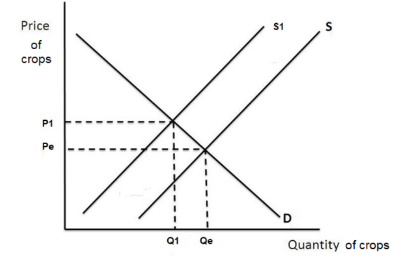

**[3 marks]**

> **[mark-scheme]**
> Award 1 mark for a leftward shift of supply, labelled
> 
> Award 1 mark for a higher equilibrium price, labelled
> 
> Award 1 mark for a lower equilibrium quantity, labelled

> **[exam-tip]**
> - The examiner report for this question notes that some candidates did not label either the new supply curve or the new equilibrium points, and so did not receive full marks
> - Flooding damages the land used to grow crops, so it is supply that shifts left, not demand. You must label the new shift and the new equilibrium points to gain marks, and do not shift both curves, as that does not show you understand the scenario in the question
> - Be very clear when drawing your lines, because an ambiguous diagram is likely to score no marks at all

## Q9 — easy — 2 marks · exam-questions

### 4((a)) — 2 marks
(4,200 + 6,000 + 3,250) − 9,600 **[1 mark]**

**= 3,850 tickets** **[1 mark]**

> **[mark-scheme]**
> Award 1 mark for showing correct calculation
> 
> Award 1 mark for the correct answer
> 
> Award 2 marks if excess demand is correctly calculated as 3,850 tickets, even if no calculations are shown
> 
> Do not award marks for a formula

> **[exam-tip]**
> - The examiner report for this question notes that the main problem was calculations being made incorrectly, leading to a wrong final answer, so add the three concert figures carefully before subtracting
> - Write the unit as well as the number - the answer is 3,850 tickets

## Q10 — easy — 7 marks · exam-questions

### 3((a)) — 1 marks
**Correct answer: B** — Demographic changes

**Final answer:** **The correct answer is B**

A demographic change such as a rise or fall in the population changes how many buyers there are at every price, so the whole demand curve shifts

**A** is incorrect as costs of production affect how much producers are willing to supply, so they shift the supply curve rather than demand

**C** is incorrect as subsidies lower producers' costs, so they also shift the supply curve rather than demand

**D** is incorrect as a change in the price of the good itself causes a movement along the demand curve, not a shift of it

### 3((d)) — 6 marks
Excess supply exists where, at the current price, the quantity producers are willing to supply is greater than the quantity consumers want to buy.** [K]** Figure 4 shows this in Vientiane: at a price of 10,000 Kip eight LOCA drivers are willing to offer journeys but only four passengers want to buy one, leaving four journeys unsold.** [Ap]** Market forces then act through the price mechanism, because drivers with unsold journeys have an incentive to lower their fare rather than earn nothing at all.** [An]** As the fare falls the quantity demanded rises, since journeys become better value for passengers, while some drivers decide the lower fare is no longer worth their time and stop offering journeys, reducing quantity supplied.** [An]** This continues until the fare reaches the equilibrium price of 8 000 Kip, where six journeys are both demanded and supplied and the excess supply has been removed.** [An]**

**[6 marks]**

> **[mark-scheme]**
> This is a 'levelled response' question
> 
> - **[Ap]** = application to the data given  (3 marks)
> - **[An]** = analysis / chain of reasoning (3 marks)
> 
> Although there are no separate **[K] marks**, both application and analysis must be built on **clear and accurate economic knowledge and understanding**
> 
> Therefore, each KAA paragraph should follow:
> 
> - Valid knowledge point → Application → Analysis
> - Each valid point made in the answer does not equal a mark, the response is judged holistically against the level descriptors
> 
> **Mark allocation**
> 
> Answers are placed into one of three levels.  **A level 3 answer (5-6 marks)**, will specifically:
> 
> - Demonstrate clear knowledge and understanding by developing relevant points and include appropriate application of economic terms, concepts, theories and calculations
> - Information presented will demonstrate excellent selectivity and organisation. Interpretation of economic information will be excellent, with a thorough analysis of issues
> 
> **Alternative content**
> 
> The answer above is just one example of how to respond to this question. Additional information which could be used in the answer includes:
> 
> - Excess supply is where supply is greater than demand and there are unsold products in the market
> - Market forces refer to supply and demand, as well as how they determine the allocation of scarce resources and price
> - Where there is excess supply at 10 000 Kip, price will fall as a result of supply being greater than demand
> - At 10 000 Kip, eight LOCA drivers wanted to offer journeys but only four passengers wanted to buy
> - If drivers lowered their price to 8 000 Kip the excess supply would be removed
> - Demand rises as the price falls, until the equilibrium price of 8 000 Kip and the equilibrium quantity of six journeys is reached
> - Any other relevant and valid analysis is acceptable

> **[exam-tip]**
> - No counter-argument and no conclusion is required - analyse is always one-sided
> - Use the actual figures from Figure 4 (10 000 Kip, eight drivers, four passengers, the 8 000 Kip equilibrium) rather than describing the price mechanism in general terms

## Q11 — easy — 2 marks · exam-questions

### 4((a)) — 2 marks
8,891,388 − 8,069,276 = 822,112 **[1 mark]**

822,112 ÷ 8,069,276 × 100 = **10.19%** **[1 mark]**

> **[mark-scheme]**
> Award 1 mark for showing correct calculation
> 
> Award 1 mark for the correct percentage change
> 
> Award 2 marks if the percentage change is accurately calculated as 10.19%, even if no calculations are shown
> 
> Award 1 mark if the answer given is 10.19 with or without calculations shown
> 
> Do not award marks for a formula

> **[exam-tip]**
> - Examiner reports repeatedly recommend showing your working in a 'calculate' question, so an arithmetic slip does not cost you both marks
> - The question asks for two decimal places, and examiner reports record candidates losing marks by failing to round as instructed or by leaving off the percentage sign

## Q12 — easy — 1 marks · exam-questions

### 2((a)) — 1 marks
**Correct answer: C** — 

**Final answer:** **The correct answer is C**

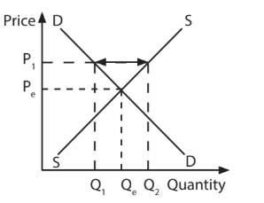

Excess supply occurs when the price is held above the equilibrium price, so the quantity producers are willing to supply is greater than the quantity consumers are willing to buy. Diagram C shows this as the horizontal gap between the supply and demand curves at a price above equilibrium, leaving unsold stock in the market

## Q13 — easy — 6 marks · exam-questions

### 1((b)) — 1 marks
**Correct answer: B** — 

**Final answer:** **The correct answer is B**

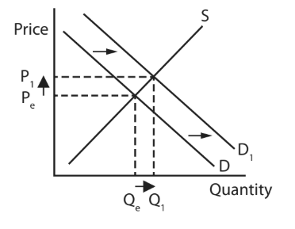

Motorcycles and motorcycle helmets are complementary goods, so a fall in the price of motorcycles means more motorcycles are bought and demand for helmets rises. The demand curve for helmets shifts to the right, raising both the equilibrium price and the equilibrium quantity of helmets

### 1((f)) — 2 marks
(3,600 + 3,200 + 3,100) − 9,000 **[1 mark]**

**= 900** **[1 mark]**

> **[mark-scheme]**
> Award 1 mark for showing correct calculation
> 
> Award 1 mark for the correct answer
> 
> Award 2 marks if excess demand is correctly calculated as 900, even if no calculations are shown
> 
> Award 2 marks for giving the individual excess demand for each month correctly as 600, 200 and 100
> 
> Do not award marks for a formula

> **[exam-tip]**
> - Examiner reports repeatedly recommend showing your working in a 'calculate' question, so an arithmetic slip does not cost you both marks
> - The examiner report for this question confirms that giving the excess demand month by month (600, 200 and 100) also earns both marks, so either route is acceptable

### 1((g)) — 3 marks
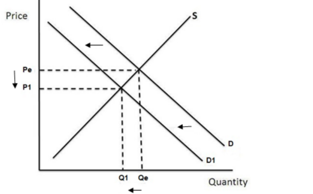

**[3 marks]**

> **[mark-scheme]**
> Award 1 mark for a leftward shift of demand, labelled
> 
> Award 1 mark for a lower equilibrium price, labelled
> 
> Award 1 mark for a lower equilibrium quantity, labelled

> **[exam-tip]**
> - A smaller population means fewer buyers, so it is demand that shifts left, not supply. You must label the new shift and the new equilibrium points to gain marks, and do not shift both curves, as that does not show you understand the scenario in the question
> - The examiner report for this question praised well-practised diagrams here, so this is a straightforward three marks if you label everything
> - Be very clear when drawing your lines, because an ambiguous diagram is likely to score no marks at all

## Q14 — easy — 1 marks · exam-questions

### 3((a)) — 1 marks
**Correct answer: A** — Increased indirect taxes

**Final answer:** **The correct answer is A**

An indirect tax adds to the cost of producing each unit, so at every price firms are willing to supply less and the whole supply curve shifts to the left

**B** is incorrect as cost reductions make production cheaper, shifting supply to the right rather than the left

**C** is incorrect as increased subsidies lower the cost of production, shifting supply to the right

**D** is incorrect as decreased advertising affects how much consumers want the product, so it shifts the demand curve rather than the supply curve

## Q15 — easy — 12 marks · exam-questions

### 1((b)) — 1 marks
**Correct answer: C** — 

**Final answer:** **The correct answer is C**

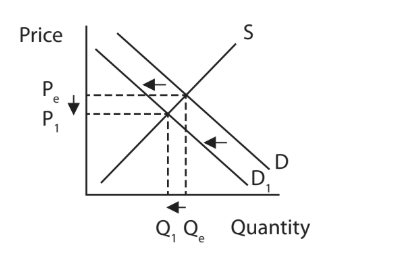

Lemon and chocolate ice cream are substitute goods, so a price reduction in chocolate ice cream makes it better value and some consumers switch to it. Demand for lemon ice cream falls, shifting its demand curve to the left and lowering both the equilibrium price and the equilibrium quantity

### 1((f)) — 2 marks
6,000 − (1,200 + 1,450 + 1,625) **[1 mark]**

**= 1,725 tour guides** **[1 mark]**

> **[mark-scheme]**
> Award 1 mark for showing correct calculation
> 
> Award 1 mark for the correct answer
> 
> Award 2 marks if excess supply is correctly calculated as 1,725 tour guides, even if no calculations are shown
> 
> Award 2 marks for giving the individual excess supply for each month correctly as 800, 550 and 375
> 
> Do not award marks for a formula

> **[exam-tip]**
> - Examiner reports repeatedly recommend showing your working in a 'calculate' question, so an arithmetic slip does not cost you both marks
> - The examiner report for this question confirms that giving the excess supply month by month (800, 550 and 375) also earns both marks, so either route is acceptable

### 1((g)) — 3 marks
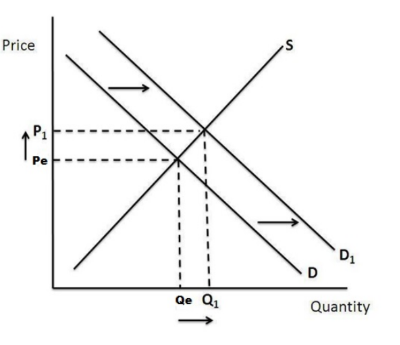

**[3 marks]**

> **[mark-scheme]**
> Award 1 mark for a rightward shift of demand, labelled
> 
> Award 1 mark for a higher equilibrium price, labelled
> 
> Award 1 mark for a higher equilibrium quantity, labelled

> **[exam-tip]**
> - A higher birth rate means more children and so more buyers of toys, so it is demand that shifts right, not supply. You must label the new shift and the new equilibrium points to gain marks, and do not shift both curves, as that does not show you understand the scenario in the question
> - The examiner report for this question notes that candidates who had practised 'draw' questions scored all three marks, so rehearse the labelling until it is automatic
> - Be very clear when drawing your lines, because an ambiguous diagram is likely to score no marks at all

### 1((i)) — 6 marks
The supply curve shows how much of a good producers are willing and able to supply at each price.** [K]** The typhoon that destroyed property on Lamma island damaged restaurants and washed away equipment, leaving one owner facing repair costs estimated at HK\$300,000 to HK\$400,000.** [Ap]** These costs make it both harder and more expensive to supply meals, so at every price restaurants can supply less than before and the supply curve shifts to the left.** [An]** Owners also expect to take two or three months to reopen fully, so capacity is cut for a sustained period rather than briefly, deepening the fall in supply.** [An]** With supply lower and demand unchanged the market settles at a new equilibrium with a higher price and a lower quantity, so diners find fewer restaurant meals available and pay more for them.** [An]**

**[6 marks]**

> **[mark-scheme]**
> This is a 'levelled response' question
> 
> - **[Ap]** = application to the data given  (3 marks)
> - **[An]** = analysis / chain of reasoning (3 marks)
> 
> Although there are no separate **[K] marks**, both application and analysis must be built on **clear and accurate economic knowledge and understanding**
> 
> Therefore, each KAA paragraph should follow:
> 
> - Valid knowledge point → Application → Analysis
> - Each valid point made in the answer does not equal a mark, the response is judged holistically against the level descriptors
> 
> **Mark allocation**
> 
> Answers are placed into one of three levels.  **A level 3 answer (5-6 marks)**, will specifically:
> 
> - Demonstrate clear knowledge and understanding by developing relevant points and include appropriate application of economic terms, concepts, theories and calculations
> - Information presented will demonstrate excellent selectivity and organisation. Interpretation of economic information will be excellent, with a thorough analysis of issues
> 
> **Alternative content**
> 
> The answer above is just one example of how to respond to this question. Additional information which could be used in the answer includes:
> 
> - The supply curve shows how much of a good producers are willing and able to supply at different prices over time
> - Natural factors such as adverse weather could shift the supply curve inwards to the left
> - Adverse weather such as a typhoon can reduce supply because it makes supplying more difficult (destroying property, equipment washed away) and more expensive (costing one restaurant owner between HK\$300,000 and HK\$400,000)
> - If it is more difficult or more expensive to supply, the quantity supplied shifts from Qe to Q1 on the diagram
> - This will therefore result in an increase in the price from Pe to P1 if demand stays the same
> - A supply and demand diagram showing the leftward shift may be used
> - Any other relevant and valid analysis is acceptable

> **[exam-tip]**
> - The examiner report for this question notes that candidates often struggled to reach Level 3 because they offered little development beyond saying the supply curve shifts inwards. Push the chain further, to the new equilibrium price and quantity
> - Do not present a counter argument for 'analyse' questions - there are no marks for doing so and it costs you time elsewhere
> - Use the figures given (HK\$300,000 to HK\$400,000, two or three months to reopen) rather than writing about bad weather in general

## Q16 — easy — 2 marks · exam-questions

### 2((d)) — 2 marks
Demand is the quantity of a good or service that consumers are willing and able to buy** [1]** at a given price over a given period of time** [1]**

**[2 marks]**

> **[mark-scheme]**
> Award 1 mark for reference to the amount consumers are willing and able to purchase and 1 mark for reference to price
> 
> Accept any other correct and appropriate wording

> **[exam-tip]**
> - 'What is meant by' questions carry two marks and need two parts to the definition, so pair the quantity consumers will buy with the price at which they will buy it
> - **Willing and able** is the phrase that earns the first mark. Wanting a good is not demand unless the consumer can also afford it

## Q17 — easy — 13 marks · exam-questions

### 2((e)) — 1 marks
**A decrease in income****[1 mark]**

> **[mark-scheme]**
> **One mark** for one correct factor. Any one from:
> 
> - A decrease in income
> - A decrease in advertising
> - An adverse change in taste and fashion
> - A decrease in the price of a substitute good
> - An increase in the price of a complementary good
> - A decrease in the population
> 
> Accept any other appropriate response

> **[exam-tip]**
> - Give the direction of the change, not just the factor. Examiner reports on this question type note that 'income' on its own does not earn the mark, because it does not show which way the demand curve moves
> - A change in the price of the good itself is not credited, because that causes a movement along the demand curve rather than a shift of it
> - There is only one mark available for 'state' questions and examiners do not expect you to write a lot

### 2((g)) — 3 marks
One reason is that there are likely to be fewer auto rickshaws competing for fares outside the city centre** [1]**, because the majority of Dhaka's 17 million residents live in the city centre** [1]**, so with less competition for each passenger drivers are in a stronger position to agree a higher fare** [1]**

**[3 marks]**

> **[mark-scheme]**
> Award 1 mark for identifying a relevant reason for the difference in price
> 
> Award 1 mark for developing the reason
> 
> Award 1 mark for the response being in the context of transport in Dhaka
> 
> **Alternative content**
> 
> The answer above is just one example of a response to this question. Other reasons that could be used include:
> 
> - Journeys outside the city centre are likely to be longer, so drivers ask for more
> - Drivers may have to return empty from an outlying area, so they charge more to cover the wasted trip
> - Fares are agreed between passenger and driver, so a passenger with fewer rickshaws to choose from has weaker bargaining power
> 
> Accept any other appropriate response

> **[exam-tip]**
> - One of the three marks is for context, so refer to Dhaka and its auto rickshaws specifically rather than writing about transport prices in general
> - There are no marks for definitions on 'explain' questions - they need a reason, development and context

### 2((h)) — 9 marks
Technology can increase supply in a market by making it possible to produce more from the same resources.** [K]** In city centres a lack of space means the quantity of parking spaces demanded is greater than the quantity supplied, and Japan's Automated Parking Systems stack cars on racks so that many more vehicles fit into a very small area.** [Ap]** This shifts the supply curve for parking spaces to the right, and because APS car parks also cost less to build than traditional multi-storey ones, developers have a financial incentive to build them.** [An]** With supply higher and demand unchanged the equilibrium price falls and the equilibrium quantity rises, so drivers get cheaper parking fees and save time, which is exactly what the shortage was preventing.** [An]**

However, the shortage may well persist despite the new technology.** [Ev]** The number of vehicles using city centres is rising, and if it rises faster than APS capacity is added the gap between demand and supply will remain.** [An]** Installing these systems also takes time, so the supply curve may not shift for months or years after the decision is taken, and some motorists distrust handing their car to an automated system and may keep using traditional car parks, leaving the new spaces underused.** [An]**

**[9 marks]**

> **[mark-scheme]**
> This is a 'levelled response' question
> 
> - **[Ap]** = application to the data given  (3 marks)
> - **[An]** = analysis / chain of reasoning (3 marks)
> - **[Ev]** = evaluation (3 marks)
> 
> Although there are no separate **[K] marks**, both application and analysis must be built on **clear and accurate economic knowledge and understanding**
> 
> Therefore, each KAA paragraph should follow:
> 
> - Valid knowledge point → Application → Analysis
> - Each valid point made in the answer does not equal a mark, the response is judged holistically against the level descriptors
> 
> **Mark allocation**
> 
> A 9 mark (Level 3) answer will include examples which demonstrate:
> 
> - **Application [Ap]**: clear knowledge and understanding by developing relevant points. Appropriate application of economic terms, concepts, theories and calculations
> - **Analysis [An]**: information presented will demonstrate excellent selectivity and organisation. Interpretation of economic information will be excellent, with a thorough analysis of issues
> - **Evaluation [Ev]**: offers more than one viewpoint. The argument is well balanced and coherent, leading to an evaluation that demonstrates full understanding and awareness
> 
> **Alternative content**
> 
> The answer above is just one example of how to respond to this question. Additional information which could be used in the answer includes:
> 
> - Without the changes in technology, more parking spaces are demanded than supplied and demand is increasing
> - The introduction of Automated Parking Systems (APS) increases the supply of spaces and so should shift the supply curve to the right
> - Changes in technology allow the gap between demand and supply to be reduced
> - The change in supply will also affect the equilibrium price, making parking cheaper and more available
> - The increase in the number of vehicles may be faster than the increase in the supply of car parking spaces, meaning there is still a shortage
> - There is already such a large excess in demand that the introduction of APS will not make much difference
> - It is likely to take time from the initial decision to having the APS in place, meaning the supply curve may not shift straight away
> - Some motorists do not like change or worry the technology will fail, and may be averse to the idea of automated parking and therefore not use the APS
> - Any other relevant and valid analysis is acceptable

> **[exam-tip]**
> - 'Assess' requires a balanced, two-sided argument which is applied. Examiner reports state that there is no requirement for a judgement or a conclusion, but both the argument and the counter argument should be developed, thorough and in context
> - Build both sides to matching depth. An unbalanced answer is the most common reason marks are lost here
> - Application marks are not awarded simply for repeating the extract - use the detail (the racks, the lower build cost, the cheaper fees) inside your reasoning

## Q18 — easy — 2 marks · exam-questions

### 4((a)) — 2 marks
At a price of \$50 the quantity supplied is 50 and the quantity demanded is 20

50 − 20 **[1 mark]**

**= 30** **[1 mark]**

> **[mark-scheme]**
> Award 1 mark for showing quantity demanded is 20 and quantity supplied is 50
> 
> Award 1 mark for the correct calculation of excess supply
> 
> Award 2 marks if excess supply is correctly calculated as 30, even if no lines are shown on the diagram and no calculation is shown

> **[exam-tip]**
> - Draw a horizontal line across from the price on the vertical axis and read off where it meets each curve. Marking those two points on the diagram makes the subtraction obvious.

## Q19 — easy — 4 marks · exam-questions

### 1((e)) — 1 marks
**A substitute good is a good that can be bought as an alternative to another good ****[1 mark]**

> **[mark-scheme]**
> Award 1 mark for reference to a good bought as an alternative to another good
> 
> No marks are available for an example in place of a definition
> 
> Accept any other correct and appropriate wording

> **[exam-tip]**
> - Do not use examples for 'define' questions. Examiner reports state repeatedly that examiners are only looking for a definition of the term, so naming two rival brands will not earn the mark
> - There is only 1 mark here, so it is either right or wrong and there is no need to go into further detail

### 1((g)) — 3 marks
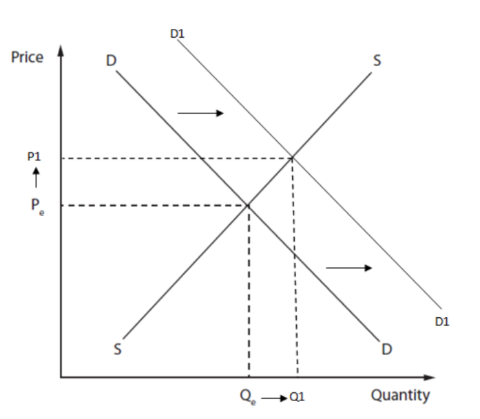

**[3 marks]**

> **[mark-scheme]**
> Award 1 mark for a rightward shift of demand, labelled
> 
> Award 1 mark for a higher equilibrium price, labelled
> 
> Award 1 mark for a higher equilibrium quantity, labelled

> **[exam-tip]**
> - A change in customer preferences towards local firms makes buyers want more at every price, so it is demand that shifts right, not supply. You must label the new shift and the new equilibrium points to gain marks, and do not shift both curves, as that does not show you understand the scenario in the question
> - Examiner reports repeatedly identify missing labels as the main reason marks are lost on 'draw' questions, so label the new curve, the new equilibrium price and the new equilibrium quantity every time
> - Be very clear when drawing your lines, because an ambiguous diagram is likely to score no marks at all

## Q20 — easy — 2 marks · exam-questions

### 4((a)) — 2 marks
At a price of \$20 the quantity demanded is 50 and the quantity supplied is 20

50 − 20 **[1 mark]**

**= 30** **[1 mark]**

> **[mark-scheme]**
> Award 1 mark for showing quantity demanded is 50 and quantity supplied is 20
> 
> Award 1 mark for the correct calculation of excess demand
> 
> Award 2 marks if excess demand is correctly calculated as 30, even if no lines are shown on the diagram and no calculation is shown

> **[exam-tip]**
> - Draw a horizontal line across from the price on the vertical axis and read off where it meets each curve. Marking those two points on the diagram makes the subtraction obvious
> - Excess demand is the quantity demanded minus the quantity supplied, so make sure you subtract in that order

## Q21 — easy — 1 marks · exam-questions

### 1() — 1 marks
Demand is the amount of a good or service that a consumer is willing and able to purchase at a given price in a given time period** ****[1 mark]**

> **[mark-scheme]**
> Award 1 mark for a correct definition
> 
> No marks are available for an example in place of a definition
> 
> Accept any other correct and appropriate wording

## Q22 — easy — 1 marks · exam-questions

### 1() — 1 marks
**A decrease in the cost of production** **[1 mark]**

> **[mark-scheme]**
> **One mark** for one correct factor, with the correct direction. Any one from:
> 
> - A decrease in the cost of production
> - An increase in a subsidy paid to producers
> - A decrease in indirect taxes
> - An improvement in technology
> - An increase in the number of firms in the industry
> - Favourable weather conditions (for agricultural goods)

> **[exam-tip]**
> - Give the direction of the change, not just the factor - naming 'costs' or 'technology' alone without saying which way it moves does not earn the mark
> - A change in the price of the good itself is not credited, because that causes a movement along the supply curve rather than a shift of it
> - There is only one mark available for 'state' questions and examiners do not expect you to write a lot

## Q23 — easy — 1 marks · exam-questions

### 1() — 1 marks
Excess demand occurs when the quantity demanded of a good is greater than the quantity supplied at the current price **[1 mark]**

> **[mark-scheme]**
> Award 1 mark for a correct definition
> 
> No marks are available for an example in place of a definition
> 
> Accept any other correct and appropriate wording

> **[exam-tip]**
> Do not use examples for 'define' questions - examiners are looking for a definition of the term, not an illustration of it. There is only 1 mark here, so it is either right or wrong and there is no need to go into further detail

## Q24 — easy — 2 marks · exam-questions

### 1() — 2 marks
When the price of a good falls, there is a movement down the supply curve **[1]**, causing a contraction in the quantity supplied as producers are less incentivised to supply at the lower price. **[1 ]**

**[2 marks]**

> **[mark-scheme]**
> Award 1 mark for correctly identifying the direction of movement (down the curve) and 1 mark for developing this into the effect on quantity supplied
> 
> Accept any other correct and appropriate wording, e.g. reference to producers being less willing to supply at a lower price

> **[exam-tip]**
> Contraction refers only to a movement along the curve caused by a price change - don't confuse this with a decrease in supply, which is a shift of the whole curve caused by a non-price factor

## Q25 — easy — 2 marks · exam-questions

### 1() — 2 marks
450 - 270 **[1]**

**Excess demand = 180 cakes** **[1]**

> **[mark-scheme]**
> Award 1 mark for correctly calculating total demand (450) and total supply (270) over the three weeks
> 
> Award 1 mark for correctly calculating the excess demand as 180 cakes
> 
> Award 2 marks if excess demand is correctly calculated as 180 cakes, even if no calculation is shown
> 
> Do not award marks for a formula alone

> **[exam-tip]**
> Add up demand and supply separately across all three weeks before subtracting - subtracting week-by-week and adding the differences can lead to errors if you lose track of a step

## Q26 — easy — 1 marks · exam-questions

### 1() — 1 marks
**Correct answer: C** — A rise in the price of a close substitute good

**Final answer:** **The correct answer is C**

A rise in the price of a close substitute makes the good in question relatively cheaper by comparison, so consumers want to buy more of it at every price and the whole demand curve shifts to the right

**A** is incorrect as a fall in income means consumers can afford less of a normal good at every price, shifting demand to the left rather than the right

**B** is incorrect as a decrease in the cost of production affects producers, shifting the supply curve to the right rather than moving demand

**D** is incorrect as a fall in the price of the good itself causes a movement along the existing demand curve, not a shift of the whole curve

## Q27 — easy — 1 marks · exam-questions

### 1() — 1 marks
**Correct answer: D** — A new environmental regulation that raises production costs

**Final answer:** **The correct answer is D**

A new environmental regulation that raises production costs means firms are willing to supply less at every price, so the whole supply curve shifts to the left

**A** is incorrect as a fall in the cost of raw materials lowers production costs, shifting supply to the right rather than the left

**B** is incorrect as a rise in consumers' income affects how much consumers want to buy, shifting the demand curve rather than the supply curve

**C** is incorrect as a subsidy lowers the cost of production, shifting supply to the right rather than the left

## Q28 — medium — 3 marks · exam-questions

### 1((g)) — 3 marks
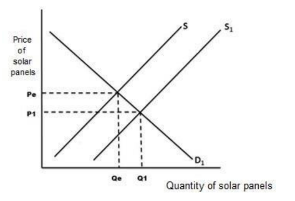

**[3 marks]**

> **[mark-scheme]**
> Award 1 mark for a rightward shift of supply, labelled
> 
> Award 1 mark for a lower equilibrium price, labelled
> 
> Award 1 mark for a higher equilibrium quantity, labelled

> **[exam-tip]**
> - Removing an indirect tax cuts producers' costs, so it is supply that shifts right, not demand. You must label the new shift and the new equilibrium points to gain marks, and do not shift both curves, as that does not show you understand the scenario in the question
> - Examiner reports repeatedly identify missing labels as the main reason marks are lost on 'draw' questions, so label the new curve, the new equilibrium price and the new equilibrium quantity every time
> - Be very clear when drawing your lines, because an ambiguous diagram is likely to score no marks at all

## Q29 — medium — 3 marks · exam-questions

### 1((g)) — 3 marks
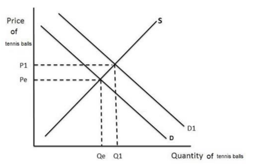

**[3 marks]**

> **[mark-scheme]**
> Award 1 mark for a rightward shift of demand, labelled
> 
> Award 1 mark for a higher equilibrium price, labelled
> 
> Award 1 mark for a higher equilibrium quantity, labelled

> **[exam-tip]**
> - Tennis rackets and tennis balls are complementary goods, so cheaper rackets means more people play and demand for balls shifts right, not supply. You must label the new shift and the new equilibrium points to gain marks, and do not shift both curves, as that does not show you understand the scenario in the question
> - Examiner reports repeatedly identify missing labels as the main reason marks are lost on 'draw' questions, so label the new curve, the new equilibrium price and the new equilibrium quantity every time
> - Be very clear when drawing your lines, because an ambiguous diagram is likely to score no marks at all

## Q30 — medium — 3 marks · exam-questions

### 1((g)) — 3 marks
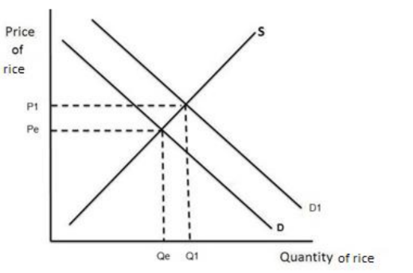

**[3 marks]**

> **[mark-scheme]**
> Award 1 mark for a rightward shift of the demand curve, labelled
> 
> Award 1 mark for a higher equilibrium price, labelled
> 
> Award 1 mark for a higher equilibrium quantity, labelled

> **[exam-tip]**
> - A larger population means more buyers, so it is demand that shifts right, not supply. You must label the new shift and the new equilibrium points to gain marks, and do not shift both curves, as that does not show you understand the scenario in the question
> - Examiner reports repeatedly identify missing labels as the main reason marks are lost on 'draw' questions, so label the new curve, the new equilibrium price and the new equilibrium quantity every time
> - Be very clear when drawing your lines, because an ambiguous diagram is likely to score no marks at all

## Q31 — medium — 3 marks · exam-questions

### 1((g)) — 3 marks
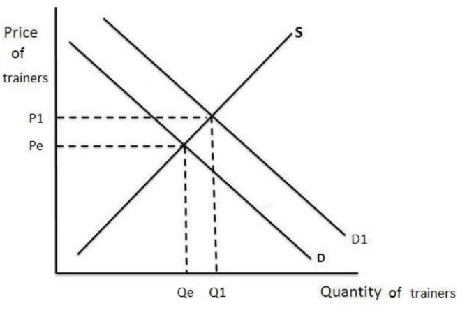

**[3 marks]**

> **[mark-scheme]**
> Award 1 mark for a rightward shift of demand, labelled
> 
> Award 1 mark for a higher equilibrium price, labelled
> 
> Award 1 mark for a higher equilibrium quantity, labelled

> **[exam-tip]**
> - A change in fashion or taste driven by a celebrity makes buyers want more at every price, so it is demand that shifts right, not supply. You must label the new shift and the new equilibrium points to gain marks, and do not shift both curves, as that does not show you understand the scenario in the question
> - Examiner reports repeatedly identify missing labels as the main reason marks are lost on 'draw' questions, so label the new curve, the new equilibrium price and the new equilibrium quantity every time
> - Be very clear when drawing your lines, because an ambiguous diagram is likely to score no marks at all

## Q32 — medium — 6 marks · exam-questions

### 4((b)) — 6 marks
The equilibrium price is the price at which the quantity supplied equals the quantity demanded, so there is neither excess demand nor excess supply.** [K]** In Morocco tagines have become an increasingly popular souvenir, so demand in the areas visited by tourists such as Marrakesh has risen and the demand curve for tagines sold to tourists shifts to the right.** [Ap]** With supply unchanged at first this creates a shortage at the old price, and sellers respond by raising the price because tourists are still willing to buy.** [An]** The higher price signals to producers that selling in tourist areas is more profitable, so more of them move away from ordinary Moroccan markets to sell in Marrakesh, increasing the quantity supplied there.** [An]** As supply rises the upward pressure on price eases, and a new equilibrium is reached where the quantity of tagines supplied to tourists again equals the quantity demanded.** [An]**

**[6 marks]**

> **[mark-scheme]**
> This is a 'levelled response' question
> 
> - **[Ap]** = application to the data given  (3 marks)
> - **[An]** = analysis / chain of reasoning (3 marks)
> 
> Although there are no separate **[K] marks**, both application and analysis must be built on **clear and accurate economic knowledge and understanding**
> 
> Therefore, each KAA paragraph should follow:
> 
> - Valid knowledge point → Application → Analysis
> - Each valid point made in the answer does not equal a mark, the response is judged holistically against the level descriptors
> 
> **Mark allocation**
> 
> Answers are placed into one of three levels.  **A level 3 answer (5-6 marks)**, will specifically:
> 
> - Demonstrate clear knowledge and understanding by developing relevant points and include appropriate application of economic terms, concepts, theories and calculations
> - Information presented will demonstrate excellent selectivity and organisation. Interpretation of economic information will be excellent, with a thorough analysis of issues
> 
> **Alternative content**
> 
> The answer above is just one example of how to respond to this question. Additional information which could be used in the answer includes:
> 
> - Equilibrium price is the price at which the quantity supplied equals the quantity demanded
> - The increase in popularity of tagines bought by tourists means there is an increased demand at the markets visited by tourists, which would shift demand to the right
> - Producers are likely to be attracted to those markets in order to sell the tagines to tourists, because the increase in demand would lead to them being able to charge a higher price
> - As the higher price attracts more producers, supply will increase until the point where an equilibrium is reached
> - At this point the equilibrium price for tagines sold to tourists will be reached, because it is the price where supply is equal to demand
> - A supply and demand diagram showing the equilibrium price (Pe) where quantity supplied equals quantity demanded (Qe) may be used and explained
> - Any other relevant and valid analysis is acceptable

> **[exam-tip]**
> - No counter-argument and no conclusion is required - analyse is always one-sided
> - Use the detail given (tagines as tourist souvenirs, producers moving to Marrakesh) rather than explaining equilibrium in the abstract. The application marks depend on it
> - A labelled diagram is worth including here, but it must be explained in the writing to earn credit

## Q33 — medium — 3 marks · exam-questions

### 1((g)) — 3 marks
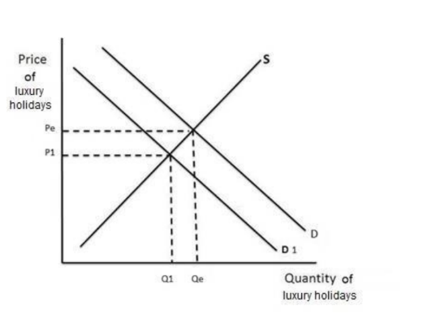

**[3 marks]**

> **[mark-scheme]**
> Award 1 mark for a leftward shift of demand, labelled
> 
> Award 1 mark for a lower equilibrium price, labelled
> 
> Award 1 mark for a lower equilibrium quantity, labelled

> **[exam-tip]**
> - Luxury holidays are a normal good, so a fall in income means buyers want fewer at every price and demand shifts left, not supply. You must label the new shift and the new equilibrium points to gain marks, and do not shift both curves, as that does not show you understand the scenario in the question
> - Examiner reports repeatedly identify missing labels as the main reason marks are lost on 'draw' questions, so label the new curve, the new equilibrium price and the new equilibrium quantity every time
> - Be very clear when drawing your lines, because an ambiguous diagram is likely to score no marks at all

## Q34 — medium — 3 marks · exam-questions

### 1((g)) — 3 marks
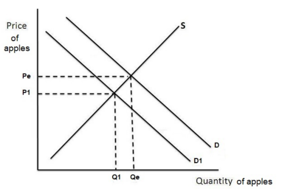

**[3 marks]**

> **[mark-scheme]**
> Award 1 mark for a leftward shift of demand, labelled
> 
> Award 1 mark for a lower equilibrium price, labelled
> 
> Award 1 mark for a lower equilibrium quantity, labelled

> **[exam-tip]**
> - Apples and bananas are substitute goods, so cheaper bananas mean some buyers switch away and demand for apples shifts left, not supply. You must label the new shift and the new equilibrium points to gain marks, and do not shift both curves, as that does not show you understand the scenario in the question
> - Examiner reports repeatedly identify missing labels as the main reason marks are lost on 'draw' questions, so label the new curve, the new equilibrium price and the new equilibrium quantity every time
> - Be very clear when drawing your lines, because an ambiguous diagram is likely to score no marks at all

## Q35 — medium — 3 marks · exam-questions

### 2((g)) — 3 marks
One effect is that a rise in the price of wheat increases the quantity supplied** [1]**, because Figure 2 shows that when the price rises from \$4.50 to \$5.00 producers offer more units for sale** [1]**, since selling at the higher price earns them more profit on each unit** [1]**

**[3 marks]**

> **[mark-scheme]**
> Award 1 mark for identifying a relevant effect
> 
> Award 1 mark for putting the response in context
> 
> Award 1 mark for developing the effect
> 
> **Alternative content**
> 
> The answer above is just one example of a response to this question. The opposite case is equally creditable:
> 
> - A fall in the price of wheat decreases the quantity supplied
> - A decrease from \$4.50 to \$4.00 results in fewer units being offered
> - This is a movement along the supply curve rather than a shift of it
> 
> Accept any other appropriate response

> **[exam-tip]**
> - The examiner report for this question sets the three marks out as effect, context and development, and credits exactly this chain: the price change, the figures from the diagram, then why producers respond that way
> - This is a movement along the supply curve, not a shift of it, because it is the price of wheat itself that has changed
> - Try to avoid repeating the question back, as there are no marks for doing so and it uses time you need elsewhere

## Q36 — medium — 3 marks · exam-questions

### 2((g)) — 3 marks
One effect is that a fall in the price of cocoa beans increases the quantity demanded** [1]**, because Figure 3 shows that when the price falls from \$2.32 to \$2.22 buyers purchase more units** [1]**, since cocoa beans become better value for money compared with substitute ingredients** [1]**

**[3 marks]**

> **[mark-scheme]**
> Award 1 mark for identifying a relevant effect
> 
> Award 1 mark for putting the response in context
> 
> Award 1 mark for developing the effect
> 
> **Alternative content**
> 
> The answer above is just one example of a response to this question. The opposite case is equally creditable:
> 
> - A rise in the price of cocoa beans decreases the quantity demanded
> - An increase from \$2.32 to \$2.42 results in fewer units being bought
> - This is a movement along the demand curve rather than a shift of it
> 
> Accept any other appropriate response

> **[exam-tip]**
> - This is a movement along the demand curve, not a shift of it, because it is the price of cocoa beans itself that has changed. Saying the curve shifts would lose the effect mark
> - One of the three marks is for context, so quote the actual prices from Figure 3 rather than describing the law of demand in general

## Q37 — medium — 3 marks · exam-questions

### 1((g)) — 3 marks
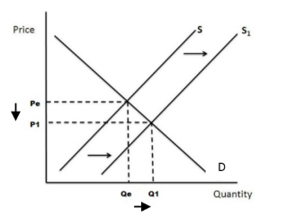

**[3 marks]**

> **[mark-scheme]**
> Award 1 mark for a rightward shift of supply, labelled
> 
> Award 1 mark for a lower equilibrium price, labelled
> 
> Award 1 mark for a higher equilibrium quantity, labelled

> **[exam-tip]**
> - More effective technology lowers the cost of producing each car, so it is supply that shifts right, not demand. You must label the new shift and the new equilibrium points to gain marks, and do not shift both curves, as that does not show you understand the scenario in the question
> - Examiner reports repeatedly identify missing labels as the main reason marks are lost on 'draw' questions, so label the new curve, the new equilibrium price and the new equilibrium quantity every time
> - Be very clear when drawing your lines, because an ambiguous diagram is likely to score no marks at all

## Q38 — medium — 3 marks · exam-questions

### 1((g)) — 3 marks
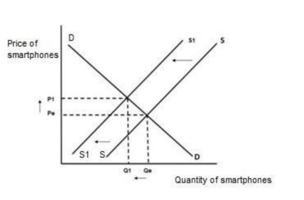

**[3 marks]**

> **[mark-scheme]**
> Award 1 mark for a leftward shift of supply, labelled
> 
> Award 1 mark for a higher equilibrium price, labelled
> 
> Award 1 mark for a lower equilibrium quantity, labelled

> **[exam-tip]**
> - A rise in the cost of raw materials makes each smartphone more expensive to produce, so it is supply that shifts left, not demand. You must label the new shift and the new equilibrium points to gain marks, and do not shift both curves, as that does not show you understand the scenario in the question
> - Examiner reports repeatedly identify missing labels as the main reason marks are lost on 'draw' questions, so label the new curve, the new equilibrium price and the new equilibrium quantity every time
> - Be very clear when drawing your lines, because an ambiguous diagram is likely to score no marks at all

## Q39 — medium — 6 marks · exam-questions

### 3((d)) — 6 marks
A demand curve shows how much of a good consumers will buy at each price.** [K]** Pepsi was one of the main advertisers during the 2019 Cricket World Cup, an event watched in stadiums and on television by supporters of India, Bangladesh, England, Pakistan and Sri Lanka.** [Ap]** Advertising on this scale raises awareness of the brand among a very large worldwide audience, and viewers begin to associate Pepsi with an event they are enjoying, which builds brand loyalty.** [An]** Because consumers now want more Pepsi at every price, this is an increase in demand and the whole demand curve shifts to the right, rather than a movement along it.** [An]** With supply unchanged, that rightward shift raises both the equilibrium price and the equilibrium quantity of Pepsi sold, so the firm gains higher sales during the tournament.** [An]**

**[6 marks]**

> **[mark-scheme]**
> This is a 'levelled response' question
> 
> - **[Ap]** = application to the data given  (3 marks)
> - **[An]** = analysis / chain of reasoning (3 marks)
> 
> Although there are no separate **[K] marks**, both application and analysis must be built on **clear and accurate economic knowledge and understanding**
> 
> Therefore, each KAA paragraph should follow:
> 
> - Valid knowledge point → Application → Analysis
> - Each valid point made in the answer does not equal a mark, the response is judged holistically against the level descriptors
> 
> **Mark allocation**
> 
> Answers are placed into one of three levels.  **A level 3 answer (5-6 marks)**, will specifically:
> 
> - Demonstrate clear knowledge and understanding by developing relevant points and include appropriate application of economic terms, concepts, theories and calculations
> - Information presented will demonstrate excellent selectivity and organisation. Interpretation of economic information will be excellent, with a thorough analysis of issues
> 
> **Alternative content**
> 
> The answer above is just one example of how to respond to this question. Additional information which could be used in the answer includes:
> 
> - A demand curve shows how much of a good will be purchased at different prices
> - Advertising is one of the factors likely to shift a demand curve to the right, which is an increase in demand
> - Worldwide advertising during a popular event such as an international cricket match may encourage consumers to purchase Pepsi through greater awareness and brand loyalty
> - Demand is likely to have increased as a result of the advertising, moving from Qe to Q1, because consumers of soft drinks may be influenced by the adverts and associate Pepsi with the cricket
> - A labelled supply and demand diagram showing the rightward shift may be used and explained
> - Any other relevant and valid analysis is acceptable

> **[exam-tip]**
> - No counter-argument and no conclusion is required - analyse is always one-sided
> - Be precise about the difference between a shift of demand and a movement along the curve. Advertising shifts the whole curve, because buyers want more at every price
> - Use the detail given (the World Cup, the countries watching, Pepsi as a main advertiser) rather than writing about advertising in general

## Q40 — medium — 3 marks · exam-questions

### 1((g)) — 3 marks
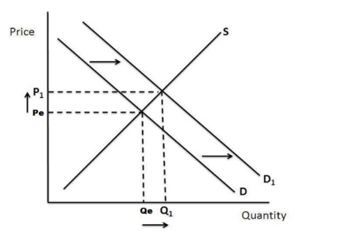

**[3 marks]**

> **[mark-scheme]**
> Award 1 mark for a rightward shift of demand, labelled
> 
> Award 1 mark for a higher equilibrium price, labelled
> 
> Award 1 mark for a higher equilibrium quantity, labelled

> **[exam-tip]**
> - Wireless headphones are a normal good, so a rise in income means buyers want more at every price and demand shifts right, not supply. You must label the new shift and the new equilibrium points to gain marks, and do not shift both curves, as that does not show you understand the scenario in the question
> - Examiner reports repeatedly identify missing labels as the main reason marks are lost on 'draw' questions, so label the new curve, the new equilibrium price and the new equilibrium quantity every time
> - Be very clear when drawing your lines, because an ambiguous diagram is likely to score no marks at all

## Q41 — medium — 3 marks · exam-questions

### 1((g)) — 3 marks
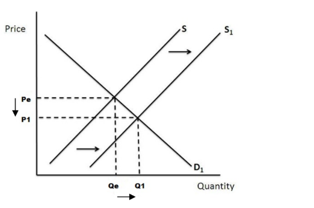

**[3 marks]**

> **[mark-scheme]**
> Award 1 mark for a rightward shift of supply, labelled
> 
> Award 1 mark for a lower equilibrium price, labelled
> 
> Award 1 mark for a higher equilibrium quantity, labelled

> **[exam-tip]**
> - Removing an indirect tax cuts producers' costs, so it is supply that shifts right, not demand. You must label the new shift and the new equilibrium points to gain marks, and do not shift both curves, as that does not show you understand the scenario in the question
> - Examiner reports repeatedly identify missing labels as the main reason marks are lost on 'draw' questions, so label the new curve, the new equilibrium price and the new equilibrium quantity every time
> - Be very clear when drawing your lines, because an ambiguous diagram is likely to score no marks at all

## Q42 — medium — 3 marks · exam-questions

### 1((g)) — 3 marks
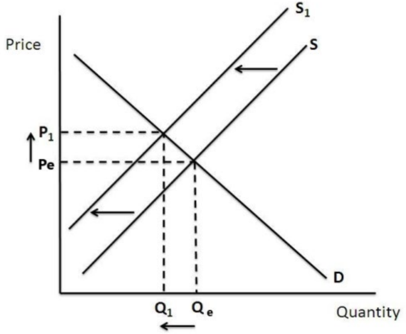

**[3 marks]**

> **[mark-scheme]**
> Award 1 mark for a leftward shift of supply, labelled
> 
> Award 1 mark for a higher equilibrium price, labelled
> 
> Award 1 mark for a lower equilibrium quantity, labelled

> **[exam-tip]**
> - A hurricane destroying farmland reduces the land available to grow crops, so it is supply that shifts left, not demand. You must label the new shift and the new equilibrium points to gain marks, and do not shift both curves, as that does not show you understand the scenario in the question
> - Examiner reports repeatedly identify missing labels as the main reason marks are lost on 'draw' questions, so label the new curve, the new equilibrium price and the new equilibrium quantity every time
> - Be very clear when drawing your lines, because an ambiguous diagram is likely to score no marks at all

## Q43 — medium — 3 marks · exam-questions

### 1() — 3 marks
Because the drought destroys part of Colombia's coffee harvest, the supply of coffee beans decreases, shifting the supply curve left **[1],** which creates excess demand at the original price **[1]**, so sellers raise prices until a new, higher equilibrium price is reached.** [1]**

**[3 marks]**

> **[mark-scheme]**
> Award 1 mark for identifying the correct direction of the shift in supply and the resulting disequilibrium
> 
> Award 1 mark for the response being in context
> 
> Award 1 mark for developing this into the effect on the equilibrium price
> 
> **Alternative content**
> 
> The answer above is just one example of a response to this question. Other valid points include:
> 
> - Coffee producers unaffected by the drought could benefit from the higher price
> - Coffee buyers, such as roasters, would face higher costs and may raise the price of coffee to consumers
> 
> Accept any other appropriate response

> **[exam-tip]**
> - Work through the sequence in order: shift → disequilibrium at the old price → price change → new equilibrium; skipping straight to 'price rises' without explaining why loses marks
> - Name Colombia and refer to coffee beans specifically — the context mark is the one most often lost even when the economics is right

## Q44 — medium — 3 marks · exam-questions

### 1() — 3 marks
Because the good weather increases the amount of wheat Ukraine's farmers can harvest, the supply of wheat increases, shifting the supply curve right **[1]**, which creates excess supply at the original price **[1]**, so sellers lower prices until a new, lower equilibrium price is reached. **[1]**

**[3 marks]**

> **[mark-scheme]**
> Award 1 mark for identifying the correct direction of the shift in supply and the resulting disequilibrium
> 
> Award 1 mark for the response being in context
> 
> Award 1 mark for developing this into the effect on the equilibrium price
> 
> **Alternative content**
> 
> The answer above is just one example of a response to this question. Other valid points include:
> 
> - Ukrainian wheat farmers may earn less revenue per tonne sold, even if they sell a larger quantity
> - Buyers of wheat, such as flour mills, would benefit from lower costs
> 
> Accept any other appropriate response

> **[exam-tip]**
> - Work through the sequence in order: shift → disequilibrium at the old price → price change → new equilibrium; skipping straight to 'price falls' without explaining why loses marks
> - Name Ukraine and refer to wheat specifically — the context mark is the one most often lost even when the economics is right

## Q45 — medium — 3 marks · exam-questions

### 1() — 3 marks
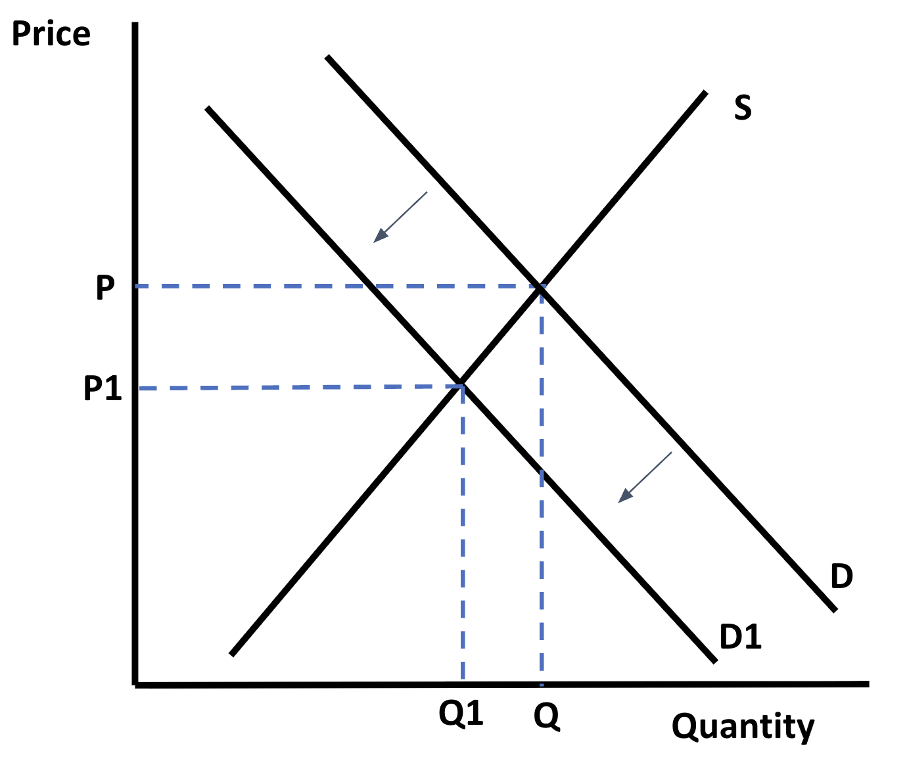

**[3 marks]**

> **[mark-scheme]**
> Award 1 mark for a leftward shift of demand, labelled
> 
> Award 1 mark for a lower equilibrium price, labelled
> 
> Award 1 mark for a lower equilibrium quantity, labelled

> **[exam-tip]**
> - A rival smartphone brand becoming more popular means buyers switch away from the older model at every price, so it is demand that shifts left, not supply. You must label the new shift and the new equilibrium points to gain marks, and do not shift both curves, as that does not show you understand the scenario in the question
> - Examiner reports repeatedly identify missing labels as the main reason marks are lost on 'draw' questions, so label the new curve, the new equilibrium price and the new equilibrium quantity every time

## Q46 — medium — 3 marks · exam-questions

### 1() — 3 marks
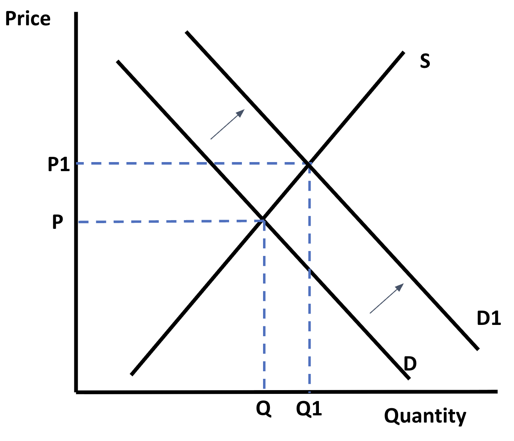

**[3 marks]**

> **[mark-scheme]**
> Award 1 mark for a rightward shift of demand, labelled
> 
> Award 1 mark for a higher equilibrium price, labelled
> 
> Award 1 mark for a higher equilibrium quantity, labelled

> **[exam-tip]**
> - A new fashion trend means buyers want more of this style of trainers at every price, so it is demand that shifts right, not supply. You must label the new shift and the new equilibrium points to gain marks, and do not shift both curves, as that does not show you understand the scenario in the question
> - Examiner reports repeatedly identify missing labels as the main reason marks are lost on 'draw' questions, so label the new curve, the new equilibrium price and the new equilibrium quantity every time

## Q47 — medium — 3 marks · exam-questions

### 1() — 3 marks
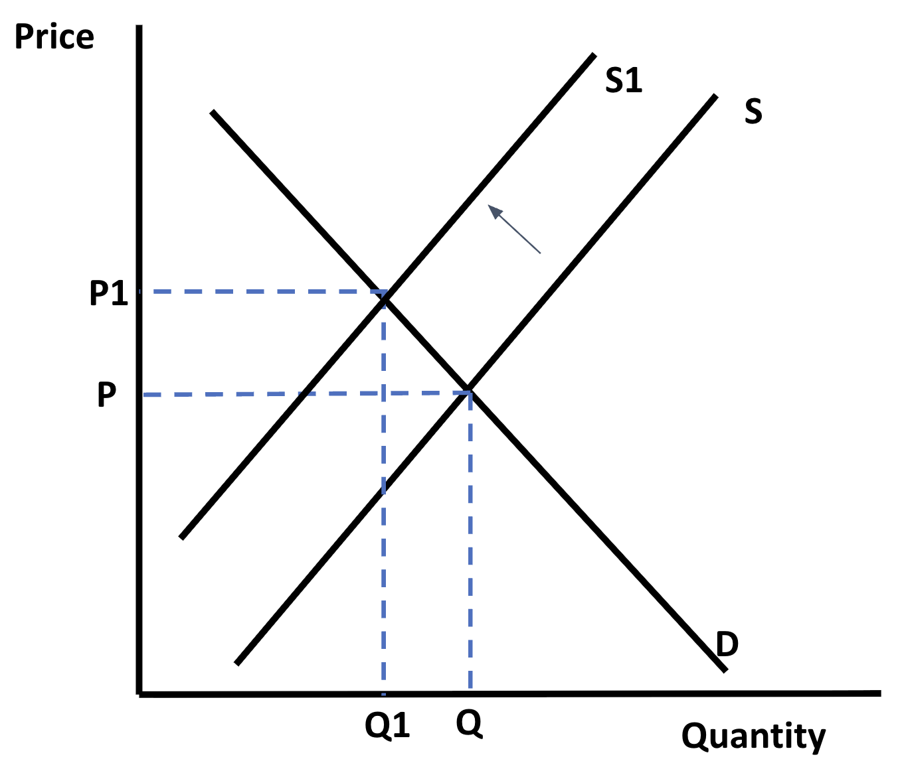

**[3 marks]**

> **[mark-scheme]**
> Award 1 mark for a leftward shift of supply, labelled
> 
> Award 1 mark for a higher equilibrium price, labelled
> 
> Award 1 mark for a lower equilibrium quantity, labelled

> **[exam-tip]**
> - A workers' strike disrupting production at the factory reduces the quantity firms can supply at every price, so it is supply that shifts left, not demand. You must label the new shift and the new equilibrium points to gain marks, and do not shift both curves, as that does not show you understand the scenario in the question
> - Examiner reports repeatedly identify missing labels as the main reason marks are lost on 'draw' questions, so label the new curve, the new equilibrium price and the new equilibrium quantity every time

## Q48 — hard — 9 marks · exam-questions

### 1() — 9 marks
One group of stakeholders that could benefit from this supply shock is poultry farmers whose flocks were not affected by the disease outbreak.** [Ap]** Because the cull of around 8 million chickens sharply reduces the overall supply of chicken meat, the supply curve shifts left, creating excess demand at the original price and pushing the equilibrium price of chicken meat upward.** [K]** Unaffected farmers can now sell their existing chicken meat at this higher price, increasing their revenue even without producing any more than before.** [An]** Given that Brazil exports around 30% of the world's chicken meat, farmers who can maintain supply may also gain a stronger position in international markets as competitors' output falls.** [An]**

However, this price rise is likely to harm consumers who rely on chicken as an affordable source of protein, both in Brazil and in the many countries that import the 30% share of global chicken meat Brazil supplies.** [Ev]** Because chicken is described as an affordable protein source, lower-income households may be disproportionately affected if they cannot easily substitute towards a similarly cheap alternative, reducing their protein intake or increasing their food spending.** [Ap]** Businesses that rely on chicken meat, such as restaurants and food manufacturers, would also face higher costs, which they may pass on to their own customers through higher prices.** [An]** If the disease outbreak continues or spreads further, this shortage and its impact on affected stakeholders could persist for a long period, rather than being resolved quickly.** [An]**

**[9 marks]**

> **[mark-scheme]**
> This is a 'levelled response' question
> 
> - **[Ap]** = application to the data given (3 marks)
> - **[An]** = analysis / chain of reasoning (3 marks)
> - **[Ev]** = evaluation (3 marks)
> 
> Although there are no separate **[K] marks**, both application and analysis must be built on **clear and accurate economic knowledge and understanding**
> 
> Therefore, each KAA paragraph should follow:
> 
> - Valid knowledge point → Application → Analysis
> - Each valid point made in the answer does not equal a mark — the response is judged holistically against the level descriptors
> 
> **Mark allocation**
> 
> A 9 mark (Level 3) answer will include examples which demonstrate:
> 
> - **Application [Ap]** — clear knowledge and understanding by developing relevant points. Appropriate application of economic terms, concepts, theories and calculations
> - **Analysis [An]** — Information presented will demonstrate excellent selectivity and organisation. Interpretation of economic information will be excellent, with a thorough analysis of issues
> - **Evaluation [Ev]** — Offers more than one viewpoint. The argument is well balanced and coherent, leading to an evaluation that demonstrates full understanding and awareness
> 
> **Alternative content**
> 
> The answer above is just one example of how to respond to this question. Additional information which could be used in the answer includes:
> 
> - Farmers who lost flocks to the cull face the opposite situation to unaffected farmers — lost income and the cost of restocking, rather than higher revenue from stock they no longer have
> - Producers of substitute proteins, such as beef or pork, could see rising demand as some consumers switch away from more expensive chicken
> - Brazil's trade balance could be affected if a smaller volume of chicken exports partly offsets the benefit of higher export prices
> - Any other relevant and valid evaluation is acceptable

> **[exam-tip]**
> - 'Assess' requires you to consider two sides
> 
>   - Build both sides to matching depth – an unbalanced answer is the single biggest reason marks are lost here, even when both sides are technically present
>   - No conclusion required
> - Use the specific figures given (the 8 million chickens culled, Brazil's 30% global export share, chicken as an affordable protein) rather than writing about supply shocks in general
> - Because this is a stakeholder-impact question, the two sides should be different groups of people (e.g. unaffected farmers vs consumers), not the pros and cons of one group's situation — check the question is really asking 'who gains, who loses'

## Q49 — hard — 9 marks · exam-questions

### 1() — 9 marks
One group of stakeholders that benefits from this increase in demand is residents who rent out spare rooms or apartments to visitors during the sporting event.** [K]** Because the event is expected to attract 1.5 million visitors over two weeks, this causes a sharp temporary increase in demand for short-term accommodation, shifting the demand curve right and creating excess demand at the original price, pushing the equilibrium price of short-term accommodation upward.** [Ap]** These residents can charge higher prices for the same accommodation, significantly increasing their income for the duration of the event.** [An]** Local businesses that serve visitors, such as restaurants and shops, may also benefit from 1.5 million extra people spending money in the city over the two weeks.** [An]**

However, this rise in accommodation prices could harm residents who are trying to rent long-term housing in the same neighbourhoods, since some property owners may be tempted to switch from long-term lets to more profitable short-term lets during the event.** [Ev]** Because this reduces the supply of long-term housing available, residents searching for a home to rent may face higher prices or a more limited choice of properties, even though the two-week event itself is temporary.** [Ap]** This effect could be particularly damaging for lower-income residents, who may be less able to compete with the higher prices 1.5 million visitors and short-term landlords are willing to pay.** [An]** If property owners switch back to long-term letting once the event ends, this harm may only be temporary, but if the event encourages a lasting shift towards short-term letting, the impact on long-term renters could persist.** [An]**

**[9 marks]**

> **[mark-scheme]**
> This is a 'levelled response' question
> 
> - **[Ap]** = application to the data given (3 marks)
> - **[An]** = analysis / chain of reasoning (3 marks)
> - **[Ev]** = evaluation (3 marks)
> 
> Although there are no separate **[K] marks**, both application and analysis must be built on **clear and accurate economic knowledge and understanding**
> 
> Therefore, each KAA paragraph should follow:
> 
> - Valid knowledge point → Application → Analysis
> - Each valid point made in the answer does not equal a mark — the response is judged holistically against the level descriptors
> 
> **Mark allocation**
> 
> A 9 mark (Level 3) answer will include examples which demonstrate:
> 
> - **Application [Ap]** — clear knowledge and understanding by developing relevant points. Appropriate application of economic terms, concepts, theories and calculations
> - **Analysis [An]** — Information presented will demonstrate excellent selectivity and organisation. Interpretation of economic information will be excellent, with a thorough analysis of issues
> - **Evaluation [Ev]** — Offers more than one viewpoint. The argument is well balanced and coherent, leading to an evaluation that demonstrates full understanding and awareness
> 
> **Alternative content**
> 
> The answer above is just one example of how to respond to this question. Additional information which could be used in the answer includes:
> 
> - Existing hotels and formal accommodation providers could benefit from overflow demand they cannot fully meet, or lose business if short-term lets undercut their prices
> - Transport providers and attractions elsewhere in the city could see a wider boost in demand from the extra visitors, beyond the accommodation market itself
> - If short-term letting becomes permanently more attractive than long-term letting after the event, this could cause a lasting reduction in the supply of long-term housing, not just a temporary one
> - Any other relevant and valid evaluation is acceptable

> **[exam-tip]**
> - 'Assess' requires you to consider two sides
> 
>   - Build both sides to matching depth – an unbalanced answer is the single biggest reason marks are lost here, even when both sides are technically present
>   - No conclusion required
> - Use the specific detail given (the 1.5 million visitors, the two-week event, Lisbon, residents renting to visitors vs residents seeking long-term housing) rather than writing about demand increases in general

## Q50 — hard — 12 marks · exam-questions

### 1() — 12 marks
Relying on market forces to resolve the shortage should work over time, since the rising price of rice signals to producers that more is needed and rewards them for expanding production.** [Ap]** Because domestic producers are already at full capacity following the 30% fall in production, the rising price is also likely to attract imports from abroad, as foreign suppliers are drawn in by the higher price on offer, helping to close the gap between quantity demanded and quantity supplied more quickly than relying on domestic producers alone.** [An]** As the price rises, this also causes a contraction in the quantity of rice demanded, since some buyers reduce their consumption or seek substitutes, which itself helps to reduce the size of the shortage without requiring any government intervention.** [An]**

However, because rice makes up around 40% of daily calorie intake for most Filipino households, a rising price is likely to cause significant hardship, particularly for low-income households who spend a larger share of their income on food and have less ability to switch to alternatives.** [Ev]** Because domestic supply cannot increase until the next growing season, the shortage - and the higher prices caused by it - could persist for several months, meaning this hardship is not a brief, one-off cost but a sustained fall in living standards for the most vulnerable households.** [Ap]** If households cannot afford enough rice at the higher price, this could also worsen malnutrition given how central rice is to the average diet, or force families to cut spending on other essentials, such as healthcare or education.** [An]**

Overall, whether relying on market forces is the best response depends on how quickly imports and other sources of supply can respond compared to how severe the hardship to low-income households would be in the meantime.** [Ev]** If imports can arrive quickly and cheaply, market forces may resolve the 30% shortfall with relatively little lasting harm; but if imports are limited, expensive or slow to arrive, the sustained high price of a staple providing 40% of daily calories could cause serious hardship for low-income households before domestic supply eventually recovers.** [Ev]**

**[12 marks]**

> **[mark-scheme]**
> This is a 'levelled response' question
> 
> - **[Ap]** = application to the data given (4 marks)
> - **[An]** = analysis / chain of reasoning (4 marks)
> - **[Ev]** = evaluation (4 marks)
> 
> Although there are no separate **[K] marks**, both application and analysis must be built on **clear and accurate economic knowledge and understanding**
> 
> Therefore, each KAA paragraph should follow:
> 
> - Valid knowledge point → Application → Analysis
> - Each valid point made in the answer does not equal a mark — the response is judged holistically against the level descriptors
> 
> A concluding paragraph is essential to scoring evaluation marks
> 
> **Mark allocation**
> 
> A 12 mark (Level 3) answer will include answers which:
> 
> - **Application [Ap]** — Demonstrates specific and accurate knowledge and understanding by developing relevant points. Appropriate application of economic terms, concepts, theories and calculation
> - **Analysis [An]** — Information presented will demonstrate excellent selectivity and organisation. Chain of reasoning will be coherent and logical. Interpretation of economic information will be excellent with a thorough analysis of issues
> - **Evaluation [Ev]** — Offers more than one viewpoint. The argument is well balanced and coherent, leading to an evaluation that demonstrates full understanding and awareness. A supported judgement or conclusion is present
> 
> **Alternative content**
> 
> The answer above is just one example of how to respond to this question. Additional information which could be used in the answer includes:
> 
> - Domestic rice farmers who are still able to produce benefit directly from the higher price, even before imports or the next harvest arrive
> - Rural, rice-farming households are not simply low-income and harmed — as producers as well as consumers of rice, some may actually gain from the higher price, unlike urban low-income households who only buy rice
> - The higher price could encourage farmers to plant more rice for the next season, meaning market forces may also increase future supply, not just attract imports in the short term
> - Any other relevant and valid evaluation is acceptable

> **[exam-tip]**
> - Make the conclusion specific - say what the outcome depends on (e.g. how quickly imports can respond), not just 'there are pros and cons'
> 
>   - A good conclusion doesn't rescue a thin analysis - both sides still need to be developed with real detail, not generic shortage theory
> - Use the specific figures given (the 30% fall in production, the Philippines, the 40% of daily calorie intake) rather than writing about rice shortages in general
