# Exam Questions — Demand, Supply & Market Equilibrium
**The Market System** · Edexcel IGCSE Economics (4EC1)
> Source: [https://www.savemyexams.com/igcse/economics/edexcel/17/topic-questions/the-market-system/demand-supply-and-market-equilibrium/exam-questions/](https://www.savemyexams.com/igcse/economics/edexcel/17/topic-questions/the-market-system/demand-supply-and-market-equilibrium/exam-questions/) · 50 questions · total 174 marks

## Q1 — easy — 1 marks · exam-questions

### 2((a)) — 1 mark — multiple_choice — from paper June 2024 · Paper 1
Which** one** of the following diagrams shows excess supply?
- **A.** 
- **B.** 
- **C.** 
- **D.** 

## Q2 — easy — 1 marks · exam-questions

### 2((a)) — 1 mark — multiple_choice — from paper June 2024 · Paper 1R
Which** one** of the following diagrams shows excess demand?
- **A.** 
- **B.** 
- **C.** 
- **D.** 

## Q3 — easy — 1 marks · exam-questions

### 3((a)) — 1 mark — multiple_choice — from paper Nov 2024 · Paper 1
Which **one** of the following is most likely to cause a shift to the left of the demand curve?
- **A.** Increased advertising
- **B.** Cost reductions
- **C.** Increased indirect taxes
- **D.** Decreased incomes

## Q4 — easy — 2 marks · exam-questions

### 4((a)) — 2 marks — command: calculate — structured — from paper Nov 2024 · Paper 1
A factory has been unable to meet the demand for its product due to a shortage of raw materials. The quantity demanded for the product during each of the first three months of 2024, is shown in Table 1.

**Table 1**

| Month | Quantity of products demanded |
|---|---|
| January | 13,600 |
| February | 14,200 |
| March | 11,700 |

Calculate the **excess demand** for the product for the first three months of 2024, if the quantity supplied during each month was 11,000 (33,000 in total). You are advised to show your working.

## Q5 — easy — 2 marks · exam-questions

### 1((c)) — 2 marks — command: what — structured — from paper Jan 2023 · Paper 1R
What is meant by the term supply?

## Q6 — easy — 2 marks · exam-questions

### 1((b)) — 1 mark — multiple_choice — from paper Nov 2023 · Paper 1
Figure 1 below shows a change in demand for tickets to a sporting event.

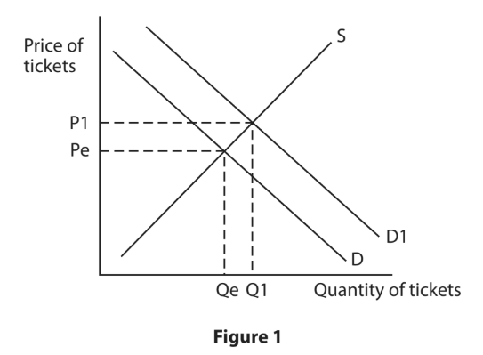

Which **one **of the following statements is true?
- **A.** When the price falls, the quantity demanded falls
- **B.** The demand curve slopes upwards from left to right
- **C.** An increase in demand is shown by a shift to the right
- **D.** A decrease in demand is shown by a shift to the right

### 1((e)) — 1 mark — command: define — structured — from paper Nov 2023 · Paper 1
Define the term excess supply.

## Q7 — easy — 2 marks · exam-questions

### 4((a)) — 2 marks — command: calculate — structured — from paper June 2022 · Paper 1
A restaurant in Cyprus can seat 136 diners each evening. The demand for seats from diners over three evenings is shown in Table 1.

**Table 1**

| Evening | Quantity of seats demanded |
|---|---|
| Thursday | 98 |
| Friday | 114 |
| Saturday | 107 |

Calculate the **excess supply** of seats if the quantity supplied during these three evenings totalled 408. You are advised to show your working.

## Q8 — easy — 4 marks · exam-questions

### 1((d)) — 1 mark — command: state — structured — from paper June 2022 · Paper 1R
State **one** reason why a demand curve will shift to the left.

### 1((g)) — 3 marks — command: draw — structured — from paper June 2022 · Paper 1R
Using the diagram below, draw the likely effects on the market for crops after  farmland is damaged by flooding. Label the new curve, the new equilibrium price and the new equilibrium quantity.

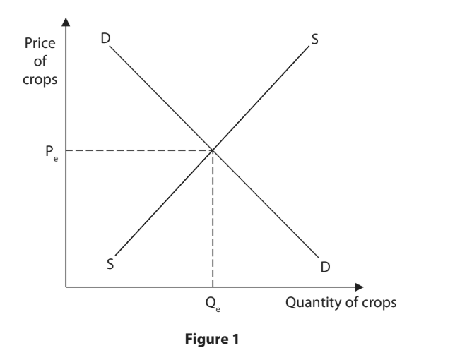

## Q9 — easy — 2 marks · exam-questions

### 4((a)) — 2 marks — command: calculate — structured — from paper June 2022 · Paper 1R
A concert venue in Malaysia holds a maximum of 3,200 people for each performance. The quantity of tickets demanded for the most recent concerts is shown in Figure 5.

| Concert | Quantity of tickets demanded |
|---|---|
| A | 4,200 |
| B | 6,000 |
| C | 3,250 |

**Figure 5**

Calculate the **excess demand** for tickets if the quantity supplied for all three concerts totals 9,600. You are advised to show your working.

## Q10 — easy — 7 marks · exam-questions

### 3((a)) — 1 mark — multiple_choice — from paper June 2021 · Paper 1
Which **one** of the following factors may cause a shift of the demand curve?
- **A.** Costs of production
- **B.** Demographic changes
- **C.** Subsidies
- **D.** Changes in price

### 3((d)) — 6 marks — command: analyse — structured — from paper June 2021 · Paper 1
In the capital of Laos, Vientiane, residents and tourists can now use the LOCA app to hire a taxi. Figure 4 shows the excess supply of LOCA drivers working in an area of the city when the price of a journey is 10,000 Kip.

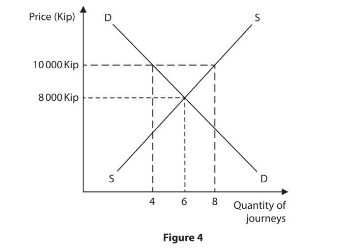

With reference to the data above and your knowledge of economics, analyse how market forces can remove excess supply.

## Q11 — easy — 2 marks · exam-questions

### 4((a)) — 2 marks — command: calculate — structured — from paper June  2021 · Paper 1
Figure 5 shows the population in Austria in the years 2000, 2008 and 2018.

| Year | Population |
|---|---|
| 2000 | 8,069,276 |
| 2008 | 8,341,532 |
| 2018 | 8,891,388 |

**Figure 5**

Calculate, to two decimal places, the **percentage change in the population** in Austria between 2000 and 2018. You are advised to show your working.

## Q12 — easy — 1 marks · exam-questions

### 2((a)) — 1 mark — multiple_choice — from paper Nov 2020 · Paper 1R
Which** one** of the following diagrams shows excess supply?
- **A.** 
- **B.** 
- **C.** 
- **D.** 

## Q13 — easy — 6 marks · exam-questions

### 1((b)) — 1 mark — multiple_choice — from paper Nov 2020 · Paper 1
Which** one** of the following options shows the effects on the market for motorcycle helmets after a fall in the price of motorcycles?
- **A.** 
- **B.** 
- **C.** 
- **D.** 

### 1((f)) — 2 marks — command: calculate — structured — from paper Nov 2020 · Paper 1
Private facilities in which swimmers can change clothes are available at the swimming pool in Ciney, Belgium. The quantity demanded for these facilities during each of the first three months of 2019 is shown in Figure 1.

| Month | Quantity of private facilities demanded |
|---|---|
| January | 3,600 |
| February | 3,200 |
| March | 3,100 |

**Figure 1**

Calculate the **excess demand** for private changing facilities for the first three months of 2019 if the quantity supplied during each month was 3,000 (9,000 in total). You are advised to show your working.

### 1((g)) — 3 marks — command: draw — structured — from paper Nov 2020 · Paper 1
Using the diagram below, draw the likely effects on the market for bread after a decrease in the population. Label the new curve, the new equilibrium price and the new equilibrium quantity.

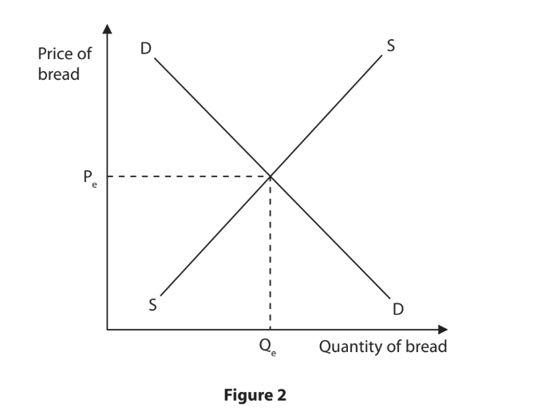

## Q14 — easy — 1 marks · exam-questions

### 3((a)) — 1 mark — multiple_choice — from paper Nov 2020 · Paper 1
Which **one** of the following is most likely to cause a shift to the left in the supply curve?
- **A.** Increased indirect taxes
- **B.** Cost reductions
- **C.** Increased subsidies
- **D.** Decreased advertising

## Q15 — easy — 12 marks · exam-questions

### 1((b)) — 1 mark — multiple_choice — from paper Nov 2020 · Paper 1R
Which **one **of the following diagrams shows the new equilibrium price and quantity for lemon ice cream in Thailand following a price reduction in chocolate ice cream?
- **A.** 
- **B.** 
- **C.** 
- **D.** 

### 1((f)) — 2 marks — command: calculate — structured — from paper Nov 2020 · Paper 1R
Tour guides are available to accompany tourists who visit the Terracotta Army collection of sculptures in Xi’An, China. The quantity of tour guides demanded for the first three months of 2019 is shown below.

| Month | Quantity of tour guides demanded |
|---|---|
| January | 1,200 |
| February | 1,450 |
| March | 1,625 |

**Figure 1**

Calculate the** excess supply** of tour guides if the quantity supplied during this three‐month period was 6,000 (2,000 per month). You are advised to show your working.

### 1((g)) — 3 marks — command: draw — structured — from paper Nov 2020 · Paper 1R
Using the diagram below, draw the likely effects of an increase in the birth rate on the market for toys. Label the new curve, the new equilibrium price and the new equilibrium quantity.

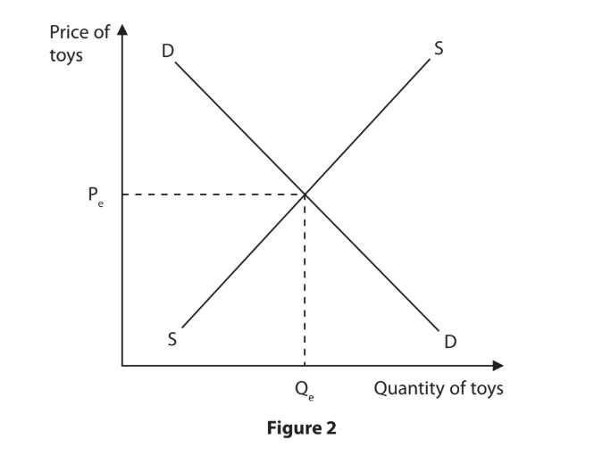

### 1((i)) — 6 marks — command: analyse — structured — from paper Nov 2020 · Paper 1R
A powerful typhoon destroyed property on the island of Lamma in Hong Kong. Owners of restaurants that were damaged think it may take two or three months for them to fully reopen. This was due to flood damage and replacing equipment that was washed away. The repair costs for one restaurant owner was an estimated HK\$300,000 to HK\$400,000.

(Source adapted from: https://www.scmp.com/news/hong-kong/society/article/2164928/long-road-recovery-hong-kongs-outlying-islands-after-typhoon)

With reference to the data above and your knowledge of economics, analyse how natural factors such as adverse weather may cause a shift in the supply curve.

## Q16 — easy — 2 marks · exam-questions

### 2((d)) — 2 marks — command: what — structured — from paper Nov 2020 · Paper 1R
What is meant by the term demand?

## Q17 — easy — 13 marks · exam-questions

### 2((e)) — 1 mark — command: state — structured — from paper June 2019 · Paper 1
State **one** factor that will cause a demand curve to shift to the left.

### 2((g)) — 3 marks — command: explain — structured — from paper June 2019 · Paper 1
**Beating the congestion in Dhaka**

Nearly 17 million people live in Dhaka, the capital of Bangladesh. The majority of people live in the city centre and traffic congestion is a problem. However,  there are many auto rickshaws (a small, three-wheeled vehicle, driven by a motorcycle engine) competing in the city centre to take passengers to their destinations. Fares tend to be cheaper in the city centre than they are outside the city centre and are usually agreed between passengers and drivers.

Dhaka has a large number of auto rickshaws competing for fares.

With reference to the information given in ‘**Beating the congestion in Dhaka**’, explain** one **reason why prices for journeys using an auto rickshaw might be higher outside the city centre.

### 2((h)) — 9 marks — command: assess — structured — from paper June 2019 · Paper 1
A lack of space in many busy cities means parking is an increasing problem. Japan has developed the first Automated Parking Systems (APS). These are car parks where the cars are automatically stacked. The driver takes the car to the entrance, then technology takes over, placing each car on racks, one above the other. This allows many cars to be parked in a very small area. Not only do they offer a more practical use of space than traditional multi-storey car parks, but they cost less to build. The drivers benefit from cheaper parking fees and they save time.

(Source: adapted from [http://japantravelmate](http://japantravelmate).com/cool-japan/things-see-japans-automated-rotary-parking-systems)

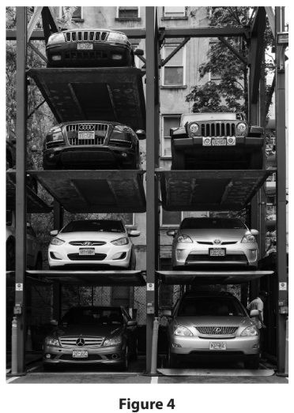

With reference to the data above and your knowledge of economics, assess the extent to which changes in technology may reduce the shortage of car parking spaces in city centres.

## Q18 — easy — 2 marks · exam-questions

### 4((a)) — 2 marks — command: calculate — structured — from paper June 2019 · Paper 1
Figure 6 shows the quantity of a good supplied and demanded at different price levels.

Using the information in Figure 6, calculate the excess supply of goods in the market at a price of \$50. You are advised to show your working.

## Q19 — easy — 4 marks · exam-questions

### 1((e)) — 1 mark — command: define — structured — from paper June 2019 · Paper 1R
Define the term substitute good.

### 1((g)) — 3 marks — command: draw — structured — from paper June 2019 · Paper 1R
Using the diagram below, draw the effects on the market for locally sourced goods of more customers preferring to buy from local firms. Label the new  curve, new equilibrium price and new equilibrium quantity.

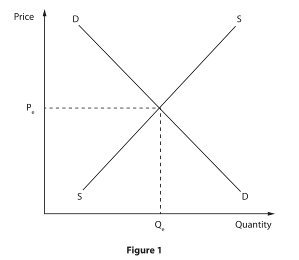

## Q20 — easy — 2 marks · exam-questions

### 4((a)) — 2 marks — command: calculate — structured — from paper June 2019 · Paper 1R
Figure 4 shows the quantity of a good supplied and demanded at different price levels.

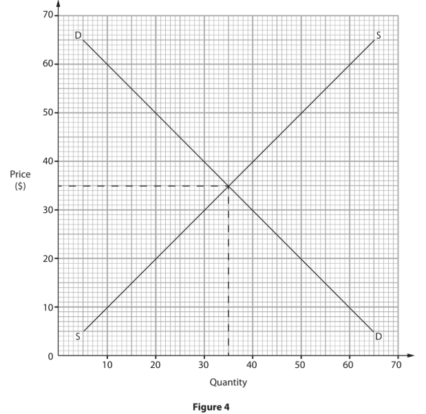

Using the information in Figure 4, calculate the excess demand of goods in the market at a price of \$20. You are advised to show your working.

## Q21 — easy — 1 marks · exam-questions

### 1() — 1 mark — command: define — structured
Define the term demand.

## Q22 — easy — 1 marks · exam-questions

### 1() — 1 mark — command: state — structured
State **one** factor that will cause a supply curve to shift to the right.

## Q23 — easy — 1 marks · exam-questions

### 1() — 1 mark — command: define — structured
Define the term excess demand.

## Q24 — easy — 2 marks · exam-questions

### 1() — 2 marks — command: describe — structured
Describe what happens to the quantity of a good supplied when its price falls, if all other factors remain unchanged.

## Q25 — easy — 2 marks · exam-questions

### 1() — 2 marks — command: calculate — structured
A bakery sells a limited-edition celebration cake. The weekly quantity demanded over three weeks was 120, 150 and 180 cakes. The bakery could only supply 90 cakes per week throughout this period. Calculate the total excess demand for the cake over the three weeks.

## Q26 — easy — 1 marks · exam-questions

### 1() — 1 mark — multiple_choice
Which **one** of the following is most likely to cause a shift to the right of the demand curve for a normal good?
- **A.** A fall in consumers' income
- **B.** A decrease in the cost of production
- **C.** A rise in the price of a close substitute good
- **D.** A fall in the price of the good itself

## Q27 — easy — 1 marks · exam-questions

### 1() — 1 mark — multiple_choice
Which **one **of the following is most likely to cause a shift to the left of the supply curve?
- **A.** A fall in the cost of raw materials
- **B.** A rise in consumers' income
- **C.** A new subsidy paid to producers
- **D.** A new environmental regulation that raises production costs

## Q28 — medium — 3 marks · exam-questions

### 1((g)) — 3 marks — command: draw — structured — from paper June 2024 · Paper 1
Figure 1 shows the market for solar panels.

Using the diagram below, draw the likely effects on the market for solar panels if the government removes an indirect tax on them. Label the new curve, the new equilibrium price and the new equilibrium quantity.

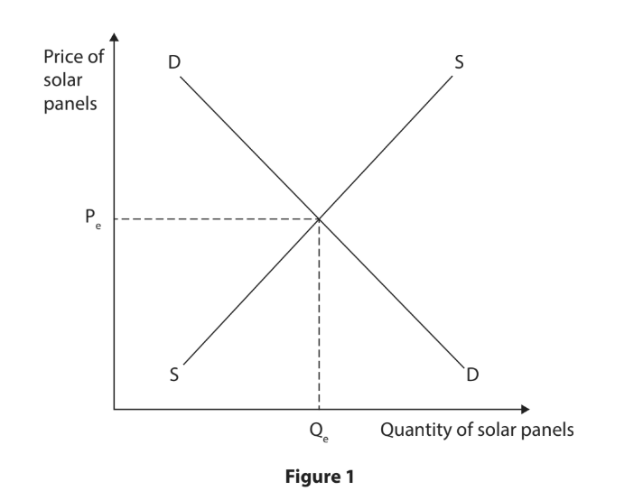

## Q29 — medium — 3 marks · exam-questions

### 1((g)) — 3 marks — command: draw — structured — from paper June 2024 · Paper 1R
Figure 1 shows the market for tennis balls.

Using the diagram below, draw the likely effects on the market for tennis balls after a fall in the price of tennis rackets. Label the new curve, the new equilibrium price and the new equilibrium quantity.

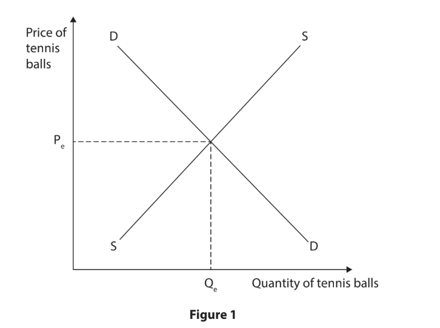

## Q30 — medium — 3 marks · exam-questions

### 1((g)) — 3 marks — command: draw — structured — from paper Nov 2024 · Paper 1
Figure 1 shows the market for rice.

Using the diagram below, draw the likely effect of an increase in the population on the market for rice. Label the new curve, the new equilibrium price and the new equilibrium quantity.

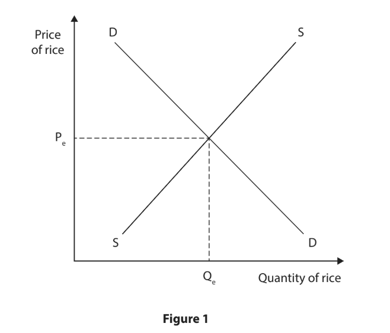

## Q31 — medium — 3 marks · exam-questions

### 1((g)) — 3 marks — command: draw — structured — from paper Jan 2023 · Paper 1
Figure 1 shows the market for trainers.

Using the diagram below, draw the likely effects on the market after a popular celebrity was seen wearing trainers. Label the new curve, the new equilibrium price and the new equilibrium quantity.

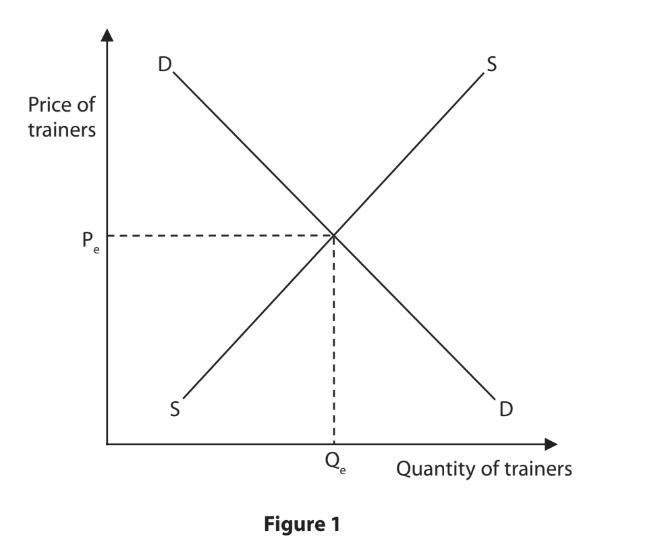

## Q32 — medium — 6 marks · exam-questions

### 4((b)) — 6 marks — command: analyse — structured — from paper Jan 2023 · Paper 1
A tagine is a type of cooking pot which is used to make meals throughout Morocco. Almost every home in Morocco has one. They have also become an increasingly popular purchase for tourists who want to take home a souvenir of their travels. Producers can sell tagines in markets all over Morocco. However, as demand has increased, many have chosen to sell in the areas visited by tourists, such as Marrakesh.

With reference to the data above and your knowledge of economics, analyse how the equilibrium price of tagines sold to tourists is determined.

## Q33 — medium — 3 marks · exam-questions

### 1((g)) — 3 marks — command: draw — structured — from paper Jan 2023 · Paper 1R
Using the diagram below, draw the likely effect on the market for luxury holidays after a fall in income. Label the new curve, the new equilibrium price and the new equilibrium quantity.

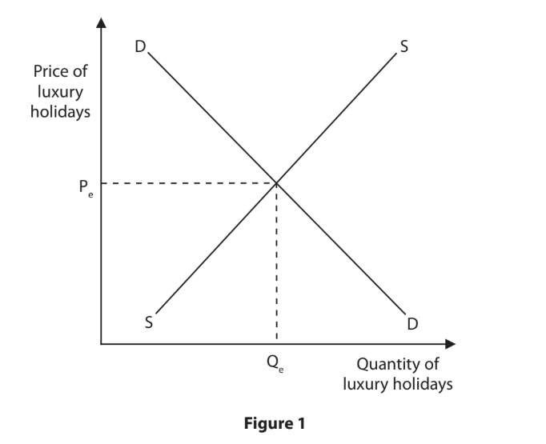

## Q34 — medium — 3 marks · exam-questions

### 1((g)) — 3 marks — command: draw — structured — from paper June 2022 · Paper 1
Using the diagram below, draw the likely effects on the market for apples following a decrease in the price of bananas. Label the new curve, the new equilibrium price and the new equilibrium quantity.

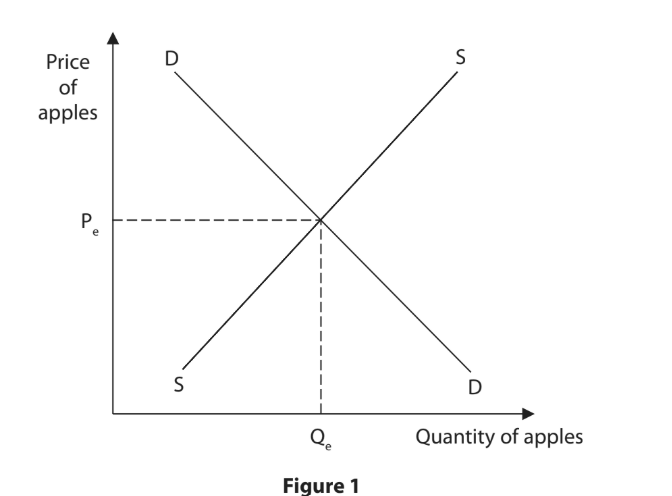

## Q35 — medium — 3 marks · exam-questions

### 2((g)) — 3 marks — command: explain — structured — from paper June 2022 · Paper 1
Figure 2 shows the supply of wheat in a region during 2019.

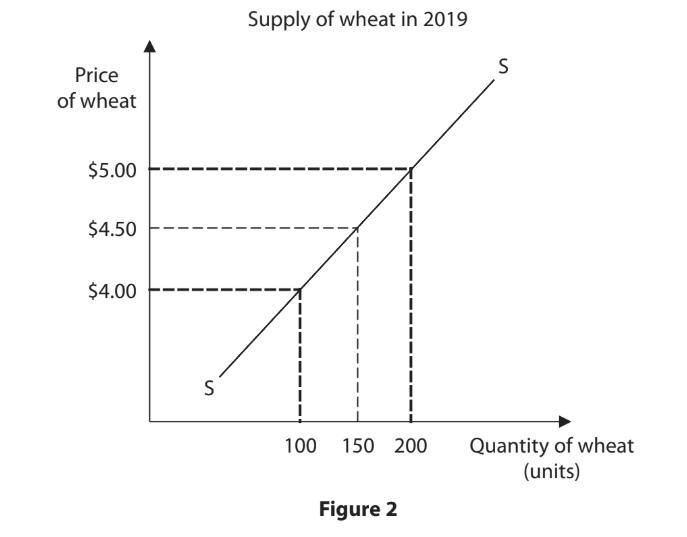

Explain **one **effect on the supply curve of wheat following a change in the price of wheat.

## Q36 — medium — 3 marks · exam-questions

### 2((g)) — 3 marks — command: explain — structured — from paper June 2022 · Paper 1R
Figure 3 shows the demand for cocoa beans during 2019.

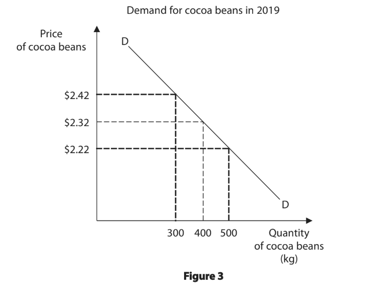

Explain **one** effect on the demand curve for cocoa beans following a change in the price.

## Q37 — medium — 3 marks · exam-questions

### 1((g)) — 3 marks — command: draw — structured — from paper June 2021 · Paper 1
Using the diagram below, draw the likely effects on the market for cars of the introduction of more effective technology in production. Label the new curve, the new equilibrium price and the new equilibrium quantity.

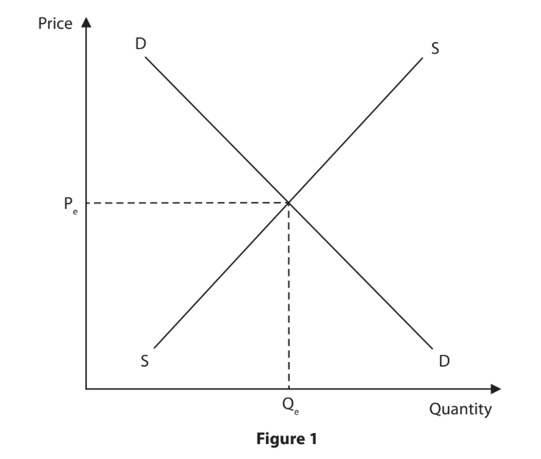

## Q38 — medium — 3 marks · exam-questions

### 1((g)) — 3 marks — command: draw — structured — from paper Nov 2021 · Paper 1
Using the diagram below, draw the likely effects on the market for smartphones following a rise in the cost of raw materials. Label the new curve, the new equilibrium price and the new equilibrium quantity.

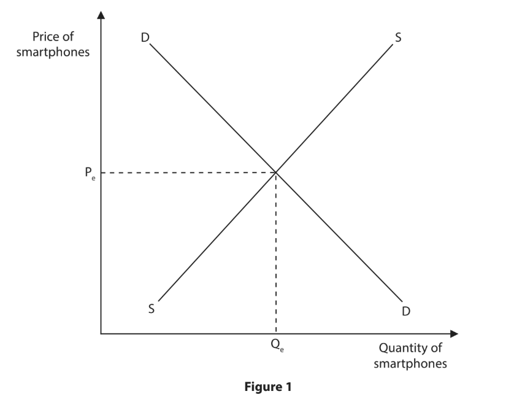

The New Zealand Government is to introduce new legislation to limit the interest rate firms can charge on loans made to customers. The maximum interest rate firms can charge will be 0.8% per day.

Explain** one** reason why the New Zealand Government may be introducing this legislation.

## Q39 — medium — 6 marks · exam-questions

### 3((d)) — 6 marks — command: analyse — structured — from paper Nov 2021 · Paper 1
During the 2019 Cricket World Cup, supporters of teams such as India, Bangladesh, England, Pakistan and Sri Lanka watched matches at stadiums and on television around the world. Pepsi was one of the main advertisers during the event.

With reference to the data above and your knowledge of economics, analyse how the demand curve for Pepsi might have been affected during the 2019 Cricket World Cup.

## Q40 — medium — 3 marks · exam-questions

### 1((g)) — 3 marks — command: draw — structured — from paper Jan 2020 · Paper 1
Using the diagram below, draw the likely effects of an increase in income on the equilibrium price and quantity for wireless headphones. Label the new curve, the new equilibrium price and quantity.

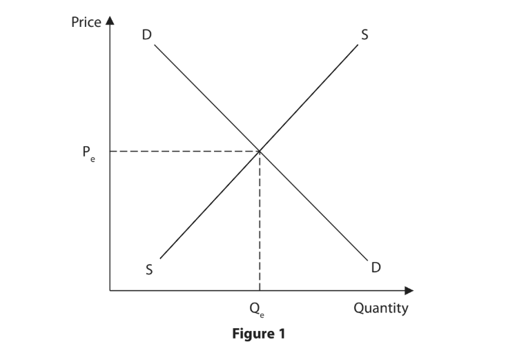

## Q41 — medium — 3 marks · exam-questions

### 1((g)) — 3 marks — command: draw — structured — from paper Jan 2020 · Paper 1R
Using the diagram below, draw the effects on the equilibrium price and quantity after the government removes an indirect tax on sustainable fuel. Label the new curve, the new equilibrium price and quantity.

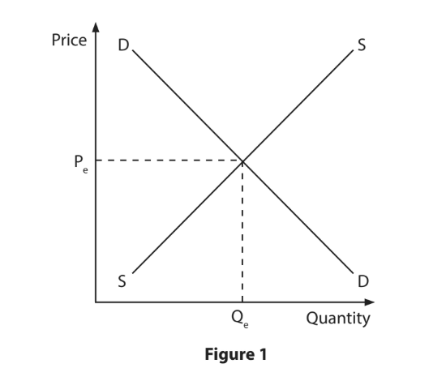

## Q42 — medium — 3 marks · exam-questions

### 1((g)) — 3 marks — command: draw — structured — from paper June 2019 · Paper 1
Using the diagram below, draw the effects on the market for crops after a hurricane destroys farm land. Label the new curve, new equilibrium price and new equilibrium quantity.

## Q43 — medium — 3 marks · exam-questions

### 1() — 3 marks — command: explain — structured
A severe drought damages a large share of Colombia's coffee bean harvest. Explain **one** effect of this drought on the market for coffee beans.

## Q44 — medium — 3 marks · exam-questions

### 1() — 3 marks — command: explain — structured
Unusually good weather leads to a bumper wheat harvest in Ukraine. Explain **one** effect of this bumper harvest on the price of wheat.

## Q45 — medium — 3 marks · exam-questions

### 1() — 3 marks — command: draw — structured
Using the diagram below, draw the likely effect on the market for an older smartphone model in Germany following the launch of a significantly more popular rival smartphone brand. Label the new curve, the new equilibrium price and the new equilibrium quantity.

## Q46 — medium — 3 marks · exam-questions

### 1() — 3 marks — command: draw — structured
Using the diagram below, draw the likely effect on the market for a particular style of trainers in South Korea following a new fashion trend for this style. Label the new curve, the new equilibrium price and the new equilibrium quantity.

## Q47 — medium — 3 marks · exam-questions

### 1() — 3 marks — command: draw — structured
Using the diagram below, draw the likely effect on the market for a specific engine component after a workers' strike at the Mexican factory that produces it. Label the new curve, the new equilibrium price and the new equilibrium quantity.

## Q48 — hard — 9 marks · exam-questions

### 1() — 9 marks — command: assess — structured
A disease outbreak forces Brazil to cull around 8 million chickens across its poultry farms. Brazil exports around 30% of the world's chicken meat, and many households and businesses, both in Brazil and internationally, rely on chicken as an affordable source of protein.

With reference to the information above and your knowledge of economics, assess the impact of this event on stakeholders in the market for chicken meat.

## Q49 — hard — 9 marks · exam-questions

### 1() — 9 marks — command: assess — structured
A major international sporting event is being hosted in Lisbon, Portugal, expected to attract 1.5 million visitors over two weeks. Many local residents rent out spare rooms or apartments to visitors during the event, while other residents who do not own extra accommodation are looking to rent long-term housing in the same neighbourhoods.

With reference to the information above and your knowledge of economics, assess the impact of this event on stakeholders in Lisbon's accommodation market.

## Q50 — hard — 12 marks · exam-questions

### 1() — 12 marks — command: evaluate — structured
A poor harvest has cut the Philippines' rice production by around 30%, creating a severe shortage with demand for rice significantly exceeding supply at the current price. Domestic rice producers are already operating at full capacity, and it will take at least one growing season before domestic supply can increase. Rice is a staple food that makes up around 40% of daily calorie intake for most Filipino households, including low-income households.

With reference to the information above and your knowledge of economics, evaluate whether relying on market forces, rather than government intervention, is the best way to resolve this shortage.
