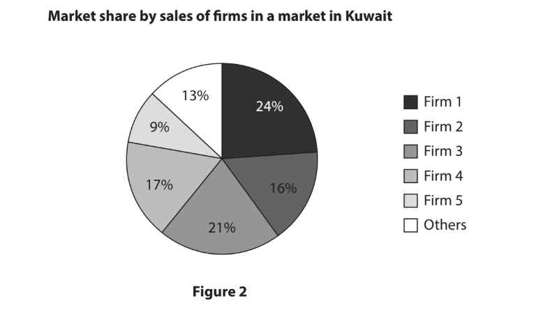
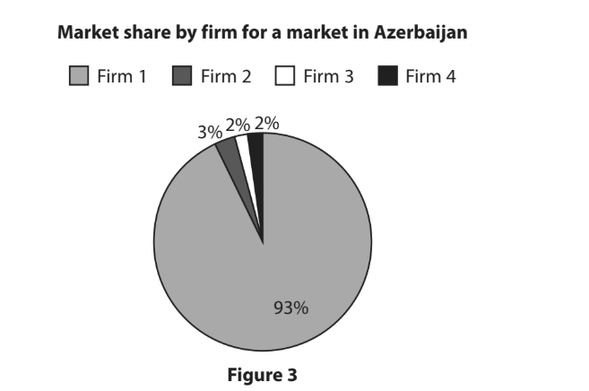

# Exam Questions — Economic Assumptions
**The Market System** · Edexcel IGCSE Economics (4EC1)
> Source: [https://www.savemyexams.com/igcse/economics/edexcel/17/topic-questions/the-market-system/economic-assumptions/exam-questions/](https://www.savemyexams.com/igcse/economics/edexcel/17/topic-questions/the-market-system/economic-assumptions/exam-questions/) · 27 questions · total 95 marks

## Q1 — easy — 1 marks · exam-questions

### 2((b)) — 1 mark — multiple_choice — from paper Nov 2024 · Paper 1

Which** one** of the following is a reason why consumers may not maximise their benefit?
- **A.** Consumers may not accurately calculate benefits
- **B.** Consumers may find it easy to give up habits
- **C.** Consumers never copy the behaviour of others
- **D.** Rational decisions are always made by consumers

## Q2 — easy — 2 marks · exam-questions

### 2((f)) — 2 marks — command: describe — structured — from paper June 2022 · Paper 1
Describe **one **reason why consumers do not always maximise their benefit from the consumption of a product.

## Q3 — easy — 1 marks · exam-questions

### 1((b)) — 1 mark — multiple_choice — from paper June 2021 · Paper 1
Andreas is a plumber. Unlike his competitors, he is prepared to work at the weekend. However, he charges customers 50% more for his services at the weekend.

Which **one** of the following describes this economic assumption?
- **A.** Businesses aim to maximise their profit
- **B.** Producers may complete charitable work
- **C.** Consumers sometimes copy others’ behaviour
- **D.** Governments try to increase the number of days worked

## Q4 — easy — 1 marks · exam-questions

### 1((a)) — 1 mark — multiple_choice — from paper Nov 2021 · Paper 1
Which **one **of the following is a reason why firms may not always maximise their profit?
- **A.** They may minimise total costs
- **B.** They may be able to sell at a high price
- **C.** They may have low fixed costs
- **D.** They may complete charitable work

## Q5 — easy — 1 marks · exam-questions

### 2((e)) — 1 mark — command: define — structured — from paper Jan 2020 · Paper 1R
Define the term consumer.

## Q6 — easy — 1 marks · exam-questions

### 2((b)) — 1 mark — multiple_choice — from paper Nov 2020 · Paper 1

Which **one **of the following is a reason why consumers may not maximise their benefit?
- **A.** Consumers may accurately calculate the satisfaction they gain
- **B.** Consumers may have habits that are hard to give up
- **C.** Consumers are always rational when making decisions
- **D.** Consumers never copy the behaviour of others

## Q7 — easy — 1 marks · exam-questions

### 1() — 1 mark — multiple_choice
Which **one** of the following best describes how a worker is assumed to act rationally?
- **A.** By maximising their utility
- **B.** By maximising their profits
- **C.** By balancing pay and benefits with their welfare at work
- **D.** By maximising the welfare of the people they serve

## Q8 — easy — 1 marks · exam-questions

### 1() — 1 mark — command: define — structured
Define the term rational decision making.

## Q9 — easy — 1 marks · exam-questions

### 1() — 1 mark — command: state — structured
State **one** economic agent that is assumed to act rationally.

## Q10 — easy — 2 marks · exam-questions

### 1() — 2 marks — command: what — structured
What is meant by the term revenue maximisation?

## Q11 — easy — 2 marks · exam-questions

### 1() — 2 marks — command: describe — structured
Describe **one** reason why social norms might cause a consumer not to maximise their utility.

## Q12 — easy — 2 marks · exam-questions

### 1() — 2 marks — command: describe — structured
Describe **one** reason why a producer might not aim to maximise profit.

## Q13 — easy — 1 marks · exam-questions

### 1() — 1 mark — multiple_choice
A consumer buys the same brand of coffee every week, even though a cheaper alternative of similar quality is available in the same shop. Which **one** of the following best explains this behaviour?
- **A.** The consumer has calculated that the more expensive brand offers greater net benefit
- **B.** The consumer relies on habit to speed up their decision-making, rather than comparing prices each time
- **C.** The consumer is maximising their utility by choosing the cheaper alternative
- **D.** The producer has reduced the price of the more expensive brand

## Q14 — medium — 3 marks · exam-questions

### 2((f)) — 3 marks — command: explain — structured — from paper June 2024 · Paper 1
Hanan is the owner of a shop and wants to maximise profits. However, Mostafa is the manager of the shop and wants to offer customers a 10% discount for making purchases in large quantities.

Explain **one** reason why Mostafa may want to offer this discount rather than to maximise profit.

## Q15 — medium — 6 marks · exam-questions

### 1((i)) — 6 marks — command: analyse — structured — from paper June 2024 · Paper 1R
Jags owns a café in a small town in Malaysia. During a recent school holiday, she offered a free lunch to each child visiting the café with a paying adult. This was welcomed by customers who have had problems in the last few months due to the rising cost of living.

With reference to the data above and your knowledge of economics, analyse a possible reason why Jags chose not to maximise profit.

## Q16 — medium — 3 marks · exam-questions

### 1((h)) — 3 marks — command: explain — structured — from paper Jan 2023 · Paper  1
Spice Cottage is a new food producing business. Its prices are lower than market research suggests consumers would be willing to pay.

Explain **one** reason why Spice Cottage may not aim to maximise its profit.

## Q17 — medium — 6 marks · exam-questions

### 4((b)) — 6 marks — command: analyse — structured — from paper Jan  2023 · Paper 1R
For a number of years there has been an increase in obesity in Poland. Consumers of sugary drinks, such as Coca Cola and Fanta, now have to pay an additional 0.50 zloty (\$0.11) per litre, following the introduction of a sugar tax. At the same time, there has been an increase in adverts for soft drinks. However, consumers are still buying these drinks even though they are now more expensive.

(Source adapted from: https://retailmarketexperts.com/en/news/2021-retail-tax-and-sugar-tax-come-into-force/)

With reference to the data above and your knowledge of economics, analyse the reasons why consumers may not maximise their benefit when consuming sugary drinks.

## Q18 — medium — 6 marks · exam-questions

### 1((i)) — 6 marks — command: analyse — structured — from paper Jan 2020 · Paper 1
McAfee is a US-based global computer software security company. In 2017, its revenue was over \$2.5bn. The company operates a ‘fundraising match  programme’. This means when one of its 7,600 employees participates in a fundraising activity, such as a walk, run or cycle event, the company will contribute an equal amount. For every \$1 raised for charity by an employee, the company will also contribute \$1 to the charity, up to a maximum of \$1 000 per person.

(Source adapted from: https://doublethedonation.com/tips/companies-that-donate-to-nonprofits/#match)

With reference to the data above and your knowledge of economics, analyse the possible reasons why McAfee chooses not to profit maximise but instead operates the fundraising match programme.

## Q19 — medium — 3 marks · exam-questions

### 2((g)) — 3 marks — command: explain — structured — from paper Jan 2020 · Paper 1R
There are many health warnings about the dangers of eating too much sugar but some consumers continue to do so.

Explain **one** reason why consumers may still make this decision.

## Q20 — medium — 3 marks · exam-questions

### 1() — 3 marks — command: explain — structured
Amara has been offered a new job with a higher salary than her current role, but the new role offers no paid holiday and requires much longer hours. Explain **one** reason why Amara might act rationally by not accepting the higher-paid job.

## Q21 — medium — 3 marks · exam-questions

### 1() — 3 marks — command: explain — structured
The government of Portugal is deciding whether to spend a budget surplus on tax cuts or on building new hospitals. Explain **one** reason why choosing to build new hospitals might be considered a rational decision by the government.

## Q22 — medium — 3 marks · exam-questions

### 1() — 3 marks — command: explain — structured
A supermarket sells 40 different brands of pasta sauce at a wide range of prices. Explain **one** reason why a shopper choosing between them might not maximise their utility.

## Q23 — medium — 6 marks · exam-questions

### 1() — 6 marks — command: analyse — structured
Elena has bought the same brand of laundry detergent every week for the past five years, without checking whether a cheaper or better-value alternative is available in the supermarket.

With reference to the information above and your knowledge of economics, analyse why Elena's decision-making might not maximise her utility.

## Q24 — medium — 6 marks · exam-questions

### 1() — 6 marks — command: analyse — structured
A clothing company has chosen to donate 5% of its profits to a charity that plants trees, and advertises this donation on the label of every item it sells. Its profits are lower than they would be if it kept all of this money instead.

With reference to the information above and your knowledge of economics, analyse why the company might choose to pursue this charitable objective rather than maximise profit.

## Q25 — hard — 9 marks · exam-questions

### 1() — 9 marks — command: assess — structured
A technology start-up based in Singapore has chosen to spend almost all of its revenue on rapid expansion into new countries, rather than taking a profit. The company has borrowed heavily to fund this growth and is not expected to make a profit for at least five years, but it has already grown from 2 million to 40 million users in two years.

With reference to the information above and your knowledge of economics, assess the benefits to the company of pursuing this growth objective rather than maximising profit.

## Q26 — hard — 12 marks · exam-questions

### 1() — 12 marks — command: evaluate — structured
Many consumers make everyday purchasing decisions, such as buying their usual brand of coffee or snacks, out of habit rather than comparing all of the alternatives available each time. One consumer survey found that habitual buyers pay on average 15% more per year on their regular grocery items than shoppers who actively compare prices. Some economists argue that this habitual behaviour prevents consumers from maximising their utility, while others argue that it is a sensible way for consumers to manage their limited time.

With reference to the information above and your knowledge of economics, evaluate whether relying on habits when making everyday purchasing decisions is harmful to consumers.

## Q27 — hard — 9 marks · exam-questions

### 1() — 9 marks — command: assess — structured
A bakery chain has decided to continue sourcing free-range eggs from a supplier that charges 40% more than a standard egg supplier, even though blind taste tests show customers cannot reliably tell the difference. The owner says she wants to be able to look her customers in the eye and describes it as 'the right thing to do', despite market research showing that switching to the cheaper supplier and quietly lowering quality would likely increase profit by around 15% a year.

With reference to the information above and your knowledge of economics, assess the extent to which the bakery's decision-making could be considered rational.
