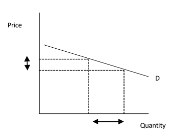
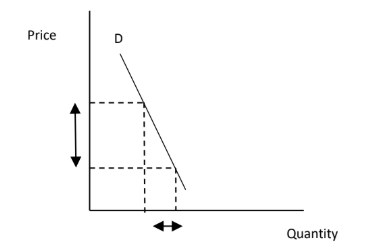
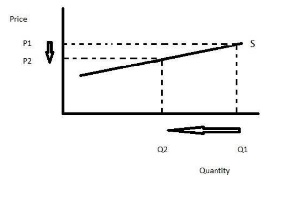
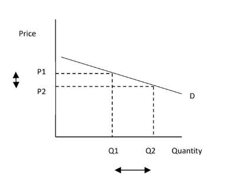
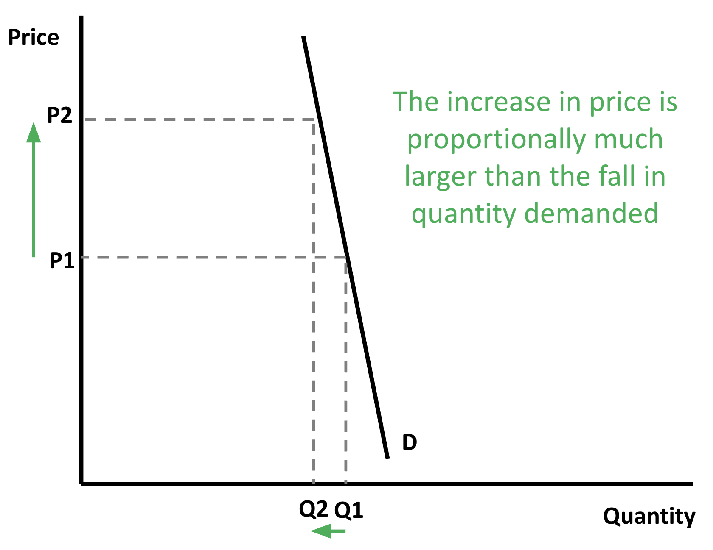

# Mark Schemes — Elasticity
**The Market System** · Edexcel IGCSE Economics (4EC1)

## Q1 — easy — 3 marks · exam-questions

### 1((a)) — 1 marks
**Correct answer: D** — Infinity

**Final answer:** **The correct answer is D**

Perfectly price elastic demand means that even the smallest rise in price causes quantity demanded to fall to zero, so the response is infinitely large compared with the change in price and PED is infinity

**A** is incorrect as a PED of -1 is unitary elasticity, where quantity demanded changes in exactly the same proportion as price

**B** is incorrect as a PED of -0.5 is price inelastic demand, where quantity demanded changes by proportionally less than price

**C** is incorrect as a PED of zero is perfectly price inelastic demand, where quantity demanded does not change at all when the price changes

### 1((f)) — 2 marks
11% ÷ 7% **[1 mark]**

**= 1.57** **[1 mark]**

> **[mark-scheme]**
> Award 1 mark for showing correct calculation
> 
> Award 1 mark for the correct income elasticity of demand (YED)
> 
> Award 2 marks if YED is correctly calculated as 1.57, even if no calculations are shown
> 
> Do not award marks for the formula

> **[exam-tip]**
> - Elasticity values carry no units and no percentage sign. Examiner reports record candidates calculating the value correctly and then losing the mark by writing % after it
> - The question asks for two decimal places, so give 1.57 rather than 1.6
> - A positive YED greater than 1 means the good is normal and income elastic, which makes it a luxury

## Q2 — easy — 2 marks · exam-questions

### 2((c)) — 2 marks
–10% × –1.9 **[1 mark]**

**= 19%** **[1 mark]**

> **[mark-scheme]**
> Award 1 mark for showing the correct calculation
> 
> Award 1 mark for the correct change in quantity demanded
> 
> Award 2 marks if the change in quantity demanded is correctly calculated as 19%, even if no calculations are shown
> 
> Award 1 mark if the change in quantity demanded is calculated as 19 without the percentage sign, even if no calculations are shown
> 
> Do not award marks for a formula

> **[exam-tip]**
> - Two negatives multiply to give a positive, and that is economically correct here: the price fell, so quantity demanded rose by 19%
> - Here the answer IS a percentage, so write 19%. That is the opposite of a question asking for the elasticity value itself, where no units or percentage sign should be given
> - Rearrange the PED formula rather than guessing: PED multiplied by the percentage change in price gives the percentage change in quantity demanded

## Q3 — easy — 3 marks · exam-questions

### 1((a)) — 1 marks
**Correct answer: A** — 0

**Final answer:** **The correct answer is A**

Perfectly price inelastic supply means the quantity supplied does not change at all when the price changes, so the percentage change in quantity supplied is zero and PES is 0

**B** is incorrect as a PES of 0.5 is price inelastic supply, where quantity supplied does change but by proportionally less than price

**C** is incorrect as a PES of 1 is unitary price elasticity of supply, where quantity supplied changes in exactly the same proportion as price

**D** is incorrect as a PES of 2 is price elastic supply, where quantity supplied changes by proportionally more than price

### 1((f)) — 2 marks
1.7% ÷ 6.2% **[1 mark]**

**= 0.27** **[1 mark]**

> **[mark-scheme]**
> Award 1 mark for showing correct calculation
> 
> Award 1 mark for the correct income elasticity of demand (YED)
> 
> Award 2 marks if YED is correctly calculated as 0.27, even if no calculations are shown
> 
> Do not award marks for the formula

> **[exam-tip]**
> - Elasticity values carry no units and no percentage sign. Examiner reports record candidates calculating the value correctly and then losing the mark by writing % after it
> - The question asks for two decimal places, so give 0.27 rather than rounding to 0.3
> - A positive YED below 1 means the good is normal but income inelastic: demand rises with income, but by proportionally less

## Q4 — easy — 2 marks · exam-questions

### 2((c)) — 2 marks
1.5 × 12% **[1 mark]**

**= 18%** **[1 mark]**

> **[mark-scheme]**
> Award 1 mark for showing correct calculation, either as 1.5 multiplied by 12%, or by rearranging the PES formula so that the unknown percentage change in quantity supplied divided by 12% equals 1.5
> 
> Award 1 mark for the correct change in quantity supplied
> 
> Award 2 marks if the percentage change in quantity supplied is correctly calculated as 18%, even if no calculations are shown
> 
> Award 1 mark if the percentage change in quantity supplied is calculated as 18 without the percentage sign, even if no calculations are shown
> 
> Do not award marks for a formula

> **[exam-tip]**
> - Here the answer IS a percentage, so write 18%. This is the opposite of a question asking for the elasticity value itself, where no units or percentage sign should be given
> - Rearrange the PES formula rather than guessing: PES multiplied by the percentage change in price gives the percentage change in quantity supplied

## Q5 — easy — 5 marks · exam-questions

### 1((f)) — 2 marks
PES = percentage change in quantity supplied ÷ percentage change in price

−3.7% ÷ −9.4% **[1 mark]**

**= 0.39** **[1 mark]**

> **[mark-scheme]**
> Award 1 mark for showing the correct calculation
> 
> Award 1 mark for the correct PES value
> 
> Award 2 marks if PES is correctly calculated as 0.39, even if no calculations are shown
> 
> Award 1 mark if PES is given as 0.39%, even if no calculations are shown
> 
> Do not award marks for the formula alone

> **[exam-tip]**
> - PES is **positive** because price and quantity supplied move in the same direction. Here both fall, so the two minus signs cancel and the answer is 0.39, not −0.39
> - PES carries no percentage sign. Writing 0.39% loses a mark, because elasticity is a ratio rather than a percentage
> - A value between 0 and 1 means supply is price inelastic, so producers cannot adjust output much when the price changes

### 1((h)) — 3 marks
One reason is that consumers need time to find and switch to substitutes** [1]**, because habits are hard to break immediately and a shopper who always buys the same soft drink will keep buying it at first even after the price rises** [1]**, but over six months they find alternative drinks they like just as much, so demand responds far more to the price and PED moves from −1.5 to −2.0** [1]**

**[3 marks]**

> **[mark-scheme]**
> Award 1 mark for identifying a relevant reason
> 
> Award 1 mark for developing the reason
> 
> Award 1 mark for the response being in context
> 
> **Alternative content**
> 
> The answer above is just one example of a response to this question. Other reasons could include:
> 
> - More firms enter the market over time, so more substitutes become available and consumers have more to switch to
> - Consumers need time to become aware of the price rise and of the alternatives on sale
> - Buyers who are locked into a habit or a subscription can only change once that commitment ends
> 
> Accept any other appropriate response

> **[exam-tip]**
> - The whole question turns on **time**, so make the contrast explicit: what the consumer cannot do straight away but can do six months later
> - The context mark comes from the data, so use the movement from −1.5 to −2.0, or refer to the soft drink itself
> - More elastic means a **larger** number ignoring the sign, so −2.0 is more elastic than −1.5

## Q6 — easy — 1 marks · exam-questions

### 3((b)) — 1 marks
**Correct answer: A** — Inferior

**Final answer:** **The correct answer is A**

A negative income elasticity of demand means quantity demanded moves in the opposite direction to income, so demand falls as incomes rise. That inverse relationship is what defines an inferior good

**B** is incorrect as a unitary value would be exactly 1 or -1, where demand changes in the same proportion as income

**C** is incorrect as a luxury good has a high positive YED, because demand rises proportionally faster than income

**D** is incorrect as a normal good has a positive YED, since demand rises as incomes rise

## Q7 — easy — 8 marks · exam-questions

### 1((f)) — 2 marks
3.2% ÷ –2.5% **[1 mark]**

**= –1.28** **[1 mark]**

> **[mark-scheme]**
> Award 1 mark for showing correct calculation
> 
> Award 1 mark for the correct price elasticity of demand (PED)
> 
> Award 2 marks if PED is correctly calculated as –1.28, even if no calculations are shown
> 
> Do not award marks for a formula

> **[exam-tip]**
> - Always show the minus sign. Examiner reports are explicit that a negative figure must carry it in the calculation as well as in the final answer, and candidates lose marks for dropping it
> - Elasticity values carry no units and no percentage sign, so write –1.28 and nothing else
> - The question asks for two decimal places, so give –1.28 rather than –1.3

### 1((i)) — 6 marks
Income elasticity of demand (YED) measures how responsive demand for a good is to a change in consumers' incomes.** [K]** Megabus's research shows that a 10% rise in incomes would cut the quantity of bus travel demanded by 15%, giving a YED of –15% divided by 10%, which is –1.5.** [Ap]** The negative sign tells Megabus that cheap bus travel is an inferior good, so demand moves in the opposite direction to income, and because the value is greater than 1 in size demand is income elastic, meaning the fall in demand is proportionally larger than the rise in income.** [An]** Knowing this lets the firm plan ahead: if incomes are rising in Canada, the US or the UK it can cut services and staffing in those markets before demand falls, avoiding wage and running costs it no longer needs.** [An]** Equally, when incomes fall it can expand services, because demand for cheap bus travel will rise.** [An]**

**[6 marks]**

> **[mark-scheme]**
> This is a 'levelled response' question
> 
> - **[Ap]** = application to the data given  (3 marks)
> - **[An]** = analysis / chain of reasoning (3 marks)
> 
> Although there are no separate **[K] marks**, both application and analysis must be built on **clear and accurate economic knowledge and understanding**
> 
> Therefore, each KAA paragraph should follow:
> 
> - Valid knowledge point → Application → Analysis
> - Each valid point made in the answer does not equal a mark, the response is judged holistically against the level descriptors
> 
> **Mark allocation**
> 
> Answers are placed into one of three levels.  **A level 3 answer (5-6 marks)**, will specifically:
> 
> - Demonstrate clear knowledge and understanding by developing relevant points and include appropriate application of economic terms, concepts, theories and calculations
> - Information presented will demonstrate excellent selectivity and organisation. Interpretation of economic information will be excellent, with a thorough analysis of issues
> 
> **Alternative content**
> 
> The answer above is just one example of how to respond to this question. Additional information which could be used in the answer includes:
> 
> - These figures allow Megabus to calculate income elasticity of demand
> - Bus travel has an income elasticity of –15% divided by 10%, which is –1.5
> - The value is negative and the good is therefore inferior
> - An inferior good is one where quantity demanded falls as incomes rise and rises as incomes fall, an inverse relationship
> - Bus travel is income elastic because the percentage fall in quantity demanded is greater than the percentage rise in income
> - If passengers' incomes increase the demand for bus travel will fall, but if incomes fall the demand for bus travel will rise
> - Awareness of this may allow Megabus to reduce or increase the services it offers in Canada, the US or the UK, depending on where incomes change
> - This could help to reduce costs if there is less demand for bus services
> - This can also help Megabus to plan employee requirements so it does not incur higher wage costs than necessary
> - Any other relevant and valid analysis is acceptable

> **[exam-tip]**
> - No counter-argument and no conclusion is required - analyse is always one-sided
> - Do the calculation. The figures are given precisely so that you can work out the YED of –1.5, and the application marks depend on using it rather than talking about income elasticity in general
> - Say what the firm can actually DO with the information. The question asks why the knowledge is useful to Megabus, not simply what the number means

## Q8 — easy — 2 marks · exam-questions

### 1((f)) — 2 marks
2.6% ÷ 2% **[1 mark]**

**= 1.3** **[1 mark]**

> **[mark-scheme]**
> Award 1 mark for showing correct calculation
> 
> Award 1 mark for the correct price elasticity of supply (PES)
> 
> Award 2 marks if PES is correctly calculated as 1.3, even if no calculations are shown
> 
> Do not award marks for a formula

> **[exam-tip]**
> - Elasticity values carry no units and no percentage sign. Examiner reports record candidates calculating the value correctly and then losing the mark by writing % after it
> - PES is the percentage change in quantity supplied divided by the percentage change in price, so the quantity figure goes on top. Dividing the wrong way round here would give 0.77 instead of 1.3
> - A PES above 1 means supply is price elastic, so Connor can adjust how much he supplies proportionally faster than the price changes

## Q9 — easy — 1 marks · exam-questions

### 2((a)) — 1 marks
**Correct answer: B** — Luxury

**Final answer:** **The correct answer is B**

Dividing the 4.6% change in quantity demanded by the 2% change in income gives a YED of 2.3. The value is positive, so the good is normal, and it is greater than 1, so demand is income elastic. A normal good with income elastic demand is a luxury

**A** is incorrect as a unitary value needs the two percentage changes to be the same, giving a YED of exactly 1

**C** is incorrect as an inferior good has a negative YED, but here the change in quantity demanded is positive

**D** is incorrect as income inelastic demand needs the percentage change in quantity demanded to be smaller than the percentage change in income, and here it is larger

## Q10 — easy — 2 marks · exam-questions

### 4((a)) — 2 marks
Product X has a PED of –0.62, which is between 0 and 1 in size, so its demand is price inelastic **[1 mark]**

\$3000 × 50 = **\$150 000** **[1 mark]**

> **[mark-scheme]**
> Award 1 mark for selecting product X
> 
> Award 1 mark for the correct total revenue of \$3 000 multiplied by 50, giving \$150 000
> 
> Award 2 marks if total revenue is accurately calculated as \$150 000, even if no calculations are shown
> 
> Award 1 mark if the answer given is 150 000 without the currency symbol, even if no calculations are shown
> 
> Do not award marks for a formula

> **[exam-tip]**
> - The first mark is for picking the right product, so say which one you have chosen and why before you calculate anything
> - Ignore the minus sign when judging whether PED is elastic or inelastic. What matters is the size: between 0 and 1 is inelastic, above 1 is elastic. Product Y at –1.53 is the elastic one
> - Include the currency symbol. Examiner reports record candidates losing the second mark on revenue calculations by giving a bare number

## Q11 — easy — 2 marks · exam-questions

### 1((f)) — 2 marks
4.3% ÷ 3.7% **[1 mark]**

**= 1.16** **[1 mark]**

> **[mark-scheme]**
> Award 1 mark for showing correct calculation
> 
> Award 1 mark for the correct price elasticity of supply
> 
> Award 2 marks if price elasticity of supply is correctly calculated as 1.16, even if no calculations are shown
> 
> Do not award marks for a formula

> **[exam-tip]**
> - The examiner report for this question records that an answer of 1.16 earned both marks, but a correct calculation without the correct final answer earned only one, so always finish the division
> - Elasticity values carry no units and no percentage sign. The same report tells candidates not to put any units in the final answer when calculating elasticity
> - The question asks for two decimal places, so give 1.16 rather than 1.2

## Q12 — easy — 4 marks · exam-questions

### 1((c)) — 2 marks
A normal good is a good for which demand increases** [1]** as consumers' incomes increase** [1]**

**[2 marks]**

> **[mark-scheme]**
> Award 1 mark for reference to an increase in demand and 1 mark for reference to increased income
> 
> The reverse wording is equally creditable: goods for which demand will decrease as incomes decrease
> 
> No marks are available for an example in place of a definition
> 
> Accept any other appropriate response

> **[exam-tip]**
> - 'What is meant by' questions carry two marks and need two parts to the definition. Examiner reports state plainly that no marks are awarded for examples
> - The two parts here are the direction of the change in demand and the change in income that causes it. Naming only one of them caps you at one mark

### 1((f)) — 2 marks
4.7% ÷ 5.4% **[1 mark]**

**= 0.87** **[1 mark]**

> **[mark-scheme]**
> Award 1 mark for showing correct calculation
> 
> Award 1 mark for the correct price elasticity of supply (PES)
> 
> Award 2 marks if PES is correctly calculated as 0.87, even if no calculations are shown
> 
> Do not award marks for a formula

> **[exam-tip]**
> - Elasticity values carry no units and no percentage sign. Examiner reports record candidates calculating the value correctly and then losing the mark by writing % after it
> - The question asks for two decimal places, so give 0.87 rather than 0.9
> - A PES below 1 means supply is price inelastic, so Greg cannot adjust his pottery output quickly when the price changes

## Q13 — easy — 1 marks · exam-questions

### 2((a)) — 1 marks
**Correct answer: A** — Product **W**  (PED =–1.5)

**Final answer:** **The correct answer is A**

Demand is price elastic when the size of the PED value is greater than 1, ignoring the minus sign. Product W has a PED of –1.5, so quantity demanded changes by proportionally more than price

**B** is incorrect as Product X has a PED of –1, which is unitary elasticity: quantity demanded changes in exactly the same proportion as price

**C** is incorrect as Product Y has a PED of –0.5, a size below 1, so its demand is price inelastic

**D** is incorrect as Product Z has a PED with a size of 1, which is again unitary rather than elastic

## Q14 — easy — 4 marks · exam-questions

### 1((c)) — 2 marks
An inferior good is a good for which demand increases** [1]** as consumers' incomes decrease** [1]**

**[2 marks]**

> **[mark-scheme]**
> Award 1 mark for reference to an increase in demand and 1 mark for reference to decreased income
> 
> The reverse wording is equally creditable: goods for which demand will decrease as incomes increase
> 
> No marks are available for an example in place of a definition
> 
> Accept any other appropriate response

> **[exam-tip]**
> - 'What is meant by' questions carry two marks and need two parts to the definition. Examiner reports state plainly that no marks are awarded for examples
> - The defining feature is the inverse relationship, so make sure your two halves move in opposite directions: demand up as income down, or demand down as income up

### 1((f)) — 2 marks
–2.1% ÷ 1.6% **[1 mark]**

**= –1.31** **[1 mark]**

> **[mark-scheme]**
> Award 1 mark for showing correct calculation
> 
> Award 1 mark for the correct price elasticity of demand (PED)
> 
> Award 2 marks if PED is correctly calculated as –1.31, even if no calculations are shown
> 
> Do not award marks for a formula

> **[exam-tip]**
> - Always show the minus sign. Examiner reports are explicit that a negative figure must carry it in the calculation as well as in the final answer, and candidates lose marks for dropping it
> - Elasticity values carry no units and no percentage sign, so write –1.31 and nothing else
> - A size greater than 1 means demand is price elastic, so Inny's customers were quite responsive to his price rise

## Q15 — easy — 1 marks · exam-questions

### 2((c)) — 1 marks
**PES = % change in quantity supplied ÷ % change in price  ****[1 mark]**

> **[mark-scheme]**
> **One mark** for the correct formula, given either in words or as an equation

## Q16 — easy — 2 marks · exam-questions

### 1((f)) — 2 marks
–1.1% ÷ 1.5% **[1 mark]**

**= –0.73** **[1 mark]**

> **[mark-scheme]**
> Award 1 mark for showing correct calculation
> 
> Award 1 mark for the correct price elasticity of demand (PED)
> 
> Award 2 marks if PED is correctly calculated as –0.73, even if no calculations are shown
> 
> Do not award marks for a formula

> **[exam-tip]**
> - Always show the minus sign. Examiner reports are explicit that a negative figure must carry it in the calculation as well as in the final answer, and candidates lose marks for dropping it
> - Elasticity values carry no units and no percentage sign, so write –0.73 and nothing else
> - A size below 1 means demand is price inelastic, so Alfie lost proportionally fewer customers than the amount he raised his price by, and his total revenue would rise

## Q17 — easy — 1 marks · exam-questions

### 2((a)) — 1 marks
**Correct answer: C** — Product **Y** (PED=-0.5)

**Final answer:** **The correct answer is C**

Demand is price inelastic when the size of the PED value is between 0 and 1, ignoring the minus sign. Product Y has a PED of –0.5, so quantity demanded changes by proportionally less than price

**A** is incorrect as Product W has a PED of –1.5, a size greater than 1, so its demand is price elastic

**B** is incorrect as Product X has a PED of –1, which is unitary elasticity: quantity demanded changes in exactly the same proportion as price

**D** is incorrect as Product Z has a PED with a size of 1, which is again unitary rather than inelastic

## Q18 — easy — 1 marks · exam-questions

### 1((b)) — 1 marks
**Correct answer: B** — A normal good

**Final answer:** **The correct answer is B**

A YED of 0.7 is positive, so demand rises as incomes rise, which makes the good normal. Because the value is below 1, demand rises by proportionally less than income, so it is income inelastic

**A** is incorrect as a public good is defined by being non-excludable and non-rival, which has nothing to do with income elasticity

**C** is incorrect as a luxury good needs a YED greater than 1, so that demand rises proportionally faster than income

**D** is incorrect as an inferior good has a negative YED, but this value is positive

## Q19 — easy — 2 marks · exam-questions

### 2((d)) — 2 marks
2.7% ÷ 4.9% **[1 mark]**

**= 0.55** **[1 mark]**

> **[mark-scheme]**
> Award 1 mark for showing correct calculation
> 
> Award 1 mark for the correct price elasticity of supply (PES)
> 
> Award 2 marks if PES is correctly calculated as 0.55, even if no calculations are shown
> 
> Do not award marks for a formula

> **[exam-tip]**
> - Elasticity values carry no units and no percentage sign. Examiner reports record candidates calculating the value correctly and then losing the mark by writing % after it
> - The question asks for two decimal places, so give 0.55 rather than 0.6
> - A PES below 1 means supply is price inelastic, so this firm cannot expand output quickly when the price rises

## Q20 — easy — 3 marks · exam-questions

### 1((a)) — 1 marks
**Correct answer: D** — 0

**Final answer:** **The correct answer is D**

Perfectly price inelastic supply means the quantity supplied does not change at all when the price changes, so the percentage change in quantity supplied is zero and PES is 0

**A** is incorrect as a PES of 1.5 is price elastic supply, where quantity supplied changes by proportionally more than price

**B** is incorrect as a PES of 1 is unitary elasticity of supply, where quantity supplied changes in exactly the same proportion as price

**C** is incorrect as a PES of 0.5 is price inelastic supply, but not perfectly so, because quantity supplied does still change

### 1((f)) — 2 marks
10% ÷ 25% **[1 mark]**

**= 0.4** **[1 mark]**

> **[mark-scheme]**
> Award 1 mark for showing correct calculation
> 
> Award 1 mark for the correct income elasticity of demand (YED)
> 
> Award 2 marks if YED is correctly calculated as 0.4, even if no calculations are shown
> 
> Do not award marks for the formula

> **[exam-tip]**
> - Elasticity values carry no units and no percentage sign, so write 0.4 and nothing else
> - A positive YED below 1 means the good is normal but income inelastic: demand rises with income, but by proportionally less

## Q21 — easy — 2 marks · exam-questions

### 2((d)) — 2 marks
36% ÷ 30% **[1 mark]**

**= 1.2** **[1 mark]**

> **[mark-scheme]**
> Award 1 mark for showing correct calculation
> 
> Award 1 mark for the correct price elasticity of supply (PES)
> 
> Award 2 marks if PES is correctly calculated as 1.2, even if no calculations are shown
> 
> Do not award marks for the formula

> **[exam-tip]**
> - Elasticity values carry no units and no percentage sign, so write 1.2 and nothing else
> - The quantity figure goes on top: PES is the percentage change in quantity supplied divided by the percentage change in price. Dividing the wrong way round here would give 0.83 instead of 1.2
> - A PES above 1 means supply is price elastic, so producers can raise output proportionally faster than the price rises

## Q22 — easy — 3 marks · exam-questions

### 1((a)) — 1 marks
**Correct answer: C** — 0

**Final answer:** **The correct answer is C**

Perfectly price inelastic demand means the quantity demanded does not change at all when the price changes, so the percentage change in quantity demanded is zero and PED is 0

**A** is incorrect as a PED of −1.5 is price elastic demand, where quantity demanded changes by proportionally more than price

**B** is incorrect as a PED of −1 is unitary elasticity, where quantity demanded changes in exactly the same proportion as price

**D** is incorrect as a value of 0.5 has a size below 1, so demand would be price inelastic but not perfectly so, because quantity demanded does still change

### 2() — 2 marks
12% ÷ 5% **[1 mark]**

**= 2.4** **[1 mark]**

> **[mark-scheme]**
> Award 1 mark for showing correct calculation
> 
> Award 1 mark for the correct income elasticity of demand (YED)
> 
> Award 2 marks if YED is correctly calculated as 2.4, even if no calculations are shown
> 
> Do not award marks for the formula

> **[exam-tip]**
> - Elasticity values carry no units and no percentage sign, so write 2.4 and nothing else
> - A positive YED greater than 1 means the good is normal and income elastic, which makes it a luxury

## Q23 — easy — 2 marks · exam-questions

### 2((c)) — 2 marks
19% ÷ –10% **[1 mark]**

**= –1.9** **[1 mark]**

> **[mark-scheme]**
> Award 1 mark for showing correct calculation
> 
> Award 1 mark for the correct price elasticity of demand (PED)
> 
> Award 1 mark only if the calculation is shown and the answer is given as 1.9 without the minus sign
> 
> Award 2 marks if PED is correctly calculated as –1.9, even if no calculations are shown
> 
> Do not award marks for the formula

> **[exam-tip]**
> - The minus sign is worth a mark on this question. The mark scheme explicitly caps an answer of 1.9 at one mark, and examiner reports repeat that a negative figure must carry the sign in the calculation as well as in the answer
> - The price fell, so it is the price change that is negative. Divide the positive quantity change by the negative price change
> - Elasticity values carry no units and no percentage sign, so write –1.9 and nothing else

## Q24 — easy — 2 marks · exam-questions

### 2((f)) — 2 marks
In the short term consumers may not be able to find an alternative product to switch to** [1]**, so it is only over a longer period that they have the opportunity to find substitutes and cut back their purchases when the price rises** [1]**

**[2 marks]**

> **[mark-scheme]**
> Award 1 mark for identifying a valid reason and 1 mark for developing that reason - a definition alone is not creditworthy on a Describe question
> 
> Accept any other appropriate response, e.g. consumers need time to notice a price change, to change habits built up over years, or to adjust spending that is tied into a contract

> **[exam-tip]**
> - Give one reason and then develop it. Examiner reports state that only one mark is available for the reason on a 'describe' question and the second mark is for developing it, so a list of reasons cannot score more than one mark
> - There are no marks for definitions on 'describe' questions, so do not open by defining price elasticity of demand

## Q25 — easy — 1 marks · exam-questions

### 3((b)) — 1 marks
**Correct answer: C** — Luxury

**Final answer:** **The correct answer is C**

A YED of 2.6 is positive, so the good is normal, and it is greater than 1, so demand rises proportionally faster than income. A normal good with income elastic demand is a luxury

**A** is incorrect as an inferior good has a negative YED, since demand falls as incomes rise

**B** is incorrect as a unitary value would be exactly 1, with demand changing in the same proportion as income

**D** is incorrect as income inelastic demand needs a YED with a size below 1, but 2.6 is well above it

## Q26 — easy — 2 marks · exam-questions

### 4((a)) — 2 marks
Product Y has a PED of −1.46, a size greater than 1, so its demand is price elastic **[1 mark]**

\$1650 × 20 = **\$33 000** **[1 mark]**

> **[mark-scheme]**
> Award 1 mark for selecting product Y
> 
> Award 1 mark for the correct total revenue of \$1,650 multiplied by 20, giving \$33,000
> 
> Award 2 marks if total revenue is accurately calculated as \$33,000, even if no calculations are shown
> 
> Award 1 mark if the answer given is 33,000 without the currency symbol, with or without calculations shown
> 
> Award 1 mark if product X is selected but a correct calculation of \$37,500 is given

> **[exam-tip]**
> - The first mark is for picking the right product, so say which one you have chosen and why before you calculate anything
> - Ignore the minus sign when judging whether PED is elastic or inelastic. What matters is the size: above 1 is elastic, between 0 and 1 is inelastic. Product X at −0.39 is the inelastic one
> - Include the currency symbol. Examiner reports record candidates losing the second mark on revenue calculations by giving a bare number

## Q27 — easy — 1 marks · exam-questions

### 3((b)) — 1 marks
**Correct answer: D** — Price inelastic

**Final answer:** **The correct answer is D**

A PES of 0.7 lies between 0 and 1, so the percentage change in quantity supplied is smaller than the percentage change in price. Supply is therefore price inelastic

**A** is incorrect as perfectly price elastic supply would be infinite, where any fall in price cuts quantity supplied to zero

**B** is incorrect as perfectly price inelastic supply would be 0, where quantity supplied does not change at all when the price changes

**C** is incorrect as price elastic supply needs a PES greater than 1, so that quantity supplied changes by proportionally more than price

## Q28 — easy — 2 marks · exam-questions

### 2((c)) — 2 marks
–12% ÷ 15% **[1 mark]**

**= –0.8** **[1 mark]**

> **[mark-scheme]**
> Award 1 mark for showing correct calculation
> 
> Award 1 mark for the correct price elasticity of demand (PED)
> 
> Award 1 mark only if the calculation is shown and the answer is given as 0.8 without the minus sign
> 
> Award 2 marks if PED is correctly calculated as –0.8, even if no calculations are shown
> 
> Do not award marks for the formula

> **[exam-tip]**
> - The minus sign is worth a mark on this question. The mark scheme explicitly caps an answer of 0.8 at one mark, and examiner reports repeat that a negative figure must carry the sign in the calculation as well as in the answer
> - The quantity demanded fell, so it is the quantity change that is negative here. Divide the negative quantity change by the positive price change
> - A size below 1 means demand is price inelastic, so the firm's total revenue would rise after this price increase

## Q29 — easy — 1 marks · exam-questions

### 3((a)) — 1 marks
**Correct answer: D** — An inferior good

**Final answer:** **The correct answer is D**

A YED of −0.16 is negative, so demand moves in the opposite direction to income and falls as consumers get richer. That inverse relationship is what defines an inferior good

**A** is incorrect as a luxury good has a YED greater than 1, with demand rising proportionally faster than income

**B** is incorrect as a normal good has a positive YED, since demand rises as incomes rise

**C** is incorrect as a public good is defined by being non-excludable and non-rival, which has nothing to do with income elasticity

## Q30 — easy — 5 marks · exam-questions

### 1((c)) — 2 marks
A luxury good is a good with an income elasticity of demand greater than 1** [1]**, so the proportionate rise in demand is greater than the proportionate rise in income** [1]**

**[2 marks]**

> **[mark-scheme]**
> Award 1 mark for reference to a good for which the rise in demand is proportionally more than that of income and 1 mark for reference to income elasticity of demand being greater than one
> 
> The following wording is equally creditable: luxury goods are products that are not essential, but are highly desired and associated with wealthy people
> 
> No marks are available for an example in place of a definition
> 
> Accept any other appropriate response

> **[exam-tip]**
> - 'What is meant by' questions carry two marks and need two parts to the definition. Examiner reports state plainly that no marks are awarded for examples, so naming a designer brand will not earn the mark
> - Either route works here, but the elasticity wording is safer: greater than 1, and demand rising proportionally faster than income

### 1((d)) — 1 marks
**Spare capacity****[1 mark]**

> **[mark-scheme]**
> **One mark** for one correct factor. Any one from:
> 
> - Spare capacity
> - The availability of stocks
> - The mobility of the factors of production
> - Time
> 
> Accept any other appropriate response

> **[exam-tip]**
> - There is only one mark available for 'state' questions and examiners do not expect you to write a lot, so name the factor and stop
> - Only one factor is required, and stating two will not earn additional marks

### 1((f)) — 2 marks
3.9% ÷ 5.2% **[1 mark]**

**= 0.75** **[1 mark]**

> **[mark-scheme]**
> Award 1 mark for showing correct calculation
> 
> Award 1 mark for the correct price elasticity of supply (PES)
> 
> Award 2 marks if PES is correctly calculated as 0.75, even if no calculations are shown
> 
> Do not award marks for the formula

> **[exam-tip]**
> - Elasticity values carry no units and no percentage sign, so write 0.75 and nothing else
> - A PES below 1 means supply is price inelastic, which fits Robert's business: each door sign is carved to order, so he cannot quickly make more when the price rises

## Q31 — easy — 1 marks · exam-questions

### 3((d)) — 1 marks
**Price inelastic****[1 mark]**

> **[mark-scheme]**
> **One mark** for stating that demand is price inelastic

> **[exam-tip]**
> - Use the revenue test rather than trying to remember a rule. If a price rise makes total revenue go up, demand is inelastic; if revenue goes down, demand is elastic
> - There is only one mark here, so state the answer and stop. No calculation or explanation is needed

## Q32 — easy — 2 marks · exam-questions

### 1() — 2 marks
–15% ÷ 25% **[1 mark]**

**= –0.6** **[1 mark]**

> **[mark-scheme]**
> Award 1 mark for showing correct calculation
> 
> Award 1 mark for the correct price elasticity of demand (PED)
> 
> Award 1 mark only if the calculation is shown and the answer is given as 0.6 without the minus sign
> 
> Award 2 marks if PED is correctly calculated as –0.6, even if no calculations are shown
> 
> Do not award marks for the formula

> **[exam-tip]**
> - The minus sign is worth a mark here — a bare 0.6 is capped at one mark even with correct working shown
> - Quantity demanded fell, so it is the quantity change that is negative — divide the negative quantity change by the positive price change

## Q33 — easy — 2 marks · exam-questions

### 1() — 2 marks
30% ÷ 50% **[1 mark]**

**= 0.6** **[1 mark]**

> **[mark-scheme]**
> Award 1 mark for showing correct calculation
> 
> Award 1 mark for the correct price elasticity of supply (PES)
> 
> Award 2 marks if PES is correctly calculated as 0.6, even if no calculations are shown
> 
> Do not award marks for the formula

> **[exam-tip]**
> - Elasticity values carry no units and no percentage sign, so write 0.6 and nothing else
> - The quantity figure goes on top: PES is the percentage change in quantity supplied divided by the percentage change in price
> - A PES below 1 means supply is price inelastic, so the furniture maker cannot increase output proportionally as fast as the price rose — likely because each table takes time to craft

## Q34 — easy — 2 marks · exam-questions

### 1() — 2 marks
50% ÷ 10% **[1 mark]**

**= 5** **[1 mark]**

> **[mark-scheme]**
> Award 1 mark for showing correct calculation
> 
> Award 1 mark for the correct income elasticity of demand (YED)
> 
> Award 2 marks if YED is correctly calculated as 5, even if no calculations are shown
> 
> Do not award marks for the formula

> **[exam-tip]**
> - Elasticity values carry no units and no percentage sign, so write 5 and nothing else
> - A positive YED greater than 1 means the good is normal and income elastic, which makes it a luxury

## Q35 — easy — 2 marks · exam-questions

### 1() — 2 marks
Product N has a PED of –1.7, a size greater than 1, so its demand is price elastic **[1 mark]**

\$150 × 120 = **\$18,000** **[1 mark]**

> **[mark-scheme]**
> Award 1 mark for selecting product N
> 
> Award 1 mark for the correct total revenue of \$150 multiplied by 120, giving \$18,000
> 
> Award 2 marks if total revenue is accurately calculated as \$18,000, even if no calculations are shown
> 
> Award 1 mark if product M is selected but a correct calculation of \$17,600 is given

> **[exam-tip]**
> - The first mark is for picking the right product, so say which one you have chosen and why before you calculate anything
> - Ignore the minus sign when judging whether PED is elastic or inelastic — what matters is the size: above 1 is elastic, between 0 and 1 is inelastic
> - Include the currency symbol in your final answer

## Q36 — easy — 1 marks · exam-questions

### 1() — 1 marks
**Price inelastic** **[1 mark]**

> **[mark-scheme]**
> One mark for stating that demand is price inelastic
> 
> The own figure rule applies: if the revenue figure is lower than the previous revenue, award 1 mark for stating that demand is price elastic

> **[exam-tip]**
> - Use the revenue test rather than trying to remember a rule: if a price rise makes total revenue go up, demand is inelastic; if revenue goes down, demand is elastic
> - There is only one mark here, so state the answer and stop — no calculation or explanation is needed

## Q37 — easy — 1 marks · exam-questions

### 1() — 1 marks
**Correct answer: D** — Infinity (∞)

**Final answer:** **The correct answer is D**

Perfectly price elastic supply means producers are willing to supply an unlimited quantity at a given price, so the percentage change in quantity supplied is infinite relative to any change in price, giving a PES of infinity

**A** is incorrect as a PES of 0 shows perfectly inelastic supply, where quantity supplied does not change at all

**B** is incorrect as a value of 0.4 has a size below 1, so supply would be price inelastic

**C** is incorrect as a PES of 1 shows unitary elasticity, where quantity supplied changes in exactly the same proportion as price

## Q38 — easy — 2 marks · exam-questions

### 1() — 2 marks
The percentage change in the quantity demanded is smaller than the percentage change in income **[1]** The YED value is between 0 and 1 for normal goods **[1]**

**[2 marks]**

> **[mark-scheme]**
> Definitions generally require two parts for 2 marks
> 
> One mark is awarded for each correct part
> 
> Any other correct and appropriate wording is acceptable

## Q39 — medium — 12 marks · exam-questions

### 3((c)) — 3 marks

**[3 marks]**

> **[mark-scheme]**
> Award 1 mark for drawing an elastic demand curve, labelled
> 
> Award 1 mark for showing the smaller price change on the axis
> 
> Award 1 mark for showing the greater change in quantity on the axis

> **[exam-tip]**
> - An elastic demand curve is drawn flatter, closer to horizontal. The test is what your axis markings show: a small change in price must produce a larger change in quantity
> - Two of the three marks are for the changes marked on the axes, not for the curve itself, so always dash the lines across to both axes and label them
> - Be very clear when drawing your lines, because an ambiguous diagram is likely to score no marks at all

### 3((e)) — 9 marks
Price elasticity of supply measures how responsive the quantity supplied is to a change in price, and it depends mainly on how quickly and easily producers can adjust their output.** [K]** Textile production does not depend on natural factors such as the weather, so manufacturers can respond to a price rise by running an extra shift or releasing stock they have stored, and finished textiles do not perish.** [Ap]** Agricultural products cannot be increased in the same way, because crops need a growing season and spoil once harvested, so farmers cannot simply produce more when the price rises.** [An]** On this reasoning the supply of textiles is the more price elastic of the two, because the percentage change in quantity supplied can be larger relative to the change in price.** [An]**

However, how far this holds depends on the circumstances of the producer.** [Ev]** A textile factory already operating at full capacity cannot expand output quickly, because buying and installing extra machinery takes time and a range of equipment, which makes its supply price inelastic in the short run.** [An]** Producing textiles to hold as stock also ties up money that smaller firms may not have, limiting how much they can respond, while farmers with favourable growing conditions and time to adjust their techniques may become considerably more responsive over a longer period.** [An]**

**[9 marks]**

> **[mark-scheme]**
> This is a 'levelled response' question
> 
> - **[Ap]** = application to the data given  (3 marks)
> - **[An]** = analysis / chain of reasoning (3 marks)
> - **[Ev]** = evaluation (3 marks)
> 
> Although there are no separate **[K] marks**, both application and analysis must be built on **clear and accurate economic knowledge and understanding**
> 
> Therefore, each KAA paragraph should follow:
> 
> - Valid knowledge point → Application → Analysis
> - Each valid point made in the answer does not equal a mark, the response is judged holistically against the level descriptors
> 
> **Mark allocation**
> 
> A 9 mark (Level 3) answer will include examples which demonstrate:
> 
> - **Application [Ap]**: clear knowledge and understanding by developing relevant points. Appropriate application of economic terms, concepts, theories and calculations
> - **Analysis [An]**: information presented will demonstrate excellent selectivity and organisation. Interpretation of economic information will be excellent, with a thorough analysis of issues
> - **Evaluation [Ev]**: offers more than one viewpoint. The argument is well balanced and coherent, leading to an evaluation that demonstrates full understanding and awareness
> 
> **Alternative content**
> 
> The answer above is just one example of how to respond to this question. Additional information which could be used in the answer includes:
> 
> - Price elasticity of supply (PES) measures the responsiveness of supply to a change in price
> - PES is affected by how quickly and easily supply can change when price changes
> - A product has an elastic PES if the percentage change in supply is greater than the percentage change in price, and the greater the difference the more price elastic the supply
> - Supply of textiles does not depend on natural factors like the weather whereas agricultural supply does, making it easier to change the supply of textiles in response to a change in price
> - Agricultural products such as fruit are perishable as well as needing time to grow, whereas textiles can be stored
> - Unless a textile firm is operating at full capacity it is possible to work an extra shift and increase production
> - However, at full capacity it takes time and a range of machinery to produce textiles, making it harder to respond to a price change
> - The cost of producing textiles to store may be beyond some firms, making their supply less price elastic
> - It may depend on the growing conditions in Bangladesh whether farmers can adjust their growing in response to a change in price
> - Supply of agricultural products might be more price inelastic in the short run, but in the long run producers may adjust techniques to respond more quickly
> - Any other relevant and valid analysis is acceptable

> **[exam-tip]**
> - 'Assess' requires a balanced, two-sided argument which is applied. Examiner reports state that there is no requirement for a judgement or a conclusion, but both sides should be developed, thorough and in context
> - Build both sides to matching depth. An unbalanced answer is the most common reason marks are lost here
> - The strongest answers turn on time and capacity, so bring in the short run and the long run rather than treating each industry as fixed

## Q40 — medium — 12 marks · exam-questions

### 3((c)) — 3 marks

**[3 marks]**

> **[mark-scheme]**
> Award 1 mark for drawing an inelastic demand curve, labelled
> 
> Award 1 mark for showing the greater price change on the axis
> 
> Award 1 mark for showing the smaller change in quantity on the axis

> **[exam-tip]**
> - An inelastic demand curve is drawn steeper, closer to vertical. The test is what your axis markings show: a large change in price must produce only a small change in quantity
> - Two of the three marks are for the changes marked on the axes, not for the curve itself, so always dash the lines across to both axes and label them
> - Be very clear when drawing your lines, because an ambiguous diagram is likely to score no marks at all

### 3((e)) — 9 marks
Total revenue is price multiplied by quantity sold, so whether a price rise increases it depends on the price elasticity of demand.** [K]** At its launch Prime Hydration was instantly very popular with teenagers because of its association with KSI and Logan Paul, and with few close substitutes and only a small share of a consumer's income spent on it, demand was likely to be price inelastic.** [Ap]** When demand is inelastic the percentage fall in quantity demanded is smaller than the percentage rise in price, so lifting the price from the £1.99 recommended retail price towards £8.25 would raise total revenue for retailers.** [An]**

However, this is unlikely to hold indefinitely.** [Ev]** The data notes that availability was not guaranteed, and a retailer with no stock to sell earns nothing however high the price is set.** [An]** Demand also becomes more price elastic over time, as consumers find alternative drinks, supply increases and the celebrity association fades, so the same price rise would then cut revenue rather than raise it.** [An]** The size of the increase matters too: at £19.99 many teenagers would be neither able nor willing to pay, because a soft drink is not a necessity and other purchases would come first.** [An]**

**[9 marks]**

> **[mark-scheme]**
> This is a 'levelled response' question
> 
> - **[Ap]** = application to the data given  (3 marks)
> - **[An]** = analysis / chain of reasoning (3 marks)
> - **[Ev]** = evaluation (3 marks)
> 
> Although there are no separate **[K] marks**, both application and analysis must be built on **clear and accurate economic knowledge and understanding**
> 
> Therefore, each KAA paragraph should follow:
> 
> - Valid knowledge point → Application → Analysis
> - Each valid point made in the answer does not equal a mark, the response is judged holistically against the level descriptors
> 
> **Mark allocation**
> 
> A 9 mark (Level 3) answer will include examples which demonstrate:
> 
> - **Application [Ap]**: clear knowledge and understanding by developing relevant points. Appropriate application of economic terms, concepts, theories and calculations
> - **Analysis [An]**: information presented will demonstrate excellent selectivity and organisation. Interpretation of economic information will be excellent, with a thorough analysis of issues
> - **Evaluation [Ev]**: offers more than one viewpoint. The argument is well balanced and coherent, leading to an evaluation that demonstrates full understanding and awareness
> 
> **Alternative content**
> 
> The answer above is just one example of how to respond to this question. Additional information which could be used in the answer includes:
> 
> - Price elasticity of demand (PED) measures the responsiveness of demand to a change in price
> - A product has an inelastic PED if the percentage change in demand is less than the percentage change in price, and the greater the difference the more price inelastic the demand
> - At its launch Prime Hydration was very popular, especially with teenagers, in part due to the association with KSI and Logan Paul
> - These factors are likely to lead to an inelastic PED, especially given the lack of substitutes and the relatively low proportion of income spent on the drink
> - A price increase from £1.99 to £8.25 is a rise of around 315%, and with inelastic demand this is likely to raise total revenue
> - This is because demand falls by a smaller percentage than the increase in price
> - However, if availability is not guaranteed, products cannot be sold and revenue cannot be gained
> - Over time demand is likely to become more price elastic, as consumers find alternative products, supply increases, or the drink goes out of fashion and the celebrities become less popular
> - It may depend on how much the price increases, because demand rests on a consumer's ability and willingness to buy
> - If the price rose too far some consumers would no longer be able to afford the drink and others would no longer be willing, as other products would be more of a necessity
> - An increase in price may therefore only raise total revenue in the short term
> - Any other relevant and valid analysis is acceptable

> **[exam-tip]**
> - 'Assess' requires a balanced, two-sided argument which is applied. Examiner reports state that there is no requirement for a judgement or a conclusion, but both sides should be developed, thorough and in context
> - The word 'always' in the question is the hinge. Show one set of conditions where revenue rises and another where it does not, rather than arguing only one way
> - Use the actual prices given (£1.99, £8.25, £19.99). Application marks are not awarded for repeating the extract, so put the figures to work inside your reasoning

## Q41 — medium — 3 marks · exam-questions

### 3((c)) — 3 marks

**[3 marks]**

> **[mark-scheme]**
> Award 1 mark for drawing an elastic supply curve, labelled
> 
> Award 1 mark for showing the smaller price change from P1 to P2 on the axis
> 
> Award 1 mark for showing the greater change in quantity from Q1 to Q2 on the axis

> **[exam-tip]**
> - An elastic supply curve is drawn flatter, closer to horizontal. The test is what your axis markings show: a small change in price must produce a larger change in quantity
> - Two of the three marks are for the changes marked on the axes, not for the curve itself, so dash the lines across to both axes and label P1, P2, Q1 and Q2
> - Be very clear when drawing your lines, because an ambiguous diagram is likely to score no marks at all

## Q42 — medium — 6 marks · exam-questions

### 4((b)) — 6 marks
Price elasticity of demand measures how responsive quantity demanded is to a change in price, and demand is inelastic when a price rise causes a proportionally smaller fall in quantity demanded.** [K]** Marina Café sits next to the sea in Budva with views of the surrounding mountains, so customers are buying the setting as much as the coffee itself.** [Ap]** Few other cafés in the town can offer that combination, so the café has very few close substitutes and customers who want to enjoy the scenery have nowhere comparable to go.** [An]** A cup of coffee is also a small share of a tourist's income, so paying €2.00 rather than the €0.80 charged elsewhere is easily absorbed.** [An]** Both factors mean quantity demanded changes little when the price rises, which is what makes demand at Marina Café relatively price inelastic.** [An]**

**[6 marks]**

> **[mark-scheme]**
> This is a 'levelled response' question
> 
> - **[Ap]** = application to the data given  (3 marks)
> - **[An]** = analysis / chain of reasoning (3 marks)
> 
> Although there are no separate **[K] marks**, both application and analysis must be built on **clear and accurate economic knowledge and understanding**
> 
> Therefore, each KAA paragraph should follow:
> 
> - Valid knowledge point → Application → Analysis
> - Each valid point made in the answer does not equal a mark, the response is judged holistically against the level descriptors
> 
> **Mark allocation**
> 
> Answers are placed into one of three levels.  **A level 3 answer (5-6 marks)**, will specifically:
> 
> - Demonstrate clear knowledge and understanding by developing relevant points and include appropriate application of economic terms, concepts, theories and calculations
> - Information presented will demonstrate excellent selectivity and organisation. Interpretation of economic information will be excellent, with a thorough analysis of issues
> 
> **Alternative content**
> 
> The answer above is just one example of how to respond to this question. Additional information which could be used in the answer includes:
> 
> - Price elasticity of demand (PED) is the responsiveness of demand to a change in price
> - Inelastic demand means a rise in price will lead to a smaller percentage change in the quantity demanded
> - PED is likely to be more inelastic at Marina Café because it is situated in a popular location, with sea and mountain views
> - The degree of necessity is likely to be higher for customers wishing to enjoy the scenery at the same time as their drinks
> - Marina Café has few substitutes, because not many of the cafés will have the additional benefit of this location
> - The price of a coffee is a small percentage of income, meaning customers will be less likely to reduce their demand due to a rise in price
> - Customers may be prepared to pay €1.20 more at Marina Café than at alternatives, or even more if the price was increased further
> - Any other relevant and valid analysis is acceptable

> **[exam-tip]**
> - No counter-argument and no conclusion is required - analyse is always one-sided
> - Name the determinants of PED you are using, then apply each one to the café. Substitutes and proportion of income are the two the data supports
> - Use the actual prices (€2.00 against €0.80) rather than saying the coffee is expensive. The application marks depend on it

## Q43 — medium — 6 marks · exam-questions

### 4((b)) — 6 marks
Price elasticity of supply measures how responsive the quantity supplied is to a change in price.** [K]** Figure 6 shows a steep supply curve for bananas, which tells us that PES is inelastic, so a rise in price brings only a small rise in the quantity supplied.** [Ap]** This is because bananas are an agricultural product that takes time to grow, so growers cannot plant and harvest more simply because the price consumers are willing to pay has increased.** [An]** Supply also depends on natural factors such as the weather and climate, which producers cannot control in the short run.** [An]** Bananas are perishable as well, so growers cannot hold stock back and release it when prices rise, which leaves them with almost no way of responding quickly and keeps the quantity supplied close to where it started.** [An]**

**[6 marks]**

> **[mark-scheme]**
> This is a 'levelled response' question
> 
> - **[Ap]** = application to the data given  (3 marks)
> - **[An]** = analysis / chain of reasoning (3 marks)
> 
> Although there are no separate **[K] marks**, both application and analysis must be built on **clear and accurate economic knowledge and understanding**
> 
> Therefore, each KAA paragraph should follow:
> 
> - Valid knowledge point → Application → Analysis
> - Each valid point made in the answer does not equal a mark, the response is judged holistically against the level descriptors
> 
> **Mark allocation**
> 
> Answers are placed into one of three levels.  **A level 3 answer (5-6 marks)**, will specifically:
> 
> - Demonstrate clear knowledge and understanding by developing relevant points and include appropriate application of economic terms, concepts, theories and calculations
> - Information presented will demonstrate excellent selectivity and organisation. Interpretation of economic information will be excellent, with a thorough analysis of issues
> 
> **Alternative content**
> 
> The answer above is just one example of how to respond to this question. Additional information which could be used in the answer includes:
> 
> - The diagram shows that the PES of bananas is inelastic
> - This means the quantity of bananas supplied is not very responsive to a change in price
> - The PES of bananas is inelastic because farmers cannot easily increase the production level even with a change in price
> - Bananas take time to grow and are primary or agricultural products, so supply depends on factors such as the weather and climate and cannot easily be increased even if the price consumers are willing and able to pay rises
> - It is not possible to store bananas for a long period because they are perishable, so stock cannot be used to increase the quantity supplied, which also makes the PES of bananas inelastic
> - Any other relevant and valid analysis is acceptable

> **[exam-tip]**
> - Start by reading the elasticity off the diagram. A steep supply curve means inelastic supply, and saying so explicitly earns application credit
> - No counter-argument and no conclusion is required - analyse is always one-sided
> - Give the reasons why supply cannot respond, not just the fact that it does not. Growing time, weather and perishability are three separate chains you can develop

## Q44 — medium — 12 marks · exam-questions

### 3((c)) — 3 marks

**[3 marks]**

> **[mark-scheme]**
> Award 1 mark for clearly drawing an elastic demand curve
> 
> Award 1 mark for showing the smaller price change from P1 to P2 on the axis
> 
> Award 1 mark for showing the greater change in quantity from Q1 to Q2 on the axis

> **[exam-tip]**
> - An elastic demand curve is drawn flatter, closer to horizontal. The test is what your axis markings show: a small change in price must produce a larger change in quantity
> - Two of the three marks are for the changes marked on the axes, not for the curve itself, so dash the lines across to both axes and label P1, P2, Q1 and Q2
> - Be very clear when drawing your lines, because an ambiguous diagram is likely to score no marks at all

### 3((e)) — 9 marks
Price elasticity of supply measures how responsive the quantity supplied is to a change in price, and it depends on how quickly producers can adjust their output.** [K]** Car production by firms such as Hyundai and Kia does not depend on natural factors like the weather, so a manufacturer can respond to a price rise by running an extra shift, and finished cars can be stored until they are sold.** [Ap]** Organic strawberries cannot be increased in the same way, because they need a growing season and perish quickly once picked, so Korean farmers cannot supply more simply because the price has risen.** [An]** On this reasoning the supply of cars is the more price elastic of the two, because the percentage change in quantity supplied can be larger relative to the change in price.** [An]**

However, how far this holds depends on capacity and on the time frame.** [Ev]** Building cars needs a large amount of technical equipment, so a manufacturer already running at full capacity cannot expand quickly, and the high cost of production means firms may not be able to afford to build cars purely to hold as stock.** [An]** The Republic of Korea also has 28,951 organic farms, so collectively growers may bring far more strawberries to market than any single farm suggests, and in favourable growing conditions their response could be quicker than expected.** [An]**

**[9 marks]**

> **[mark-scheme]**
> This is a 'levelled response' question
> 
> - **[Ap]** = application to the data given  (3 marks)
> - **[An]** = analysis / chain of reasoning (3 marks)
> - **[Ev]** = evaluation (3 marks)
> 
> Although there are no separate **[K] marks**, both application and analysis must be built on **clear and accurate economic knowledge and understanding**
> 
> Therefore, each KAA paragraph should follow:
> 
> - Valid knowledge point → Application → Analysis
> - Each valid point made in the answer does not equal a mark, the response is judged holistically against the level descriptors
> 
> **Mark allocation**
> 
> A 9 mark (Level 3) answer will include examples which demonstrate:
> 
> - **Application [Ap]**: clear knowledge and understanding by developing relevant points. Appropriate application of economic terms, concepts, theories and calculations
> - **Analysis [An]**: information presented will demonstrate excellent selectivity and organisation. Interpretation of economic information will be excellent, with a thorough analysis of issues
> - **Evaluation [Ev]**: offers more than one viewpoint. The argument is well balanced and coherent, leading to an evaluation that demonstrates full understanding and awareness
> 
> **Alternative content**
> 
> The answer above is just one example of how to respond to this question. Additional information which could be used in the answer includes:
> 
> - Price elasticity of supply (PES) measures the responsiveness of supply to a change in price
> - A product has an elastic PES if the percentage change in supply is greater than the percentage change in price, and the greater the difference the more price elastic the supply
> - Supply of cars does not depend on natural factors such as the weather whereas it does for organic strawberries, making it easier to change the supply of cars in response to a change in price
> - Organic strawberries are perishable and need time to grow, whereas cars can be stored
> - Unless a car firm is operating at full capacity it is possible to work an extra shift and increase production
> - However, it takes time and a large amount of technical equipment to build cars, making it more difficult to respond to a change in price
> - There is a high cost involved in producing cars, so firms may not be able to afford to make them to store, which may make the supply of cars less price elastic
> - It may depend on the growing conditions in the Republic of Korea whether the farms can adjust growing in response to a change in price
> - There are 28,951 organic farms in the country, which collectively may allow strawberry growers to be more responsive to price changes
> - Supply of organic strawberries might be more price elastic in the short run, but in the long run car manufacturers may adjust production facilities to respond more quickly
> - Any other relevant and valid analysis is acceptable

> **[exam-tip]**
> - 'Assess' requires a balanced, two-sided argument which is applied. Examiner reports state that there is no requirement for a judgement or a conclusion, but both sides should be developed, thorough and in context
> - Build both sides to matching depth. An unbalanced answer is the most common reason marks are lost here
> - The 28,951 farms figure is the most useful piece of data for the counter-argument, so make sure you use it rather than leaving it unmentioned

## Q45 — medium — 3 marks · exam-questions

### 1((h)) — 3 marks
One reason is that there are no close substitutes for seeing a particular artist perform live** [1]**, because no other concert gives a fan the same experience** [1]**, so consumers who want to go have little choice but to pay the high price and the quantity of tickets demanded barely falls** [1]**

**[3 marks]**

> **[mark-scheme]**
> Award 1 mark for identifying a relevant reason
> 
> Award 1 mark for developing the reason
> 
> Award 1 mark for the response being in the context of music concerts
> 
> **Alternative content**
> 
> The answer above is just one example of a response to this question. Other reasons that could be used include:
> 
> - A concert is a one-off event, so fans cannot wait for the price to fall
> - For a dedicated fan the ticket is treated as a necessity rather than a luxury
> - The number of tickets is fixed by the size of the venue, so demand stays high relative to supply
> - Fans may have already committed to travel or accommodation costs
> 
> Accept any other appropriate response

> **[exam-tip]**
> - One of the three marks is for context, so refer to concerts and popular artists specifically rather than explaining inelastic demand in general
> - There are no marks for definitions on 'explain' questions, so do not open by defining price elasticity of demand

## Q46 — medium — 3 marks · exam-questions

### 1() — 3 marks

**[3 marks]**

> **[mark-scheme]**
> Award 1 mark for clearly drawing an inelastic demand curve
> 
> Award 1 mark for showing the larger price change from P1 to P2 on the axis
> 
> Award 1 mark for showing the smaller change in quantity from Q1 to Q2 on the axis

> **[exam-tip]**
> - An inelastic demand curve is drawn steeper, closer to vertical — the test is what your axis markings show: a large change in price must produce only a small change in quantity
> - Two of the three marks are for the changes marked on the axes, not for the curve itself, so dash the lines across to both axes and label P1, P2, Q1 and Q2

## Q47 — medium — 3 marks · exam-questions

### 1() — 3 marks
Because cigarettes are price inelastic in demand, a tax that raises their price will only cause a small fall in the quantity smokers buy [1], since cigarettes are addictive and hard to give up [1], so total spending on cigarettes - and therefore tax revenue - is likely to rise [1]

**[3 marks]**

> **[mark-scheme]**
> Award 1 mark for identifying a relevant reason
> 
> Award 1 mark for the response being in context
> 
> Award 1 mark for developing the reason
> 
> **Alternative content**
> 
> The answer above is just one example of a response to this question. Other valid points include:
> 
> - Smokers may see cigarettes as a necessity rather than a luxury, making them less responsive to the price rise
> - Few close substitutes exist for cigarettes, so smokers have limited alternatives to switch to
> 
> Accept any other appropriate response

> **[exam-tip]**
> - Don't open with a definition of price elasticity of demand — there are no marks for it here
> - Name cigarettes specifically and refer to the tax raising the price — the context mark is the one most often lost even when the economics is right

## Q48 — medium — 3 marks · exam-questions

### 1() — 3 marks
Because the supply of skilled data engineers is price inelastic, Kenyan tech firms cannot simply hire more qualified staff even by offering higher salaries [1], since training a new engineer takes years, not months [1], so firms must compete fiercely for the same small pool of workers, driving up wage costs [1]

**[3 marks]**

> **[mark-scheme]**
> Award 1 mark for identifying a relevant reason
> 
> Award 1 mark for the response being in context
> 
> Award 1 mark for developing the reason
> 
> **Alternative content**
> 
> The answer above is just one example of a response to this question. Other valid points include:
> 
> - Firms may be unable to complete projects on time if they cannot hire enough engineers quickly
> - Higher wage costs may be passed on to clients, making Kenyan tech firms less price competitive internationally
> 
> Accept any other appropriate response

> **[exam-tip]**
> - Don't open with a definition of price elasticity of supply — there are no marks for it here
> - Name Kenya and data engineers specifically — the context mark is the one most often lost even when the economics is right

## Q49 — medium — 6 marks · exam-questions

### 1() — 6 marks
Smartphones are manufactured using machinery and standardised components, meaning production can be scaled up relatively easily once demand justifies it.** [K]** Because the manufacturer can add extra shifts or purchase additional components, it is able to significantly increase the quantity supplied when the price rises, rather than being constrained by natural growing seasons or similarly fixed processes.** [Ap]** Manufactured products such as smartphones can also be stored in warehouses without spoiling, so the manufacturer may already hold finished stock that can be released quickly once the price increase makes selling it more profitable.** [An]** If the manufacturer also has spare capacity in its factories, it can respond to the price rise without needing to invest in entirely new production facilities, keeping its response to the price change fast and its supply price elastic.** [An]**

**[6 marks]**

> **[mark-scheme]**
> This is a 'levelled response' question
> 
> - **[Ap]** = application to the data given (3 marks)
> - **[An]** = analysis / chain of reasoning (3 marks)
> 
> Although there are no separate **[K] marks**, both application and analysis must be built on **clear and accurate economic knowledge and understanding**
> 
> Therefore, each KAA paragraph should follow:
> 
> - Valid knowledge point → Application → Analysis
> - Each valid point made in the answer does not equal a mark — the response is judged holistically against the level descriptors
> 
> **Mark allocation**
> 
> Answers are placed into one of three levels. **A level 3 answer (5-6 marks)**, will specifically:
> 
> - Demonstrate clear knowledge and understanding by developing relevant points and include appropriate application of economic terms, concepts, theories and calculations
> - Information presented will demonstrate excellent selectivity and organisation. Interpretation of economic information will be excellent, with a thorough analysis of issues
> 
> **Alternative content**
> 
> - A response could instead focus on the mobility of the manufacturer's factors of production between different smartphone models, or on how quickly it could respond in the short run versus the long run
> - Key components such as semiconductors are globally traded and can often be reordered quickly, unlike a natural resource with fixed, seasonal availability
> - Any other relevant and valid analysis is acceptable

> **[exam-tip]**
> - One thoroughly developed chain of reasoning can get full marks, you don't need several separate points
> 
>   - No counter-argument and no conclusion is required - analyse is always one-sided

## Q50 — medium — 6 marks · exam-questions

### 1() — 6 marks
Because sales of the premium leather sofas have grown by a larger percentage than the rise in incomes, this suggests the income elasticity of demand (YED) for the sofas is positive and greater than 1.[**K] **This would classify the sofas as a normal luxury good, since demand rises more than proportionally as consumers become better off.**[Ap] **For the retailer, this is significant because it suggests that during periods of continued economic growth, demand for premium sofas is likely to keep rising strongly, allowing the retailer to plan for expanding production or stock levels.**[An]** This effect is likely to become more pronounced the longer the period of income growth continues, since as more consumers move into higher income brackets they gain the disposable income needed to consider premium, non-essential purchases such as leather sofas for the first time, meaning sales could accelerate even further relative to the rise in incomes.**[An]**

**[6 marks]**

> **[mark-scheme]**
> This is a 'levelled response' question
> 
> - **[Ap]** = application to the data given (3 marks)
> - **[An]** = analysis / chain of reasoning (3 marks)
> 
> Although there are no separate **[K] marks**, both application and analysis must be built on **clear and accurate economic knowledge and understanding**
> 
> Therefore, each KAA paragraph should follow:
> 
> - Valid knowledge point → Application → Analysis
> - Each valid point made in the answer does not equal a mark — the response is judged holistically against the level descriptors
> 
> **Mark allocation**
> 
> Answers are placed into one of three levels. **A level 3 answer (5-6 marks)**, will specifically:
> 
> - Demonstrate clear knowledge and understanding by developing relevant points and include appropriate application of economic terms, concepts, theories and calculations
> - Information presented will demonstrate excellent selectivity and organisation. Interpretation of economic information will be excellent, with a thorough analysis of issues
> 
> **Alternative content**
> 
> - A response could instead focus on how the retailer could use this YED estimate to plan stock levels or staffing ahead of a forecast rise in income
> - The retailer could use the YED estimate to target marketing more specifically at higher-income customers, since a luxury good's sales are especially sensitive to how effectively it reaches consumers with rising disposable income
> - Any other relevant and valid analysis is acceptable

> **[exam-tip]**
> - One thoroughly developed chain of reasoning can get full marks, you don't need several separate points
> 
>   - No counter-argument and no conclusion is required - analyse is always one-sided
> - Be careful not to confuse your knowledge of YED with PED

## Q51 — hard — 12 marks · exam-questions

### 4((c)) — 12 marks
Price elasticity of demand measures how responsive quantity demanded is to a change in price, which matters here because VAT raises the price consumers actually pay.** [K]** When South Africa raised VAT from 14% to 15% in April 2018, goods with elastic demand would have seen quantity demanded fall by proportionally more than the price rose, cutting the revenue the government collected on them.** [Ap]** Consumer spending and business confidence both fell after the rise, which suggests demand for many taxed goods was indeed elastic.** [An]** Calculating PED before a further increase would therefore let the government estimate which goods would still sell in volume and which would not, and so predict whether its tax revenue would actually rise.** [An]**

However, PED is a limited guide.** [Ev]** It is only an estimate based on past behaviour, and actual demand may not follow it, particularly since other factors were affecting spending and confidence in 2018 alongside the VAT change.** [An]** The government would also need PED figures for a very large number of products to predict total revenue reliably, which is slow and expensive.** [An]** Fruit, vegetables and bread, the goods most likely to have inelastic demand, are already exempt from VAT, so the most predictable revenue sits outside the tax base anyway.** [An]**

Overall, PED is useful to the South African Government but is not sufficient on its own.** [Ev]** It gives a reasoned estimate of how a further rise would affect revenue and which goods would bear it, which is far better than guesswork, but how far it can be trusted depends on the size of the increase proposed and on how many products are measured. A second 1% rise and a much larger one would produce very different outcomes, so PED is best used alongside wider analysis of consumer confidence rather than as the deciding factor.** [Ev]**

**[12 marks]**

> **[mark-scheme]**
> This is a 'levelled response' question
> 
> - **[Ap]** = application to the data given  (4 marks)
> - **[An]** = analysis / chain of reasoning (4 marks)
> - **[Ev]** = evaluation (4 marks)
> 
> Although there are no separate **[K] marks**, both application and analysis must be built on **clear and accurate economic knowledge and understanding**
> 
> Therefore, each KAA paragraph should follow:
> 
> - Valid knowledge point → Application → Analysis
> - Each valid point made in the answer does not equal a mark, the response is judged holistically against the level descriptors
> 
> A concluding paragraph is essential to scoring evaluation marks
> 
> **Mark allocation**
> 
> A 12 mark (Level 3) answer will include answers which:
> 
> - **Application [Ap]**: demonstrates specific and accurate knowledge and understanding by developing relevant points. Appropriate application of economic terms, concepts, theories and calculations
> - **Analysis [An]**: information presented will demonstrate excellent selectivity and organisation. Chain of reasoning will be coherent and logical. Interpretation of economic information will be excellent with a thorough analysis of issues
> - **Evaluation [Ev]**: offers more than one viewpoint. The argument is well balanced and coherent, leading to an evaluation that demonstrates full understanding and awareness. A supported judgement or conclusion is present
> 
> **Alternative content**
> 
> The answer above is just one example of how to respond to this question. Additional information which could be used in the answer includes:
> 
> - Price elasticity of demand (PED) measures the responsiveness of quantity demanded to a change in price
> - After VAT increased by 1% in 2018 many goods and services were more expensive, so demand for goods with elastic demand would have fallen by a larger percentage than the increase in price
> - As consumer spending and business confidence fell, it is likely that many goods on which VAT is imposed have elastic demand, so the government would receive less revenue from them following the increase
> - By calculating PED the government would be able to see the likely effect on demand following further VAT increases, and therefore whether its revenue would rise or fall
> - However, PED is only an estimate and actual demand may not match the calculations
> - There may have been other factors affecting consumer spending and business confidence, so a further rise may not have the same effect as in 2018
> - Goods such as fruit and vegetables may have an inelastic PED, but as necessities they are already exempt from VAT
> - PED would need to be calculated for many different products to allow an accurate prediction of the effect on government revenue
> - It may depend how much the government proposes increasing VAT by, as another 1% rise will lead to different outcomes compared with a larger increase
> - PED may help the government decide whether to increase VAT again, but is better used alongside other analysis of potential outcomes
> - Any other relevant and valid analysis is acceptable

> **[exam-tip]**
> - This is the only question on the paper that requires a supported judgement, so leave time for a real conclusion. It must answer 'how useful', not just restate both sides
> - Say what your judgement depends on. Here the size of the proposed rise and the number of products measured are the two conditions that decide the answer
> - Use the figures given (14% to 15%, April 2018, the exemption for fruit, vegetables and bread). Application marks are not awarded for repeating the extract, so put them to work inside the reasoning

## Q52 — hard — 12 marks · exam-questions

### 4((c)) — 12 marks
Income elasticity of demand measures how responsive quantity demanded is to a change in consumers' incomes.** [K]** A streaming subscription is generally treated as a luxury, so YED is positive and greater than 1, meaning that as incomes in Japan rise the quantity demanded rises proportionally faster.** [Ap]** For Amazon Prime Video that matters, because its 11.5% share of the Japanese market would then be a share of a larger total, lifting subscriber numbers without it having to win customers from rivals.** [An]** Knowing the YED would let Amazon forecast that growth and plan its pricing and marketing around it, for example by investing in capacity before the extra demand arrives.** [An]**

However, YED alone is a weak basis for decisions.** [Ev]** It is only an estimate, and rising incomes may not help Amazon specifically: at 3,900 yen a year it is already the cheapest of the major providers, so an annual subscription is likely to be affordable to most Japanese households well before incomes rise.** [An]** Richer consumers may instead trade up to dTV, U-NEXT or Hulu, all of which cost more and hold larger market shares, so higher incomes could cost Amazon subscribers rather than win them.** [An]** What is actually available to watch is likely to matter more to that choice than income does.** [An]**

Overall, income elasticity of demand is of limited importance to Amazon Prime Video in Japan.** [Ev]** It is worth knowing, because it signals that the streaming market as a whole should grow as incomes rise, but Amazon's own position is set mainly by price and content relative to its rivals. Given that it is already the cheapest option and holds only 11.5% of the market, the risk of subscribers trading up outweighs the benefit of a growing market, so YED should be treated as background information rather than a guide to strategy.** [Ev]**

**[12 marks]**

> **[mark-scheme]**
> This is a 'levelled response' question
> 
> - **[Ap]** = application to the data given  (4 marks)
> - **[An]** = analysis / chain of reasoning (4 marks)
> - **[Ev]** = evaluation (4 marks)
> 
> Although there are no separate **[K] marks**, both application and analysis must be built on **clear and accurate economic knowledge and understanding**
> 
> Therefore, each KAA paragraph should follow:
> 
> - Valid knowledge point → Application → Analysis
> - Each valid point made in the answer does not equal a mark, the response is judged holistically against the level descriptors
> 
> A concluding paragraph is essential to scoring evaluation marks
> 
> **Mark allocation**
> 
> A 12 mark (Level 3) answer will include answers which:
> 
> - **Application [Ap]**: demonstrates specific and accurate knowledge and understanding by developing relevant points. Appropriate application of economic terms, concepts, theories and calculations
> - **Analysis [An]**: information presented will demonstrate excellent selectivity and organisation. Chain of reasoning will be coherent and logical. Interpretation of economic information will be excellent with a thorough analysis of issues
> - **Evaluation [Ev]**: offers more than one viewpoint. The argument is well balanced and coherent, leading to an evaluation that demonstrates full understanding and awareness. A supported judgement or conclusion is present
> 
> **Alternative content**
> 
> The answer above is just one example of how to respond to this question. Additional information which could be used in the answer includes:
> 
> - Income elasticity of demand (YED) measures the responsiveness of quantity demanded to a change in income
> - Subscription to internet services can be classed as a luxury, so YED is positive and greater than 1, and an increase in income would lead to a greater proportionate increase in quantity demanded
> - Amazon Prime Video would benefit from income increases in Japan, as its 11.5% share would be of a larger market
> - By calculating YED, Amazon would be able to see the likely effect on demand following an increase in income
> - Knowledge of YED would allow Amazon to adjust its marketing strategy and prices according to likely outcomes
> - However, YED is only an estimate and actual demand may not match the calculations
> - Competitors such as dTV cost more to subscribe to than Amazon's 3 900 yen per year, so an income rise may encourage customers to move to a more expensive provider
> - The type of films and television shows available on Amazon Prime Video and its competitors may be more likely to affect its success
> - At only 3 900 yen a year the service may already be affordable to a high number of people, meaning an increase in income would have little effect
> - It may depend how much and how often income increases, as a small rise may lead to different outcomes than a large one
> - Price elasticity of demand may be more important
> - YED may matter for Amazon's success in Japan but may be only one of many factors
> - Any other relevant and valid analysis is acceptable

> **[exam-tip]**
> - This is the only question on the paper that requires a supported judgement, so leave time for a real conclusion that comes down on one side rather than listing pros and cons again
> - The question asks about importance, so your judgement must weigh YED against the other things affecting Amazon, above all price and content relative to its rivals
> - Use the figures given (11.5% market share, 3 900 yen, the named competitors). Application marks are not awarded for repeating the extract, so put them to work inside the reasoning

## Q53 — hard — 9 marks · exam-questions

### 1() — 9 marks
Price elasticity of supply measures how responsive the quantity supplied is to a change in price, and it depends mainly on how quickly and easily producers can adjust their output.** [K]** Textile production does not depend on natural growing conditions, so a manufacturer employing some of Nigeria's 250,000 textile workers can respond to a price rise by running an extra shift or releasing finished stock, since textiles do not perish.** [Ap]** Cocoa cannot be increased in the same way, because cocoa trees take years to mature and the beans must be harvested at a specific time of year, so Nigerian farmers cannot simply produce more the moment the price rises.** [An]** On this reasoning the supply of textiles is the more price elastic of the two, because the percentage change in quantity supplied can be larger relative to the change in price.** [An]**

However, how far this holds depends on the circumstances of the producer.** [Ev]** A textile factory already operating at full capacity cannot expand output quickly, because buying and installing extra machinery takes time, which makes its supply price inelastic in the short run.** [An]** Because cocoa is grown on more than 300,000 small farms across southern Nigeria, this large number of individual producers may collectively be able to respond to a price rise, for example by harvesting more carefully or bringing marginal land into production, even though any single farm cannot grow cocoa faster.** [An]**

**[9 marks]**

> **[mark-scheme]**
> This is a 'levelled response' question
> 
> - **[Ap]** = application to the data given (3 marks)
> - **[An]** = analysis / chain of reasoning (3 marks)
> - **[Ev]** = evaluation (3 marks)
> 
> Although there are no separate **[K] marks**, both application and analysis must be built on **clear and accurate economic knowledge and understanding**
> 
> Therefore, each KAA paragraph should follow:
> 
> - Valid knowledge point → Application → Analysis
> - Each valid point made in the answer does not equal a mark — the response is judged holistically against the level descriptors
> 
> **Mark allocation**
> 
> A 9 mark (Level 3) answer will include examples which demonstrate:
> 
> - **Application [Ap]** — clear knowledge and understanding by developing relevant points. Appropriate application of economic terms, concepts, theories and calculations
> - **Analysis [An]** — Information presented will demonstrate excellent selectivity and organisation. Interpretation of economic information will be excellent, with a thorough analysis of issues
> - **Evaluation [Ev]** — Offers more than one viewpoint. The argument is well balanced and coherent, leading to an evaluation that demonstrates full understanding and awareness
> 
> **Alternative content**
> 
> The answer above is just one example of how to respond to this question. Additional information which could be used in the answer includes:
> 
> - A response could instead focus on the storage properties of textiles versus cocoa beans, or on how weather conditions specifically affect cocoa supply in southern Nigeria
> - Nigeria may have more control over the domestic price of textiles sold locally than over the world price of cocoa, which is traded on international commodity markets largely outside any single country's influence
> - Government subsidies or support schemes for cocoa farmers could help them respond to price changes more quickly than they otherwise could
> - Any other relevant and valid evaluation is acceptable

> **[exam-tip]**
> - 'Assess' requires a balanced, two-sided argument which is applied — there is no requirement for a judgement or a conclusion, but both sides should be developed, thorough and in context
> 
>   - Build both sides to matching depth — an unbalanced answer is the most common reason marks are lost here
> - The 250,000 textile workers and 300,000 cocoa farms are the most useful figures for grounding your application marks, so use them rather than leaving them unmentioned
> - The strongest answers turn on time and capacity, so bring in the short run and the long run rather than treating each industry as fixed

## Q54 — hard — 9 marks · exam-questions

### 1() — 9 marks
One benefit of raising the tax on sugary soft drinks from 10% to 20% is that, because their demand has a PED of around –1.3, meaning it is price elastic, the resulting price rise should cause a more than proportional fall in the quantity demanded.** [K]** This means the tax is likely to be effective in discouraging consumption of sugary drinks, which supports the government's aim of reducing sugar intake and its associated health costs.** [Ap]** As consumers cut back more than the price has risen, some may switch to sugar-free alternatives or water, directly achieving the behavioural change the government is seeking.** [An]** This could also reduce long-term healthcare costs linked to conditions such as obesity and diabetes, benefiting the government's wider public health objectives.** [An]**

However, because demand for sugary soft drinks has a PED of –1.3, this same responsiveness works against the government's aim of raising tax revenue.** [Ev]** As quantity demanded falls by more than the price rises, total spending on sugary drinks - and therefore the tax revenue collected from raising the tax to 20% - is likely to fall rather than rise, the opposite of what would happen if the government taxed a good with inelastic demand instead.** [Ap]** This creates a direct conflict between the government's two aims: the policy cannot simultaneously discourage consumption effectively and maximise tax revenue from the same product.** [An]** If firms also respond by reformulating drinks to reduce sugar content and avoid the 20% tax altogether, both the expected revenue and the expected health benefit could turn out smaller than predicted.** [An]**

**[9 marks]**

> **[mark-scheme]**
> This is a 'levelled response' question
> 
> - **[Ap]** = application to the data given (3 marks)
> - **[An]** = analysis / chain of reasoning (3 marks)
> - **[Ev]** = evaluation (3 marks)
> 
> Although there are no separate **[K] marks**, both application and analysis must be built on **clear and accurate economic knowledge and understanding**
> 
> Therefore, each KAA paragraph should follow:
> 
> - Valid knowledge point → Application → Analysis
> - Each valid point made in the answer does not equal a mark — the response is judged holistically against the level descriptors
> 
> **Mark allocation**
> 
> A 9 mark (Level 3) answer will include examples which demonstrate:
> 
> - **Application [Ap]** — clear knowledge and understanding by developing relevant points. Appropriate application of economic terms, concepts, theories and calculations
> - **Analysis [An]** — Information presented will demonstrate excellent selectivity and organisation. Interpretation of economic information will be excellent, with a thorough analysis of issues
> - **Evaluation [Ev]** — Offers more than one viewpoint. The argument is well balanced and coherent, leading to an evaluation that demonstrates full understanding and awareness
> 
> **Alternative content**
> 
> The answer above is just one example of how to respond to this question. Additional information which could be used in the answer includes:
> 
> - A response could instead focus on whether Mexico should target a good with inelastic demand instead if revenue is the priority, or on the equity impact of the tax on lower-income consumers
> - Producers of substitute drinks, such as bottled water or unsweetened juice, could see rising demand as consumers switch away from the more expensive sugary drinks
> - The PED of –1.3 is likely to be a short-run estimate; demand may become even more elastic over time as consumers gradually find substitutes, meaning revenue could fall by more than first predicted
> - Any other relevant and valid evaluation is acceptable

> **[exam-tip]**
> - 'Assess' requires a balanced, two-sided argument which is applied — there is no requirement for a judgement or a conclusion, but both sides should be developed, thorough and in context
> 
>   - Build both sides to matching depth — an unbalanced answer is the most common reason marks are lost here
> - Use the specific figures given (Mexico, the 10% to 20% tax rise, the PED of –1.3) rather than writing about taxation in general

## Q55 — hard — 12 marks · exam-questions

### 1() — 12 marks
Income elasticity of demand measures how responsive quantity demanded is to a change in income, which matters here because the company is deciding whether to expand ahead of a forecast 6% rise in income over two years.** [K]** Because the company's YED calculation of 1.8 is a positive value greater than 1, this confirms that premium sofas are a normal luxury good, meaning demand should rise by more than the forecast 6% rise in income.** [Ap]** This would give the company good evidence to justify expanding production now, since an income-elastic product with a YED of 1.8 should see a strong increase in sales as incomes rise.** [An]** Using YED in this way allows the company to make a more informed, evidence-based investment decision rather than expanding purely on instinct.** [An]**

However, YED is a limited guide to future demand.** [Ev]** The 1.8 figure is based on past relationships between income and quantity demanded, and this pattern may not continue if consumer tastes change or a competitor launches a similar premium product.** [An]** The forecast 6% rise in income is also only a prediction, and if income growth turns out slower than expected, or is not evenly shared across the population, actual demand may rise by far less than a YED of 1.8 suggests.** [An]** Expanding production also involves other costs and risks, such as the time and expense of building new capacity, which the YED figure alone says nothing about.** [An]**

Overall, YED is a useful starting point for the company's decision but should not be the only factor considered.** [Ev]** A YED of 1.8 gives a reasoned estimate of how sensitive demand is to income changes, which is valuable when a forecast 6% rise in income is the main opportunity being considered, but how far it can be trusted depends on how reliable that forecast is and whether other market conditions stay the same. A confirmed forecast alongside a YED this high would support expansion strongly, but an uncertain forecast means the company should treat the 1.8 figure as only one part of a wider decision.** [Ev]**

**[12 marks]**

> **[mark-scheme]**
> This is a 'levelled response' question
> 
> - **[Ap]** = application to the data given (4 marks)
> - **[An]** = analysis / chain of reasoning (4 marks)
> - **[Ev]** = evaluation (4 marks)
> 
> Although there are no separate **[K] marks**, both application and analysis must be built on **clear and accurate economic knowledge and understanding**
> 
> Therefore, each KAA paragraph should follow:
> 
> - Valid knowledge point → Application → Analysis
> - Each valid point made in the answer does not equal a mark — the response is judged holistically against the level descriptors
> 
> A concluding paragraph is essential to scoring evaluation marks
> 
> **Mark allocation**
> 
> A 12 mark (Level 3) answer will include answers which:
> 
> - **Application [Ap]** — Demonstrates specific and accurate knowledge and understanding by developing relevant points. Appropriate application of economic terms, concepts, theories and calculation
> - **Analysis [An]** — Information presented will demonstrate excellent selectivity and organisation. Chain of reasoning will be coherent and logical. Interpretation of economic information will be excellent with a thorough analysis of issues
> - **Evaluation [Ev]** — Offers more than one viewpoint. The argument is well balanced and coherent, leading to an evaluation that demonstrates full understanding and awareness. A supported judgement or conclusion is present
> 
> **Alternative content**
> 
> The answer above is just one example of how to respond to this question. Additional information which could be used in the answer includes:
> 
> - A response could instead focus on how the company could combine YED with other market research before committing to expansion, or on the risk that the sofas are misclassified as a luxury when they are closer to a normal necessity
> - A national YED figure may hide differences between regions or customer segments, so demand could be far more income elastic in some areas than others, making a single national expansion decision potentially misallocated
> - If competitors expect the same income growth and also expand, the market share gains the company hopes for may not materialise even if total demand does rise as YED predicts
> - Any other relevant and valid evaluation is acceptable

> **[exam-tip]**
> - This is the only question on the paper that requires a supported judgement, so leave time for a real conclusion — it must answer 'how useful', not just restate both sides
> - Use the specific figures given (the YED of 1.8, the forecast 6% rise in income over two years) rather than writing about elasticity in general
