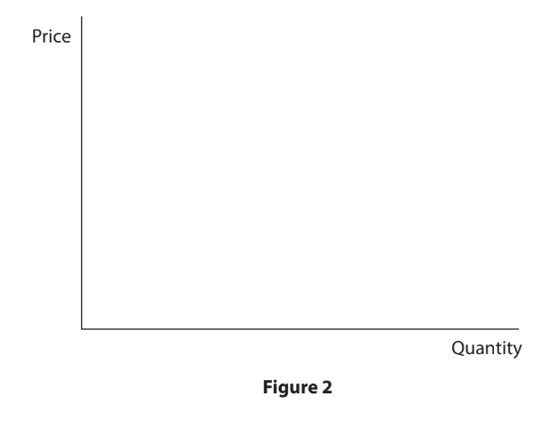
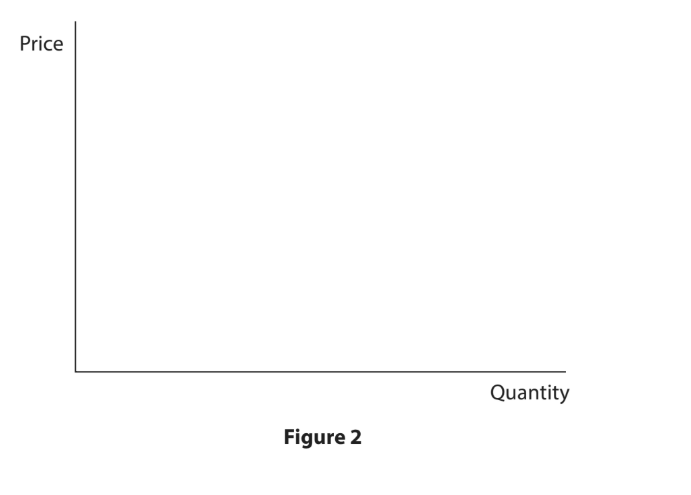
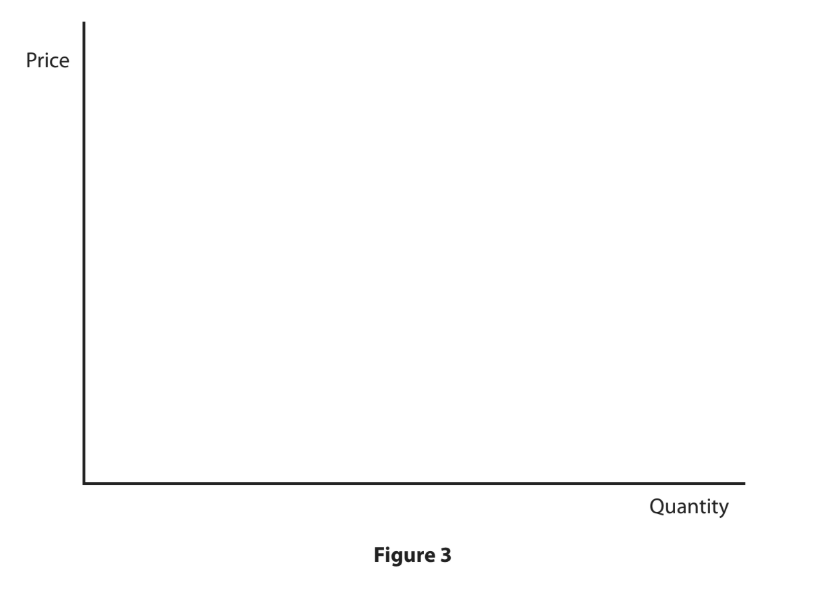
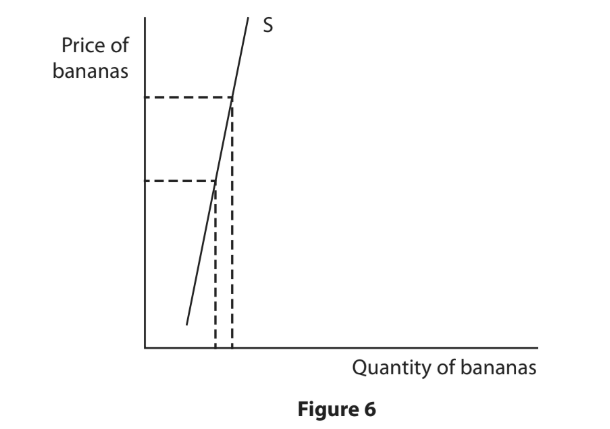
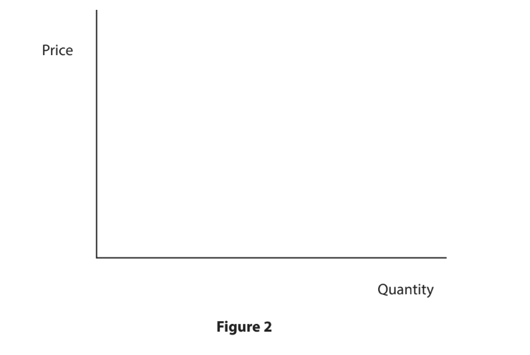

# Exam Questions — Elasticity
**The Market System** · Edexcel IGCSE Economics (4EC1)
> Source: [https://www.savemyexams.com/igcse/economics/edexcel/17/topic-questions/the-market-system/elasticity/exam-questions/](https://www.savemyexams.com/igcse/economics/edexcel/17/topic-questions/the-market-system/elasticity/exam-questions/) · 55 questions · total 213 marks

## Q1 — easy — 3 marks · exam-questions

### 1((a)) — 1 mark — multiple_choice — from paper June 2024 · Paper 1
Which **one** of the following values shows perfectly price elastic demand?
- **A.** -1
- **B.** -0.5
- **C.** Zero
- **D.** Infinity

### 1((f)) — 2 marks — command: calculate — structured — from paper June 2024 · Paper 1
Calculate, to two decimal places, the** income elasticity of demand **(YED) for a good if income increases by 7% and quantity demanded increases by 11%. You are advised to show your working.

## Q2 — easy — 2 marks · exam-questions

### 2((c)) — 2 marks — command: calculate — structured — from paper June 2024 · Paper 1
Calculate the **percentage change in quantity demanded** for a product if the price elasticity of demand (PED) is –1.9 and the price falls by 10%. You are advised to show your working.

## Q3 — easy — 3 marks · exam-questions

### 1((a)) — 1 mark — multiple_choice — from paper June 2024 · Paper 1R
Which **one** of the following values shows perfectly price inelastic supply?
- **A.** 0
- **B.** 0.5
- **C.** 1
- **D.** 2

### 1((f)) — 2 marks — command: calculate — structured — from paper June 2024 · Paper 1R
Calculate, to two decimal places, the income elasticity of demand (YED) for a good if income increases by 6.2% and quantity demanded increases by 1.7%. You are advised to show your working.

## Q4 — easy — 2 marks · exam-questions

### 2((c)) — 2 marks — command: calculate — structured — from paper June 2024 · Paper 1R
Calculate the **percentage change in quantity supplied** for a product if the price elasticity of supply (PES) is 1.5 and the price increases by 12%. You are advised  to show your working.

## Q5 — easy — 5 marks · exam-questions

### 1((f)) — 2 marks — command: calculate — structured — from paper Nov 2024 · Paper 1
Calculate, to two decimal places, the **price elasticity of supply (PES)** for a good if price decreases by 9.4% and quantity supplied decreases by 3.7%. You are advised to show your working.

### 1((h)) — 3 marks — command: explain — structured — from paper Nov 2024 · Paper 1
Six months after the price for a soft drink increased, its price elasticity of demand (PED) changed from –1.5 to –2.0.

Explain** one** reason why demand for a product, such as a soft drink, usually becomes more price elastic over time.

## Q6 — easy — 1 marks · exam-questions

### 3((b)) — 1 mark — multiple_choice — from paper Nov 2024 · Paper 1
Which **one **of the following best describes the type of goods with an income elasticity of demand (YED) of –1.3?
- **A.** Inferior
- **B.** Unitary
- **C.** Luxury
- **D.** Normal

## Q7 — easy — 8 marks · exam-questions

### 1((f)) — 2 marks — command: calculate — structured — from paper Jan 2023 · Paper 1
Yusef paints portraits of tourists who visit his home town. He recently reduced the price he charges by 2.5% and quantity demanded increased by 3.2%.

Calculate, to two decimal places, the **price elasticity of demand** (PED) for Yusef’s portraits. You are advised to show your working.

### 1((i)) — 6 marks — command: analyse — structured — from paper Jan 2023 · Paper 1
Megabus provides cheap bus travel in Canada, the US and the UK. Research showed that if incomes rose by 10% then the quantity demanded for bus travel would fall by 15%.

With reference to the data above and your knowledge of economics, analyse why this knowledge could be useful to a firm such as Megabus.

## Q8 — easy — 2 marks · exam-questions

### 1((f)) — 2 marks — command: calculate — structured — from paper Jan 2023 · Paper 1R
Connor owns a hair salon. He increased prices by 2% and was willing to increase quantity supplied by 2.6%.

Calculate the **price elasticity of supply (PES)** for Connor’s hair salon. You are advised to show your working.

## Q9 — easy — 1 marks · exam-questions

### 2((a)) — 1 mark — multiple_choice — from paper Jan 2023 · Paper 1R
The income elasticity of demand (YED) for a product can be calculated by using the information in Figure 3.

| Change in quantity demanded | 4.6% |
|---|---|
| Change in income | 2% |

**Figure 3**

Which **one **of the following options best describes the demand for the product?
- **A.** Unitary
- **B.** Luxury
- **C.** Inferior
- **D.** Inelastic

## Q10 — easy — 2 marks · exam-questions

### 4((a)) — 2 marks — command: calculate — structured — from paper Jan 2023 · Paper 1R
Figure 6 shows financial data for a firm selling a selection of products.

| Product | X | Y |
|---|---|---|
| Price | \$3000 | \$3300 |
| Quantity sold | 50 | 40 |
| Total revenue | \$3000 × 50 | \$3300 × 40 |
| PED | –0.62 | –1.53 |

**Figure 6**

Calculate the **total revenue** for the product that has a price elasticity of demand (PED) which is** inelastic**. You are advised to show your working.

## Q11 — easy — 2 marks · exam-questions

### 1((f)) — 2 marks — command: calculate — structured — from paper Nov 2023 · Paper 1
A firm increases supply by 4.3% following a price increase of 3.7%.

Calculate, to two decimal places,** the price elasticity of supply** (PES) for the firm. You are advised to show your working.

## Q12 — easy — 4 marks · exam-questions

### 1((c)) — 2 marks — command: what — structured — from paper June 2022 · Paper 1
What is meant by the term normal good?

### 1((f)) — 2 marks — command: calculate — structured — from paper June 2022 · Paper 1
Greg produces pottery at a small factory in his local area. At the start of the year price increased by 5.4% and quantity supplied increased by 4.7%.

Calculate, to two decimal places, the **price elasticity of supply (PES)** for Greg’s pottery. You are advised to show your working.

## Q13 — easy — 1 marks · exam-questions

### 2((a)) — 1 mark — multiple_choice — from paper June 2022 · Paper 1
Which **one** of the following products has demand that is price elastic?
- **A.** Product **W**  (PED =–1.5)
- **B.** Product **X**  (PED=-1)
- **C.** Product **Y **(PED=–0.5)
- **D.** Product **Z** (PED=1)

## Q14 — easy — 4 marks · exam-questions

### 1((c)) — 2 marks — command: what — structured — from paper June 2022 · Paper1R
What is meant by the term inferior good?

### 1((f)) — 2 marks — command: calculate — structured — from paper June 2022 · Paper 1
Inny provides a window cleaning service to homeowners in his local area. He recently increased prices by 1.6% and quantity demanded fell by 2.1%.

Calculate, to two decimal places, the **price elasticity of demand (PED)** for Inny’s window cleaning service. You are advised to show your working.

## Q15 — easy — 1 marks · exam-questions

### 2((c)) — 1 mark — command: state — structured — from paper June 2022 · Paper 1R
State the formula for price elasticity of supply (PES).

## Q16 — easy — 2 marks · exam-questions

### 1((f)) — 2 marks — command: calculate — structured — from paper June 2021 · Paper 1
Alfie provides a dog‐walking service to dog owners in his local area. After a successful first year he increased prices by 1.5% and quantity demanded fell by 1.1%.

Calculate, to two decimal places, the** price elasticity of demand (PED)** for Alfie’s dog‐walking service. You are advised to show your working.

## Q17 — easy — 1 marks · exam-questions

### 2((a)) — 1 mark — multiple_choice — from paper June 2021 · Paper 1
Which** one** of the following products has a price inelastic demand?
- **A.** Product **W** (PED=-1.5)
- **B.** Product **X** (PED= -1)
- **C.** Product **Y** (PED=-0.5)
- **D.** Product** Z** (PED= 1)

## Q18 — easy — 1 marks · exam-questions

### 1((b)) — 1 mark — multiple_choice — from paper Nov 2021 · Paper 1
A product has an income elasticity of demand (YED) of 0.7.

Which **one** of the following best describes the product?
- **A.** A public good
- **B.** A normal good
- **C.** A luxury good
- **D.** An inferior good

## Q19 — easy — 2 marks · exam-questions

### 2((d)) — 2 marks — command: calculate — structured — from paper Nov 2021 · Paper 1
A firm increases supply by 2.7% following a price increase of 4.9%.

Calculate, to two decimal places, the **price elasticity of supply (PES) **for the firm. You are advised to show your working.

## Q20 — easy — 3 marks · exam-questions

### 1((a)) — 1 mark — multiple_choice — from paper Jan 2020 · Paper 1
Which** one** of the following values shows perfect price inelasticity of supply?
- **A.** 1.5
- **B.** 1
- **C.** 0.5
- **D.** 0

### 1((f)) — 2 marks — command: calculate — structured — from paper Jan 2020 · Paper 1
Calculate the **income elasticity of demand (YED)** for a good if income increases by 25% and quantity demanded increases by 10%. You are advised to show your working.

## Q21 — easy — 2 marks · exam-questions

### 2((d)) — 2 marks — command: calculate — structured — from paper Jan 2020 · Paper 1
Calculate the** price elasticity of supply (PES)** for a product when price increases by 30% and quantity supplied increases by 36%. You are advised to show your working.

## Q22 — easy — 3 marks · exam-questions

### 1((a)) — 1 mark — multiple_choice — from paper Jan 2020 · Paper 1R
Which **one** of the following values shows perfect price inelasticity of demand?
- **A.** −1.5
- **B.** −1
- **C.** 0
- **D.** 0.5

### 2() — 2 marks — command: calculate — structured — from paper Jan 2020 · Paper 1R
Calculate the income** elasticity of demand (YED)** for a good if income increases by 5% and quantity demanded increases by 12%. You are advised to show your working.

## Q23 — easy — 2 marks · exam-questions

### 2((c)) — 2 marks — command: calculate — structured — from paper Jan 2020 · Paper 1R
Calculate the** price elasticity of demand (PED)** for a product if price falls by 10% and quantity demanded increases by 19%. You are advised to show your working.

## Q24 — easy — 2 marks · exam-questions

### 2((f)) — 2 marks — command: describe — structured — from paper Nov 2020 · Paper 1
Describe **one** reason why demand for a product usually becomes more price elastic over time.

## Q25 — easy — 1 marks · exam-questions

### 3((b)) — 1 mark — multiple_choice — from paper Nov 2020 · Paper 1
Which** one** of the following best describes an income elasticity of demand (YED) of 2.6?
- **A.** Inferior
- **B.** Unitary
- **C.** Luxury
- **D.** Inelastic

## Q26 — easy — 2 marks · exam-questions

### 4((a)) — 2 marks — command: calculate — structured — from paper Nov 2020 · Paper 1
Financial data for a firm selling a selection of products is shown in Figure 5.

| Product | X | Y |
|---|---|---|
| Price | \$1500 | \$1650 |
| Quantity sold | 25 | 20 |
| Total revenue | \$1500 × 25 | \$1650 × 20 |
| PED | −0.39 | −1.46 |

**Figure 5**

Calculate the** total revenue** for the product that has a price elasticity of demand (PED) which is **elastic**. You are advised to show your working.

## Q27 — easy — 1 marks · exam-questions

### 3((b)) — 1 mark — multiple_choice — from paper Nov 2020 · Paper 1R
Which** one** of the following options describes a price elasticity of supply (PES) of 0.7?
- **A.** Perfectly price elastic
- **B.** Perfectly price inelastic
- **C.** Price elastic
- **D.** Price inelastic

## Q28 — easy — 2 marks · exam-questions

### 2((c)) — 2 marks — command: calculate — structured — from paper June 2019 · Paper 1
Calculate the price elasticity of demand for a product when price increases by 15% and quantity demanded falls by 12%. You are advised to show your working.

## Q29 — easy — 1 marks · exam-questions

### 3((a)) — 1 mark — multiple_choice — from paper June 2019 · Paper 1
A product has an income elasticity of demand (YED) of -0.16.

Which **one** of the following best describes this product?
- **A.** A luxury good
- **B.** A normal good
- **C.** A public good
- **D.** An inferior good

## Q30 — easy — 5 marks · exam-questions

### 1((c)) — 2 marks — command: what — structured — from paper June 2019 · Paper 1
What is meant by the term luxury good?

### 1((d)) — 1 mark — command: state — structured — from paper June 2019 · Paper 1R
State one factor that would affect price elasticity of supply (PES).

### 1((f)) — 2 marks — command: calculate — structured — from paper June 2019 · Paper 1R
**Small but successful**

Robert has been running a small business from a workshop in his own house for nine years. He has been carving door signs and gifts out of locally sourced wood. Rather than producing identical, standard items, he decided to only make products to meet the personal requirements of his customers. Each order is made specifically for them and reviews are very positive. Robert’s success is due to a growing trend across the country as consumers increasingly prefer to buy locally sourced products.

Calculate the price elasticity of supply for Robert’s wooden door signs when the price increases by 5.2% and quantity supplied increases by 3.9%. You are advised to show your working.

## Q31 — easy — 1 marks · exam-questions

### 3((d)) — 1 mark — command: state — structured — from paper June 2019 · Paper 1R
State the price elasticity of demand for newspapers after total revenue has increased with a price increase.

## Q32 — easy — 2 marks · exam-questions

### 1() — 2 marks — command: calculate — structured
A concert venue increases the price of a standard ticket from \$40 to \$50. Weekly ticket sales fall from 600 to 510. Calculate the price elasticity of demand (PED) for concert tickets. You are advised to show your working.

## Q33 — easy — 2 marks · exam-questions

### 1() — 2 marks — command: calculate — structured
A furniture maker increases the price of a wooden dining table from £600 to £900. In response, weekly output rises from 20 tables to 26 tables. Calculate the price elasticity of supply (PES) for the dining tables. You are advised to show your working.

## Q34 — easy — 2 marks · exam-questions

### 1() — 2 marks — command: calculate — structured
A consumer's weekly income rises from £1000 to £1100. Their spending on spa treatments rises from 2 sessions to 3 sessions a month. Calculate the income elasticity of demand (YED) for spa treatments. You are advised to show your working.

## Q35 — easy — 2 marks · exam-questions

### 1() — 2 marks — command: calculate — structured
Financial data for two products sold by a firm is shown below.

Product M: Price \$220, Quantity sold 80, PED −0.5

Product N: Price \$150, Quantity sold 120, PED −1.7

Calculate the total revenue for the product that has a price elasticity of demand (PED) which is elastic. You are advised to show your working.

## Q36 — easy — 1 marks · exam-questions

### 1() — 1 mark — command: state — structured
A train operator increases its standard fare. After the change, total revenue is £2.1 million a month, up from £1.8 million a month before the fare increase. State the price elasticity of demand for train fares.

## Q37 — easy — 1 marks · exam-questions

### 1() — 1 mark — multiple_choice
Which **one **of the following values shows perfect price elasticity of supply?
- **A.** 0
- **B.** 0.4
- **C.** 1
- **D.** Infinity (∞)

## Q38 — easy — 2 marks · exam-questions

### 1() — 2 marks — command: what — structured
What is meant by the term income inelastic demand?

## Q39 — medium — 12 marks · exam-questions

### 3((c)) — 3 marks — command: draw — structured — from paper Nov 2024 · Paper 1
Using the diagram below, draw a price elastic demand (PED) curve. Label the curve and show the impact on both axes from a change in price.

### 3((e)) — 9 marks — command: assess — structured — from paper June 2024 · Paper 1
With reference to the diagram above and your knowledge of economics, assess whether supply is likely to be more price elastic for textiles than for agricultural products.

## Q40 — medium — 12 marks · exam-questions

### 3((c)) — 3 marks — command: draw — structured — from paper June 2024 · Paper 1R
Using the diagram below, draw a diagram to show a demand curve that has price inelastic demand. Label the curve and show the impact on both axes from a change in price.

### 3((e)) — 9 marks — command: assess — structured — from paper June 2024 · Paper 1R
Prime Hydration is a range of drinks launched in 2022 by YouTube celebrities, KSI and Logan Paul. It was instantly very popular, especially with teenagers. At its launch in the UK, the recommended retail price for a bottle was £1.99.

However, the price of a bottle on Amazon ranged from £8.25 to £19.99 but availability was not guaranteed.

With reference to the data above and your knowledge of economics, assess whether an increase in the price of Prime Hydration is always likely to lead to an increase in total revenue for retailers.

## Q41 — medium — 3 marks · exam-questions

### 3((c)) — 3 marks — command: draw — structured — from paper Jan 2023 · Paper 1
Draw a supply curve on the diagram below that has price elastic supply (PES). Label the impact of a price change from P1 to P2 and its impact on quantity from Q1 to Q2 .

## Q42 — medium — 6 marks · exam-questions

### 4((b)) — 6 marks — command: analyse — structured — from paper Nov 2023 · Paper 1
Marina Café is popular with tourists and locals in the town of Budva, Montenegro. It is situated next to the sea, with views of the surrounding mountains. Customers can enjoy their drinks whilst benefitting from the pleasant surroundings but pay €2.00 for a cup of coffee. The same brand of coffee can be bought for €0.80 a cup in some other cafés in Budva.

With reference to the data above and your knowledge of economics, analyse why price elasticity of demand (PED) may be relatively inelastic at Marina Café.

## Q43 — medium — 6 marks · exam-questions

### 4((b)) — 6 marks — command: analyse — structured — from paper June 2021 · Paper 1
Figure 6 shows the price elasticity of supply (PES) of bananas.

With reference to the data above and your knowledge of economics, analyse how the quantity supplied of bananas might be affected by an increase in price.

## Q44 — medium — 12 marks · exam-questions

### 3((c)) — 3 marks — command: draw — structured — from paper Jan  · Paper 1R
Draw a demand curve on the diagram below that has price elastic demand (PED). Label the impact of a price change from P1 to P2 and its impact on quantity from Q1 to Q2

### 3((e)) — 9 marks — command: assess — structured — from paper Jan 2020 · Paper 1R
In the Republic of Korea, firms such as Hyundai and Kia produce cars. In addition, the Republic has 28,951 farms producing organic fruits such as strawberries. It is one of the most important organic producers in Asia.

(Source adapted from: http://www.intracen.org/exporters/organic-products/country-focus/Country-Profile-South-Korea/)

With reference to the data above and your knowledge of economics, assess whether the price elasticity of supply (PES) is likely to be more price elastic for cars than for organic strawberries.

## Q45 — medium — 3 marks · exam-questions

### 1((h)) — 3 marks — command: explain — structured — from paper June 2019 · Paper 1
Concert tickets to see the most popular music artists can sell for very high prices.

Explain **one** reason why the demand for these tickets might be price inelastic.

## Q46 — medium — 3 marks · exam-questions

### 1() — 3 marks — command: draw — structured
Using the diagram below, draw a demand curve that shows price inelastic demand (PED) for insulin. Label the curve and show the impact on both axes from a change in price.

## Q47 — medium — 3 marks · exam-questions

### 1() — 3 marks — command: explain — structured
A government is considering raising the tax on cigarettes. Explain **one** reason why this might be an effective way for the government to raise tax revenue.

## Q48 — medium — 3 marks · exam-questions

### 1() — 3 marks — command: explain — structured
There has been a sharp rise in demand for skilled data engineers in Kenya's technology sector, but the supply of qualified data engineers cannot increase quickly. Explain **one** reason why this might be a concern for Kenyan technology firms.

## Q49 — medium — 6 marks · exam-questions

### 1() — 6 marks — command: analyse — structured
The price of a particular smartphone model has risen sharply over the past year, and the manufacturer has been able to increase the quantity supplied significantly in response.

With reference to the information above and your knowledge of economics, analyse why the supply of this smartphone model might be price elastic.

## Q50 — medium — 6 marks · exam-questions

### 1() — 6 marks — command: analyse — structured
A furniture retailer has noticed that during a period of rising average incomes in its country, sales of its premium leather sofas have increased by a much larger percentage than the rise in incomes.

With reference to the information above and your knowledge of economics, analyse what this suggests about the income elasticity of demand (YED) for premium leather sofas, and its significance for the retailer.

## Q51 — hard — 12 marks · exam-questions

### 4((c)) — 12 marks — command: evaluate — structured — from paper Jan 2020 · Paper 1
Value Added Tax (VAT) is an indirect tax that must be added to the price of most food and household goods. The rate of VAT in South Africa was increased from 14% to 15% on 1st April 2018. Both consumer spending and business confidence fell following this increase but a further rise in VAT is being discussed by the government. VAT is not currently added to the price of fruit, vegetables and bread.

With reference to the data above and your knowledge of economics, evaluate the usefulness of price elasticity of demand (PED) in helping the South African Government to decide whether to increase the rate of VAT.

## Q52 — hard — 12 marks · exam-questions

### 4((c)) — 12 marks — command: evaluate — structured — from paper Nov 2020 · Paper 1R
Amazon Prime Video is a multinational entertainment provider. It streams films and television shows to subscribers through the internet. In Japan, Amazon holds 11.5% of the market share. This is higher than Netflix but less than dTV, U-NEXT and Hulu. Subscribers currently pay 3,900 yen (\$36.75) for annual membership to stream from Amazon, which is cheaper than its competitors.

(Source adapted from: https://variety.com/2018/tv/news/amazon-netflix-gain-ground-japan-streaming-1202729953/)

With reference to the data above and your knowledge of economics, evaluate the importance of income elasticity of demand (YED) for Amazon Prime Video as incomes in Japan increase.

## Q53 — hard — 9 marks · exam-questions

### 1() — 9 marks — command: assess — structured
Nigeria's textile industry employs around 250,000 workers directly, producing items such as clothing and school uniforms. Nigeria is also a major producer of cocoa, grown on more than 300,000 small farms across the south of the country.

With reference to the information above and your knowledge of economics, assess whether supply is likely to be more price elastic for textiles than for cocoa.

## Q54 — hard — 9 marks · exam-questions

### 1() — 9 marks — command: assess — structured
The government of Mexico currently applies a 10% tax on sugary soft drinks, which have a price elasticity of demand of around –1.3. The government is considering raising this tax to 20%, in order to raise additional tax revenue and discourage consumption.

With reference to the information above and your knowledge of economics, assess the effectiveness of this policy in achieving the government's aims.

## Q55 — hard — 12 marks · exam-questions

### 1() — 12 marks — command: evaluate — structured
A furniture company has calculated an income elasticity of demand (YED) of 1.8 for its premium leather sofas, ahead of a period when the country's average income is forecast to rise by 6% over the next two years. The company is deciding whether to expand production of the sofas on the strength of this forecast.

With reference to the information above and your knowledge of economics, evaluate the usefulness of income elasticity of demand (YED) in helping the company decide whether to expand production.
