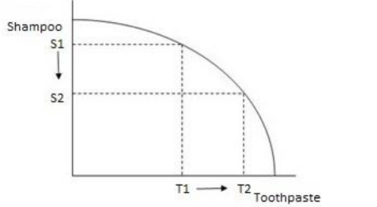
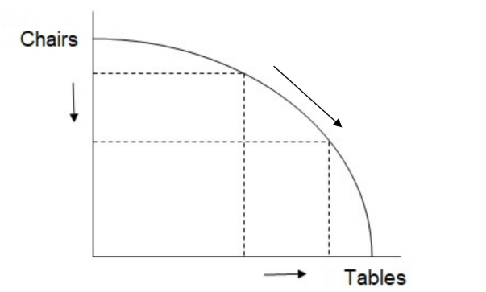
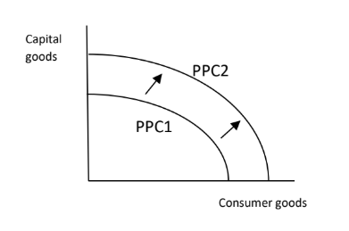
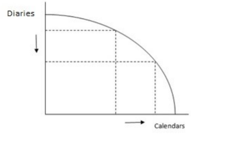
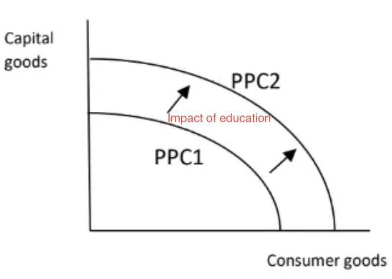
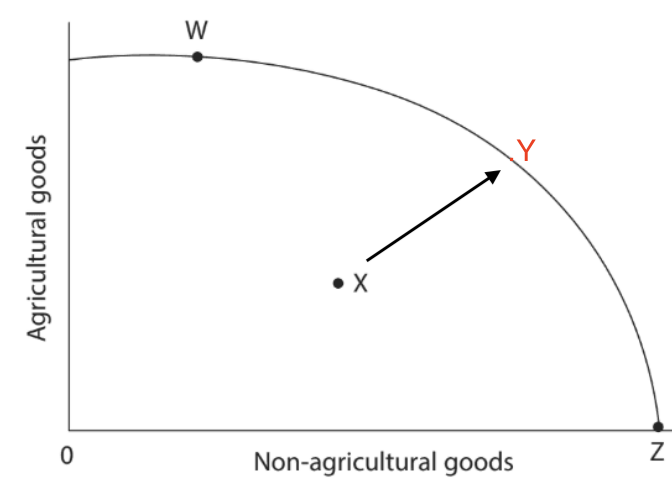

# Mark Schemes — The Economic Problem
**The Market System** · Edexcel IGCSE Economics (4EC1)

## Q1 — easy — 1 marks · exam-questions

### 3((a)) — 1 marks
**Correct answer: C** — Shelter

**The correct answer is C**

Shelter protects people from the elements and is required to sustain life, which is why it is classed as a need rather than a want

**A** is incorrect as a haircut is an economic want, not something required for survival

**B** is incorrect as a holiday is a luxury, not a necessity

**D** is incorrect as a smartphone, while widely owned, is not required to sustain life

## Q2 — easy — 2 marks · exam-questions

### 4((a)) — 2 marks
500 – 400 ** [1 mark]**

**100 units of capital goods **** ****[1 mark]**

> **[mark-scheme]**
> Award 1 mark for showing correct calculation
> 
> Award 1 mark for calculating correct opportunity cost
> 
> Award 2 marks if opportunity cost is correctly calculated as 100 units of capital goods, even if no calculations are shown
> 
> Do not award marks for a formula

> **[exam-tip]**
> Always show your working, even when told the final answer alone can score full marks - it protects a mark if you make a slip

## Q3 — easy — 2 marks · exam-questions

### 2((c)) — 2 marks
Opportunity cost is the cost of the next best alternative** [1]** given up when making a choice** [1 ]**

**[2 marks]**

> **[mark-scheme]**
> Definitions generally require two parts for 2 marks
> 
> One mark is awarded for each correct part
> 
> Any other correct and appropriate wording is acceptable

## Q4 — easy — 2 marks · exam-questions

### 2((f)) — 2 marks
There are limited resources available** [1]**, therefore the demand for resources is greater than the supply of them** [1]**

**[2 marks]**

> **[mark-scheme]**
> Award 1 mark for identifying a valid reason and 1 mark for developing that reason - a definition alone is not creditworthy on a Describe question
> 
> Accept any other appropriate response, e.g. reference to a specific finite resource (land, labour, capital) rather than resources in general

> **[exam-tip]**
> Only one reason is required - giving two or more separate reasons instead of developing one does not gain extra marks

## Q5 — easy — 1 marks · exam-questions

### 2((a)) — 1 marks
**Correct answer: B** — Trade-off

**Final answer:** **The correct answer is B**

A trade-off arises whenever resources are limited, so choosing to have more of one thing means accepting less of another

**A** is incorrect as menu costs are the costs a firm faces in changing its listed prices during inflation, not a choice between two goods

**C** is incorrect as opportunity cost is specifically the value of the next best alternative given up, not the general relationship between having more of one thing and less of another

**D** is incorrect as a trading bloc is a group of countries with a preferential trade agreement between them

## Q6 — easy — 1 marks · exam-questions

### 1((a)) — 1 marks
**Correct answer: D** — A given amount of resources being fully employed

**Final answer:** **The correct answer is D**

Any point on the curve itself shows the maximum combination of the two goods an economy can make when all of its resources are fully and efficiently employed

**A** is incorrect as a PPC shows the combinations an economy is able to produce, not which combination it ought to choose

**B** is incorrect as increasing the production of all goods needs the whole curve to shift outward, which a single point on the curve cannot show

**C** is incorrect as a PPC plots quantities of goods on both axes and shows nothing about revenue or money values

## Q7 — easy — 1 marks · exam-questions

### 2((a)) — 1 marks
**Correct answer: B** — X

**Final answer:** **The correct answer is B**

X lies inside the production possibility curve, so the country is producing less than it could with the resources it has, meaning some resources are unemployed or being used inefficiently

**A** is incorrect as W lies on the curve, where all available resources are already fully employed

**C** is incorrect as Y lies outside the curve, so it cannot be reached with the country's current resources and technology

**D** is incorrect as Z lies on the curve, so all available resources are fully employed there too

## Q8 — easy — 2 marks · exam-questions

### 1((a)) — 1 marks
**Correct answer: C** — Opportunity cost

**Final answer:** **The correct answer is C**

When a choice is made, the opportunity cost is the value of the single next best alternative that had to be given up

**A** is incorrect as business competition is the rivalry between firms selling in the same market

**B** is incorrect as capital investment is spending by firms on capital goods such as machinery and equipment

**D** is incorrect as spare capacity is where resources are not all being used, shown by a point inside the production possibility curve

### 1((e)) — 1 marks
**Wants are the desire for goods and services****[1 mark]**

> **[mark-scheme]**
> Award 1 mark for a correct definition
> 
> No marks are available for an example in place of a definition
> 
> Accept any other correct and appropriate wording

> **[exam-tip]**
> - Do not answer a 'define' question with an example. The examiner report for this paper states that no mark is given for providing only an example, so write what the term actually means
> - One mark means one short sentence. Examiners do not expect you to write a lot here

## Q9 — easy — 2 marks · exam-questions

### 4((a)) — 2 marks
160 − 130 **[1 mark]**

**30 units of consumer goods** **[1 mark]**

> **[mark-scheme]**
> Award 1 mark for showing correct calculation
> 
> Award 1 mark for calculating the correct opportunity cost
> 
> Award 2 marks if the opportunity cost is correctly calculated as 30 units of consumer goods, even if no calculations are shown
> 
> Award 1 mark if the opportunity cost is given as 30 with no unit stated
> 
> Do not award marks for a formula

> **[exam-tip]**
> - Always write the unit as well as the number. Examiner reports record candidates who did the calculation correctly but lost the second mark purely by leaving the unit off, so '30' alone is not enough - write 30 units of consumer goods
> - On a PPC the opportunity cost is always measured on the other axis: gaining capital goods costs you the consumer goods given up

## Q10 — easy — 1 marks · exam-questions

### 2((b)) — 1 marks
**Correct answer: C** — Y

**Final answer:** **The correct answer is C**

Y lies outside the production possibility curve, so it cannot be produced with the country's current resources and level of technology

**A** is incorrect as W lies on the curve, so it can be produced with all of the country's resources fully employed

**B** is incorrect as X lies inside the curve, so it can be produced, but with some resources left unemployed or used inefficiently

**D** is incorrect as Z lies on the curve at the horizontal axis, so it can be produced by using all resources to make non-agricultural goods only

## Q11 — easy — 7 marks · exam-questions

### 3((b)) — 1 marks
**Correct answer: D** — Education

**Final answer:** **The correct answer is D**

Education is desired because it improves quality of life, but it is not required to stay alive, which makes it a want rather than a need

**A** is incorrect as food is required to sustain life, so it is a need

**B** is incorrect as water is required to sustain life, so it is a need

**C** is incorrect as shelter is required to sustain life, so it is a need

### 3((e)) — 6 marks
A production possibility frontier (PPF) shows the maximum combinations of capital goods and consumer goods an economy can produce when all of its resources are fully employed.** [K]** In Figure 3 the whole frontier has shifted outward from PPF1 to PPF2, so at every point the economy can now produce more of both goods rather than having to sacrifice one for the other.** [Ap]** This can only happen if the quantity or the quality of the economy's resources has risen, for example through investment in new machinery, a larger or better-trained workforce, or improvements in technology.** [K]** As these extra and more productive resources come into use the economy's productive capacity increases, which is exactly what an outward shift of the whole frontier represents.** [An]** This is economic growth, and it means output of capital goods and consumer goods can rise at the same time, so the trade-off between them becomes less severe.** [An]**

**[6 marks]**

> **[mark-scheme]**
> This is a 'levelled response' question
> 
> - **[Ap]** = application to the data given  (3 marks)
> - **[An]** = analysis / chain of reasoning (3 marks)
> 
> Although there are no separate **[K] marks**, both application and analysis must be built on **clear and accurate economic knowledge and understanding**
> 
> Therefore, each KAA paragraph should follow:
> 
> - Valid knowledge point → Application → Analysis
> - Each valid point made in the answer does not equal a mark, the response is judged holistically against the level descriptors
> 
> **Mark allocation**
> 
> Answers are placed into one of three levels.  **A level 3 answer (5-6 marks)**, will specifically:
> 
> - Demonstrate clear knowledge and understanding by developing relevant points and include appropriate application of economic terms, concepts, theories and calculations
> - Information presented will demonstrate excellent selectivity and organisation. Interpretation of economic information will be excellent, with a thorough analysis of issues
> 
> **Alternative content**
> 
> The answer above is just one example of how to respond to this question. Additional information which could be used in the answer includes:
> 
> - The PPF shows the combinations of goods which can be produced with all available resources
> - An increase in the ability to produce both capital and consumer goods is shown in Figure 3 due to the outward shift of the PPF
> - Economic growth would allow this to happen as there is likely to be an increase in economic resources and improvements in technology over time
> - With the increase in resources and efficiency, it would be possible to increase production of both capital and consumer goods without the sacrifice of the other
> - Any other relevant and valid analysis is acceptable

> **[exam-tip]**
> - One thoroughly developed chain of reasoning can get full marks, you don't need several separate points
> - No counter-argument and no conclusion is required - analyse is always one-sided
> - Say what caused the shift (more or better resources, better technology), not just that the curve has moved - the marks are in the explanation

## Q12 — easy — 1 marks · exam-questions

### 1((a)) — 1 marks
**Correct answer: C** — The next best alternative given up

**Final answer:** **The correct answer is C**

Opportunity cost is what you give up when you choose one option over another, valued as the single next best alternative forgone

**A** is incorrect as rivalry between firms is business competition, not a cost of making a choice

**B** is incorrect as investment in capital goods is spending on machinery and equipment, which is a use of resources rather than the alternative given up

**D** is incorrect as unused resources describe spare capacity, shown by a point inside the production possibility curve

## Q13 — easy — 1 marks · exam-questions

### 1() — 1 marks
**Correct answer: B** — A private swimming pool

**Final answer:** **The correct answer is B**

A private swimming pool is a non-essential desire that goes beyond what is required to sustain life, which is why it is classed as a want rather than a need

**A** is incorrect as clean drinking water is required to sustain life, making it a need

**C** is incorrect as basic clothing is essential for survival, making it a need

**D** is incorrect as emergency medical treatment is required to sustain life, making it a need

## Q14 — easy — 1 marks · exam-questions

### 1() — 1 marks
The term factors of production refers to the resources used by an economy to produce goods and services** ****[1 mark]**

> **[mark-scheme]**
> Award 1 mark for a correct definition
> 
> No marks are available for an example in place of a definition
> 
> Accept any other correct and appropriate wording

## Q15 — easy — 1 marks · exam-questions

### 1() — 1 marks
**Labour** **[1 mark]**

> **[mark-scheme]**
> Award 1 mark for correctly stating one factor of production (land, labour, capital or enterprise)

## Q16 — easy — 2 marks · exam-questions

### 1() — 2 marks
Constant opportunity cost occurs when all resources used to produce one good can be switched to produce another good without any loss of resources **[1]**, so giving up one unit of a good results in exactly one unit gained of the other **[1]**

**[2 marks]**

> **[mark-scheme]**
> Definitions generally require two parts for 2 marks
> 
> One mark is awarded for each correct part
> 
> Any other correct and appropriate wording is acceptable

## Q17 — easy — 2 marks · exam-questions

### 1() — 2 marks
A natural disaster could destroy some of a country's capital goods, such as factories and machinery **[1]**, which reduces the quantity of resources available to produce output and so decreases the economy's maximum possible production **[1 ]**

**[2 marks]**

> **[mark-scheme]**
> Award 1 mark for identifying a valid reason and 1 mark for developing that reason - a definition alone is not creditworthy on a Describe question
> 
> Accept any other appropriate response, e.g. a fall in the size of the working population, or a reduction in the quality of available resources

> **[exam-tip]**
> Only one reason is required - giving two or more separate reasons instead of developing one does not gain extra marks

## Q18 — easy — 2 marks · exam-questions

### 1() — 2 marks
350 - 300 **[1 mark]**

**50 units of clothing** **[1 mark]**

> **[mark-scheme]**
> Award 1 mark for showing correct calculation
> 
> Award 1 mark for calculating correct opportunity cost
> 
> Award 2 marks if opportunity cost is correctly calculated as 50 units of clothing, even if no calculations are shown
> 
> Do not award marks for a formula

> **[exam-tip]**
> - Always show your working, even when told the final answer alone can score full marks - it protects a mark if you make a slip

## Q19 — easy — 1 marks · exam-questions

### 1() — 1 marks
**Correct answer: B** — X

**Final answer:** **The correct answer is B**

Position X lies inside the PPC, which means the economy is not using all of its available resources, such as during a period of unemployment or recession

**W** is incorrect as this position lies on the curve, representing full and efficient use of the economy's resources

**Y** is incorrect as this position lies outside the curve, which is only possible if the economy is temporarily working beyond its sustainable maximum potential, not underusing resources

**Z** is incorrect as this position, like W, lies on the curve and represents full and efficient use of resources

## Q20 — medium — 3 marks · exam-questions

### 1((h)) — 3 marks
One opportunity cost is that Casper may not be able to buy a new phone** [1]**, because he does not have enough money to buy both the television and the phone** [1]**, so he has to sacrifice the next best alternative when using his money to buy the television** [1]**

**[3 marks]**

> **[mark-scheme]**
> Award 1 mark for the response being in context
> 
> Award 1 mark for identifying a relevant opportunity cost
> 
> Award 1 mark for developing the opportunity cost
> 
> **Alternative content**
> 
> The answer above is just one example of a response to this question. Other opportunity costs Casper could face include:
> 
> - A holiday or a weekend away
> - Putting the money into savings
> - A different household appliance such as a washing machine
> 
> Accept any other appropriate response

> **[exam-tip]**
> - Don't open with a definition of opportunity cost — there are no marks for it here
> - Name Casper specifically and give one concrete alternative he gives up — the context mark is the one most often lost even when the economics is right

## Q21 — medium — 3 marks · exam-questions

### 1((h)) — 3 marks
One opportunity cost is that the firm may not be able to buy new machinery** [1]**, because it does not have enough money to fund both the delivery vehicle and the machinery** [1]**, so the machinery is the next best alternative given up when the firm spends its money on the vehicle** [1]**

**[3 marks]**

> **[mark-scheme]**
> Award 1 mark for identifying a relevant opportunity cost
> 
> Award 1 mark for developing the opportunity cost
> 
> Award 1 mark for the response being in context
> 
> **Alternative content**
> 
> The answer above is just one example of a response to this question. Other opportunity costs the firm could face include:
> 
> - Hiring additional staff
> - Refurbishing its premises
> - Spending on advertising
> - Paying off an existing loan
> 
> Accept any other appropriate response

> **[exam-tip]**
> - Don't open with a definition of opportunity cost - there are no marks for it here

## Q22 — medium — 3 marks · exam-questions

### 3((c)) — 3 marks

**[3 marks]**

> **[mark-scheme]**
> Award 1 mark for drawing a production possibility curve (PPC) with correctly labelled axes
> 
> Award 1 mark for showing a decrease in shampoo on the PPC
> 
> Award 1 mark for showing an increase in toothpaste on the PPC

> **[exam-tip]**
> - This is a movement along the curve, not a shift of it - toothpaste production increasing (with fixed resources) means shampoo production must fall
> - Label both axes and both points clearly - an unlabelled diagram cannot be awarded the axes mark even if the shape is right

## Q23 — medium — 3 marks · exam-questions

### 3((c)) — 3 marks

**[3 marks]**

> **[mark-scheme]**
> Award 1 mark for drawing a production possibility frontier (PPF) with correctly labelled axes
> 
> Award 1 mark for showing a decrease in chairs on the PPF
> 
> Award 1 mark for showing an increase in tables on the PPF

> **[exam-tip]**
> - This is a movement along the curve, not a shift of it - with resources fixed, making more tables means making fewer chairs
> - Label your diagram in order to achieve full marks. Examiner reports repeatedly note candidates losing the axes mark on this question type, either by leaving the axes unnamed or by shifting the whole curve outwards instead of moving along it

## Q24 — medium — 3 marks · exam-questions

### 1((h)) — 3 marks
One opportunity cost is that the government may not be able to build a new school** [1]**, because it does not have the money or the resources to fund both the hospital and the school** [1]**, so the school is the next best alternative given up when the government chooses to build the hospital** [1]**

**[3 marks]**

> **[mark-scheme]**
> Award 1 mark for identifying a relevant opportunity cost
> 
> Award 1 mark for developing the opportunity cost
> 
> Award 1 mark for the response being in context
> 
> **Alternative content**
> 
> The answer above is just one example of a response to this question. Other opportunity costs the government could face include:
> 
> - Improving existing roads
> - Employing more teachers
> - Increasing welfare payments
> - Reducing taxes
> 
> Accept any other appropriate response

> **[exam-tip]**
> - Don't open with a definition of opportunity cost - there are no marks for it here

## Q25 — medium — 3 marks · exam-questions

### 3((c)) — 3 marks

**[3 marks]**

> **[mark-scheme]**
> Award 1 mark for correctly labelling the axes
> 
> Award 1 mark for drawing PPC1 closer to the axes than PPC2
> 
> Award 1 mark for drawing PPC2 showing positive economic growth from PPC1

> **[exam-tip]**
> - Unlike most PPC questions this one is a shift of the whole curve, not a movement along it - PPC2 must sit outside PPC1 at every point
> - Label your diagram in order to achieve full marks: name both axes and mark both curves PPC1 and PPC2. Examiner reports single out labelling as the most common reason marks are lost on diagram questions

## Q26 — medium — 3 marks · exam-questions

### 1((h)) — 3 marks
One opportunity cost is that the firm may not be able to employ additional staff** [1]**, because it does not have enough money to fund both the new computer system and the extra wages** [1]**, so employing more staff is the next best alternative given up when the firm buys the computer system** [1]**

**[3 marks]**

> **[mark-scheme]**
> Award 1 mark for identifying a relevant opportunity cost
> 
> Award 1 mark for developing the opportunity cost
> 
> Award 1 mark for the response being in context
> 
> **Alternative content**
> 
> The answer above is just one example of a response to this question. Other opportunity costs the firm could face include:
> 
> - Buying new machinery or vehicles
> - Upgrading its premises
> - Spending on staff training
> - Holding the money as savings
> 
> Accept any other appropriate response

> **[exam-tip]**
> - Don't open with a definition of opportunity cost - there are no marks for it here

## Q27 — medium — 3 marks · exam-questions

### 3((c)) — 3 marks

**[3 marks]**

> **[mark-scheme]**
> Award 1 mark for drawing a production possibility frontier (PPF) with correctly labelled axes
> 
> Award 1 mark for showing a decrease in diaries on the PPF
> 
> Award 1 mark for showing an increase in calendars on the PPF

> **[exam-tip]**
> - This is a movement along the curve, not a shift of it - with resources fixed, making more calendars means making fewer diaries
> - Label the axes and the curve fully. The examiner report for this question notes that some candidates failed to label the diagram correctly, and that others drew a supply and demand diagram by mistake
> - Be very clear when drawing your lines, because an ambiguous diagram is likely to score no marks at all

## Q28 — medium — 6 marks · exam-questions

### 1((i)) — 6 marks
The movement from A to B represents a reallocation of resources from consumer goods to capital goods.** [K]** At A, the economy produces 350 million units of capital goods and 160 million units of consumer goods; at B, capital goods rise to 450 million units while consumer goods fall to 130 million units.** [Ap]** Because all resources are already fully employed on the PPC, the only way to produce more capital goods is to withdraw resources from consumer goods production,** [K]** so 30 million units of consumer goods are given up to gain 100 million units of capital goods - this is the opportunity cost of the movement.** [An]** Since capital goods such as machinery and infrastructure increase an economy's future productive capacity rather than being consumed immediately,** [K]** this additional capital coming into use means the economy becomes able to produce more of both goods over time, shifting the whole PPC outward.** [An]** This outward shift represents economic growth, meaning the short-term fall in consumer goods produced at B can lead to higher output of both goods in the future.** [An]**

**[6 marks]**

> **[mark-scheme]**
> This is a ‘levelled response’ question
> 
> - **[Ap]** = application to the data given  (3 marks)
> - **[An]** = analysis / chain of reasoning (3 marks)
> 
> Although there are no separate **[K] marks**, both application and analysis must be built on **clear and accurate economic knowledge and understanding**
> 
> Therefore, each KAA paragraph should follow:
> 
> - Valid knowledge point → Application → Analysis
> - Each valid point made in the answer does not equal a mark — the response is judged holistically against the level descriptors
> 
> **Mark allocation**
> 
> Answers are placed into one of three levels.  **A level 3 answer (5-6 marks)**, will specifically:
> 
> - Demonstrate clear knowledge and understanding by developing relevant points and include appropriate application of economic terms, concepts, theories and calculations
> - Information presented will demonstrate excellent selectivity and organisation. Interpretation of economic information will be excellent, with a thorough analysis of issues
> 
> **Alternative content**
> 
> - A response could instead focus on the type of resources being reallocated (e.g. labour and capital shifting from consumer-goods industries into capital-goods industries)
> - Any other relevant and valid analysis is acceptable

> **[exam-tip]**
> - One thoroughly developed chain of reasoning can get full marks, you don’t need several separate points
> - No counter-argument and no conclusion is required - analyse is always one-sided

## Q29 — medium — 6 marks · exam-questions

### 3((d)) — 6 marks
A production possibility frontier (PPF) shows the maximum combinations of goods an economy can produce when all of its resources are fully employed.** [K]** Figure 4 shows the whole frontier for Zambia shifting outward from PPF1 to PPF2, so the economy can now produce more without giving up output elsewhere.** [Ap]** This happens when the quantity or the quality of a country's resources rises, for example through investment in new mining equipment, a larger or better-trained workforce, or improved technology.** [K]** As these extra and more productive resources come into use Zambia's productive capacity increases, which is exactly what an outward shift of the whole frontier represents.** [An]** This is economic growth, so more agricultural goods and copper could be produced and more construction could take place at the same time, without resources having to be shifted out of one sector to expand another.** [An]**

**[6 marks]**

> **[mark-scheme]**
> This is a 'levelled response' question
> 
> - **[Ap]** = application to the data given  (3 marks)
> - **[An]** = analysis / chain of reasoning (3 marks)
> 
> Although there are no separate **[K] marks**, both application and analysis must be built on **clear and accurate economic knowledge and understanding**
> 
> Therefore, each KAA paragraph should follow:
> 
> - Valid knowledge point → Application → Analysis
> - Each valid point made in the answer does not equal a mark, the response is judged holistically against the level descriptors
> 
> **Mark allocation**
> 
> Answers are placed into one of three levels.  **A level 3 answer (5-6 marks)**, will specifically:
> 
> - Demonstrate clear knowledge and understanding by developing relevant points and include appropriate application of economic terms, concepts, theories and calculations
> - Information presented will demonstrate excellent selectivity and organisation. Interpretation of economic information will be excellent, with a thorough analysis of issues
> 
> **Alternative content**
> 
> The answer above is just one example of how to respond to this question. Additional information which could be used in the answer includes:
> 
> - The PPF shows the combinations of goods which can be produced with all available resources
> - An increase in the ability to produce both capital and consumer goods is shown due to the outward shift of the PPF
> - Economic growth would allow this to happen as there is likely to be an increase in economic resources and improvements in technology over time
> - With the increase in resources and efficiency, it would be possible to increase production of both capital and consumer goods without the sacrifice of the other
> - This means that more agricultural goods and copper could be produced and more construction could take place, without the need to shift resources to alternative production
> - Any other relevant and valid analysis is acceptable

> **[exam-tip]**
> - One thoroughly developed chain of reasoning can get full marks, you don't need several separate points
> - No counter-argument and no conclusion is required - analyse is always one-sided
> - Use Zambia's own industries (agriculture, construction and copper) rather than writing about 'the economy' in general - the application marks depend on it

## Q30 — medium — 3 marks · exam-questions

### 1() — 3 marks

**[3 marks]**

> **[mark-scheme]**
> Award 1 mark for drawing a production possibility curve (PPC) with correctly labelled axes
> 
> Award 1 mark for drawing a second curve that lies outside (further from the origin than) the original curve
> 
> Award 1 mark for correctly linking the outward shift to an increase in the quantity or quality of resources available

> **[exam-tip]**
> - This is a shift of the whole curve, not a movement along it – both curves must be drawn, with the new one further from the origin at every point
> - Label the original and new curves clearly, and label both axes – an unlabelled diagram cannot be awarded the axes mark even if the shape is right

## Q31 — medium — 3 marks · exam-questions

### 1() — 3 marks

**[3 marks]**

> **[mark-scheme]**
> Award 1 mark for drawing a production possibility curve (PPC) with correctly labelled axes (any two labels are acceptable)
> 
> Award 1 mark for correctly plotting a point inside the PPC to represent the current position
> 
> Award 1 mark for showing a movement from the point inside the curve to a point on the curve, to represent full employment

> **[exam-tip]**
> - A point inside the curve shows unused resources – it is a movement to the curve, not a shift of the whole curve
> - Don't confuse a point inside the curve (unemployed resources, as here) with a point outside the curve, which shows an economy temporarily and unsustainably exceeding its normal capacity instead

## Q32 — medium — 3 marks · exam-questions

### 1() — 3 marks
Because Zambia's new copper deposits increase the quantity of raw materials available for production** [1]**, this increases the resources Zambia has available to produce output** [1]**, meaning its PPC shifts outward as it can now produce more output using all of its resources** [1]**

**[3 marks]**

> **[mark-scheme]**
> Award 1 mark for identifying a relevant reason for an outward shift
> 
> Award 1 mark for the response being in context
> 
> Award 1 mark for developing the reason
> 
> **Alternative content**
> 
> The answer above is just one example of a response to this question. Other valid reasons linked to the copper discovery include:
> 
> - Exporting the new copper could earn Zambia foreign currency, which could then be invested in new capital goods or infrastructure, further increasing productive capacity
> - Developing the new deposits requires new mining equipment and infrastructure, which directly increases Zambia's capital stock
> - The discovery could attract foreign direct investment into Zambia's mining sector, bringing in additional capital and technology
> 
> Accept any other appropriate response

> **[exam-tip]**
> - Don't open with a definition of a PPC — there are no marks for it here

## Q33 — medium — 3 marks · exam-questions

### 1() — 3 marks
Because Kenya's government has limited resources (a fixed budget) but many competing demands** [1]**, it may have to choose between building new schools or upgrading rural roads** [1]**, meaning it cannot fund both and must sacrifice one to fund the other** [1]**

**[3 marks]**

> **[mark-scheme]**
> Award 1 mark for identifying a relevant way in which scarcity affects decision-making
> 
> Award 1 mark for the response being in context
> 
> Award 1 mark for developing the point
> 
> **Alternative content**
> 
> The answer above is just one example of a response to this question. Other valid points include:
> 
> - The government may have to choose between healthcare spending and defence spending
> - The government may have to prioritise one region's infrastructure over another's
> 
> Accept any other appropriate response

> **[exam-tip]**
> - Don't open with a definition of scarcity — there are no marks for it here
> - Name the country and give one concrete choice it faces — the context mark is the one most often lost even when the economics is right

## Q34 — medium — 6 marks · exam-questions

### 1() — 6 marks
The movement from P to Q shows that giving up 30 million tonnes of rice gains 15 million units of machinery, an opportunity cost of 2 million tonnes of rice per unit of machinery.** [Ap]** From Q to R, giving up 40 million tonnes of rice gains only 10 million units of machinery, so the opportunity cost rises to 4 million tonnes of rice per unit of machinery.** [Ap]** This is increasing opportunity cost, because land suited to growing rice is not equally suited to manufacturing machinery.** [K]** As production shifts further towards machinery, the economy must reallocate resources progressively less suited to that use, so each extra unit costs more rice than the last.** [An]** This makes full specialisation in machinery inefficient, so a more balanced combination of the two goods would serve the economy better.** [An]**

**[6 marks]**

> **[mark-scheme]**
> This is a 'levelled response' question
> 
> - **[Ap]** = application to the data given (3 marks)
> - **[An]** = analysis / chain of reasoning (3 marks)
> 
> Although there are no separate **[K] marks**, both application and analysis must be built on **clear and accurate economic knowledge and understanding**
> 
> Therefore, each KAA paragraph should follow:
> 
> - Valid knowledge point → Application → Analysis
> - Each valid point made in the answer does not equal a mark — the response is judged holistically against the level descriptors
> 
> **Mark allocation**
> 
> Answers are placed into one of three levels. **A level 3 answer (5-6 marks)**, will specifically:
> 
> - Demonstrate clear knowledge and understanding by developing relevant points and include appropriate application of economic terms, concepts, theories and calculations
> - Information presented will demonstrate excellent selectivity and organisation. Interpretation of economic information will be excellent, with a thorough analysis of issues
> 
> **Alternative content**
> 
> - A response could instead focus on the specific factors of production that make rice and machinery production difficult to switch between, such as differences in required skills or land quality
> - The rising opportunity cost could also be explained by capital equipment: machinery-suited infrastructure cannot be built up as quickly as rice farming can be scaled back, adding a second cause beyond land and skill mismatch
> - Any other relevant and valid analysis is acceptable

> **[exam-tip]**
> - One thoroughly developed chain of reasoning can get full marks, you don't need several separate points
> 
>   - No counter-argument and no conclusion is required - analyse is always one-sided
> - Prove increasing opportunity cost with the actual figures rather than just asserting it - calculate the ratio at each stage (here, 2 tonnes of rice per unit rising to 4) so the marker can see the cost is rising, not just read a claim that it is

## Q35 — hard — 9 marks · exam-questions

### 1() — 9 marks
One benefit for Vietnam of achieving this economic growth is that its outward-shifted PPC allows it to produce more goods and services overall, raising living standards.** [K]** Vietnam's \$80 billion of investment in infrastructure such as roads and ports increases the productive capacity of its capital stock, while workforce training improves the quality of its labour force, helping the economy grow by around 6% a year over the past decade.** [Ap]** This higher potential output allows Vietnam to produce more consumer goods without necessarily reducing capital goods production, meaning the growth can raise living standards over time as well as strengthening the country's productive base for the future.** [An]** Improved infrastructure such as new ports may also make Vietnam more attractive to foreign investors, reinforcing the shift and generating further growth.** [An]**

However, achieving this growth has come at a significant cost, since the government has had to run a budget deficit of around 4% of GDP and cut healthcare spending, closing more than 30 rural hospitals.** [Ev]** Because Vietnam's government has limited resources, funding this investment has created an opportunity cost elsewhere in the budget, and rural communities losing access to hospitals may see health outcomes worsen.** [Ap]** This suggests the benefits of the growth are not shared evenly across Vietnam, since urban and export-facing regions are more likely to benefit from new infrastructure while rural communities bear the cost of reduced healthcare provision.** [An]** If a budget deficit of this size persists, Vietnam's government may need to borrow more or raise taxes in future, which could reduce disposable incomes and partly offset the living-standard gains from the higher output achieved.** [An]**

**[9 marks]**

> **[mark-scheme]**
> This is a 'levelled response' question
> 
> - **[Ap]** = application to the data given (3 marks)
> - **[An]** = analysis / chain of reasoning (3 marks)
> - **[Ev]** = evaluation (3 marks)
> 
> Although there are no separate **[K] marks**, both application and analysis must be built on **clear and accurate economic knowledge and understanding**
> 
> Therefore, each KAA paragraph should follow:
> 
> - Valid knowledge point → Application → Analysis
> - Each valid point made in the answer does not equal a mark — the response is judged holistically against the level descriptors
> 
> **Mark allocation**
> 
> A 9 mark (Level 3) answer will include examples which demonstrate:
> 
> - **Application [Ap]** — clear knowledge and understanding by developing relevant points. Appropriate application of economic terms, concepts, theories and calculations
> - **Analysis [An]** — Information presented will demonstrate excellent selectivity and organisation. Interpretation of economic information will be excellent, with a thorough analysis of issues
> - **Evaluation [Ev]** — Offers more than one viewpoint. The argument is well balanced and coherent, leading to an evaluation that demonstrates full understanding and awareness
> 
> **Alternative content**
> 
> The answer above is just one example of how to respond to this question. Additional information which could be used in the answer includes:
> 
> - Environmental or social costs of large infrastructure projects, such as community displacement or damage to local ecosystems, which a PPC/GDP-based growth story doesn't capture
> - Whether the new infrastructure mainly benefits capital-intensive industries that employ relatively few people, despite raising output
> - The risk that some of the \$80 billion could be lost to inefficiency, meaning the actual productive capacity gained is less than the headline spending suggests
> 
> - Any other relevant and valid evaluation is acceptable

> **[exam-tip]**
> - 'Assess' requires you to consider two sides
> - Build both sides to matching depth – an unbalanced answer is the single biggest reason marks are lost here, even when both sides are technically present
> 
>   - No conclusion required
> 
> - Use Vietnam's specific figures (the \$80 billion investment, the 6% growth rate, the 4% budget deficit, the 30 rural hospital closures) rather than generic growth theory

## Q36 — hard — 9 marks · exam-questions

### 1() — 9 marks
One benefit for Sri Lanka of prioritising capital goods is that this could shift its production possibility curve outward over time, increasing the country's maximum output of both capital and consumer goods in the future.** [K]** Building new factories and machinery increases the quantity of capital available for production, meaning Sri Lanka's factors of production can be combined more productively, raising the economy's overall productive potential.** [Ap]** Given that Sri Lanka is recovering from a crisis that saw inflation exceed 50% in 2022, this increased capacity could also help create new jobs in construction and manufacturing, addressing youth unemployment currently running at around 25%.** [An]** Over time, a larger capital stock could let Sri Lanka produce more consumer goods too for its 22 million people, meaning today's sacrifice may improve its ability to meet consumer needs in future.** [An]**

However, prioritising capital goods has an immediate opportunity cost, since resources used to build factories and machinery cannot be used to produce food and clothing that many households urgently need.** [Ev]** Because many Sri Lankan households are already struggling to afford basic necessities after inflation of over 50%, diverting resources away from consumer goods production risks worsening living standards and poverty in the short term.** [Ap]** This trade-off may be especially damaging if the benefits of new capital goods take a long time to materialise, since factories take time to build, while the population's need for food and clothing is immediate.** [An]** There is also a risk that with youth unemployment already at around 25%, living standards could fall too far, weakening public support and preventing the investment being sustained long enough to deliver its intended benefits.** [An]**

**[9 marks]**

> **[mark-scheme]**
> This is a 'levelled response' question
> 
> - **[Ap]** = application to the data given (3 marks)
> - **[An]** = analysis / chain of reasoning (3 marks)
> - **[Ev]** = evaluation (3 marks)
> 
> Although there are no separate **[K] marks**, both application and analysis must be built on **clear and accurate economic knowledge and understanding**
> 
> Therefore, each KAA paragraph should follow:
> 
> - Valid knowledge point → Application → Analysis
> - Each valid point made in the answer does not equal a mark — the response is judged holistically against the level descriptors
> 
> **Mark allocation**
> 
> A 9 mark (Level 3) answer will include examples which demonstrate:
> 
> - **Application [Ap]** — clear knowledge and understanding by developing relevant points. Appropriate application of economic terms, concepts, theories and calculations
> - **Analysis [An]** — Information presented will demonstrate excellent selectivity and organisation. Interpretation of economic information will be excellent, with a thorough analysis of issues
> - **Evaluation [Ev]** — Offers more than one viewpoint. The argument is well balanced and coherent, leading to an evaluation that demonstrates full understanding and awareness
> 
> **Alternative content**
> 
> The answer above is just one example of how to respond to this question. Additional information which could be used in the answer includes:
> 
> - A response could instead focus on which specific capital goods (e.g. infrastructure vs. machinery) are prioritised, or on how the government could fund both capital and consumer goods production simultaneously through borrowing
> - Whether Sri Lanka could attract foreign direct investment to fund new capital goods, rather than diverting resources away from consumer goods domestically
> - Given the recent crisis, Sri Lanka may lack access to affordable borrowing, making this trade-off harder to avoid than for a country with a stronger fiscal position
> - Any other relevant and valid evaluation is acceptable

> **[exam-tip]**
> - 'Assess' requires you to consider two sides
> - Build both sides to matching depth – an unbalanced answer is the single biggest reason marks are lost here, even when both sides are technically present
> - No conclusion required
> - Use Sri Lanka's specific figures (over 50% inflation, 22 million people, 25% youth unemployment) rather than generic capital-vs-consumer goods theory

## Q37 — hard — 12 marks · exam-questions

### 1() — 12 marks
Reallocating resources from agriculture to electricity generation could relieve Ghana's power shortage and increase industrial output, since electricity is a key input for manufacturing and other industries.** [Ap]** Because Ghana's resources are limited, redirecting some of the 3% of the budget currently spent on agricultural subsidies towards building new power stations increases the quantity of capital available for electricity generation, addressing blackouts of up to 12 hours a day directly rather than through smaller-scale fixes.** [An]** A more reliable electricity supply could also make Ghana more attractive to foreign investors seeking to build factories, potentially shifting Ghana's production possibility curve outward as industrial capacity expands.** [An]**

However, reducing agricultural subsidies carries a significant opportunity cost, since an estimated 5 million small-scale farmers currently rely on this support and may see their incomes fall sharply if it is withdrawn.** [Ev]** Because agriculture employs a large share of Ghana's workforce, a sudden reallocation of resources away from it could reduce output and incomes in rural areas before new electricity capacity is even built, given that power stations typically take several years to construct.** [Ap]** This means the short-term costs to 5 million farmers may be certain and immediate, while the industrial benefits of new electricity capacity are delayed and uncertain, particularly if foreign investment does not materialise as expected.** [An]**

Overall, whether this reallocation benefits Ghana depends on how quickly new power stations can be built and how well the government supports farmers during the transition.** [Ev]** If new capacity comes online quickly and industrial growth generates enough tax revenue and jobs to offset the loss of agricultural subsidies, reallocation is likely to benefit Ghana in the long run; but if construction is delayed or the 5 million farmers are left without adequate support, the immediate fall in rural incomes could outweigh any industrial gains, at least until the 12-hour blackouts are resolved.** [Ev]**

**[12 marks]**

> **[mark-scheme]**
> This is a 'levelled response' question
> 
> - **[Ap]** = application to the data given (4 marks)
> - **[An]** = analysis / chain of reasoning (4 marks)
> - **[Ev]** = evaluation (4 marks)
> 
> Although there are no separate **[K] marks**, both application and analysis must be built on **clear and accurate economic knowledge and understanding**
> 
> Therefore, each KAA paragraph should follow:
> 
> - Valid knowledge point → Application → Analysis
> - Each valid point made in the answer does not equal a mark — the response is judged holistically against the level descriptors
> 
> A concluding paragraph is essential to scoring evaluation marks
> 
> **Mark allocation**
> 
> A 12 mark (Level 3) answer will include answers which:
> 
> - **Application [Ap]** — Demonstrates specific and accurate knowledge and understanding by developing relevant points. Appropriate application of economic terms, concepts, theories and calculation
> - **Analysis [An]** — Information presented will demonstrate excellent selectivity and organisation. Chain of reasoning will be coherent and logical. Interpretation of economic information will be excellent with a thorough analysis of issues
> - **Evaluation [Ev]** — Offers more than one viewpoint. The argument is well balanced and coherent, leading to an evaluation that demonstrates full understanding and awareness. A supported judgement or conclusion is present
> 
> **Alternative content**
> 
> The answer above is just one example of how to respond to this question. Additional information which could be used in the answer includes:
> 
> - A response could instead focus on whether Ghana could fund new power stations without cutting agricultural subsidies, e.g. through foreign investment or borrowing, or on the risk of continued reliance on an inadequate electricity supply if the shortage is not addressed
> - The type of industries that benefit most from reliable electricity (manufacturing vs services) could determine how many jobs the reallocation actually creates
> - Ghana could target the reallocation more precisely, e.g. protecting the smallest, most vulnerable farmers while reducing subsidies for larger commercial farms, rather than cutting support evenly across all 5 million
> - Any other relevant and valid evaluation is acceptable

> **[exam-tip]**
> - Make the conclusion specific - say what the outcome depends on (e.g. how quickly new power stations are built), not just 'there are pros and cons'
> - A good conclusion doesn't rescue a thin analysis - both sides still need to be developed and applied to Ghana specifically
> - This question carries the most marks on the paper - make sure it gets proportionate time
