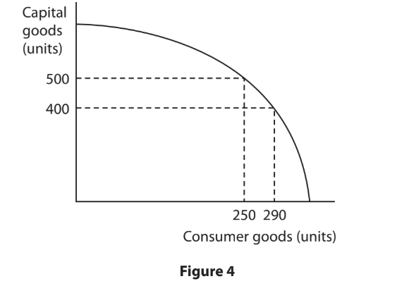
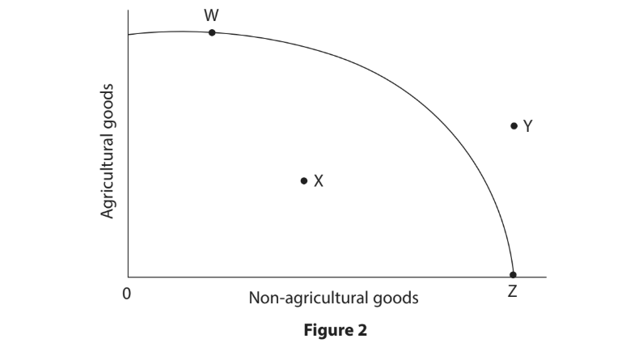
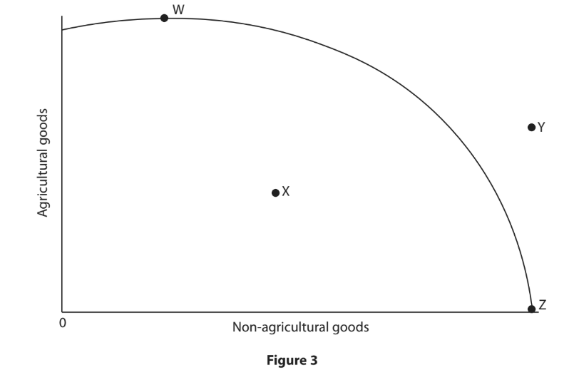
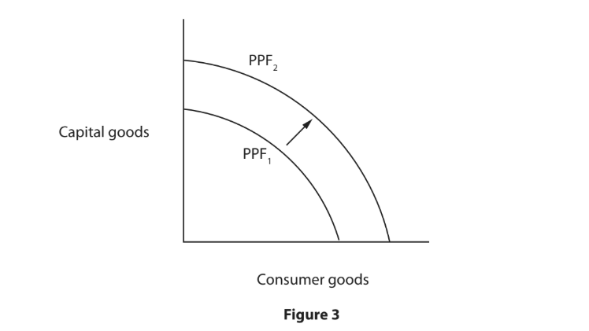
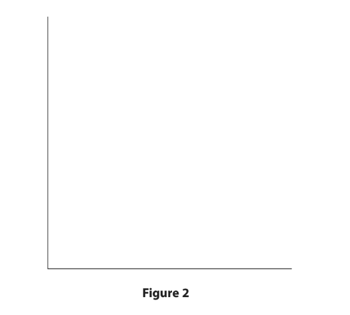
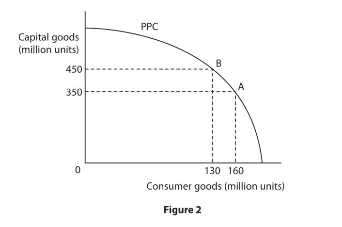
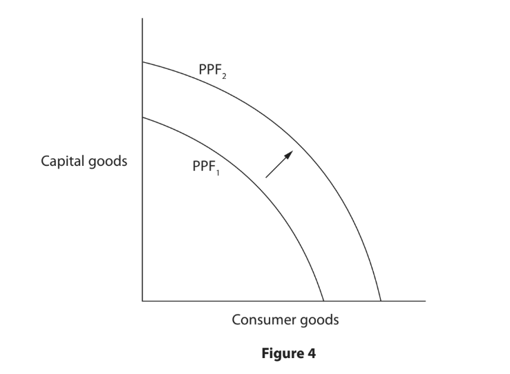
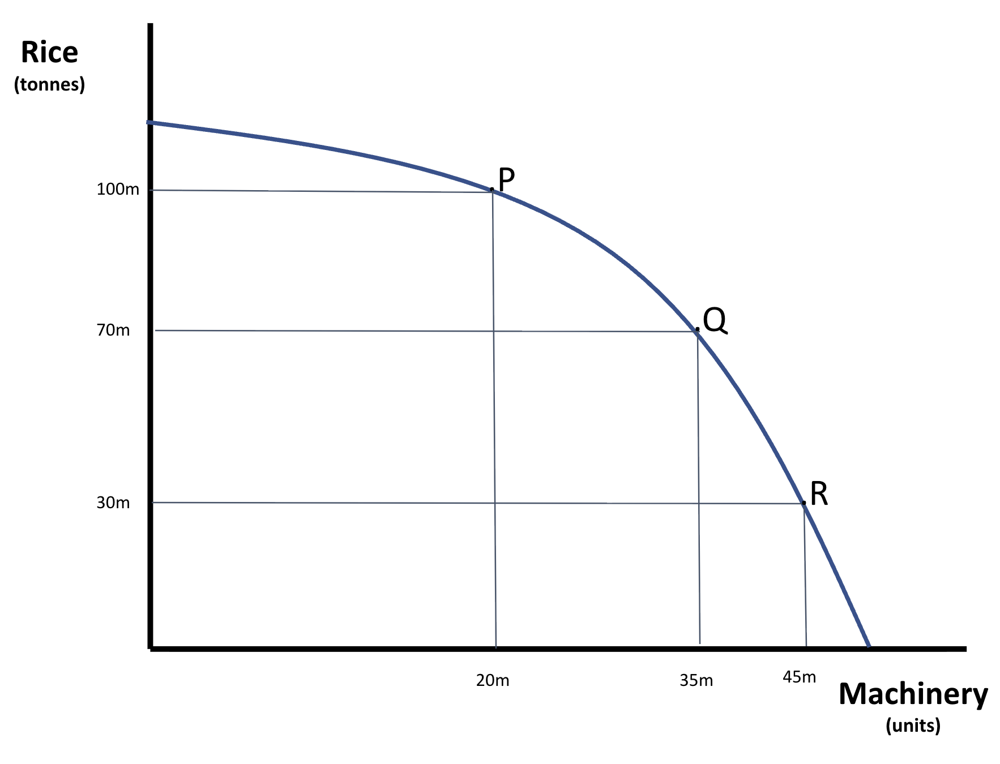

# Exam Questions — The Economic Problem
**The Market System** · Edexcel IGCSE Economics (4EC1)
> Source: [https://www.savemyexams.com/igcse/economics/edexcel/17/topic-questions/the-market-system/the-economic-problem/exam-questions/](https://www.savemyexams.com/igcse/economics/edexcel/17/topic-questions/the-market-system/the-economic-problem/exam-questions/) · 37 questions · total 117 marks

## Q1 — easy — 1 marks · exam-questions

### 3((a)) — 1 mark — multiple_choice — from paper Jan 2023 · Paper 1
Which **one** of the following could be described as an economic need?
- **A.** Haircut
- **B.** Holiday
- **C.** Shelter
- **D.** Smartphone

## Q2 — easy — 2 marks · exam-questions

### 4((a)) — 2 marks — command: calculate — structured — from paper Jan 2023 · Paper 1
Figure 4 shows the Production Possibility Curve (PPC) for an economy making capital goods and consumer goods.

When the current level of output is 250 units of consumer goods, calculate the **opportunity cost** of producing an additional 40 units of consumer goods. You  are advised to show your working.

## Q3 — easy — 2 marks · exam-questions

### 2((c)) — 2 marks — command: what — structured — from paper Nov 2023 · Paper 1
What is meant by the term opportunity cost?

## Q4 — easy — 2 marks · exam-questions

### 2((f)) — 2 marks — command: describe — structured — from paper June 2022 · Paper 1R
Describe **one** reason why infinite wants lead to scarcity.

## Q5 — easy — 1 marks · exam-questions

### 2((a)) — 1 mark — multiple_choice — from paper Jan 2022 · Paper 2R
Which **one** of the following means having more of one thing but less of another thing?
- **A.** Menu costs
- **B.** Trade-off
- **C.** Opportunity cost
- **D.** Trading bloc

## Q6 — easy — 1 marks · exam-questions

### 1((a)) — 1 mark — multiple_choice — from paper June 2021 · Paper 1
Which** one** of the following does a point on a production possibility curve (PPC) represent?
- **A.** Where capital goods should be produced
- **B.** How the production of all goods can be increased
- **C.** Government revenue from production
- **D.** A given amount of resources being fully employed

## Q7 — easy — 1 marks · exam-questions

### 2((a)) — 1 mark — multiple_choice — from paper Nov 2021 · Paper 1
A country is able to produce agricultural and non-agricultural goods with a given amount of resources. Its production possibility curve (PPC) is shown in Figure 2.

Which **one** of the following points shows unemployed resources?
- **A.** W
- **B.** X
- **C.** Y
- **D.** Z

## Q8 — easy — 2 marks · exam-questions

### 1((a)) — 1 mark — multiple_choice — from paper Nov 2020 · Paper 1
Which** one** of the following is the term for the next best alternative given up when a choice is made?
- **A.** Business competition
- **B.** Capital investment
- **C.** Opportunity cost
- **D.** Spare capacity

### 1((e)) — 1 mark — command: define — structured — from paper Nov 2020 · Paper 1
The problem of scarcity is that there are unlimited wants and finite resources.

Define the term wants.

## Q9 — easy — 2 marks · exam-questions

### 4((a)) — 2 marks — command: calculate — structured — from paper Nov 2020 · Paper 1R
Figure 6 shows the Production Possibility Curve (PPC) for an economy making consumer goods and capital goods.

When the current level of output is 350 units of capital goods, calculate the **opportunity cost** of producing an additional 100 units of capital goods. You are advised to show your working.

## Q10 — easy — 1 marks · exam-questions

### 2((b)) — 1 mark — multiple_choice — from paper June 2019 · Paper 1
A country is able to produce agricultural and non-agricultural goods. Its production possibility curve is shown in Figure 3.

Which **one **of the following points is** not** achievable?
- **A.** W
- **B.** X
- **C.** Y
- **D.** Z

## Q11 — easy — 7 marks · exam-questions

### 3((b)) — 1 mark — multiple_choice — from paper June 2019 · Paper 1R
Which** one** of the following is an example of an economic want?
- **A.** Food
- **B.** Water
- **C.** Shelter
- **D.** Education

### 3((e)) — 6 marks — command: analyse — structured — from paper June 2019 · Paper 1R

Figure 3 shows an outward shift in the production possibility frontier (PPF) for an economy.

Analyse why the economy has moved from PPF1 to PPF2.

## Q12 — easy — 1 marks · exam-questions

### 1((a)) — 1 mark — multiple_choice — from paper Nov 2024 · Paper 1
Which **one** of the following is a definition of opportunity cost?
- **A.** Rivalry that exists between firms
- **B.** Investment in capital goods
- **C.** The next best alternative given up
- **D.** Unused resources

## Q13 — easy — 1 marks · exam-questions

### 1() — 1 mark — multiple_choice
Which **one** of the following could be described as an economic want?
- **A.** Clean drinking water
- **B.** A private swimming pool
- **C.** Basic clothing
- **D.** Emergency medical treatment

## Q14 — easy — 1 marks · exam-questions

### 1() — 1 mark — command: define — structured
Define the term factors of production.

## Q15 — easy — 1 marks · exam-questions

### 1() — 1 mark — command: state — structured
State one factor of production.

## Q16 — easy — 2 marks · exam-questions

### 1() — 2 marks — command: what — structured
What is meant by the term constant opportunity cost?

## Q17 — easy — 2 marks · exam-questions

### 1() — 2 marks — command: describe — structured
Describe **one** reason why a country's production possibility curve (PPC) might shift inward.

## Q18 — easy — 2 marks · exam-questions

### 1() — 2 marks — command: calculate — structured
A country's production possibility curve shows that it can produce a combination of 350 units of clothing and 220 units of electronics, or alternatively 300 units of clothing and 260 units of electronics. Calculate the opportunity cost of increasing electronics production from 220 to 260 units.

## Q19 — easy — 1 marks · exam-questions

### 1() — 1 mark — multiple_choice
A country's production possibility curve (PPC) has consumer goods on one axis and capital goods on the other. Four positions are being considered:

Which** one** of the following positions represents an economy that is not using all of its resources efficiently?
- **A.** W
- **B.** X
- **C.** Y
- **D.** Z

## Q20 — medium — 3 marks · exam-questions

### 1((h)) — 3 marks — command: explain — structured — from paper June 2024 · Paper 1
Casper has decided to purchase a new television.

Explain** one** possible opportunity cost for Casper of this decision.

## Q21 — medium — 3 marks · exam-questions

### 1((h)) — 3 marks — command: explain — structured — from paper June 2024 · Paper 1R
A firm has decided to purchase a new delivery vehicle.

Explain **one** possible opportunity cost for the firm of this decision.

## Q22 — medium — 3 marks · exam-questions

### 3((c)) — 3 marks — command: draw — structured — from paper Nov 2024 · Paper 1
In the box below, draw a production possibility curve (PPC) for a firm that can produce shampoo and/or toothpaste. On your PPC, draw and label what would happen if production of toothpaste was increased.

|   |
|---|

## Q23 — medium — 3 marks · exam-questions

### 3((c)) — 3 marks — command: draw — structured — from paper June 2022 · Paper 1R
In the box below, draw a production possibility frontier (PPF) for a firm that can produce tables and/or chairs. On your PPF, draw what would happen if the production of chairs decreased and tables increased.

|   |
|---|

## Q24 — medium — 3 marks · exam-questions

### 1((h)) — 3 marks — command: explain — structured — from paper Jan 2020 · Paper 1
The government of a country has decided to build a new hospital.

Explain **one **possible opportunity cost for the government of this decision.

## Q25 — medium — 3 marks · exam-questions

### 3((c)) — 3 marks — command: draw — structured — from paper Jan 2020 · Paper 1
Technology has been used to perform some of the jobs previously done for many years by humans, for example, robots in factories and self-checkout machines. This substitution of capital for labour is likely to increase as technology advances. At most call centres, humans currently respond to customer queries but Google has developed an automated assistant. Many telecom firms have switched to using calls made by these automated assistants

Using the axes below, draw two production possibility curves (PPC) to show an economy moving from PPC1 to PPC2.

Label both production possibility curves and the axes.

.

## Q26 — medium — 3 marks · exam-questions

### 1((h)) — 3 marks — command: explain — structured — from paper Jan 2020 · Paper 1R
A firm has decided to purchase a new computer system.

Explain **one** possible opportunity cost for the firm of this decision.

## Q27 — medium — 3 marks · exam-questions

### 3((c)) — 3 marks — command: draw — structured — from paper Nov 2020 · Paper 1
In the box below, draw a production possibility frontier (PPF) for a firm that can  produce diaries and/or calendars. On your PPF, draw what would happen if production of calendars increased.

|   |
|---|

## Q28 — medium — 6 marks · exam-questions

### 1((i)) — 6 marks — command: analyse — structured — from paper Jan 2023 · Paper 1R

Figure 2 shows the production possibility curve (PPC) for an economy.

With reference to the data above and your knowledge of economics, analyse the impact on the economy after a movement from A to B on the production possibility curve (PPC).

## Q29 — medium — 6 marks · exam-questions

### 3((d)) — 6 marks — command: analyse — structured — from paper June 2022 · Paper 1

Figure 4 shows an outward shift in the production possibility frontier (PPF) for Zambia in 2019. Agriculture, construction and copper production are some of the main areas that contribute to the economy of Zambia.

With reference to the data above and your knowledge of economics, analyse why the economy has moved from PPF1 to PPF2.

## Q30 — medium — 3 marks · exam-questions

### 1() — 3 marks — command: draw — structured
A country invests heavily in the training and education of its workforce, significantly improving the quality of its labour force. In the box below, draw a production possibility curve (PPC) to show the impact of this investment on the country's production possibilities.

|   |
|---|

## Q31 — medium — 3 marks · exam-questions

### 1() — 3 marks — command: draw — structured
A country's economy is currently operating at a point inside its production possibility curve (PPC) because of high unemployment. In the box below, draw a PPC to show this situation, and show what would happen if the country achieved full employment of its resources.

|   |
|---|

## Q32 — medium — 3 marks · exam-questions

### 1() — 3 marks — command: explain — structured
Zambia has recently discovered new deposits of copper that were not previously being mined. Explain **one** reason why this discovery might cause Zambia's production possibility curve (PPC) to shift outward.

## Q33 — medium — 3 marks · exam-questions

### 1() — 3 marks — command: explain — structured
The government of Kenya has a fixed budget for the year. Explain **one** way in which scarcity affects the government's decision-making.

## Q34 — medium — 6 marks · exam-questions

### 1() — 6 marks — command: analyse — structured
An economy produces rice and machinery as follows:

With reference to the data above and your knowledge of economics, analyse the opportunity cost of increasing machinery production as the economy moves from point P to point R.

## Q35 — hard — 9 marks · exam-questions

### 1() — 9 marks — command: assess — structured
Vietnam has invested \$80 billion in new roads, ports and workforce training since 2015, helping the economy grow by around 6% a year over the past decade. This investment has shifted Vietnam's production possibility curve (PPC) outward, but it has required the government to run a budget deficit of around 4% of GDP, and more than 30 rural hospitals have closed due to reduced healthcare spending elsewhere in the budget.

With reference to the data above and your knowledge of economics, assess the benefits to Vietnam of achieving this economic growth.

## Q36 — hard — 9 marks · exam-questions

### 1() — 9 marks — command: assess — structured
Sri Lanka is recovering from an economic crisis that saw inflation reach over 50% in 2022, and the government now has limited resources available. It must decide whether to prioritise producing capital goods, such as new factories and machinery, or consumer goods, such as food and clothing, for its population of around 22 million people. Youth unemployment in Sri Lanka is currently around 25%, and many households are struggling to afford basic necessities.

With reference to the data above and your knowledge of economics, assess the benefits to Sri Lanka of prioritising the production of capital goods over consumer goods.

## Q37 — hard — 12 marks · exam-questions

### 1() — 12 marks — command: evaluate — structured
The government of Ghana is facing a shortage of electricity generation capacity that causes rolling blackouts lasting up to 12 hours a day in some regions, limiting industrial output. Ghana currently allocates around 3% of its national budget to agricultural subsidies, which support an estimated 5 million small-scale farmers. Some economists have recommended that Ghana reallocate resources away from agriculture and towards building new power stations, in order to relieve the electricity shortage.

With reference to the data above and your knowledge of economics, evaluate whether reallocating resources away from agriculture and towards electricity generation is the best way for Ghana to respond to this shortage.
