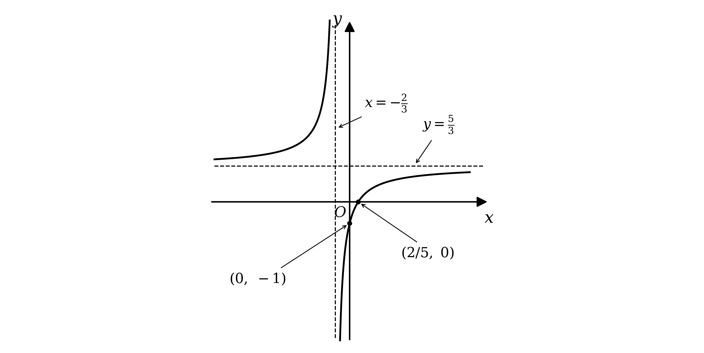

# Mark Schemes — Applications of Differentiation
**Calculus** · Edexcel IGCSE Further Pure Maths (4PM1)

## Q1 — medium — 9 marks · exam-questions

### 5((a)) — 3 marks
The two numbers are tied together by $2 x + y = 13$, so use that to write one of them in terms of the other

Making $y$ the subject is easiest here, because $y$ has no coefficient

$y = 13 - 2 x$

**[B1]**

$S$ is the sum of the squares of $2 x$ and $y$, so square each of them and add

`S = \left(2 x\right)^{2} + \left(13 - 2 x\right)^{2}`

**[M1]**

Expand both squares, taking care with the bracket containing the subtraction

- `\left(2 x\right)^{2}` is $4 x^{2}$, since the 2 is squared as well as the $x$
- `\left(13 - 2 x\right)^{2}` is $169 - 52 x + 4 x^{2}$

$S = 4 x^{2} + 169 - 52 x + 4 x^{2}$

Collect the two $x^{2}$ terms and write the result in descending powers of $x$

$S = 8 x^{2} - 52 x + 169  \text{as required}$

**[A1]**

> **[mark-scheme]**
> **B1**: Rearranges the given equation to $y = 13 - 2 x$. Accept this seen anywhere in the working, and accept it in an equivalent form which can be substituted.
> 
> **M1**: Forms the sum of the two squares, `\left(2 x\right)^{2} + \left(13 - 2 x\right)^{2}`. The bracket need not be expanded for this mark.
> 
> **A1**: Reaches the printed result $S = 8 x^{2} - 52 x + 169$ with no errors seen.
> 
> The result is printed in the question, so every line of the working has to be correct. A student who writes down the answer with no intermediate expansion earns the first mark only.
> 
> Squaring $2 x$ rather than $x$ is the whole of the first method mark. Writing $S = x^{2} + y^{2}$ and continuing from there scores nothing beyond the B1.

> **[exam-tip]**
> Read which quantities are being squared.
> 
> - It is the squares of $2 x$ and $y$, not of $x$ and $y$
> - That factor of 2 is the difference between $8 x^{2}$ and $5 x^{2}$ in the final answer
> 
> Substituting for $y$ leaves a function of $x$ alone, which is what part (b) needs.
> 
> - A quantity to be minimised has to be written in terms of a single variable before it can be differentiated
> 
> Expand `\left(13 - 2 x\right)^{2}` in full rather than squaring each term.
> 
> - The middle term $- 52 x$ is the one that gets dropped, and it is the term the printed answer checks

### 5((b)) — 4 marks
A minimum of $S$ occurs where the gradient of $S$ against $x$ is zero, so differentiate

$\frac{\text{d}S}{\text{d}x} = 16 x - 52$

**[M1]**

Set the derivative equal to zero

$16 x - 52 = 0$

Solve the linear equation

$16 x = 52$

**[M1]**

$x = \frac{13}{4}$

**[A1]**

A zero gradient could be a maximum or a minimum, so differentiate a second time to settle which

$\frac{\text{d}^{2}S}{\text{d}x^{2}} = 16$

The second derivative is a positive constant, so it is positive whatever the value of $x$

$\frac{\text{d}^{2}S}{\text{d}x^{2}} > 0  \text{so} S \text{is a minimum}$

**[B1]**

> **[mark-scheme]**
> **M1**: Differentiates $S$, reducing the power of at least one term by 1.
> 
> **M1**: Sets your derivative equal to zero and solves it to reach a value of $x$.
> 
> **A1**: $x = \frac{13}{4}$, or the equivalent $3 . 25$.
> 
> **B1**: A correct second derivative together with a conclusion that this value of $x$ gives a minimum.
> 
> The second derivative here is the constant 16, so no substitution is needed and a statement that it is positive is enough. A student who writes only "minimum", with no second derivative and no other reasoning, does not earn the final mark.

> **[exam-tip]**
> The justification is a mark in its own right, so never leave it out.
> 
> - One quarter of this part is for showing why the turning point is a minimum
> - A second derivative that is positive means a minimum, and one that is negative means a maximum
> 
> A constant second derivative is the easiest case there is.
> 
> - $S$ is a quadratic, so its second derivative is the constant 16 and there is nothing to substitute
> - Say explicitly that 16 is positive, rather than leaving the reader to notice it
> 
> Give $x$ exactly.
> 
> - $\frac{13}{4}$ and $3 . 25$ are both fine, but a rounded decimal such as $3 . 3$ would lose the accuracy mark

### 5((c)) — 2 marks
Substitute the value of $x$ found in part (b) into the expression for $S$ from part (a)

`S = 8 \times \left(\frac{13}{4}\right)^{2} - 52 \times \frac{13}{4} + 169`

**[M1]**

Work the two products out separately, keeping them as fractions

- $8 \times \frac{169}{16} = \frac{169}{2}$
- $52 \times \frac{13}{4} = 169$

$S = \frac{169}{2} - 169 + 169$

The last two terms cancel

$S = 84 . 5$

**[A1]**

> **[mark-scheme]**
> **M1**: Substitutes your value of $x$ into the given expression for $S$.
> 
> **A1**: $84 . 5$, or the equivalent $\frac{169}{2}$.
> 
> Follow through from your value of $x$ in part (b) for the method mark.
> 
> Substituting into `S = \left(2 x\right)^{2} + y^{2}` with the matching value of $y$ is equally acceptable and reaches the same answer.

> **[exam-tip]**
> The minimum value of $S$ is not the value of $x$ that produces it.
> 
> - Part (b) asked for $x$ and this part asks for $S$, so one more substitution is always needed
> - Stopping at $x = \frac{13}{4}$ is the commonest way to lose both marks here
> 
> Fractions beat decimals in this substitution.
> 
> - `\left(\frac{13}{4}\right)^{2} = \frac{169}{16}`, and the 16 cancels with the 8 to give $\frac{169}{2}$ exactly
> - The $- 169$ and $+ 169$ then cancel, so the whole calculation is one line
> 
> There is a quicker route worth knowing.
> 
> - Completing the square gives `S = 8\left(x - \frac{13}{4}\right)^{2} + 84 . 5`, which shows the minimum without any calculus
> - The question says to use calculus, so keep the differentiation as the method and treat this as a check

## Q2 — medium — 18 marks · exam-questions

### 10((a)) — 5 marks
$P$ lies on $M$, so start by finding its $y$ coordinate

Substitute $x = - 2$ into the equation of the curve

`y = ( - 2 )^{3} - 13 \left(- 2\right) - 12`

$y = 6$

**[B1]**

So $P$ is the point `\left(- 2 , 6\right)`

The gradient of the tangent is the gradient of the curve at that point, so differentiate

$\frac{\text{d}y}{\text{d}x} = 3 x^{2} - 13$

**[M1]**

Now substitute $x = - 2$ to get the gradient at $P$

$\frac{\text{d}y}{\text{d}x} = 3 ( - 2 )^{2} - 13$

$\frac{\text{d}y}{\text{d}x} = - 1$

**[A1]**

Use `y - y_{1} = m \left(x - x_{1}\right)` with the point `\left(- 2 , 6\right)` and gradient $- 1$

`y - 6 = - 1 \left(x + 2\right)`

**[M1]**

Collect the terms on one side

$y + x - 4 = 0$

**[A1]**

> **[mark-scheme]**
> **B1**: $y$ coordinate of $P$ equal to $6$.
> 
> **M1**: Differentiates to get $3 x^{2} - 13$.
> 
> **A1**: Gradient at $P$ equal to $- 1$.
> 
> **M1**: Correct method for the equation of a line through your $P$ with your gradient.
> 
> **A1**: Correct equation.
> 
> Accept the equation in any correct form, for example $y = - x + 4$ or $y + x - 4 = 0$, since no particular form is asked for.

> **[exam-tip]**
> The $y$ coordinate of $P$ carries a mark of its own, so never skip it.
> 
> - The question gives you only the $x$ coordinate, and the equation of a line needs a full point
> 
> Differentiate first, then substitute. Substituting $x = - 2$ into the equation of the curve before differentiating gives a constant, whose derivative is zero.
> 
> Take care with $( - 2 )^{2}$, which is $4$ and not $- 4$. The brackets matter, and losing them here turns the gradient into $- 25$.

### 10((b)) — 4 marks
Parallel lines have equal gradients, so $l_{2}$ also has gradient $- 1$

Set the derivative equal to $- 1$ to find every point where the curve has that gradient

$3 x^{2} - 13 = - 1$

$3 x^{2} - 12 = 0$

Divide through by $3$

$x^{2} - 4 = 0$

This is a difference of two squares

`\left(x - 2\right) \left(x + 2\right) = 0`

$x = 2  \text{or}  - 2$

**[M1]**

$x = - 2$ is the point $P$, so $Q$ must be the other solution, $x = 2$

Find the $y$ coordinate of $Q$

`y = 2^{3} - 13 \left(2\right) - 12`

$y = - 30$

**[B1]**

Use `y - y_{1} = m \left(x - x_{1}\right)` with `Q \left(2 , - 30\right)` and gradient $- 1$

`y + 30 = - \left(x - 2\right)`

**[M1]**

$y = - x - 28$

**[A1]**

> **[mark-scheme]**
> **M1**: Sets your derivative equal to $- 1$ and solves to find $x = 2$.
> 
> **B1**: $y$ coordinate of $Q$ equal to $- 30$.
> 
> **M1**: Correct method for the equation of a line through your $Q$ with gradient $- 1$.
> 
> **A1**: Correct equation.
> 
> Accept any correct form, for example $y = - x - 28$ or $y + x + 28 = 0$.

> **[exam-tip]**
> The quadratic gives two answers, and one of them is the point you already have.
> 
> - $x = - 2$ is $P$, so it must be rejected here
> - Say which root you are discarding and why, rather than silently dropping it
> 
> That both roots appear is a useful check on your work. A cubic has exactly two points with any given gradient, and one of them was bound to be $P$, since $l_{1}$ and $l_{2}$ are parallel.
> 
> Remember that the gradient of $l_{2}$ is $- 1$ and not the negative reciprocal. Parallel means equal gradients, and it is the normal, in the next part, that needs the negative reciprocal.

### 10((c)) — 4 marks
The normal is perpendicular to the tangent, so its gradient is the negative reciprocal of $- 1$

$m = 1$

**[B1]**

Find the equation of the normal, using `P \left(- 2 , 6\right)` from part (a)

`y - 6 = 1 \left(x + 2\right)`

$y = x + 8$

$R$ is where this normal meets $l_{2}$, so solve the two equations together

Substitute $y = x + 8$ into $y = - x - 28$

$x + 8 = - x - 28$

**[M1]**

$2 x = - 36$

$x = - 18$

**[A1]**

Substitute back into either equation to find $y$

$y = - 18 + 8$

$y = - 10$

`R = \left(- 18 , - 10\right)`

**[A1]**

> **[mark-scheme]**
> **B1**: Gradient of the normal equal to $1$.
> 
> **M1**: Correct method for the equation of the normal at $P$, and setting it equal to your $l_{2}$.
> 
> **A1**: $x = - 18$.
> 
> **A1**: $y = - 10$.
> 
> Allow follow-through from your equations in parts (a) and (b).

> **[exam-tip]**
> The negative reciprocal of $- 1$ is $1$, which looks too simple to be right but is.
> 
> - Turn $- 1$ into $- \frac{1}{1}$ if it helps, then flip and change the sign
> - Tangent and normal at the same point always have gradients multiplying to $- 1$, so check that $- 1 \times 1 = - 1$
> 
> The normal here is at $P$, but the line it meets is the tangent at $Q$. Read carefully which line belongs to which point, since mixing them up is the main way marks are lost in this part.

### 10((d)) — 2 marks
Use the distance formula with `P \left(- 2 , 6\right)` from part (a) and `R \left(- 18 , - 10\right)` from part (c)

`P R = \sqrt{( - 18 - \left(- 2\right) )^{2} + ( - 10 - 6 )^{2}}`

$P R = \sqrt{(-16)^{2}+(-16)^{2}}$

$P R = \sqrt{512}$

**[M1]**

The question asks for the exact length, so simplify the surd instead of rounding

Look for the largest square factor: $512 = 256 \times 2$

$P R = 16 \sqrt{2}$

**[A1]**

> **[mark-scheme]**
> **M1**: Correct method for the length using your coordinates of $P$ and $R$.
> 
> **A1**: Exact length $16 \sqrt{2}$.
> 
> Accept $\sqrt{512}$, since it is exact, though the simplified surd is the better answer. A rounded decimal such as $22 . 6$ does not earn the accuracy mark.
> 
> Allow follow-through from your coordinates of $R$.

> **[exam-tip]**
> Squaring removes the sign, so a subtraction the wrong way round still gives the right length.
> 
> - $( - 16 )^{2}$ and $16^{2}$ are both $256$, so do not worry about the order of the coordinates here
> 
> Both differences being $16$ is a hint worth noticing. It means $P R$ runs at $45$ degrees, which fits a line of gradient $1$, and that is a quick check that you used the normal rather than the tangent.
> 
> Keep $16 \sqrt{2}$ rather than converting it, because part (e) multiplies it by another surd and the twos cancel neatly.

### 10((e)) — 3 marks
The two tangents are parallel to each other and the two normals are parallel to each other

Every normal is perpendicular to every tangent, which is what makes the four lines a rectangle

$P$, $R$ and $Q$ are three of its corners

$P R$ runs along the normal at $P$ and $R Q$ runs along $l_{2}$, so they are two adjacent sides meeting at right angles at $R$

Part (d) gives $P R = 16 \sqrt{2}$, so only $R Q$ is still needed

Use the distance formula with `R \left(- 18 , - 10\right)` and `Q \left(2 , - 30\right)`

`R Q = \sqrt{( - 18 - 2 )^{2} + ( - 10 - \left(- 30\right) )^{2}}`

$R Q = \sqrt{400+400}$

$R Q = 20 \sqrt{2}$

**[M1]**

The area of a rectangle is the product of two adjacent sides

$\text{Area} = 16 \sqrt{2} \times 20 \sqrt{2}$

**[M1]**

Multiply the whole numbers, then use $\sqrt{2} \times \sqrt{2} = 2$

$\text{Area} = 640$

**[A1]**

> **[mark-scheme]**
> **M1**: Correct method for the length $R Q$, giving $20 \sqrt{2}$.
> 
> **M1**: Multiplies two adjacent sides of the rectangle.
> 
> **A1**: Area equal to $640$.
> 
> Allow follow-through from your lengths throughout.
> 
> Finding the fourth vertex and using a coordinate area formula is equally acceptable. There the first mark is for the equation of the normal at $Q$, which is $y = x - 32$, together with the fourth vertex at `\left(18 , - 14\right)`, and the remaining two marks are for applying the formula to your four vertices and reaching $640$.

> **[exam-tip]**
> You already have three corners of the rectangle, so there is no need to find the fourth.
> 
> - $P$, $R$ and $Q$ give two adjacent sides, and two adjacent sides are all an area needs
> - $P R$ is done in part (d), so this part is really one distance calculation and one multiplication
> 
> Check that the two sides really are adjacent rather than opposite. They meet at $R$, and one lies along a normal while the other lies along a tangent, so they are perpendicular.
> 
> Surds multiply more easily than they look. $16 \sqrt{2} \times 20 \sqrt{2}$ is $320 \times 2$, and the answer is a whole number, which is a good sign you have the right pair of sides.

## Q3 — medium — 11 marks · exam-questions

### 11() — 11 marks
A rate of change with respect to time, when you have formulae in terms of $x$, means the chain rule

Everything has to be written in terms of $x$ first, and the fixed angle is what makes that possible

Angle $A B C$ is $60 ^{\circ}$, and the axis of the cone bisects it, so the half angle at $B$ is $30 ^{\circ}$

In the right-angled triangle formed by the axis, the radius and the slant height, $\text{sin} 30 ^{\circ} = \frac{x}{l}$

$l = \frac{x}{\text{sin}30^{\circ}}$

$l = 2 x$

**[B1]**

The total surface area of a cone is the curved surface plus the circular base

$A = π x l + π x^{2}$

**[M1]**

Substitute $l = 2 x$

$A = 3 π x^{2}$

**[A1]**

The same triangle gives the height, using $\text{tan} 30 ^{\circ} = \frac{x}{h}$

$h = \frac{x}{\text{tan}30^{\circ}}$

$h = \sqrt{3} x$

**[B1]**

The volume of a cone is a third of the base area times the height

$V = \frac{1}{3} π x^{2} h$

**[M1]**

Substitute $h = \sqrt{3} x$

$V = \frac{\sqrt{3}}{3} π x^{3}$

**[A1]**

Now write down the rate you are given

$\frac{\text{d}A}{\text{d}t} = 10$

**[B1]**

Differentiate both of the expressions just found, with respect to $x$

$\frac{\text{d}V}{\text{d}x} = \sqrt{3} π x^{2}$

$\frac{\text{d}A}{\text{d}x} = 6 π x$

**[M1]**

Link the three derivatives with the chain rule

$\frac{\text{d}V}{\text{d}t} = \frac{\text{d}V}{\text{d}x} \times \frac{\text{d}x}{\text{d}A} \times \frac{\text{d}A}{\text{d}t}$

**[M1]**

$\frac{\text{d}x}{\text{d}A}$ is the reciprocal of $6 π x$, so substitute the three pieces and put $x = 6$ in

$\frac{\text{d}V}{\text{d}t} = \sqrt{3} π \times 6^{2} \times \frac{1}{6π\times6} \times 10$

**[M1]**

The $π$ cancels, and so does one factor of 36

$\frac{\text{d}V}{\text{d}t} = 10 \sqrt{3}  \text{cm}^{3}  \text{per second}$

**[A1]**

> **[mark-scheme]**
> **B1**: A correct expression for the slant height in terms of $x$, that is $l = 2 x$.
> 
> **M1**: Uses the correct formula for the total surface area of a cone, $π r l + π r^{2}$, with your $l$ substituted.
> 
> **A1**: $A = 3 π x^{2}$.
> 
> **B1**: A correct expression for the height in terms of $x$, that is $h = \sqrt{3} x$.
> 
> **M1**: Uses the correct formula for the volume of a cone, $\frac{1}{3} π r^{2} h$, with your $h$ substituted.
> 
> **A1**: $V = \frac{\sqrt{3}}{3} π x^{3}$, or any equivalent form such as $\frac{πx^{3}}{\sqrt{3}}$.
> 
> **B1**: $\frac{\text{d}A}{\text{d}t} = 10$.
> 
> **M1**: Differentiates either your volume or your surface area with respect to $x$.
> 
> **M1**: A correct chain rule linking the three rates.
> 
> **M1**: Substitutes your expressions and $x = 6$ into a correct chain rule.
> 
> **A1**: $10 \sqrt{3}$, in cm3 per second.
> 
> The question asks for an exact rate, so $17 . 3$ does not earn the final mark.
> 
> Triangle $A B C$ is isosceles with an apex angle of $60 ^{\circ}$, so it is in fact equilateral. Since $A C$ is a diameter of the base it has length $2 x$, which gives $l = 2 x$ immediately. That route earns the first mark just as the trigonometry does.

> **[exam-tip]**
> The fixed angle is the key to the whole question.
> 
> - A cone growing with `\angle A B C` held at $60 ^{\circ}$ keeps the same shape, so $l$ and $h$ stay in fixed ratio to $x$
> - Without that, the volume would depend on two variables and could not be differentiated with respect to $x$ alone
> 
> Triangle $A B C$ is equilateral, which is quicker than the trigonometry.
> 
> - It is isosceles because $B A$ and $B C$ are both slant heights, and its apex angle is $60 ^{\circ}$
> - So all three sides are equal, and $A C$ is a diameter of length $2 x$, which makes $l = 2 x$ in one step
> 
> Use the half angle, not the whole one.
> 
> - `\angle A B C = 60^{\circ}` is the angle across the whole cone, and the axis splits it into two $30 ^{\circ}$ angles
> - Using $60 ^{\circ}$ in the triangle gives $l = \frac{2x}{\sqrt{3}}$, and every later line is then wrong
> 
> Total surface area means curved surface plus base, and only the curved part is given to you.
> 
> - The formulae sheet in the exam gives the curved surface area of a cone as $π r$ multiplied by the slant height, so the $π x^{2}$ for the base has to be added yourself
> - Here that gives $2 π x^{2} + π x^{2}$, which is $3 π x^{2}$
> - Leaving the base out gives $2 π x^{2}$ and changes the final answer
> 
> The volume of a cone is not on the formulae sheet, so learn it.
> 
> - The sheet gives the volume of a sphere but not of a cone, so $\frac{1}{3} π r^{2} h$ has to be recalled

## Q4 — medium — 5 marks · exam-questions

### 2((a)) — 3 marks
The required form is a completed square, so complete the square on `\text{f} \left(x\right)`

Factorise 2 out of the two terms containing $x$, leaving the 9 outside

`2 \left(x^{2} + 2 x\right) + 9`

Complete the square inside the bracket by halving the coefficient of $x$

- Half of 2 is 1, and $1^{2} = 1$

`2 \left[\left(x + 1\right)^{2} - 1\right] + 9`

Multiply the 2 through the square bracket

`2 \left(x + 1\right)^{2} - 2 + 9`

Combine the constants

`2 \left(x + 1\right)^{2} + 7`

Compare this term by term with `A \left(x + B\right)^{2} + C`

$A=2,B=1,C=7$

**[B1] [B1] [B1]**

> **[mark-scheme]**
> **B1**: One of $A$, $B$ or $C$ correct.
> 
> **B1**: Two of $A$, $B$ or $C$ correct.
> 
> **B1**: All three correct.
> 
> The values may be stated separately or left embedded in a correct completed square, and the question neither asks for working nor rules out a calculator, so three correct values written straight down earn all three marks.
> 
> Working through the completing the square route step by step is equally acceptable and is marked like this: a correct factorisation such as `2 \left(x^{2} + 2 x\right) + 9` or `2 \left(x^{2} + 2 x + \frac{9}{2}\right)` earns a method mark, completing the square correctly inside the bracket earns a second, following through from your own factorisation, and all three values correct earns the accuracy mark.

> **[exam-tip]**
> Factorise the leading coefficient out of the $x$ terms only.
> 
> - $2 x^{2} + 4 x + 9$ becomes `2 \left(x^{2} + 2 x\right) + 9`, with the 9 left alone
> - Pulling the 2 out of the 9 as well produces a fraction you do not need
> 
> Each of the three constants carries its own mark, so partial credit is real.
> 
> - Even getting only $A = 2$ down is worth a mark, so never leave this blank
> 
> Check by expanding backwards.
> 
> - `2 \left(x + 1\right)^{2} + 7` gives $2 x^{2} + 4 x + 2 + 7$, which is $2 x^{2} + 4 x + 9$

### 2((b)) — 2 marks
Part (a) writes `\text{f} \left(x\right)` as `2 \left(x + 1\right)^{2} + 7`

A square is never negative, so `\text{f} \left(x\right)` is at least 7 and is therefore always positive

- For a positive quantity, the reciprocal is largest exactly when the quantity itself is smallest

So the maximum of `\frac{1}{\text{f} \left(x\right)}` happens at the minimum of `\text{f} \left(x\right)`

**(i)**

`\text{f} \left(x\right)` is smallest when the squared bracket is zero

$x + 1 = 0$

$x = - 1$

**[B1]**

**(ii)**

At that value the squared term vanishes and `\text{f} \left(x\right)` equals the constant $C$, which is 7

**Final answer:** **The maximum value of **`\frac{1}{\text{f} \left(x\right)}`** is **$\frac{1}{7}$

**[B1]**

> **[mark-scheme]**
> **B1**: $x = - 1$.
> 
> **B1**: Maximum value of $\frac{1}{7}$.
> 
> Both marks follow through from your part (a), the first from $- B$ and the second from $\frac{1}{C}$.
> 
> The two sub-parts must be identifiable. If they are not labelled, the marks are awarded only when the two values appear in the correct order. A clearly written statement that the maximum value is $\frac{1}{7}$ when $x = - 1$ earns both marks, and the coordinate form `\left(- 1 , \frac{1}{7}\right)` earns the first.

> **[exam-tip]**
> A reciprocal turns a minimum into a maximum, but only when the function keeps one sign.
> 
> - Here the completed square shows `\text{f} \left(x\right) \geq 7`, so `\text{f} \left(x\right)` is never zero or negative and the reciprocal is safe
> - If the quadratic could reach zero, `\frac{1}{\text{f} \left(x\right)}` would have no maximum at all
> 
> The $x$ value does not change when you take the reciprocal.
> 
> - The turning point is still at $x = - 1$; only the $y$ value is inverted
> 
> Label your sub-answers.
> 
> - Marks can be withheld if it is not clear which value answers (i) and which answers (ii)

## Q5 — medium — 8 marks · exam-questions

### 4() — 8 marks
A rate of change with respect to time, when you have formulae in terms of $r$, means the chain rule

Write down both of the rates the question gives you

- The surface area grows at a constant $50 π$
- At the instant of interest the radius grows at $\frac{5}{12}$

$\frac{\text{d}A}{\text{d}t} = 50 π$

$\frac{\text{d}r}{\text{d}t} = \frac{5}{12}$

**[B1] [B1]**

The surface area of a sphere of radius $r$ is $4 π r^{2}$, so differentiate that with respect to $r$

$\frac{\text{d}A}{\text{d}r} = 8 π r$

**[B1]**

Link the three rates with the chain rule

$\frac{\text{d}r}{\text{d}t} = \frac{1}{\frac{\text{d}A}{\text{d}r}} \times \frac{\text{d}A}{\text{d}t}$

**[M1]**

Substitute all three known quantities, which leaves an equation in $r$ alone

$\frac{5}{12} = \frac{1}{8πr} \times 50 π$

Multiply both sides by $8 π r$, and cancel the $π$

$\frac{10r}{3} = 50$

**[M1]**

$r = 15$

**[A1]**

The question asks for the volume, so use the formula for the volume of a sphere

$V = \frac{4}{3} π \times 15^{3}$

**[M1]**

$15^{3}$ is 3375, and $\frac{4}{3} \times 3375$ is 4500

$V = 4500 π  \text{cm}^{3}$

**[A1]**

> **[mark-scheme]**
> **B1**: Either one of $\frac{\text{d}A}{\text{d}t} = 50 π$ and $\frac{\text{d}r}{\text{d}t} = \frac{5}{12}$, seen explicitly or used implicitly.
> 
> **B1**: Both of those rates correct, again seen explicitly or used implicitly. So the first of these two marks is for either rate on its own, and the second is for having both.
> 
> **B1**: $\frac{\text{d}A}{\text{d}r} = 8 π r$, seen explicitly or used implicitly.
> 
> **M1**: A correct chain rule, relevant to this question. It may be stated, or awarded for the correct use of the appropriate values or expressions implicitly.
> 
> **M1**: Substitutes your values correctly and rearranges the equation to find a value for $r$. Errors in the rearrangement are allowed. This mark depends on the previous method mark, although both method marks may be awarded where the values are used correctly in an implied chain rule with the rule itself never written down.
> 
> **A1**: $r = 15$.
> 
> **M1**: Uses the formula for the volume of a sphere with your $r$. This mark is not formally dependent, but it can only be awarded if your $r$ came from some attempt at calculus.
> 
> **A1**: The correct volume of the sphere, given exactly, that is $4500 π$.
> 
> The final answer must be exact, so $14137$ is not accepted.

> **[exam-tip]**
> Both given rates are needed, and they are worth two marks between them.
> 
> - One mark comes from writing down either of them, and the second from having both
> - So it is worth stating both before doing any algebra, even though only their combination is used
> 
> This question runs the chain rule backwards.
> 
> - The usual question gives you $r$ and asks for a rate; this one gives you a rate and asks for $r$
> - So substitute everything you know and solve for $r$, rather than expecting the answer to fall out directly
> 
> Both sphere formulae are given to you, so look them up rather than recalling them.
> 
> - The formulae sheet in the exam gives the surface area of a sphere as $4 π r^{2}$ and the volume as $\frac{4}{3} π r^{3}$
> - Only the area is differentiated here, because it is the area whose rate you are given
> - So the thing to guard against is reaching for the wrong one of the two, not misremembering either
> 
> Read the final command word.
> 
> - The question asks for the volume, not for the radius, so $r = 15$ is only halfway
> - It also asks for the exact volume, so leave the answer as $4500 π$

## Q6 — medium — 13 marks · exam-questions

### 7((a)) — 1 marks
$P$ lies on $C$, so its coordinates satisfy the equation of $C$

Substitute $x = 4$ into $y = \frac{x^{2}}{4} - 3 \sqrt{x} + 8$

- $\sqrt{4} = 2$, so the middle term is $3 \times 2$

`a = \frac{16}{4} - 3 \left(2\right) + 8`

$a = 4 - 6 + 8$

$a = 6  \text{as required}$

**[B1]**

> **[mark-scheme]**
> **B1**: Substitutes $x = 4$ into the equation of $C$ and reaches $a = 6$ with correct working.
> 
> This is a "show that", so the substitution has to be seen. Simply writing $a = 6$ does not earn the mark.

> **[exam-tip]**
> A point on a curve always means substitute its coordinates into the equation.
> 
> - Here only the $x$ coordinate is known, so substituting it produces the $y$ coordinate directly
> 
> Deal with the square root before multiplying.
> 
> - $3 \sqrt{4}$ is $3 \times 2 = 6$, not $\sqrt{12}$
> 
> Show the substitution even though the answer is given.
> 
> - One mark, but it is for the working, so write the line with 4 in it rather than just the answer

### 7((b)) — 6 marks
A normal is perpendicular to the tangent, so start by differentiating $C$

Rewrite the square root as a power first, so the rule for differentiating powers can be used

- $3 \sqrt{x}$ is $3 x^{\frac{1}{2}}$

$\frac{\text{d}y}{\text{d}x} = \frac{2x}{4} - 3 \times \frac{1}{2} x^{-\frac{1}{2}}$

**[M1]**

Substitute $x = 4$, remembering that a negative index means a reciprocal

- $4^{-\frac{1}{2}}$ means $\frac{1}{\sqrt{4}}$, which is $\frac{1}{2}$

`\frac{\text{d} y}{\text{d} x} = \frac{2 \left(4\right)}{4} - \frac{3}{2} \times \frac{1}{2}`

**[M1]**

$\frac{\text{d}y}{\text{d}x} = \frac{5}{4}$

**[A1]**

Perpendicular gradients multiply to $- 1$, so take the negative reciprocal

$m = - \frac{4}{5}$

**[M1]**

Use `y - y_{1} = m \left(x - x_{1}\right)` through `P \left(4 , 6\right)`

`y - 6 = - \frac{4}{5} \left(x - 4\right)`

**[M1]**

Multiply every term by 5 and collect everything on one side

$5 y - 30 = - 4 x + 16$

$5 y + 4 x - 46 = 0  \text{as required}$

**[A1]**

> **[mark-scheme]**
> **M1**: Differentiates $C$, with at least one term correct and at least one power reduced by 1.
> 
> **M1**: Substitutes $x = 4$ into your derivative. This mark depends on the previous one.
> 
> **A1**: A gradient of $\frac{5}{4}$ for the tangent.
> 
> **M1**: Finds the gradient of the normal as $\frac{-1}{\text{your gradient}}$.
> 
> **M1**: A complete and correct method to find the equation of the normal, using your gradient together with the point `\left(4 , 6\right)`. Where the form $y = m x + c$ is used, a value of $c$ must be found.
> 
> **A1**: Reaches the printed equation $5 y + 4 x - 46 = 0$ with no errors anywhere in the working.
> 
> The equation is given in the question, so it cannot be assumed and the working must arrive at it.
> 
> Writing $3 \sqrt{x}$ as $3 x^{\frac{1}{2}}$ before differentiating is expected, but any correct equivalent derivative is accepted, including $\frac{x}{2} - \frac{3}{2\sqrt{x}}$.

> **[exam-tip]**
> Turn every root into a power before differentiating.
> 
> - $3 \sqrt{x}$ is $3 x^{\frac{1}{2}}$, which differentiates to $\frac{3}{2} x^{-\frac{1}{2}}$
> - Trying to differentiate the root as it stands is where this goes wrong
> 
> A negative fractional index is a reciprocal of a root.
> 
> - $4^{-\frac{1}{2}}$ is $\frac{1}{\sqrt{4}}$, which is $\frac{1}{2}$, and not $- 2$
> 
> Remember the normal, not the tangent.
> 
> - The tangent gradient is $\frac{5}{4}$, so the normal gradient is $- \frac{4}{5}$
> - Two of the six marks here depend on making that switch
> 
> Finish in exactly the printed form.
> 
> - Multiplying through by 5 and collecting everything on one side gives $5 y + 4 x - 46 = 0$, and leaving it as $y = \dots$ does not complete the "show that"

### 7((c)) — 6 marks
$R$ has two different upper boundaries, so it splits into two pieces at $P$

- From $x = 1$ to $x = 4$ the top of $R$ is the curve $C$
- From $x = 4$ onwards the top is the line $L$, down to where $L$ meets the $x$-axis

Take the area under $C$ first, writing the root as a power before integrating

`A_{C} = \int_{1}^{4} \left(\frac{x^{2}}{4} - 3 x^{\frac{1}{2}} + 8\right) \text{d} x`

Integrate each term, raising the power by one and dividing by the new power

- $3 x^{\frac{1}{2}}$ integrates to $3 \times \frac{x^{\frac{3}{2}}}{\frac{3}{2}}$, which is $2 x^{\frac{3}{2}}$

`A_{C} = \left[\frac{x^{3}}{12} - 2 x^{\frac{3}{2}} + 8 x\right]_{1}^{4}`

**[M1]**

Substitute the upper limit, using $4^{\frac{3}{2}} = 8$

`\frac{64}{12} - 2 \left(8\right) + 32 = \frac{64}{3}`

Now the lower limit, where every power of 1 is 1

$\frac{1}{12} - 2 + 8 = \frac{73}{12}$

**[M1]**

Subtract the lower value from the upper value, over a denominator of 12

$A_{C} = \frac{256}{12} - \frac{73}{12}$

$A_{C} = \frac{61}{4}$

**[A1]**

Now the piece under $L$. Find where $L$ crosses the $x$-axis by putting $y = 0$

$4 x - 46 = 0$

$x = \frac{23}{2}$

That piece is a triangle, with a vertex at `P \left(4 , 6\right)` and a base along the $x$-axis

- The base runs from $x = 4$ to $x = \frac{23}{2}$, so it is $\frac{15}{2}$ long
- The height is the $y$ coordinate of $P$, which is 6

$A_{L} = \frac{1}{2} \times \frac{15}{2} \times 6$

**[M1]**

$A_{L} = \frac{45}{2}$

**[A1]**

Add the two pieces, writing both over 4

$A = \frac{61}{4} + \frac{90}{4}$

$A = \frac{151}{4}$

**[A1]**

> **[mark-scheme]**
> **M1**: Integrates the equation of $C$, with at least one term correct and every power raised by 1.
> 
> **M1**: Substitutes the limits 1 and 4 into your integrated expression and subtracts them the correct way round.
> 
> **A1**: An area under $C$ of $\frac{61}{4}$.
> 
> **M1**: A complete method for the area under $L$ between $x = 4$ and the point where $L$ meets the $x$-axis.
> 
> **A1**: An area under $L$ of $\frac{45}{2}$.
> 
> **A1**: A total area of $\frac{151}{4}$, or any equivalent exact value such as $37 . 75$.
> 
> Integrating $L$ rather than treating it as a triangle is equally acceptable and earns the same two marks. That route is `\int_{4}^{\frac{23}{2}} \left(- \frac{4}{5} x + \frac{46}{5}\right) \text{d} x`, which gives `\left[- \frac{4}{10} x^{2} + \frac{46}{5} x\right]_{4}^{\frac{23}{2}}` and the same $\frac{45}{2}$.
> 
> The two pieces must be added, not subtracted, because both lie above the $x$-axis and inside $R$.

> **[exam-tip]**
> Sketch $R$ before integrating anything.
> 
> - Its upper boundary changes at $P$, from the curve to the line, so the area has to be found in two pieces
> - Treating the whole thing as one integral of $C$ is the commonest way to lose most of these marks
> 
> The second piece is a triangle, so no integration is needed.
> 
> - $L$ runs from `P \left(4 , 6\right)` down to `\left(\frac{23}{2} , 0\right)`, giving a base of $\frac{15}{2}$ and a height of 6
> - Integrating it works too and earns the same marks, but the triangle is quicker and harder to get wrong
> 
> Write the root as a power before integrating.
> 
> - $3 x^{\frac{1}{2}}$ integrates to $2 x^{\frac{3}{2}}$, since dividing by $\frac{3}{2}$ is multiplying by $\frac{2}{3}$
> 
> Keep everything in fractions, because the question asks for the exact area.
> 
> - $\frac{61}{4}$ and $\frac{45}{2}$ combine cleanly over a denominator of 4
> - $37 . 75$ happens to be exact here, but rounding at any earlier step would not be

## Q7 — medium — 10 marks · exam-questions

### 8((a)) — 4 marks
The cross section is an isosceles right-angled triangle, so start by finding its two equal sides

`\angle A F B` is the right angle and $A B = x$ is the hypotenuse, with $A F = B F$

Use Pythagoras' theorem on triangle $A B F$

`x^{2} = \left(A F\right)^{2} + \left(A F\right)^{2}`

$A F = \frac{x}{\sqrt{2}}$

**[B1]**

Now use the given volume to write $y$ in terms of $x$

The volume of a prism is the area of its cross section multiplied by its length, and here the length is $y$

- The cross-sectional area is $\frac{1}{2} \times A F \times B F = \frac{1}{2} \times \frac{x}{\sqrt{2}} \times \frac{x}{\sqrt{2}}$, which is $\frac{x^{2}}{4}$

$\frac{x^{2}}{4} \times y = 3 . 6$

$y = \frac{72}{5x^{2}}$

**[M1]**

The total external surface area is the two triangular ends plus the three rectangular faces

- The two triangles contribute $2 \times \frac{x^{2}}{4}$, which is $\frac{x^{2}}{2}$
- The sloping faces $A D E F$ and $B C E F$ are each $\frac{x}{\sqrt{2}}$ by $y$
- The base $A B C D$ is $x$ by $y$

$S = \frac{x^{2}}{2} + 2 \times \frac{x}{\sqrt{2}} \times \frac{72}{5x^{2}} + x \times \frac{72}{5x^{2}}$

**[M1]**

Simplify the two fraction terms, using $\frac{2}{\sqrt{2}} = \sqrt{2}$ on the sloping faces

- The sloping faces give $\frac{72\sqrt{2}}{5x}$
- The base gives $\frac{72}{5x}$

$S = \frac{x^{2}}{2} + \frac{72\sqrt{2}}{5x} + \frac{72}{5x}$

Add the two like fractions by taking out the common factor $\frac{72}{5x}$

`S = \frac{x^{2}}{2} + \frac{72 \left(\sqrt{2} + 1\right)}{5 x} \textrm{ } \text{as required}`

**[A1]**

> **[mark-scheme]**
> **B1**: Uses Pythagoras' theorem, or any correct trigonometry, to find $D E$ or an equivalent side as $\frac{x}{\sqrt{2}}$.
> 
> **M1**: Uses the correct formula for the volume of a prism and rearranges it to give an expression for $y$, as a minimum of the form $y = \frac{A}{Bx^{2}}$ for constants $A$ and $B$. This need not be simplified.
> 
> **M1**: Forms an expression for $S$ using your $y$. The basic surface-area expression must be correct, with your values substituted correctly.
> 
> **A1**: Reaches the printed result exactly as written.
> 
> The two sloping rectangular faces are congruent, so a solution which writes one of them and doubles it is treated in the same way as one which writes both out.
> 
> Working with $D E = \frac{x\sqrt{2}}{2}$, or with the angles of $45 ^{\circ}$ in the cross section, is equally acceptable and earns the same marks.

> **[exam-tip]**
> The hypotenuse of the cross section is the edge marked $x$, not one of the equal sides.
> 
> - `\angle A F B = 90^{\circ}`, so $A B$ is opposite the right angle
> - Taking $A F = x$ instead gives a cross-sectional area of $\frac{x^{2}}{2}$ and every later line is then wrong
> 
> The area of the cross section comes out beautifully.
> 
> - $\frac{1}{2} \times \frac{x}{\sqrt{2}} \times \frac{x}{\sqrt{2}} = \frac{x^{2}}{4}$, with the two square roots multiplying to give 2
> - So no surds appear at all in the volume equation
> 
> Count the faces before writing anything down.
> 
> - A triangular prism has five faces, two triangles and three rectangles, and all five are external here
> - Forgetting the base is the commonest error, and it removes exactly the $+ 1$ from the printed bracket
> 
> $\frac{2}{\sqrt{2}}$ is $\sqrt{2}$.
> 
> - That is the step which turns the two sloping faces into the $\sqrt{2}$ inside the printed bracket

### 8((b)) — 4 marks
A minimum of $S$ occurs where the gradient of $S$ against $x$ is zero, so differentiate

Write the fraction as a power first, since `\frac{72 \left(\sqrt{2} + 1\right)}{5 x}` is `\frac{72 \left(\sqrt{2} + 1\right)}{5} x^{- 1}`

`\frac{\text{d} S}{\text{d} x} = x - \frac{72 \left(\sqrt{2} + 1\right)}{5 x^{2}}`

**[M1]**

Set the derivative equal to zero and rearrange

`x = \frac{72 \left(\sqrt{2} + 1\right)}{5 x^{2}}`

Multiply both sides by $x^{2}$

`x^{3} = \frac{72 \left(\sqrt{2} + 1\right)}{5}`

**[M1]**

Take the cube root, keeping full accuracy on the calculator

$x = 3 . 26371 \dots$

`x equals 3.26 space open parentheses 3 space straight s. straight f. close parentheses`

**[A1]**

A zero gradient could be a maximum or a minimum, so differentiate a second time to settle which

`\frac{\text{d}^{2} S}{\text{d} x^{2}} = 1 + \frac{144 \left(\sqrt{2} + 1\right)}{5 x^{3}}`

Both terms are positive when $x$ is positive, and the value of $x$ found above is positive

$\frac{\text{d}^{2}S}{\text{d}x^{2}} > 0  \text{so} S \text{is a minimum}$

**[B1]**

> **[mark-scheme]**
> **M1**: Differentiates the given expression for $S$, reaching as a minimum $\frac{\text{d}S}{\text{d}x} = x \pm K x^{-2}$ for a constant $K$.
> 
> **M1**: Sets your derivative equal to zero and attempts to solve it to obtain a value of $x$.
> 
> **A1**: An answer which rounds to $3 . 26$.
> 
> **B1**: Differentiates your first derivative to obtain a second derivative of the form $1 \pm L x^{-3}$ for a constant $L$, together with a correct and complete justification that this gives a minimum.
> 
> Follow through from your value of $x$ for the final mark, provided that value is positive.
> 
> The second derivative need not be evaluated. Stating that $x$ is positive, so that a positive number plus a positive number is positive, is a complete justification. If you do substitute, the value must be correct: at $x = 3 . 26$ the second derivative is $3 . 00 \dots$

> **[exam-tip]**
> Rewrite a fraction as a negative power before differentiating it.
> 
> - $\frac{k}{x}$ is $k x^{-1}$, which differentiates to $- k x^{-2}$, that is $+ \frac{k}{x^{2}}$ after the sign of the term is taken into account
> - Trying to differentiate the fraction as it stands is where most of the lost method marks go
> 
> Treat `\frac{72 \left(\sqrt{2} + 1\right)}{5}` as a single number.
> 
> - It is roughly $34 . 76$, and it never needs expanding
> - Keeping it in exact form all the way to the cube root avoids rounding errors building up
> 
> The justification does not need a number.
> 
> - The second derivative is $1$ plus a positive multiple of $\frac{1}{x^{3}}$, and $x$ is positive here
> - So the whole thing is positive without any substitution at all
> 
> Keep the unrounded value for part (c).
> 
> - Store $3 . 26371 \dots$ on the calculator, since part (c) substitutes it back

### 8((c)) — 2 marks
Substitute the unrounded value of $x$ from part (b) into the given expression for $S$

`S = \frac{3 . 26371^{2}}{2} + \frac{72 \left(\sqrt{2} + 1\right)}{5 \times 3 . 26371}`

**[M1]**

Evaluate the two terms and add them

- The first term is $5 . 32590 \dots$ and the second is $10 . 65189 \dots$

$S = 15 . 9777 \dots$

`S equals 16 space open parentheses 2 space straight s. straight f. close parentheses`

**[A1]**

> **[mark-scheme]**
> **M1**: Substitutes your positive value of $x$ into the given expression for $S$.
> 
> **A1**: An answer which rounds to $16$.
> 
> Follow through from your value of $x$ in part (b) for the method mark.
> 
> Substituting the rounded $3 . 26$ instead of the stored value gives $15 . 9778$, which also rounds to $16$, so either is accepted.

> **[exam-tip]**
> Substitute the stored value, not the rounded one.
> 
> - Rounding first and substituting second is the habit that eventually costs an accuracy mark, even though it happens to be safe here
> - The examiner's own working uses $3 . 26371$
> 
> There is a one-line check on the answer.
> 
> - At the minimum `x^{3} = \frac{72 \left(\sqrt{2} + 1\right)}{5}`, so the second term of $S$ is exactly $x^{2}$
> - That makes $S = \frac{x^{2}}{2} + x^{2}$, which simplifies to $\frac{3x^{2}}{2}$
> - Then $\frac{3}{2} \times 3 . 26371^{2}$ gives the same $15 . 9777 \dots$
> 
> Watch the accuracy asked for.
> 
> - Part (b) wanted 3 significant figures and this part wants 2, so the answer is $16$ and not $15 . 98$

## Q8 — medium — 11 marks · exam-questions

### 7((a)) — 4 marks
Use the given total area to write $x$ in terms of $r$

The shape is a quarter circle of radius $r$ together with two rectangles, each $r$ long and $x$ wide

- The quarter circle has area $\frac{1}{4} π r^{2}$
- The two rectangles have area $2 r x$ between them

$\frac{1}{4} π r^{2} + 2 r x = 100$

Make $2 r x$ the subject, then divide by $2 r$

$x = \frac{50}{r} - \frac{1}{8} π r$

**[M1]**

Now write the perimeter by walking round the outside of the shape

- The arc $A B C$ is a quarter of a circle, so it has length $\frac{1}{4} \times 2 π r$, that is $\frac{1}{2} π r$
- Four of the edges are widths of a rectangle, namely $C D$, $E O$, $O F$ and $G A$, each of length $x$
- Two of the edges are lengths of a rectangle, namely $D E$ and $F G$, each of length $r$

$P = \frac{1}{2} π r + 4 x + 2 r$

**[M1]**

Substitute the expression for $x$ to leave $P$ in terms of $r$ alone

`P = \frac{1}{2} \pi r + 4 \left(\frac{50}{r} - \frac{1}{8} \pi r\right) + 2 r`

**[M1]**

Multiply out the bracket, and notice that the two $π r$ terms cancel

- $4 \times \frac{50}{r}$ is $\frac{200}{r}$
- $4 \times \frac{1}{8} π r$ is $\frac{1}{2} π r$, which cancels with the arc term

$P = \frac{200}{r} + 2 r  \text{as required}$

**[A1]**

> **[mark-scheme]**
> **M1**: Writes a correct equation for the total area and rearranges it to give $x =$. The rearrangement may contain up to two errors and does not have to be simplified.
> 
> **M1**: Writes a correct formula or expression for the perimeter. It is not necessary to see $P =$ at this point, and the expression need not be simplified.
> 
> **M1**: Substitutes your expression for $x$ into your formula for the perimeter. Your $x$ must be of the form $\frac{a}{r} + b π r$ and your $P$ of the form $d π r + e x + f r$, with none of the constants zero.
> 
> **A1**: Reaches the printed result with no errors seen, and with $P =$ written at some point.
> 
> The result is printed, so the working must be correct throughout. The intermediate line showing the two $π r$ terms cancelling is not required, although it makes the cancellation easy to follow.
> 
> Any correct equivalent form of $x$ is accepted, for example $\frac{400-πr^{2}}{8r}$.

> **[exam-tip]**
> Trace the perimeter with a finger before writing it down.
> 
> - The two radii $O A$ and $O C$ are inside the shape, not on its boundary, so they are not part of the perimeter
> - Including them is the commonest error here, and it adds an extra $2 r$ that stops the printed answer appearing
> 
> Count the widths carefully.
> 
> - Each rectangle contributes two edges of length $x$ to the boundary, so there are four of them in total
> - It is the 4 in $4 x$ that produces the $\frac{200}{r}$ in the printed result
> 
> The $π$ terms are meant to disappear.
> 
> - $\frac{1}{2} π r$ from the arc and $- \frac{1}{2} π r$ from the bracket cancel exactly
> - If any $π$ survives, check the area equation rather than the perimeter
> 
> The quarter circle is a quarter in two different ways.
> 
> - Its area is $\frac{1}{4} π r^{2}$ and its arc is $\frac{1}{4}$ of the full circumference $2 π r$
> - Using $\frac{1}{4} π r$ for the arc, or $\frac{1}{2} π r^{2}$ for the area, are the two mix-ups to watch for

### 7((b)) — 5 marks
A minimum of $P$ occurs where the gradient of $P$ against $r$ is zero, so differentiate

Write the fraction as a power first, since $\frac{200}{r}$ is $200 r^{-1}$

$\frac{\text{d}P}{\text{d}r} = - \frac{200}{r^{2}} + 2$

**[M1]**

Set the derivative equal to zero and rearrange

$\frac{200}{r^{2}} = 2$

Multiply both sides by $r^{2}$ and divide by 2

$r^{2} = 100$

**[M1]**

Take the positive square root, since $r$ is a radius and cannot be negative

$r = 10$

**[A1]**

A zero gradient could be a maximum or a minimum, so differentiate a second time to settle which

$\frac{\text{d}^{2}P}{\text{d}r^{2}} = \frac{400}{r^{3}}$

**[M1]**

Substitute $r = 10$

$\frac{\text{d}^{2}P}{\text{d}r^{2}} = 0 . 4$

$\frac{\text{d}^{2}P}{\text{d}r^{2}} > 0  \text{so} P \text{is a minimum}$

**[A1]**

> **[mark-scheme]**
> **M1**: Differentiates $P$ with respect to $r$, with at least one term fully correct.
> 
> **M1**: Sets your derivative equal to zero and rearranges completely correctly to find a value of $r$. The derivative used must be a genuinely changed expression with two terms.
> 
> **A1**: $r = 10$. The negative root $r = - 10$ may be seen and ignored.
> 
> **M1**: Attempts a second derivative, reaching an expression of the form $\pm \frac{a}{r^{3}}$ for a constant $a$.
> 
> **A1**: A correct second derivative together with a correct justification that this is a minimum, with a conclusion stated. All the work must be correct. Stating that the second derivative is positive at $r = 10$ is enough on its own, but if the substitution is carried out the value must be given as $0 . 4$.
> 
> Testing the sign of the first derivative on either side of $r = 10$ earns the final mark instead, provided appropriate values are used, the work is correct and a conclusion is stated.
> 
> Work using $r = - 10$ to find a maximum may be ignored.

> **[exam-tip]**
> Rewrite the fraction as a negative power.
> 
> - $\frac{200}{r}$ is $200 r^{-1}$, which differentiates to $- 200 r^{-2}$, that is $- \frac{200}{r^{2}}$
> - The constant term $2 r$ differentiates to just 2
> 
> Reject the negative root, and say why.
> 
> - $r^{2} = 100$ has solutions $10$ and $- 10$, but $r$ is a radius
> - Writing $r = \pm 10$ and stopping leaves the answer ambiguous
> 
> Two ways to justify the minimum, and both are accepted.
> 
> - The second derivative $\frac{400}{r^{3}}$ is positive at $r = 10$, giving $0 . 4$
> - Or check the gradient either side, which is negative at $r = 9$ and positive at $r = 11$
> 
> If you substitute, get the arithmetic right.
> 
> - $\frac{400}{10^{3}}$ is $\frac{400}{1000}$, which is $0 . 4$ and not 4
> - A stated value that is wrong loses the mark, where no stated value at all would have kept it

### 7((c)) — 2 marks
Substitute the value of $r$ from part (b) into the given expression for $P$

$P = \frac{200}{10} + 2 \times 10$

**[M1]**

Evaluate the two terms and add them

$P = 40$

**[A1]**

> **[mark-scheme]**
> **M1**: Substitutes your value of $r$ into the given formula for $P$.
> 
> **A1**: $40$.
> 
> Follow through from your value of $r$ in part (b) for the method mark.

> **[exam-tip]**
> Both terms come out as 20.
> 
> - $\frac{200}{10}$ is 20 and $2 \times 10$ is 20, which is a useful sign that $r = 10$ is right
> - At the minimum of $\frac{a}{r} + b r$ the two terms are always equal, so this is a general check rather than a coincidence
> 
> Use the printed formula, not the shape.
> 
> - Part (a) supplies $P = \frac{200}{r} + 2 r$, so there is no need to go back to the arc and the rectangles
> - Working from the figure again risks reintroducing an error that part (a) has already dealt with
> 
> The units are centimetres, since $P$ is a perimeter.
> 
> - The question defines $P$ as the perimeter in centimetres, so the answer is simply 40

## Q9 — medium — 18 marks · exam-questions

### 10((a)) — 4 marks
The target form `A - B \left(x + C\right)^{2}` is a completed square, so complete the square on `\text{f} \left(x\right)`

Start by factorising $- 9$ out of the two terms containing $x$, leaving the constant outside

`3 - 9 \left(x^{2} + \frac{4}{9} x\right)`

Complete the square inside the bracket by halving the coefficient of $x$

- Half of $\frac{4}{9}$ is $\frac{2}{9}$, and `\left(\frac{2}{9}\right)^{2} = \frac{4}{81}`

`3 - 9 \left[\left(x + \frac{2}{9}\right)^{2} - \frac{4}{81}\right]`

**[M1]**

Multiply the $- 9$ through the square bracket, remembering that two negatives give a positive

`3 - 9 \left(x + \frac{2}{9}\right)^{2} + \frac{4}{9}`

Combine the two constants, writing 3 as $\frac{27}{9}$

`\frac{31}{9} - 9 \left(x + \frac{2}{9}\right)^{2}`

Compare this term by term with `A - B \left(x + C\right)^{2}`

$A = \frac{31}{9} , B = 9 , C = \frac{2}{9}$

**[A1] [A1] [A1]**

> **[mark-scheme]**
> **M1**: A method to complete the square, reaching at least `3 - 9 \left[\left(x + \frac{2}{9}\right)^{2} + p\right]` or an equivalent arrangement, where $p$ is a constant.
> 
> **A1**: One of $A$, $B$ or $C$ correct.
> 
> **A1**: Two of $A$, $B$ or $C$ correct.
> 
> **A1**: All three correct.
> 
> The values may be stated explicitly or left embedded in a correct completed square, and a correct completed square implies all four marks. If they are embedded correctly and then stated wrongly, the correct embedded version is used. One or two correct values still need the method mark to have been earned first.
> 
> Expanding `A - B \left(x + C\right)^{2}` and equating coefficients is equally acceptable, and is marked like this: the method mark is for a correct expansion together with a correct attempt to equate at least one coefficient, for example $- B = - 9$ or $- 2 B C = - 4$, and the three accuracy marks are awarded exactly as above.

> **[exam-tip]**
> The printed form tells you the signs before you start.
> 
> - `A - B \left(x + C\right)^{2}` has a minus in front of the square, and all three constants are positive
> - So factorising out $- 9$ rather than $9$ is what makes the signs come out right
> 
> The accuracy marks are awarded one at a time, so a partly correct answer is still worth having.
> 
> - Getting only $B = 9$ right still earns a mark, so never leave this blank
> 
> Check by expanding your answer back out.
> 
> - `\frac{31}{9} - 9 \left(x + \frac{2}{9}\right)^{2}` expands to $\frac{31}{9} - 9 x^{2} - 4 x - \frac{4}{9}$, which is $3 - 4 x - 9 x^{2}$

### 10((b)) — 1 marks
Part (a) writes `\text{f} \left(x\right)` as `\frac{31}{9} - 9 \left(x + \frac{2}{9}\right)^{2}`

A square is never negative, so the term `- 9 \left(x + \frac{2}{9}\right)^{2}` is never positive

That means `\text{f} \left(x\right)` is largest when the square is zero, which happens at $x = - \frac{2}{9}$

- What is left at that point is the constant $A$

**Final answer:** **The maximum value of **`\text{f} \left(x\right)`** is **$\frac{31}{9}$

**[B1]**

> **[mark-scheme]**
> **B1**: $\frac{31}{9}$, or an equivalent value.
> 
> This follows through from your own value of $A$ in part (a), provided part (a) was written in the form `A - B \left(x + C\right)^{2}`.
> 
> Because the question says "hence", the value has to come from your part (a). A correct $\frac{31}{9}$ alongside incorrect working in part (a) does not earn the mark, although $\frac{31}{9}$ written down with no working in part (a) does.

> **[exam-tip]**
> Completed square form gives you the maximum or minimum without any calculus.
> 
> - The bracket squared is the only part that changes, and the smallest it can be is zero
> - With a minus in front of it, that zero gives the largest possible value
> 
> Read carefully whether the question wants the value or the point.
> 
> - "Maximum value" means the $y$ value alone, so $\frac{31}{9}$ is the complete answer
> - The coordinates of the maximum point would be `\left(- \frac{2}{9} , \frac{31}{9}\right)`, which is more than was asked for

### 10((c)) — 6 marks
Write the equation `\text{f} \left(x\right) = 0` in the standard quadratic form first

$9 x^{2} + 4 x - 3 = 0$

For $a x^{2} + b x + c = 0$, the sum of the roots is $- \frac{b}{a}$ and the product of the roots is $\frac{c}{a}$

$α + β = - \frac{4}{9}$

$α β = - \frac{1}{3}$

**[B1]**

Now build the sum of the two new roots, putting the fractions over a common denominator

`\frac{3 \alpha}{\beta} + \frac{3 \beta}{\alpha} = \frac{3 \left(\alpha^{2} + \beta^{2}\right)}{\alpha \beta}`

$α^{2} + β^{2}$ is not one of the standard results, so rewrite it using the identity `\alpha^{2} + \beta^{2} \equiv \left(\alpha + \beta\right)^{2} - 2 \alpha \beta`

`\frac{3 \alpha}{\beta} + \frac{3 \beta}{\alpha} = \frac{3 \left[\left(\alpha + \beta\right)^{2} - 2 \alpha \beta\right]}{\alpha \beta}`

**[M1]**

Substitute the values you have for $α + β$ and $α β$

`= \frac{3 \left[\left(- \frac{4}{9}\right)^{2} - 2 \left(- \frac{1}{3}\right)\right]}{- \frac{1}{3}}`

Work out the square bracket first, over a denominator of 81

- Writing $\frac{2}{3}$ as $\frac{54}{81}$ gives $\frac{16}{81} + \frac{54}{81}$, which is $\frac{70}{81}$

$= \frac{3\times\frac{70}{81}}{-\frac{1}{3}}$

Dividing by $- \frac{1}{3}$ is the same as multiplying by $- 3$

$\frac{3α}{β} + \frac{3β}{α} = - \frac{70}{9}$

**[A1]**

The product of the new roots is much easier, because $α$ and $β$ cancel

$\frac{3α}{β} \times \frac{3β}{α} = 9$

**[B1]**

A quadratic with a given sum and product of roots is `x^{2} - \left(\text{sum}\right) x + \left(\text{product}\right) = 0`

Subtracting a negative sum makes the middle term positive

$x^{2} + \frac{70}{9} x + 9 = 0$

**[M1]**

The question asks for integer coefficients, so multiply every term by 9

$9 x^{2} + 70 x + 81 = 0$

**[A1]**

> **[mark-scheme]**
> **B1**: Correct values for $α + β$ and $α β$. These may be embedded in the later working rather than stated separately.
> 
> **M1**: Reaches a correct expression for the sum of the new roots, ready for your values of $α + β$ and $α β$ to be substituted.
> 
> **A1**: Correctly substitutes your values into a correct expression for the sum. Simplification is not necessary.
> 
> **B1**: Product of the new roots equal to 9.
> 
> **M1**: Uses `x^{2} - \left(\text{your sum}\right) x + \left(\text{your product}\right)`. The $= 0$ may be missing, and this mark is not dependent on the earlier ones, so a clear substitution of anything identifiable as your sum and product earns it.
> 
> **A1**: $9 x^{2} + 70 x + 81 = 0$, or any equivalent equation with integer coefficients. It must include $= 0$.
> 
> It is possible to reach the correct final equation from $α + β = + \frac{4}{9}$, because the sum only ever appears squared. That is a correct equation from incorrect working, so it does not earn the final accuracy mark.
> 
> The question says "without solving the equation", so finding $α$ and $β$ themselves and building the new equation from them is not a valid method here.

> **[exam-tip]**
> The whole method rests on two standard results, so write them down first.
> 
> - Sum of roots is $- \frac{b}{a}$ and product of roots is $\frac{c}{a}$, and there is a mark just for having them
> - Rearrange into $a x^{2} + b x + c = 0$ before reading them off, since $3 - 4 x - 9 x^{2}$ is written back to front
> 
> Anything of the form $α^{2} + β^{2}$ has to be converted before you can substitute.
> 
> - `\alpha^{2} + \beta^{2} \equiv \left(\alpha + \beta\right)^{2} - 2 \alpha \beta` is the identity that does it
> - Trying to substitute $α$ and $β$ individually defeats the point of the question
> 
> The sign of the middle term catches people out.
> 
> - The new equation is `x^{2} - \left(\text{sum}\right) x + \left(\text{product}\right) = 0`, and here the sum is negative, so the middle term comes out positive
> 
> Finish the job the question asks for.
> 
> - "Integer coefficients" means clearing the ninth, so $x^{2} + \frac{70}{9} x + 9 = 0$ is not yet the answer

### 10((d)) — 1 marks
Start from the left-hand side and expand it

- `\left(x + y\right)^{3}` can be done as `\left(x + y\right) \left(x + y\right)^{2}`, or straight from the binomial expansion

`\left(x + y\right)^{3} = x^{3} + 3 x^{2} y + 3 x y^{2} + y^{3}`

The two middle terms share a common factor of $3 x y$, so take it out

`3 x^{2} y + 3 x y^{2} = 3 x y \left(x + y\right)`

Putting that back gives the printed identity

`\left(x + y\right)^{3} = x^{3} + y^{3} + 3 x y \left(x + y\right) \textrm{ } \text{as required}`

**[B1]**

> **[mark-scheme]**
> **B1**: Complete and correct algebra showing the printed identity, with no errors and nothing omitted.
> 
> The minimum expected is the full expansion followed by the regrouping of the two middle terms. Extra steps are allowed and are checked.
> 
> Starting from the right-hand side and expanding `3 x y \left(x + y\right)` to arrive at the left-hand side is equally acceptable.
> 
> Where the brackets are expanded in full, missing brackets may be recovered if the following work is correct.

> **[exam-tip]**
> One mark does not mean one line, but it does mean nothing may be skipped.
> 
> - Show the full expansion and then the regrouping, since either half on its own leaves a gap
> 
> Work from the more complicated side towards the simpler one.
> 
> - Expanding `\left(x + y\right)^{3}` and tidying is easier to follow than trying to build the cube up from scratch
> 
> This identity is not decoration, it is the tool for part (e).
> 
> - Rearranged, it says `x^{3} + y^{3} = \left(x + y\right)^{3} - 3 x y \left(x + y\right)`, which turns a sum of cubes into the sum and product of the roots

### 10((e)) — 6 marks
The two new roots are $α^{2} - β$ and $β^{2} - α$, so find their sum first

`\left(\alpha^{2} - \beta\right) + \left(\beta^{2} - \alpha\right) = \alpha^{2} + \beta^{2} - \left(\alpha + \beta\right)`

Rewrite $α^{2} + β^{2}$ with the same identity used in part (c)

`= \left(\alpha + \beta\right)^{2} - 2 \alpha \beta - \left(\alpha + \beta\right)`

**[M1]**

Substitute $α + β = - \frac{4}{9}$ and $α β = - \frac{1}{3}$ from part (c)

`= \left(- \frac{4}{9}\right)^{2} - 2 \left(- \frac{1}{3}\right) - \left(- \frac{4}{9}\right)`

Work this out over a common denominator of 81

- $\frac{16}{81} + \frac{54}{81} + \frac{36}{81} = \frac{106}{81}$

`\left(\alpha^{2} - \beta\right) + \left(\beta^{2} - \alpha\right) = \frac{106}{81}`

**[A1]**

Now the product of the new roots, expanded term by term

`\left(\alpha^{2} - \beta\right) \left(\beta^{2} - \alpha\right) = \alpha^{2} \beta^{2} + \alpha \beta - \alpha^{3} - \beta^{3}`

**[M1]**

Every term except $α^{3} + β^{3}$ is already in terms of the sum and product, and that is what part (d) is for

Rearranging the identity with $x = α$ and $y = β$ gives `\alpha^{3} + \beta^{3} = \left(\alpha + \beta\right)^{3} - 3 \alpha \beta \left(\alpha + \beta\right)`

`\alpha^{3} + \beta^{3} = \left(- \frac{4}{9}\right)^{3} - 3 \left(- \frac{1}{3}\right) \left(- \frac{4}{9}\right)`

$α^{3} + β^{3} = - \frac{388}{729}$

**[M1]**

Substitute that, together with $α^{2} β^{2} = \frac{1}{9}$ and $α β = - \frac{1}{3}$

`\left(\alpha^{2} - \beta\right) \left(\beta^{2} - \alpha\right) = \frac{1}{9} - \frac{1}{3} + \frac{388}{729}`

Put everything over 729

`\left(\alpha^{2} - \beta\right) \left(\beta^{2} - \alpha\right) = \frac{226}{729}`

For $3 x^{2} + q x + r = 0$ the sum of the roots is $- \frac{q}{3}$ and the product is $\frac{r}{3}$

$- \frac{q}{3} = \frac{106}{81}$

$\frac{r}{3} = \frac{226}{729}$

**[M1]**

Solve each one, cancelling the fractions down

$q = - \frac{106}{27} , r = \frac{226}{243}$

**[A1]**

> **[mark-scheme]**
> **M1**: Reaches a correct expression for the sum of the new roots, ready for your values of $α + β$ and $α β$ to be substituted.
> 
> **M1**: Correctly substitutes your values into that expression for the sum.
> 
> **M1**: Correct expanded expression for the product of the new roots, in any equivalent form ready for substitution.
> 
> **M1**: Uses the identity from part (d) to write $α^{3} + β^{3}$ in terms of $α + β$ and $α β$.
> 
> **M1**: Equates your sum of roots to $- \frac{q}{3}$, or your product of roots to $\frac{r}{3}$. This mark is only available once all three earlier method marks have been earned, and it can be implied by a correct value of $q$ or of $r$.
> 
> **A1**: Both $q = - \frac{106}{27}$ and $r = \frac{226}{243}$.
> 
> A value of $α^{2} + β^{2}$ carried across from part (c) is accepted and can imply the first two marks, provided it is correct for your own sum and product and the working for it is shown.
> 
> The expression for the product may be built up in stages, with the values substituted part way through rather than at the end.

> **[exam-tip]**
> "Using your answer to part (d)" is an instruction, not a suggestion.
> 
> - The only awkward term in the product is $α^{3} + β^{3}$, and part (d) is exactly what converts it
> - Spotting which term the identity is for is most of the battle
> 
> Expand the product carefully, because there are four terms and two of them are negative.
> 
> - `\left(\alpha^{2} - \beta\right) \left(\beta^{2} - \alpha\right)` gives $α^{2} β^{2}$, $- α^{3}$, $- β^{3}$ and $+ α β$
> - The cubes appear with a minus sign, so the $- \frac{388}{729}$ becomes a $+$ when it is substituted
> 
> Watch which coefficient goes with which formula.
> 
> - `\text{g} \left(x\right)` has a leading coefficient of 3, not 1, so the sum is $- \frac{q}{3}$ and the product is $\frac{r}{3}$
> - Forgetting to divide by 3 gives answers three times too small
> 
> Keep everything in fractions to the very end, since the question asks for exact form.
> 
> - Denominators of 81 and 729 look ugly, but they cancel down neatly to 27 and 243

## Q10 — medium — 5 marks · exam-questions

### 5() — 5 marks
A rate of change with respect to time, when you have a formula in terms of $h$, means the chain rule

Differentiate the given volume formula with respect to $h$ first

$\frac{\text{d}V}{\text{d}h} = 18 h^{2}$

**[M1]**

Now write down the rate you are given

The liquid is leaking out, so the volume is decreasing and the rate is negative

$\frac{\text{d}V}{\text{d}t} = - 36$

**[B1]**

Find the height at the instant described, using the volume given

$6 h^{3} = 384$

$h^{3} = 64$

$h = 4$

**[B1]**

Link the two rates with the chain rule, then substitute your value of $h$ and the given rate

- $\frac{\text{d}h}{\text{d}V}$ is the reciprocal of the derivative found above

`\frac{\text{d} h}{\text{d} t} = \frac{1}{18 \times 4^{2}} \times \left(- 36\right)`

**[M1]**

$18 \times 16$ is 288, and $\frac{-36}{288}$ cancels by 36

$\frac{\text{d}h}{\text{d}t} = - \frac{1}{8}  \text{cm}  \text{per second}$

**[A1]**

> **[mark-scheme]**
> **M1**: Correct differentiation of the given volume. Sight of $18 h^{2}$ earns the mark.
> 
> **B1**: $\frac{\text{d}V}{\text{d}t} = - 36$, or $36$, stated explicitly or used implicitly in a chain rule.
> 
> **B1**: $h^{3} = 64$, or $h = 4$, or `h = \sqrt[3]{\frac{384}{6}}`.
> 
> **M1**: Substitutes your derivative and your numbers correctly into a correct chain rule, stated or implied.
> 
> **A1**: $- \frac{1}{8}$, or equivalent. Stating that the height is decreasing at a rate of $\frac{1}{8}$ is equally correct.
> 
> The sign carries the meaning here rather than the accuracy. A positive $\frac{1}{8}$ on its own is accepted only when the answer says in words that the height is falling.

> **[exam-tip]**
> Connected rates of change always come down to writing the chain rule down first.
> 
> - You want $\frac{\text{d}h}{\text{d}t}$, you can find $\frac{\text{d}V}{\text{d}h}$, and you are given $\frac{\text{d}V}{\text{d}t}$
> - The derivative you find has to be flipped over before it can be used
> 
> "Leaking" means the rate is negative.
> 
> - The volume is falling, so $\frac{\text{d}V}{\text{d}t} = - 36$ and not $+ 36$
> - Either give the answer as $- \frac{1}{8}$, or give it as $\frac{1}{8}$ and say the height is decreasing
> 
> The 384 is a snapshot, so use it last.
> 
> - Differentiate the general formula first, then substitute the instant
> - Putting $V = 384$ in at the start leaves a constant with nothing to differentiate
> 
> The question asks for an exact rate.
> 
> - $- \frac{1}{8}$ is exact, and $- 0 . 125$ happens to be exact too
> - A rounded decimal would not be, so the fraction is the safe form

## Q11 — medium — 18 marks · exam-questions

### 10((a)) — 2 marks
**(i)**

A curve crosses the $x$-axis where $y = 0$, and a fraction is zero only when its numerator is zero

$5 x - 2 = 0$

$x = \frac{2}{5}$

`open parentheses 2 over 5 comma space 0 close parentheses`

**[B1]**

**(ii)**

A curve crosses the $y$-axis where $x = 0$, so substitute that in

`y = \frac{5 \left(0\right) - 2}{3 \left(0\right) + 2}`

$y = \frac{-2}{2}$

`\left(0 , - 1\right)`

**[B1]**

> **[mark-scheme]**
> **B1**: `\left(\frac{2}{5} , 0\right)`. Accept $x = \frac{2}{5}$ with $y = 0$.
> 
> **B1**: `\left(0 , - 1\right)`. Accept $x = 0$ with $y = - 1$.
> 
> Where the two answers are not labelled to the right sub parts, they are marked in the order they are written.

> **[exam-tip]**
> The two crossings come from two different halves of the fraction.
> 
> - On the $x$-axis $y = 0$, so the numerator must be zero
> - On the $y$-axis $x = 0$, which is a straight substitution and leaves just the two constants
> 
> Watch the sign of the $y$-axis crossing.
> 
> - $\frac{-2}{2}$ is $- 1$, so the curve meets the $y$-axis below the origin
> 
> Keep $\frac{2}{5}$ as a fraction.
> 
> - Part (c) needs it to label the sketch, and $0 . 4$ is harder to place on unlabelled axes
> 
> Label which answer is which.
> 
> - Unlabelled answers are marked in the order written, so swapping them costs both marks

### 10((b)) — 2 marks
**(i)**

An asymptote parallel to the $x$-axis is the value $y$ approaches as $x$ becomes very large, which is the ratio of the two $x$ coefficients

Divide the numerator and the denominator by $x$

$y = \frac{5-\frac{2}{x}}{3+\frac{2}{x}}$

As $x$ grows in either direction, both $\frac{2}{x}$ terms shrink towards zero

$y = \frac{5}{3}$

**[B1]**

**(ii)**

An asymptote parallel to the $y$-axis sits where the denominator is zero

$3 x + 2 = 0$

$x = - \frac{2}{3}$

**[B1]**

> **[mark-scheme]**
> **B1**: The correct equation $y = \frac{5}{3}$.
> 
> **B1**: The correct equation $x = - \frac{2}{3}$.
> 
> Both answers must be given as equations, since the question asks for the equations of the asymptotes.
> 
> Equivalent values are accepted, so `y = 1 . \overset{\cdot}{6}` and `x = - 0 . \overset{\cdot}{6}` earn the marks, but a rounded decimal does not.

> **[exam-tip]**
> The two asymptotes come from two different features of the fraction.
> 
> - The horizontal one is the ratio of the $x$ coefficients, $\frac{5}{3}$
> - The vertical one is where the denominator is zero, so $3 x + 2 = 0$
> 
> The sign of the vertical asymptote is the trap.
> 
> - $3 x + 2 = 0$ gives $x = - \frac{2}{3}$, which is negative even though the stem writes the excluded value without its sign
> 
> Give equations, not bare numbers.
> 
> - $y = \frac{5}{3}$ and $x = - \frac{2}{3}$ are lines; the fractions alone are not
> 
> Keep both as exact fractions.
> 
> - Part (c) needs them to label the sketch, and rounding them makes the labels wrong

### 10((c)) — 3 marks
Collect together what parts (a) and (b) have found

- The asymptotes are $x = - \frac{2}{3}$ and $y = \frac{5}{3}$
- The crossings are `\left(\frac{2}{5} , 0\right)` and `\left(0 , - 1\right)`

To see the shape, rewrite the equation as a constant plus a single fraction

- Dividing $5 x - 2$ by $3 x + 2$ leaves a remainder, and the result is `\frac{5}{3} - \frac{16}{3 \left(3 x + 2\right)}`

`y = \frac{5}{3} - \frac{16}{3 \left(3 x + 2\right)}`

This is a reciprocal curve with two branches, one either side of $x = - \frac{2}{3}$

- To the right of $x = - \frac{2}{3}$ the denominator is positive, so the fraction is subtracted and the curve lies below $y = \frac{5}{3}$
- To the left of $x = - \frac{2}{3}$ the curve lies above $y = \frac{5}{3}$

Both crossings have $x$ greater than $- \frac{2}{3}$, so both sit on the right branch

Now draw the two asymptotes as dashed lines, label them, mark the two crossings, and sketch a branch on each side

**[B1] [B1] [B1]**

> **[mark-scheme]**
> **B1**: The curve drawn in the correct quadrants, with one branch either side of the vertical asymptote and neither branch crossing an asymptote.
> 
> **B1**: Both crossings with the coordinate axes labelled. This follows through from your answers to part (a).
> 
> **B1**: Both asymptotes drawn and marked with their equations. This follows through from your answers to part (b).
> 
> The asymptotes may be dashed or solid. Intention is marked, so a freehand curve of the right shape in the right places is accepted.

> **[exam-tip]**
> All three marks are for things parts (a) and (b) have already given you.
> 
> - The shape, the two labelled crossings, and the two labelled asymptotes
> - Nothing here needs a new calculation, so it is worth doing even if the algebra later defeats you
> 
> Rewriting the curve as `\frac{5}{3} - \frac{16}{3 \left(3 x + 2\right)}` settles which side of the horizontal asymptote each branch goes.
> 
> - For $x > - \frac{2}{3}$ the fraction is positive and is being subtracted, so that branch lies below $y = \frac{5}{3}$
> - Both branches on the same side is the usual way to lose the first mark
> 
> Label the asymptotes with their equations.
> 
> - A dashed line in the right place with nothing written next to it does not earn its mark
> 
> Both crossings are on the same branch, which is a useful check.
> 
> - $\frac{2}{5}$ and 0 are both greater than $- \frac{2}{3}$, so the branch through them is the right-hand one

### 10((d)) — 11 marks
Parallel lines have equal gradients, so start by finding the gradient of the given line

Rearranging $4 y - x - 7 = 0$ gives $y = \frac{x}{4} + \frac{7}{4}$

$m = \frac{1}{4}$

**[B1]**

The gradient of $C$ at $A$ must equal that, so differentiate $C$ using the quotient rule

`\frac{\text{d} y}{\text{d} x} = \frac{5 \left(3 x + 2\right) - 3 \left(5 x - 2\right)}{\left(3 x + 2\right)^{2}}`

**[M1] [M1]**

Expand the numerator and collect the terms

- $15 x + 10 - 15 x + 6$, and the two terms in $x$ cancel

`\frac{\text{d} y}{\text{d} x} = \frac{16}{\left(3 x + 2\right)^{2}}`

**[A1]**

Set the derivative equal to $\frac{1}{4}$ and solve for $x$

`\frac{16}{\left(3 x + 2\right)^{2}} = \frac{1}{4}`

Cross-multiply, then take the square root of both sides

`\left(3 x + 2\right)^{2} = 64`

$3 x + 2 = \pm 8$

**[M1]**

That gives two values, and the stem says the $x$ coordinate of $A$ is positive

- $3 x + 2 = 8$ gives $x = 2$, and $3 x + 2 = - 8$ gives $x = - \frac{10}{3}$, which is rejected

Substitute $x = 2$ into the equation of $C$ to find the $y$ coordinate

`y = \frac{5 \left(2\right) - 2}{3 \left(2\right) + 2}`

`A = \left(2 , 1\right)`

**[A1]**

The normal is perpendicular to the tangent, so take the negative reciprocal of $\frac{1}{4}$

$m = - 4$

**[M1]**

Use `y - y_{1} = m \left(x - x_{1}\right)` through `A \left(2 , 1\right)`

`y - 1 = - 4 \left(x - 2\right)`

$y = - 4 x + 9$

**[M1]**

$E$ is where the normal meets the $y$-axis, so put $x = 0$

`E \left(0 , 9\right)`

$D$ is where it meets the $x$-axis, so put $y = 0$

$0 = - 4 x + 9$

`D \left(\frac{9}{4} , 0\right)`

**[A1]**

Now use the distance formula on $D$ and $E$

- The horizontal step is $\frac{9}{4}$ and the vertical step is 9

`D E = \sqrt{9^{2} + \left(\frac{9}{4}\right)^{2}}`

**[M1]**

Write both terms over 16

$D E = \sqrt{\frac{1296}{16}+\frac{81}{16}}$

$D E = \sqrt{\frac{1377}{16}}$

Take out the largest square factor, since $1377 = 81 \times 17$

$D E = \frac{9\sqrt{17}}{4}$

**[A1]**

> **[mark-scheme]**
> **B1**: $\frac{1}{4}$ seen anywhere in this part.
> 
> **M1**: An attempt to differentiate $y$. By the quotient rule the numerator must be the difference of two terms of the form `P \left(3 x + 2\right) - Q \left(5 x - 2\right)` with $P$ and $Q$ positive, either way round, and the denominator must be correct. By the product rule it must reach the form `P \left(3 x + 2\right)^{- 1} - Q \left(5 x - 2\right) \left(3 x + 2\right)^{- 2}`.
> 
> **M1**: Either term of that numerator correct. This mark depends on the previous one.
> 
> **A1**: A correct derivative. It may be left unsimplified.
> 
> **M1**: Sets your $\frac{1}{4}$ equal to your derivative and attempts to solve for $x$.
> 
> **A1**: $x = 2$ and $y = 1$.
> 
> **M1**: Finds the gradient of the normal as $\frac{-1}{\text{your}\frac{1}{4}}$.
> 
> **M1**: A complete and correct method to find the equation of the normal. Where the form $y = m x + c$ is used, a value of $c$ must be found. This mark depends on the previous one.
> 
> **A1**: `\left(0 , 9\right)` and `\left(\frac{9}{4} , 0\right)`. Accept $y = 9$ and $x = \frac{9}{4}$. This follows through from your equation of the normal.
> 
> **M1**: Correct use of the distance formula with your coordinates for $D$ and $E$. These need not have come from a normal.
> 
> **A1**: The correct exact length in its simplest form, $\frac{9\sqrt{17}}{4}$.
> 
> The product rule is an equally acceptable route to the derivative and is marked in the same way.
> 
> The negative root $x = - \frac{10}{3}$ is a genuine second solution of the gradient equation, and the stem excludes it only because the $x$ coordinate of $A$ is positive. It should be seen and rejected rather than never found.

> **[exam-tip]**
> Eleven marks, and the first one is a single line of rearranging.
> 
> - "Parallel to $4 y - x - 7 = 0$" just means a gradient of $\frac{1}{4}$, and that alone earns a mark
> 
> Simplify the derivative before using it.
> 
> - The two terms in $x$ in the numerator cancel, leaving `\frac{16}{\left(3 x + 2\right)^{2}}`, which makes the equation for $x$ far easier
> 
> Keep both square roots and then use the stem to choose.
> 
> - `\left(3 x + 2\right)^{2} = 64` gives $3 x + 2 = \pm 8$, so there are two candidate points
> - The condition that the $x$ coordinate of $A$ is positive is what picks $x = 2$, so say why you are rejecting the other
> 
> Remember the normal, not the tangent.
> 
> - The gradient of $C$ at $A$ is $\frac{1}{4}$, so the normal has gradient $- 4$
> - Using $\frac{1}{4}$ for the line through $D$ and $E$ loses four of the last five marks
> 
> Simplify the surd at the end.
> 
> - $\sqrt{\frac{1377}{16}}$ becomes $\frac{9\sqrt{17}}{4}$ because $1377 = 81 \times 17$
> - "Exact" and "simplified" both rule out a decimal, so $9 . 28$ scores nothing for the final mark

## Q12 — medium — 11 marks · exam-questions

### 5((a)) — 4 marks
Use the given volume to write the height in terms of $x$

The volume of a cuboid is width multiplied by length multiplied by height

$x \times 4 x \times h = 75$

$h = \frac{75}{4x^{2}}$

**[B1]**

Now write the surface area in terms of $x$ and $h$

A cuboid has three pairs of congruent faces, so take each pair once and double the total

- The top and bottom are each $x$ by $4 x$
- The front and back are each $4 x$ by $h$
- The two ends are each $x$ by $h$

`S = 2 \left(4 x^{2} + 4 x h + x h\right)`

$S = 8 x^{2} + 10 x h$

**[M1]**

Substitute the expression for $h$ to leave $S$ in terms of $x$ alone

$S = 8 x^{2} + 10 x \times \frac{75}{4x^{2}}$

**[M1]**

Cancel one $x$ from the second term and simplify $\frac{750}{4}$ to $\frac{375}{2}$

$S = 8 x^{2} + \frac{375}{2x}  \text{as required}$

**[A1]**

> **[mark-scheme]**
> **B1**: A correct expression for $h$ in terms of $x$, that is $h = \frac{75}{4x^{2}}$. Accept this seen anywhere in part (a), and accept an equivalent such as $x h = \frac{75}{4x}$ which can be substituted straight into the expression for $S$.
> 
> **M1**: An expression for $S$ in terms of $x$ and $h$, as a minimum of the form $A x^{2} + B x h$ for constants $A$ and $B$. Any letter, or no letter at all, is accepted for the surface area at this stage.
> 
> **M1**: Substitutes your $h$ into your expression for $S$.
> 
> **A1**: Reaches the printed result $S = 8 x^{2} + \frac{375}{2x}$, with $S$ seen.
> 
> The result is printed, so the working has to be correct throughout. An equivalent second term such as $187 . 5 x^{-1}$ is not the printed form and does not earn the final mark on its own.

> **[exam-tip]**
> Six faces, three different sizes.
> 
> - Getting $10 x h$ rather than $8 x h$ or $2 x h$ depends on pairing the faces correctly
> - Sketching the cuboid and labelling one face of each pair is worth the few seconds it takes
> 
> Use the volume to remove $h$, not $x$.
> 
> - The printed answer is in terms of $x$, which tells you which variable has to go
> - Part (b) then differentiates with respect to $x$, so this substitution is what makes the calculus possible
> 
> Cancel before you tidy up.
> 
> - $10 x \times \frac{75}{4x^{2}}$ has one $x$ cancelling to leave $\frac{750}{4x}$
> - $\frac{750}{4}$ then halves twice to $\frac{375}{2}$, which is the printed form

### 5((b)) — 5 marks
**(i)**

A minimum of $S$ occurs where the gradient of $S$ against $x$ is zero, so differentiate

Write the fraction as a power first, since $\frac{375}{2x}$ is $\frac{375}{2} x^{-1}$

$\frac{\text{d}S}{\text{d}x} = 16 x - \frac{375}{2x^{2}}$

**[M1]**

Set the derivative equal to zero and rearrange

$16 x = \frac{375}{2x^{2}}$

Multiply both sides by $2 x^{2}$ and divide by 32

$x^{3} = \frac{375}{32}$

**[M1]**

Take the cube root, keeping full accuracy on the calculator

$x = 2 . 27140 \dots$

`x equals 2.27 space open parentheses 3 space straight s. straight f. close parentheses`

**[A1]**

**(ii)**

A zero gradient could be a maximum or a minimum, so differentiate a second time to settle which

$\frac{\text{d}^{2}S}{\text{d}x^{2}} = 16 + \frac{375}{x^{3}}$

**[M1]**

Both terms are positive when $x$ is positive, and the value of $x$ found above is positive

- Substituting it gives $\frac{\text{d}^{2}S}{\text{d}x^{2}} = 48 . 0 \dots$

$\frac{\text{d}^{2}S}{\text{d}x^{2}} > 0  \text{so} S \text{is a minimum}$

**[A1]**

> **[mark-scheme]**
> **M1**: Differentiates the given $S$, reaching as a minimum $\frac{\text{d}S}{\text{d}x} = 16 x - \frac{k}{x^{2}}$ for a constant $k$.
> 
> **M1**: Sets your derivative equal to zero and attempts to solve the equation, reaching a value of $x$. The expression must be a genuinely differentiated one, with the power of at least one term reduced by 1, even if the first method mark was not earned.
> 
> **A1**: An answer which rounds to $2 . 27$.
> 
> **M1**: Differentiates your first derivative to find a second derivative, as a minimum of the form $16 + l x^{-3}$ for a constant $l$.
> 
> **A1**: Concludes that as $x$ is positive the second derivative is positive, so $S$ is a minimum at this value of $x$.
> 
> Follow through from your value of $x$ for the final mark, provided that value is positive.
> 
> The second derivative need not be evaluated for the final mark. If you do substitute, the substitution has to be seen and the value must come out as approximately $48$.

> **[exam-tip]**
> Note the order the marks come in.
> 
> - The value of $x$ is asked for in part (i) and the justification in part (ii), so both are needed for full credit
> - Four of the five marks here are for method, so set the working out line by line even if the arithmetic goes wrong
> 
> Rewrite the fraction before differentiating.
> 
> - $\frac{375}{2x}$ is $\frac{375}{2} x^{-1}$, which differentiates to $- \frac{375}{2} x^{-2}$
> - That is $- \frac{375}{2x^{2}}$, and the 2 stays in the denominator
> 
> Multiplying up beats decimals here.
> 
> - $16 x = \frac{375}{2x^{2}}$ gives $32 x^{3} = 375$ in one step
> - $\frac{375}{32}$ is $11 . 71875$ exactly, so nothing is lost before the cube root
> 
> Watch the sign change in the second derivative.
> 
> - Differentiating $- \frac{375}{2} x^{-2}$ gives $+ 375 x^{-3}$, because the $- 2$ multiplies the negative coefficient
> - A negative second derivative here would wrongly suggest a maximum

### 5((c)) — 2 marks
Substitute the value of $x$ from part (b) into the given expression for $S$

$S = 8 \times 2 . 27^{2} + \frac{375}{2\times2.27}$

**[M1]**

Evaluate the two terms and add them

- The first term is $41 . 2232$ and the second is $82 . 5991 \dots$

$S = 123 . 822 \dots$

`S equals 124 space open parentheses 3 space straight s. straight f. close parentheses`

**[A1]**

> **[mark-scheme]**
> **M1**: Substitutes your positive value of $x$ into the given expression for $S$.
> 
> **A1**: An answer which rounds to $124$.
> 
> Follow through from your value of $x$ in part (b) for the method mark.
> 
> Substituting the stored $2 . 27140 \dots$ rather than the rounded $2 . 27$ gives $123 . 822 \dots$ as well, so either is accepted.

> **[exam-tip]**
> This part asks for $S$, not for $x$.
> 
> - Part (b) has already found $x$, so the only work left is one substitution
> - Two marks are available for it, so write the substitution down before evaluating
> 
> There is a quick check available.
> 
> - At the minimum $16 x = \frac{375}{2x^{2}}$, so $\frac{375}{2x} = 16 x^{2}$
> - That makes $S = 8 x^{2} + 16 x^{2}$, which simplifies to $24 x^{2}$
> - Then $24 \times 2 . 27140^{2}$ gives the same $123 . 82 \dots$
> 
> Round only at the end.
> 
> - $123 . 822 \dots$ to 3 significant figures is $124$, not $123$
> - The digit after the 3 is an 8, so the 3 rounds up

## Q13 — medium — 10 marks · exam-questions

### 7((a)) — 7 marks
A small increase $δ x$ produces a small increase $δ y$ that is approximately $\frac{\text{d}y}{\text{d}x}$ times as big, so the job is to differentiate $y$

Rewrite $y$ in a form that can be differentiated, using $\sqrt{\text{e}^{4x}} = \text{e}^{2x}$

`y = \text{e}^{2 x} \left(2 x - 3\right)^{- \frac{1}{2}}`

**[B1]**

That is a product of two functions of $x$, so use the product rule

Take $u = \text{e}^{2x}$ and `v = \left(2 x - 3\right)^{- \frac{1}{2}}`

- $\frac{\text{d}u}{\text{d}x} = 2 \text{e}^{2x}$, since differentiating the power $2 x$ brings down a 2
- `\frac{\text{d} v}{\text{d} x} = - \frac{1}{2} \times 2 \times \left(2 x - 3\right)^{- \frac{3}{2}}`, which is `- \left(2 x - 3\right)^{- \frac{3}{2}}`

The product rule is $\frac{\text{d}y}{\text{d}x} = u \frac{\text{d}v}{\text{d}x} + v \frac{\text{d}u}{\text{d}x}$

`\frac{\text{d} y}{\text{d} x} = - \text{e}^{2 x} \left(2 x - 3\right)^{- \frac{3}{2}} + 2 \text{e}^{2 x} \left(2 x - 3\right)^{- \frac{1}{2}}`

**[M1] [A1] [A1]**

The required form is a single fraction over `\left(2 x - 3\right)^{\frac{3}{2}}`, so take out the common factors

- Both terms contain $\text{e}^{2x}$
- The lower power of the bracket is $- \frac{3}{2}$, so `\text{e}^{2 x} \left(2 x - 3\right)^{- \frac{3}{2}}` comes out of both

`\frac{\text{d} y}{\text{d} x} = \text{e}^{2 x} \left(2 x - 3\right)^{- \frac{3}{2}} \left[- 1 + 2 \left(2 x - 3\right)\right]`

**[M1]**

Simplify the square bracket, since $- 1 + 4 x - 6$ is $4 x - 7$

`\frac{\text{d} y}{\text{d} x} = \frac{\text{e}^{2 x} \left(4 x - 7\right)}{\left(2 x - 3\right)^{\frac{3}{2}}}`

**[A1]**

Multiply the derivative by $δ x$ to get the approximation for $δ y$

`\delta y \approx \frac{\text{e}^{2 x} \left(4 x - 7\right)}{\left(2 x - 3\right)^{\frac{3}{2}}} \delta x \textrm{ } \text{as required}`

**[A1]**

> **[mark-scheme]**
> **B1**: Simplifies the equation into a form which can be differentiated, that is `\text{e}^{2 x} \left(2 x - 3\right)^{- \frac{1}{2}}` or `\frac{\text{e}^{2 x}}{\left(2 x - 3\right)^{\frac{1}{2}}}`. Award this mark for correct subsequent use of such a form in the differentiation.
> 
> **M1**: Uses the product rule, or the quotient rule, correctly. Both terms must be differentiated, with $\text{e}^{2x}$ giving $2 \text{e}^{2x}$ and the bracket giving a multiple of `\left(2 x - 3\right)^{- \frac{3}{2}}`. Where the quotient rule is used, the denominator must be correct and squared, and the two terms of the numerator must be subtracted in either order.
> 
> **A1**: At least one term of the derivative fully correct.
> 
> **A1**: The whole derivative correct. Poor notation and an incorrect later simplification are both ignored once a correct derivative has been seen.
> 
> **M1**: A correct attempt to simplify. On the product route this means forming a single fraction over `\left(2 x - 3\right)^{\frac{3}{2}}`; on the quotient route it means forming the numerator as a fraction over `\left(2 x - 3\right)^{\frac{1}{2}}`.
> 
> **A1**: `\frac{\text{d} y}{\text{d} x} = \frac{\text{e}^{2 x} \left(4 x - 7\right)}{\left(2 x - 3\right)^{\frac{3}{2}}}`.
> 
> **A1**: The printed expression for $δ y$ exactly as given.
> 
> This is a "show that", so every line of the working is checked. The two routes carry the same seven marks: the quotient rule applied to `\frac{\text{e}^{2 x}}{\left(2 x - 3\right)^{\frac{1}{2}}}` is marked in exactly the same way as the product rule used above, with only the simplifying method mark differing.

> **[exam-tip]**
> Simplify the surd before differentiating anything.
> 
> - $\sqrt{\frac{\text{e}^{4x}}{2x-3}}$ is $\frac{\text{e}^{2x}}{\sqrt{2x-3}}$, because $\sqrt{\text{e}^{4x}} = \text{e}^{2x}$
> - One mark is for that step alone, and it makes everything after it easier
> 
> The product rule is the shorter route here.
> 
> - Writing `y = \text{e}^{2 x} \left(2 x - 3\right)^{- \frac{1}{2}}` turns the division into a multiplication, and the quotient rule is then not needed
> - The quotient rule earns the same marks, but it builds a fraction inside a fraction that has to be untangled afterwards
> 
> Factorise out the LOWEST power of the bracket.
> 
> - $- \frac{3}{2}$ is lower than $- \frac{1}{2}$, so `\left(2 x - 3\right)^{- \frac{3}{2}}` is the common factor
> - Taking out the wrong one leaves a negative power still inside the bracket
> 
> Remember that $δ y$ is not $\frac{\text{d}y}{\text{d}x}$.
> 
> - The printed answer carries a $δ x$ on the end, so the final line has to multiply by it
> - Stopping at the derivative loses the last mark even though all the calculus is right

### 7((b)) — 3 marks
A percentage increase in $x$ has to be turned into an actual increase before it can be used

`0 . 2 \%` of $x$ means $\frac{0.2}{100}$ multiplied by the value of $x$

$δ x = \frac{0.2}{100} \times 2 . 5$

$δ x = 0 . 005$

**[B1]**

Substitute $x = 2 . 5$ and this $δ x$ into the result from part (a)

- $4 \times 2 . 5 - 7 = 3$
- $2 \times 2 . 5 - 3 = 2$

$δ y \approx \frac{\text{e}^{5}\times3}{2^{\frac{3}{2}}} \times 0 . 005$

**[M1]**

Evaluate that, keeping full accuracy until the last line

- $\frac{3\text{e}^{5}}{2^{\frac{3}{2}}} = 157 . 4166 \dots$

`delta y almost equal to 0.79 space open parentheses 2 space straight s. straight f. close parentheses`

**[A1]**

> **[mark-scheme]**
> **B1**: Finds the change in $x$, that is $δ x = 0 . 005$.
> 
> **M1**: Uses the given expression to substitute the values and evaluate it. The substitution of both $x = 2 . 5$ and your $δ x$ must be seen.
> 
> **A1**: An answer which rounds to $0 . 79$.
> 
> Follow through from your value of $δ x$ for the method mark. Writing $\frac{\text{d}y}{\text{d}x}$ in place of $δ y$ is condoned here, provided the multiplication by $δ x$ is carried out.

> **[exam-tip]**
> A percentage change is not the same as $δ x$.
> 
> - `0 . 2 \%` of $2 . 5$ is $0 . 005$, not $0 . 2$ and not $0 . 002$
> - Using $0 . 002$ is the commonest error, and it makes the answer forty times too small
> 
> Use the result from part (a) even if part (a) went wrong.
> 
> - The expression for $δ y$ is printed in part (a), so it is available whatever happened there
> - Both marks for the substitution and the evaluation are still fully accessible
> 
> Substitute into the printed expression rather than differentiating again.
> 
> - $4 x - 7$ becomes 3 and $2 x - 3$ becomes 2, so the fraction is $\frac{3\text{e}^{5}}{2\sqrt{2}}$
> - $2^{\frac{3}{2}}$ is $2 \sqrt{2}$, which is $2 . 828 \dots$
> 
> Multiply by $δ x$ at the end, not at the start.
> 
> - The derivative alone is about $157$, which is nothing like the answer
> - It is the factor of $0 . 005$ that brings it down to $0 . 79$

## Q14 — medium — 6 marks · exam-questions

### 6((a)) — 1 marks
The volume of a prism is the area of its cross section multiplied by its length

The cross section is triangle $A B C$, and you know two sides and the angle between them, so use $\text{Area} = \frac{1}{2} a b \text{sin} C$

Here both sides are $r$ and the angle between them is $\frac{π}{3}$

$V = 5 \times \frac{1}{2} \times r \times r \times \text{sin} \frac{π}{3}$

$\text{sin} \frac{π}{3} = \frac{\sqrt{3}}{2}$, which is an exact value worth knowing

$V = 5 \times \frac{1}{2} \times r^{2} \times \frac{\sqrt{3}}{2}$

$V = \frac{5\sqrt{3}}{4} r^{2}  \text{cm}^{3}  \text{as required}$

**[B1]**

> **[mark-scheme]**
> **B1**: A correct expression for the volume of the prism, $V = 5 \times \frac{1}{2} \times r^{2} \times \text{sin} \frac{π}{3}$, followed by the given answer stated, with no errors anywhere in the working.
> 
> Working in degrees is equally acceptable, so $\text{sin} 60 \circ$ in place of $\text{sin} \frac{π}{3}$ earns the mark.
> 
> The answer is given in the question, so the working has to be completely correct. An unsupported statement of the given result earns nothing.

> **[exam-tip]**
> A "show that" worth one mark still needs the line of working that produces it.
> 
> - Write the volume as length times cross-sectional area before you substitute anything
> - Finish by stating the given result, so it is clear you reached it rather than copied it
> 
> The 5 cm is the length of the prism, not part of the triangle.
> 
> - $A E$, $B F$ and $C D$ are the three parallel edges joining the two triangular faces, and they are all 5 cm
> - Triangle $A B C$ is the cross section, and its two sides of $r$ cm enclose the $\frac{π}{3}$
> 
> Learn the exact trigonometric values rather than reaching for the calculator.
> 
> - $\text{sin} \frac{π}{3} = \frac{\sqrt{3}}{2}$ is what turns $\frac{5}{2} r^{2}$ into $\frac{5\sqrt{3}}{4} r^{2}$
> - A decimal such as $0 . 866$ can never produce the exact surd the question asks for

### 6((b)) — 5 marks
A rate of change with respect to time, when you have a formula in terms of $r$, means the chain rule

Part (a) gives the volume in terms of $r$, so differentiate that first

$V = \frac{5\sqrt{3}}{4} r^{2}$

$\frac{\text{d}V}{\text{d}r} = \frac{5\sqrt{3}}{2} r$

**[M1]**

Now find the value of $r$ at the moment described

Face $B C D F$ is a rectangle, and its two sides are $B C$ and the 5 cm edge $C D$

Triangle $A B C$ has two sides of length $r$, namely $A B$ and $A C$, so it is isosceles, and its apex angle is $\frac{π}{3}$

The other two angles are equal and must share the remaining $\frac{2π}{3}$, so each is $\frac{π}{3}$ as well

All three angles are $\frac{π}{3}$, so the triangle is equilateral and $B C = r$

$5 r = 60$

$r = 12$

**[B1]**

The lengths $A B$ and $A C$ are increasing at $0 . 2$ cm per second, so $\frac{\text{d}r}{\text{d}t} = 0 . 2$

Link the two rates with the chain rule

$\frac{\text{d}V}{\text{d}t} = \frac{\text{d}V}{\text{d}r} \times \frac{\text{d}r}{\text{d}t}$

**[M1]**

Substitute your $\frac{\text{d}V}{\text{d}r}$, your value of $r$, and the given rate

$\frac{\text{d}V}{\text{d}t} = \frac{5\sqrt{3}}{2} \times 12 \times 0 . 2$

**[M1]**

$\frac{\text{d}V}{\text{d}t} = 6 \sqrt{3}  \text{cm}^{3}  \text{per second}$

**[A1]**

> **[mark-scheme]**
> **M1**: Differentiates the expression for $V$ to give something of the form $p r$, where $p$ is a positive constant. Writing $\frac{\text{d}V}{\text{d}r} =$ is not required, provided it is clear that the given volume has been differentiated.
> 
> **B1**: Finds $B C$, or equivalently $D F$, when the area of face $B C D F$ is 60, and deduces that $r = 12$ cm.
> 
> **M1**: A correct chain rule linking $\frac{\text{d}V}{\text{d}t}$, $\frac{\text{d}V}{\text{d}r}$ and $\frac{\text{d}r}{\text{d}t}$. This may be implied by a correct substitution later.
> 
> **M1**: Substitutes your $\frac{\text{d}V}{\text{d}r}$, your $r$ and the given $\frac{\text{d}r}{\text{d}t} = 0 . 2$. This mark depends on the first method mark.
> 
> **A1**: $\frac{\text{d}V}{\text{d}t} = 6 \sqrt{3}$, in cm3 per second.
> 
> The question asks for an exact rate, so $10 . 39$ does not earn the final mark.

> **[exam-tip]**
> Connected rates of change always come down to writing the chain rule down first.
> 
> - You want $\frac{\text{d}V}{\text{d}t}$, you can find $\frac{\text{d}V}{\text{d}r}$, and you are given $\frac{\text{d}r}{\text{d}t}$
> - Writing $\frac{\text{d}V}{\text{d}t} = \frac{\text{d}V}{\text{d}r} \times \frac{\text{d}r}{\text{d}t}$ before substituting anything makes it clear which piece is still missing
> 
> The 60 cm squared is there to give you a value of $r$, and nothing else.
> 
> - It is a snapshot condition, so use it only after differentiating, never before
> - Substituting $r = 12$ into $V$ too early leaves you differentiating a constant, which gives zero
> 
> Spotting that triangle $A B C$ is equilateral is the step most often missed.
> 
> - Two equal sides with $\frac{π}{3}$ between them forces the other two angles to be $\frac{π}{3}$ as well
> - So $B C = r$, and the rectangular face has area $5 r$ rather than something more complicated
> 
> Watch which lengths are changing and which are fixed.
> 
> - $A B$, $A C$, $E D$ and $E F$ all grow at $0 . 2$ cm per second, so $\frac{\text{d}r}{\text{d}t} = 0 . 2$
> - The 5 cm edges and both angles are held constant, which is what keeps $V$ a function of $r$ alone

## Q15 — medium — 7 marks · exam-questions

### 2((a)) — 3 marks
The required form is a completed square, so complete the square on `\text{g} \left(x\right)`

Factorise 2 out of the two terms containing $x$

`2 \left(x^{2} + \frac{1}{4} x\right) - 3`

Complete the square inside the bracket by halving the coefficient of $x$

- Half of $\frac{1}{4}$ is $\frac{1}{8}$, and `\left(\frac{1}{8}\right)^{2} = \frac{1}{64}`

`2 \left[\left(x + \frac{1}{8}\right)^{2} - \frac{1}{64}\right] - 3`

Multiply the 2 through the square bracket

`2 \left(x + \frac{1}{8}\right)^{2} - \frac{1}{32} - 3`

Combine the two constants, writing 3 as $\frac{96}{32}$

`2 \left(x + \frac{1}{8}\right)^{2} - \frac{97}{32}`

**[B1] [B1] [B1]**

Comparing this term by term with `p \left(x + q\right)^{2} + r` gives

$p = 2 , q = \frac{1}{8} , r = - \frac{97}{32}$

> **[mark-scheme]**
> **B1**: $p = 2$.
> 
> **B1**: $q = \frac{1}{8}$.
> 
> **B1**: $r = - \frac{97}{32}$.
> 
> The three marks are independent, so each correct constant scores whether or not the others do. The values may be stated explicitly or left embedded in a correct completed square.
> 
> Working through the alternative route of expanding `p \left(x + q\right)^{2} + r` and equating coefficients is equally acceptable, and is marked like this: a correct factorisation of 2 out of the first two terms earns a method mark, completing the square inside the bracket earns a second, and the fully correct completed square or all three values earns the accuracy mark.
> 
> Any equivalent form of the constants is accepted, for example $q = 0 . 125$ and $r = - 3 . 03125$.

> **[exam-tip]**
> Factorise the leading coefficient out of the $x$ terms only, never out of the constant.
> 
> - $2 x^{2} + \frac{1}{2} x - 3$ becomes `2 \left(x^{2} + \frac{1}{4} x\right) - 3`, with the $- 3$ left outside
> - Taking the 2 out of the $- 3$ as well is the most common way this goes wrong
> 
> Fractions inside fractions are normal here, so keep them exact.
> 
> - Half of $\frac{1}{4}$ is $\frac{1}{8}$, and squaring gives $\frac{1}{64}$, which becomes $\frac{1}{32}$ once the 2 is multiplied through
> 
> Check by expanding your answer back out.
> 
> - `2 \left(x + \frac{1}{8}\right)^{2} - \frac{97}{32}` expands to $2 x^{2} + \frac{1}{2} x + \frac{1}{32} - \frac{97}{32}$, and $\frac{1}{32} - \frac{97}{32} = - 3$

### 2((b)) — 2 marks
Part (a) writes `\text{g} \left(x\right)` as `2 \left(x + \frac{1}{8}\right)^{2} - \frac{97}{32}`

A square is never negative, and here it is multiplied by a positive 2, so that term is never negative

**(i)**

`\text{g} \left(x\right)` is smallest when the squared term is zero, and what is left is the constant

**Final answer:** **The minimum value of **`\text{g} \left(x\right)`** is **$- \frac{97}{32}$

**[B1]**

**(ii)**

The squared term is zero when the bracket is zero

$x + \frac{1}{8} = 0$

$x = - \frac{1}{8}$

**[B1]**

> **[mark-scheme]**
> **B1**: Minimum value of $- \frac{97}{32}$.
> 
> **B1**: $x = - \frac{1}{8}$.
> 
> Both marks follow through from your own values of $q$ and $r$ in part (a), so an error there does not stop you earning them here.
> 
> Equivalent decimal forms are accepted.

> **[exam-tip]**
> Completed square form hands you both answers with no calculus at all.
> 
> - The constant outside the bracket is the minimum value
> - The value of $x$ that makes the bracket zero is where it happens
> 
> The sign of the $x$ value is the opposite of the sign inside the bracket.
> 
> - `\left(x + \frac{1}{8}\right)^{2}` is zero at $x = - \frac{1}{8}$, not $x = \frac{1}{8}$
> 
> Read which sub-part wants which.
> 
> - Part (i) asks for the value of the function and part (ii) for the value of $x$, and swapping them scores nothing

### 2((c)) — 2 marks
Compare `\text{h} \left(x\right)` with `\text{g} \left(x\right)` before doing any work

- `\text{g} \left(x\right) = 2 x^{2} + \frac{1}{2} x - 3` and `\text{h} \left(x\right) = 2 x^{6} + \frac{1}{2} x^{3} - 3`
- Since `x^{6} = \left(x^{3}\right)^{2}`, replacing $x$ by $x^{3}$ in $\text{g}$ gives exactly $\text{h}$

So `\text{h} \left(x\right)` takes the same set of values as `\text{g} \left(x\right)`, just at different values of $x$

**(i)**

The minimum value is therefore unchanged

**Final answer:** **The minimum value of **`\text{h} \left(x\right)`** is **$- \frac{97}{32}$

**[B1]**

**(ii)**

The minimum happens where $x^{3}$ takes the value that $x$ took in part (b)

$x^{3} = - \frac{1}{8}$

Take the cube root, which is defined for negative numbers and gives a single answer

$x = - \frac{1}{2}$

**[B1]**

> **[mark-scheme]**
> **B1**: Minimum value of $- \frac{97}{32}$.
> 
> **B1**: $x = - \frac{1}{2}$.
> 
> Both marks follow through from your own answers to parts (a) and (b).
> 
> The second mark needs the cube root to have been taken, so an answer of $- \frac{1}{8}$ does not earn it.

> **[exam-tip]**
> The word "hence" means there is a connection to spot rather than a calculation to redo.
> 
> - Look at the powers: 6 and 3 in $\text{h}$ against 2 and 1 in $\text{g}$, so $x$ has been replaced by $x^{3}$ throughout
> - Completing the square on a sixth-degree expression from scratch would waste most of the time available
> 
> A substitution changes where the minimum is, not how low it is.
> 
> - The minimum value stays $- \frac{97}{32}$
> - Only the $x$ value moves, and it moves to the cube root of the old one
> 
> Cube roots of negative numbers are perfectly ordinary.
> 
> - `\left(- \frac{1}{2}\right)^{3} = - \frac{1}{8}`, so there is exactly one real answer and no $\pm$ to worry about

## Q16 — medium — 15 marks · exam-questions

### 5((a)) — 3 marks
$A$ and $B$ both lie on the $x$-axis, so $x = - 2$ and $x = 6$ are the roots of the quadratic

A quadratic with those roots factorises, with an unknown number in front to be found

`y = Q \left(x - 6\right) \left(x + 2\right)`

**[M1]**

$P$ also lies on $S$, so substitute its coordinates `\left(4 , - 6\right)` and solve for $Q$

`- 6 = Q \left(4 - 6\right) \left(4 + 2\right)`

$- 6 = - 12 Q$

$Q = \frac{1}{2}$

**[M1]**

Put that value back in and expand the two brackets

`y = \frac{1}{2} \left(x^{2} - 4 x - 12\right)`

Multiply each term by $\frac{1}{2}$

$y = \frac{x^{2}}{2} - 2 x - 6  \text{as required}$

**[A1]**

> **[mark-scheme]**
> **M1**: Uses the two crossings on the $x$-axis to form a quadratic of the form `y = Q \left(x \pm 6\right) \left(x \pm 2\right)`.
> 
> **M1**: Uses that quadratic together with the coordinates `\left(4 , - 6\right)` to find the value of $Q$. One processing error is allowed here.
> 
> **A1**: The correct equation in the required form, reached with no errors. Both of the steps above must be complete and correct.
> 
> The equation is printed in the question, so it cannot be assumed and the working has to reach it.
> 
> Setting up three simultaneous equations is equally acceptable and earns the same three marks. Substituting the three points into $y = p x^{2} + q x + r$ gives $0 = 4 p - 2 q + r$, $0 = 36 p + 6 q + r$ and $- 6 = 16 p + 4 q + r$. The first method mark is for setting up all three correctly, the second for attempting to solve them for $p$, $q$ and $r$, with at least one correct value as evidence of a correct method, and the accuracy mark again requires every step to be complete and correct.

> **[exam-tip]**
> Two crossings on the $x$-axis hand you the factorised form straight away.
> 
> - A curve crossing at $x = - 2$ and $x = 6$ has factors `\left(x + 2\right)` and `\left(x - 6\right)`
> - The unknown multiplier at the front is what the third point is for
> 
> Watch the signs in the brackets.
> 
> - A root at $x = - 2$ gives the factor `\left(x + 2\right)`, not `\left(x - 2\right)`
> 
> The factorised route is far quicker than three simultaneous equations.
> 
> - One substitution finds $Q$, where the simultaneous route needs three equations and two eliminations
> - Both are accepted, but the longer route gives three chances to slip up
> 
> A "show that" answer must finish in exactly the printed form.
> 
> - Expanding and multiplying through by $\frac{1}{2}$ turns `\frac{1}{2} \left(x - 6\right) \left(x + 2\right)` into $\frac{x^{2}}{2} - 2 x - 6$
> - Leaving it factorised does not earn the accuracy mark

### 5((b)) — 5 marks
A normal is perpendicular to the tangent, so start by differentiating $S$ to get the gradient of the tangent

$\frac{\text{d}y}{\text{d}x} = \frac{2x}{2} - 2$

**[M1]**

Substitute the $x$ coordinate of $P$, which is $x = 4$

$\frac{\text{d}y}{\text{d}x} = 4 - 2$

$\frac{\text{d}y}{\text{d}x} = 2$

**[M1]**

Perpendicular gradients multiply to $- 1$, so the gradient of the normal is the negative reciprocal

$m = - \frac{1}{2}$

**[B1]**

Use `y - y_{1} = m \left(x - x_{1}\right)` with the point `P \left(4 , - 6\right)`

- Subtracting a negative $y_{1}$ turns into adding, so the left hand side becomes $y + 6$

`y - \left(- 6\right) = - \frac{1}{2} \left(x - 4\right)`

**[M1]**

Expand the bracket

$y + 6 = - \frac{x}{2} + 2$

$y = - \frac{x}{2} - 4$

Multiply every term by 2 and collect everything on one side

$2 y + x + 8 = 0  \text{as required}$

**[A1]**

> **[mark-scheme]**
> **M1**: Differentiates the given expression. This must be correct, either simplified or unsimplified.
> 
> **M1**: Substitutes $x = 4$ into your derivative to find the gradient of the tangent.
> 
> **B1**: Finds the gradient of the normal. This follows through from your gradient of the tangent.
> 
> **M1**: Forms an equation for $l$ from the gradient of the normal, which must have come from using calculus. Where the form $y = m x + c$ is used instead, the value of $c$ must be found and the equation written out, for example $c = - 4$ giving $y = - \frac{x}{2} - 4$.
> 
> **A1**: The correct equation in the printed form, reached with no errors.
> 
> The equation of $l$ is given in the question, so the working has to arrive at it rather than assume it.
> 
> The gradient of the normal must come from differentiation. Reading a gradient off Figure 1, which is not accurately drawn, earns nothing.

> **[exam-tip]**
> A normal needs two steps, not one.
> 
> - Differentiate and substitute to get the gradient of the tangent, which is 2 here
> - Then take the negative reciprocal to get the gradient of the normal, which is $- \frac{1}{2}$
> - Stopping at the tangent gradient is the most common error in this type of question
> 
> Differentiate the fraction term by treating $\frac{x^{2}}{2}$ as $\frac{1}{2} x^{2}$.
> 
> - That gives $x$, so the whole derivative is $x - 2$
> 
> Subtracting a negative coordinate flips the sign.
> 
> - `y - \left(- 6\right)` is $y + 6$, and forgetting that turns the constant from $- 4$ into $8$
> 
> Finish in exactly the form printed.
> 
> - Multiplying $y = - \frac{x}{2} - 4$ by 2 and moving everything to one side gives $2 y + x + 8 = 0$
> - The accuracy mark is for that form, not for an equivalent left as $y =$ something

### 5((c)) — 7 marks
The shaded region is bounded by $S$ and $l$, so first find where they cross

Set the two equations equal

$\frac{x^{2}}{2} - 2 x - 6 = - \frac{x}{2} - 4$

**[M1]**

Collect everything on the left

$\frac{x^{2}}{2} - \frac{3}{2} x - 2 = 0$

Multiply through by 2 to clear the fractions, then factorise

- Look for two numbers that multiply to $- 4$ and add to $- 3$, which are $- 4$ and 1

$x^{2} - 3 x - 4 = 0$

`\left(x - 4\right) \left(x + 1\right) = 0`

**[M1]**

Set each bracket to zero

$x = - 1 , x = 4$

**[A1]**

The area between two graphs is the integral of the upper one minus the lower one

- Testing $x = 0$ gives $- 4$ on $l$ and $- 6$ on $S$, so $l$ is above $S$ across the region

`\text{Area} = \int_{- 1}^{4} \left(- \frac{x}{2} - 4\right) \text{d} x - \int_{- 1}^{4} \left(\frac{x^{2}}{2} - 2 x - 6\right) \text{d} x`

**[M1]**

Combine into a single integral and subtract term by term

`\text{Area} = \int_{- 1}^{4} \left(- \frac{x^{2}}{2} + \frac{3}{2} x + 2\right) \text{d} x`

Integrate each term, raising the power by one and dividing by the new power

`\text{Area} = \left[- \frac{x^{3}}{6} + \frac{3 x^{2}}{4} + 2 x\right]_{- 1}^{4}`

**[M1]**

Substitute the upper limit $x = 4$

`- \frac{64}{6} + \frac{3 \left(16\right)}{4} + 2 \left(4\right) = \frac{28}{3}`

Now the lower limit $x = - 1$, where the cube of $- 1$ makes the first term positive

$\frac{1}{6} + \frac{3}{4} - 2 = - \frac{13}{12}$

**[M1]**

Subtract the lower value from the upper value, writing both over 12

$\text{Area} = \frac{112}{12} + \frac{13}{12}$

$\text{Area} = \frac{125}{12}$

**[A1]**

> **[mark-scheme]**
> **M1**: Equates the equation of $S$ to your equation of $l$ and forms a three term quadratic.
> 
> **M1**: A complete attempt to solve that quadratic to find two points of intersection.
> 
> **A1**: Both correct values, $x = - 1$ and $x = 4$.
> 
> **M1**: A correct statement for the area using your own two points of intersection as the limits. Limits of $x = - 2$ and $x = 4$, or of $x = 6$, are not accepted. Either order of subtraction is accepted for this mark, and the two areas may be worked out separately and combined at the end, so check to the end of the working before withholding it.
> 
> **M1**: An attempt to integrate either the expression for the line or the expression for the curve. No power of $x$ may decrease.
> 
> **M1**: Substitutes your values correctly and subtracts the two integrals. Explicit substitution must be seen where the final area or the limits are incorrect. A correct final area following correct integration is enough on its own.
> 
> **A1**: $\frac{125}{12}$, or any equivalent exact value.
> 
> Subtracting the other way round gives $- \frac{125}{12}$, and stating the area as the positive value of that is accepted, since an area cannot be negative.
> 
> The question asks for the exact area, so a decimal such as $10 . 4$ does not earn the final mark.

> **[exam-tip]**
> The limits are the intersections of the curve and the line, not the points already named in the question.
> 
> - $A$ is at $x = - 2$ and $B$ is at $x = 6$, and neither is a boundary of the shaded region
> - Using them instead of $x = - 1$ and $x = 4$ loses the last four marks
> 
> Clear the fractions before factorising.
> 
> - Multiplying $\frac{x^{2}}{2} - \frac{3}{2} x - 2 = 0$ by 2 gives $x^{2} - 3 x - 4 = 0$, which factorises on sight
> 
> Decide which graph is on top before writing the integral.
> 
> - Substituting any value between the limits into both equations settles it, and here $l$ is above $S$
> - Subtracting the other way round gives $- \frac{125}{12}$, and although the positive value is accepted, it is easier to get the order right first
> 
> Take care with odd powers at a negative limit.
> 
> - `\left(- 1\right)^{3}` is $- 1$, so $- \frac{x^{3}}{6}$ becomes $+ \frac{1}{6}$
> - Subtracting that negative total is what turns $\frac{28}{3}$ into $\frac{125}{12}$

## Q17 — medium — 7 marks · exam-questions

### 6() — 7 marks
A rate of change with respect to time, when you have a formula in terms of $h$, means the chain rule

Start by writing down the rate you are given

$\frac{\text{d}V}{\text{d}t} = 12$

**[B1]**

Differentiate the given volume formula with respect to $h$

$\frac{\text{d}V}{\text{d}h} = 9 h^{2}$

**[B1]**

Now find the height at the instant described, using the volume given

$3 h^{3} = 1536$

$h^{3} = 512$

**[M1]**

$h = 8$

**[A1]**

Link the two rates with the chain rule

- You want $\frac{\text{d}h}{\text{d}t}$, and $\frac{\text{d}h}{\text{d}V}$ is the reciprocal of the derivative just found

$\frac{\text{d}h}{\text{d}t} = \frac{\text{d}V}{\text{d}t} \times \frac{1}{\frac{\text{d}V}{\text{d}h}}$

**[M1]**

Substitute the given rate and your value of $h$

$\frac{\text{d}h}{\text{d}t} = 12 \times \frac{1}{9\times8^{2}}$

**[M1]**

$9 \times 64$ is 576, and $\frac{12}{576}$ cancels by 12

$\frac{\text{d}h}{\text{d}t} = \frac{1}{48}  \text{cm}  \text{per second}$

**[A1]**

> **[mark-scheme]**
> **B1**: States $\frac{\text{d}V}{\text{d}t} = 12$. This must be clearly labelled as $\frac{\text{d}V}{\text{d}t}$.
> 
> **B1**: Differentiates the given expression for the volume, giving $\frac{\text{d}V}{\text{d}h} = 9 h^{2}$. This must be clearly labelled and it must be correct.
> 
> **M1**: Uses the given formula, rearranged correctly, to find the height when the volume is 1536. Unless $h = 8$ is seen, the expression `h = \sqrt[3]{\frac{1536}{3}}` must be seen.
> 
> **A1**: $h = 8$. Sight of $h = 8$ with no working earns both this mark and the previous one.
> 
> **M1**: A correct chain rule involving only $\frac{\text{d}h}{\text{d}t}$, $\frac{\text{d}V}{\text{d}h}$ and $\frac{\text{d}V}{\text{d}t}$, in any order. $\frac{\text{d}h}{\text{d}t}$ need not be the subject, so a form such as $\frac{\text{d}h}{\text{d}t} \times \frac{\text{d}V}{\text{d}h} = \frac{\text{d}V}{\text{d}t}$ is accepted. This mark may be implied by a correct next step.
> 
> **M1**: Substitutes your value of $h$, and your expressions, into a correct chain rule. This mark depends on the previous method mark.
> 
> **A1**: $\frac{1}{48}$. The question asks for an exact rate, so a decimal such as $0 . 0208$ is not accepted unless a recurring sign is shown. Any fraction which simplifies to $\frac{1}{48}$ is fine, so $\frac{12}{576}$ earns the mark.

> **[exam-tip]**
> Connected rates of change always come down to writing the chain rule down first.
> 
> - You want $\frac{\text{d}h}{\text{d}t}$, you can find $\frac{\text{d}V}{\text{d}h}$, and you are given $\frac{\text{d}V}{\text{d}t}$
> - Writing the chain rule out before substituting anything shows that the derivative has to be flipped over
> 
> Label every derivative you write.
> 
> - Two of the seven marks here are for stating $\frac{\text{d}V}{\text{d}t}$ and $\frac{\text{d}V}{\text{d}h}$ clearly
> - An unlabelled 12 or an unlabelled $9 h^{2}$ leaves the examiner unable to award them
> 
> The 1536 tells you the height, and nothing else.
> 
> - Use it after differentiating, never before
> - Substituting $V = 1536$ into $V = 3 h^{3}$ at the start would leave nothing to differentiate
> 
> Keep the answer exact.
> 
> - $\frac{12}{576}$ simplifies to $\frac{1}{48}$, and either form earns the mark
> - $0 . 0208$ is a rounded value, so it does not, since the question asks for the exact rate

## Q18 — medium — 9 marks · exam-questions

### 7((a)) — 2 marks
$S$ is asked for in terms of $x$ alone, so use the linear equation to remove $y$

Rearrange $3 x - y = 4$ to make $y$ the subject

$y = 3 x - 4$

Substitute that into $S = 5 x^{3} + y^{2}$

`S = 5 x^{3} + \left(3 x - 4\right)^{2}`

**[M1]**

Expand the square, remembering the middle term is twice the product

- `\left(3 x - 4\right)^{2} = 9 x^{2} - 24 x + 16`

$S = 5 x^{3} + 9 x^{2} - 24 x + 16  \text{as required}$

**[A1]**

> **[mark-scheme]**
> **M1**: Rearranges the linear equation for $y$ and substitutes into $S$, reaching `5 x^{3} + \left(3 x - 4\right)^{2}` or an equivalent.
> 
> **A1**: Expands correctly to reach the printed expression, with no errors seen.
> 
> Because the result is printed in the question, the expansion has to be correct throughout. A missing or halved middle term loses the accuracy mark even if the final line is copied correctly.

> **[exam-tip]**
> When a question gives you two relationships, one of them is almost always there to eliminate a variable.
> 
> - $3 x - y = 4$ rearranges in one step, so $y$ is the one to remove
> 
> The middle term of a squared bracket is the usual place to lose the mark.
> 
> - `\left(3 x - 4\right)^{2}` is $9 x^{2} - 24 x + 16$, and the $- 24 x$ comes from `2 \times 3 x \times \left(- 4\right)`
> - Writing $9 x^{2} + 16$ is the classic slip
> 
> The $5 x^{3}$ is untouched by the substitution, so leave it alone and concentrate on the square.

### 7((b)) — 5 marks
A minimum is a stationary point, so differentiate $S$ and set the derivative to zero

$\frac{\text{d}S}{\text{d}x} = 15 x^{2} + 18 x - 24$

$15 x^{2} + 18 x - 24 = 0$

**[M1]**

Every term divides by 3, which makes the factorising much easier

$5 x^{2} + 6 x - 8 = 0$

Factorise, looking for two numbers multiplying to `5 \times \left(- 8\right) = - 40` and adding to 6

- Those numbers are 10 and $- 4$

`\left(5 x - 4\right) \left(x + 2\right) = 0`

**[M1]**

Setting each factor to zero gives the two stationary points

$x = \frac{4}{5} , x = - 2$

**[A1]**

The question asks you to justify which one is the minimum, so differentiate a second time

$\frac{\text{d}^{2}S}{\text{d}x^{2}} = 30 x + 18$

**[M1]**

Substitute each value in turn

- At $x = \frac{4}{5}$ this gives `30 \left(\frac{4}{5}\right) + 18 = 42`, which is positive
- At $x = - 2$ it gives $- 60 + 18 = - 42$, which is negative and so is a maximum

A positive second derivative means the curve is turning upwards there

$\frac{\text{d}^{2}S}{\text{d}x^{2}} > 0  \text{at}  x = \frac{4}{5} , \text{so this gives a minimum}$

**[A1]**

> **[mark-scheme]**
> **M1**: Differentiates $S$ and sets the result equal to zero. At least two terms must be differentiated correctly.
> 
> **M1**: A complete and correct method for solving the resulting quadratic.
> 
> **A1**: $x = \frac{4}{5}$, with or without the second value.
> 
> **M1**: Finds the second derivative and substitutes your value of $x$ into it, or uses another valid test.
> 
> **A1**: Obtains a positive value and concludes that $x = \frac{4}{5}$ gives a minimum.
> 
> A sign test on the first derivative either side of $x = \frac{4}{5}$ is equally acceptable, as is evaluating $S$ either side, provided the values used are close enough not to stray past the other stationary point. Either way the method mark is for the test and the accuracy mark for the correct values together with the conclusion.
> 
> The conclusion must be stated. A correct positive second derivative with no comment does not earn the final mark.

> **[exam-tip]**
> "Justifying" is worth its own marks, so never stop at the value of $x$.
> 
> - Roughly two of the five marks here are for the test and the sentence that follows it
> - The second derivative test is the quickest: positive means minimum, negative means maximum
> 
> Divide through before factorising.
> 
> - $15 x^{2} + 18 x - 24 = 0$ becomes $5 x^{2} + 6 x - 8 = 0$, and the smaller numbers are far easier to split
> 
> There are two stationary points, and only one of them answers the question.
> 
> - $x = - 2$ gives a maximum, so it has to be discarded
> - Testing both is the safest way to show you know which is which

### 7((c)) — 2 marks
The minimum value of $S$ is what you get by putting the minimising value of $x$ back into $S$

Use $x = \frac{4}{5}$ from part (b), in the expression from part (a)

`S = 5 \left(\frac{4}{5}\right)^{3} + 9 \left(\frac{4}{5}\right)^{2} - 24 \left(\frac{4}{5}\right) + 16`

**[M1]**

Work out each term over a denominator of 25

- `5 \left(\frac{64}{125}\right) = \frac{64}{25}` and `9 \left(\frac{16}{25}\right) = \frac{144}{25}`
- `24 \left(\frac{4}{5}\right) = \frac{480}{25}` and $16 = \frac{400}{25}$

$S = \frac{64+144-480+400}{25}$

**Final answer:** **minimum value is **$S = \frac{128}{25}$

**[A1]**

> **[mark-scheme]**
> **M1**: Substitutes your value of $x$ from part (b) into $S$.
> 
> **A1**: $\frac{128}{25}$, or the equivalent decimal $5 . 12$.
> 
> The method mark follows through from your own value of $x$, so using $x = - 2$ by mistake still earns it.
> 
> Substituting into $5 x^{3} + y^{2}$ with the matching value of $y$ is equally acceptable.

> **[exam-tip]**
> The hard work is already done, so this part is one substitution.
> 
> - Use the expression from part (a) rather than going back to $5 x^{3} + y^{2}$, since it needs only one variable
> 
> Fractions with a denominator of 5 cube neatly, so stay exact.
> 
> - `\left(\frac{4}{5}\right)^{3} = \frac{64}{125}`, and the 5 outside cancels to leave twenty-fifths
> - Everything then sits over 25, and the answer comes out as $\frac{128}{25}$
> 
> Check the value is plausible against the shape.
> 
> - A minimum of $5 . 12$ sits below $S = 16$ at $x = 0$, which is what you would expect just to the right of the origin

## Q19 — medium — 13 marks · exam-questions

### 8((a)) — 5 marks
The badge is two rectangles and a sector, so its area is the three pieces added together

The sector has radius $x$ and angle $0 . 5$, so its area is $\frac{1}{2} x^{2} \times 0 . 5$

$2 x y + \frac{1}{2} x^{2} \times \frac{1}{2} = 50$

**[M1]**

$2 x y + \frac{1}{4} x^{2} = 50$

The target has no $y$ in it, so make $y$ the subject and keep it aside

$y = \frac{50-\frac{1}{4}x^{2}}{2x}$

**[M1]**

$y = \frac{25}{x} - \frac{1}{8} x$

Now the perimeter, and the important thing is which edges are actually on the outside

$D C$ and $D G$ are radii of the sector, so each sits between a rectangle and the sector and is not part of the boundary

That leaves $A B$ and $E F$, which are both $x$, and the four sides $B C$, $A D$, $D E$ and $F G$, which are all $y$

The arc $C G$ closes the boundary, and $s = r θ$ gives it as $0 . 5 x$

$P = 2 x + 4 y + \frac{1}{2} x$

**[M1]**

$P = \frac{5}{2} x + 4 y$

Substitute the expression for $y$

`P = \frac{5}{2} x + 4 \left(\frac{25}{x} - \frac{1}{8} x\right)`

**[M1]**

$P = \frac{5}{2} x + \frac{100}{x} - \frac{1}{2} x$

$P = 2 x + \frac{100}{x}  \text{as required}$

**[A1]**

> **[mark-scheme]**
> **M1**: A correct area expression for the badge, $2 x y + \frac{1}{2} x^{2} \times 0 . 5$, set equal to 50.
> 
> **M1**: Rearranges to make $y$ the subject. This mark depends on the previous method mark.
> 
> **M1**: A correct perimeter expression in terms of $x$ and $y$, so $\frac{5}{2} x + 4 y$ or the unsimplified equivalent.
> 
> **M1**: Substitutes your $y$ into your perimeter.
> 
> **A1**: Reaches the given result with no errors.
> 
> The answer is given, so the working must be complete.
> 
> The two radii $D C$ and $D G$ are internal edges and must not appear in the perimeter. Including them gives $P = \frac{9}{2} x + 4 y$ and the result will not follow.

> **[exam-tip]**
> The hardest part of this question is deciding which edges are on the outside.
> 
> - $D C$ and $D G$ each have a rectangle on one side and the sector on the other, so they are internal
> - Shading the badge and tracing round the outline with your finger is the quickest way to be sure
> 
> Count the sides of length $y$ carefully.
> 
> - There are four of them, $B C$, $A D$, $D E$ and $F G$, two from each rectangle
> - Only two sides of length $x$ survive, because the other two are the sector's radii
> 
> The arc is $0 . 5 x$, not $0 . 5$.
> 
> - $s = r θ$ with $r = x$ and $θ = 0 . 5$ gives $0 . 5 x$, and it is the half of $x$ that turns $2 x$ into $\frac{5}{2} x$
> - The angle is already in radians, which is why the formula can be used directly
> 
> A "show that" with a given answer is really an instruction about method.
> 
> - You are being told to eliminate $y$ between the area and the perimeter, which is the standard optimisation set-up
> - Part (b) then differentiates the result, so getting this exactly right matters more than usual

### 8((b)) — 6 marks
To differentiate $\frac{100}{x}$, first write it as a power of $x$

$P = 2 x + 100 x^{-1}$

Bring the power down and reduce it by one, so $100 x^{-1}$ becomes $- 100 x^{-2}$

$\frac{\text{d}P}{\text{d}x} = 2 - \frac{100}{x^{2}}$

**[M1 A1]**

At a stationary point the gradient is zero

$2 - \frac{100}{x^{2}} = 0$

$\frac{100}{x^{2}} = 2$

$x^{2} = 50$

**[M1]**

$x$ is a length so take the positive root, and $50 = 25 \times 2$

$x = 5 \sqrt{2}$

**[A1]**

A stationary point can be a maximum or a minimum, so it has to be tested

Differentiate a second time, starting again from $- 100 x^{-2}$

$\frac{\text{d}^{2}P}{\text{d}x^{2}} = \frac{200}{x^{3}}$

**[M1]**

Substitute $x = 5 \sqrt{2}$

$\frac{\text{d}^{2}P}{\text{d}x^{2}} = \frac{2\sqrt{2}}{5}$

$\frac{2\sqrt{2}}{5} = 0 . 565 \dots$

**Final answer:** **The second derivative is positive, so this value of **$x$** gives a minimum value of **$P$

**[A1]**

> **[mark-scheme]**
> **M1**: An attempt to differentiate, with at least one term correct.
> 
> **A1**: A fully correct $\frac{\text{d}P}{\text{d}x} = 2 - \frac{100}{x^{2}}$.
> 
> **M1**: Sets your derivative equal to zero and solves as far as $x^{2}$.
> 
> **A1**: The exact value $x = 5 \sqrt{2}$, or any exact equivalent such as $\sqrt{50}$.
> 
> **M1**: A correct second derivative, $\frac{200}{x^{3}}$.
> 
> **A1**: Evaluates it at your $x$, states that it is positive, and concludes that $P$ is a minimum.
> 
> The question asks for the exact value, so $7 . 07$ does not earn the accuracy mark.
> 
> Testing the gradient either side of the stationary point is equally acceptable for the last two marks, provided both values are calculated and the change from negative to positive is stated.

> **[exam-tip]**
> Rewrite the fraction as a negative power before differentiating.
> 
> - $\frac{100}{x}$ is $100 x^{-1}$, and the usual rule then applies without any special case
> - Differentiating gives $- 100 x^{-2}$, and the minus sign comes from the power, not from anything in the original
> 
> Only the positive root makes sense here.
> 
> - $x^{2} = 50$ has two roots, but $x$ is the side of a rectangle, so the negative one is impossible
> - Say why you are rejecting it rather than silently discarding it
> 
> "Justify" means the test has to appear on the page.
> 
> - Finding $x$ is not enough on its own, and two of the six marks are for the justification
> - Calculate the second derivative, put your value in, and write the sentence that draws the conclusion
> 
> A positive second derivative means the curve is bending upwards.
> 
> - That is a minimum, and a negative value would mean a maximum
> - You do not need the exact surd value, only its sign, but showing $0 . 565 \dots$ makes the sign undeniable

### 8((c)) — 2 marks
Part (b) gives the value of $x$ at the minimum, so put it into the expression for $P$ from part (a)

`P = 2 \left(5 \sqrt{2}\right) + \frac{100}{5 \sqrt{2}}`

**[M1]**

The first term is straightforward, and the second needs the surd clearing from the denominator

$\frac{100}{5\sqrt{2}} = \frac{20}{\sqrt{2}}$

Multiply top and bottom by $\sqrt{2}$, which turns the denominator into 2

$\frac{20}{\sqrt{2}} = 10 \sqrt{2}$

Both terms are now the same

$P = 10 \sqrt{2} + 10 \sqrt{2}$

$P = 20 \sqrt{2}$

**[A1]**

so $k = 20$

> **[mark-scheme]**
> **M1**: Substitutes your $x = 5 \sqrt{2}$ into $P = 2 x + \frac{100}{x}$.
> 
> **A1**: $P = 20 \sqrt{2}$, with $k = 20$ identified.
> 
> A decimal answer of $28 . 3$ does not earn the accuracy mark, because the question asks for the answer in the form $k \sqrt{2}$.

> **[exam-tip]**
> Use the expression from part (a), not the original picture.
> 
> - $P = 2 x + \frac{100}{x}$ takes one substitution, while going back to $x$ and $y$ takes several steps
> - Each part of this question is built to feed the next one
> 
> Rationalising is what makes the two terms combine.
> 
> - $\frac{20}{\sqrt{2}}$ does not look like $10 \sqrt{2}$ until you multiply top and bottom by $\sqrt{2}$
> - Once both terms are multiples of $\sqrt{2}$ they simply add
> 
> The required form tells you the answer is exact.
> 
> - $k \sqrt{2}$ with $k$ an integer rules out any decimal
> - If your $k$ is not a whole number, check the rationalising step first

## Q20 — medium — 7 marks · exam-questions

### 4() — 7 marks
A tangent needs a point and a gradient, so find the point first

Substitute $x = \frac{π}{2}$ into the equation of the curve, working in radians

$\text{sin} \frac{π}{2} = 1$, so the sine factor disappears

`y = \left(\frac{\pi}{2}\right)^{3} \times 1`

$y = \frac{π^{3}}{8}$

**[B1]**

$y$ is a product of two functions of $x$, so differentiate it with the product rule

Take $u = x^{3}$ and $v = \text{sin} x$

- $\frac{\text{d}u}{\text{d}x} = 3 x^{2}$
- $\frac{\text{d}v}{\text{d}x} = \text{cos} x$

The product rule is $\frac{\text{d}y}{\text{d}x} = u \frac{\text{d}v}{\text{d}x} + v \frac{\text{d}u}{\text{d}x}$

$\frac{\text{d}y}{\text{d}x} = 3 x^{2} \text{sin} x + x^{3} \text{cos} x$

**[M1] [A1] [A1]**

Substitute $x = \frac{π}{2}$ to get the gradient of the tangent at that point

$\text{cos} \frac{π}{2} = 0$, so the second term vanishes

`\frac{\text{d} y}{\text{d} x} = 3 \left(\frac{\pi}{2}\right)^{2} \times 1 + \left(\frac{\pi}{2}\right)^{3} \times 0`

$\frac{\text{d}y}{\text{d}x} = \frac{3π^{2}}{4}$

**[M1]**

Use `y - y_{1} = m \left(x - x_{1}\right)` with the point and gradient found

`y - \frac{\pi^{3}}{8} = \frac{3 \pi^{2}}{4} \left(x - \frac{\pi}{2}\right)`

**[M1]**

Multiply out the bracket and collect the constant terms

- $\frac{3π^{2}}{4} \times \frac{π}{2}$ is $\frac{3π^{3}}{8}$
- $\frac{π^{3}}{8} - \frac{3π^{3}}{8}$ is $- \frac{2π^{3}}{8}$, which simplifies to $- \frac{π^{3}}{4}$

$y = \frac{3}{4} π^{2} x - \frac{1}{4} π^{3}$

**[A1]**

> **[mark-scheme]**
> **B1**: $y = \frac{π^{3}}{8}$. Accept the unevaluated `\left(\frac{\pi}{2}\right)^{3}`, and accept an answer which rounds to $3 . 88$.
> 
> **M1**: An attempt at the product rule. There must be a correct attempt to differentiate both terms, so $\text{sin} x$ becoming $\text{cos} x$ and $x^{3}$ becoming $a x^{2}$ for some nonzero $a$, and the two resulting terms must be added.
> 
> **A1**: At least one term of the derivative fully correct, that is either $3 x^{2} \text{sin} x$ or $x^{3} \text{cos} x$.
> 
> **A1**: The whole derivative correct, $\frac{\text{d}y}{\text{d}x} = 3 x^{2} \text{sin} x + x^{3} \text{cos} x$. Any incorrect simplification after a correct derivative has been seen is ignored.
> 
> **M1**: Substitutes $\frac{π}{2}$ into your derivative, provided it is a changed expression, reaching $\frac{3π^{2}}{4}$. A value which rounds to $7 . 40$ is accepted. Where your derivative is incorrect, the full substitution has to be seen.
> 
> **M1**: A correct method for the equation of a straight line, using your $y$, your gradient and the given $x$, applied correctly. Where the form $y = m x + c$ is used, a value of $c$ must be found before this mark can be awarded, and processing errors in finding $c$ are not allowed.
> 
> **A1**: $y = \frac{3}{4} π^{2} x - \frac{1}{4} π^{3}$. Values which round to $y = 7 . 40 x - 7 . 75$, or better, are accepted, but a mixture of decimals and exact values is not.
> 
> Every angle substituted in this question must be in radians.

> **[exam-tip]**
> Work in radians throughout.
> 
> - $\frac{π}{2}$ is an angle in radians, so $\text{sin} \frac{π}{2} = 1$ and $\text{cos} \frac{π}{2} = 0$
> - A calculator left in degrees gives $\text{sin} 1 . 57 = 0 . 0274$ and the whole question unravels
> 
> Two exact values do most of the work here.
> 
> - $\text{sin} \frac{π}{2} = 1$ makes the point `\left(\frac{\pi}{2} , \frac{\pi^{3}}{8}\right)`
> - $\text{cos} \frac{π}{2} = 0$ kills the second term of the derivative, so the gradient is just $\frac{3π^{2}}{4}$
> 
> Keep everything in terms of $π$.
> 
> - The answer is wanted in the form $y = m x + c$, and $m$ and $c$ are exact multiples of $π^{2}$ and $π^{3}$
> - Mixing $7 . 40 x$ with $- \frac{1}{4} π^{3}$ is specifically not accepted
> 
> The two $π^{3}$ terms combine, they do not cancel.
> 
> - $\frac{π^{3}}{8} - \frac{3π^{3}}{8} = - \frac{2π^{3}}{8}$, which is $- \frac{π^{3}}{4}$
> - Losing the $\frac{π^{3}}{8}$ from the point gives $- \frac{3}{8} π^{3}$ and costs the final mark

## Q21 — medium — 7 marks · exam-questions

### 9() — 7 marks
A rate of change with respect to time, when you have formulae in terms of $x$, means the chain rule

Start by writing down the rate you are given, using $A$ for the total surface area

$\frac{\text{d}A}{\text{d}t} = 0 . 45$

**[B1]**

A cube of edge $x$ has volume $x^{3}$, so differentiate that with respect to $x$

$\frac{\text{d}V}{\text{d}x} = 3 x^{2}$

**[B1]**

A cube has six square faces, each of area $x^{2}$, so its total surface area is $6 x^{2}$

Differentiate that with respect to $x$ as well

$\frac{\text{d}A}{\text{d}x} = 12 x$

**[B1]**

Now find the edge length at the instant described, using the surface area given

$6 x^{2} = 384$

$x^{2} = 64$

$x = 8$

**[M1]**

Link the three derivatives with the chain rule, so that the two $A$ terms and the two $x$ terms cancel

$\frac{\text{d}V}{\text{d}t} = \frac{\text{d}V}{\text{d}x} \times \frac{\text{d}x}{\text{d}A} \times \frac{\text{d}A}{\text{d}t}$

**[M1]**

$\frac{\text{d}x}{\text{d}A}$ is the reciprocal of $\frac{\text{d}A}{\text{d}x}$, so it is $\frac{1}{12x}$

Substitute the three pieces, with $x = 8$

$\frac{\text{d}V}{\text{d}t} = 3 \times 8^{2} \times \frac{1}{12\times8} \times 0 . 45$

**[M1]**

Work that out, cancelling first if you prefer

- $3 \times 8^{2} = 192$ and $12 \times 8 = 96$, so the first two factors give 2

$\frac{\text{d}V}{\text{d}t} = 0 . 9  \text{cm}^{3}  \text{per second}$

**[A1]**

> **[mark-scheme]**
> **B1**: $\frac{\text{d}A}{\text{d}t} = 0 . 45$, seen anywhere in the working. Another letter for the area, such as $\frac{\text{d}S}{\text{d}t} = 0 . 45$, is accepted.
> 
> **B1**: $\frac{\text{d}V}{\text{d}x} = 3 x^{2}$. Another letter in place of $x$, such as $r$, is accepted.
> 
> **B1**: $\frac{\text{d}A}{\text{d}x} = 12 x$. Another letter in place of $x$ is accepted here too.
> 
> **M1**: Sets $384 = 6 x^{2}$ and uses a correct method to reach a value of $x$. Award this mark once $x^{2} = 64$ is obtained.
> 
> **M1**: A correct chain rule linking the three rates, seen or implied. It may be completed in two stages, for example $\frac{\text{d}x}{\text{d}t} = \frac{\text{d}x}{\text{d}A} \times \frac{\text{d}A}{\text{d}t}$ followed by $\frac{\text{d}V}{\text{d}t} = \frac{\text{d}V}{\text{d}x} \times \frac{\text{d}x}{\text{d}t}$.
> 
> **M1**: Substitutes your values into a correct chain rule. This mark depends on the previous method mark.
> 
> **A1**: $0 . 9$, in cm3 per second.
> 
> Note that there is no accuracy mark for the edge length on its own, so a slip in solving $6 x^{2} = 384$ still leaves the chain-rule marks available.

> **[exam-tip]**
> Connected rates of change always come down to writing the chain rule down first.
> 
> - You want $\frac{\text{d}V}{\text{d}t}$, you can find $\frac{\text{d}V}{\text{d}x}$ and $\frac{\text{d}A}{\text{d}x}$, and you are given $\frac{\text{d}A}{\text{d}t}$
> - Writing the chain of three before substituting anything shows which piece has to be turned upside down
> 
> A derivative can be flipped over.
> 
> - $\frac{\text{d}x}{\text{d}A}$ is $\frac{1}{12x}$, because it is the reciprocal of $\frac{\text{d}A}{\text{d}x} = 12 x$
> - That is the step which lets the chain of three cancel down to $\frac{\text{d}V}{\text{d}t}$
> 
> Six faces, not four.
> 
> - The total surface area of a cube is $6 x^{2}$, so $384$ gives $x = 8$ rather than $x = 9 . 8$
> - Using $4 x^{2}$ changes both the edge length and the derivative, and loses four of the seven marks
> 
> The 384 is a snapshot, so use it last.
> 
> - Differentiate the general formulae first and substitute the instant afterwards
> - Putting $x = 8$ into $V = x^{3}$ at the start leaves a constant, whose derivative is zero

## Q22 — medium — 14 marks · exam-questions

### 11((a)) — 3 marks
**(i)**

The curve crosses the $y$-axis at $A$, and every point on the $y$-axis has $x = 0$

Substitute $x = 0$ into the equation of $C$, remembering that $\text{e}^{0} = 1$

$y = 4 - \text{e}^{0}$

$y = 3$

**[B1]**

**(ii)**

The curve crosses the $x$-axis at $B$, and every point on the $x$-axis has $y = 0$

$0 = 4 - \text{e}^{2x}$

$\text{e}^{2x} = 4$

To bring the power down, take natural logarithms of both sides

$2 x = \text{ln} 4$

**[M1]**

Now use the fact that $4 = 2^{2}$, so $\text{ln} 4 = 2 \text{ln} 2$, and the twos cancel

$x = \text{ln} 2  \text{as required}$

**[A1]**

> **[mark-scheme]**
> **B1**: $y = 3$.
> 
> **M1**: $2 x = \text{ln} 4$, or $\sqrt{4} = \sqrt{\text{e}^{2x}}$, seen explicitly.
> 
> **A1**: $x = \text{ln} 2$.
> 
> Part (ii) is a "show that", so the intermediate line has to be seen. Writing down $x = \text{ln} 2$ with no working earns neither mark.
> 
> Halving the logarithm and square rooting the exponential are the two accepted routes, and either may be used.

> **[exam-tip]**
> Each axis crossing sets the other coordinate to zero.
> 
> - On the $y$-axis $x = 0$, and on the $x$-axis $y = 0$
> - Mixing the two up is the easiest mark in the question to throw away
> 
> $\text{e}^{0}$ is 1, not 0.
> 
> - So $A$ is at a height of 3, not 4
> 
> Two routes get from $\text{e}^{2x} = 4$ to $x = \text{ln} 2$.
> 
> - Take logarithms to get $2 x = \text{ln} 4$, then use $\text{ln} 4 = 2 \text{ln} 2$
> - Or square root first, giving $\text{e}^{x} = 2$ and so $x = \text{ln} 2$ in one step
> 
> Show the middle line.
> 
> - The answer is printed in the question, so the marks are entirely for the working that reaches it

### 11((b)) — 4 marks
A normal is perpendicular to the tangent, so start by differentiating $C$

- $4$ differentiates to 0, and $\text{e}^{2x}$ differentiates to $2 \text{e}^{2x}$

$\frac{\text{d}y}{\text{d}x} = - 2 \text{e}^{2x}$

**[M1]**

At $B$ the $x$ coordinate is $\text{ln} 2$, so substitute that in

- $\text{e}^{2\text{ln}2} = \text{e}^{\text{ln}4}$, which is 4

$\frac{\text{d}y}{\text{d}x} = - 2 \times 4$

$\frac{\text{d}y}{\text{d}x} = - 8$

**[M1]**

That is the gradient of the tangent, so take the negative reciprocal for the normal

$m = \frac{1}{8}$

Use `y - y_{1} = m \left(x - x_{1}\right)` through `B \left(\text{ln} 2 , 0\right)`

`y - 0 = \frac{1}{8} \left(x - \text{ln} 2\right)`

**[M1]**

Multiply out to reach the required form

$y = \frac{1}{8} x - \frac{1}{8} \text{ln} 2$

**[A1]**

> **[mark-scheme]**
> **M1**: Differentiates the equation of $C$. This must be correct, giving $\frac{\text{d}y}{\text{d}x} = - 2 \text{e}^{2x}$.
> 
> **M1**: Substitutes $\text{ln} 2$ into your derivative, reaching $- 8$.
> 
> **M1**: A correct method for finding the equation of a straight line, using your numerical perpendicular gradient together with $y = 0$ and $x = \text{ln} 2$. Where the form $y = m x + c$ is used, a value of $c$ must be found, and a decimal value which rounds to $- 0 . 087$ is accepted for this mark.
> 
> **A1**: $y = \frac{1}{8} x - \frac{1}{8} \text{ln} 2$, or the equivalent $y = \frac{x}{8} - \frac{\text{ln}2}{8}$, in exact form only.
> 
> The gradient of the normal must be the negative reciprocal of the tangent's gradient. Using $- 8$ itself in the equation of the line earns the third method mark but not the accuracy mark.

> **[exam-tip]**
> $\text{e}^{2\text{ln}2}$ is 4, and it is worth seeing why.
> 
> - $2 \text{ln} 2$ is $\text{ln} 4$, and $\text{e}$ to the power $\text{ln} 4$ is just 4
> - Equally, part (a) already told you $\text{e}^{2x} = 4$ at this point, so no new work is needed
> 
> Normal, not tangent.
> 
> - The tangent gradient is $- 8$, so the normal gradient is $\frac{1}{8}$
> - Two of the four marks here depend on making that switch
> 
> $B$ has a $y$ coordinate of 0.
> 
> - It is the crossing with the $x$-axis, so the point is `\left(\text{ln} 2 , 0\right)` and the $y - y_{1}$ term disappears
> 
> Leave $\text{ln} 2$ as it is.
> 
> - The final mark is for the exact form, so $- \frac{1}{8} \text{ln} 2$ must not be replaced by $- 0 . 087$

### 11((c)) — 7 marks
Picture the region first

- $R$ is bounded above by the curve $C$, which runs from `A \left(0 , 3\right)` down to `B \left(\text{ln} 2 , 0\right)`
- It is bounded below by the normal $l$, which meets the $y$-axis below the origin
- The $y$-axis closes it on the left

So the area splits into the part above the $x$-axis and the triangle below it

Take the curve first, integrating between the two $x$ values found in part (a)

`A_{C} = \int_{0}^{\text{ln} 2} \left(4 - \text{e}^{2 x}\right) \text{d} x`

**[M1]**

Integrate each term, remembering that $\text{e}^{2x}$ integrates to $\frac{1}{2} \text{e}^{2x}$

`A_{C} = \left[4 x - \frac{1}{2} \text{e}^{2 x}\right]_{0}^{\text{ln} 2}`

**[M1]**

Substitute both limits, using $\text{e}^{2\text{ln}2} = 4$ at the top and $\text{e}^{0} = 1$ at the bottom

`A_{C} = \left(4 \text{ln} 2 - 2\right) - \left(0 - \frac{1}{2}\right)`

**[M1]**

$A_{C} = 4 \text{ln} 2 - \frac{3}{2}$

Now the piece below the $x$-axis, which is a triangle

- Its vertices are the origin, `B \left(\text{ln} 2 , 0\right)`, and the point where $l$ crosses the $y$-axis
- Putting $x = 0$ into $l$ gives $y = - \frac{1}{8} \text{ln} 2$, so the depth below the origin is $\frac{1}{8} \text{ln} 2$
- The base along the $x$-axis is $\text{ln} 2$

$A_{T} = \frac{1}{2} \times \text{ln} 2 \times \frac{1}{8} \text{ln} 2$

**[M1]**

`A_{T} = \frac{1}{16} \left(\text{ln} 2\right)^{2}`

**[M1]**

Add the two pieces, since both lie inside $R$

`A = 4 \text{ln} 2 - \frac{3}{2} + \frac{1}{16} \left(\text{ln} 2\right)^{2}`

**[M1]**

Work that out, keeping full accuracy until the last line

- $4 \text{ln} 2 - \frac{3}{2} = 1 . 27258 \dots$ and `\frac{1}{16} \left(\text{ln} 2\right)^{2} = 0 . 03002 \ldots`

`A equals 1.3 space open parentheses 1 space straight d. straight p. close parentheses`

**[A1]**

> **[mark-scheme]**
> **M1**: A correct statement for the area under the curve with the correct limits, `\int_{0}^{\text{ln} 2} \left(4 - \text{e}^{2 x}\right) \text{d} x`. The limits may be either way around, poor notation is ignored, and this mark may be implied by later correct work.
> 
> **M1**: A minimally acceptable attempt to integrate, reaching `\left[4 x \pm \frac{\text{e}^{2 x}}{2}\right]`.
> 
> **M1**: Substitutes both limits into your integral of the curve.
> 
> **M1**: A statement of the area of the triangle, either as $\frac{1}{2} \times \text{ln} 2 \times \frac{1}{8} \text{ln} 2$ or as `\frac{1}{8} \int_{0}^{\text{ln} 2} \left(x - \text{ln} 2\right) \text{d} x` following through from your equation of the line, with the limits either way around.
> 
> **M1**: A correct method to evaluate the area of the triangle, reaching `\frac{1}{16} \left(\text{ln} 2\right)^{2}`. Where the integration route is used, the integration and substitution must both be correct.
> 
> **M1**: The total final area formed from your two values.
> 
> **A1**: An answer which rounds to $1 . 3$. The exact value `4 \text{ln} 2 - \frac{3}{2} + \frac{1}{16} \left(\text{ln} 2\right)^{2}` is also accepted.
> 
> Note that there is no accuracy mark for the area under the curve on its own. Six of the seven marks here are method marks, so a complete and correct strategy carries almost all of the credit even if the final arithmetic slips.
> 
> Integrating the line rather than treating the region as a triangle is equally acceptable and earns the same two marks.

> **[exam-tip]**
> Sketch the region before integrating anything.
> 
> - The curve is above the $x$-axis over the whole interval, and the normal is below it, so the two pieces are added rather than subtracted
> - Subtracting them is the commonest way to lose the last two marks
> 
> The triangle needs no calculus at all.
> 
> - Its base is $\text{ln} 2$ along the $x$-axis and its height is $\frac{1}{8} \text{ln} 2$ below the origin
> - Integrating the line works too and earns the same marks, but the triangle is quicker and harder to get wrong
> 
> Both limits came out of part (a).
> 
> - $x = 0$ at $A$ and $x = \text{ln} 2$ at $B$, so nothing new has to be found here
> 
> `\left(\text{ln} 2\right)^{2}` is not $\text{ln} 4$.
> 
> - $\text{ln} 2$ squared is about $0 . 48$, whereas $\text{ln} 4$ is about $1 . 39$
> - The triangle contributes only $0 . 03$ to the total, so treating it as $\text{ln} 4$ changes the answer to one decimal place
> 
> Keep the exact form until the end.
> 
> - `4 \text{ln} 2 - \frac{3}{2} + \frac{1}{16} \left(\text{ln} 2\right)^{2}` is worth writing down before rounding, since it is accepted as a final answer in its own right
