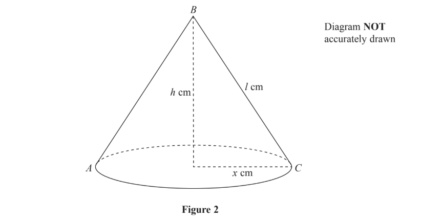
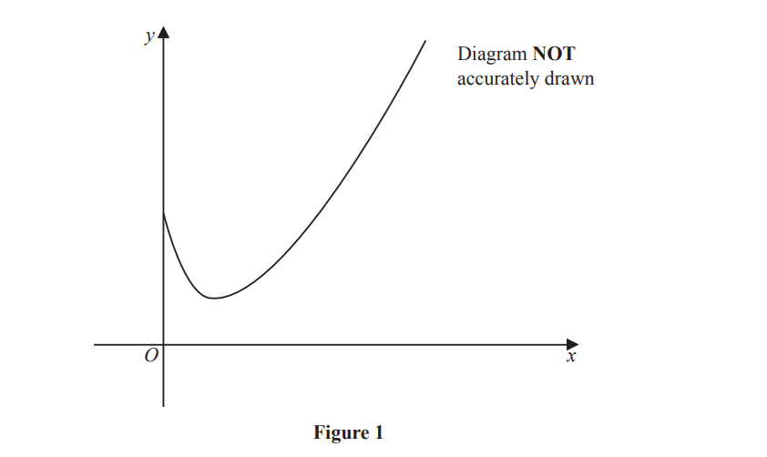
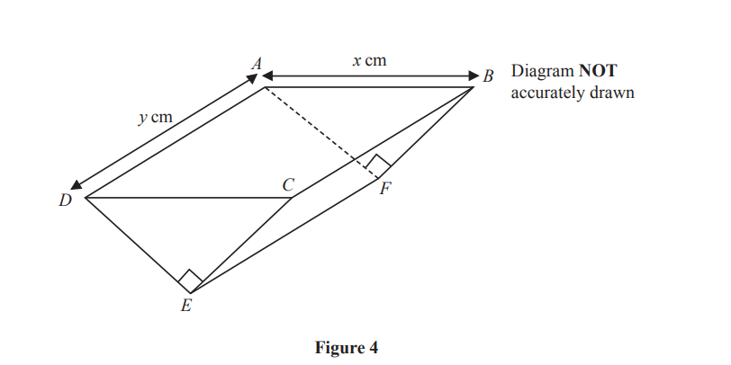
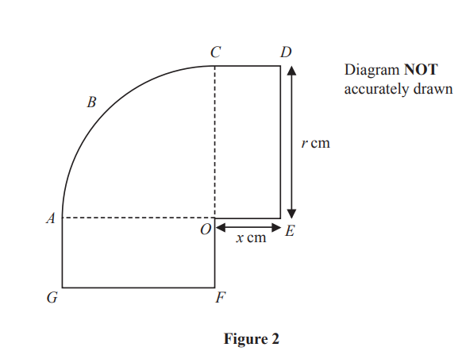
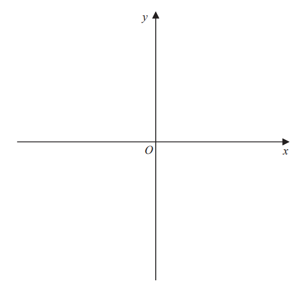
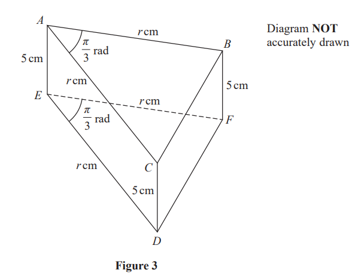
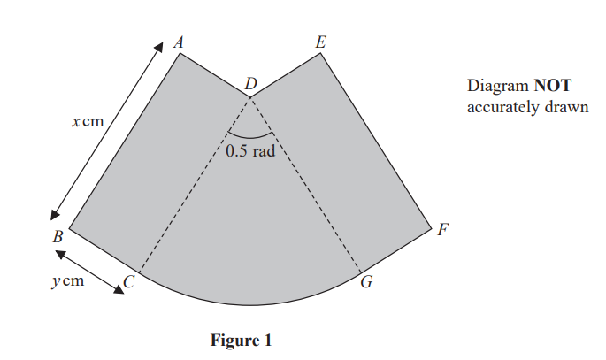

# Exam Questions — Applications of Differentiation
**Calculus** · Edexcel IGCSE Further Pure Maths (4PM1)
> Source: [https://www.savemyexams.com/igcse/further-maths/edexcel/19/topic-questions/calculus/applications-of-differentiation/exam-questions/](https://www.savemyexams.com/igcse/further-maths/edexcel/19/topic-questions/calculus/applications-of-differentiation/exam-questions/) · 22 questions · total 232 marks

## Q1 — medium — 9 marks · exam-questions

### 5((a)) — 3 marks — structured — from paper Specimen · 4PM1/01
Two numbers $x$ and $y$ are such that $2x+y=13$

The sum of the squares of $2x$ and $y$ is $S$.

Show that $S=8x^{2}--52x+169$

### 5((b)) — 4 marks — structured — from paper Specimen  · 4PM1/01
Using calculus, find the value of $x$ for which $S$ is a minimum, justifying that this value of $x$ gives a minimum value for $S$.

### 5((c)) — 2 marks — structured — from paper Specimen · 4PM1/01
Using calculus, find the minimum value of $S$.

## Q2 — medium — 18 marks · exam-questions

### 10((a)) — 5 marks — structured — from paper Specimen · Paper 2

Figure 1 shows the curve $M$ with equation $y=x^{3}--13x--12$

The point $P$, with $x$ coordinate −2, lies on $M$ and line$l_{1}$ is the tangent to  $M$  at the point $P$.

Find an equation for $l_{1}$

### 10((b)) — 4 marks — structured — from paper Specimen · Paper 2
The point $Q$ lies on $M$ and the line $l_{2}$ is the tangent to $M$ at the point $Q$.

Given that $l_{1}$ and  $l_{2}$ are parallel,

find an equation for $l_{2}$

### 10((c)) — 4 marks — structured — from paper Specimen · Paper 2
The normal to $M$ at $P$ meets $l_{2}$ at the point $R$.

Find the coordinates of $R$.

### 10((d)) — 2 marks — structured — from paper Specimen · Paper 2
Find the exact length of the line $PR$.

### 10((e)) — 3 marks — structured — from paper Specimen · Paper 2
The tangent and normal at $P$and the tangent and normal at $Q$ form a rectangle.

Find the exact area of this rectangle.

## Q3 — medium — 11 marks · exam-questions

### 11() — 11 marks — structured — from paper Specimen  · Paper 2

Figure 2 shows a right circular cone with a base radius of $x$ cm. The slant height of the cone is $l$ cm and the height of the cone is $h$ cm. The vertex of the cone is $B$ and the points $A$ and $C$, on the base of the cone, are such that $AC$ is a diameter of the base.

The cone is increasing in size in such a way that the size of the angle $ABC$ is constant at $60^{\circ}$ and the **total **surface area of the cone is increasing at a constant rate of 10 cm2 /s.

Find the exact rate of increase of the volume of the cone when $x=6$

## Q4 — medium — 5 marks · exam-questions

### 2((a)) — 3 marks — structured — from paper June 2024 · Paper 1
$f(x)=2x^{2}+4x+9$

Given that $f(x)$ can be written in the form `A open parentheses x plus B close parentheses to the power of 2 space end exponent plus space C` , where $A,B$ and  $C$ are integers,

find the value of $A$, the value of $B$and the value of $C$

### 2((b)) — 2 marks — structured — from paper June 2024 · Paper 1
$f(x)=2x^{2}+4x+9$

Given that $f(x)$ can be written in the form `A open parentheses x plus B close parentheses squared plus C` , where $A,B$ and  $C$ are integers,

(i) Hence, or otherwise, find the value of $x$ for which `fraction numerator 1 over denominator straight f open parentheses x close parentheses end fraction`is a maximum

(ii) find the maximum value of  `fraction numerator 1 over denominator straight f open parentheses x close parentheses end fraction`

## Q5 — medium — 8 marks · exam-questions

### 4() — 8 marks — structured — from paper June 2024 · Paper 1
The surface area of a sphere with radius  $r$ cm is increasing at a constant rate of  $50π$ cm2 /s

Find, in cm3 , the exact volume of the sphere at the instant when the rate of increase of $r$ is $\frac{5}{12}$ cm/s

## Q6 — medium — 13 marks · exam-questions

### 7((a)) — 1 mark — structured — from paper June 2024 · Paper 1

Figure 1 shows a sketch of part of the curve $C$ with equation

$y=\frac{x^{2}}{4}-3\sqrt{x}+8$

The point $P$ lies on $C$ and has coordinates $(4,a)$

Show that $a=6$

### 7((b)) — 6 marks — structured — from paper June 2024 · Paper 1
The line $L$is the normal to $C$ at the point $P$

Show that an equation of $L$ is $5y+4x-46=0$

### 7((c)) — 6 marks — structured — from paper June 2024 · Paper 1
The finite region $R$ is bounded by the curve $C$, the line $L$, the $x$-axis and the line with equation $x=1$

Use calculus to find the exact area of $R$

## Q7 — medium — 10 marks · exam-questions

### 8((a)) — 4 marks — structured — from paper June 2024 · Paper 2

Figure 4 shows a solid right triangular prism $ABCDEF$

The cross section of the prism is an isosceles triangle.

- `angle D E C space equals space angle A F B space equals space 90 degree`
- $AB=DC=x$ cm
- $AD=BC=FE=y$cm
- $AF=BF=DE=CE$

The triangular faces of the prism are vertical and the edges $AD,BC$ and $FE$are horizontal. 
The volume of the prism is $3.6$ cm3 
The total external surface area of the prism is $S$ cm2

Show that $S$ satisfies the equation

`S space equals space x squared over 2 plus space fraction numerator 72 open parentheses square root of 2 space plus 1 close parentheses over denominator 5 x end fraction`

### 8((b)) — 4 marks — structured — from paper June 2024 · Paper 2
Given that $x$ can vary, use calculus, to find to 3 significant figures, the value of $x$ for which $S$ is a minimum.

Justify that this value of $x$ gives a minimum value of $S$

### 8((c)) — 2 marks — structured — from paper June 2024 · Paper 2
Hence find, to 2 significant figures, the minimum value of $S$

## Q8 — medium — 11 marks · exam-questions

### 7((a)) — 4 marks — structured — from paper November 2024 · Paper 1

Figure 2 shows a shape $ABCDEOFG$

$ABCO$ is a quarter circle with radius $r$ cm 
$CDEO$ and $AOFG$are congruent rectangles of length  $r$ cm and width $x$cm

The total area of the shape is 100cm2 
The perimeter of the shape is $P$ cm

Show that $P=\frac{200}{r}+2r$

### 7((b)) — 5 marks — structured — from paper Novemer 2024 · Paper 1
Use calculus to find the value of $r$ for which $P$ is a minimum, justifying that this value of $r$ gives a minimum value of $P$

### 7((c)) — 2 marks — structured — from paper November 2024 · Paper 1
Find the minimum value of $P$

## Q9 — medium — 18 marks · exam-questions

### 10((a)) — 4 marks — structured — from paper November 2024 · Paper 1
`straight f open parentheses x close parentheses equals 3 minus 4 x minus 9 x squared`

Given that `straight f open parentheses x close parentheses`can be expressed in the form `A minus B open parentheses x plus C close parentheses squared` where $A$, $B$ and $C$ are positive constants

find the value of $A$, the value of $B$and the value of $C$

### 10((b)) — 1 mark — structured — from paper November 2024 · Paper 1
`straight f open parentheses x close parentheses equals 3 minus 4 x minus 9 x squared`

Given that `straight f open parentheses x close parentheses`can be expressed in the form `A minus B open parentheses x plus C close parentheses squared` where $A$, $B$ and $C$ are positive constants

Hence write down the maximum value of `straight f open parentheses x close parentheses`

### 10((c)) — 6 marks — structured — from paper November 2024 · Paper 1
The equation `straight f open parentheses x close parentheses equals 0` has roots $α$ and $β$

Without solving the equation `straight f open parentheses x close parentheses equals 0`, form a quadratic equation, with integer coefficients, that has roots $\frac{3α}{β}$ and  $\frac{3β}{α}$

### 10((d)) — 1 mark — structured — from paper November 2024 · Paper 1
Show that $(x+y)^{3}=x^{3}+y^{3}+3xy(x+y)$

### 10((e)) — 6 marks — structured — from paper November 2024 · Paper 1
`g open parentheses x close parentheses equals 3 x squared plus q x plus r`    where $q$and  $r$ are constants

The equation $g(x)=0$ has roots $α^{2}-β$ and  $β^{2}-α$ where $α$ and  $β$are the roots of the equation `straight f open parentheses x close parentheses equals 0`

Using your answer to part (d), find in simplified exact form, the value of $q$ and the value of $r$

## Q10 — medium — 5 marks · exam-questions

### 5() — 5 marks — structured — from paper November 2024 · Paper 2
The height of liquid in a vessel $P$ is $h$ 
The volume, $V$, of the liquid in $P$ is given by $V=6h^{3}$ 
Liquid is leaking from $P$ at a constant rate of $36\mathrm{cm}^{3}/s$

Find the exact rate of change, in cm/s, of $h$ when $V=384\mathrm{cm}^{3}$

## Q11 — medium — 18 marks · exam-questions

### 10((a)) — 2 marks — structured — from paper November 2024 · Paper 2
A curve $C$ has equation

$y=\frac{5x-2}{3x+2}x\neq\frac{2}{3}$

Find the coordinates of the point where $C$ intersects the

(i) $x$-axis

[1]

(ii) $y$-axis

[1]

### 10((b)) — 2 marks — structured — from paper November 2024 · Paper 2
A curve $C$ has equation

$y=\frac{5x-2}{3x+2}x\neq\frac{2}{3}$

Write down an equation of the asymptote to $C$ that is

(i) parallel to the $x$-axis

[1]

(ii) parallel to the $y$-axis

[1]

### 10((c)) — 3 marks — structured — from paper November 2024 · Paper 2
Sketch  $C$ on the opposite page. 
Show and label the asymptotes and the coordinates of the points where  $C$ crosses the coordinate axes.

### 10((d)) — 11 marks — structured — from paper November 2024 · Paper 2
Point $A$ lies on $C$ such that the gradient of $C$ at  $A$is parallel to the line with equation $4y-x-7$

The normal to $C$ at  $A$intersects the $x$-axis at point $D$and the $y$-axis at point $E$ 
Given that the  $x$ coordinate of  $A$ is positive,

find, in its simplified form, the exact length of line $DE$

## Q12 — medium — 11 marks · exam-questions

### 5((a)) — 4 marks — structured — from paper June 2023 · Paper 1
A solid cuboid has width $x$ cm, length 4$x$ cm and height $h$cm. 
The volume of the cuboid is 75cm3 and the surface area of the cuboid is $S\mathrm{cm}^{2}$

Show that  $S=8x^{2}+\frac{375}{2x}$

### 5((b)) — 5 marks — structured — from paper June 2023 · Paper 1
Given that $x$can vary, using calculus,

(i) find to 3 significant figures, the value of  $x$ for which $S$ is a minimum,

(ii) justify that this value of  $x$ gives a minimum value of $S$

### 5((c)) — 2 marks — structured — from paper June 2023 · Paper 1
Find, to 3 significant figures, the minimum value of $S$

## Q13 — medium — 10 marks · exam-questions

### 7((a)) — 7 marks — structured — from paper June 2023 · Paper 1
The equation of a curve is  $y=\sqrt{\frac{e^{4x}}{2x-3}}$

When $x$ is increased to $(x+δx)$, $y$ increases to $(y+δy)$ where $δx$ and $δy$ are small.

Show that   $δy\approx\frac{e^{2x}(4x-7)}{(2x-3)^{\frac{3}{2}}}δx$

### 7((b)) — 3 marks — structured — from paper June 2023 · Paper 1
The equation of a curve is  $y=\sqrt{\frac{e^{4x}}{2x-3}}$

When $x$ is increased to $(x+δx)$, $y$ increases to $(y+δy)$ where $δx$ and $δy$ are small.

Given that $x$= 2.5

find an estimate, to 2 significant figures, of the value of $δy$ when the value of $x$ increases by 0.2%

## Q14 — medium — 6 marks · exam-questions

### 6((a)) — 1 mark — structured — from paper June 2023 · Paper 2

Figure 3 shows a right triangular prism $ABCDEF$. A cross section $ABC$ of the prism is a triangle in which $AB=AC=r\mathrm{cm}$ and `angle C A B equals pi over italic 3`radians.

In the prism

$AE=BF=CD=5\text{cm}ED=EF=r\text{cm}$ and `angle D E F equals pi over italic 3` radians.

Show that the volume of the prism is $\frac{5\sqrt{3}}{4}r^{2}\text{cm}^{3}$

### 6((b)) — 5 marks — structured — from paper June 2023 · Paper 2

Figure 3 shows a right triangular prism $ABCDEF$. A cross section $ABC$ of the prism is a triangle in which $AB=AC=r\mathrm{cm}$ and `angle C A B equals pi over italic 3`radians.

The volume of the prism is increasing in such a way that the size of `angle C A B` and the size of `angle D E F` remain constant and the length of $AE$, the length of $BF$ and the length of $CD$ remain constant. 
The lengths of $AB,AC,ED$ and $EF$ are each increasing at a constant rate of 0.2cm / s

Find the exact rate of increase, in cm3 / s, of the volume of the prism when the area of the rectangular face $BCDF$ is 60 cm2

## Q15 — medium — 7 marks · exam-questions

### 2((a)) — 3 marks — structured — from paper November 2023 · Paper 1
$g(x)=2x^{2}+\frac{1}{2}x-3$

Express `straight g open parentheses x close parentheses` in the form `p open parentheses x plus q close parentheses squared` where $p$, $q$ and $r$ are rational numbers to be found.

### 2((b)) — 2 marks — structured — from paper November 2023 · Paper 1
Find

(i) the minimum value of `straight g open parentheses x close parentheses`

(ii) the value of $x$at which this minimum occurs.

### 2((c)) — 2 marks — structured — from paper November 2023 · Paper 1
$h(x)=2x^{6}+\frac{1}{2}x^{3}-3$

Hence, or otherwise, write down

(i) the minimum value of `straight h open parentheses x close parentheses`

(ii) the value of $x$ at which this minimum occurs.

## Q16 — medium — 15 marks · exam-questions

### 5((a)) — 3 marks — structured — from paper November 2023 · Paper 2

Figure 1 shows part of the curve $S$ with equation  $y=px^{2}+qx+r$ 
where $p$, $q$ and $r$ are constants.

The points $A$, $B$ and $P$ with coordinates (– 2, 0), (6, 0) and (4, – 6) respectively lie on $S$

Show that an equation of $S$ is $y=\frac{x^{2}}{2}-2x-6$

### 5((b)) — 5 marks — structured — from paper November 2023 · Paper 2

Figure 1 shows part of the curve $S$ with equation  $y=px^{2}+qx+r$ 
where $p$, $q$ and $r$ are constants.

The line $l$ is the normal to $S$ at the point $P$

Show that an equation of $l$ is $2y+x+8=0$

### 5((c)) — 7 marks — structured — from paper November 2023 · Paper 2

Figure 1 shows part of the curve $S$ with equation  $y=px^{2}+qx+r$ 
where $p$, $q$ and $r$ are constants.

The finite region shown shaded in Figure 1 is bounded by $S$ and  $l$

Use algebraic integration to find the exact area of the shaded region.

## Q17 — medium — 7 marks · exam-questions

### 6() — 7 marks — structured — from paper November 2023 · Paper 2
The volume of oil in a container is $V$ cm3 when the height of the oil is $h$ cm. 
Oil is pouring into the container at a constant rate of 12 cm3 /s. 
Given that $V=3h^{3}$

find the exact rate, in cm/s, at which the height of the oil is increasing when $V=1536\mathrm{cm}^{3}$

## Q18 — medium — 9 marks · exam-questions

### 7((a)) — 2 marks — structured — from paper November 2023 · Paper 2
Two numbers $x$ and $y$ are such that $3x-y=4$

$S=5x^{3}+y^{2}$

Show that  $S=5x^{3}+9x^{2}-24x+16$

### 7((b)) — 5 marks — structured — from paper November 2023 · Paper 2
Given that $x$ can vary,

use calculus to find the value of $x$for which $S$ is a minimum, justifying that this value of $x$ gives a minimum value of $S$

### 7((c)) — 2 marks — structured — from paper November 2023 · Paper 2
Find the minimum value of $S$

## Q19 — medium — 13 marks · exam-questions

### 8((a)) — 5 marks — structured — from paper January 2023 · Paper 1

Figure 1 shows a badge, shown shaded, made from two identical rectangles, $ABCD$ and $DEFG$, and a sector $DCG$ of a circle with centre $D$.

Each rectangle measures  $x$ cm by $y$ cm.
The radius of the sector is  $x$ cm and the angle $CDG$ is 0.5 radians.

The area of the badge is 50 cm2
The perimeter of the badge is $P$ cm.

Show that

$P=2x+\frac{100}{x}$

### 8((b)) — 6 marks — structured — from paper January 2023 · Paper 1
Given that $x$ can vary,

use calculus, to find the exact value of  $x$  for which $P$ is a minimum. 
Justify that this value of $x$ gives a minimum value for $P$

### 8((c)) — 2 marks — structured — from paper January 2023 · Paper 1
Find the minimum value of $P$
Give your answer in the form $k\sqrt{2}$, where $k$ is an integer to be found.

## Q20 — medium — 7 marks · exam-questions

### 4() — 7 marks — structured — from paper January 2023 · Paper 2
The equation of a curve is $y=x^{3}\mathrm{sin}x$

Find an equation of the tangent to the curve at the point on the curve where  $x=\frac{1}{2}π$

Give your answer in the form  $y=mx+c$

## Q21 — medium — 7 marks · exam-questions

### 9() — 7 marks — structured — from paper January 2023 · Paper 2
A cube has edges of length $x$ cm.

The total surface area, $A\mathrm{cm}^{2}$ , of the cube is increasing at a constant rate of 0.45cm2 /s

Find the rate of increase, in cm3 /s, of the volume of the cube at the instant when the total surface area of the cube is 384cm2

## Q22 — medium — 14 marks · exam-questions

### 11((a)) — 3 marks — structured — from paper January 2023 · Paper 2

Figure 3 shows part of the curve $C$ with equation  $y=4-e^{2x}$
The curve $C$ crosses the $y$-axis at the point $A$and the $x$-axis at the point $B$.

(i) Write down the $y$ coordinate of point $A$.

[1]

(ii) Show that the $x$ coordinate of $B$ is $x=\mathrm{ln}2$

[2]

### 11((b)) — 4 marks — structured — from paper January 2023 · Paper 2
The line  $l$ is the normal to $C$ at the point $B$.

Find an equation for $l$ , giving your answer in the form $y=mx+c$

### 11((c)) — 7 marks — structured — from paper January 2023 · Paper 2
The finite region $R$ is bounded by $C$, $l$ and the $y$-axis.

Using calculus, find the area of $R$.
Give your answer to one decimal place.
