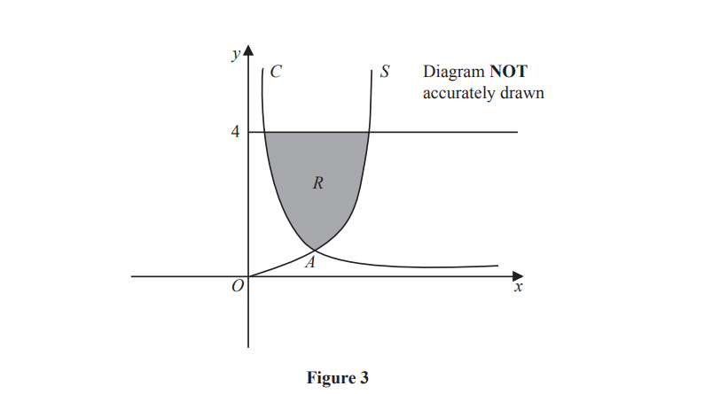
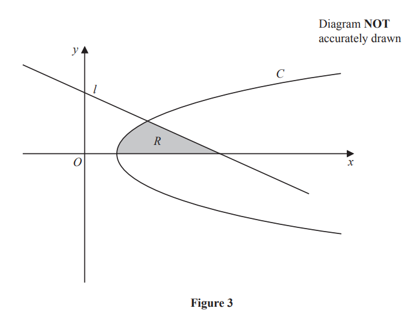
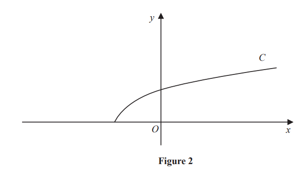
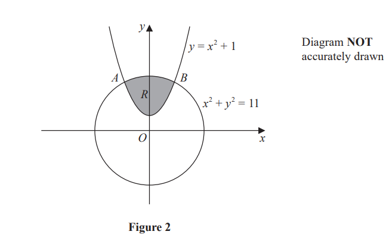
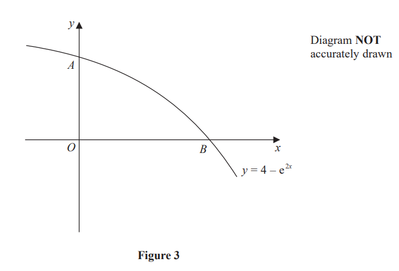

# Exam Questions — Applications of Integration
**Calculus** · Edexcel IGCSE Further Pure Maths (4PM1)
> Source: [https://www.savemyexams.com/igcse/further-maths/edexcel/19/topic-questions/calculus/applications-of-integration/exam-questions/](https://www.savemyexams.com/igcse/further-maths/edexcel/19/topic-questions/calculus/applications-of-integration/exam-questions/) · 13 questions · total 134 marks

## Q1 — medium — 5 marks · exam-questions

### 11((b)) — 5 marks — structured — from paper Specimen · 4PM1/01
`straight f open parentheses x close parentheses equals 2 x cubed minus 13 x squared plus 12 x plus 27`

Figure 3 shows a sketch of the curve with equation `y equals straight f open parentheses x close parentheses`, which passes through the points with coordinates `\left(-1 , 0\right)`, `\left(b , 0\right)` and `\left(a , 0\right)` where $0 < b < a$.

Given that $b = 3$ and $a = \frac{9}{2}$, use algebraic integration to determine the exact value of the total area of the shaded regions shown in Figure 3.

## Q2 — medium — 7 marks · exam-questions

### 5((a)) — 2 marks — structured — from paper Specimen · Paper 2
Show that $\mathrm{cos}(A--B)--\mathrm{cos}(A+B)=2\mathrm{sin}A\mathrm{sin}B$

### 5((b)) — 1 mark — structured — from paper Specimen  · Paper 2
Hence express $2\mathrm{sin}5x\mathrm{sin}3x$ in the form  $\mathrm{cos}mx--\mathrm{cos}nx$where $m$ and  $n$ are integers, giving the value of $m$ and the value of $n$,

### 5((c)) — 4 marks — structured — from paper Specimen · Paper 2
(i) Find `integral 4 sin space 5 theta space sin 3 theta space straight d theta`

(ii) Hence evaluate `integral subscript 0 superscript straight pi over 6 end superscript 4 sin space 5 theta space sin 3 theta space straight d theta`, giving your answer in the form  $\frac{a\sqrt{b}}{c}$ where $a$, $b$ and  $c$ are integers.

## Q3 — medium — 13 marks · exam-questions

### 9((a)) — 3 marks — structured — from paper Specimen · Paper 2
$f(x)=7+4x--2x^{2}$

Given that $f(x)$ can be written in the form $P(x+Q)^{2}+R$ where $P,Q$ and $R$ are constants,

find the value of $P$, the value of $Q$and the value of $R$.

### 9((b)) — 2 marks — structured — from paper Specimen · Paper 2
(i) Hence write down the maximum value of $f(x)$,

(ii) Write down the value of $x$ for which this maximum occurs.

### 9((c)) — 3 marks — structured — from paper Specimen · Paper 2
The curve $C$ has equation $y=7+4x--2x^{2}$

The line $l$ with equation $y=4--x$ intersects $C$ at two points.

Find the $x$ coordinates of these two points.

### 9((d)) — 5 marks — structured — from paper Specimen · Paper 2
The finite region bounded by the curve $C$ and the line $l$ is rotated $360^{\circ}$ about the $x$-axis.

Use algebraic integration to find, to 3 significant figures, the volume of the solid generated.

## Q4 — medium — 10 marks · exam-questions

### 6((a)) — 3 marks — structured — from paper June 2024 · Paper 2

Figure 3 shows part of the curve $C$ with equation $y=\frac{1}{4x},x>0$ and part of the curve $S$ with equation `y space equals space 2 x squared space comma space x space greater-than or slanted equal to space 0`

The curve $C$ and the curve $S$ intersect at the point $A$

Find the coordinates of point $A$

### 6((b)) — 7 marks — structured — from paper June 2024 · Paper 2
The finite region $R$ , shown shaded in Figure 3, bounded by the curve $C$, the curve  $S$ and the straight line  $y=4$ is rotated through 360º about the $y$-axis.

Find, using algebraic integration, the exact volume of the solid formed.

## Q5 — medium — 10 marks · exam-questions

### 9() — 10 marks — structured — from paper November 2024 · Paper 1

Figure 3 shows part of the curve $C$ with equation $y^{2}=x-1$and part of the line $l$ with equation $2y+x-4=0$

The region $R$, bounded by the $x$-axis, the curve $C$ and the line $l$, is rotated through 360° about the $x$-axis.

Using algebraic integration, find the exact value of the volume of the solid generated.

## Q6 — medium — 14 marks · exam-questions

### 9((a)) — 2 marks — structured — from paper November 2024 · Paper 2
Using a [formula](https://cdn.savemyexams.com/uploads/2026/02/33569-EDX%20IGCSE%20Further%20Pure%20Maths%20Formulae%20Sheet.pdf), show that

$\mathrm{cos}2θ=2\mathrm{cos}^{2}θ-1$

### 9((b)) — 4 marks — structured — from paper November 2024 · Paper 2
Using a [formula](https://cdn.savemyexams.com/uploads/2026/02/33569-EDX%20IGCSE%20Further%20Pure%20Maths%20Formulae%20Sheet.pdf), show that

$\mathrm{cos}2θ=2\mathrm{cos}^{2}θ-1$

Hence show that

`integral subscript pi over 3 end subscript superscript fraction numerator 3 pi over denominator 4 end fraction end superscript open parentheses 2 space cos to the power of 2 space end exponent theta minus 1 close parentheses   d theta equals negative fraction numerator a plus square root of b over denominator c end fraction`

where $a$, $b$ and $c$ are integers to be found.

### 9((c)) — 8 marks — structured — from paper November 2024 · Paper 2

Figure 3 shows part of the curve $C_{1}$ with equation $y=2\mathrm{cos}^{2}θ-1$and part of the curve $C_{2}$ with equation $y=-\mathrm{cos}θ$

Point $B$ is the intersection of  $C_{1}$ and $C_{2}$ as shown in Figure 3

Point $A$`open parentheses fraction numerator 3 straight pi over denominator 4 end fraction comma 0 close parentheses` is the intersection of  $C_{1}$ with the $θ$-axis as shown in Figure 3

Point $E$ `open parentheses pi over 2 comma 0 close parentheses` is the intersection of  $C_{2}$ with the $θ$-axis as shown in Figure 3

The finite region $R$, shown shaded in Figure 3, is bounded by the $θ$-axis, $C_{1}$ and $C_{2}$

Use calculus to find, in its simplest form, the exact area of  $R$

## Q7 — medium — 14 marks · exam-questions

### 11((a)) — 4 marks — structured — from paper June 2023 · Paper 1
$f(x)=10+6x-x^{2}$

Given that `straight f open parentheses x close parentheses` can be written in the form $A(x+B)^{2}+C$ where $A$,$B$ and $C$ are constants,

find the value of  $A$, the value of $B$ and the value of $C$

### 11((b)) — 2 marks — structured — from paper June 2023 · Paper 1
$f(x)=10+6x-x^{2}$

Given that `straight f open parentheses x close parentheses` can be written in the form $A(x+B)^{2}+C$ where $A$,$B$ and $C$ are constants,

Hence, or otherwise, find

(i) the value of $x$ for which `straight f open parentheses x close parentheses` has its greatest value

(ii) the greatest value of `straight f open parentheses x close parentheses`

### 11((c)) — 3 marks — structured — from paper June 2023 · Paper 1
The curve $C$ has equation $y=f(x)$

The curve $S$ with equation  $y=x^{2}-x+13$ intersects curve  $C$ at two points.

Find the $x$ coordinate of each of these two points.

### 11((d)) — 5 marks — structured — from paper June 2023 · Paper 1
$f(x)=10+6x-x^{2}$

Given that `straight f open parentheses x close parentheses` can be written in the form $A(x+B)^{2}+C$ where $A$,$B$ and $C$ are constants,

The curve $C$ has equation $y=f(x)$

The curve $S$ with equation  $y=x^{2}-x+13$ intersects curve  $C$ at two points.

Use algebraic integration to find the exact area of the finite region bounded by the curve $C$ and the curve $S$

## Q8 — medium — 8 marks · exam-questions

### 4((a)) — 4 marks — structured — from paper June 2023 · Paper 2

The curve $S$ with equation $y=\frac{x^{2}}{4}+2$ where `x greater-than or slanted equal to 0` and the line $l$ with equation $2y-x-4=0$ where  `x greater-than or slanted equal to 0` intersect at the points $A$and $B$, as shown in Figure 2.

(i) Show that the coordinates of point $A$ are (0, 2)

(ii) Find the coordinates of the point $B$

### 4((b)) — 4 marks — structured — from paper June 2023 · Paper 2
The finite region bounded by $S$ and $l$, shown shaded in Figure 2, is rotated through $2π$ radians about the $y$-axis.

Use algebraic integration to find the volume of the solid generated. 
Give your answer in terms of $π$

## Q9 — medium — 11 marks · exam-questions

### 7((a)) — 3 marks — structured — from paper June 2023 · Paper 2
Expand `open parentheses 1 plus x over 3 close parentheses to the power of negative 3 end exponent`  in ascending powers of $x$ up to and including the term in $x^{3}$

Where appropriate express each coefficient as an exact fraction in its lowest terms.

### 7((b)) — 1 mark — structured — from paper June 2023 · Paper 2
Write down the range of values of $x$ for which your expression is valid.

### 7((c)) — 2 marks — structured — from paper June 2023 · Paper 2
Express `open parentheses 3 plus x close parentheses to the power of negative 3 end exponent` in the form `P space open parentheses 1 plus Q x close parentheses to the power of negative 3 end exponent` where $P$ and $Q$ are rational numbers whose values should be stated.

### 7((d)) — 2 marks — structured — from paper June 2023 · Paper 2
$f(x)=\frac{1+4x}{(3+x)^{3}}$

Obtain a series expansion for `straight f open parentheses x close parentheses` in ascending powers of $x$ up to and including the term in $x^{2}$

### 7((e)) — 3 marks — structured — from paper June 2023 · Paper 2
$f(x)=\frac{1+4x}{(3+x)^{3}}$

Hence, using algebraic integration, obtain an estimate of `integral subscript 0 superscript 0.2 end superscript straight f left parenthesis x right parenthesis   straight d x`

Give your answer to 5 significant figures.

## Q10 — medium — 8 marks · exam-questions

### 5() — 8 marks — structured — from paper November 2023 · Paper 1

Figure 2 shows the graph of part of the curve $C$ with equation $y=\sqrt{2x+6}$
The finite region enclosed by the curve $C$ and the straight line with equation $3y-x=3$ is rotated through 360° about the $x$-axis.

Use algebraic integration to find the exact volume of the solid generated. 
Give your answer in terms of $π$

## Q11 — medium — 11 marks · exam-questions

### 9((a)) — 3 marks — structured — from paper November 2023 · Paper 1
Expand $(1-8x^{2})^{-\frac{1}{2}}$  in ascending powers of $x$, up to and including the term in $x^{6}$ giving each coefficient as an integer.

### 9((b)) — 4 marks — structured — from paper November 2023 · Paper 1
$g(x)=\frac{a+bx}{\sqrt{1-8x^{2}}}$  where $a$ and $b$ are prime numbers

Given that the fourth and fifth terms, in ascending powers of $x$, in the series expansion of `straight g open parentheses x close parentheses` are 20$x^{3}$and 48$x^{4}$ respectively,

find the value of $a$ and the value of $b$

### 9((c)) — 4 marks — structured — from paper November 2023 · Paper 1
Using the first five terms, in ascending powers of $x$, in the series expansion of `straight g open parentheses x close parentheses`

obtain an estimate, to 4 significant figures, of `integral subscript 0 superscript 0.2 end superscript straight g left parenthesis x right parenthesis   straight d x`

## Q12 — medium — 9 marks · exam-questions

### 10((a)) — 4 marks — structured — from paper January 2023 · Paper 1

The region $R$, shown shaded in Figure 2, is bounded by the curve with equation $y=x^{2}+1$and the curve with equation $x^{2}+y^{2}=11$

The two curves intersect at the point $A$ and at the point $B$.

Find the $x$coordinate of the point  $A$and the  $x$ coordinate of the point  $B$.

### 10((b)) — 5 marks — structured — from paper January 2023 · Paper 1
The region $R$ is rotated through 360° about the $x$‑axis.

Use algebraic integration to find the volume, to 2 decimal places, of the solid generated.

## Q13 — medium — 14 marks · exam-questions

### 11((a)) — 3 marks — structured — from paper January 2023 · Paper 2

Figure 3 shows part of the curve $C$ with equation  $y=4-e^{2x}$
The curve $C$ crosses the $y$-axis at the point $A$and the $x$-axis at the point $B$.

(i) Write down the $y$ coordinate of point $A$.

(ii) Show that the $x$ coordinate of $B$ is $x=\mathrm{ln}2$

### 11((b)) — 4 marks — structured — from paper January 2023 · Paper 2
The line  $l$ is the normal to $C$ at the point $B$.

Find an equation for $l$ , giving your answer in the form $y=mx+c$

### 11((c)) — 7 marks — structured — from paper January 2023 · Paper 2
The finite region $R$ is bounded by $C$, $l$ and the $y$-axis.

Using calculus, find the area of $R$.
Give your answer to one decimal place.
