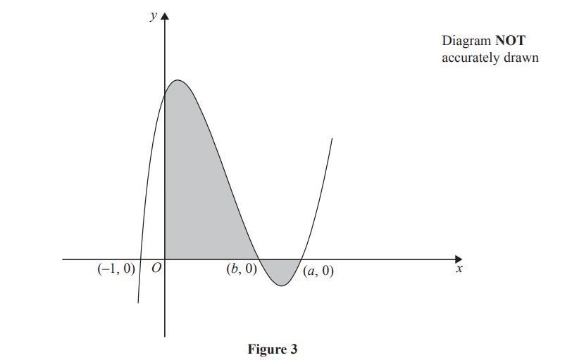

# Exam Questions — Integration
**Calculus** · Edexcel IGCSE Further Pure Maths (4PM1)
> Source: [https://www.savemyexams.com/igcse/further-maths/edexcel/19/topic-questions/calculus/integration/exam-questions/](https://www.savemyexams.com/igcse/further-maths/edexcel/19/topic-questions/calculus/integration/exam-questions/) · 5 questions · total 62 marks

## Q1 — medium — 8 marks · exam-questions

### 11((a)) — 8 marks — structured — from paper Specimen · 4PM1/01

Figure 3 shows a sketch of the curve with equation  $y=f(x)$, which passes through the points with coordinates $(-1,0),(b,0)$ and $(a,0)$ where $0<b<a.$

Given that $f'(x)=6x^{2}--26x+12$ find,

(i) the value of $a$,

(ii) the value of $b$.

## Q2 — medium — 7 marks · exam-questions

### 5((a)) — 2 marks — structured — from paper Specimen · Paper 2
Show that $\mathrm{cos}(A--B)--\mathrm{cos}(A+B)=2\mathrm{sin}A\mathrm{sin}B$

### 5((b)) — 1 mark — structured — from paper Specimen  · Paper 2
Hence express $2\mathrm{sin}5x\mathrm{sin}3x$ in the form  $\mathrm{cos}mx--\mathrm{cos}nx$where $m$ and  $n$ are integers, giving the value of $m$ and the value of $n$,

### 5((c)) — 4 marks — structured — from paper Specimen · Paper 2
(i) Find `integral 4 sin space 5 theta space sin 3 theta space straight d theta`

(ii) Hence evaluate `integral subscript 0 superscript straight pi over 6 end superscript 4 sin space 5 theta space sin 3 theta space straight d theta`, giving your answer in the form  $\frac{a\sqrt{b}}{c}$ where $a$, $b$ and  $c$ are integers.

## Q3 — medium — 16 marks · exam-questions

### 11((a)) — 4 marks — structured — from paper June 2024 · Paper 2
Using [formulae ](https://cdn.savemyexams.com/uploads/2026/02/33569-EDX%20IGCSE%20Further%20Pure%20Maths%20Formulae%20Sheet.pdf), show that

(i) $\mathrm{cos}2A=2\mathrm{cos}^{2}A-1$

(3)

(ii) $\mathrm{sin}2A=2\mathrm{sin}A\mathrm{cos}A$

(1)

### 11((b)) — 4 marks — structured — from paper June 2024 · Paper 2
Show that $\mathrm{cos}^{3}A=\frac{\mathrm{cos}3A+3\mathrm{cos}A}{4}$

### 11((c)) — 4 marks — structured — from paper June 2024 · Paper 2
Hence, or otherwise, solve, giving exact values in terms of $π$

`8 space cos cubed space open parentheses theta over 2 close parentheses space minus space 6 space cos space open parentheses theta over 2 close parentheses space minus space 1 space equals space 0`   for `0 space less-than or slanted equal to space theta space less-than or slanted equal to space 2 straight pi`

### 11((d)) — 4 marks — structured — from paper June 2024 · Paper 2
use algebraic integration to find the exact value of

`integral subscript 0 superscript straight pi over 6 end superscript open parentheses 4 space cos cubed space theta space minus space sin space 2 theta close parentheses space straight d theta`

## Q4 — medium — 14 marks · exam-questions

### 9((a)) — 2 marks — structured — from paper November 2024 · Paper 2
Using a [formula](https://cdn.savemyexams.com/uploads/2026/02/33569-EDX%20IGCSE%20Further%20Pure%20Maths%20Formulae%20Sheet.pdf), show that

$\mathrm{cos}2θ=2\mathrm{cos}^{2}θ-1$

### 9((b)) — 4 marks — structured — from paper November 2024 · Paper 2
Using a [formula](https://cdn.savemyexams.com/uploads/2026/02/33569-EDX%20IGCSE%20Further%20Pure%20Maths%20Formulae%20Sheet.pdf), show that

$\mathrm{cos}2θ=2\mathrm{cos}^{2}θ-1$

Hence show that

`integral subscript pi over 3 end subscript superscript fraction numerator 3 pi over denominator 4 end fraction end superscript open parentheses 2 space cos to the power of 2 space end exponent theta minus 1 close parentheses   d theta equals negative fraction numerator a plus square root of b over denominator c end fraction`

where $a$, $b$ and $c$ are integers to be found.

### 9((c)) — 8 marks — structured — from paper November 2024 · Paper 2

Figure 3 shows part of the curve $C_{1}$ with equation $y=2\mathrm{cos}^{2}θ-1$and part of the curve $C_{2}$ with equation $y=-\mathrm{cos}θ$

Point $B$ is the intersection of  $C_{1}$ and $C_{2}$ as shown in Figure 3

Point $A$`open parentheses fraction numerator 3 straight pi over denominator 4 end fraction comma 0 close parentheses` is the intersection of  $C_{1}$ with the $θ$-axis as shown in Figure 3

Point $E$ `open parentheses pi over 2 comma 0 close parentheses` is the intersection of  $C_{2}$ with the $θ$-axis as shown in Figure 3

The finite region $R$, shown shaded in Figure 3, is bounded by the $θ$-axis, $C_{1}$ and $C_{2}$

Use calculus to find, in its simplest form, the exact area of  $R$

## Q5 — medium — 17 marks · exam-questions

### 10((a)) — 3 marks — structured — from paper November 2023 · Paper 1
Using [formulae](https://cdn.savemyexams.com/uploads/2026/02/33569-EDX%20IGCSE%20Further%20Pure%20Maths%20Formulae%20Sheet.pdf) , show that

(i) $\mathrm{sin}2A=2\mathrm{sin}A\mathrm{cos}A$

(ii) $\mathrm{cos}2A=2\mathrm{cos}^{2}A-1$

### 10((b)) — 4 marks — structured — from paper November 2023 · Paper 1
`f open parentheses theta close parentheses equals fraction numerator 2 tan theta over denominator 1 plus tan squared theta end fraction`

Show that $f(θ)=\mathrm{sin}2θ$

### 10((c)) — 6 marks — structured — from paper November 2023 · Paper 1
Solve, in radians to 3 significant figures, for `negative pi over 2 less-than or slanted equal to x less-than or slanted equal to pi over 2`, the equation

`5 space tan open parentheses x plus pi over 6 close parentheses equals open square brackets 1 plus tan squared open parentheses x plus pi over 6 close parentheses close square brackets open square brackets 1 minus 2 space cos squared open parentheses x plus pi over 6 close parentheses close square brackets`

### 10((d)) — 4 marks — structured — from paper November 2023 · Paper 1
Using calculus, find the exact value of

`integral subscript 0 superscript pi over 2 end superscript open parentheses fraction numerator 4 space tan space theta over denominator 1 plus tan squared space theta end fraction minus cos space 5 theta plus 2 close parentheses   straight d theta`
