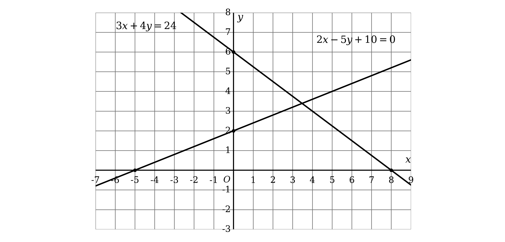
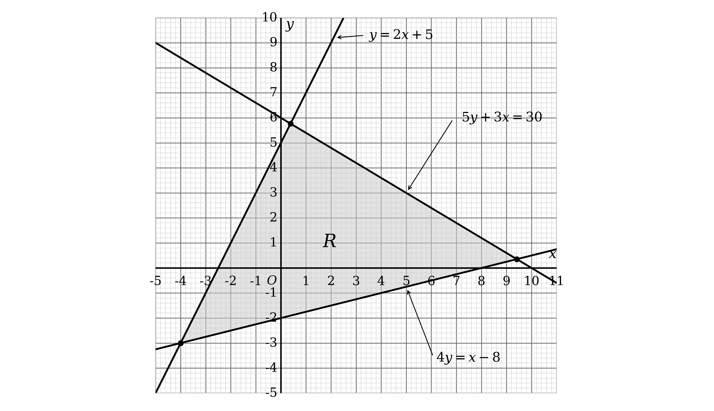
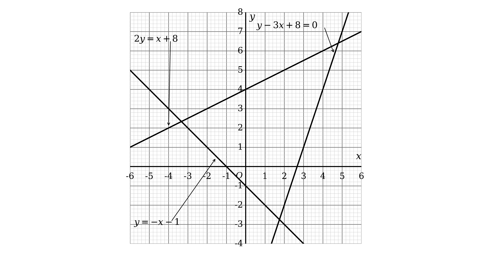

# Mark Schemes — Coordinate Geometry
**Coordinate Geometry & Graphs** · Edexcel IGCSE Further Pure Maths (4PM1)

## Q1 — medium — 2 marks · exam-questions

### 1((a)) — 2 marks
This is a sketch, so it does not have to be drawn to scale, but each line must cross the axes in the right places

Find those crossing points by substituting $x = 0$ and then $y = 0$ into each equation

**The line** $2 x + 3 y = 8$

Substitute $x = 0$

$3 y = 8$

$y = \frac{8}{3}$

Substitute $y = 0$

$2 x = 8$

$x = 4$

So this line crosses the axes at `\left(0, \frac{8}{3}\right)` and $( 4 , 0 )$

**The line** $2 y = 4 x + 1$

Substitute $x = 0$

$2 y = 1$

$y = \frac{1}{2}$

Substitute $y = 0$

$0 = 4 x + 1$

$x = - \frac{1}{4}$

So this line crosses the axes at `\left(0, \frac{1}{2}\right)` and `\left(-\frac{1}{4}, 0\right)`

Draw each line through its own pair of crossing points, and label all four coordinates

**[B1] [B1]**

> **[mark-scheme]**
> **B1**: One line correctly drawn.
> 
> **B1**: Both lines correctly drawn.
> 
> So one correct line earns one mark, and you need both of them for the second.
> 
> Both marks are for the lines themselves. A line counts as correct if it crosses the axes in the right places, so show all four crossing points clearly. The official diagram labels them as values against the axes, $y = \frac{8}{3}$, $x = 4$, $y = \frac{1}{2}$ and $x = - \frac{1}{4}$, and coordinate pairs are equally acceptable.
> 
> A sketch does not have to be to scale, so do not lose marks worrying about accuracy. What must be right is the order of the crossing points along each axis, and the sign of each gradient: $2 x + 3 y = 8$ slopes down and $2 y = 4 x + 1$ slopes up.

> **[exam-tip]**
> Rearranging into $y = m x + c$ is not the quickest route when a question gives you a line in a form like $2 x + 3 y = 8$.
> 
> - Substituting $x = 0$ and then $y = 0$ gives you the two points you need directly
> 
> A sketch still has to get the important features right, even though it is not drawn to scale.
> 
> - Keep the crossing points in the correct order along each axis
> - Give each line the correct sign of gradient
> 
> Fractional crossing points such as $- \frac{1}{4}$ are easy to lose. Draw one clearly separated from the origin even though that exaggerates the scale, so that it is obvious you have found it.

## Q2 — medium — 18 marks · exam-questions

### 10((a)) — 5 marks
$P$ lies on $M$, so start by finding its $y$ coordinate

Substitute $x = - 2$ into the equation of the curve

$y = ( - 2 )^{3} - 13 ( - 2 ) - 12$

$y = 6$

**[B1]**

So $P$ is the point $( - 2 , 6 )$

The gradient of the tangent is the gradient of the curve at that point, so differentiate

$\frac{\text{d}y}{\text{d}x} = 3 x^{2} - 13$

**[M1]**

Now substitute $x = - 2$ to get the gradient at $P$

$\frac{\text{d}y}{\text{d}x} = 3 ( - 2 )^{2} - 13$

$\frac{\text{d}y}{\text{d}x} = - 1$

**[A1]**

Use $y - y_{1} = m ( x - x_{1} )$ with the point $( - 2 , 6 )$ and gradient $- 1$

$y - 6 = - 1 ( x + 2 )$

**[M1]**

Collect the terms on one side

$y + x - 4 = 0$

**[A1]**

> **[mark-scheme]**
> **B1**: $y$ coordinate of $P$ equal to $6$.
> 
> **M1**: Differentiates to get $3 x^{2} - 13$.
> 
> **A1**: Gradient at $P$ equal to $- 1$.
> 
> **M1**: Correct method for the equation of a line through your $P$ with your gradient.
> 
> **A1**: Correct equation.
> 
> Accept the equation in any correct form, for example $y = - x + 4$ or $y + x - 4 = 0$, since no particular form is asked for.

> **[exam-tip]**
> The $y$ coordinate of $P$ carries a mark of its own, so never skip it.
> 
> - The question gives you only the $x$ coordinate, and the equation of a line needs a full point
> 
> Differentiate first, then substitute. Substituting $x = - 2$ into the equation of the curve before differentiating gives a constant, whose derivative is zero.
> 
> Take care with $( - 2 )^{2}$, which is $4$ and not $- 4$. The brackets matter, and losing them here turns the gradient into $- 25$.

### 10((b)) — 4 marks
Parallel lines have equal gradients, so $l_{2}$ also has gradient $- 1$

Set the derivative equal to $- 1$ to find every point where the curve has that gradient

$3 x^{2} - 13 = - 1$

$3 x^{2} - 12 = 0$

Divide through by $3$

$x^{2} - 4 = 0$

This is a difference of two squares

$( x - 2 ) ( x + 2 ) = 0$

$x = 2  \text{or}  - 2$

**[M1]**

$x = - 2$ is the point $P$, so $Q$ must be the other solution, $x = 2$

Find the $y$ coordinate of $Q$

$y = 2^{3} - 13 ( 2 ) - 12$

$y = - 30$

**[B1]**

Use $y - y_{1} = m ( x - x_{1} )$ with $Q ( 2 , - 30 )$ and gradient $- 1$

$y + 30 = - ( x - 2 )$

**[M1]**

$y = - x - 28$

**[A1]**

> **[mark-scheme]**
> **M1**: Sets your derivative equal to $- 1$ and solves to find $x = 2$.
> 
> **B1**: $y$ coordinate of $Q$ equal to $- 30$.
> 
> **M1**: Correct method for the equation of a line through your $Q$ with gradient $- 1$.
> 
> **A1**: Correct equation.
> 
> Accept any correct form, for example $y = - x - 28$ or $y + x + 28 = 0$.

> **[exam-tip]**
> The quadratic gives two answers, and one of them is the point you already have.
> 
> - $x = - 2$ is $P$, so it must be rejected here
> - Say which root you are discarding and why, rather than silently dropping it
> 
> That both roots appear is a useful check on your work. A cubic has exactly two points with any given gradient, and one of them was bound to be $P$, since $l_{1}$ and $l_{2}$ are parallel.
> 
> Remember that the gradient of $l_{2}$ is $- 1$ and not the negative reciprocal. Parallel means equal gradients, and it is the normal, in the next part, that needs the negative reciprocal.

### 10((c)) — 4 marks
The normal is perpendicular to the tangent, so its gradient is the negative reciprocal of $- 1$

$m = 1$

**[B1]**

Find the equation of the normal, using $P ( - 2 , 6 )$ from part (a)

$y - 6 = 1 ( x + 2 )$

$y = x + 8$

$R$ is where this normal meets $l_{2}$, so solve the two equations together

Substitute $y = x + 8$ into $y = - x - 28$

$x + 8 = - x - 28$

**[M1]**

$2 x = - 36$

$x = - 18$

**[A1]**

Substitute back into either equation to find $y$

$y = - 18 + 8$

$y = - 10$

$R = ( - 18 , - 10 )$

**[A1]**

> **[mark-scheme]**
> **B1**: Gradient of the normal equal to $1$.
> 
> **M1**: Correct method for the equation of the normal at $P$, and setting it equal to your $l_{2}$.
> 
> **A1**: $x = - 18$.
> 
> **A1**: $y = - 10$.
> 
> Allow follow-through from your equations in parts (a) and (b).

> **[exam-tip]**
> The negative reciprocal of $- 1$ is $1$, which looks too simple to be right but is.
> 
> - Turn $- 1$ into $- \frac{1}{1}$ if it helps, then flip and change the sign
> - Tangent and normal at the same point always have gradients multiplying to $- 1$, so check that $- 1 \times 1 = - 1$
> 
> The normal here is at $P$, but the line it meets is the tangent at $Q$. Read carefully which line belongs to which point, since mixing them up is the main way marks are lost in this part.

### 10((d)) — 2 marks
Use the distance formula with $P ( - 2 , 6 )$ from part (a) and $R ( - 18 , - 10 )$ from part (c)

$P R = \sqrt{(-18-(-2))^{2}+(-10-6)^{2}}$

$P R = \sqrt{(-16)^{2}+(-16)^{2}}$

$P R = \sqrt{512}$

**[M1]**

The question asks for the exact length, so simplify the surd instead of rounding

Look for the largest square factor: $512 = 256 \times 2$

$P R = 16 \sqrt{2}$

**[A1]**

> **[mark-scheme]**
> **M1**: Correct method for the length using your coordinates of $P$ and $R$.
> 
> **A1**: Exact length $16 \sqrt{2}$.
> 
> Accept $\sqrt{512}$, since it is exact, though the simplified surd is the better answer. A rounded decimal such as $22 . 6$ does not earn the accuracy mark.
> 
> Allow follow-through from your coordinates of $R$.

> **[exam-tip]**
> Squaring removes the sign, so a subtraction the wrong way round still gives the right length.
> 
> - $( - 16 )^{2}$ and $16^{2}$ are both $256$, so do not worry about the order of the coordinates here
> 
> Both differences being $16$ is a hint worth noticing. It means $P R$ runs at $45$ degrees, which fits a line of gradient $1$, and that is a quick check that you used the normal rather than the tangent.
> 
> Keep $16\sqrt{2}$ rather than converting it, because part (e) multiplies it by another surd and the twos cancel neatly.

### 10((e)) — 3 marks
The two tangents are parallel to each other and the two normals are parallel to each other

Every normal is perpendicular to every tangent, which is what makes the four lines a rectangle

$P$, $R$ and $Q$ are three of its corners

$P R$ runs along the normal at $P$ and $R Q$ runs along $l_{2}$, so they are two adjacent sides meeting at right angles at $R$

Part (d) gives $P R = 16 \sqrt{2}$, so only $R Q$ is still needed

Use the distance formula with $R ( - 18 , - 10 )$ and $Q ( 2 , - 30 )$

$R Q = \sqrt{(-18-2)^{2}+(-10-(-30))^{2}}$

$R Q = \sqrt{400+400}$

$R Q = 20 \sqrt{2}$

**[M1]**

The area of a rectangle is the product of two adjacent sides

$\text{Area} = 16 \sqrt{2} \times 20 \sqrt{2}$

**[M1]**

Multiply the whole numbers, then use $\sqrt{2} \times \sqrt{2} = 2$

$\text{Area} = 640$

**[A1]**

> **[mark-scheme]**
> **M1**: Correct method for the length $R Q$, giving $20 \sqrt{2}$.
> 
> **M1**: Multiplies two adjacent sides of the rectangle.
> 
> **A1**: Area equal to $640$.
> 
> Allow follow-through from your lengths throughout.
> 
> Finding the fourth vertex and using a coordinate area formula is equally acceptable. There the first mark is for the equation of the normal at $Q$, which is $y = x - 32$, together with the fourth vertex at $( 18 , - 14 )$, and the remaining two marks are for applying the formula to your four vertices and reaching $640$.

> **[exam-tip]**
> You already have three corners of the rectangle, so there is no need to find the fourth.
> 
> - $P$, $R$ and $Q$ give two adjacent sides, and two adjacent sides are all an area needs
> - $P R$ is done in part (d), so this part is really one distance calculation and one multiplication
> 
> Check that the two sides really are adjacent rather than opposite. They meet at $R$, and one lies along a normal while the other lies along a tangent, so they are perpendicular.
> 
> Surds multiply more easily than they look. $16\sqrt{2}\times20\sqrt{2}$ is $320 \times 2$, and the answer is a whole number, which is a good sign you have the right pair of sides.

## Q3 — medium — 16 marks · exam-questions

### 6((a)) — 2 marks
$A C : C B = 3 : 2$ splits $A B$ into $5$ equal parts, and $A C$ is $3$ of them

So $C$ is $\frac{3}{5}$ of the way from $A$ to $B$

Find the step from $A$ to $B$ first

$B - A = ( 3 - ( - 2 ) , 12 - 2 )$

$B - A = ( 5 , 10 )$

Take $\frac{3}{5}$ of that step and add it on to $A$

`C = \left(-2 + \frac{3}{5}(5), 2 + \frac{3}{5}(10)\right)`

$C = ( 1 , 8 )$

$p=1,q=8$

**[B1] [B1]**

> **[mark-scheme]**
> **B1**: Either $p = 1$ or $q = 8$.
> 
> **B1**: Both $p = 1$ and $q = 8$.
> 
> Both marks are available from the coordinates written as $( 1 , 8 )$ or as $1 , 8$, without $p$ and $q$ being named.

> **[exam-tip]**
> A ratio of $3 : 2$ means five parts, not three and not two.
> 
> - $C$ is $\frac{3}{5}$ of the way from $A$, so work out the full step from $A$ to $B$ and take that fraction of it
> - Going $\frac{3}{5}$ of the way from $B$ instead is the commonest error, and gives the wrong point
> 
> Check the answer looks right before moving on. $C ( 1 , 8 )$ should sit closer to $B ( 3 , 12 )$ than to $A ( - 2 , 2 )$, and it does.

### 6((b)) — 4 marks
$k$ is perpendicular to $l$, so begin with the gradient of $l$

Use $A ( - 2 , 2 )$ and $B ( 3 , 12 )$

$m_{l} = \frac{12-2}{3-(-2)}$

$m_{l} = 2$

**[B1]**

The gradient of $k$ is the negative reciprocal of this

$m_{k} = - \frac{1}{2}$

**[B1]**

Now use $y - y_{1} = m ( x - x_{1} )$ with the point $C ( 1 , 8 )$ from part (a)

$y - 8 = - \frac{1}{2} ( x - 1 )$

**[M1]**

Multiply through by $2$ to clear the fraction

$2 y - 16 = - ( x - 1 )$

$2 y - 16 = - x + 1$

Collect every term on the left

$2 y + x - 17 = 0  \text{as required}$

**[A1]**

> **[mark-scheme]**
> **B1**: Gradient of $l$ equal to $2$.
> 
> **B1**: Gradient of $k$ as the negative reciprocal of your gradient of $l$.
> 
> **M1**: Correct unsimplified equation for $k$, using your $p$ and $q$ and a changed gradient.
> 
> **A1**: Equation of $k$ in the required form.
> 
> If you use $y = m x + c$, you must show a fully correct rearrangement to find $c$, which a correct value of $c$ can imply, and then write down the equation of the line.
> 
> The final mark needs completely correct working from correct values of $p$ and $q$, with no errors or omitted steps, because the answer is given in the question.
> 
> A vector method is equally acceptable. If it reaches the correct unsimplified equation with no obviously incorrect work, all four marks are available provided the equation is given in the required form.

> **[exam-tip]**
> When the answer is printed in the question, the marks are for the route rather than the destination.
> 
> - Show the gradient of $l$, the negative reciprocal, and the substitution as three separate visible steps
> - Clearing the fraction by multiplying by $2$ is the step most often skipped, and it is the one that produces the required form
> 
> The perpendicular relationship set up here is used again in part (d), where $C D$ becomes the height of a triangle. It is worth noting that as you go.

### 6((c)) — 3 marks
$D$ is where $k$ crosses the $x$-axis, so substitute $y = 0$ into the equation of $k$

$0 + x - 17 = 0$

$x = 17$

**[B1]**

So $D$ is the point $( 17 , 0 )$

Now use the distance formula with $C ( 1 , 8 )$ and $D ( 17 , 0 )$

$C D = \sqrt{(17-1)^{2}+(0-8)^{2}}$

$C D = \sqrt{256+64}$

$C D = \sqrt{320}$

**[M1]**

The question asks for the exact length, so simplify the surd rather than rounding it

Look for the largest square factor: $320 = 64 \times 5$

$C D = 8 \sqrt{5}$

**[A1]**

> **[mark-scheme]**
> **B1**: $x$-coordinate of $D$ equal to $17$.
> 
> **M1**: Correct method for the length $C D$, using your coordinates for $C$ and $D$.
> 
> **A1**: Exact length $8 \sqrt{5}$.
> 
> Accept $\sqrt{320}$ for the final mark, since it is exact, though the simplified surd is the better answer.
> 
> A decimal such as $17 . 9$ does not earn the final mark, because the question asks for the exact length.

> **[exam-tip]**
> "Exact" is an instruction to leave the surd alone.
> 
> - Never reach for the calculator and round, however tidy the decimal looks
> - Simplify by pulling out the largest square factor, so $\sqrt{320}$ becomes $\sqrt{64\times5}$ and then $8 \sqrt{5}$
> 
> Finding $D$ takes one line. Setting $y = 0$ in $2 y + x - 17 = 0$ leaves $x - 17 = 0$ straight away, so there is no need to rearrange the equation first.
> 
> Keep $8 \sqrt{5}$ to hand, because part (d) uses it as the height of a triangle.

### 6((d)) — 7 marks
Part (b) made $k$ perpendicular to $l$, and $D$ lies on $k$ while $C$ lies on both lines

Both $C$ and $X$ lie on $l$, so $C X$ runs along $l$ and $C D$ meets it at right angles

That makes $C X$ the base of triangle $D X C$ and $C D$ its perpendicular height

Use the area to find $C X$, with $C D = 8 \sqrt{5}$ from part (c)

$\frac{1}{2} \times C X \times 8 \sqrt{5} = 80$

$C X = \frac{2\times80}{8\sqrt{5}}$

$C X = 4 \sqrt{5}$

**[B1]**

Now write $C X$ a second way, using Pythagoras with $C ( 1 , 8 )$ and $X ( m , n )$

`\left(4\sqrt{5}\right)^{2} = (m - 1)^{2} + (n - 8)^{2}`

**[M1]**

$X$ also lies on $l$, so it satisfies the equation of $l$

$l$ has gradient $2$ and passes through $C ( 1 , 8 )$

$n = 2 m + 6$

**[M1]**

Substitute this into the Pythagoras equation to eliminate $n$

$80 = ( m - 1 )^{2} + ( 2 m + 6 - 8 )^{2}$

Expand both brackets

$80 = m^{2} - 2 m + 1 + 4 m^{2} - 8 m + 4$

Collect everything on one side

$5 m^{2} - 10 m - 75 = 0$

Divide through by $5$

$m^{2} - 2 m - 15 = 0$

**[M1]**

Factorise

$( m + 3 ) ( m - 5 ) = 0$

$m = - 3  \text{or}  5$

**[M1]**

You are told that $m > 0$, so reject $m = - 3$

$m = 5$

**[A1]**

Substitute back into $n = 2 m + 6$

$n = 2 ( 5 ) + 6$

$n = 16$

**[A1]**

> **[mark-scheme]**
> **B1**: Correct calculation for $C X$, simplified or not.
> 
> **M1**: Uses Pythagoras to form an equation in $m$ and $n$, following through from your $C X$ and $C D$.
> 
> **M1**: A second, unsimplified equation in $m$ and $n$ using the gradient of $l$.
> 
> **M1**: Eliminates $m$ or $n$ between your two equations to form a three-term quadratic.
> 
> **M1**: Acceptable attempt to solve your three-term quadratic.
> 
> **A1**: Either $m = 5$ or $n = 16$.
> 
> **A1**: Both $m = 5$ and $n = 16$.
> 
> The fourth mark depends on both earlier method marks, and it is judged on your unsimplified equation, so an error made while simplifying does not prevent you earning it. Errors in processing are allowed there provided a correct method of elimination is shown from two correct unsimplified equations.
> 
> The fifth mark can be implied by a correct value of $m = 5$. If your quadratic is not the correct one, the method must be shown.
> 
> Working in $x$ and $y$ rather than $m$ and $n$ is fine throughout, and the equation of $l$ may be credited here even if it was first written down in part (b).
> 
> The alternative routes reach the same place and are marked to the same pattern, with the first mark for $C X$ and the last two accuracy marks unchanged.

> **[exam-tip]**
> The hard part is seeing which length is the height, and part (b) has already told you.
> 
> - $k$ was built perpendicular to $l$, so $C D$ meets $l$ at right angles
> - Both $C$ and $X$ lie on $l$, so $C X$ is the base and $C D$ is the height, with no trigonometry needed
> 
> There is a neat check available. Every point on $l$ moves $2$ up for each $1$ across, so $( m - 1 )^{2} + ( n - 8 )^{2}$ collapses to $5 ( m - 1 )^{2}$. Setting that equal to $80$ gives $( m - 1 )^{2} = 16$, so $m - 1 = \pm 4$ and $m$ is $5$ or $- 3$, which agrees with the quadratic.
> 
> The condition $m > 0$ is in the question for a reason. A quadratic gives two points on $l$ at the right distance from $C$, one either side, and the condition is what picks between them, so say explicitly that you are rejecting $m = - 3$.

## Q4 — medium — 4 marks · exam-questions

### 1((a)) — 2 marks
To draw a straight line you need only two points, and the easiest two to find are where the line crosses the axes

**(i)**

Substitute $x = 0$ into $3 x + 4 y = 24$ to find where the line crosses the $y$-axis

$4 y = 24$

$y = 6$

Substitute $y = 0$ to find where it crosses the $x$-axis

$3 x = 24$

$x = 8$

So this line passes through $( 0 , 6 )$ and $( 8 , 0 )$

**(ii)**

Substitute $x = 0$ into $2 x - 5 y + 10 = 0$

$- 5 y + 10 = 0$

$y = 2$

Substitute $y = 0$

$2 x + 10 = 0$

$x = - 5$

So this line passes through $( 0 , 2 )$ and $( - 5 , 0 )$

Plot the two crossing points for each line, join them with a ruled line, and extend it right across the grid

**[B1] [B1]**

> **[mark-scheme]**
> **B1**: $3 x + 4 y = 24$ correctly drawn.
> 
> **B1**: $2 x - 5 y + 10 = 0$ correctly drawn.
> 
> Each line is checked by where it crosses the axes rather than by its length. Your line is long enough to earn the mark if it reaches at least two sets of integer coordinates: $( 0 , 6 )$, $( 4 , 3 )$ and $( 8 , 0 )$ lie on the first line, and $( - 5 , 0 )$, $( 0 , 2 )$ and $( 5 , 4 )$ lie on the second.
> 
> The mark is given where your intention is clear. A line that is noticeably wavy, or that misses the integer coordinates by much more than about a quarter of a square, does not earn it.

> **[exam-tip]**
> Finding the two axis crossings is almost always the quickest way to draw a line given in the form $a x + b y = c$.
> 
> - Substitute $x = 0$ to get one point, then $y = 0$ to get the other
> 
> Extend each line right across the grid rather than stopping at the two points you plotted. Later parts of a question like this one usually need the lines where they cross each other, and a line that stops short leaves you guessing.

### 1((b)) — 2 marks
Two of the four boundaries are already drawn from part (a)

The two still to add are $x = - 1$, a vertical line, and $y = 5$, a horizontal line

Now decide which side of each boundary the region lies on, by testing a point that does not lie on any of the lines

The origin is the easiest choice here

Substitute $( 0 , 0 )$ into each inequality in turn

$3 ( 0 ) + 4 ( 0 ) = 0 \leq 24$

$2 ( 0 ) - 5 ( 0 ) + 10 = 10 \geq 0$

$0 \leq 5$

$0 \geq - 1$

All four inequalities are satisfied, so $R$ is the region on the same side of every boundary as the origin

Notice that $y \leq 5$ does not actually cut the region

- The other three inequalities already hold every point of $R$ below $y = 5$, so that line does not need to be drawn

Draw $x = - 1$, then shade the region and label it $R$

$R$ is not closed off below, so the shading runs on to the bottom of the grid

**[M1] [A1]**

> **[mark-scheme]**
> **M1**: $x = - 1$ drawn.
> 
> **A1**: Correct region shaded and labelled.
> 
> You do not need to draw $y = 5$, because the other three inequalities already keep every point of $R$ below it. Your line for $x = - 1$ may be short, but it must extend at least slightly above and below the $x$-axis. Fully correct later work can imply that it was drawn.
> 
> Shading the region in or shading it out are both accepted, provided it is clear which you have done. Dotted and solid boundary lines are equally acceptable. Your shading must reach below the $x$-axis, but it does not have to run all the way to the bottom or the right of the grid, where the region is unbounded. Every point of your region must satisfy $x > - 1$ and $y < 5$.
> 
> Labelling $R$ without any shading does not earn the mark.
> 
> Allow follow-through for the region from the lines you drew in part (a), provided one has a positive gradient and a positive $y$-intercept, the other has a negative gradient and a positive $y$-intercept, and the region you shade is correct for those lines.

> **[exam-tip]**
> The origin is the fastest test point for deciding which side of a boundary to shade, provided no boundary passes through it.
> 
> - Substitute $( 0 , 0 )$ into each inequality and see whether it is satisfied
> - All four hold here, so $R$ must contain the origin, which is a quick check on your shading
> 
> Watch for an inequality that turns out not to cut the region at all.
> 
> - $y \leq 5$ is already guaranteed by the other three inequalities here, so drawing that line changes nothing
> 
> Do not stop the shading where the boundary lines happen to stop. A region with no lower boundary carries on, and the shading should show that.

## Q5 — medium — 8 marks · exam-questions

### 4((a)) — 4 marks
**(i)**

$A$ and $B$ are where the curve and the line meet, so their equations are equal there

First rearrange $2 y - x - 4 = 0$ to make $y$ the subject

$y = \frac{x+4}{2}$

Now set this equal to the equation of $S$

$\frac{x^{2}}{4} + 2 = \frac{x+4}{2}$

**[M1]**

Multiply every term by $4$ to clear the fractions

$x^{2} + 8 = 2 x + 8$

$x^{2} - 2 x = 0$

Factorise rather than using the quadratic formula, since there is no constant term

$x ( x - 2 ) = 0$

$x = 0  \text{or}  2$

**[M1]**

From the diagram, $A$ is the intersection on the $y$-axis, so it is the one with $x = 0$

Substitute $x = 0$ into either equation

$y = \frac{0^{2}}{4} + 2$

$y = 2$

$A = ( 0 , 2 )  \text{as required}$

**[A1]**

**(ii)**

$B$ is the other intersection, so use $x = 2$

$y = \frac{2+4}{2}$

$y = 3$

$B = ( 2 , 3 )$

**[A1]**

> **[mark-scheme]**
> **M1**: Correctly equates the equation of $S$ with the equation of $l$.
> 
> **M1**: Forms a quadratic and makes an acceptable attempt to solve it.
> 
> **A1**: Correct substitution of $x = 0$ to show that $A$ is $( 0 , 2 )$.
> 
> **A1**: Coordinates of $B$ as $( 2 , 3 )$.
> 
> For the second mark your quadratic must be correct. Since it has two terms only, the zero solution does not have to be written down, because it is obvious from the given diagram.
> 
> The first accuracy mark needs completely correct working, because the coordinates of $A$ are given in the question.
> 
> Coordinates may be written without brackets. If you do not label your answers (i) and (ii), the marks are still available provided the coordinates appear in the correct order, or are labelled $A$ and $B$. Where that is ambiguous and both are correct, only one accuracy mark is given, and where it is ambiguous and only one is correct, neither is.

> **[exam-tip]**
> A quadratic with no constant term factorises immediately, so reach for the formula only when you have to.
> 
> - $x^{2} - 2 x = 0$ gives $x ( x - 2 ) = 0$ in one step
> - Never divide through by $x$, as that throws away the solution $x = 0$, which here is the whole of part (i)
> 
> Use the diagram to decide which root belongs to which point. $A$ is drawn on the $y$-axis, so it must be the root $x = 0$.
> 
> Substitute back into the simpler of the two equations. The line $y = \frac{x+4}{2}$ is quicker than the curve, and either will do.

### 4((b)) — 4 marks
The rotation is about the $y$-axis, so integrate with respect to $y$ and use `V = \pi \int x^{2}\textrm{ }\text{d}y`

That means you need $x^{2}$ in terms of $y$ for each of the two boundaries

Rearrange the curve $y = \frac{x^{2}}{4} + 2$

$x^{2} = 4 y - 8$

Rearrange the line $2 y - x - 4 = 0$

$x = 2 y - 4$

$x^{2} = 4 y^{2} - 16 y + 16$

The limits are the $y$-coordinates of $A$ and $B$, so $y$ runs from $2$ to $3$

For every $y$ between those limits the curve lies further from the $y$-axis than the line, so subtract the line's integral from the curve's

`V = \pi \int_{2}^{3} \left[(4y - 8) - \left(4y^{2} - 16y + 16\right)\right]\textrm{ }\text{d}y`

**[M1]**

Simplify inside the bracket before integrating

`V = \pi \int_{2}^{3} \left(-4y^{2} + 20y - 24\right)\textrm{ }\text{d}y`

Integrate term by term, raising each power of $y$ by one

`V = \pi \left[-\frac{4y^{3}}{3} + 10y^{2} - 24y\right]_{2}^{3}`

**[M1]**

Substitute the upper limit, then subtract the lower limit

`V = \pi \left[(-36 + 90 - 72) - \left(-\frac{32}{3} + 40 - 48\right)\right]`

`V = \pi \left(-18 + \frac{56}{3}\right)`

**[M1]**

$V = \frac{2}{3} π$

**[A1]**

> **[mark-scheme]**
> **M1**: Correct statement for the volume of revolution, including $π$, with a lower limit of $2$ and your upper limit used the right way round.
> 
> **M1**: Acceptable attempt to integrate, with no power of $y$ increasing and at least two terms integrated.
> 
> **M1**: Substitutes your limits into your integrated expression the correct way round, with at least one clear substitution of each.
> 
> **A1**: $V = \frac{2}{3} π$.
> 
> The lower limit must be $2$. Neither $π$ nor the limits need to be present to earn the second mark, and $π$ need not be present for the third.
> 
> Subtracting a cone is equally acceptable, and is marked like this: the first mark is for a correct volume-of-revolution statement for the curve, including $π$, with lower limit $2$, minus the correct cone formula, and it is available even if the subtraction is the wrong way round. The remaining marks then follow the same pattern, with the cone's $- \frac{4}{3} π$ not needing to be present for the second and third. Here the curve gives $2 π$ and the cone, of radius $2$ and height $1$, gives $\frac{4}{3} π$.
> 
> For the final mark accept `0.6\dot{6}\pi` or $0 . 67 π$ or better. A negative value that is simply made positive at the end does not earn it.
> 
> If you rotate about the $x$-axis instead, the second and third method marks are still available for integrating an expression and substituting limits, but the first and the accuracy mark are not.

> **[exam-tip]**
> Rotating about the $y$-axis changes everything about the setup.
> 
> - Integrate with respect to $y$, so rearrange each equation to give $x^{2}$ in terms of $y$
> - The limits become $y$-coordinates, here $2$ and $3$, not $x$-coordinates
> 
> Decide which boundary is the outer one before you subtract. Test a value between the limits: at $y = 2 . 5$ the curve gives $x = \sqrt{2}$ and the line gives $x = 1$, so the curve is further out and its integral comes first.
> 
> A negative volume is a signal that you have subtracted the wrong way round. Go back and swap them rather than dropping the minus sign, because the mark is lost if you simply make the answer positive at the end.
> 
> Here the line makes a cone when it is rotated, so you can check the answer without integrating it: the cone has radius $2$ and height $1$, giving $\frac{4}{3} π$, and the curve alone gives $2 π$. The difference is $\frac{2}{3} π$, as required.

## Q6 — medium — 7 marks · exam-questions

### 5((a)) — 3 marks
Each of these graphs is a straight line, so two points are enough to draw it

The easiest two points to find are where the line crosses the axes

**(i)** $y = 2 x + 5$

Substitute $x = 0$

$y = 5$

Substitute $y = 0$

$0 = 2 x + 5$

$x = - 2 . 5$

So this line passes through $( 0 , 5 )$ and $( - 2 . 5 , 0 )$

**(ii)** $4 y = x - 8$

Substitute $x = 0$

$4 y = - 8$

$y = - 2$

Substitute $y = 0$

$0 = x - 8$

$x = 8$

So this line passes through $( 0 , - 2 )$ and $( 8 , 0 )$

**(iii)** $5 y + 3 x = 30$

Substitute $x = 0$

$5 y = 30$

$y = 6$

Substitute $y = 0$

$3 x = 30$

$x = 10$

So this line passes through $( 0 , 6 )$ and $( 10 , 0 )$

Draw each line through its own pair of points, extend it right across the grid, and label it with its equation

**[B1] [B1] [B1]**

> **[mark-scheme]**
> **B1**: One line correctly drawn.
> 
> **B1**: Two lines correctly drawn.
> 
> **B1**: All three lines correctly drawn.
> 
> Each line is judged by where it crosses the axes, so those crossings must be in the right places, but you are not required to mark or label them. A line drawn within tolerance of the correct positions is accepted.
> 
> Labelling each line with its equation earns nothing here, but part (b) needs it to be clear which line is which, so label them now.

> **[exam-tip]**
> Substituting $x = 0$ and then $y = 0$ gives you the two crossing points straight away, whatever form the equation is given in.
> 
> - There is no need to rearrange into $y = m x + c$ first
> 
> Rule each line right across the grid rather than stopping at the two points you plotted.
> 
> - The next two parts depend on where these lines cross one another, and a short line leaves those corners undrawn
> 
> Label each line with its equation as you draw it. It costs nothing here and it protects the mark in part (b), which is lost if the examiner cannot tell your lines apart.

### 5((b)) — 1 marks
$R$ is the region where all three inequalities hold at the same time

Take each inequality in turn and decide which side of its line the region lies on, by testing a point that is not on any of the lines

The origin is the convenient choice here

Substitute $( 0 , 0 )$ into $y \leq 2 x + 5$

$0 \leq 5$

Substitute $( 0 , 0 )$ into $4 y \geq x - 8$

$0 \geq - 8$

Substitute $( 0 , 0 )$ into $5 y + 3 x \leq 30$

$0 \leq 30$

All three are true, so $R$ lies on the same side of every line as the origin

The three lines enclose a triangle, and the origin is inside it

Shade that triangle and label it $R$

**[B1]**

> **[mark-scheme]**
> **B1**: Correct enclosed region shaded in or shaded out, or clearly labelled $R$.
> 
> Allow follow-through from the lines you drew in part (a). The mark is available provided three distinct lines have been drawn and it is clear that you have shaded the correct side of each of them.
> 
> If there is no labelling and it is not clear which line is which, the mark cannot be awarded.

> **[exam-tip]**
> One test point settles all three inequalities at once, so there is no need to test each line separately with a different point.
> 
> - Use the origin whenever it does not lie on any of the lines
> - If all the inequalities are satisfied, the region is the one containing the origin
> 
> Here the three lines enclose a triangle, so $R$ is a closed region with three corners. Those corners are exactly what part (c) needs, so mark them clearly while you have the graph in front of you.

### 5((c)) — 3 marks
$P = 2 x - 5 y$ changes steadily across $R$, so its least value is reached at one of the three corners

That means you only have to test the corners, not any point inside the region

The question says to use your graph, so read the coordinates of each corner off it

Where $y = 2 x + 5$ meets $5 y + 3 x = 30$

$( 0 . 4 , 5 . 8 )$

Where $y = 2 x + 5$ meets $4 y = x - 8$

$( - 4 , - 3 )$

Where $4 y = x - 8$ meets $5 y + 3 x = 30$

$( 9 . 4 , 0 . 4 )$

**[M1]**

Substitute each corner into $P = 2 x - 5 y$

$P = 2 ( 0 . 4 ) - 5 ( 5 . 8 )$

$P = - 28 . 2$

$P = 2 ( - 4 ) - 5 ( - 3 )$

$P = 7$

$P = 2 ( 9 . 4 ) - 5 ( 0 . 4 )$

$P = 16 . 8$

**[M1]**

The least of the three values is the one you want

$P = - 28 . 2$

**[A1]**

> **[mark-scheme]**
> **M1**: Reads at least one corner from the graph, with both coordinates within $0 . 1$ of the correct values.
> 
> **M1**: Correct substitution of one pair of coordinates into $P = 2 x - 5 y$.
> 
> **A1**: Least value $P = - 28 . 2$.
> 
> The question tells you to use your graph, so the corner coordinates have to be read off it. Work that clearly uses exact coordinates, whether found by solving the equations algebraically or taken from a graphical calculator, earns neither the first mark nor the accuracy mark, although it can still earn the second.
> 
> The second mark does not depend on the first, so a correct substitution earns it even when your coordinates fall outside the tolerance.
> 
> For the accuracy mark accept any value from $- 28 . 9$ to $- 27 . 5$, provided it follows from the coordinates you read. A value outside that range cannot be rounded into it.
> 
> If you found the awkward corners algebraically but read the integer corner $( - 4 , - 3 )$ off the graph and substituted that, you are given the benefit of the doubt for the first mark.

> **[exam-tip]**
> "Using your graph" is an instruction, not a suggestion.
> 
> - Read the corners off the graph even where you can see how to find them exactly
> - Solving the equations instead throws away two of the three marks here
> 
> An expression like $P = 2 x - 5 y$ takes its greatest and least values at a corner of the region, never strictly inside it.
> 
> - So three substitutions are always enough, however large the region
> 
> You can check your reading afterwards. The corner where $y = 2 x + 5$ meets $5 y + 3 x = 30$ is exactly `\left(\frac{5}{13}, \frac{75}{13}\right)`, which gives $P = - \frac{365}{13}$, or $- 28 . 1$ to one decimal place, comfortably inside the accepted range.

## Q7 — medium — 9 marks · exam-questions

### 4((a)) — 3 marks
$A$ lies on the line, so its coordinates must satisfy the line's equation

Substitute $x = 12$ and $y = 14$ into $3 y - 2 x - p = 0$

$3 ( 14 ) - 2 ( 12 ) - p = 0$

$42 - 24 - p = 0$

$p = 18$

**[B1]**

$B$ lies on the same line, so substitute $x = q$ and $y = 2$, using the value of $p$ you have just found

$3 ( 2 ) - 2 q - 18 = 0$

$6 - 2 q - 18 = 0$

$- 2 q = 12$

**[M1]**

$q = - 6$

**[A1]**

> **[mark-scheme]**
> **B1**: $p = 18$.
> 
> **M1**: Uses your value of $p$ with $y = 2$ to find $q$.
> 
> **A1**: $q = - 6$.
> 
> The method mark follows through from your value of $p$, so an error in the first part does not stop you earning it.

> **[exam-tip]**
> "Lies on the line" always means the same thing: the coordinates satisfy the equation.
> 
> - Substitute them straight in, rather than rearranging the line into $y = m x + c$ first
> 
> Check both answers at the end by substituting the completed point back in. Here $3 ( 2 ) - 2 ( - 6 ) - 18 = 0$, which confirms that $B ( - 6 , 2 )$ really is on the line.

### 4((b)) — 6 marks
$A X : X B = 1 : 2$ means $X$ is one third of the way along $A B$, starting from $A$

Use the section formula with $A ( 12 , 14 )$ and $B ( - 6 , 2 )$

`X = \left(\frac{1 \times (-6) + 2 \times 12}{3}, \frac{1 \times 2 + 2 \times 14}{3}\right)`

`X = \left(\frac{18}{3}, \frac{30}{3}\right)`

$X = ( 6 , 10 )$

**[B1] [B1]**

Next find the gradient of $A B$, by rearranging its equation into $y = m x + c$

From part (a) the line is $3 y - 2 x - 18 = 0$, so $y = \frac{2}{3} x + 6$

$m_{AB} = \frac{2}{3}$

**[B1]**

$L$ is perpendicular to $A B$, so its gradient is the negative reciprocal

$m_{L} = - \frac{3}{2}$

**[B1]**

Now use $y - y_{1} = m ( x - x_{1} )$ with the point $X ( 6 , 10 )$

$y - 10 = - \frac{3}{2} ( x - 6 )$

$2 y - 20 = - 3 x + 18$

**[M1]**

Collect every term on one side so the coefficients are integers

$3 x + 2 y - 38 = 0$

**[A1]**

> **[mark-scheme]**
> **B1**: One correct coordinate of $X$.
> 
> **B1**: Both correct, giving $X ( 6 , 10 )$.
> 
> **B1**: Gradient of $A B$ equal to $\frac{2}{3}$, simplified or not.
> 
> **B1**: Negative reciprocal of your gradient, which need not be simplified.
> 
> **M1**: Full correct method for the equation of $L$ using your coordinates of $X$ and your perpendicular gradient.
> 
> **A1**: Correct equation in the required form.
> 
> A correct method for finding both coordinates of $X$ using your value of $q$ earns the first two marks just as well, and any equivalent approach is accepted, for example similar triangles.
> 
> The gradient mark is given for finding or stating the gradient, and accepts the unsimplified $\frac{14-2}{12-(-6)}$. It can also be implied by a correct $- \frac{3}{2}$ used in later work. Take care though: it must be clear that your $\frac{2}{3}$ comes from the gradient and not from the given ratio.
> 
> If you use $y = m x + c$, you must go on to find the correct value of $c$ for your point and gradient. It must be clear you are using your coordinates of $X$, rather than the coordinates of $A$ or $B$.
> 
> For the final mark accept any equivalent equation in which $a$, $b$ and $c$ are integers.

> **[exam-tip]**
> A ratio of $1 : 2$ means three equal parts, not two.
> 
> - $X$ is $\frac{1}{3}$ of the way from $A$ to $B$, not halfway and not $\frac{1}{2}$ of the way
> - Check your answer by eye: $( 6 , 10 )$ should sit closer to $A ( 12 , 14 )$ than to $B ( - 6 , 2 )$, and it does
> 
> The gradient here is $\frac{2}{3}$ and the ratio is $1 : 2$. Those numbers are unrelated, and examiners are told to watch for a $\frac{2}{3}$ that has been lifted from the ratio rather than worked out from the line.
> 
> - Get the gradient from the equation of $A B$, or from $\frac{14-2}{12-(-6)}$

## Q8 — medium — 8 marks · exam-questions

### 4((a)) — 3 marks
Each of these is a straight line, so you need two points on each one

**(i)**

$y = - x - 1$

The crossing points with the axes are the easiest pair to find

Substitute $x = 0$, then $y = 0$

$y = - 1$

$x = - 1$

So this line passes through $( 0 , - 1 )$ and $( - 1 , 0 )$

**(ii)**

$y - 3 x + 8 = 0$

Rearranging gives $y = 3 x - 8$, so the $y$-intercept is $- 8$, which is off the bottom of the printed grid

- When that happens, choose two convenient values of $x$ instead and work out $y$

Substitute $x = 2$

$y = - 2$

Substitute $x = 4$

$y = 4$

So this line passes through $( 2 , - 2 )$ and $( 4 , 4 )$

**(iii)**

$2 y = x + 8$

Substitute $x = 0$

$y = 4$

Substitute $x = 4$

$y = 6$

So this line passes through $( 0 , 4 )$ and $( 4 , 6 )$

Draw each line through its own pair of points, extend it across the grid, and label it with its equation

**[B1] [B1] [B1]**

> **[mark-scheme]**
> **B1**: One line correctly drawn.
> 
> **B1**: Two lines correctly drawn.
> 
> **B1**: All three lines correctly drawn.
> 
> Each line is judged on accuracy against the points it should pass through. You do not have to mark or label those points to earn these marks.
> 
> Labelling each line with its equation earns nothing here, but it is worth doing, because part (b) needs it to be clear which line is which.

> **[exam-tip]**
> The axis crossings are usually the quickest two points, but they are not always usable.
> 
> - Here $y = 3 x - 8$ crosses the $y$-axis at $- 8$, well below the printed grid
> - Pick two convenient values of $x$ instead, and choose ones that give whole-number values of $y$
> 
> Plot a third point as a check when a line matters as much as these do. If all three points do not lie in a straight line, you have made an arithmetic slip.

### 4((b)) — 1 marks
$R$ is where all three inequalities hold at once

Test a point that is not on any of the lines to find which side of each line to shade

The origin works here

Substitute $( 0 , 0 )$ into $y \geq - x - 1$

$0 \geq - 1$

Substitute $( 0 , 0 )$ into $y \geq 3 x - 8$

$0 \geq - 8$

Substitute $( 0 , 0 )$ into $2 y \leq x + 8$

$0 \leq 8$

All three are true, so $R$ is on the same side of every line as the origin

The three lines enclose a triangle with the origin inside it

Shade that triangle and label it $R$

**[B1]**

> **[mark-scheme]**
> **B1**: Correct enclosed region shaded in or shaded out.
> 
> Allow follow-through from the lines you drew in part (a), provided those lines do enclose a region.
> 
> The letter $R$ is not required for this mark, but the region you mean must be unambiguous, so label it anyway.

> **[exam-tip]**
> One test point settles all three inequalities at once, so long as it does not lie on any of the lines.
> 
> - The origin is the easiest to substitute
> - If every inequality is satisfied, $R$ is the region containing it
> 
> The three corners of this triangle are exactly what part (c) needs. Mark them now while the graph is in front of you.

### 4((c)) — 4 marks
$P = 2 y - 3 x$ changes steadily across $R$, so its greatest and least values are both at corners

This question does not say to use your graph, so find the corners exactly by solving the equations in pairs

Where $y = - x - 1$ meets $2 y = x + 8$

$2 ( - x - 1 ) = x + 8$

$- 3 x = 10$

$x = - \frac{10}{3}$

$y = \frac{7}{3}$

Where $y = - x - 1$ meets $y = 3 x - 8$

$- x - 1 = 3 x - 8$

$4 x = 7$

$x = \frac{7}{4}$

$y = - \frac{11}{4}$

Where $y = 3 x - 8$ meets $2 y = x + 8$

$2 ( 3 x - 8 ) = x + 8$

$5 x = 24$

$x = \frac{24}{5}$

$y = \frac{32}{5}$

**[M1] [A1]**

Now work out $P = 2 y - 3 x$ at each corner in turn

`P = 2\left(\frac{7}{3}\right) - 3\left(-\frac{10}{3}\right)`

$P = \frac{44}{3}$

`P = 2\left(-\frac{11}{4}\right) - 3\left(\frac{7}{4}\right)`

$P = - 10 . 75$

`P = 2\left(\frac{32}{5}\right) - 3\left(\frac{24}{5}\right)`

$P = - 1 . 6$

**[M1]**

**(i)**

The greatest of the three values

$P = \frac{44}{3}$

**(ii)**

The least of the three values

$P = - 10 . 75$

**[A1]**

> **[mark-scheme]**
> **M1**: Attempt to find the coordinates of at least one corner, either by solving simultaneously or by reading off your graph.
> 
> **A1**: At least one set of correct coordinates.
> 
> **M1**: Uses at least one set of your coordinates to find a value of $P$.
> 
> **A1**: Both the greatest and the least value correct.
> 
> The third mark depends on the first.
> 
> This question does not say to use your graph, so either method is accepted. If you read the corners off the graph instead, allow $( - 3 . 3 \pm 0 . 1 , 2 . 3 \pm 0 . 1 )$, $( 1 . 7 \pm 0 . 1 , - 2 . 7 \pm 0 . 1 )$ and $( 4 . 8 \pm 0 . 1 , 6 . 4 \pm 0 . 1 )$, and allow values of $P$ of $14 . 6 \pm 0 . 1$, $- 10 . 7 \pm 0 . 1$ or $- 1 . 6 \pm 0 . 1$.
> 
> The substitution does not have to be written out, provided it is clear that you are using the expression for $P$. But if your coordinates are correct and no value of $P$ appears, the third mark is not given, and if your coordinates are wrong with no working shown, it is not given either.
> 
> For the final mark accept $\frac{44}{3}$ or values which round to $14 . 7 \pm 0 . 3$, and $- 10 . 75$ or values which round to $- 10 . 7 \pm 0 . 3$. $- \frac{43}{4}$ is equivalent to $- 10 . 75$ and is equally acceptable.

> **[exam-tip]**
> Compare this with questions that say "using your graph". There the corners must be read off the diagram, and exact working is penalised.
> 
> - Here no such instruction is given, so solving the pairs of equations is safe and gives exact values
> - Exact values are worth having, since $\frac{44}{3}$ is not a value you would read accurately off a grid
> 
> All three corners are needed even though only two answers are asked for. You cannot tell which corner gives the greatest and which the least until all three values are in front of you.
> 
> Work with the fractions rather than rounding as you go. Rounding $- \frac{10}{3}$ to $- 3 . 3$ early can push the final value outside the accepted range.

## Q9 — medium — 13 marks · exam-questions

### 2((a)) — 4 marks
Perpendicular lines have gradients that multiply to give $- 1$, so start with the gradient of $A B$

Use $A ( - 5 , 3 )$ and $B ( 4 , 0 )$

$m_{AB} = \frac{0-3}{4-(-5)}$

$m_{AB} = - \frac{1}{3}$

**[M1]**

The gradient of $l$ is the negative reciprocal of this

$m_{l} = 3$

**[M1]**

Now use $y - y_{1} = m ( x - x_{1} )$ with gradient $3$ and the point $C ( - 1 , 5 )$

$y - 5 = 3 ( x + 1 )$

**[M1]**

Rearrange into the form asked for, with every term on one side and integer coefficients

$y - 5 = 3 x + 3$

$3 x - y + 8 = 0$

**[A1]**

> **[mark-scheme]**
> **M1**: Correct method for the gradient of $A B$.
> 
> **M1**: Negative reciprocal of your gradient of $A B$.
> 
> **M1**: Correct method for the equation of a line through $C ( - 1 , 5 )$ using your perpendicular gradient.
> 
> **A1**: Correct equation in the required form.
> 
> The first three marks all follow through from your own earlier values, so an arithmetic slip in the gradient does not stop you earning them.
> 
> For the final mark accept $3 x - y + 8 = 0$, or any equivalent equation with integer coefficients such as $- 3 x + y - 8 = 0$. The equation must be arranged with zero on one side, as the question requires.

> **[exam-tip]**
> The negative reciprocal is the step most often fumbled, especially with a fractional gradient.
> 
> - Turn the fraction upside down and change the sign, so $- \frac{1}{3}$ becomes $3$
> - Check it by multiplying: the two gradients must give $- 1$
> 
> Read the required form before you rearrange. Marks are lost here for stopping at $y = 3 x + 8$ when the question asked for $a x + b y + c = 0$ with integer coefficients.

### 2((b)) — 3 marks
$D$ is where $l$ meets $A B$, so you need the equation of $A B$ as well

$A B$ has gradient $- \frac{1}{3}$ from part (a) and passes through $B ( 4 , 0 )$

$y - 0 = - \frac{1}{3} ( x - 4 )$

$3 y = 4 - x$

**[M1]**

Solve this together with the equation of $l$

Part (a) gives $l$ as $y = 3 x + 8$, so substitute that in

$3 ( 3 x + 8 ) = 4 - x$

$9 x + 24 = 4 - x$

$10 x = - 20$

$x = - 2$

**[M1]**

Substitute back into either equation to find $y$

$y = 3 ( - 2 ) + 8$

$y = 2$

$D = ( - 2 , 2 )  \text{as required}$

**[A1]**

> **[mark-scheme]**
> **M1**: Correct equation for $A B$, which does not have to be simplified.
> 
> **M1**: Attempt to solve the two equations simultaneously, eliminating one variable and reaching a value for $x$ or $y$.
> 
> **A1**: Both coordinates obtained with no errors.
> 
> Allow one processing error in the solving for the second mark. The final mark needs completely correct working, because the answer is given in the question.
> 
> A verification is equally acceptable, and is marked like this: the first mark is still for a correct equation of $A B$. Substituting $( - 2 , 2 )$ correctly into either $A B$ or $l$ earns the second mark, and substituting it correctly into both, together with a brief conclusion, earns the third. The conclusion can be as short as "shown".

> **[exam-tip]**
> The equation of $l$ is already done, so do not start it again. Only $A B$ is new here.
> 
> When the answer is printed in the question, every line of working has to be right.
> 
> - A "show that" mark is not given for a correct answer that arrives through faulty working
> - Finish by stating the result, so it is clear you have reached it rather than assumed it
> 
> Substituting the given point into both equations is a legitimate alternative and is quicker. Do both equations though, since checking only one shows the point lies on that line, not that it is the intersection.

### 2((c)) — 2 marks
A perpendicular bisector of $A B$ has to do two things: meet $A B$ at right angles, and pass through the midpoint of $A B$

Part (a) built $l$ to be perpendicular to $A B$, so the first condition already holds

That leaves the midpoint to check

Find the midpoint of $A B$ from $A ( - 5 , 3 )$ and $B ( 4 , 0 )$

`\left(\frac{-5 + 4}{2}, \frac{3 + 0}{2}\right)`

`\left(-\frac{1}{2}, \frac{3}{2}\right)`

**[B1]**

Part (b) showed that $l$ crosses $A B$ at $D ( - 2 , 2 )$, so compare the two points

`\left(-\frac{1}{2}, \frac{3}{2}\right) \neq (-2, 2)`

**Final answer:** **So **$l$** does not pass through the midpoint of **$A B$**, and is therefore not its perpendicular bisector**

**[B1]**

> **[mark-scheme]**
> **B1**: Either coordinate of the midpoint of $A B$ correct.
> 
> **B1**: Both coordinates correct together with a conclusion.
> 
> The conclusion must be correct but can be very brief, and something as short as "shown" is accepted.
> 
> Comparing lengths instead is equally acceptable, and is marked like this: a correct method for either $A D$ or $B D$ earns the first mark, and correct values for both, with a conclusion, earns the second. Here $A D = \sqrt{10}$ and $B D = \sqrt{40}$, so $D$ is not the midpoint. Decimal values are accepted.

> **[exam-tip]**
> A perpendicular bisector needs both properties, so a question like this is really asking which one fails.
> 
> - The perpendicular property was given to you in part (a)
> - So the midpoint is the only thing that can be wrong, and that is what to test
> 
> You are told to show something is not true, so a comparison on its own is not enough. Write the sentence that draws the conclusion.

### 2((d)) — 4 marks
Parts (a) and (b) have already set this up: $l$ is perpendicular to $A B$ and meets it at $D$

So triangle $B D C$ has a right angle at $D$, and the tangent of the angle at $B$ is just opposite over adjacent

$D$ lies between $A$ and $B$, so the angle $D B C$ is the same angle as $A B C$

Find $B D$ from $B ( 4 , 0 )$ and $D ( - 2 , 2 )$

$B D = \sqrt{(4-(-2))^{2}+(0-2)^{2}}$

$B D = \sqrt{40}$

**[M1]**

Find $C D$ from $C ( - 1 , 5 )$ and $D ( - 2 , 2 )$

$C D = \sqrt{(-1-(-2))^{2}+(5-2)^{2}}$

$C D = \sqrt{10}$

**[M1]**

In triangle $B D C$, $C D$ is opposite the angle at $B$ and $B D$ is adjacent to it

`\text{tan} \angle ABC = \frac{\sqrt{10}}{\sqrt{40}}`

**[M1]**

Simplify, using $\sqrt{40} = 2 \sqrt{10}$

`\text{tan} \angle ABC = \frac{1}{2}`

**[A1]**

> **[mark-scheme]**
> **M1**: Correct method for $B D$, which may already have been seen in part (c).
> 
> **M1**: Correct method for $C D$.
> 
> **M1**: Correct ratio for `\text{tan} \angle ABC` using your $C D$ and $B D$.
> 
> **A1**: Correct simplified value.
> 
> The third mark depends on both earlier method marks.
> 
> The cosine rule is equally acceptable, and is marked like this: a correct method for one of $A B$, $B C$ and $A C$ earns the first mark and a correct method for all three earns the second. A correct substitution into the cosine rule giving an expression for `\text{cos} \angle ABC` from your lengths earns the third, again dependent on both earlier method marks, and the correct simplified tangent earns the fourth.
> 
> Because the question does not specifically ask for an exact value, accept any value from $0 . 49989$ up to $\frac{1}{2}$. Any other valid method reaching a fully correct exact value earns all four marks.
> 
> A tangent ratio built from the wrong pair of lengths, such as $A B$, $B C$ or $A C$, earns nothing here, because those sides do not enclose a right angle. At least one of $B D$ and $C D$ must appear.

> **[exam-tip]**
> Earlier parts of a question like this are usually there to be used.
> 
> - The right angle at $D$ comes free from part (a), and the coordinates of $D$ come free from part (b)
> - That turns a cosine-rule problem into a single tangent ratio
> 
> The triangle you need is $B D C$, not $A B C$. Using $A B$ or $B C$ in a tangent ratio scores nothing, because the angle between them is not a right angle.
> 
> Leave surds unsimplified until the last line. Here $\frac{\sqrt{10}}{\sqrt{40}}$ collapses neatly to $\frac{1}{2}$, which is much tidier than converting to decimals first.
