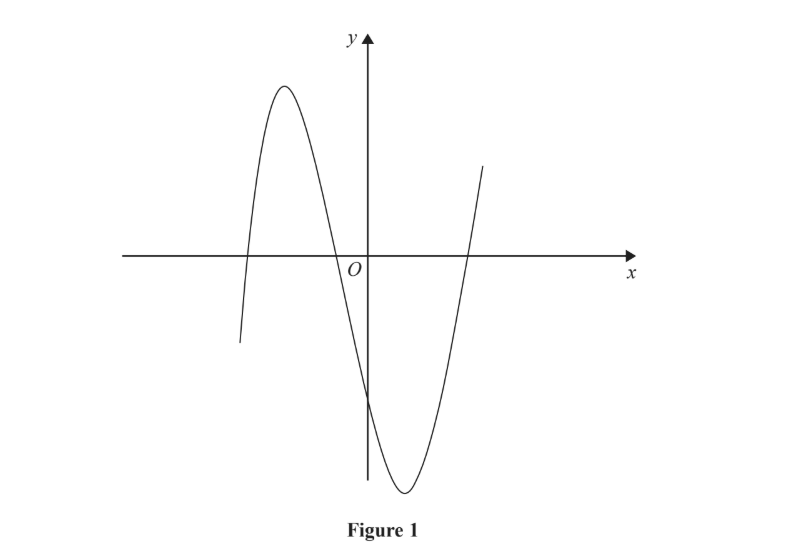
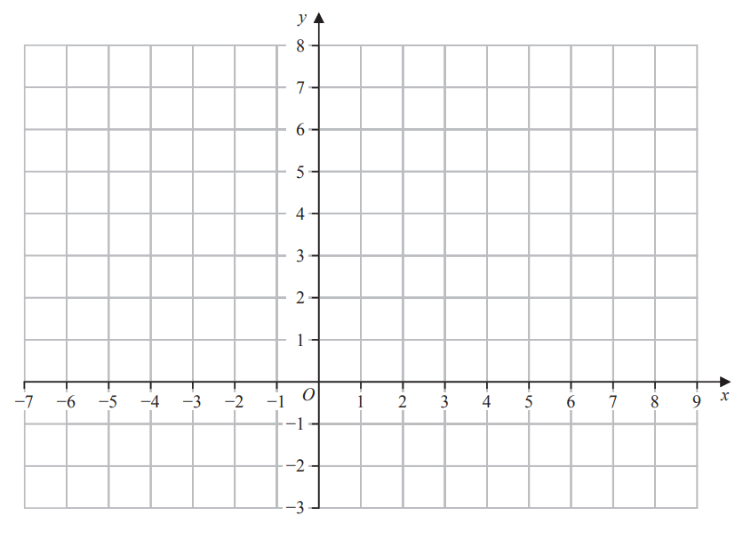
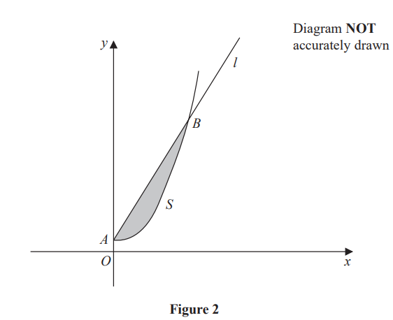
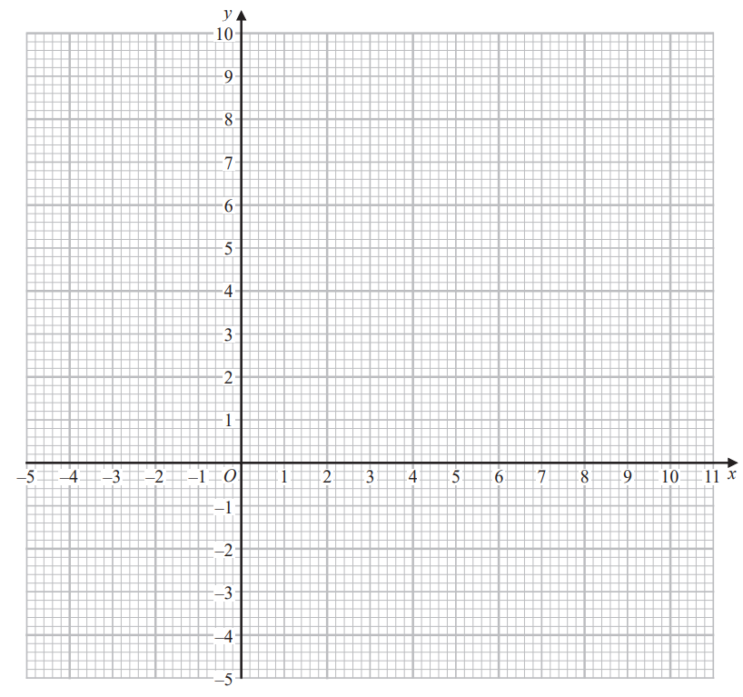

# Exam Questions — Coordinate Geometry
**Coordinate Geometry & Graphs** · Edexcel IGCSE Further Pure Maths (4PM1)
> Source: [https://www.savemyexams.com/igcse/further-maths/edexcel/19/topic-questions/coordinate-geometry-and-graphs/coordinate-geometry/exam-questions/](https://www.savemyexams.com/igcse/further-maths/edexcel/19/topic-questions/coordinate-geometry-and-graphs/coordinate-geometry/exam-questions/) · 9 questions · total 85 marks

## Q1 — medium — 2 marks · exam-questions

### 1((a)) — 2 marks — structured — from paper Specimen paper · 4PM1/01
On the axes below, sketch the lines with equations  $2x+3y=8$ and $2y=4x+1$

On your sketch, show the coordinates of the points where the lines cross the coordinate axes.

## Q2 — medium — 18 marks · exam-questions

### 10((a)) — 5 marks — structured — from paper Specimen · Paper 2

Figure 1 shows the curve $M$ with equation $y=x^{3}--13x--12$

The point $P$, with $x$ coordinate −2, lies on $M$ and line$l_{1}$ is the tangent to  $M$  at the point $P$.

Find an equation for $l_{1}$

### 10((b)) — 4 marks — structured — from paper Specimen · Paper 2
The point $Q$ lies on $M$ and the line $l_{2}$ is the tangent to $M$ at the point $Q$.

Given that $l_{1}$ and  $l_{2}$ are parallel,

find an equation for $l_{2}$

### 10((c)) — 4 marks — structured — from paper Specimen · Paper 2
The normal to $M$ at $P$ meets $l_{2}$ at the point $R$.

Find the coordinates of $R$.

### 10((d)) — 2 marks — structured — from paper Specimen · Paper 2
Find the exact length of the line $PR$.

### 10((e)) — 3 marks — structured — from paper Specimen · Paper 2
The tangent and normal at $P$and the tangent and normal at $Q$ form a rectangle.

Find the exact area of this rectangle.

## Q3 — medium — 16 marks · exam-questions

### 6((a)) — 2 marks — structured — from paper June 2024 · Paper 1
The line $l$ passes through the point $A$ with coordinates $(--2,2)$ and the point $B$with coordinates $(3,12)$

The point $C$ with coordinates $(p,q)$ lies on $l$ such that $AC:CB=3:2$

Find the value of $p$ and the value of $q$

### 6((b)) — 4 marks — structured — from paper June 2024 · Paper 1
The line $k$ is perpendicular to $l$and passes through the point $C$

Show that an equation of $k$ is $2y+x-17=0$

### 6((c)) — 3 marks — structured — from paper June 2024 · Paper 1
The line $k$ crosses the $x$-axis at the point $D$

Find the exact length of $CD$

### 6((d)) — 7 marks — structured — from paper June 2024 · Paper 1
The point $X$ with coordinates $(m,n)$ lies on $l$such that

area of triangle $DXC$= 80 units2

Given that $m>0$

find the value of $m$  and the value of $n$

## Q4 — medium — 4 marks · exam-questions

### 1((a)) — 2 marks — structured — from paper Nov 2024 · Paper 1
On the grid below, draw the line with equation

(i) $3x+4y=24$

(ii)  $2x-5y+10=0$

### 1((b)) — 2 marks — structured — from paper Nov 2024 · Paper 1
Show, by shading on the grid, the region $R$ defined by the inequalities

`3 x space plus space 4 y space less-than or slanted equal to space 24 space space space space space 2 x space minus space 5 y space plus 10 space greater-than or slanted equal to space 0 space space space space y space less-than or slanted equal to space 5 space space space space space x space greater-than or slanted equal to space minus 1`

Label the region $R$

## Q5 — medium — 8 marks · exam-questions

### 4((a)) — 4 marks — structured — from paper June 2023 · Paper 2

The curve $S$ with equation $y=\frac{x^{2}}{4}+2$ where `x greater-than or slanted equal to 0` and the line $l$ with equation $2y-x-4=0$ where  `x greater-than or slanted equal to 0` intersect at the points $A$and $B$, as shown in Figure 2.

(i) Show that the coordinates of point $A$ are (0, 2)

(ii) Find the coordinates of the point $B$

### 4((b)) — 4 marks — structured — from paper June 2023 · Paper 2
The finite region bounded by $S$ and $l$, shown shaded in Figure 2, is rotated through $2π$ radians about the $y$-axis.

Use algebraic integration to find the volume of the solid generated. 
Give your answer in terms of $π$

## Q6 — medium — 7 marks · exam-questions

### 5((a)) — 3 marks — structured — from paper June 2023 · Paper 2
On the grid opposite draw the line with equation

(i) $y=2x+5$

(ii) $4y=x-8$

(iii) $5y+3x=30$

### 5((b)) — 1 mark — structured — from paper June 2023 · Paper 2
Show, by shading, the region $R$defined by the inequalities

`y less-than or slanted equal to 2 x plus 5      4 y greater-than or slanted equal to x minus 8      5 y plus 3 x less-than or slanted equal to 30`

### 5((c)) — 3 marks — structured — from paper June 2023 · Paper 2
For all points in $R$ with coordinates `open parentheses x comma space y close parentheses`

$P=2x-5y$

Using your graph, find the least value of $P$

## Q7 — medium — 9 marks · exam-questions

### 4((a)) — 3 marks — structured — from paper November 2023 · Paper 1
The point $A$ with coordinates `open parentheses 12 comma space 14 close parentheses` and the point $B$ with coordinates `open parentheses q comma space 2 close parentheses` where $q$ is a constant, lie on the straight line with equation $3y-2x-p=0$ where $p$ is a constant.

Find the value of $p$and the value of $q$

### 4((b)) — 6 marks — structured — from paper November 2023 · Paper 1
The line $L$ is perpendicular to $AB$ and passes through the point $X$, which lies on $AB$ such that $AX:XB=1:2$

Find an equation for  $L$ in the form $ax+by+c=0$ where $a$, $b$ and $c$ are integers to be found.

## Q8 — medium — 8 marks · exam-questions

### 4((a)) — 3 marks — structured — from paper November 2023 · Paper 2
On the axes opposite, draw the line with equation

(i) $y=-x-1$

(ii) $y-3x+8=0$

(iii) $2y=x+8$

### 4((b)) — 1 mark — structured — from paper November 2023 · Paper 2
Show, by shading on your graph, the region $R$ defined by the inequalities

`y greater-than or slanted equal to negative x minus 1`  and  `y greater-than or slanted equal to 3 x minus 8` and  `2 y less-than or slanted equal to x plus 8`

### 4((c)) — 4 marks — structured — from paper November 2023 · Paper 2
For all points in $R$, with coordinates `open parentheses x comma space y close parentheses`

$P=2y-3x$

Find

(i) the greatest value of $P$

(ii) the least value of $P$

## Q9 — medium — 13 marks · exam-questions

### 2((a)) — 4 marks — structured — from paper January 2023 · Paper 1
The point $A$ has coordinates (–5, 3), the point $B$ has coordinates (4, 0) and the point $C$ has coordinates (–1, 5).

The line $l$ passes through $C$ and is perpendicular to $AB$.

Find an equation of $l$ . 
Give your answer in the form  $ax+by+c=0$ where $a$, $b$ and $c$ are integers.

### 2((b)) — 3 marks — structured — from paper January 2023 · Paper 1
The line $l$  intersects $AB$ at the point $D$.

Show that the coordinates of $D$ are (-2, 2).

### 2((c)) — 2 marks — structured — from paper January 2023 · Paper 1
The point $A$ has coordinates (–5, 3), the point $B$ has coordinates (4, 0) and the point $C$ has coordinates (–1, 5).

Show that $l$ is not the perpendicular bisector of $AB$.

### 2((d)) — 4 marks — structured — from paper January 2023 · Paper 1
Find the value of `tan space angle A B C`.
Give your answer in its simplest form.
