# Mark Schemes — Graphs
**Coordinate Geometry & Graphs** · Edexcel IGCSE Further Pure Maths (4PM1)

## Q1 — medium — 8 marks · exam-questions

### 7((a)) — 2 marks
Substitute each missing value of $x$ into `y = 2^{\left(\frac{x}{2} + 1\right)} + 1`

- Work out the index first, then the power, then add 1

For $x = 1$ the index is $\frac{1}{2} + 1 = 1 . 5$

$y = 2^{1.5} + 1$

$y = 3 . 828 \dots$

For $x = 2$ the index is $\frac{2}{2} + 1 = 2$

$y = 2^{2} + 1$

$y = 5$

For $x = 3$ the index is $\frac{3}{2} + 1 = 2 . 5$

$y = 2^{2.5} + 1$

$y = 6 . 656 \dots$

Round to 2 decimal places where the value is not exact

| $x$ | 0 | 1 | 2 | 3 | 4 | 5 |
|---|---|---|---|---|---|---|
| $y$ | 3 | **Final answer:** **3.83** | **Final answer:** **5** | **Final answer:** **6.66** | 9 | 12.31 |

**[B1 B1]**

> **[mark-scheme]**
> **B1**: Two of the three missing values correct.
> 
> **B1**: All three missing values correct, given to 2 decimal places where appropriate. Accept 5.00 for 5.

> **[exam-tip]**
> Work out the whole index before you use the power key on your calculator.
> 
> - `2^{\left(\frac{x}{2} + 1\right)}` is not the same as $2^{\frac{x}{2}} + 1$, and mis-reading the bracket is the usual cause of a wrong table
> 
> The two values already filled in are a free check on your method.
> 
> - If your working does not reproduce $y = 9$ when $x = 4$, something is wrong before you go any further

### 7((b)) — 2 marks
Plot the six points from the table, then join them with a single smooth curve

- Plot each point to within half a small square
- The curve rises slowly at first and then more steeply, so do not join the points with straight segments

**[B1 B1]**

> **[mark-scheme]**
> **B1**: All points plotted within an accuracy of half a small square.
> 
> **B1**: A smooth curve drawn through their plotted points. Follow through from an incorrect table in part (a).

> **[exam-tip]**
> Use a sharp pencil and mark each point with a small cross or dot, not a blob.
> 
> - Half a small square is the tolerance, so a thick mark can put you outside it
> 
> Join the points freehand in one smooth sweep.
> 
> - Drawing straight lines between the points, or going over the curve repeatedly until it is furry, both lose the second mark

### 7((c)) — 4 marks
The graph you have drawn is `y = 2^{\left(\frac{x}{2} + 1\right)} + 1`, so rearrange the equation until that expression appears

Start with the equation and use the power law on the left

`2 \text{log}_{2} \left(4 x - 6\right) - x = 2`

`2 \text{log}_{2} \left(4 x - 6\right) = x + 2`

**[M1]**

Divide through by 2

`\text{log}_{2} \left(4 x - 6\right) = \frac{x}{2} + 1`

**[M1]**

Write this in index form, which produces the expression from the graph

`4 x - 6 = 2^{\left(\frac{x}{2} + 1\right)}`

Add 1 to both sides, so that the right-hand side is exactly $y$

`4 x - 5 = 2^{\left(\frac{x}{2} + 1\right)} + 1`

So the straight line to draw is $y = 4 x - 5$

- Where it crosses the curve, the two sides of the equation are equal, and that is the root

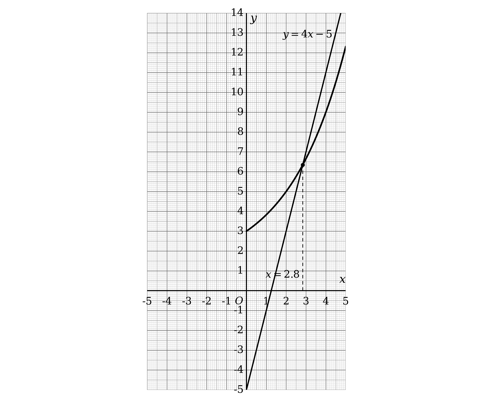

**[M1]**

Read off the $x$ coordinate of the intersection, to 1 decimal place

$x = 2 . 8$

**[A1]**

> **[mark-scheme]**
> **M1**: Uses the power law to reach `2 \text{log}_{2} \left(4 x - 6\right) = x + 2` or an equivalent form.
> 
> **M1**: Divides by 2 to reach `\text{log}_{2} \left(4 x - 6\right) = \frac{x}{2} + 1`.
> 
> **M1**: Identifies and draws the straight line $y = 4 x - 5$ on the grid.
> 
> **A1**: $x = 2 . 8$. Accept answers in the range 2.7 to 2.9, since the value is read from a graph.

> **[exam-tip]**
> The phrase by drawing a suitable straight line tells you the plan: rearrange until one side is exactly the $y$ of the curve you already have.
> 
> - Whatever is left on the other side is the line, and it will always come out linear
> 
> Aim to finish with the printed curve expression untouched on one side.
> 
> - Here that means getting to `2^{\left(\frac{x}{2} + 1\right)} + 1`, which is why the last step is to add 1 to both sides
> 
> Draw the line right across the grid with a ruler.
> 
> - A short line stopping near the curve makes the intersection hard to read, and the answer is only as accurate as the drawing

## Q2 — medium — 8 marks · exam-questions

### 7((a)) — 3 marks
**(i)**

The curve crosses the $x$-axis at `\left(2 . 5 , 0\right)`, so $y = 0$ when $x = 2 . 5$

A fraction is zero only when its numerator is zero

`a \left(2 . 5\right) - 5 = 0`

Solve for $a$

$2 . 5 a = 5$

$a = 2  \text{as required}$

**[M1] [A1]**

**(ii)**

An asymptote parallel to the $y$-axis is a vertical line, and a vertical asymptote sits where the denominator is zero

$x - b = 0$

That asymptote is given as $x = 1$, so the denominator must vanish when $x = 1$

$b = 1$

**[B1]**

> **[mark-scheme]**
> **M1**: Sets the numerator equal to zero and substitutes $x = 2 . 5$, or equivalently substitutes `\left(2 . 5 , 0\right)` into the equation of $C$.
> 
> **A1**: Reaches $a = 2$ with correct working throughout.
> 
> **B1**: $b = 1$.
> 
> Part (i) is a "show that", so the value cannot be assumed and the working has to produce it.
> 
> In part (ii) the value may be written down with no working, since it can be read straight off the given asymptote.

> **[exam-tip]**
> Each piece of information in the stem pins down one of the two letters.
> 
> - The crossing on the $x$-axis is about the numerator, because a fraction equals zero only when its top is zero
> - The vertical asymptote is about the denominator, because that is where the fraction is undefined
> 
> Read $b$ off the asymptote rather than solving anything.
> 
> - The denominator is $x - b$, so it is zero at $x = b$, and the asymptote is $x = 1$
> 
> A "show that" needs the algebra even when the answer is given.
> 
> - Writing $a = 2$ and checking it works backwards is not a proof, so start from $y = 0$ and derive it
> 
> Both values feed into every later part.
> 
> - The equation becomes $y = \frac{2x-5}{x-1}$, which is what parts (b), (c) and (d) all use

### 7((b)) — 1 marks
Part (a) gives the equation of $C$ as $y = \frac{2x-5}{x-1}$

A curve crosses the $y$-axis where $x = 0$, so substitute that in

`y = \frac{2 \left(0\right) - 5}{0 - 1}`

A negative divided by a negative is positive

$y = \frac{-5}{-1}$

`open parentheses 0 comma space 5 close parentheses`

**[B1]**

> **[mark-scheme]**
> **B1**: `\left(0 , 5\right)`. Accept $y = 5$ on its own.
> 
> This follows through from your own values of $a$ and $b$ in part (a).

> **[exam-tip]**
> A crossing with the $y$-axis always comes from putting $x = 0$.
> 
> - There is nothing to rearrange, so this is a one line answer
> 
> Watch the two minus signs.
> 
> - $\frac{-5}{-1}$ is $+ 5$, and losing one of the signs gives $- 5$, which would put the curve in the wrong quadrant in part (d)
> 
> The question asks for coordinates.
> 
> - Give the answer as `open parentheses 0 comma space 5 close parentheses` rather than just 5, so there is no doubt which axis it is on

### 7((c)) — 1 marks
An asymptote parallel to the $x$-axis is a horizontal line, and it is the value $y$ approaches as $x$ becomes very large

Divide the numerator and the denominator of $\frac{2x-5}{x-1}$ by $x$

$y = \frac{2-\frac{5}{x}}{1-\frac{1}{x}}$

As $x$ grows in either direction, $\frac{5}{x}$ and $\frac{1}{x}$ both shrink towards zero

$y = 2$

**[B1]**

> **[mark-scheme]**
> **B1**: $y = 2$.
> 
> This follows through from your own value of $a$ in part (a), since the horizontal asymptote is $y = a$ here.
> 
> The answer must be given as an equation. A bare 2 does not earn the mark, because the question asks for the equation of a line.

> **[exam-tip]**
> For a fraction with a linear top and a linear bottom, the horizontal asymptote is the ratio of the two $x$ coefficients.
> 
> - Here that is $\frac{2}{1}$, so $y = 2$, and there is no need to write the division out in full once you trust it
> 
> Dividing through by $x$ is the reasoning behind that shortcut.
> 
> - Every term with an $x$ underneath it tends to zero, leaving only the coefficients
> 
> Give an equation, not a number.
> 
> - The question asks for the equation of the asymptote, so the answer is $y = 2$

### 7((d)) — 3 marks
Collect together what the earlier parts have found

- The asymptotes are $x = 1$ from part (a) and $y = 2$ from part (c)
- The crossings are `\left(2 . 5 , 0\right)` from the stem and `\left(0 , 5\right)` from part (b)

To see the shape, rewrite the equation as a constant plus a single fraction

- Dividing $2 x - 5$ by $x - 1$ leaves a remainder, and the result is $2 - \frac{3}{x-1}$

$y = 2 - \frac{3}{x-1}$

This is $y = - \frac{3}{x}$ shifted 1 to the right and 2 up, so it has the two branches of a negative reciprocal curve

- To the left of $x = 1$ the fraction is negative, so $- \frac{3}{x-1}$ is positive and the curve lies above $y = 2$
- To the right of $x = 1$ the curve lies below $y = 2$

That puts `\left(0 , 5\right)` on the left branch and `\left(2 . 5 , 0\right)` on the right branch, which is a useful check

Now draw the two asymptotes as dashed lines, label them, mark the two crossings, and sketch a branch on each side

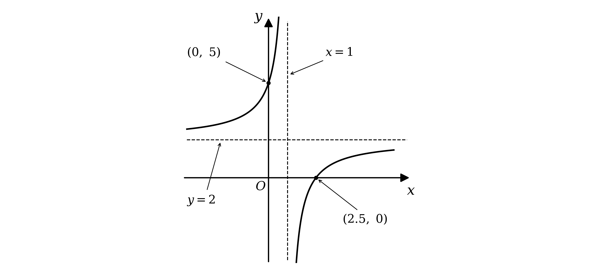

**[B1] [B1] [B1]**

> **[mark-scheme]**
> **B1**: The curve drawn in the correct quadrants, with one branch either side of the vertical asymptote.
> 
> **B1**: Both asymptotes drawn correctly.
> 
> **B1**: Both crossings with the coordinate axes shown correctly.
> 
> All three marks follow through from your own values of $a$ and $b$ in part (a) and your answers to parts (b) and (c).
> 
> The official diagram labels the crossings as bare values against the axes, 5 on the $y$-axis and $2 . 5$ on the $x$-axis, and full coordinate pairs are equally acceptable.

> **[exam-tip]**
> Everything the sketch needs has already been worked out, so gather it before drawing.
> 
> - Two asymptotes, two crossings, and each of them carries part of a mark
> 
> Rewriting the equation as $2 - \frac{3}{x-1}$ tells you which side of the horizontal asymptote each branch goes.
> 
> - For $x < 1$ the fraction is negative, so subtracting it puts the curve above $y = 2$
> - Both branches on the same side of $y = 2$ is the usual way to lose the first mark
> 
> Draw the asymptotes first, as dashed lines, and write their equations next to them.
> 
> - The branches then have somewhere to aim for, and a curve that crosses or bends back from an asymptote loses the mark
> 
> Use the crossings as a check on the shape.
> 
> - `\left(0 , 5\right)` is above $y = 2$ and left of $x = 1$, and `\left(2 . 5 , 0\right)` is below and right, which is only possible for one arrangement of the branches

## Q3 — medium — 13 marks · exam-questions

### 7((a)) — 1 marks
$P$ lies on $C$, so its coordinates satisfy the equation of $C$

Substitute $x = 4$ into $y = \frac{x^{2}}{4} - 3 \sqrt{x} + 8$

- $\sqrt{4} = 2$, so the middle term is $3 \times 2$

`a = \frac{16}{4} - 3 \left(2\right) + 8`

$a = 4 - 6 + 8$

$a = 6  \text{as required}$

**[B1]**

> **[mark-scheme]**
> **B1**: Substitutes $x = 4$ into the equation of $C$ and reaches $a = 6$ with correct working.
> 
> This is a "show that", so the substitution has to be seen. Simply writing $a = 6$ does not earn the mark.

> **[exam-tip]**
> A point on a curve always means substitute its coordinates into the equation.
> 
> - Here only the $x$ coordinate is known, so substituting it produces the $y$ coordinate directly
> 
> Deal with the square root before multiplying.
> 
> - $3 \sqrt{4}$ is $3 \times 2 = 6$, not $\sqrt{12}$
> 
> Show the substitution even though the answer is given.
> 
> - One mark, but it is for the working, so write the line with 4 in it rather than just the answer

### 7((b)) — 6 marks
A normal is perpendicular to the tangent, so start by differentiating $C$

Rewrite the square root as a power first, so the rule for differentiating powers can be used

- $3 \sqrt{x}$ is $3 x^{\frac{1}{2}}$

$\frac{\text{d}y}{\text{d}x} = \frac{2x}{4} - 3 \times \frac{1}{2} x^{-\frac{1}{2}}$

**[M1]**

Substitute $x = 4$, remembering that a negative index means a reciprocal

- $4^{-\frac{1}{2}}$ means $\frac{1}{\sqrt{4}}$, which is $\frac{1}{2}$

`\frac{\text{d} y}{\text{d} x} = \frac{2 \left(4\right)}{4} - \frac{3}{2} \times \frac{1}{2}`

**[M1]**

$\frac{\text{d}y}{\text{d}x} = \frac{5}{4}$

**[A1]**

Perpendicular gradients multiply to $- 1$, so take the negative reciprocal

$m = - \frac{4}{5}$

**[M1]**

Use `y - y_{1} = m \left(x - x_{1}\right)` through `P \left(4 , 6\right)`

`y - 6 = - \frac{4}{5} \left(x - 4\right)`

**[M1]**

Multiply every term by 5 and collect everything on one side

$5 y - 30 = - 4 x + 16$

$5 y + 4 x - 46 = 0  \text{as required}$

**[A1]**

> **[mark-scheme]**
> **M1**: Differentiates $C$, with at least one term correct and at least one power reduced by 1.
> 
> **M1**: Substitutes $x = 4$ into your derivative. This mark depends on the previous one.
> 
> **A1**: A gradient of $\frac{5}{4}$ for the tangent.
> 
> **M1**: Finds the gradient of the normal as $\frac{-1}{\text{your gradient}}$.
> 
> **M1**: A complete and correct method to find the equation of the normal, using your gradient together with the point `\left(4 , 6\right)`. Where the form $y = m x + c$ is used, a value of $c$ must be found.
> 
> **A1**: Reaches the printed equation $5 y + 4 x - 46 = 0$ with no errors anywhere in the working.
> 
> The equation is given in the question, so it cannot be assumed and the working must arrive at it.
> 
> Writing $3 \sqrt{x}$ as $3 x^{\frac{1}{2}}$ before differentiating is expected, but any correct equivalent derivative is accepted, including $\frac{x}{2} - \frac{3}{2\sqrt{x}}$.

> **[exam-tip]**
> Turn every root into a power before differentiating.
> 
> - $3 \sqrt{x}$ is $3 x^{\frac{1}{2}}$, which differentiates to $\frac{3}{2} x^{-\frac{1}{2}}$
> - Trying to differentiate the root as it stands is where this goes wrong
> 
> A negative fractional index is a reciprocal of a root.
> 
> - $4^{-\frac{1}{2}}$ is $\frac{1}{\sqrt{4}}$, which is $\frac{1}{2}$, and not $- 2$
> 
> Remember the normal, not the tangent.
> 
> - The tangent gradient is $\frac{5}{4}$, so the normal gradient is $- \frac{4}{5}$
> - Two of the six marks here depend on making that switch
> 
> Finish in exactly the printed form.
> 
> - Multiplying through by 5 and collecting everything on one side gives $5 y + 4 x - 46 = 0$, and leaving it as $y = \dots$ does not complete the "show that"

### 7((c)) — 6 marks
$R$ has two different upper boundaries, so it splits into two pieces at $P$

- From $x = 1$ to $x = 4$ the top of $R$ is the curve $C$
- From $x = 4$ onwards the top is the line $L$, down to where $L$ meets the $x$-axis

Take the area under $C$ first, writing the root as a power before integrating

`A_{C} = \int_{1}^{4} \left(\frac{x^{2}}{4} - 3 x^{\frac{1}{2}} + 8\right) \text{d} x`

Integrate each term, raising the power by one and dividing by the new power

- $3 x^{\frac{1}{2}}$ integrates to $3 \times \frac{x^{\frac{3}{2}}}{\frac{3}{2}}$, which is $2 x^{\frac{3}{2}}$

`A_{C} = \left[\frac{x^{3}}{12} - 2 x^{\frac{3}{2}} + 8 x\right]_{1}^{4}`

**[M1]**

Substitute the upper limit, using $4^{\frac{3}{2}} = 8$

`\frac{64}{12} - 2 \left(8\right) + 32 = \frac{64}{3}`

Now the lower limit, where every power of 1 is 1

$\frac{1}{12} - 2 + 8 = \frac{73}{12}$

**[M1]**

Subtract the lower value from the upper value, over a denominator of 12

$A_{C} = \frac{256}{12} - \frac{73}{12}$

$A_{C} = \frac{61}{4}$

**[A1]**

Now the piece under $L$. Find where $L$ crosses the $x$-axis by putting $y = 0$

$4 x - 46 = 0$

$x = \frac{23}{2}$

That piece is a triangle, with a vertex at `P \left(4 , 6\right)` and a base along the $x$-axis

- The base runs from $x = 4$ to $x = \frac{23}{2}$, so it is $\frac{15}{2}$ long
- The height is the $y$ coordinate of $P$, which is 6

$A_{L} = \frac{1}{2} \times \frac{15}{2} \times 6$

**[M1]**

$A_{L} = \frac{45}{2}$

**[A1]**

Add the two pieces, writing both over 4

$A = \frac{61}{4} + \frac{90}{4}$

$A = \frac{151}{4}$

**[A1]**

> **[mark-scheme]**
> **M1**: Integrates the equation of $C$, with at least one term correct and every power raised by 1.
> 
> **M1**: Substitutes the limits 1 and 4 into your integrated expression and subtracts them the correct way round.
> 
> **A1**: An area under $C$ of $\frac{61}{4}$.
> 
> **M1**: A complete method for the area under $L$ between $x = 4$ and the point where $L$ meets the $x$-axis.
> 
> **A1**: An area under $L$ of $\frac{45}{2}$.
> 
> **A1**: A total area of $\frac{151}{4}$, or any equivalent exact value such as $37 . 75$.
> 
> Integrating $L$ rather than treating it as a triangle is equally acceptable and earns the same two marks. That route is `\int_{4}^{\frac{23}{2}} \left(- \frac{4}{5} x + \frac{46}{5}\right) \text{d} x`, which gives `\left[- \frac{4}{10} x^{2} + \frac{46}{5} x\right]_{4}^{\frac{23}{2}}` and the same $\frac{45}{2}$.
> 
> The two pieces must be added, not subtracted, because both lie above the $x$-axis and inside $R$.

> **[exam-tip]**
> Sketch $R$ before integrating anything.
> 
> - Its upper boundary changes at $P$, from the curve to the line, so the area has to be found in two pieces
> - Treating the whole thing as one integral of $C$ is the commonest way to lose most of these marks
> 
> The second piece is a triangle, so no integration is needed.
> 
> - $L$ runs from `P \left(4 , 6\right)` down to `\left(\frac{23}{2} , 0\right)`, giving a base of $\frac{15}{2}$ and a height of 6
> - Integrating it works too and earns the same marks, but the triangle is quicker and harder to get wrong
> 
> Write the root as a power before integrating.
> 
> - $3 x^{\frac{1}{2}}$ integrates to $2 x^{\frac{3}{2}}$, since dividing by $\frac{3}{2}$ is multiplying by $\frac{2}{3}$
> 
> Keep everything in fractions, because the question asks for the exact area.
> 
> - $\frac{61}{4}$ and $\frac{45}{2}$ combine cleanly over a denominator of 4
> - $37 . 75$ happens to be exact here, but rounding at any earlier step would not be

## Q4 — medium — 16 marks · exam-questions

### 10((a)) — 2 marks
A point on the coordinate axes at `\left(\frac{5}{4} , 0\right)` has $y = 0$, so this is where $C$ crosses the $x$-axis

A fraction is zero only when its numerator is zero

$a x - 5 = 0$

Substitute $x = \frac{5}{4}$ and solve for $a$

$\frac{5a}{4} = 5$

$a = 4$

**[B1]**

An asymptote parallel to the $y$-axis is a vertical line, and a vertical asymptote sits where the denominator is zero

$b - x = 0$

That asymptote is given as $x = 3$, so the denominator must vanish when $x = 3$

$b = 3$

**[B1]**

> **[mark-scheme]**
> **B1**: Either $a = 4$ or $b = 3$.
> 
> **B1**: Both $a = 4$ and $b = 3$.
> 
> These are independent marks, not given answers, so they are awarded for sight of the correct values. They are not method marks and do not depend on any working being shown.
> 
> The only case in which a correct value does not earn its mark is where it plainly comes from clearly incorrect working.

> **[exam-tip]**
> Each piece of information in the stem pins down one of the two letters.
> 
> - The axis crossing is about the numerator, because a fraction equals zero only when its top is zero
> - The vertical asymptote is about the denominator, because that is where the fraction is undefined
> 
> Read $b$ straight off the asymptote rather than solving anything.
> 
> - The denominator is $b - x$, so it is zero at $x = b$, and the asymptote is $x = 3$
> - That gives $b = 3$ in one step
> 
> These two marks are worth checking, because everything else in the question depends on them.
> 
> - Substitute back into $y = \frac{4x-5}{3-x}$ and confirm that $x = \frac{5}{4}$ gives $y = 0$

### 10((b)) — 5 marks
Part (a) gives the equation of $C$ as $y = \frac{4x-5}{3-x}$

The vertical asymptote is where the denominator is zero, which part (a) has already established

$x = 3$

For the horizontal asymptote, divide the numerator and the denominator by $x$

$y = \frac{4-\frac{5}{x}}{\frac{3}{x}-1}$

As $x$ gets very large in either direction, $\frac{5}{x}$ and $\frac{3}{x}$ both shrink towards zero

$y = - 4$

The crossing with the $x$-axis is the point given in the stem

`\left(\frac{5}{4} , 0\right)`

For the crossing with the $y$-axis, substitute $x = 0$

`y = \frac{4 \left(0\right) - 5}{3 - 0}`

`\left(0 , - \frac{5}{3}\right)`

To see the shape, rewrite the equation as a single fraction added to a constant

- Dividing $4 x - 5$ by $3 - x$ leaves a remainder, and the result is $- 4 - \frac{7}{x-3}$

$y = - 4 - \frac{7}{x-3}$

This is $y = - \frac{7}{x}$ shifted 3 to the right and 4 down, so it has the two branches of a negative reciprocal curve

- To the left of $x = 3$ the curve lies above $y = - 4$ and rises steeply as it approaches the asymptote
- To the right of $x = 3$ the curve lies below $y = - 4$ and climbs towards it from underneath

Now draw the two asymptotes as dashed lines, label them with their equations, mark the two axis crossings, and sketch a branch on each side

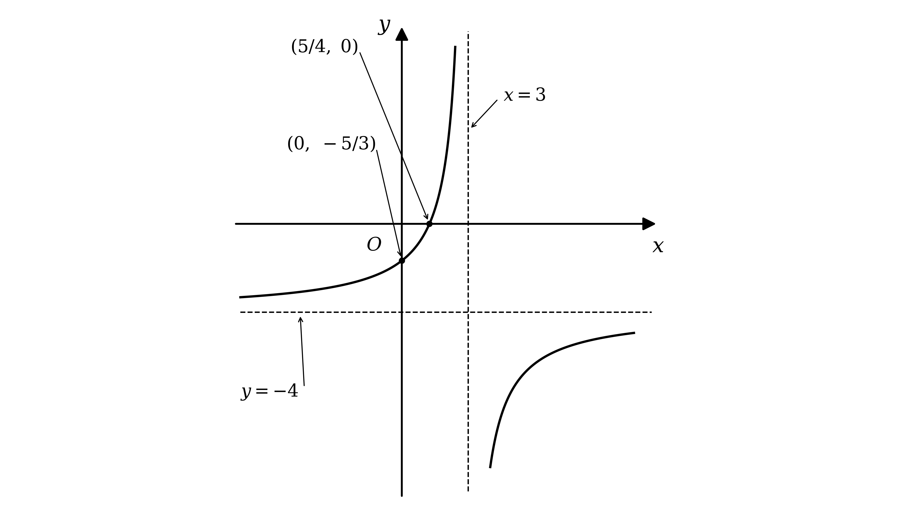

**[B1] [B1] [B1] [B1] [B1]**

> **[mark-scheme]**
> **B1**: A negative reciprocal curve drawn anywhere on the axes, with two branches present. The branches must not cross either asymptote and must not obviously bend back on themselves. Intention is marked.
> 
> **B1**: The horizontal asymptote $y = - 4$ drawn in the correct place and either labelled with its equation or shown by where it meets the $y$-axis. At least one branch of a reciprocal curve must be present, and it must not cross or obviously bend back from the asymptotes. Any other curves drawn are ignored.
> 
> **B1**: The vertical asymptote $x = 3$ drawn in the correct place, under the same conditions about the branches.
> 
> **B1**: A single curve, or even a line, passing through `\left(0 , - \frac{5}{3}\right)`, marked clearly either as a coordinate or as a crossing point on the axis. Any other branches present are ignored.
> 
> **B1**: A single curve, or even a line, passing through both `\left(\frac{5}{4} , 0\right)` and `\left(0 , - \frac{5}{3}\right)`, with both marked clearly as coordinates or as crossings on the axes.
> 
> The last four marks follow through from your own values of $a$ and $b$ in part (a). The horizontal asymptote follows through only as $y = -$ your $a$, and the $y$-axis crossing only as `\left(0 , - \frac{5}{\text{your}\textrm{ } b}\right)`, and in each case only if the other conditions are met.

> **[exam-tip]**
> Find the asymptotes before you draw anything, because they set the whole shape.
> 
> - The vertical one is where the denominator is zero, so $x = 3$
> - The horizontal one is the ratio of the $x$ coefficients, $\frac{4}{-1}$, so $y = - 4$
> 
> Draw the asymptotes as dashed lines and write their equations next to them.
> 
> - Two of the five marks depend on the asymptotes being in the right place, and one of them requires the equation to be shown
> 
> A reciprocal curve must never touch or cross its asymptotes.
> 
> - A branch that bends back on itself, or that crosses a dashed line, loses the mark even if the rest of the sketch is right
> - Each branch has to keep getting closer to both asymptotes without ever meeting them
> 
> Work out which side of the horizontal asymptote each branch goes.
> 
> - Writing the curve as $- 4 - \frac{7}{x-3}$ makes it obvious: for $x < 3$ the fraction is negative, so $y$ is above $- 4$
> - Sketching both branches on the same side of $y = - 4$ is the most common way to lose the first mark
> 
> Label the two crossings as coordinates, not just as dots.
> 
> - The last two marks are specifically for `\left(0 , - \frac{5}{3}\right)` and then for both crossings together

### 10((c)) — 9 marks
A line and a curve meet where both equations hold at once, so start by solving them simultaneously

Rearrange $l$ to make $y$ the subject

$y = \frac{7x+k}{4}$

Set that equal to the equation of $C$ from part (a)

$\frac{7x+k}{4} = \frac{4x-5}{3-x}$

**[M1]**

Multiply both sides by `4 \left(3 - x\right)` to clear the two fractions

`\left(7 x + k\right) \left(3 - x\right) = 4 \left(4 x - 5\right)`

**[A1]**

Expand both sides

$21 x - 7 x^{2} + 3 k - k x = 16 x - 20$

**[M1]**

Collect everything on the side that leaves the $x^{2}$ term positive, and gather the two terms in $x$

- The $x$ terms are $- 21 x$, $+ k x$ and $+ 16 x$, which combine to `\left(k - 5\right) x`

`7 x^{2} + \left(k - 5\right) x - 20 - 3 k = 0`

**[A1]**

No points of intersection means this quadratic has no real roots, so its discriminant is negative

`\left(k - 5\right)^{2} - 4 \left(7\right) \left(- 20 - 3 k\right) < 0`

**[M1]**

Expand each piece separately

- `\left(k - 5\right)^{2}` is $k^{2} - 10 k + 25$
- `- 28 \left(- 20 - 3 k\right)` is $560 + 84 k$

$k^{2} - 10 k + 25 + 560 + 84 k < 0$

**[A1]**

Collect the like terms

$k^{2} + 74 k + 585 < 0$

Find the critical values by solving the corresponding equation

- Look for two numbers that multiply to 585 and add to 74, which are 9 and 65

`\left(k + 9\right) \left(k + 65\right) = 0`

$k = - 9$

**[M1]**

$k = - 65$

**[M1]**

The coefficient of $k^{2}$ is positive, so this quadratic is negative between its two critical values

$- 65 < k < - 9$

**[A1]**

Comparing with $m < k < n$ gives $m = - 65$ and $n = - 9$

> **[mark-scheme]**
> **M1**: Rearranges $l$ to $y = \frac{7}{4} x + c$ with $c \neq 0$ and sets it equal to the equation of $C$, or substitutes the equation of $C$ into the equation of $l$. This follows through from your own $a$ and $b$. An inequality sign in place of the equals sign is condoned here.
> 
> **A1**: A correct unsimplified equation. An inequality sign is not condoned for this mark.
> 
> **M1**: A complete attempt to rearrange into a three term quadratic in $x$, allowing one error in the rearrangement. "Three term quadratic" means terms in $x^{2}$, in $x$ and a constant, all on one side, simplified as far as possible. The $= 0$ may be missing and an inequality sign is condoned.
> 
> **A1**: A correct three term quadratic. The term in $x$ does not have to be factorised and the $= 0$ may be omitted.
> 
> **M1**: Forms the discriminant of your three term quadratic. The inequality sign does not need to be shown and may be the wrong way round.
> 
> **A1**: A correct unsimplified discriminant. Again the inequality sign need not be shown and may be incorrect.
> 
> **M1**: A correct method to solve your quadratic in $k$, leading to one value of $k$. This mark depends on the first two method marks, and it is awarded for the method rather than for the value.
> 
> **M1**: The same method carried through to give two values of $k$, again dependent on the first two method marks.
> 
> **A1**: $- 65 < k < - 9$.
> 
> The quadratic formula is an equally acceptable way of finding the critical values, giving `k = \frac{- 74 \pm \sqrt{74^{2} - 4 \left(1\right) \left(585\right)}}{2}`, which simplifies to $- 9$ and $- 65$.
> 
> Differentiating is the route the official scheme shows first, and it earns the same nine marks. A method mark is given for differentiating $\frac{4x-5}{3-x}$ by the quotient rule or the product rule, with the denominator squared and both terms in the numerator differentiated correctly. A mark is given for the gradient of $l$ being $\frac{7}{4}$. A method mark is given for setting that gradient equal to your derivative and attempting to solve for $x$, with an accuracy mark for $x = 1$ and $x = 5$. A method mark is given for substituting either value into the equation of $C$, with an accuracy mark for $y = - \frac{1}{2}$ and $y = - \frac{15}{2}$. A method mark is given for forming the equation of the tangent at one of those points and rearranging it to the form $4 y - 7 x = k$, and a second for doing so at both points, each dependent on the first two method marks. The final accuracy mark is for the same inequality.
> 
> That route works because $k = - 9$ and $k = - 65$ are the values for which $l$ is a tangent to $C$, and between them the line misses the curve altogether.

> **[exam-tip]**
> "No points of intersection" is a statement about a discriminant.
> 
> - Two intersections means the discriminant is positive, one means it is zero, and none means it is negative
> - So the whole question is really "solve $b^{2} - 4 a c < 0$", once you have the right quadratic
> 
> Clear the fractions before doing anything else.
> 
> - Multiplying by `4 \left(3 - x\right)` removes both denominators in one step
> - Trying to work with the fractions in place is where most of the algebra goes wrong
> 
> Treat $k$ as an ordinary number while you rearrange.
> 
> - The coefficient of $x$ comes out as $k - 5$, which is a perfectly good coefficient even though it contains a letter
> - The constant term is $- 20 - 3 k$, and the double negative in `- 4 \left(7\right) \left(- 20 - 3 k\right)` makes it positive
> 
> A quadratic inequality needs the shape of the graph, not just the critical values.
> 
> - $k^{2} + 74 k + 585$ has a positive $k^{2}$ term, so its graph is a positive parabola and it dips below the axis between the roots
> - That is why the answer is $- 65 < k < - 9$ and not $k < - 65$ or $k > - 9$
> 
> There is a second route, and it is worth knowing which one suits you.
> 
> - Differentiating gives the two points where the gradient of $C$ equals $\frac{7}{4}$, and the tangents there have $k = - 9$ and $k = - 65$
> - It reaches the same answer for the same nine marks, but it needs the quotient rule as well as the algebra

## Q5 — medium — 4 marks · exam-questions

### 4() — 4 marks
The graph already drawn is $y = \frac{x^{2}}{3} - \frac{1}{2x}$, so rearrange the equation until that expression appears on one side

Start with the equation and divide every term by $12 x$

- Dividing is the right move rather than multiplying, because the printed curve contains a $\frac{1}{x}$ term and the equation does not

$\frac{4x^{3}}{12x} + \frac{3x^{2}}{12x} - \frac{36x}{12x} - \frac{6}{12x} = 0$

Simplify each term

$\frac{x^{2}}{3} + \frac{x}{4} - 3 - \frac{1}{2x} = 0$

**[M1]**

Move the two terms that are not part of the curve to the other side

$\frac{x^{2}}{3} - \frac{1}{2x} = 3 - \frac{x}{4}$

**[A1]**

The left-hand side is exactly the $y$ of the printed curve, so the straight line to draw is $y = 3 - \frac{x}{4}$

- Where the line crosses the curve, the two sides of the equation are equal, and those $x$ values are the roots

Draw it right across the grid, through `\left(0 , 3\right)` and `\left(- 4 , 4\right)`

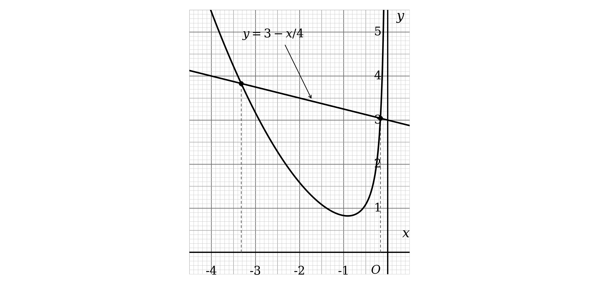

**[M1]**

Read off the $x$ coordinate of each crossing, to 1 decimal place

$x=-0.2,x=-3.3$

**[A1]**

> **[mark-scheme]**
> **M1**: Divides the equation through by $12 x$, or an equivalent manipulation, reaching an expression containing $\frac{x^{2}}{3}$ and $\frac{1}{2x}$.
> 
> **A1**: Rearranges correctly so that the printed curve stands alone on one side, giving $\frac{x^{2}}{3} - \frac{1}{2x} = 3 - \frac{x}{4}$ or an equivalent.
> 
> **M1**: Draws the line with equation $y = 3 - \frac{x}{4}$ on the grid.
> 
> **A1**: $x = - 0 . 2$ and $x = - 3 . 3$. Accept $- 3 . 4$ for the second root, since both readings are within the accuracy of the graph.
> 
> Comparing coefficients is an equally acceptable route to the line and earns the same two opening marks. Setting $\frac{x^{2}}{3} - \frac{1}{2x} = a x + b$ and clearing the fractions gives $2 x^{3} - 6 a x^{2} - 6 b x - 3 = 0$, and doubling that to match $4 x^{3} + 3 x^{2} - 36 x - 6 = 0$ gives $a = - \frac{1}{4}$ and $b = 3$, so the line is the same.
> 
> Both roots are required for the accuracy mark. The equation has a third root, near $x = 2 . 7$, but it lies outside the interval $- 4 < x < 0$ and is not wanted.

> **[exam-tip]**
> "By drawing a suitable straight line" tells you the plan: rearrange until one side is exactly the $y$ of the curve you already have.
> 
> - Whatever is left on the other side is the line, and it always comes out linear
> 
> Divide rather than multiply when the curve contains a reciprocal term.
> 
> - The printed curve has a $\frac{1}{2x}$ in it and the cubic does not, so the cubic has to be divided by something containing $x$
> - $12 x$ is the choice that makes all four terms come out neatly
> 
> Draw the line right across the grid with a ruler.
> 
> - A short line stopping near the curve makes the crossings hard to read, and the answer is only as accurate as the drawing
> 
> There are two roots in this interval, so look for two crossings.
> 
> - One is very close to the $y$-axis and easy to miss, and the mark needs both

## Q6 — medium — 8 marks · exam-questions

### 4((a)) — 2 marks
Substitute each missing value of $x$ into `y = \text{log}_{10} \left(6 x - 1\right) - x`

- Work out the bracket first, then take the logarithm, then subtract $x$

For $x = 0 . 25$ the bracket is `6 \left(0 . 25\right) - 1`, which is $0 . 5$

`y = \text{log}_{10} \left(0 . 5\right) - 0 . 25`

$y = - 0 . 551 \dots$

For $x = 2$ the bracket is 11

`y = \text{log}_{10} \left(11\right) - 2`

$y = - 0 . 958 \dots$

For $x = 2 . 5$ the bracket is 14

`y = \text{log}_{10} \left(14\right) - 2 . 5`

$y = - 1 . 353 \dots$

For $x = 3$ the bracket is 17

`y = \text{log}_{10} \left(17\right) - 3`

$y = - 1 . 769 \dots$

Round each one to 2 decimal places

| $x$ | 0.25 | 0.5 | 1 | 1.5 | 2 | 2.5 | 3 |
|---|---|---|---|---|---|---|---|
| $y$ | **Final answer:** **-0.55** | -0.20 | -0.30 | -0.60 | **Final answer:** **-0.96** | **Final answer:** **-1.35** | **Final answer:** **-1.77** |

**[B1 B1]**

> **[mark-scheme]**
> **B1**: Two of the four missing values correct, given to 2 decimal places.
> 
> **B1**: All four missing values correct, given to 2 decimal places.
> 
> Both marks require 2 decimal places exactly. A value given to more or fewer figures does not count as correct, even if it rounds to the right thing.

> **[exam-tip]**
> Work out the bracket before touching the log key.
> 
> - `\text{log}_{10} \left(6 x - 1\right)` is not the same as $6 \text{log}_{10} x - 1$, and mis-keying it is the usual cause of a wrong table
> 
> The three values already filled in are a free check on your method.
> 
> - If your working does not reproduce $- 0 . 20$ at $x = 0 . 5$, stop and find the error before doing the rest
> 
> Give every answer to exactly 2 decimal places.
> 
> - The question asks for it and both marks depend on it, so $- 0 . 551$ and $- 0 . 6$ are both wrong forms here
> 
> Keep the unrounded values for part (b).
> 
> - Plotting from the rounded table is fine, but the tolerance is half a small square, so do not round twice

### 4((b)) — 2 marks
Plot the seven points from the table, then join them with a single smooth curve

- Plot each point to within half a small square
- The grid is labelled every $0 . 5$ with ten small squares between, so one small square is $0 . 05$ on both axes

The curve rises steeply from `\left(0 . 25 , - 0 . 55\right)`, turns over just after $x = 0 . 5$, and then falls away steadily

- That turning point is between two of the tabulated values, so the curve must be drawn through the points rather than bent to meet them

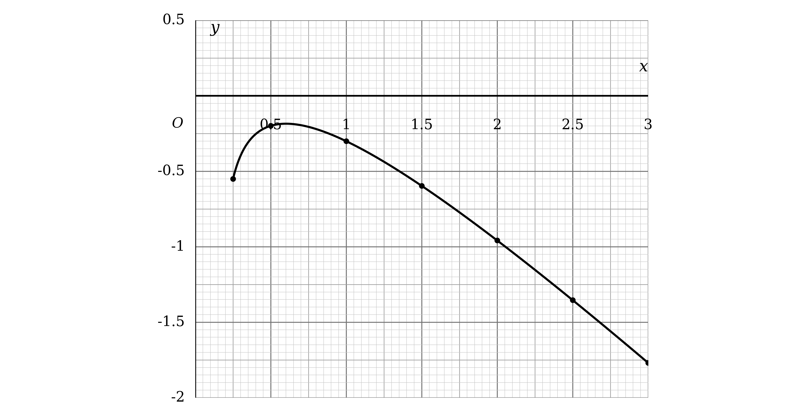

**[B1 B1]**

> **[mark-scheme]**
> **B1**: All seven points plotted within half a square. This follows through from your own values in part (a).
> 
> **B1**: The points joined with a smooth curve. This follows through from all seven of your plotted points, and the points themselves do not have to be plotted correctly for this mark.
> 
> So a smooth curve through seven wrongly plotted points still earns the second mark.

> **[exam-tip]**
> Read the scale before plotting anything.
> 
> - This grid is labelled every $0 . 5$ with ten small squares between them, so each small square is $0 . 05$
> - Half a small square is the tolerance, which is only $0 . 025$, so a thick blob can put you outside it
> 
> Use a sharp pencil and a small cross for each point.
> 
> - Seven points, and all seven have to be within tolerance for the first mark
> 
> Join them freehand in one smooth sweep.
> 
> - Straight segments between the points, or a furry line gone over several times, both lose the second mark
> - That mark follows through from your own points, so it is worth having even if the table went wrong
> 
> Watch the shape near the left-hand end.
> 
> - The curve turns over just after $x = 0 . 5$, so it is still rising at $x = 0 . 5$ and already falling at $x = 1$

### 4((c)) — 4 marks
The graph drawn in part (b) is `y = \text{log}_{10} \left(6 x - 1\right) - x`, so rearrange the equation until that expression appears

Both sides of $10^{\frac{3x-4}{2}} = 6 x - 1$ are positive, so take logarithms to base 10 of each side

- Taking logs of a power brings the index down to the front, and $\text{log}_{10} 10 = 1$

`\frac{3 x - 4}{2} = \text{log}_{10} \left(6 x - 1\right)`

**[M1]**

Split the left-hand side into two terms

`\frac{3 x}{2} - 2 = \text{log}_{10} \left(6 x - 1\right)`

Subtract $x$ from both sides, so that the right-hand side becomes exactly the $y$ of the curve

`\frac{x}{2} - 2 = \text{log}_{10} \left(6 x - 1\right) - x`

**[M1]**

So the straight line to draw is $y = \frac{x}{2} - 2$

- Where it crosses the curve, the two sides of the equation are equal, and that $x$ value is the root

Draw it right across the grid, through `\left(0 , - 2\right)` and `\left(3 , - 0 . 5\right)`

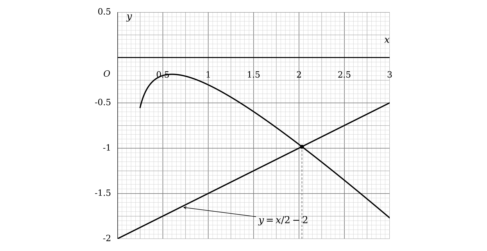

**[M1]**

Read off the $x$ coordinate of the crossing, to 1 decimal place

$x = 2 . 0$

**[A1]**

> **[mark-scheme]**
> **M1**: Takes logarithms to base 10 of both sides to reach `\frac{3 x - 4}{2} = \text{log}_{10} \left(6 x - 1\right)`, or an equivalent.
> 
> **M1**: Rearranges to `\frac{x}{2} - 2 = \text{log}_{10} \left(6 x - 1\right) - x`, so that one side is exactly the expression graphed in part (b).
> 
> **M1**: Draws the line with equation $y = \frac{x}{2} - 2$ on the grid.
> 
> **A1**: $x = 2 . 0$. Accept $2 . 1$, since the value is read from a graph.
> 
> There is only one root in this interval, so a single value is expected.
> 
> The third mark is available for drawing the correct line even where the rearranging was not completed, provided the line drawn is $y = \frac{x}{2} - 2$.

> **[exam-tip]**
> "By drawing a suitable straight line" tells you the plan: rearrange until one side is exactly the $y$ of the curve you already have.
> 
> - Whatever is left on the other side is the line, and it always comes out linear
> 
> With the unknown in an index, take logs of both sides first.
> 
> - $\text{log}_{10}$ is the right base here because the curve already contains $\text{log}_{10}$
> - Taking logs of $10^{\frac{3x-4}{2}}$ leaves just the index, since $\text{log}_{10} 10 = 1$
> 
> The last step is the one people miss.
> 
> - The curve is `\text{log}_{10} \left(6 x - 1\right) - x`, not `\text{log}_{10} \left(6 x - 1\right)`, so $x$ has to be subtracted from both sides
> - That is what turns $\frac{3x}{2} - 2$ into $\frac{x}{2} - 2$
> 
> Draw the line across the whole grid with a ruler.
> 
> - It passes through `\left(0 , - 2\right)` and `\left(3 , - 0 . 5\right)`, which are both corners of the printed grid, so it is easy to place accurately

## Q7 — medium — 18 marks · exam-questions

### 10((a)) — 2 marks
**(i)**

A curve crosses the $x$-axis where $y = 0$, and a fraction is zero only when its numerator is zero

$5 x - 2 = 0$

$x = \frac{2}{5}$

`open parentheses 2 over 5 comma space 0 close parentheses`

**[B1]**

**(ii)**

A curve crosses the $y$-axis where $x = 0$, so substitute that in

`y = \frac{5 \left(0\right) - 2}{3 \left(0\right) + 2}`

$y = \frac{-2}{2}$

`\left(0 , - 1\right)`

**[B1]**

> **[mark-scheme]**
> **B1**: `\left(\frac{2}{5} , 0\right)`. Accept $x = \frac{2}{5}$ with $y = 0$.
> 
> **B1**: `\left(0 , - 1\right)`. Accept $x = 0$ with $y = - 1$.
> 
> Where the two answers are not labelled to the right sub parts, they are marked in the order they are written.

> **[exam-tip]**
> The two crossings come from two different halves of the fraction.
> 
> - On the $x$-axis $y = 0$, so the numerator must be zero
> - On the $y$-axis $x = 0$, which is a straight substitution and leaves just the two constants
> 
> Watch the sign of the $y$-axis crossing.
> 
> - $\frac{-2}{2}$ is $- 1$, so the curve meets the $y$-axis below the origin
> 
> Keep $\frac{2}{5}$ as a fraction.
> 
> - Part (c) needs it to label the sketch, and $0 . 4$ is harder to place on unlabelled axes
> 
> Label which answer is which.
> 
> - Unlabelled answers are marked in the order written, so swapping them costs both marks

### 10((b)) — 2 marks
**(i)**

An asymptote parallel to the $x$-axis is the value $y$ approaches as $x$ becomes very large, which is the ratio of the two $x$ coefficients

Divide the numerator and the denominator by $x$

$y = \frac{5-\frac{2}{x}}{3+\frac{2}{x}}$

As $x$ grows in either direction, both $\frac{2}{x}$ terms shrink towards zero

$y = \frac{5}{3}$

**[B1]**

**(ii)**

An asymptote parallel to the $y$-axis sits where the denominator is zero

$3 x + 2 = 0$

$x = - \frac{2}{3}$

**[B1]**

> **[mark-scheme]**
> **B1**: The correct equation $y = \frac{5}{3}$.
> 
> **B1**: The correct equation $x = - \frac{2}{3}$.
> 
> Both answers must be given as equations, since the question asks for the equations of the asymptotes.
> 
> Equivalent values are accepted, so `y = 1 . \dot{6}` and `x = - 0 . \dot{6}` earn the marks, but a rounded decimal does not.

> **[exam-tip]**
> The two asymptotes come from two different features of the fraction.
> 
> - The horizontal one is the ratio of the $x$ coefficients, $\frac{5}{3}$
> - The vertical one is where the denominator is zero, so $3 x + 2 = 0$
> 
> The sign of the vertical asymptote is the trap.
> 
> - $3 x + 2 = 0$ gives $x = - \frac{2}{3}$, which is negative even though the stem writes the excluded value without its sign
> 
> Give equations, not bare numbers.
> 
> - $y = \frac{5}{3}$ and $x = - \frac{2}{3}$ are lines; the fractions alone are not
> 
> Keep both as exact fractions.
> 
> - Part (c) needs them to label the sketch, and rounding them makes the labels wrong

### 10((c)) — 3 marks
Collect together what parts (a) and (b) have found

- The asymptotes are $x = - \frac{2}{3}$ and $y = \frac{5}{3}$
- The crossings are `\left(\frac{2}{5} , 0\right)` and `\left(0 , - 1\right)`

To see the shape, rewrite the equation as a constant plus a single fraction

- Dividing $5 x - 2$ by $3 x + 2$ leaves a remainder, and the result is `\frac{5}{3} - \frac{16}{3 \left(3 x + 2\right)}`

`y = \frac{5}{3} - \frac{16}{3 \left(3 x + 2\right)}`

This is a reciprocal curve with two branches, one either side of $x = - \frac{2}{3}$

- To the right of $x = - \frac{2}{3}$ the denominator is positive, so the fraction is subtracted and the curve lies below $y = \frac{5}{3}$
- To the left of $x = - \frac{2}{3}$ the curve lies above $y = \frac{5}{3}$

Both crossings have $x$ greater than $- \frac{2}{3}$, so both sit on the right branch

Now draw the two asymptotes as dashed lines, label them, mark the two crossings, and sketch a branch on each side

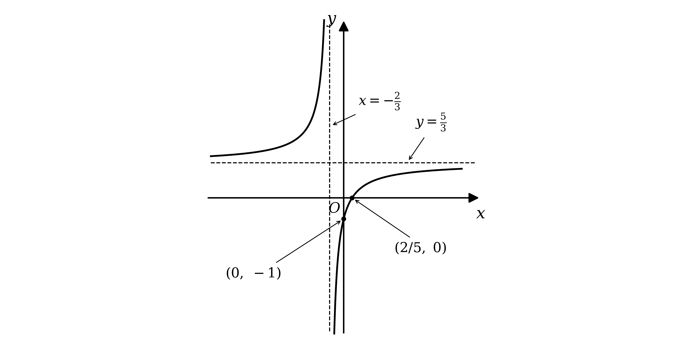

**[B1] [B1] [B1]**

> **[mark-scheme]**
> **B1**: The curve drawn in the correct quadrants, with one branch either side of the vertical asymptote and neither branch crossing an asymptote.
> 
> **B1**: Both crossings with the coordinate axes labelled. This follows through from your answers to part (a).
> 
> **B1**: Both asymptotes drawn and marked with their equations. This follows through from your answers to part (b).
> 
> The asymptotes may be dashed or solid. Intention is marked, so a freehand curve of the right shape in the right places is accepted.

> **[exam-tip]**
> All three marks are for things parts (a) and (b) have already given you.
> 
> - The shape, the two labelled crossings, and the two labelled asymptotes
> - Nothing here needs a new calculation, so it is worth doing even if the algebra later defeats you
> 
> Rewriting the curve as `\frac{5}{3} - \frac{16}{3 \left(3 x + 2\right)}` settles which side of the horizontal asymptote each branch goes.
> 
> - For $x > - \frac{2}{3}$ the fraction is positive and is being subtracted, so that branch lies below $y = \frac{5}{3}$
> - Both branches on the same side is the usual way to lose the first mark
> 
> Label the asymptotes with their equations.
> 
> - A dashed line in the right place with nothing written next to it does not earn its mark
> 
> Both crossings are on the same branch, which is a useful check.
> 
> - $\frac{2}{5}$ and 0 are both greater than $- \frac{2}{3}$, so the branch through them is the right-hand one

### 10((d)) — 11 marks
Parallel lines have equal gradients, so start by finding the gradient of the given line

Rearranging $4 y - x - 7 = 0$ gives $y = \frac{x}{4} + \frac{7}{4}$

$m = \frac{1}{4}$

**[B1]**

The gradient of $C$ at $A$ must equal that, so differentiate $C$ using the quotient rule

`\frac{\text{d} y}{\text{d} x} = \frac{5 \left(3 x + 2\right) - 3 \left(5 x - 2\right)}{\left(3 x + 2\right)^{2}}`

**[M1] [M1]**

Expand the numerator and collect the terms

- $15 x + 10 - 15 x + 6$, and the two terms in $x$ cancel

`\frac{\text{d} y}{\text{d} x} = \frac{16}{\left(3 x + 2\right)^{2}}`

**[A1]**

Set the derivative equal to $\frac{1}{4}$ and solve for $x$

`\frac{16}{\left(3 x + 2\right)^{2}} = \frac{1}{4}`

Cross-multiply, then take the square root of both sides

`\left(3 x + 2\right)^{2} = 64`

$3 x + 2 = \pm 8$

**[M1]**

That gives two values, and the stem says the $x$ coordinate of $A$ is positive

- $3 x + 2 = 8$ gives $x = 2$, and $3 x + 2 = - 8$ gives $x = - \frac{10}{3}$, which is rejected

Substitute $x = 2$ into the equation of $C$ to find the $y$ coordinate

`y = \frac{5 \left(2\right) - 2}{3 \left(2\right) + 2}`

`A = \left(2 , 1\right)`

**[A1]**

The normal is perpendicular to the tangent, so take the negative reciprocal of $\frac{1}{4}$

$m = - 4$

**[M1]**

Use `y - y_{1} = m \left(x - x_{1}\right)` through `A \left(2 , 1\right)`

`y - 1 = - 4 \left(x - 2\right)`

$y = - 4 x + 9$

**[M1]**

$E$ is where the normal meets the $y$-axis, so put $x = 0$

`E \left(0 , 9\right)`

$D$ is where it meets the $x$-axis, so put $y = 0$

$0 = - 4 x + 9$

`D \left(\frac{9}{4} , 0\right)`

**[A1]**

Now use the distance formula on $D$ and $E$

- The horizontal step is $\frac{9}{4}$ and the vertical step is 9

`D E = \sqrt{9^{2} + \left(\frac{9}{4}\right)^{2}}`

**[M1]**

Write both terms over 16

$D E = \sqrt{\frac{1296}{16}+\frac{81}{16}}$

$D E = \sqrt{\frac{1377}{16}}$

Take out the largest square factor, since $1377 = 81 \times 17$

$D E = \frac{9\sqrt{17}}{4}$

**[A1]**

> **[mark-scheme]**
> **B1**: $\frac{1}{4}$ seen anywhere in this part.
> 
> **M1**: An attempt to differentiate $y$. By the quotient rule the numerator must be the difference of two terms of the form `P \left(3 x + 2\right) - Q \left(5 x - 2\right)` with $P$ and $Q$ positive, either way round, and the denominator must be correct. By the product rule it must reach the form `P \left(3 x + 2\right)^{- 1} - Q \left(5 x - 2\right) \left(3 x + 2\right)^{- 2}`.
> 
> **M1**: Either term of that numerator correct. This mark depends on the previous one.
> 
> **A1**: A correct derivative. It may be left unsimplified.
> 
> **M1**: Sets your $\frac{1}{4}$ equal to your derivative and attempts to solve for $x$.
> 
> **A1**: $x = 2$ and $y = 1$.
> 
> **M1**: Finds the gradient of the normal as $\frac{-1}{\text{your}\frac{1}{4}}$.
> 
> **M1**: A complete and correct method to find the equation of the normal. Where the form $y = m x + c$ is used, a value of $c$ must be found. This mark depends on the previous one.
> 
> **A1**: `\left(0 , 9\right)` and `\left(\frac{9}{4} , 0\right)`. Accept $y = 9$ and $x = \frac{9}{4}$. This follows through from your equation of the normal.
> 
> **M1**: Correct use of the distance formula with your coordinates for $D$ and $E$. These need not have come from a normal.
> 
> **A1**: The correct exact length in its simplest form, $\frac{9\sqrt{17}}{4}$.
> 
> The product rule is an equally acceptable route to the derivative and is marked in the same way.
> 
> The negative root $x = - \frac{10}{3}$ is a genuine second solution of the gradient equation, and the stem excludes it only because the $x$ coordinate of $A$ is positive. It should be seen and rejected rather than never found.

> **[exam-tip]**
> Eleven marks, and the first one is a single line of rearranging.
> 
> - "Parallel to $4 y - x - 7 = 0$" just means a gradient of $\frac{1}{4}$, and that alone earns a mark
> 
> Simplify the derivative before using it.
> 
> - The two terms in $x$ in the numerator cancel, leaving `\frac{16}{\left(3 x + 2\right)^{2}}`, which makes the equation for $x$ far easier
> 
> Keep both square roots and then use the stem to choose.
> 
> - `\left(3 x + 2\right)^{2} = 64` gives $3 x + 2 = \pm 8$, so there are two candidate points
> - The condition that the $x$ coordinate of $A$ is positive is what picks $x = 2$, so say why you are rejecting the other
> 
> Remember the normal, not the tangent.
> 
> - The gradient of $C$ at $A$ is $\frac{1}{4}$, so the normal has gradient $- 4$
> - Using $\frac{1}{4}$ for the line through $D$ and $E$ loses four of the last five marks
> 
> Simplify the surd at the end.
> 
> - $\sqrt{\frac{1377}{16}}$ becomes $\frac{9\sqrt{17}}{4}$ because $1377 = 81 \times 17$
> - "Exact" and "simplified" both rule out a decimal, so $9 . 28$ scores nothing for the final mark

## Q8 — medium — 5 marks · exam-questions

### 3() — 5 marks
The graph already drawn is $y = \frac{x}{2} + \frac{4}{x^{2}}$, so the plan is to rearrange the equation until that expression stands alone on one side

Whatever is left on the other side will be the straight line, so call it $A x + B$ and find $A$ and $B$

$\frac{x}{2} + \frac{4}{x^{2}} = A x + B$

Multiply every term by $2 x^{2}$ to clear the two fractions

$x^{3} + 8 = 2 A x^{3} + 2 B x^{2}$

Collect everything on one side, so that it can be compared with the printed cubic

`x^{3} \left(1 - 2 A\right) - 2 B x^{2} + 8 = 0`

**[M1]**

Compare this with $3 x^{3} - 12 x^{2} + 8 = 0$, one coefficient at a time

- The constant term is 8 in both, which confirms the multiplier was the right one
- Comparing the $x^{3}$ terms gives $1 - 2 A = 3$
- Comparing the $x^{2}$ terms gives $- 2 B = - 12$

$A = - 1$

**[M1]**

$B = 6$

Substituting those back into $A x + B$ gives the straight line to draw

$y = 6 - x$

**[A1]**

Draw it right across the grid, through `\left(0 , 6\right)` and `\left(6 , 0\right)`

- Where it crosses the curve, the two sides of the equation are equal, and those $x$ values are the roots

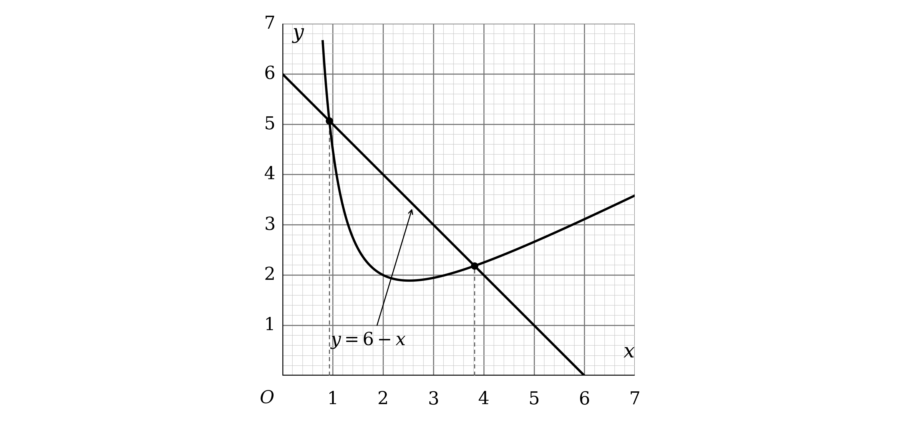

**[M1]**

Read off the $x$ coordinate of each crossing, to 1 decimal place

$x=0.9,x=3.8$

**[A1]**

> **[mark-scheme]**
> **M1**: Sets the printed curve equal to $A x + B$ and clears the fractions to reach `x^{3} \left(1 - 2 A\right) - 2 B x^{2} + 8 = 0`, or an equivalent.
> 
> **M1**: Compares that with $3 x^{3} - 12 x^{2} + 8 = 0$ and attempts to find $A$ and $B$.
> 
> **A1**: $A = - 1$ and $B = 6$, so the line is $y = 6 - x$.
> 
> **M1**: Draws the line with equation $y = 6 - x$ on the grid.
> 
> **A1**: $x = 0 . 9$ and $x = 3 . 8$. Accept readings within one small square of each value, since both are read from the graph.
> 
> Dividing the cubic through by $2 x^{2}$ is an equally acceptable route and earns the same three opening marks. That gives $\frac{3x}{2} - 6 + \frac{4}{x^{2}} = 0$, and moving the terms that are not part of the curve across leads to the same line.
> 
> Both roots are required for the accuracy mark.

> **[exam-tip]**
> "By drawing a suitable straight line" tells you the plan: rearrange until one side is exactly the $y$ of the curve you already have.
> 
> - Whatever is left on the other side is the line, and it always comes out linear
> 
> Setting the curve equal to $A x + B$ turns the rearranging into a comparison of coefficients.
> 
> - That is often easier than trying to divide the cubic by the right thing first time
> - The constant term matching, 8 in both, is a free check that the multiplier was correct
> 
> Draw the line right across the grid with a ruler.
> 
> - $y = 6 - x$ passes through `\left(0 , 6\right)` and `\left(6 , 0\right)`, both of which are on the printed grid
> - A short line stopping near the curve makes the crossings hard to read
> 
> There are two crossings in this interval, so give two roots.
> 
> - The curve is steep near $x = 0 . 9$, so read that one carefully, and remember the answer is only as good as the drawing

## Q9 — medium — 16 marks · exam-questions

### 10((a)) — 2 marks
**(i)**

$P$ is on the $x$-axis, so $y = 0$ there, and a fraction is zero only when its numerator is zero

$6 - 3 x = 0$

$x = 2$

`P \left(2 , 0\right)`

**[B1]**

**(ii)**

$Q$ is on the $y$-axis, so substitute $x = 0$

`y = \frac{6 - 3 \left(0\right)}{0 - 4}`

$y = \frac{6}{-4}$

Cancel the fraction down

`Q \left(0 , - \frac{3}{2}\right)`

**[B1]**

> **[mark-scheme]**
> **B1**: States $y = 0$ and $x = 2$, or gives `\left(2 , 0\right)`, or states $x = 2$ clearly.
> 
> **B1**: States $x = 0$ and $y = - \frac{3}{2}$, or gives `\left(0 , - \frac{3}{2}\right)`, or states $y = - \frac{3}{2}$ clearly. Any equivalent value is accepted, including $- \frac{6}{4}$ and $- 1 . 5$.
> 
> Where the two answers are not labelled, they are marked in the order they are written.

> **[exam-tip]**
> The two crossings come from two different halves of the fraction.
> 
> - On the $x$-axis $y = 0$, so the numerator must be zero
> - On the $y$-axis $x = 0$, which is a straight substitution
> 
> Do not cancel the fraction before substituting.
> 
> - $\frac{6-3x}{x-4}$ has no common factor, so there is nothing to simplify first
> 
> Watch the sign of $Q$.
> 
> - The denominator at $x = 0$ is $- 4$, so $y$ comes out negative
> - A positive answer here puts the curve in the wrong quadrant in part (c)
> 
> Label which answer is which.
> 
> - Unlabelled answers are marked in the order written, so putting them the wrong way round costs both marks

### 10((b)) — 2 marks
**(i)**

An asymptote parallel to the $y$-axis is a vertical line, and a vertical asymptote sits where the denominator is zero

$x - 4 = 0$

$x = 4$

**[B1]**

**(ii)**

An asymptote parallel to the $x$-axis is the value $y$ approaches as $x$ becomes very large, which is the ratio of the two $x$ coefficients

Divide the numerator and the denominator by $x$

$y = \frac{\frac{6}{x}-3}{1-\frac{4}{x}}$

As $x$ grows in either direction, $\frac{6}{x}$ and $\frac{4}{x}$ both shrink towards zero

$y = - 3$

**[B1]**

> **[mark-scheme]**
> **B1**: $x = 4$.
> 
> **B1**: $y = - 3$.
> 
> Both answers must be given as equations, since the question asks for the equations of the asymptotes.
> 
> Where they are not labelled to the right sub parts, they are marked in the order they are written.
> 
> The stem already gives $x \neq 4$, so the vertical asymptote may be written straight down.

> **[exam-tip]**
> The two asymptotes come from two different features of the fraction.
> 
> - The vertical one is where the denominator is zero, so $x = 4$
> - The horizontal one is the ratio of the $x$ coefficients, $\frac{-3}{1}$, so $y = - 3$
> 
> The stem hands you the first one.
> 
> - "$x \neq 4$" is there because the curve is undefined at 4, which is exactly what makes it a vertical asymptote
> 
> Get the sign of the horizontal asymptote right.
> 
> - The numerator is $6 - 3 x$, so its $x$ coefficient is $- 3$, giving $y = - 3$ and not $y = 3$
> 
> Give equations, not bare numbers.
> 
> - $x = 4$ and $y = - 3$ are lines; 4 and $- 3$ on their own are not

### 10((c)) — 3 marks
Collect together what parts (a) and (b) have found

- The asymptotes are $x = 4$ and $y = - 3$
- The crossings are `P \left(2 , 0\right)` and `Q \left(0 , - \frac{3}{2}\right)`

To see the shape, rewrite the equation as a constant plus a single fraction

- Dividing $6 - 3 x$ by $x - 4$ leaves a remainder, and the result is $- 3 - \frac{6}{x-4}$

$y = - 3 - \frac{6}{x-4}$

This is a negative reciprocal curve with two branches, one either side of $x = 4$

- To the left of $x = 4$ the fraction is negative, so subtracting it puts the curve above $y = - 3$
- To the right of $x = 4$ the curve lies below $y = - 3$

Both $P$ and $Q$ have $x$ less than 4, so both sit on the left branch

Now draw the two asymptotes as dashed lines, label them, mark $P$ and $Q$, and sketch a branch on each side

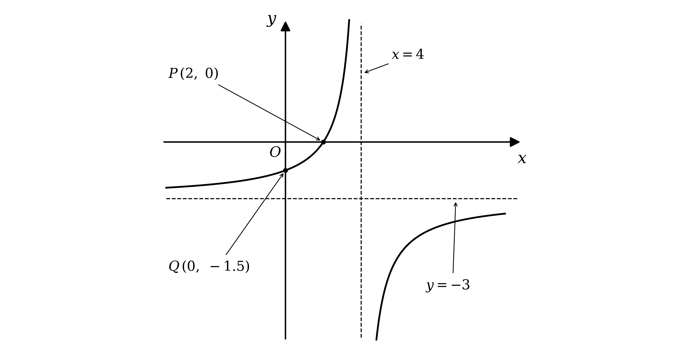

**[B1] [B1] [B1]**

> **[mark-scheme]**
> **B1**: A negative reciprocal curve with two branches, neither of which crosses an asymptote or obviously bends back away from one.
> 
> **B1**: Both asymptotes drawn in the correct places and labelled with their equations. This follows through from your answers to part (b).
> 
> **B1**: $P$ and $Q$ shown correctly on the curve, either as coordinates or as labelled values on the axes. This follows through from your answers to part (a).
> 
> The asymptotes may be dashed or solid. Intention is marked, so a freehand curve of the right shape in the right quadrants is accepted.

> **[exam-tip]**
> All three marks are for things parts (a) and (b) have already given you.
> 
> - The shape, the two asymptotes, and the two crossings
> - Nothing here needs a new calculation
> 
> Writing the curve as $- 3 - \frac{6}{x-4}$ tells you which side of $y = - 3$ each branch goes.
> 
> - For $x < 4$ the fraction is negative, so subtracting it lifts the curve above $- 3$
> - Putting both branches on the same side of the horizontal asymptote is the usual way to lose the first mark
> 
> Draw the asymptotes first, then fit the branches to them.
> 
> - A branch that touches or crosses a dashed line loses the mark however good the rest of the sketch is
> 
> The two crossings are both on the same branch.
> 
> - $P$ at $x = 2$ and $Q$ at $x = 0$ are both left of $x = 4$, which is a quick check that your left branch is the one passing through them

### 10((d)) — 6 marks
A normal is perpendicular to the tangent, so start by differentiating $C$

Use the quotient rule on $y = \frac{6-3x}{x-4}$

`\frac{\text{d} y}{\text{d} x} = \frac{- 3 \left(x - 4\right) - \left(6 - 3 x\right) \left(1\right)}{\left(x - 4\right)^{2}}`

**[M1] [A1]**

Expand the numerator and collect the terms

- $- 3 x + 12 - 6 + 3 x$, and the two terms in $x$ cancel

`\frac{\text{d} y}{\text{d} x} = \frac{6}{\left(x - 4\right)^{2}}`

**[A1]**

Substitute $x = 2$ to get the gradient of the tangent there

`\frac{\text{d} y}{\text{d} x} = \frac{6}{\left(2 - 4\right)^{2}}`

$\frac{\text{d}y}{\text{d}x} = \frac{3}{2}$

Perpendicular gradients multiply to $- 1$, so take the negative reciprocal

$m = - \frac{2}{3}$

**[M1]**

The point on $C$ where $x = 2$ is `P \left(2 , 0\right)` from part (a), so use `y - y_{1} = m \left(x - x_{1}\right)`

`y - 0 = - \frac{2}{3} \left(x - 2\right)`

**[M1]**

Multiply through by 3 and collect the terms

$3 y + 2 x - 4 = 0$

**[A1]**

> **[mark-scheme]**
> **M1**: An expression of the form `\frac{- a \left(x - 4\right) - \left(6 - 3 x\right) \times b}{\left(x - 4\right)^{2}}`, or an equivalent, so the shape of the quotient rule is right.
> 
> **A1**: One of the two products in the numerator fully correct.
> 
> **A1**: A fully correct derivative. It need not be simplified.
> 
> **M1**: Substitutes $x = 2$ into your derivative and finds the gradient of the normal. The substitution must be into a differentiated expression, and if your expression will not accept $x = 2$ this mark cannot be given. It does not depend on the earlier marks.
> 
> **M1**: A complete and correct method to find the equation of the normal, using your gradient together with $y = 0$ and $x = 2$. Where the form $y = m x + c$ is used, a value of $c$ must be found. This mark depends on the previous one.
> 
> **A1**: Any correct equation for $L$, in any form, and it may be left unsimplified.
> 
> The product rule is an equally acceptable route to the derivative, differentiating `\left(6 - 3 x\right) \left(x - 4\right)^{- 1}`, and is marked in the same way.
> 
> Because the point is $P$, whose coordinates part (a) has already found, no substitution into $C$ is needed to get the $y$ value here.

> **[exam-tip]**
> A normal takes two steps, and the first one is the tangent.
> 
> - Differentiate and substitute to get the gradient of the tangent, which is $\frac{3}{2}$ here
> - Then take the negative reciprocal, giving $- \frac{2}{3}$
> - Stopping at the tangent gradient is the commonest error in this topic
> 
> Simplify the derivative before substituting.
> 
> - The two terms in $x$ in the numerator cancel, leaving just `\frac{6}{\left(x - 4\right)^{2}}`, which is far easier to evaluate
> 
> The point is already known.
> 
> - $x = 2$ on $C$ is the point $P$ from part (a), so $y = 0$ and there is nothing to substitute
> 
> Any correct form of the equation earns the last mark.
> 
> - $3 y + 2 x - 4 = 0$, $y = - \frac{2}{3} x + \frac{4}{3}$ and $3 y = - 2 x + 4$ are all accepted, so do not lose time tidying it

### 10((e)) — 3 marks
$R$ is where $L$ meets $C$ again, so solve the two equations together

Rearrange the equation of $L$ from part (d) to make $y$ the subject

$y = \frac{4-2x}{3}$

Set that equal to the equation of $C$

$\frac{6-3x}{x-4} = \frac{4-2x}{3}$

**[M1]**

Multiply both sides by `3 \left(x - 4\right)` to clear the fractions

`3 \left(6 - 3 x\right) = \left(4 - 2 x\right) \left(x - 4\right)`

Expand both sides

$18 - 9 x = - 2 x^{2} + 12 x - 16$

Collect everything on the side that leaves the $x^{2}$ term positive

$2 x^{2} - 21 x + 34 = 0$

Factorise

- The $x$ terms must multiply to $2 x^{2}$ and the constants to $+ 34$, and $- 17$ with $- 2$ gives the middle term $- 4 x - 17 x$, which is $- 21 x$

`\left(2 x - 17\right) \left(x - 2\right) = 0`

**[M1]**

Set each bracket equal to zero

$x = \frac{17}{2} , x = 2$

$x = 2$ is the point $P$, where $L$ touches $C$ to begin with, so the other root is $R$

$x = \frac{17}{2}$

**[A1]**

> **[mark-scheme]**
> **M1**: Sets your equation of $L$ equal to the equation of $C$ and clears the fractions.
> 
> **M1**: Rearranges to a three term quadratic and makes a complete attempt to solve it.
> 
> **A1**: The $x$ coordinate of $R$ is $\frac{17}{2}$, or any equivalent value.
> 
> Any complete method of solution earns the second method mark: factorising, the quadratic formula, or completing the square.
> 
> The quadratic has two roots and only one of them is $R$. The root $x = 2$ is $P$, which the question has already named, so an answer of 2 does not earn the accuracy mark.
> 
> This follows through from your equation of $L$ in part (d).

> **[exam-tip]**
> The word "again" is the important one in this part.
> 
> - $L$ already meets $C$ at $P$, so $x = 2$ must be one of the two roots
> - Finding it is a useful check that your equation of $L$ is right, but it is not the answer
> 
> That known root also gives you a shortcut.
> 
> - Since `\left(x - 2\right)` has to be a factor of $2 x^{2} - 21 x + 34$, the other factor is forced to be `\left(2 x - 17\right)`
> 
> Clear both fractions in one step.
> 
> - Multiplying by `3 \left(x - 4\right)` removes them together, whereas cross-multiplying one at a time invites sign errors
> 
> Only the $x$ coordinate is asked for.
> 
> - There is no need to find the $y$ coordinate of $R$, and no marks for it

## Q10 — medium — 9 marks · exam-questions

### 3((a)) — 2 marks
An asymptote parallel to the $x$-axis is a horizontal line, and it is the value $y$ approaches as $x$ becomes very large

Divide the numerator and the denominator of $\frac{ax+3}{1-2x}$ by $x$

$y = \frac{a+\frac{3}{x}}{\frac{1}{x}-2}$

As $x$ grows in either direction, $\frac{3}{x}$ and $\frac{1}{x}$ both shrink towards zero, leaving the ratio of the two $x$ coefficients

Set that equal to the given asymptote

$\frac{a}{-2} = 4$

**[M1]**

Multiply both sides by $- 2$

$a = - 8$

**[A1]**

> **[mark-scheme]**
> **M1**: Forms the equation $\frac{a}{-2} = 4$, or an equivalent. Reasoning with a large value of $x$ to deduce the ratio is equally acceptable.
> 
> **A1**: $a = - 8$.
> 
> The horizontal asymptote of $\frac{ax+3}{1-2x}$ is the ratio of the coefficients of $x$, so the constant 3 plays no part in this and can be ignored throughout.

> **[exam-tip]**
> For a fraction with a linear top and a linear bottom, the horizontal asymptote is the ratio of the two $x$ coefficients.
> 
> - Here that is $\frac{a}{-2}$, and the constants 3 and 1 have no effect on it at all
> 
> The minus sign is the whole difficulty.
> 
> - The denominator is $1 - 2 x$, so the coefficient of $x$ is $- 2$, not $2$
> - Missing it gives $a = 8$ and every later part comes out with the wrong signs
> 
> Check your value by substituting a large number.
> 
> - With $a = - 8$ and $x = 1000$, $y = \frac{-7997}{-1999}$, which is close to 4 as it should be

### 3((b)) — 1 marks
An asymptote parallel to the $y$-axis is a vertical line, and a vertical asymptote sits where the denominator is zero

$1 - 2 x = 0$

Solve for $x$

$x = \frac{1}{2}$

**[B1]**

> **[mark-scheme]**
> **B1**: $x = \frac{1}{2}$. Accept $x = 0 . 5$.
> 
> The answer must be given as an equation, since the question asks for the equation of a line.
> 
> The stem already states $x \neq \frac{1}{2}$, so the value may be written straight down with no working.

> **[exam-tip]**
> The stem has already told you the answer, if you notice it.
> 
> - "$x \neq \frac{1}{2}$" is there precisely because the curve is undefined at that value, which is what makes it the vertical asymptote
> 
> A vertical asymptote always comes from setting the denominator to zero.
> 
> - $1 - 2 x = 0$ gives $x = \frac{1}{2}$, and this works for any fraction of this shape
> 
> Give an equation, not a number.
> 
> - The answer is $x = \frac{1}{2}$, since a bare $\frac{1}{2}$ is not the equation of a line

### 3((c)) — 2 marks
Part (a) gives the equation of $C$ as $y = \frac{-8x+3}{1-2x}$

**(i)**

A curve crosses the $x$-axis where $y = 0$, and a fraction is zero only when its numerator is zero

$- 8 x + 3 = 0$

$x = \frac{3}{8}$

`\left(\frac{3}{8} , 0\right)`

**[B1]**

**(ii)**

A curve crosses the $y$-axis where $x = 0$, so substitute that in

`y = \frac{- 8 \left(0\right) + 3}{1 - 2 \left(0\right)}`

$y = \frac{3}{1}$

`\left(0 , 3\right)`

**[B1]**

> **[mark-scheme]**
> **B1**: `\left(\frac{3}{8} , 0\right)`. This follows through from your own value of $a$ in part (a).
> 
> **B1**: `\left(0 , 3\right)`.
> 
> Each answer may be given as a coordinate pair or as a single value clearly attached to the right axis.
> 
> The $y$-axis crossing does not depend on $a$ at all, because substituting $x = 0$ removes the term containing it. So it is available even if part (a) went wrong.

> **[exam-tip]**
> The two crossings come from two different halves of the fraction.
> 
> - $y = 0$ needs the numerator to be zero, so it is the top that matters
> - $x = 0$ is a straight substitution, and the answer is just the ratio of the two constants
> 
> The second mark is free of part (a).
> 
> - Substituting $x = 0$ kills the $a x$ term, so `\left(0 , 3\right)` is correct whatever value of $a$ you found
> 
> Keep the fraction exact.
> 
> - $\frac{3}{8}$ is the answer, not $0 . 4$, and part (d) needs it as a fraction to label the axis
> 
> Both crossings are needed for the sketch.
> 
> - Two of the four marks in part (d) depend on these being right, so check them by substituting back

### 3((d)) — 4 marks
Collect together what the earlier parts have found

- The asymptotes are $y = 4$ from the stem and $x = \frac{1}{2}$ from part (b)
- The crossings are `\left(\frac{3}{8} , 0\right)` and `\left(0 , 3\right)` from part (c)

To see the shape, rewrite the equation as a constant plus a single fraction

- Dividing $- 8 x + 3$ by $1 - 2 x$ leaves a remainder, and the result is $4 + \frac{1}{2x-1}$

$y = 4 + \frac{1}{2x-1}$

This is a reciprocal curve with two branches, one either side of $x = \frac{1}{2}$

- To the right of $x = \frac{1}{2}$ the fraction is positive, so the curve lies above $y = 4$
- To the left of $x = \frac{1}{2}$ the curve lies below $y = 4$

Both crossings have $x$ less than $\frac{1}{2}$, so both sit on the left branch, which is a useful check

Now draw the two asymptotes as dashed lines, label them, mark the two crossings, and sketch a branch on each side

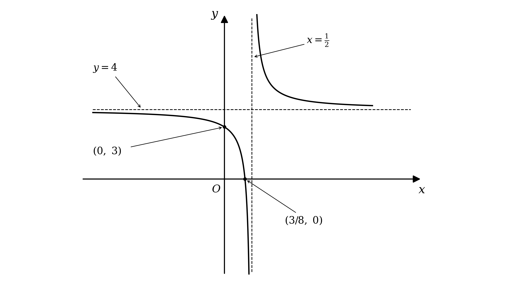

**[B1] [B1] [B1] [B1]**

> **[mark-scheme]**
> **B1**: An asymptote drawn at $y = 4$. It must either be clearly labelled with its equation or pass through the $y$-axis with 4 clearly labelled.
> 
> **B1**: An asymptote drawn at $x = \frac{1}{2}$, under the same condition: either labelled with its equation or passing through the $x$-axis with $\frac{1}{2}$ labelled. This follows through from your own answer to part (b).
> 
> **B1**: A correct curve drawn with two branches. This follows through from your own asymptotes.
> 
> **B1**: $\frac{3}{8}$ and 3 labelled on the $x$-axis and the $y$-axis respectively. This follows through from your own answers to part (c).
> 
> The asymptotes may be shown as dashed or solid lines. A branch that crosses an asymptote, or obviously bends back away from one, does not earn the curve mark.

> **[exam-tip]**
> Every one of these four marks is for something the earlier parts have already given you.
> 
> - Two asymptotes, the shape, and the two labelled crossings
> - Nothing here needs a new calculation, so this is a part to get right even if the algebra earlier was shaky
> 
> Each asymptote mark requires it to be identifiable.
> 
> - Write $y = 4$ and $x = \frac{1}{2}$ beside the dashed lines, or label the value where each meets an axis
> - An unlabelled dashed line in the right place does not earn its mark
> 
> Work out which side of the horizontal asymptote each branch goes.
> 
> - Writing the curve as $4 + \frac{1}{2x-1}$ settles it: for $x > \frac{1}{2}$ the fraction is positive, so that branch is above $y = 4$
> 
> The two crossings are close together, so draw them clearly.
> 
> - Both have $x$ below $\frac{1}{2}$, so both belong on the same branch, and separating them on the page matters more than getting the scale right

## Q11 — medium — 10 marks · exam-questions

### 7((a)) — 2 marks
Substitute each missing value of $x$ into `y = 0 . 5^{\left(\frac{x}{3} + 1\right)} + 2`

- Work out the index first, then the power, then add 2

For $x = - 3$ the index is $\frac{-3}{3} + 1 = 0$

$y = 0 . 5^{0} + 2$

$y = 3$

For $x = - 2$ the index is $\frac{-2}{3} + 1 = \frac{1}{3}$

$y = 0 . 5^{\frac{1}{3}} + 2$

$y = 2 . 7937 \dots$

For $x = - 1$ the index is $\frac{-1}{3} + 1 = \frac{2}{3}$

$y = 0 . 5^{\frac{2}{3}} + 2$

$y = 2 . 6299 \dots$

Round to 2 decimal places where the value is not exact

| $x$ | -6 | -5 | -4 | -3 | -2 | -1 | 0 |
|---|---|---|---|---|---|---|---|
| $y$ | 4 | 3.59 | 3.26 | **Final answer:** **3** | **Final answer:** **2.79** | **Final answer:** **2.63** | 2.5 |

**[B1 B1]**

> **[mark-scheme]**
> **B1**: Two of the three missing values correct.
> 
> **B1**: All three missing values correct to 2 decimal places. Allow 3.0 or 3.00 in place of 3.

> **[exam-tip]**
> A negative $x$ makes the index smaller, and a base below 1 means a smaller index gives a larger value.
> 
> - That is why this curve falls from left to right, unlike the usual growth curve
> 
> The entry at $x = - 3$ is worth spotting quickly.
> 
> - The index becomes exactly 0 there, and anything to the power 0 is 1, so $y = 3$ with no calculator needed

### 7((b)) — 2 marks
Plot the seven points from the table, then join them with a single smooth curve

- Plot each point to within half a small square
- The curve falls steadily and flattens out towards the right, so it must be a smooth curve rather than joined straight segments

**[B1 B1]**

> **[mark-scheme]**
> **B1**: All seven points plotted within half a small square. Follow through from an incorrect table in part (a).
> 
> **B1**: A smooth curve drawn through your plotted points, not straight line segments. Follow through from part (a).

> **[exam-tip]**
> Both marks here follow through from your table, so an arithmetic slip in part (a) does not cost you again.
> 
> - Plot what you actually worked out, and join it smoothly
> 
> The curve is quite flat on the right, so take care over the last few points.
> 
> - Between $x = - 2$ and $x = 0$ the value only drops by about 0.3, which is a third of a large square

### 7((c)) — 6 marks
The graph you have drawn is `y = 0 . 5^{\left(\frac{x}{3} + 1\right)} + 2`, so rearrange the equation until that expression appears

Use the power law on the logarithm, then move the other terms across

`3 \text{log}_{2} \left(2 x + 2\right) = - x - 3`

**[M1]**

Divide through by 3

`\text{log}_{2} \left(2 x + 2\right) = - \frac{x}{3} - 1`

Write this in index form

`2 x + 2 = 2^{\left(- \frac{x}{3} - 1\right)}`

**[M1]**

A negative index means a reciprocal, and $2^{-1} = 0 . 5$, so the base can be changed to 0.5

`2 x + 2 = 0 . 5^{\left(\frac{x}{3} + 1\right)}`

**[M1]**

Add 2 to both sides, so that the right-hand side is exactly $y$

`2 x + 4 = 0 . 5^{\left(\frac{x}{3} + 1\right)} + 2`

**[A1]**

So the straight line to draw is $y = 2 x + 4$

- Where it crosses the curve, the two sides of the equation are equal, and that is the root

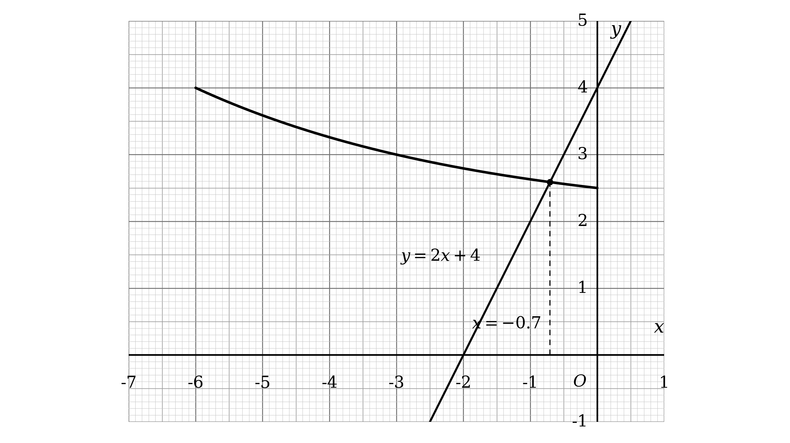

**[M1]**

Read off the $x$ coordinate of the intersection, to 1 decimal place

$x = - 0 . 7$

**[A1]**

> **[mark-scheme]**
> **M1**: Uses the power law to reach `3 \text{log}_{2} \left(2 x + 2\right) = - x - 3`, or the equivalent `\text{log}_{2} \left(2 x + 2\right) = - \frac{x}{3} - 1`.
> 
> **M1**: Writes your logarithm equation in index form, reaching `2 x + 2 = 2^{\left(- \frac{x}{3} - 1\right)}`.
> 
> **M1**: Converts the base to 0.5, reaching `2 x + 2 = 0 . 5^{\left(\frac{x}{3} + 1\right)}`. Changing base within the logarithms instead, to reach `\text{log}_{0 . 5} \left(2 x + 2\right) = \frac{x}{3} + 1`, scores this mark equally.
> 
> **A1**: Correct rearrangement `2 x + 4 = 0 . 5^{\left(\frac{x}{3} + 1\right)} + 2`.
> 
> **M1**: Identifies and draws the straight line $y = 2 x + 4$ on the grid.
> 
> **A1**: $x = - 0 . 7$. Accept $- 0 . 8$, since the value is read from a graph.

> **[exam-tip]**
> The instruction to draw a suitable straight line means: rearrange until one side is exactly the $y$ of the curve you already have.
> 
> - Whatever remains on the other side is the line, and it always turns out to be linear
> 
> The step that catches people out is the change of base at the end.
> 
> - Your curve uses base 0.5 but the equation uses base 2, and $2^{-n} = 0 . 5^{n}$ is what links them
> - Getting `2 x + 2 = 2^{\left(- \frac{x}{3} - 1\right)}` and stopping there leaves you with nothing you can draw
> 
> Draw the line right across the grid with a ruler, and read the intersection to 1 decimal place.
