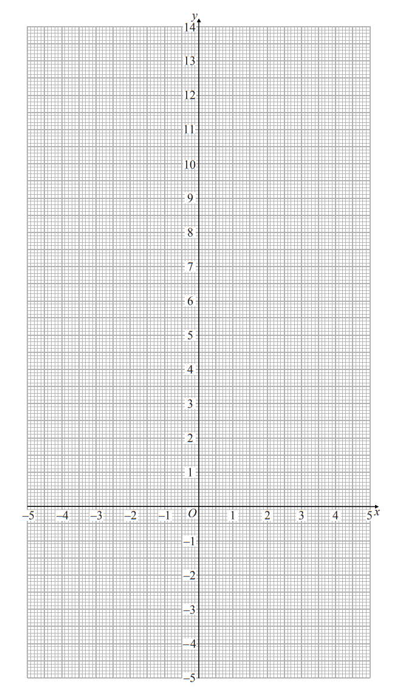
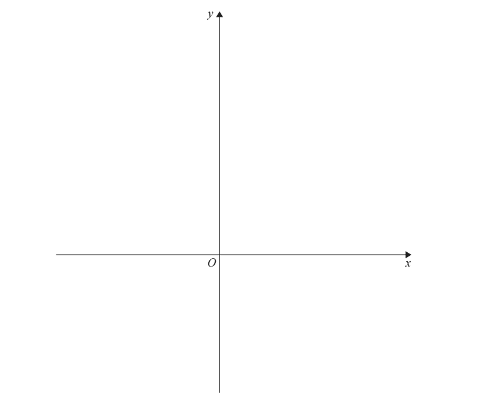
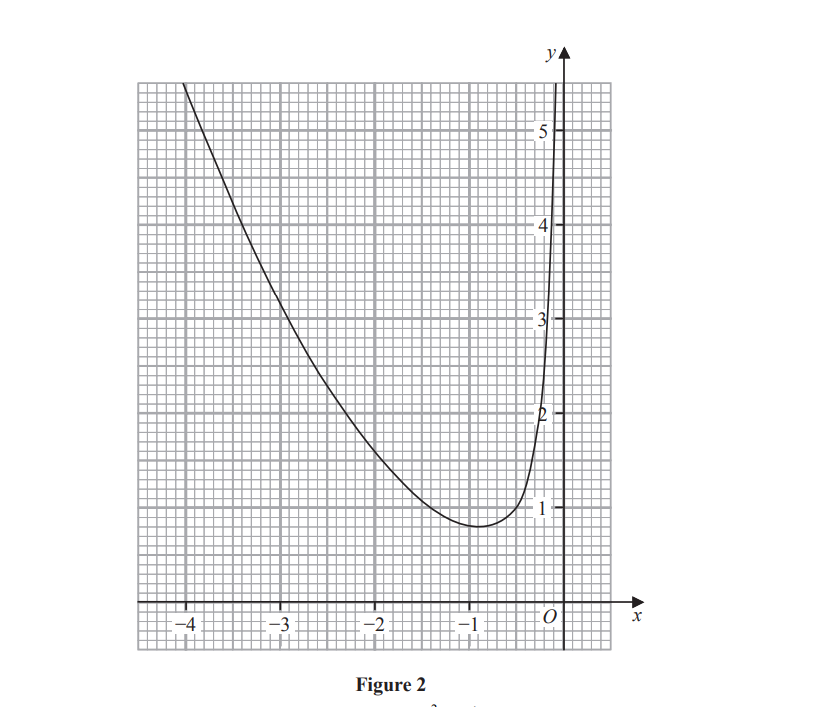
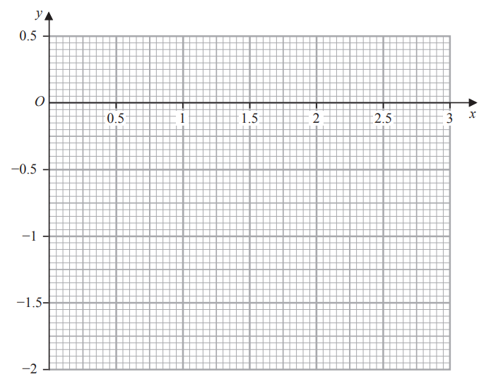
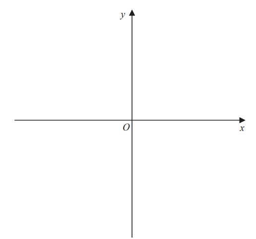
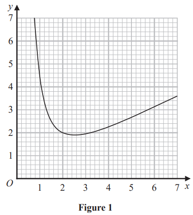
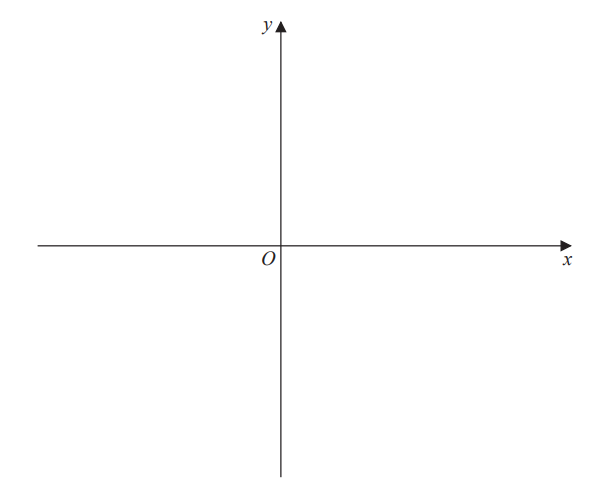
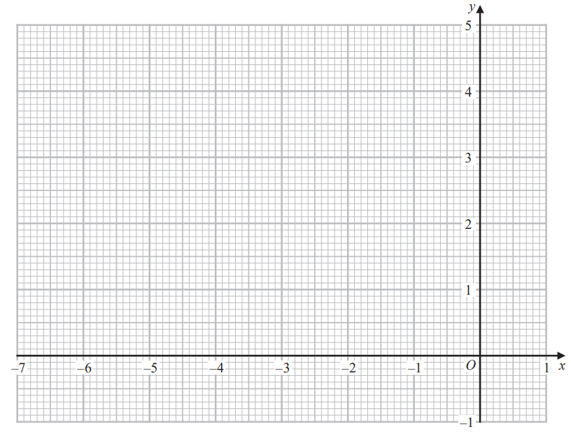

# Exam Questions — Graphs
**Coordinate Geometry & Graphs** · Edexcel IGCSE Further Pure Maths (4PM1)
> Source: [https://www.savemyexams.com/igcse/further-maths/edexcel/19/topic-questions/coordinate-geometry-and-graphs/graphs/exam-questions/](https://www.savemyexams.com/igcse/further-maths/edexcel/19/topic-questions/coordinate-geometry-and-graphs/graphs/exam-questions/) · 11 questions · total 115 marks

## Q1 — medium — 8 marks · exam-questions

### 7((a)) — 2 marks — structured — from paper Specimen · 4PM1/01
Complete the table of values for

`y space equals space 2 to the power of open parentheses x over 2 plus 1 close parentheses end exponent plus 1`

giving your answers to 2 decimal places where appropriate.

| $x$ | 0 | 1 | 2 | 3 | 4 | 5 |
|---|---|---|---|---|---|---|
| $y$ | 3 |   |   |   | 9 | 12.31 |

### 7((b)) — 2 marks — structured — from paper Specimen · 4PM1/01
On the grid, draw the graph of `y space equals space 2 to the power of open parentheses x over 2 plus 1 close parentheses end exponent plus 1` for `space 0 less-than or slanted equal to x space less-than or slanted equal to space 5`

### 7((c)) — 4 marks — structured — from paper Specimen · 4PM1/01
By drawing a suitable straight line on the grid, obtain an estimate, to 1 decimal place, of the root of the equation $\mathrm{log}_{2}(4x--6)^{2}--x=2$ in the interval `0 space less-than or slanted equal to space x space less-than or slanted equal to space 5`

## Q2 — medium — 8 marks · exam-questions

### 7((a)) — 3 marks — structured — from paper Specimen · Paper 2
The curve $C$ with equation

$y=\frac{ax-5}{x-b}$

where $a$ and $b$ are integers, crosses the $x$-axis at the point $(2.5,0)$.

The asymptote to $C$ which is parallel to the $y$-axis has equation $x=1$

(i) Show that $a=2$

(ii) Find the value of $b$.

### 7((b)) — 1 mark — structured — from paper Specimen · Paper 2
Find the coordinates of the point where $C$ crosses the $y$-axis.

### 7((c)) — 1 mark — structured — from paper Specimen · Paper 2
Find the equation of the asymptote to $C$ which is parallel to the $x$-axis.

### 7((d)) — 3 marks — structured — from paper Specimen · Paper 2
Using the axes below, sketch the curve $C$ showing clearly the asymptotes and the coordinates of the points where $C$ crosses the coordinate axes.

## Q3 — medium — 13 marks · exam-questions

### 7((a)) — 1 mark — structured — from paper June 2024 · Paper 1

Figure 1 shows a sketch of part of the curve $C$ with equation

$y=\frac{x^{2}}{4}-3\sqrt{x}+8$

The point $P$ lies on $C$ and has coordinates $(4,a)$

Show that $a=6$

### 7((b)) — 6 marks — structured — from paper June 2024 · Paper 1
The line $L$is the normal to $C$ at the point $P$

Show that an equation of $L$ is $5y+4x-46=0$

### 7((c)) — 6 marks — structured — from paper June 2024 · Paper 1
The finite region $R$ is bounded by the curve $C$, the line $L$, the $x$-axis and the line with equation $x=1$

Use calculus to find the exact area of $R$

## Q4 — medium — 16 marks · exam-questions

### 10((a)) — 2 marks — structured — from paper June 2024 · Paper 1
The curve $C$ has equation $y=\frac{ax-5}{b-x}$ where $a$ and $b$ are integers and $x\neqb$

One intersection of $C$ with the coordinate axes is at the point with coordinates `open parentheses 5 over 4 comma space 0 close parentheses`

The asymptote parallel to the $y$-axis has equation $x=3$

Find the value of $a$ and the value of $b$

### 10((b)) — 5 marks — structured — from paper June 2024 · Paper 1
Sketch $C$, showing clearly the asymptotes with their equations and the coordinates of the points of intersection with the coordinate axes.

### 10((c)) — 9 marks — structured — from paper June 2024 · Paper 1
The straight line $l$ with equation $4y-7x=k$ has no points of intersection with $C$

Show, using algebra, that the range of possible values of $k$ can be written as

$m<k<n$

where $m$ and $n$ are integers to be found.

## Q5 — medium — 4 marks · exam-questions

### 4() — 4 marks — structured — from paper June 2024 · Paper 2

Figure 2 shows part of the curve with equation $y=\frac{x^{2}}{3}-\frac{1}{2x}$ for $-4<x<0$

By drawing a suitable straight line on the grid, obtain estimates, to one decimal place, of the roots of the equation $4x^{3}+3x^{2}-36x-6=0$ in the interval $-4<x<0$

## Q6 — medium — 8 marks · exam-questions

### 4((a)) — 2 marks — structured — from paper November 2024 · Paper 2
Complete the table of values for  `y equals log subscript 10 open parentheses 6 x minus 1 close parentheses minus x` giving your answers to 2 decimal places.

| $x$ | 0.25 | 0.5 | 1 | 1.5 | 2 | 2.5 | 3 |
|---|---|---|---|---|---|---|---|
| $y$ |   | -0.20 | -0.30 | -0.60 |   |   |   |

### 4((b)) — 2 marks — structured — from paper November 2024 · Paper 2
On the grid opposite, draw the graph of `y equals log subscript 10 open parentheses 6 x minus 1 close parentheses minus x` for `0.25 less-than or slanted equal to x less-than or slanted equal to 3`

### 4((c)) — 4 marks — structured — from paper November 2024 · Paper 2
By drawing a suitable straight line on the grid, obtain an estimate, to one decimal place, of the root of the equation

$10^{\frac{3x-4}{2}}=6x-1$  in the interval   `0.25 less-than or slanted equal to x less-than or slanted equal to 3`

## Q7 — medium — 18 marks · exam-questions

### 10((a)) — 2 marks — structured — from paper November 2024 · Paper 2
A curve $C$ has equation

$y=\frac{5x-2}{3x+2}x\neq\frac{2}{3}$

Find the coordinates of the point where $C$ intersects the

(i) $x$-axis

[1]

(ii) $y$-axis

[1]

### 10((b)) — 2 marks — structured — from paper November 2024 · Paper 2
A curve $C$ has equation

$y=\frac{5x-2}{3x+2}x\neq\frac{2}{3}$

Write down an equation of the asymptote to $C$ that is

(i) parallel to the $x$-axis

[1]

(ii) parallel to the $y$-axis

[1]

### 10((c)) — 3 marks — structured — from paper November 2024 · Paper 2
Sketch  $C$ on the opposite page. 
Show and label the asymptotes and the coordinates of the points where  $C$ crosses the coordinate axes.

### 10((d)) — 11 marks — structured — from paper November 2024 · Paper 2
Point $A$ lies on $C$ such that the gradient of $C$ at  $A$is parallel to the line with equation $4y-x-7$

The normal to $C$ at  $A$intersects the $x$-axis at point $D$and the $y$-axis at point $E$ 
Given that the  $x$ coordinate of  $A$ is positive,

find, in its simplified form, the exact length of line $DE$

## Q8 — medium — 5 marks · exam-questions

### 3() — 5 marks — structured — from paper June 2023 · Paper 1

Figure 1 shows part of the curve with equation  $y=\frac{x}{2}+\frac{4}{x^{2}}$ in the interval  $0.8<x<7$

By drawing a suitable straight line on the grid, obtain an estimate, to one decimal place, of the roots of the equation $3x^{3}-12x^{2}+8=0$ in the interval $0.8<x<7$

## Q9 — medium — 16 marks · exam-questions

### 10((a)) — 2 marks — structured — from paper June 2023 · Paper 2
The curve $C$ with equation $y=\frac{6-3x}{x-4}$ where $x$≠ 4 , crosses the $x$-axis at the point $P$ and the $y$-axis at the point $Q$

Find the coordinates of

(i) $P$

(ii) $Q$

### 10((b)) — 2 marks — structured — from paper June 2023 · Paper 2
The curve $C$ with equation $y=\frac{6-3x}{x-4}$ where $x$≠ 4 , crosses the $x$-axis at the point $P$ and the $y$-axis at the point $Q$

Write down an equation of the asymptote to  $C$ which is

(i) parallel to the $y$-axis

(ii) parallel to the $x$-axis

### 10((c)) — 3 marks — structured — from paper June 2023 · Paper 2
The curve $C$ with equation $y=\frac{6-3x}{x-4}$ where $x$≠ 4 , crosses the $x$-axis at the point $P$ and the $y$-axis at the point $Q$

Sketch $C$ showing clearly the asymptotes and the coordinates of the points $P$ and $Q$

### 10((d)) — 6 marks — structured — from paper June 2023 · Paper 2
The line $L$ is the normal to $C$ at the point on $C$ where $x=2$

Find an equation of $L$

### 10((e)) — 3 marks — structured — from paper June 2023 · Paper 2
The line $L$ intersects $C$ again at the point $R$

Find the $x$ coordinate of $R$

## Q10 — medium — 9 marks · exam-questions

### 3((a)) — 2 marks — structured — from paper January 2023 · Paper 1
Curve $C$ has equation $y=\frac{ax+3}{1-2x}$ where $x\neq\frac{1}{2}$and $a$ is a constant.

The asymptote to $C$  that is parallel to the $x$‑axis has equation $y=4$

Find the value of $a$

### 3((b)) — 1 mark — structured — from paper January 2023 · Paper 1
Write down the equation of the asymptote to $C$ that is parallel to the $y$‑axis.

### 3((c)) — 2 marks — structured — from paper January 2023 · Paper 1
Find the coordinates of the point where $C$ crosses

(i) the $x$‑axis,

(ii)  the $y$‑axis.

### 3((d)) — 4 marks — structured — from paper January 2023 · Paper 1
Using the axes below, sketch $C$, showing clearly the asymptotes and the coordinates of the points where $C$ crosses the coordinate axes.

## Q11 — medium — 10 marks · exam-questions

### 7((a)) — 2 marks — structured — from paper January 2023 · Paper 1
Complete the table of values for

`y equals 0.5 to the power of open parentheses x over 3 plus 1 close parentheses end exponent plus 2`

giving each value to 2 decimal places where appropriate.

| $x$ | -6 | -5 | -4 | -3 | -2 | -1 | 0 |
|---|---|---|---|---|---|---|---|
| $y$ | 4 | 3.59 | 3.26 |   |   |   | 2.5 |

### 7((b)) — 2 marks — structured — from paper January 2023 · Paper 1
On the grid opposite, draw the graph of `y equals 0.5 to the power of open parentheses x over 3 plus 1 close parentheses end exponent plus 2`  for  `negative 6 less-than or slanted equal to x less-than or slanted equal to 0`

### 7((c)) — 6 marks — structured — from paper January 2023 · Paper 1
By drawing a suitable straight line on the grid, obtain an estimate, to one decimal place, of the root of the equation

$\mathrm{log}_{2}(2x+2)^{3}+x+3=0$  in the interval  `negative 6 less-than or slanted equal to x less-than or slanted equal to 0`

