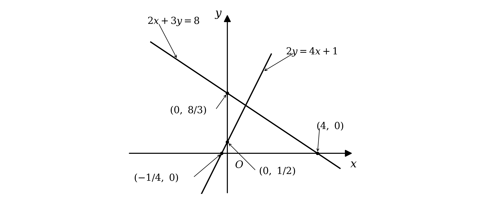
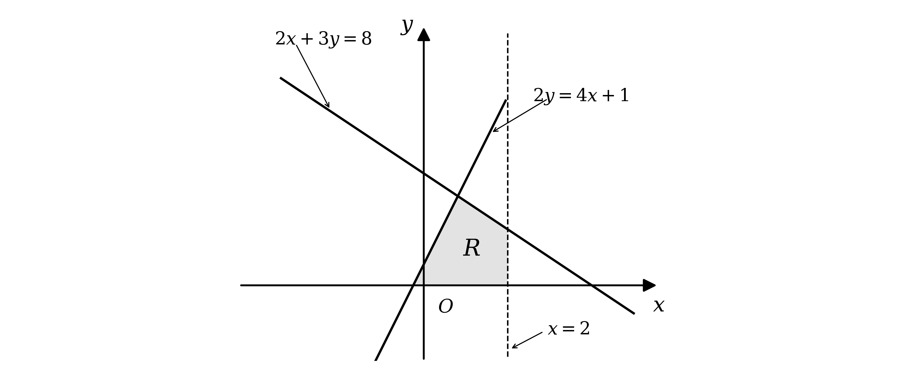
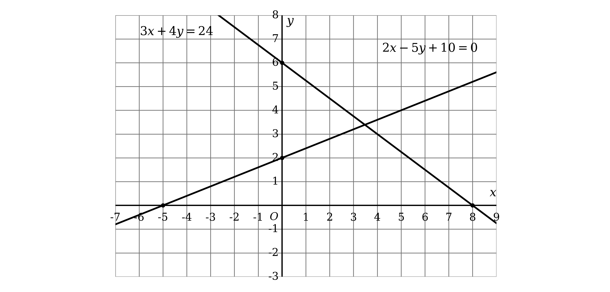
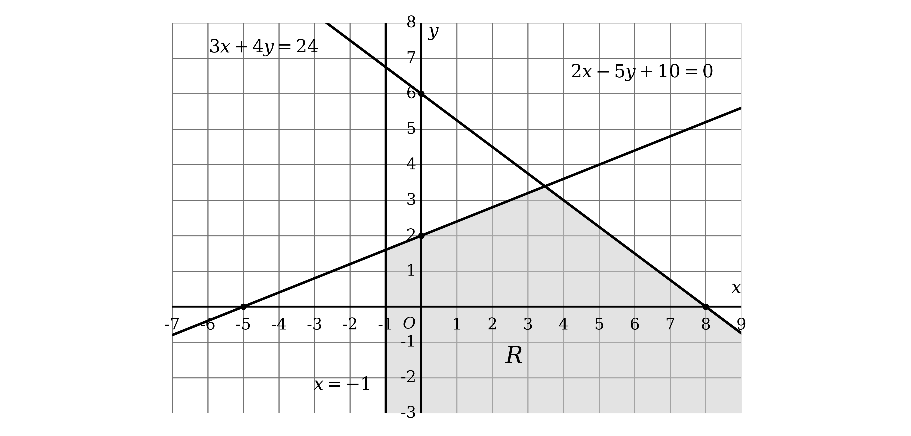
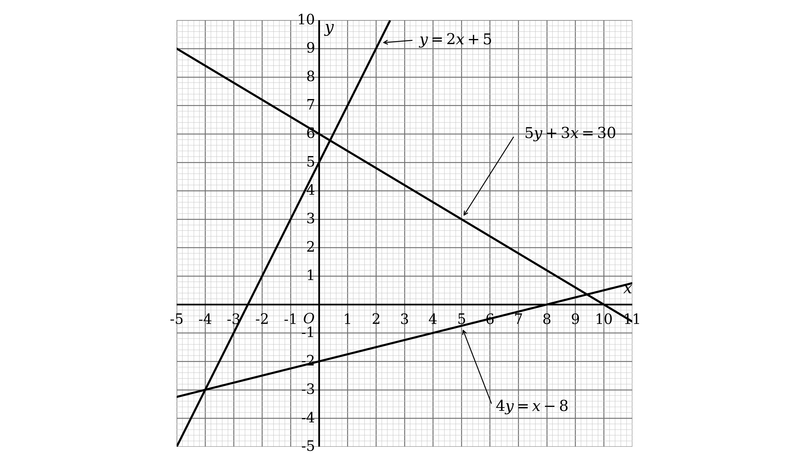
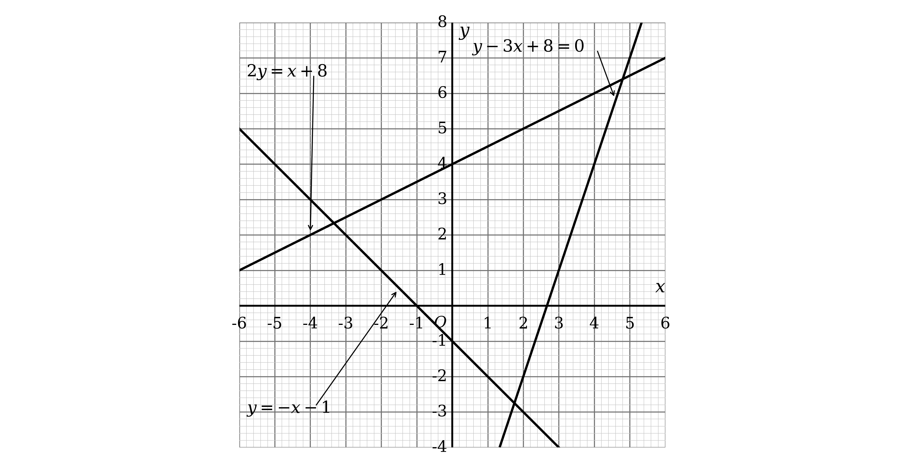
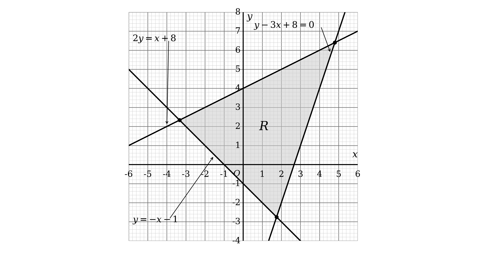

# Mark Schemes — Inequalities
**Equations, Identities & Inequalities** · Edexcel IGCSE Further Pure Maths (4PM1)

## Q1 — medium — 4 marks · exam-questions

### 1((a)) — 2 marks
This is a sketch, so it does not have to be drawn to scale, but each line must cross the axes in the right places

Find those crossing points by substituting $x = 0$ and then $y = 0$ into each equation

**The line** $2 x + 3 y = 8$

Substitute $x = 0$

$3 y = 8$

$y = \frac{8}{3}$

Substitute $y = 0$

$2 x = 8$

$x = 4$

So this line crosses the axes at `\left(0 , \frac{8}{3}\right)` and `\left(4 , 0\right)`

**The line** $2 y = 4 x + 1$

Substitute $x = 0$

$2 y = 1$

$y = \frac{1}{2}$

Substitute $y = 0$

$0 = 4 x + 1$

$x = - \frac{1}{4}$

So this line crosses the axes at `\left(0 , \frac{1}{2}\right)` and `\left(- \frac{1}{4} , 0\right)`

Draw each line through its own pair of crossing points, and label all four coordinates

**[B1] [B1]**

> **[mark-scheme]**
> **B1**: One line correctly drawn.
> 
> **B1**: Both lines correctly drawn.
> 
> So one correct line earns one mark, and you need both of them for the second.
> 
> Both marks are for the lines themselves. A line counts as correct if it crosses the axes in the right places, so show all four crossing points clearly. The official diagram labels them as values against the axes, $y = \frac{8}{3}$, $x = 4$, $y = \frac{1}{2}$ and $x = - \frac{1}{4}$, and coordinate pairs are equally acceptable.
> 
> A sketch does not have to be to scale, so do not lose marks worrying about accuracy. What must be right is the order of the crossing points along each axis, and the sign of each gradient: $2 x + 3 y = 8$ slopes down and $2 y = 4 x + 1$ slopes up.
> 
> The mark-scheme screenshot for this question covers both parts and is retained beneath part (b).

> **[exam-tip]**
> Rearranging into $y = m x + c$ is not the quickest route when a question gives you a line in a form like $2 x + 3 y = 8$.
> 
> - Substituting $x = 0$ and then $y = 0$ gives you the two points you need directly
> 
> A sketch still has to get the important features right, even though it is not drawn to scale.
> 
> - Keep the crossing points in the correct order along each axis
> - Give each line the correct sign of gradient
> 
> Fractional crossing points such as $- \frac{1}{4}$ are easy to lose. Draw one clearly separated from the origin even though that exaggerates the scale, so that it is obvious you have found it.

### 1((b)) — 2 marks
Part (a) has already drawn the two lines and labelled their axis crossings, so the sketch is ready to work on

Look at the four inequalities and identify the boundary line of each one

- $2 x + 3 y \leq 8$ and $2 y \leq 4 x + 1$ are bounded by the two lines already drawn
- $y \geq 0$ is bounded by the $x$-axis, which is on the sketch already
- $x \leq 2$ is bounded by the vertical line $x = 2$, which is the only one still to add

Decide which side of each boundary $R$ lies on by testing a point that is not on any of them

The origin will not do here, because it lies on the boundary $y = 0$, so use `\left(1 , 1\right)` instead

Substitute `\left(1 , 1\right)` into each inequality in turn

`2 \left(1\right) + 3 \left(1\right) = 5 \leq 8`

`2 \left(1\right) = 2 \leq 4 \left(1\right) + 1`

$1 \geq 0$

$1 \leq 2$

All four hold, so $R$ is the region on the same side of every boundary as `\left(1 , 1\right)`

Draw $x = 2$, then shade that region and label it $R$

$R$ comes out as a four sided region, closed on every side

**[B1] [B1]**

> **[mark-scheme]**
> **B1**: The line $x = 2$ correctly drawn.
> 
> **B1**: The correct region shaded, either in or out.
> 
> Only one new boundary is needed. Two of the four are the lines from part (a) and the third is the $x$-axis, which is already on the sketch.
> 
> Shading the region in and shading it out are both accepted, provided it is clear which you have done. Dotted and solid boundary lines are equally acceptable.
> 
> This follows through from the lines you drew in part (a), so a region that is correct for your own two lines earns the second mark.
> 
> The letter $R$ is not required for the mark, but the region you mean must be unambiguous, so label it anyway.

> **[exam-tip]**
> Check which boundaries are already on your sketch before drawing anything new.
> 
> - Two come from part (a) and one is the $x$-axis, so only $x = 2$ has to be added
> - The single mark for a drawn line is the easiest one in the question to forget
> 
> The origin is the usual test point, but it does not work every time.
> 
> - Here $y \geq 0$ has the $x$-axis as its boundary, and the origin sits on it, so the test is inconclusive
> - Pick any convenient point off all four boundaries instead, such as `\left(1 , 1\right)`
> 
> One test point settles all four inequalities at once.
> 
> - Substitute it into each one and see which are satisfied, rather than reasoning about each line separately
> 
> This is a sketch, so accuracy is not what is being marked.
> 
> - What matters is that $R$ is on the correct side of all four boundaries and that your shading makes clear which region you mean

## Q2 — medium — 5 marks · exam-questions

### 2((a)) — 1 marks
A linear inequality is rearranged in exactly the same way as a linear equation

Collect the terms in $x$ on one side and the numbers on the other

Subtract $x$ from both sides, then add 1 to both sides

$4 < x$

Read this the other way round, so that $x$ comes first

$x > 4$

**[B1]**

> **[mark-scheme]**
> **B1**: $x > 4$.
> 
> The inequality may be written either way round, so $4 < x$ is equally acceptable.
> 
> The sign must be strict. $x \geq 4$ does not earn the mark, because the original inequality is strict and nothing in the rearrangement changes that.

> **[exam-tip]**
> Treat a linear inequality exactly like an equation while you rearrange it.
> 
> - Adding or subtracting the same thing on both sides never affects the direction of the sign
> - Only multiplying or dividing by a negative number reverses it, and that does not happen here
> 
> Moving the $x$ terms to the side where they end up positive avoids that risk entirely.
> 
> - Subtracting $x$ from both sides leaves $4 < x$, with no negative division anywhere
> 
> Turn the answer round so that $x$ is on the left.
> 
> - $4 < x$ and $x > 4$ say the same thing, but writing it as $x > 4$ makes part (c) much easier to combine
> 
> Keep the sign strict.
> 
> - The question gives $<$, so the answer is $>$ and never $\geq$

### 2((b)) — 3 marks
A quadratic inequality has to be rearranged so that one side is zero before it can be solved

Expand the bracket and take the 6 across

$x^{2} - x - 6 > 0$

Factorise the left hand side

- Look for two numbers that multiply to $- 6$ and add to $- 1$, which are $- 3$ and 2

`\left(x - 3\right) \left(x + 2\right) > 0`

**[M1]**

The critical values are where each bracket is zero

$x=3,x=-2$

**[A1]**

Sketch or picture $y = x^{2} - x - 6$, a parabola opening upwards that crosses the $x$-axis at those two values

The question wants where it is above the axis, and a positive parabola is above the axis outside its two roots

$x<-2\mathrm{or}x>3$

**[B1]**

> **[mark-scheme]**
> **M1**: Rearranges to a three term quadratic with zero on one side and makes a complete attempt to solve it.
> 
> **A1**: Both critical values, $x = 3$ and $x = - 2$.
> 
> **B1**: The correct outside region, $x < - 2$ or $x > 3$.
> 
> Any complete method of solution earns the method mark: factorising, the quadratic formula, or completing the square.
> 
> The two parts of the answer must be given as separate regions joined by "or". Writing them as a single chained inequality such as $3 < x < - 2$ is not a region at all and does not earn the final mark.
> 
> The signs must be strict, since the original inequality is strict.

> **[exam-tip]**
> Never try to solve a quadratic inequality by dividing.
> 
> - `x \left(x - 1\right) > 6` does not give $x > 6$ or $x - 1 > 6$, because the two factors are not separately fixed
> - Multiply out and collect everything on one side first, so that the other side is zero
> 
> The critical values are only half the answer.
> 
> - They tell you where the curve meets the axis, not which side of it the inequality holds
> - A quick sketch of the parabola settles it in seconds
> 
> A positive quadratic is negative between its roots and positive outside them.
> 
> - The sign in the question is $>$, so this one is the outside region, $x < - 2$ or $x > 3$
> - Getting this backwards is the most common error in the whole topic
> 
> An outside region cannot be written as one inequality.
> 
> - $x < - 2$ or $x > 3$ is two separate stretches of the number line, so it needs the word "or"

### 2((c)) — 1 marks
"Both" means the two answers have to hold at the same time, so look for where they overlap

Write the two results from parts (a) and (b) side by side

$x > 4$

$x < - 2 , x > 3$

Compare them one stretch at a time

- $x < - 2$ has no overlap with $x > 4$ at all, so it contributes nothing
- $x > 3$ and $x > 4$ do overlap, and every value bigger than 4 is also bigger than 3

So the stricter of the two conditions is the one that survives

$x > 4$

**[B1]**

> **[mark-scheme]**
> **B1**: $x > 4$.
> 
> This follows through from your own answers to parts (a) and (b), provided both of those were given as inequalities.
> 
> A correct answer here recovers the mark even where an earlier part was wrong, so it is always worth attempting.

> **[exam-tip]**
> "Both" means the overlap of the two sets, not everything in either of them.
> 
> - Take the two answers from parts (a) and (b) and find the values that satisfy them at the same time
> 
> A number line makes the overlap obvious.
> 
> - Draw $x > 4$ on one line and $x < - 2$ together with $x > 3$ on another, then look for where both are shaded
> - The piece below $- 2$ drops out immediately, because nothing there is bigger than 4
> 
> Where two conditions point the same way, the stricter one wins.
> 
> - Every value bigger than 4 is automatically bigger than 3, so $x > 3$ adds no restriction and the answer is just $x > 4$
> 
> This single mark follows through, so answer it even if you are unsure of the earlier parts.
> 
> - Combining your own two answers correctly is what is being marked, not whether they were right

## Q3 — medium — 4 marks · exam-questions

### 1((a)) — 2 marks
To draw a straight line you need only two points, and the easiest two to find are where the line crosses the axes

**(i)**

Substitute $x = 0$ into $3 x + 4 y = 24$ to find where the line crosses the $y$-axis

$4 y = 24$

$y = 6$

Substitute $y = 0$ to find where it crosses the $x$-axis

$3 x = 24$

$x = 8$

So this line passes through `\left(0 , 6\right)` and `\left(8 , 0\right)`

**(ii)**

Substitute $x = 0$ into $2 x - 5 y + 10 = 0$

$- 5 y + 10 = 0$

$y = 2$

Substitute $y = 0$

$2 x + 10 = 0$

$x = - 5$

So this line passes through `\left(0 , 2\right)` and `\left(- 5 , 0\right)`

Plot the two crossing points for each line, join them with a ruled line, and extend it right across the grid

**[B1] [B1]**

> **[mark-scheme]**
> **B1**: $3 x + 4 y = 24$ correctly drawn.
> 
> **B1**: $2 x - 5 y + 10 = 0$ correctly drawn.
> 
> Each line is checked by where it crosses the axes rather than by its length. Your line is long enough to earn the mark if it reaches at least two sets of integer coordinates: `\left(0 , 6\right)`, `\left(4 , 3\right)` and `\left(8 , 0\right)` lie on the first line, and `\left(- 5 , 0\right)`, `\left(0 , 2\right)` and `\left(5 , 4\right)` lie on the second.
> 
> The mark is given where your intention is clear. A line that is noticeably wavy, or that misses the integer coordinates by much more than about a quarter of a square, does not earn it.

> **[exam-tip]**
> Finding the two axis crossings is almost always the quickest way to draw a line given in the form $a x + b y = c$.
> 
> - Substitute $x = 0$ to get one point, then $y = 0$ to get the other
> 
> Extend each line right across the grid rather than stopping at the two points you plotted. Later parts of a question like this one usually need the lines where they cross each other, and a line that stops short leaves you guessing.

### 1((b)) — 2 marks
Two of the four boundaries are already drawn from part (a)

The two still to add are $x = - 1$, a vertical line, and $y = 5$, a horizontal line

Now decide which side of each boundary the region lies on, by testing a point that does not lie on any of the lines

The origin is the easiest choice here

Substitute `\left(0 , 0\right)` into each inequality in turn

`3 \left(0\right) + 4 \left(0\right) = 0 \leq 24`

`2 \left(0\right) - 5 \left(0\right) + 10 = 10 \geq 0`

$0 \leq 5$

$0 \geq - 1$

All four inequalities are satisfied, so $R$ is the region on the same side of every boundary as the origin

Notice that $y \leq 5$ does not actually cut the region

- The other three inequalities already hold every point of $R$ below $y = 5$, so that line does not need to be drawn

Draw $x = - 1$, then shade the region and label it $R$

$R$ is not closed off below, so the shading runs on to the bottom of the grid

**[M1] [A1]**

> **[mark-scheme]**
> **M1**: $x = - 1$ drawn.
> 
> **A1**: Correct region shaded and labelled.
> 
> You do not need to draw $y = 5$, because the other three inequalities already keep every point of $R$ below it. Your line for $x = - 1$ may be short, but it must extend at least slightly above and below the $x$-axis. Fully correct later work can imply that it was drawn.
> 
> Shading the region in or shading it out are both accepted, provided it is clear which you have done. Dotted and solid boundary lines are equally acceptable. Your shading must reach below the $x$-axis, but it does not have to run all the way to the bottom or the right of the grid, where the region is unbounded. Every point of your region must satisfy $x > - 1$ and $y < 5$.
> 
> Labelling $R$ without any shading does not earn the mark.
> 
> Allow follow-through for the region from the lines you drew in part (a), provided one has a positive gradient and a positive $y$-intercept, the other has a negative gradient and a positive $y$-intercept, and the region you shade is correct for those lines.

> **[exam-tip]**
> The origin is the fastest test point for deciding which side of a boundary to shade, provided no boundary passes through it.
> 
> - Substitute `\left(0 , 0\right)` into each inequality and see whether it is satisfied
> - All four hold here, so $R$ must contain the origin, which is a quick check on your shading
> 
> Watch for an inequality that turns out not to cut the region at all.
> 
> - $y \leq 5$ is already guaranteed by the other three inequalities here, so drawing that line changes nothing
> 
> Do not stop the shading where the boundary lines happen to stop. A region with no lower boundary carries on, and the shading should show that.

## Q4 — medium — 6 marks · exam-questions

### 2() — 6 marks
The width is $w$, and the length is 2 greater, so write both in terms of $w$ before anything else

- Length $= w + 2$

The area of a rectangle is length times width

`w \left(w + 2\right)`

The perimeter is twice the length plus twice the width

`2 w + 2 \left(w + 2\right)`

$4 w + 4$

**[B1]**

Now turn each of the two conditions into an inequality

The area is greater than 8

$w^{2} + 2 w > 8$

The perimeter is less than 30

$4 w + 4 < 30$

**[B1]**

The linear inequality is the quicker one, so solve that first

$4 w < 26$

$w < \frac{13}{2}$

**[B1]**

For the quadratic, collect everything on one side so that the other side is zero

$w^{2} + 2 w - 8 > 0$

Factorise it

- Look for two numbers that multiply to $- 8$ and add to 2, which are 4 and $- 2$

`\left(w - 2\right) \left(w + 4\right) > 0`

The critical values are where each bracket is zero

$w = 2 , w = - 4$

**[M1]**

The coefficient of $w^{2}$ is positive, so the expression is positive outside the two critical values

That gives either $w < - 4$ or $w > 2$, and a width cannot be negative, so the first is rejected

$w > 2$

**[A1]**

Both conditions have to hold at once, so take the overlap of $w > 2$ and $w < \frac{13}{2}$

$2 < w < \frac{13}{2}$

**[B1]**

> **[mark-scheme]**
> **B1**: Either correct expression, so `w \left(w + 2\right)` for the area or $4 w + 4$ for the perimeter, in any equivalent form.
> 
> **B1**: Either correct inequality, so $w^{2} + 2 w > 8$ or $4 w + 4 < 30$, in any equivalent form. This can be implied by a fully correct answer.
> 
> **B1**: $w < \frac{13}{2}$, or an equivalent value. Any inequality sign is allowed here, including an equals sign.
> 
> **M1**: A correct method to solve your three term quadratic, finding at least one critical value of $w$.
> 
> **A1**: The correct positive critical value, given as $w = 2$, $w > 2$ or $w < 2$, obtained from a correct three term quadratic. This can be implied by a correct final answer, and the negative critical value is ignored even if it is wrong.
> 
> **B1**: Correctly combines your linear and quadratic solutions, following through from your $\frac{13}{2}$ and your 2. Both values must be positive and the answer must be in terms of $w$.
> 
> Working in terms of the length is equally acceptable and earns the same six marks. There $l = w + 2$, the area gives `l \left(l - 2\right) > 8` and the perimeter gives $4 l - 4 < 30$, leading to $l > 4$ and $l < \frac{17}{2}$. The third mark then requires $\frac{13}{2}$ to be given in terms of $w$, unless the final answer is stated as $2 < w < \frac{13}{2}$, in which case it is earned there. The final answer must be converted back into $w$.

> **[exam-tip]**
> Write both dimensions in terms of the same letter before you form anything.
> 
> - The question fixes the width as $w$, so the length is $w + 2$ and everything else follows
> - Working in terms of the length is allowed, but the final answer must be converted back into $w$
> 
> The first two marks are for setting the problem up, not for solving it.
> 
> - One expression and one inequality earn a mark each, so write them down even if the algebra later goes wrong
> 
> A quadratic inequality needs the shape of the graph, not just the critical values.
> 
> - $w^{2} + 2 w - 8$ has a positive $w^{2}$ term, so it is positive outside its roots
> - That gives $w < - 4$ or $w > 2$, and only the second half survives
> 
> The context does some of the work for you.
> 
> - A width has to be positive, which is what lets you discard $w < - 4$ without any further algebra
> 
> Check the answer is in the form the question asked for.
> 
> - $a < w < b$ with rational $a$ and $b$ means one chained inequality, so $2 < w < \frac{13}{2}$ and not two separate statements

## Q5 — medium — 7 marks · exam-questions

### 5((a)) — 3 marks
Each of these graphs is a straight line, so two points are enough to draw it

The easiest two points to find are where the line crosses the axes

**(i)** $y = 2 x + 5$

Substitute $x = 0$

$y = 5$

Substitute $y = 0$

$0 = 2 x + 5$

$x = - 2 . 5$

So this line passes through `\left(0 , 5\right)` and `\left(- 2 . 5 , 0\right)`

**(ii)** $4 y = x - 8$

Substitute $x = 0$

$4 y = - 8$

$y = - 2$

Substitute $y = 0$

$0 = x - 8$

$x = 8$

So this line passes through `\left(0 , - 2\right)` and `\left(8 , 0\right)`

**(iii)** $5 y + 3 x = 30$

Substitute $x = 0$

$5 y = 30$

$y = 6$

Substitute $y = 0$

$3 x = 30$

$x = 10$

So this line passes through `\left(0 , 6\right)` and `\left(10 , 0\right)`

Draw each line through its own pair of points, extend it right across the grid, and label it with its equation

**[B1] [B1] [B1]**

> **[mark-scheme]**
> **B1**: One line correctly drawn.
> 
> **B1**: Two lines correctly drawn.
> 
> **B1**: All three lines correctly drawn.
> 
> Each line is judged by where it crosses the axes, so those crossings must be in the right places, but you are not required to mark or label them. A line drawn within tolerance of the correct positions is accepted.
> 
> Labelling each line with its equation earns nothing here, but part (b) needs it to be clear which line is which, so label them now.

> **[exam-tip]**
> Substituting $x = 0$ and then $y = 0$ gives you the two crossing points straight away, whatever form the equation is given in.
> 
> - There is no need to rearrange into $y = m x + c$ first
> 
> Rule each line right across the grid rather than stopping at the two points you plotted.
> 
> - The next two parts depend on where these lines cross one another, and a short line leaves those corners undrawn
> 
> Label each line with its equation as you draw it. It costs nothing here and it protects the mark in part (b), which is lost if the examiner cannot tell your lines apart.

### 5((b)) — 1 marks
$R$ is the region where all three inequalities hold at the same time

Take each inequality in turn and decide which side of its line the region lies on, by testing a point that is not on any of the lines

The origin is the convenient choice here

Substitute `\left(0 , 0\right)` into $y \leq 2 x + 5$

$0 \leq 5$

Substitute `\left(0 , 0\right)` into $4 y \geq x - 8$

$0 \geq - 8$

Substitute `\left(0 , 0\right)` into $5 y + 3 x \leq 30$

$0 \leq 30$

All three are true, so $R$ lies on the same side of every line as the origin

The three lines enclose a triangle, and the origin is inside it

Shade that triangle and label it $R$

**[B1]**

> **[mark-scheme]**
> **B1**: Correct enclosed region shaded in or shaded out, or clearly labelled $R$.
> 
> Allow follow-through from the lines you drew in part (a). The mark is available provided three distinct lines have been drawn and it is clear that you have shaded the correct side of each of them.
> 
> If there is no labelling and it is not clear which line is which, the mark cannot be awarded.

> **[exam-tip]**
> One test point settles all three inequalities at once, so there is no need to test each line separately with a different point.
> 
> - Use the origin whenever it does not lie on any of the lines
> - If all the inequalities are satisfied, the region is the one containing the origin
> 
> Here the three lines enclose a triangle, so $R$ is a closed region with three corners. Those corners are exactly what part (c) needs, so mark them clearly while you have the graph in front of you.

### 5((c)) — 3 marks
$P = 2 x - 5 y$ changes steadily across $R$, so its least value is reached at one of the three corners

That means you only have to test the corners, not any point inside the region

The question says to use your graph, so read the coordinates of each corner off it

Where $y = 2 x + 5$ meets $5 y + 3 x = 30$

`\left(0 . 4 , 5 . 8\right)`

Where $y = 2 x + 5$ meets $4 y = x - 8$

`\left(- 4 , - 3\right)`

Where $4 y = x - 8$ meets $5 y + 3 x = 30$

`\left(9 . 4 , 0 . 4\right)`

**[M1]**

Substitute each corner into $P = 2 x - 5 y$

`P = 2 \left(0 . 4\right) - 5 \left(5 . 8\right)`

$P = - 28 . 2$

`P = 2 \left(- 4\right) - 5 \left(- 3\right)`

$P = 7$

`P = 2 \left(9 . 4\right) - 5 \left(0 . 4\right)`

$P = 16 . 8$

**[M1]**

The least of the three values is the one you want

$P = - 28 . 2$

**[A1]**

> **[mark-scheme]**
> **M1**: Reads at least one corner from the graph, with both coordinates within $0 . 1$ of the correct values.
> 
> **M1**: Correct substitution of one pair of coordinates into $P = 2 x - 5 y$.
> 
> **A1**: Least value $P = - 28 . 2$.
> 
> The question tells you to use your graph, so the corner coordinates have to be read off it. Work that clearly uses exact coordinates, whether found by solving the equations algebraically or taken from a graphical calculator, earns neither the first mark nor the accuracy mark, although it can still earn the second.
> 
> The second mark does not depend on the first, so a correct substitution earns it even when your coordinates fall outside the tolerance.
> 
> For the accuracy mark accept any value from $- 28 . 9$ to $- 27 . 5$, provided it follows from the coordinates you read. A value outside that range cannot be rounded into it.
> 
> If you found the awkward corners algebraically but read the integer corner `\left(- 4 , - 3\right)` off the graph and substituted that, you are given the benefit of the doubt for the first mark.

> **[exam-tip]**
> "Using your graph" is an instruction, not a suggestion.
> 
> - Read the corners off the graph even where you can see how to find them exactly
> - Solving the equations instead throws away two of the three marks here
> 
> An expression like $P = 2 x - 5 y$ takes its greatest and least values at a corner of the region, never strictly inside it.
> 
> - So three substitutions are always enough, however large the region
> 
> You can check your reading afterwards. The corner where $y = 2 x + 5$ meets $5 y + 3 x = 30$ is exactly `\left(\frac{5}{13} , \frac{75}{13}\right)`, which gives $P = - \frac{365}{13}$, or $- 28 . 1$ to one decimal place, comfortably inside the accepted range.

## Q6 — medium — 8 marks · exam-questions

### 4((a)) — 3 marks
Each of these is a straight line, so you need two points on each one

**(i)**

$y = - x - 1$

The crossing points with the axes are the easiest pair to find

Substitute $x = 0$, then $y = 0$

$y = - 1$

$x = - 1$

So this line passes through `\left(0 , - 1\right)` and `\left(- 1 , 0\right)`

**(ii)**

$y - 3 x + 8 = 0$

Rearranging gives $y = 3 x - 8$, so the $y$-intercept is $- 8$, which is off the bottom of the printed grid

- When that happens, choose two convenient values of $x$ instead and work out $y$

Substitute $x = 2$

$y = - 2$

Substitute $x = 4$

$y = 4$

So this line passes through `\left(2 , - 2\right)` and `\left(4 , 4\right)`

**(iii)**

$2 y = x + 8$

Substitute $x = 0$

$y = 4$

Substitute $x = 4$

$y = 6$

So this line passes through `\left(0 , 4\right)` and `\left(4 , 6\right)`

Draw each line through its own pair of points, extend it across the grid, and label it with its equation

**[B1] [B1] [B1]**

> **[mark-scheme]**
> **B1**: One line correctly drawn.
> 
> **B1**: Two lines correctly drawn.
> 
> **B1**: All three lines correctly drawn.
> 
> Each line is judged on accuracy against the points it should pass through. You do not have to mark or label those points to earn these marks.
> 
> Labelling each line with its equation earns nothing here, but it is worth doing, because part (b) needs it to be clear which line is which.

> **[exam-tip]**
> The axis crossings are usually the quickest two points, but they are not always usable.
> 
> - Here $y = 3 x - 8$ crosses the $y$-axis at $- 8$, well below the printed grid
> - Pick two convenient values of $x$ instead, and choose ones that give whole-number values of $y$
> 
> Plot a third point as a check when a line matters as much as these do. If all three points do not lie in a straight line, you have made an arithmetic slip.

### 4((b)) — 1 marks
$R$ is where all three inequalities hold at once

Test a point that is not on any of the lines to find which side of each line to shade

The origin works here

Substitute `\left(0 , 0\right)` into $y \geq - x - 1$

$0 \geq - 1$

Substitute `\left(0 , 0\right)` into $y \geq 3 x - 8$

$0 \geq - 8$

Substitute `\left(0 , 0\right)` into $2 y \leq x + 8$

$0 \leq 8$

All three are true, so $R$ is on the same side of every line as the origin

The three lines enclose a triangle with the origin inside it

Shade that triangle and label it $R$

**[B1]**

> **[mark-scheme]**
> **B1**: Correct enclosed region shaded in or shaded out.
> 
> Allow follow-through from the lines you drew in part (a), provided those lines do enclose a region.
> 
> The letter $R$ is not required for this mark, but the region you mean must be unambiguous, so label it anyway.

> **[exam-tip]**
> One test point settles all three inequalities at once, so long as it does not lie on any of the lines.
> 
> - The origin is the easiest to substitute
> - If every inequality is satisfied, $R$ is the region containing it
> 
> The three corners of this triangle are exactly what part (c) needs. Mark them now while the graph is in front of you.

### 4((c)) — 4 marks
$P = 2 y - 3 x$ changes steadily across $R$, so its greatest and least values are both at corners

This question does not say to use your graph, so find the corners exactly by solving the equations in pairs

Where $y = - x - 1$ meets $2 y = x + 8$

`2 \left(- x - 1\right) = x + 8`

$- 3 x = 10$

$x = - \frac{10}{3}$

$y = \frac{7}{3}$

Where $y = - x - 1$ meets $y = 3 x - 8$

$- x - 1 = 3 x - 8$

$4 x = 7$

$x = \frac{7}{4}$

$y = - \frac{11}{4}$

Where $y = 3 x - 8$ meets $2 y = x + 8$

`2 \left(3 x - 8\right) = x + 8`

$5 x = 24$

$x = \frac{24}{5}$

$y = \frac{32}{5}$

**[M1] [A1]**

Now work out $P = 2 y - 3 x$ at each corner in turn

`P = 2 \left(\frac{7}{3}\right) - 3 \left(- \frac{10}{3}\right)`

$P = \frac{44}{3}$

`P = 2 \left(- \frac{11}{4}\right) - 3 \left(\frac{7}{4}\right)`

$P = - 10 . 75$

`P = 2 \left(\frac{32}{5}\right) - 3 \left(\frac{24}{5}\right)`

$P = - 1 . 6$

**[M1]**

**(i)**

The greatest of the three values

$P = \frac{44}{3}$

**(ii)**

The least of the three values

$P = - 10 . 75$

**[A1]**

> **[mark-scheme]**
> **M1**: Attempt to find the coordinates of at least one corner, either by solving simultaneously or by reading off your graph.
> 
> **A1**: At least one set of correct coordinates.
> 
> **M1**: Uses at least one set of your coordinates to find a value of $P$.
> 
> **A1**: Both the greatest and the least value correct.
> 
> The third mark depends on the first.
> 
> This question does not say to use your graph, so either method is accepted. If you read the corners off the graph instead, allow `\left(- 3 . 3 \pm 0 . 1 , 2 . 3 \pm 0 . 1\right)`, `\left(1 . 7 \pm 0 . 1 , - 2 . 7 \pm 0 . 1\right)` and `\left(4 . 8 \pm 0 . 1 , 6 . 4 \pm 0 . 1\right)`, and allow values of $P$ of $14 . 6 \pm 0 . 1$, $- 10 . 7 \pm 0 . 1$ or $- 1 . 6 \pm 0 . 1$.
> 
> The substitution does not have to be written out, provided it is clear that you are using the expression for $P$. But if your coordinates are correct and no value of $P$ appears, the third mark is not given, and if your coordinates are wrong with no working shown, it is not given either.
> 
> For the final mark accept $\frac{44}{3}$ or values which round to $14 . 7 \pm 0 . 3$, and $- 10 . 75$ or values which round to $- 10 . 7 \pm 0 . 3$. $- \frac{43}{4}$ is equivalent to $- 10 . 75$ and is equally acceptable.

> **[exam-tip]**
> Compare this with questions that say "using your graph". There the corners must be read off the diagram, and exact working is penalised.
> 
> - Here no such instruction is given, so solving the pairs of equations is safe and gives exact values
> - Exact values are worth having, since $\frac{44}{3}$ is not a value you would read accurately off a grid
> 
> All three corners are needed even though only two answers are asked for. You cannot tell which corner gives the greatest and which the least until all three values are in front of you.
> 
> Work with the fractions rather than rounding as you go. Rounding $- \frac{10}{3}$ to $- 3 . 3$ early can push the final value outside the accepted range.

## Q7 — medium — 7 marks · exam-questions

### 1((a)) — 2 marks
A linear inequality is rearranged in exactly the same way as a linear equation

Expand the bracket on the left first

$6 x - 2 < 4 - 3 x$

Collect the terms in $x$ on the side where they end up positive, and the numbers on the other

- Adding $3 x$ to both sides and adding 2 to both sides does it in one step each

$9 x < 6$

**[M1]**

Divide both sides by 9 and cancel the fraction down

$x < \frac{2}{3}$

**[A1]**

> **[mark-scheme]**
> **M1**: A complete method to find a value for $x$, with at most one processing error. The inequality sign must be correct in this part.
> 
> **A1**: $x < \frac{2}{3}$. Answers which round to $0 . 67$ are accepted.
> 
> The inequality may be written the other way round, so $\frac{2}{3} > x$ is equally acceptable.
> 
> The sign must be strict, since the inequality given in the question is strict.

> **[exam-tip]**
> Expand the bracket before doing anything else.
> 
> - `2 \left(3 x - 1\right)` is $6 x - 2$, and multiplying only the first term is the usual slip
> 
> Move the $x$ terms to whichever side leaves them positive.
> 
> - Here that is the left, giving $9 x < 6$ with no negative division anywhere
> - Dividing by a negative number reverses the inequality sign, so avoiding it altogether removes the risk
> 
> Cancel the fraction down rather than leaving it.
> 
> - $\frac{6}{9}$ simplifies to $\frac{2}{3}$, and the answer is expected in its simplest form
> 
> Keep the sign strict.
> 
> - The question gives $<$, and nothing in this rearrangement turns it into $\leq$

### 1((b)) — 4 marks
This quadratic already has zero on one side, so go straight to factorising

The $x$ terms must multiply to give $3 x^{2}$, so one bracket starts with $3 x$ and the other with $x$

The constants must multiply to give $- 3$, and choosing $+ 1$ and $- 3$ gives a middle term of $- 9 x + x$, which is $- 8 x$

`\left(3 x + 1\right) \left(x - 3\right) < 0`

**[M1]**

The critical values are where each bracket is zero

$x = - \frac{1}{3} , x = 3$

**[A1]**

Picture $y = 3 x^{2} - 8 x - 3$, a parabola opening upwards that crosses the $x$-axis at those two values

The question wants where it is below the axis, and a positive parabola dips below the axis between its two roots

$- \frac{1}{3} < x < 3$

**[M1]**

So the set of values is the inside region

$- \frac{1}{3} < x < 3$

**[A1]**

> **[mark-scheme]**
> **M1**: An attempt to factorise or otherwise solve the given quadratic by any method. Where no method is shown, for instance because a calculator was used, both roots must be fully correct for this mark. Any inequality sign is accepted here, including an equals sign or no sign at all.
> 
> **A1**: Both correct critical values, $x = - \frac{1}{3}$ and $x = 3$. Answers which round to $- 0 . 33$ are accepted.
> 
> **M1**: A correct inside region using your own critical values.
> 
> **A1**: $- \frac{1}{3} < x < 3$.
> 
> The quadratic formula and completing the square are equally acceptable routes to the critical values.
> 
> The third mark follows through, so a correct inside region built from incorrect critical values still earns it.
> 
> The signs must be strict, since the inequality given in the question is strict.

> **[exam-tip]**
> There are two marks here beyond the critical values, so do not stop once you have them.
> 
> - One is for choosing the correct region and one is for stating it correctly
> - Critical values on their own answer a different question
> 
> With a leading coefficient of 3, check the middle term before committing to a factorisation.
> 
> - $+ 1$ with $- 3$ gives $- 9 x + x$, which is $- 8 x$, but $- 1$ with $+ 3$ gives $9 x - x$, which is $+ 8 x$
> 
> A positive quadratic is negative between its roots and positive outside them.
> 
> - The sign here is $<$, so this is the inside region and the answer is a single chained inequality
> - Part (b) of this question and part (b) of many others differ only in that sign, so read it carefully
> 
> Write an inside region as one statement.
> 
> - $- \frac{1}{3} < x < 3$ is a single stretch of the number line, so it needs no "or"
> - Splitting it into $x > - \frac{1}{3}$ or $x < 3$ describes every number there is

### 1((c)) — 1 marks
"Both" means the two answers have to hold at the same time, so look for where they overlap

Write the two results from parts (a) and (b) side by side

$x < \frac{2}{3}$

$- \frac{1}{3} < x < 3$

Compare the two ends in turn

- At the lower end only part (b) says anything, so $x > - \frac{1}{3}$ carries straight over
- At the upper end $\frac{2}{3}$ is smaller than 3, so it is $\frac{2}{3}$ that does the restricting

Take the tighter limit at each end

$- \frac{1}{3} < x < \frac{2}{3}$

**[B1]**

> **[mark-scheme]**
> **B1**: $- \frac{1}{3} < x < \frac{2}{3}$.
> 
> This follows through from your own answers to parts (a) and (b), provided both of those were given as inequalities. An answer to part (a) written with an equals sign is not followed through.
> 
> A fully correct answer here is accepted even where an earlier part was wrong, so it is always worth attempting.

> **[exam-tip]**
> "Both" means the overlap of the two sets, not everything in either of them.
> 
> - Take the answers from parts (a) and (b) and find the values that satisfy them at the same time
> 
> A number line makes the overlap obvious.
> 
> - Draw $x < \frac{2}{3}$ on one line and $- \frac{1}{3} < x < 3$ on another, then look for where both are shaded
> 
> Where two inequalities restrict the same end, the tighter one wins.
> 
> - $\frac{2}{3}$ is smaller than 3, so the upper limit becomes $\frac{2}{3}$
> - Nothing in part (a) restricts the lower end, so $- \frac{1}{3}$ carries over unchanged
> 
> This single mark follows through, so answer it even if you are unsure of the earlier parts.
> 
> - Combining your own two answers correctly is what is being marked, not whether they were right
