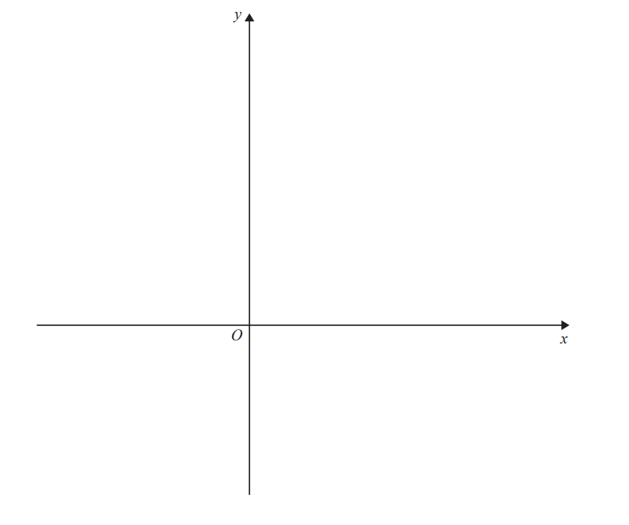
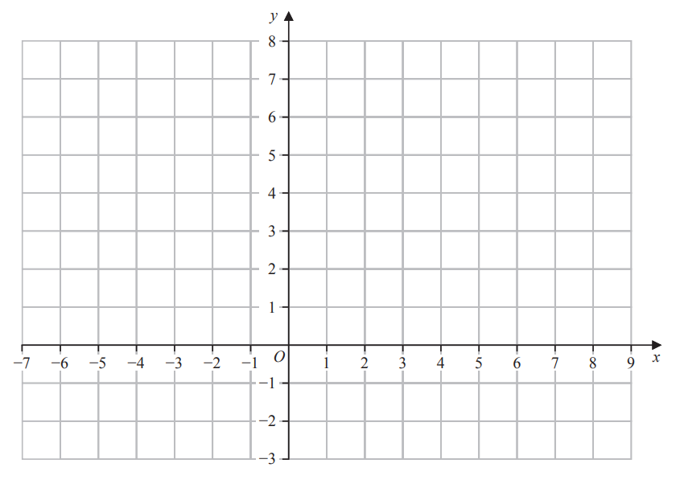
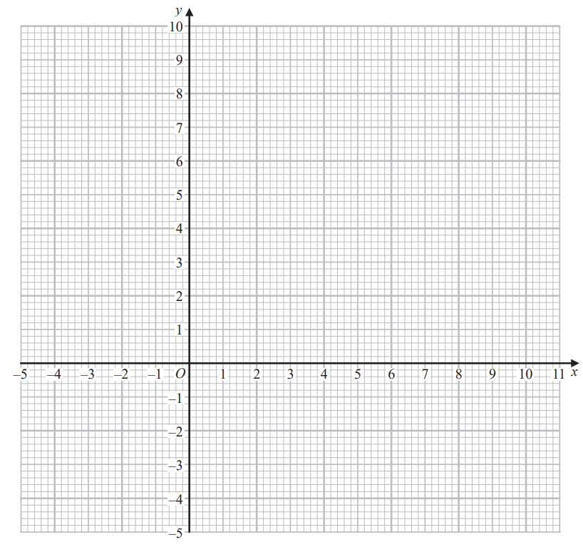
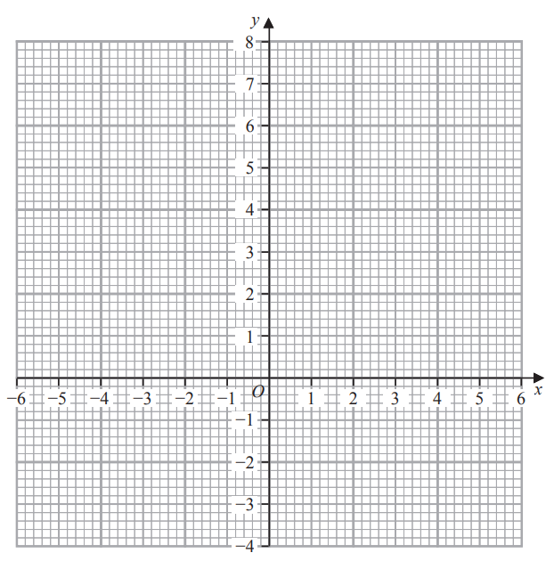

# Exam Questions — Inequalities
**Equations, Identities & Inequalities** · Edexcel IGCSE Further Pure Maths (4PM1)
> Source: [https://www.savemyexams.com/igcse/further-maths/edexcel/19/topic-questions/equations-identities-and-inequalities/inequalities/exam-questions/](https://www.savemyexams.com/igcse/further-maths/edexcel/19/topic-questions/equations-identities-and-inequalities/inequalities/exam-questions/) · 7 questions · total 41 marks

## Q1 — medium — 4 marks · exam-questions

### 1((a)) — 2 marks — structured — from paper Specimen · 4PM1/01
On the axes below, sketch the lines with equations  $2 x + 3 y = 8$ and $2 y = 4 x + 1$

On your sketch, show the coordinates of the points where the lines cross the coordinate axes.

### 1((b)) — 2 marks — structured — from paper Specimen · 4PM1/01
Show, by shading on your sketch, the region $R$ defined by the inequalities

$2 x + 3 y \leq 8  2 y \leq 4 x + 1  y \geq 0  x \leq 2$

## Q2 — medium — 5 marks · exam-questions

### 2((a)) — 1 mark — structured — from paper Specimen · Paper 2
Find the set of values of $x$ for which $3+x<2x--1$

### 2((b)) — 3 marks — structured — from paper Specimen · Paper 2
Find the set of values of $x$ for which  $x(x--1)>6$

### 2((c)) — 1 mark — structured — from paper Specimen · Paper 2
Find the set of values of $x$ for which  $\mathrm{both}3+x<2x--1\mathrm{and}x(x--1)>6$

## Q3 — medium — 4 marks · exam-questions

### 1((a)) — 2 marks — structured — from paper Nov 2024 · Paper 1
On the grid below, draw the line with equation

(i) $3x+4y=24$

(ii)  $2x-5y+10=0$

### 1((b)) — 2 marks — structured — from paper Nov 2024 · Paper 1
Show, by shading on the grid, the region $R$ defined by the inequalities

`3 x space plus space 4 y space less-than or slanted equal to space 24 space space space space space 2 x space minus space 5 y space plus 10 space greater-than or slanted equal to space 0 space space space space y space less-than or slanted equal to space 5 space space space space space x space greater-than or slanted equal to space minus 1`

Label the region $R$

## Q4 — medium — 6 marks · exam-questions

### 2() — 6 marks — structured — from paper November 2024 · Paper 2
The length of rectangle $R$is 2 cm greater than its width.

The area of $R$is greater than 8 cm2 and the perimeter of $R$is less than 30 cm.

Given that the width of $R$is $w$ cm,

find the set of possible values of $w$ 
Give your answer in the form $a<w<b$ where $a$ and $b$are rational numbers.

## Q5 — medium — 7 marks · exam-questions

### 5((a)) — 3 marks — structured — from paper June 2023 · Paper 2
On the grid opposite draw the line with equation

(i) $y=2x+5$

(ii) $4y=x-8$

(iii) $5y+3x=30$

### 5((b)) — 1 mark — structured — from paper June 2023 · Paper 2
Show, by shading, the region $R$defined by the inequalities

`y less-than or slanted equal to 2 x plus 5      4 y greater-than or slanted equal to x minus 8      5 y plus 3 x less-than or slanted equal to 30`

### 5((c)) — 3 marks — structured — from paper June 2023 · Paper 2
For all points in $R$ with coordinates `open parentheses x comma space y close parentheses`

$P=2x-5y$

Using your graph, find the least value of $P$

## Q6 — medium — 8 marks · exam-questions

### 4((a)) — 3 marks — structured — from paper November 2023 · Paper 2
On the axes opposite, draw the line with equation

(i) $y=-x-1$

(ii) $y-3x+8=0$

(iii) $2y=x+8$

### 4((b)) — 1 mark — structured — from paper November 2023 · Paper 2
Show, by shading on your graph, the region $R$ defined by the inequalities

`y greater-than or slanted equal to negative x minus 1`  and  `y greater-than or slanted equal to 3 x minus 8` and  `2 y less-than or slanted equal to x plus 8`

### 4((c)) — 4 marks — structured — from paper November 2023 · Paper 2
For all points in $R$, with coordinates `open parentheses x comma space y close parentheses`

$P=2y-3x$

Find

(i) the greatest value of $P$

(ii) the least value of $P$

## Q7 — medium — 7 marks · exam-questions

### 1((a)) — 2 marks — structured — from paper January 2023 · Paper 2
Find the set of values of $x$ for which  $2(3x-1)<4-3x$

### 1((b)) — 4 marks — structured — from paper January 2023 · Paper 2
Find the set of values of $x$ for which  $3x^{2}-8x-3<0$

### 1((c)) — 1 mark — structured — from paper January 2023 · Paper 2
Find the set of values of $x$ for which **both ** $2(3x-1)<4-3x$ **and  **$3x^{2}-8x-3<0$
