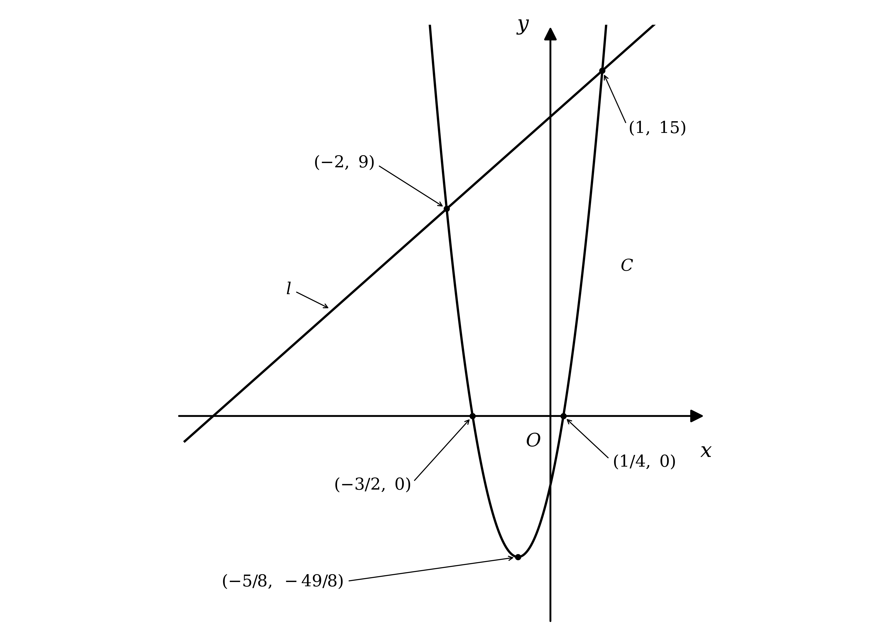

# Mark Schemes — Quadratic Functions
**Equations, Identities & Inequalities** · Edexcel IGCSE Further Pure Maths (4PM1)

## Q1 — medium — 13 marks · exam-questions

### 9((a)) — 4 marks
Any quadratic equation with roots $α$ and $β$ can be written as `x^{2} - \left(\alpha + \beta\right) x + \alpha \beta = 0`

Substitute the two values you are given

`x^{2} - \left(- \frac{7}{3}\right) x + \left(- 2\right) = 0`

**[M1]**

Tidy the signs, remembering that subtracting a negative gives a plus

$x^{2} + \frac{7}{3} x - 2 = 0$

**[B1]**

The question asks for integer coefficients, so the third has to go

- Writing $- 2$ as $- \frac{6}{3}$ puts every term over 3

$x^{2} + \frac{7}{3} x - \frac{6}{3} = 0$

**[B1]**

Multiply every term by 3

$3 x^{2} + 7 x - 6 = 0$

**[A1]**

> **[mark-scheme]**
> **M1**: Uses `x^{2} - \left(\text{sum of roots}\right) x + \left(\text{product of roots}\right) = 0` with the given values.
> 
> **B1**: Correct equation before the fraction is cleared, $x^{2} + \frac{7}{3} x - 2 = 0$ or an equivalent form.
> 
> **B1**: Correct method for clearing the fraction, such as writing $- 2$ as $- \frac{6}{3}$ or multiplying every term by 3.
> 
> **A1**: $3 x^{2} + 7 x - 6 = 0$, or any equivalent equation with integer coefficients.
> 
> The official scheme awards its two independent marks for the coefficients themselves, $a = 3$ and $b = 7$ from the sum, and $c = - 6$ from the product. Either presentation earns the same four marks, so a solution that writes the coefficients down before assembling the equation is marked exactly as above.
> 
> Any variable letter is accepted, so an answer written in $y$ is equally correct. The $= 0$ must be present, because the question asks for an equation.

> **[exam-tip]**
> The sign of the middle term is the thing to be careful about.
> 
> - The formula subtracts the sum, so a negative sum produces a positive $x$ term
> - Here $α + β = - \frac{7}{3}$ gives $+ \frac{7}{3} x$, not $- \frac{7}{3} x$
> 
> "Integer coefficients" is part of the answer, not a suggestion.
> 
> - Stopping at $x^{2} + \frac{7}{3} x - 2 = 0$ leaves the final mark on the table
> - Multiply through by the denominator, and remember the constant term has to be multiplied too
> 
> Check your equation by reading the roots back out of it.
> 
> - For $3 x^{2} + 7 x - 6 = 0$ the sum is $- \frac{7}{3}$ and the product is $\frac{-6}{3} = - 2$, which is what you started with

### 9((b)) — 2 marks
You are told not to solve the equation, so $α$ and $β$ have to stay unknown

The way in is to square the difference, because squaring turns it into something built from the sum and the product

`\left(\alpha - \beta\right)^{2} = \alpha^{2} + \beta^{2} - 2 \alpha \beta`

Now use `\alpha^{2} + \beta^{2} \equiv \left(\alpha + \beta\right)^{2} - 2 \alpha \beta`, which turns the whole thing into sum and product only

`\left(\alpha - \beta\right)^{2} = \left(\alpha + \beta\right)^{2} - 4 \alpha \beta`

Substitute the given values

`\left(\alpha - \beta\right)^{2} = \left(- \frac{7}{3}\right)^{2} - 4 \left(- 2\right)`

**[M1]**

Work this out over a denominator of 9

`\left(\alpha - \beta\right)^{2} = \frac{49}{9} + \frac{72}{9}`

`\left(\alpha - \beta\right)^{2} = \frac{121}{9}`

Take the square root, which gives two possible values

$α - β = \pm \frac{11}{3}$

You are told $α > β$, so the difference must be positive and the negative value is rejected

$α - β = \frac{11}{3}  \text{as required}$

**[A1]**

> **[mark-scheme]**
> **M1**: Uses `\left(\alpha - \beta\right)^{2} = \left(\alpha + \beta\right)^{2} - 4 \alpha \beta`, or an equivalent correct expansion, and substitutes the given values.
> 
> **A1**: Reaches $\frac{121}{9}$ and concludes $α - β = \frac{11}{3}$, using $α > β$ to reject the negative root, with no errors seen.
> 
> Going through $α^{2} + β^{2}$ as a separate step is equally acceptable and earns the method mark in the same way.
> 
> Because the result is printed in the question, the working must be completely correct. Solving the equation from part (a) to find $α$ and $β$ individually is explicitly excluded and earns nothing.

> **[exam-tip]**
> The difference of the roots is not symmetrical, but its square is.
> 
> - $α - β$ changes sign if you swap the letters, so it cannot be written in terms of the sum and product on its own
> - `\left(\alpha - \beta\right)^{2}` does not change, which is why squaring first always works
> 
> The two versions differ only in a sign, so learn them as a pair.
> 
> - `\left(\alpha + \beta\right)^{2} = \alpha^{2} + \beta^{2} + 2 \alpha \beta`
> - `\left(\alpha - \beta\right)^{2} = \alpha^{2} + \beta^{2} - 2 \alpha \beta`, so it equals `\left(\alpha + \beta\right)^{2} - 4 \alpha \beta`
> 
> Do not skip the $\pm$ and then quietly pick the one you want.
> 
> - Write both, then say that $α > β$ rules out the negative value
> - That sentence is what the condition in the question is there for

### 9((c)) — 7 marks
You need the sum and the product of the two new roots, and again without finding $α$ and $β$

Start with the sum, putting the two fractions over the common denominator $α β$

`\frac{\alpha + \beta}{\alpha} + \frac{\alpha - \beta}{\beta} = \frac{\beta \left(\alpha + \beta\right) + \alpha \left(\alpha - \beta\right)}{\alpha \beta}`

**[M1]**

Expand the numerator, and notice that the two $α β$ terms cancel

$= \frac{αβ+β^{2}+α^{2}-αβ}{αβ}$

$= \frac{α^{2}+β^{2}}{αβ}$

That is now built only from the sum and the product, using `\alpha^{2} + \beta^{2} \equiv \left(\alpha + \beta\right)^{2} - 2 \alpha \beta`

`= \frac{\left(- \frac{7}{3}\right)^{2} - 2 \left(- 2\right)}{- 2}`

**[M1]**

The numerator is $\frac{49}{9} + 4$, which is $\frac{85}{9}$, and dividing by $- 2$ halves it and changes the sign

$\frac{α+β}{α} + \frac{α-β}{β} = - \frac{85}{18}$

**[A1]**

The product is easier, because the numerators and denominators multiply straight across

`\frac{\alpha + \beta}{\alpha} \times \frac{\alpha - \beta}{\beta} = \frac{\left(\alpha + \beta\right) \left(\alpha - \beta\right)}{\alpha \beta}`

**[M1]**

Part (b) gives $α - β = \frac{11}{3}$, so both brackets are known

`= \frac{\left(- \frac{7}{3}\right) \left(\frac{11}{3}\right)}{- 2}`

The numerator is $- \frac{77}{9}$, and dividing by $- 2$ makes it positive

$\frac{α+β}{α} \times \frac{α-β}{β} = \frac{77}{18}$

**[A1]**

Now build the equation from `x^{2} - \left(\text{sum}\right) x + \left(\text{product}\right) = 0`

$x^{2} + \frac{85}{18} x + \frac{77}{18} = 0$

**[M1]**

Multiply every term by 18 to clear the fractions

$18 x^{2} + 85 x + 77 = 0$

**[A1]**

> **[mark-scheme]**
> **M1**: Writes the sum of the new roots over the common denominator $α β$, or an equivalent correct single fraction.
> 
> **M1**: Reduces that sum to an expression in $α + β$ and $α β$ only, ready for the values to be substituted.
> 
> **A1**: Sum of the new roots equal to $- \frac{85}{18}$.
> 
> **M1**: Writes the product of the new roots as `\frac{\left(\alpha + \beta\right) \left(\alpha - \beta\right)}{\alpha \beta}`, or an equivalent correct form.
> 
> **A1**: Product of the new roots equal to $\frac{77}{18}$.
> 
> **M1**: Uses `x^{2} - \left(\text{your sum}\right) x + \left(\text{your product}\right)`. The $= 0$ may be missing at this stage.
> 
> **A1**: $18 x^{2} + 85 x + 77 = 0$, or any equivalent equation with integer coefficients, including the $= 0$.
> 
> The two accuracy marks for the sum and the product follow through from your own value of $α - β$ in part (b).
> 
> Any variable letter is accepted for the final equation.
> 
> The question says "without solving", so a solution that first finds $α = \frac{2}{3}$ and $β = - 3$ and then builds the equation from those values does not earn the method marks, even though it reaches the same answer.

> **[exam-tip]**
> The two new roots look awkward, but everything in them is already known.
> 
> - $α + β$ is given, and $α - β$ was found in part (b), so the numerators are just numbers
> - Only the denominators still contain $α$ and $β$ separately, and combining the fractions removes them
> 
> Combining over $α β$ is the move that makes the sum work.
> 
> - The cross-multiplied numerator collapses to $α^{2} + β^{2}$, because the two $α β$ terms cancel
> - From there the standard identity finishes it
> 
> The product needs almost no work at all.
> 
> - The $α$ and $β$ in the denominators multiply to $α β$, and the numerators are both already known
> 
> Watch the signs when you divide by $α β = - 2$.
> 
> - A positive numerator becomes negative and a negative numerator becomes positive, which is why the sum and the product end up with opposite signs

## Q2 — medium — 13 marks · exam-questions

### 9((a)) — 3 marks
The target form `P \left(x + Q\right)^{2} + R` is a completed square, so complete the square on `\text{f} \left(x\right)`

Factorise $- 2$ out of the two terms containing $x$, leaving the 7 outside the bracket

`7 - 2 \left(x^{2} - 2 x\right)`

Complete the square inside the bracket by halving the coefficient of $x$

- Half of $- 2$ is $- 1$, so the bracket becomes `\left(x - 1\right)^{2}`
- Squaring that bracket introduces an extra $+ 1$, so subtract 1 inside to keep the value unchanged

`7 - 2 \left[\left(x - 1\right)^{2} - 1\right]`

**[M1]**

Multiply the $- 2$ through the square bracket, remembering that two negatives give a positive

`7 - 2 \left(x - 1\right)^{2} + 2`

Combine the two constants, and write the squared term first so it matches the printed form

`- 2 \left(x - 1\right)^{2} + 9`

**[A1]**

Compare this term by term with `P \left(x + Q\right)^{2} + R`

- The bracket is `\left(x - 1\right)^{2}`, which is `\left(x + Q\right)^{2}` with $Q = - 1$

$P=-2,Q=-1,R=9$

**[A1]**

> **[mark-scheme]**
> **M1**: A complete method to complete the square, reaching `7 - 2 \left[\left(x - 1\right)^{2} - 1\right]` or any equivalent arrangement.
> 
> **A1**: A correct completed square, `- 2 \left(x - 1\right)^{2} + 9` or an equivalent form.
> 
> **A1**: All three values, $P = - 2$, $Q = - 1$ and $R = 9$.
> 
> The values may be stated separately or left embedded in a correct completed square, and a correct completed square implies both accuracy marks. Where they are embedded correctly and then written out wrongly, the embedded version is the one used.
> 
> Expanding `P \left(x + Q\right)^{2} + R` and comparing coefficients is equally acceptable. Marked that way, the method mark is for a correct expansion together with a correct attempt to compare at least one coefficient, for example $P = - 2$ or $2 P Q = 4$, and the two accuracy marks are awarded exactly as above.

> **[exam-tip]**
> The printed form tells you what to factorise out before you start.
> 
> - In `P \left(x + Q\right)^{2} + R` the whole squared bracket is multiplied by $P$, so $P$ has to be the coefficient of $x^{2}$, which is $- 2$
> - Taking out $+ 2$ instead leaves $- x^{2}$ inside the bracket and the method breaks down
> 
> Only the two terms containing $x$ go inside the bracket.
> 
> - The constant 7 stays outside, and is combined at the end with whatever comes out of the bracket
> 
> $Q$ comes out negative here, which is easy to miss.
> 
> - The required form is `\left(x + Q\right)^{2}` and the answer is `\left(x - 1\right)^{2}`, so $Q = - 1$ rather than 1
> 
> Check your answer by expanding it back out.
> 
> - `- 2 \left(x - 1\right)^{2} + 9` expands to $- 2 x^{2} + 4 x - 2 + 9$, which is $7 + 4 x - 2 x^{2}$

### 9((b)) — 2 marks
**(i)**

Part (a) writes `\text{f} \left(x\right)` as `- 2 \left(x - 1\right)^{2} + 9`

A square is never negative, so the term `- 2 \left(x - 1\right)^{2}` is never positive

That makes `\text{f} \left(x\right)` largest when the squared term is zero, and all that is left is the constant

**Final answer:** **The maximum value of **`\text{f} \left(x\right)`** is 9**

**[B1]**

**(ii)**

The squared term is zero exactly when the bracket inside it is zero

$x - 1 = 0$

$x = 1$

**[B1]**

> **[mark-scheme]**
> **B1**: A maximum value of 9.
> 
> **B1**: The maximum occurs at $x = 1$.
> 
> Both marks follow through from your own completed square in part (a), so a maximum value equal to your $R$ and an $x$ value equal to $- Q$ earn them.
> 
> The question says "hence", so the values are expected to come from part (a). Differentiating `\text{f} \left(x\right)` and solving `\text{f}' \left(x\right) = 0` reaches the same two answers and is accepted, provided both are correct.
> 
> In part (ii) accept $x = 1$ written on its own. A pair of coordinates `\left(1 , 9\right)` is accepted for the two marks together, provided each value is clearly matched to the right sub part.

> **[exam-tip]**
> Completed square form hands you the maximum with no calculus at all.
> 
> - The only part of `- 2 \left(x - 1\right)^{2} + 9` that changes is the squared term, and the closest it can get to zero is zero itself
> - With a minus sign in front of it, that zero gives the largest possible value
> 
> Read carefully which of the two things each sub part wants.
> 
> - "Maximum value" means the value of `\text{f} \left(x\right)`, which is 9
> - The value of $x$ where the maximum happens is 1, and that is what part (ii) asks for
> 
> The sign of the $x$ value is the usual trap.
> 
> - The bracket is `\left(x - 1\right)^{2}`, so it vanishes at $x = 1$, not at $x = - 1$
> 
> "Write down" tells you no working is required.
> 
> - One mark each, and both answers can be read straight off part (a), so this is the fastest pair of marks in the question

### 9((c)) — 3 marks
The curve and the line meet where their $y$ values are equal, so set the two expressions equal

$7 + 4 x - 2 x^{2} = 4 - x$

**[M1]**

Collect every term on one side, choosing the side that leaves the $x^{2}$ term positive

- Adding $2 x^{2}$ and $x$ to both sides and then subtracting 7 moves everything to the right

$0 = 2 x^{2} - 5 x - 3$

Factorise the quadratic

- The two $x$ terms must multiply to give $2 x^{2}$, so one bracket starts with $2 x$ and the other with $x$
- The two constants must multiply to give $- 3$, and choosing $+ 1$ and $- 3$ gives a middle term of $x - 6 x$, which is $- 5 x$

`\left(2 x + 1\right) \left(x - 3\right) = 0`

**[M1]**

Set each bracket equal to zero in turn

$x=-\frac{1}{2},x=3$

**[A1]**

> **[mark-scheme]**
> **M1**: Sets the equation of the curve equal to the equation of the line, eliminating $y$.
> 
> **M1**: Rearranges to a three term quadratic and makes a complete attempt to solve it.
> 
> **A1**: Both values, $x = - \frac{1}{2}$ and $x = 3$.
> 
> The quadratic may be written either way round, so $- 2 x^{2} + 5 x + 3 = 0$ is equally acceptable and is marked identically.
> 
> Any complete method of solution earns the second method mark: factorising, the quadratic formula, or completing the square. A pair of correct values written down with no method shown earns all three marks.
> 
> The question asks only for the $x$ coordinates, so no $y$ values are needed. Giving them as well is not penalised.

> **[exam-tip]**
> Two graphs meet where they give the same $y$ for the same $x$, so equate the right hand sides.
> 
> - That eliminates $y$ in one step and leaves a single equation in $x$
> 
> Rearrange so that the $x^{2}$ coefficient comes out positive.
> 
> - $2 x^{2} - 5 x - 3 = 0$ is far easier to factorise than $- 2 x^{2} + 5 x + 3 = 0$
> - Moving everything to the other side is the same as multiplying through by $- 1$
> 
> A leading coefficient of 2 means the constants are not simply a factor pair of the constant term.
> 
> - Test each arrangement by expanding the middle term, since $+ 1$ with $- 3$ gives $- 5 x$ but $- 1$ with $+ 3$ gives $+ 5 x$
> 
> These two values are the limits of integration in part (d).
> 
> - An error here carries through, so check them by substituting back into both equations

### 9((d)) — 5 marks
Rotating about the $x$-axis, the volume swept out by a graph is `\pi \int y^{2} \text{d} x`

The region lies between the curve and the line, so subtract the volume the line generates from the volume the curve generates

- The curve is above the line all the way between the two intersections, so the curve gives the outer surface
- The limits are the two $x$ coordinates found in part (c)

`V = \pi \int_{- \frac{1}{2}}^{3} \left(7 + 4 x - 2 x^{2}\right)^{2} \text{d} x - \pi \int_{- \frac{1}{2}}^{3} \left(4 - x\right)^{2} \text{d} x`

**[M1]**

Expand the curve's square, treating it as `\left(7 + 4 x - 2 x^{2}\right) \left(7 + 4 x - 2 x^{2}\right)`

- Squaring each term in turn gives 49, $16 x^{2}$ and $4 x^{4}$
- Each pair of different terms appears twice, giving $56 x$, $- 28 x^{2}$ and $- 16 x^{3}$

`\left(7 + 4 x - 2 x^{2}\right)^{2} = 4 x^{4} - 16 x^{3} - 12 x^{2} + 56 x + 49`

Expand the line's square as well

`\left(4 - x\right)^{2} = x^{2} - 8 x + 16`

**[M1]**

Combine into a single integral and subtract term by term

`V = \pi \int_{- \frac{1}{2}}^{3} \left(4 x^{4} - 16 x^{3} - 13 x^{2} + 64 x + 33\right) \text{d} x`

**[A1]**

Integrate each term, raising the power by one and dividing by the new power

`V = \pi \left[\frac{4 x^{5}}{5} - 4 x^{4} - \frac{13 x^{3}}{3} + 32 x^{2} + 33 x\right]_{- \frac{1}{2}}^{3}`

**[M1]**

Substitute the upper limit $x = 3$

`\frac{4 \left(243\right)}{5} - 4 \left(81\right) - \frac{13 \left(27\right)}{3} + 32 \left(9\right) + 33 \left(3\right) = \frac{702}{5}`

Substitute the lower limit $x = - \frac{1}{2}$, taking care with the signs of the odd powers

$- \frac{1}{40} - \frac{1}{4} + \frac{13}{24} + 8 - \frac{33}{2} = - \frac{247}{30}$

Subtract the lower value from the upper value

`V = \pi \left(\frac{702}{5} + \frac{247}{30}\right)`

$V = \frac{4459π}{30}$

Evaluate this and round to 3 significant figures

$V = 466 . 945 \dots$

`V equals 467 space open parentheses 3 space straight s. straight f. close parentheses`

**[A1]**

> **[mark-scheme]**
> **M1**: Sets up the difference of the two volumes of revolution, `\pi \int \left(y_{C}^{2} - y_{l}^{2}\right) \text{d} x`, using your limits from part (c).
> 
> **M1**: Attempts to expand both squares, with at least one of them fully correct.
> 
> **A1**: A correct integrand, $4 x^{4} - 16 x^{3} - 13 x^{2} + 64 x + 33$ or any equivalent.
> 
> **M1**: Integrates your expression correctly, with every power raised by one and divided by the new power. Neither $π$ nor the limits need appear for this mark.
> 
> **A1**: Answers which round to 467, the unrounded value being $466 . 945$.
> 
> Integrating the two volumes separately and subtracting the results at the end is equally acceptable and is marked in exactly the same way.
> 
> The factor of $π$ may be left out of the working and reinstated at the end. The limits follow through from part (c), but the integrand itself must be correct for the accuracy mark.
> 
> A negative answer that is simply made positive at the end does not earn the final mark.

> **[exam-tip]**
> For a region between two graphs, the formula subtracts the squares, not the graphs.
> 
> - `V = \pi \int \left(y_{\text{outer}}^{2} - y_{\text{inner}}^{2}\right) \text{d} x`, so square each boundary first and subtract afterwards
> - Subtracting first and squaring the result is a common error and scores almost nothing
> 
> Squaring a three term expression needs six products, not three.
> 
> - The three squares are 49, $16 x^{2}$ and $4 x^{4}$
> - The three cross terms each appear twice, which is where $56 x$, $- 28 x^{2}$ and $- 16 x^{3}$ come from
> 
> The limits have already been found for you.
> 
> - They are the intersections from part (c), so there is no new equation to solve here
> 
> Keep everything in fractions until the very last line.
> 
> - The exact volume is $\frac{4459π}{30}$, so round only once, right at the end
> - Rounding the two limit substitutions first is enough to lose the final significant figure

## Q3 — medium — 5 marks · exam-questions

### 2((a)) — 3 marks
The required form is a completed square, so complete the square on `\text{f}\left(x\right)`

Factorise 2 out of the two terms containing $x$, leaving the 9 outside

`2 \left(x^{2} + 2 x\right) + 9`

Complete the square inside the bracket by halving the coefficient of $x$

- Half of 2 is 1, and $1^{2} = 1$

`2 \left[\left(x + 1\right)^{2} - 1\right] + 9`

Multiply the 2 through the square bracket

`2 \left(x + 1\right)^{2} - 2 + 9`

Combine the constants

`2 \left(x + 1\right)^{2} + 7`

Compare this term by term with `A \left(x + B\right)^{2} + C`

$A=2,B=1,C=7$

**[B1] [B1] [B1]**

> **[mark-scheme]**
> **B1**: One of $A$, $B$ or $C$ correct.
> 
> **B1**: Two of $A$, $B$ or $C$ correct.
> 
> **B1**: All three correct.
> 
> The values may be stated separately or left embedded in a correct completed square, and the question neither asks for working nor rules out a calculator, so three correct values written straight down earn all three marks.
> 
> Working through the completing the square route step by step is equally acceptable and is marked like this: a correct factorisation such as `2 \left(x^{2} + 2 x\right) + 9` or `2 \left(x^{2} + 2 x + \frac{9}{2}\right)` earns a method mark, completing the square correctly inside the bracket earns a second, following through from your own factorisation, and all three values correct earns the accuracy mark.

> **[exam-tip]**
> Factorise the leading coefficient out of the $x$ terms only.
> 
> - $2 x^{2} + 4 x + 9$ becomes `2 \left(x^{2} + 2 x\right) + 9`, with the 9 left alone
> - Pulling the 2 out of the 9 as well produces a fraction you do not need
> 
> Each of the three constants carries its own mark, so partial credit is real.
> 
> - Even getting only $A = 2$ down is worth a mark, so never leave this blank
> 
> Check by expanding backwards.
> 
> - `2 \left(x + 1\right)^{2} + 7` gives $2 x^{2} + 4 x + 2 + 7$, which is $2 x^{2} + 4 x + 9$

### 2((b)) — 2 marks
Part (a) writes `\text{f}\left(x\right)` as `2 \left(x + 1\right)^{2} + 7`

A square is never negative, so `\text{f}\left(x\right)` is at least 7 and is therefore always positive

- For a positive quantity, the reciprocal is largest exactly when the quantity itself is smallest

So the maximum of `\frac{1}{\text{f}\left(x\right)}` happens at the minimum of `\text{f}\left(x\right)`

**(i)**

`\text{f}\left(x\right)` is smallest when the squared bracket is zero

$x + 1 = 0$

$x = - 1$

**[B1]**

**(ii)**

At that value the squared term vanishes and `\text{f}\left(x\right)` equals the constant $C$, which is 7

**Final answer:** **The maximum value of **`\frac{1}{\text{f}\left(x\right)}`** is **$\frac{1}{7}$

**[B1]**

> **[mark-scheme]**
> **B1**: $x = - 1$.
> 
> **B1**: Maximum value of $\frac{1}{7}$.
> 
> Both marks follow through from your part (a), the first from $- B$ and the second from $\frac{1}{C}$.
> 
> The two sub-parts must be identifiable. If they are not labelled, the marks are awarded only when the two values appear in the correct order. A clearly written statement that the maximum value is $\frac{1}{7}$ when $x = - 1$ earns both marks, and the coordinate form `\left(- 1 , \frac{1}{7}\right)` earns the first.

> **[exam-tip]**
> A reciprocal turns a minimum into a maximum, but only when the function keeps one sign.
> 
> - Here the completed square shows `\text{f}\left(x\right) \geq 7`, so `\text{f}\left(x\right)` is never zero or negative and the reciprocal is safe
> - If the quadratic could reach zero, `\frac{1}{\text{f}\left(x\right)}` would have no maximum at all
> 
> The $x$ value does not change when you take the reciprocal.
> 
> - The turning point is still at $x = - 1$; only the $y$ value is inverted
> 
> Label your sub-answers.
> 
> - Marks can be withheld if it is not clear which value answers (i) and which answers (ii)

## Q4 — medium — 8 marks · exam-questions

### 3((a)) — 3 marks
Write out the first few terms to see what kind of series this is

- Putting $r = 1 , 2 , 3$ into $5 r - 3$ gives $2$, $7$, $12$
- Each term is 5 more than the one before, so this is an arithmetic series

Identify the first term and the common difference

$a = 2 , d = 5$

**[B1]**

Use the sum formula for an arithmetic series, `S_{n} = \frac{n}{2} \left[2 a + \left(n - 1\right) d\right]`

`\sum_{r = 1}^{n} \left(5 r - 3\right) = \frac{n}{2} \left[2 \left(2\right) + \left(n - 1\right) 5\right]`

**[M1]**

Simplify inside the bracket

`= \frac{n}{2} \left(4 + 5 n - 5\right)`

`\sum_{r = 1}^{n} \left(5 r - 3\right) = \frac{n}{2} \left(5 n - 1\right) \textrm{ } \text{as required}`

**[A1]**

> **[mark-scheme]**
> **B1**: Identifies $a = 2$ and $d = 5$, either stated or clearly used.
> 
> **M1**: Uses a correct arithmetic sum formula with your values of $a$ and $d$.
> 
> **A1**: Reaches the printed result with no errors seen.
> 
> The standard results route is equally acceptable and is marked like this: splitting the sum as `5 \sum_{r = 1}^{n} r - 3 \sum_{r = 1}^{n} 1` earns the first mark, using `\sum_{r = 1}^{n} r = \frac{n}{2} \left(n + 1\right)` earns the method mark, and reaching $\frac{5n^{2}-n}{2}$ and factorising it to the printed form earns the accuracy mark.
> 
> Because the result is printed, at least one correct intermediate line has to be shown. Jumping from the formula straight to the answer does not earn the accuracy mark.

> **[exam-tip]**
> A sum of a linear expression in $r$ is always an arithmetic series.
> 
> - The coefficient of $r$ is the common difference, so $d = 5$ can be read straight off
> - Substituting $r = 1$ gives the first term, so $a = 2$
> 
> Two routes are available and both are fully accepted.
> 
> - The arithmetic sum formula is quicker here
> - Splitting into $5 \sum r - 3 \sum 1$ works just as well if you prefer standard results
> 
> On a show that question, the last line has to be reached rather than written down.
> 
> - Show the bracket before it is tidied, so the $4 + 5 n - 5$ step is visible

### 3((b)) — 2 marks
The sum you want starts at $r = 31$, but the formula from part (a) always starts at $r = 1$

- Summing to 60 and then subtracting the sum to 30 leaves exactly the terms from 31 to 60

`\sum_{r = 31}^{60} \left(5 r - 3\right) = \frac{60}{2} \left(5 \times 60 - 1\right) - \frac{30}{2} \left(5 \times 30 - 1\right)`

**[M1]**

Work out each bracket, giving $30 \times 299$ and $15 \times 149$

$= 8970 - 2235$

`\sum_{r = 31}^{60} \left(5 r - 3\right) = 6735`

**[A1]**

> **[mark-scheme]**
> **M1**: Uses the result from part (a) with $n = 60$ and $n = 30$ and subtracts, or an equivalent complete method.
> 
> **A1**: $6735$.
> 
> Treating the terms from 31 to 60 as an arithmetic series in their own right is equally acceptable and is marked in the same way. There are 30 terms, the first is $5 \times 31 - 3 = 152$ and the last is $5 \times 60 - 3 = 297$, so `\frac{30}{2} \left(152 + 297\right) = 6735`.
> 
> Using the arithmetic sum formula twice from first principles rather than the part (a) result is also accepted.

> **[exam-tip]**
> Subtracting sums is the standard way to shift a starting value.
> 
> - The sum from 31 to 60 is the sum to 60 minus the sum to 30
> - Subtracting the sum to 31 instead is the classic error, because that removes the $r = 31$ term you want to keep
> 
> Count the terms if you use the direct route.
> 
> - From 31 to 60 inclusive there are $60 - 31 + 1 = 30$ terms, not 29
> 
> The word "evaluate" means a number is wanted.
> 
> - Leaving the answer as a difference of two expressions does not finish the job

### 3((c)) — 3 marks
Set the result from part (a) equal to the given total

`\frac{n}{2} \left(5 n - 1\right) = 3783`

Multiply both sides by 2 and expand

$5 n^{2} - n = 7566$

Collect everything on one side to get a quadratic in $n$

$5 n^{2} - n - 7566 = 0$

**[M1]**

Factorise, looking for two numbers multiplying to `5 \times \left(- 7566\right)` and adding to $- 1$

- Those numbers are $194$ and $- 195$, which gives the factors below

`\left(5 n + 194\right) \left(n - 39\right) = 0`

**[M1]**

Setting each factor to zero gives $n = - \frac{194}{5}$ or $n = 39$

$n$ counts terms, so it must be a positive whole number and the negative fraction is rejected

$n = 39$

**[A1]**

> **[mark-scheme]**
> **M1**: Sets the result of part (a) equal to $3783$ and rearranges to a three-term quadratic in $n$.
> 
> **M1**: A complete and correct method for solving that quadratic, by factorising, completing the square or the quadratic formula.
> 
> **A1**: $n = 39$.
> 
> The quadratic formula gives a discriminant of $151321$, whose square root is exactly $389$, so the roots come out exactly either way.
> 
> The negative root does not have to be written down or explicitly rejected for the accuracy mark, but $n = 39$ must be the value given as the answer.

> **[exam-tip]**
> Using part (a) turns a sum into an ordinary quadratic equation.
> 
> - There is no need to write out any terms, and no need to guess and check
> 
> The numbers look forbidding but the quadratic does factorise.
> 
> - If you cannot spot the factors quickly, go straight to the formula
> - $1 + 4 \times 5 \times 7566 = 151321$ and $389^{2} = 151321$, so the root is exact
> 
> Always sanity-check the answer against what $n$ means.
> 
> - $n$ is a number of terms, so a negative or fractional value is discarded without comment
> - Substituting back, $\frac{39}{2} \times 194 = 3783$, which confirms it

## Q5 — medium — 16 marks · exam-questions

### 10((a)) — 2 marks
A point on the coordinate axes at `\left(\frac{5}{4} , 0\right)` has $y = 0$, so this is where $C$ crosses the $x$-axis

A fraction is zero only when its numerator is zero

$a x - 5 = 0$

Substitute $x = \frac{5}{4}$ and solve for $a$

$\frac{5a}{4} = 5$

$a = 4$

**[B1]**

An asymptote parallel to the $y$-axis is a vertical line, and a vertical asymptote sits where the denominator is zero

$b - x = 0$

That asymptote is given as $x = 3$, so the denominator must vanish when $x = 3$

$b = 3$

**[B1]**

> **[mark-scheme]**
> **B1**: Either $a = 4$ or $b = 3$.
> 
> **B1**: Both $a = 4$ and $b = 3$.
> 
> These are independent marks, not given answers, so they are awarded for sight of the correct values. They are not method marks and do not depend on any working being shown.
> 
> The only case in which a correct value does not earn its mark is where it plainly comes from clearly incorrect working.

> **[exam-tip]**
> Each piece of information in the stem pins down one of the two letters.
> 
> - The axis crossing is about the numerator, because a fraction equals zero only when its top is zero
> - The vertical asymptote is about the denominator, because that is where the fraction is undefined
> 
> Read $b$ straight off the asymptote rather than solving anything.
> 
> - The denominator is $b - x$, so it is zero at $x = b$, and the asymptote is $x = 3$
> - That gives $b = 3$ in one step
> 
> These two marks are worth checking, because everything else in the question depends on them.
> 
> - Substitute back into $y = \frac{4x-5}{3-x}$ and confirm that $x = \frac{5}{4}$ gives $y = 0$

### 10((b)) — 5 marks
Part (a) gives the equation of $C$ as $y = \frac{4x-5}{3-x}$

The vertical asymptote is where the denominator is zero, which part (a) has already established

$x = 3$

For the horizontal asymptote, divide the numerator and the denominator by $x$

$y = \frac{4-\frac{5}{x}}{\frac{3}{x}-1}$

As $x$ gets very large in either direction, $\frac{5}{x}$ and $\frac{3}{x}$ both shrink towards zero

$y = - 4$

The crossing with the $x$-axis is the point given in the stem

`\left(\frac{5}{4} , 0\right)`

For the crossing with the $y$-axis, substitute $x = 0$

`y = \frac{4 \left(0\right) - 5}{3 - 0}`

`\left(0 , - \frac{5}{3}\right)`

To see the shape, rewrite the equation as a single fraction added to a constant

- Dividing $4 x - 5$ by $3 - x$ leaves a remainder, and the result is $- 4 - \frac{7}{x-3}$

$y = - 4 - \frac{7}{x-3}$

This is $y = - \frac{7}{x}$ shifted 3 to the right and 4 down, so it has the two branches of a negative reciprocal curve

- To the left of $x = 3$ the curve lies above $y = - 4$ and rises steeply as it approaches the asymptote
- To the right of $x = 3$ the curve lies below $y = - 4$ and climbs towards it from underneath

Now draw the two asymptotes as dashed lines, label them with their equations, mark the two axis crossings, and sketch a branch on each side

**[B1] [B1] [B1] [B1] [B1]**

> **[mark-scheme]**
> **B1**: A negative reciprocal curve drawn anywhere on the axes, with two branches present. The branches must not cross either asymptote and must not obviously bend back on themselves. Intention is marked.
> 
> **B1**: The horizontal asymptote $y = - 4$ drawn in the correct place and either labelled with its equation or shown by where it meets the $y$-axis. At least one branch of a reciprocal curve must be present, and it must not cross or obviously bend back from the asymptotes. Any other curves drawn are ignored.
> 
> **B1**: The vertical asymptote $x = 3$ drawn in the correct place, under the same conditions about the branches.
> 
> **B1**: A single curve, or even a line, passing through `\left(0 , - \frac{5}{3}\right)`, marked clearly either as a coordinate or as a crossing point on the axis. Any other branches present are ignored.
> 
> **B1**: A single curve, or even a line, passing through both `\left(\frac{5}{4} , 0\right)` and `\left(0 , - \frac{5}{3}\right)`, with both marked clearly as coordinates or as crossings on the axes.
> 
> The last four marks follow through from your own values of $a$ and $b$ in part (a). The horizontal asymptote follows through only as $y = -$ your $a$, and the $y$-axis crossing only as `\left(0 , - \frac{5}{\text{your } b}\right)`, and in each case only if the other conditions are met.

> **[exam-tip]**
> Find the asymptotes before you draw anything, because they set the whole shape.
> 
> - The vertical one is where the denominator is zero, so $x = 3$
> - The horizontal one is the ratio of the $x$ coefficients, $\frac{4}{-1}$, so $y = - 4$
> 
> Draw the asymptotes as dashed lines and write their equations next to them.
> 
> - Two of the five marks depend on the asymptotes being in the right place, and one of them requires the equation to be shown
> 
> A reciprocal curve must never touch or cross its asymptotes.
> 
> - A branch that bends back on itself, or that crosses a dashed line, loses the mark even if the rest of the sketch is right
> - Each branch has to keep getting closer to both asymptotes without ever meeting them
> 
> Work out which side of the horizontal asymptote each branch goes.
> 
> - Writing the curve as $- 4 - \frac{7}{x-3}$ makes it obvious: for $x < 3$ the fraction is negative, so $y$ is above $- 4$
> - Sketching both branches on the same side of $y = - 4$ is the most common way to lose the first mark
> 
> Label the two crossings as coordinates, not just as dots.
> 
> - The last two marks are specifically for `\left(0 , - \frac{5}{3}\right)` and then for both crossings together

### 10((c)) — 9 marks
A line and a curve meet where both equations hold at once, so start by solving them simultaneously

Rearrange $l$ to make $y$ the subject

$y = \frac{7x+k}{4}$

Set that equal to the equation of $C$ from part (a)

$\frac{7x+k}{4} = \frac{4x-5}{3-x}$

**[M1]**

Multiply both sides by `4 \left(3 - x\right)` to clear the two fractions

`\left(7 x + k\right) \left(3 - x\right) = 4 \left(4 x - 5\right)`

**[A1]**

Expand both sides

$21 x - 7 x^{2} + 3 k - k x = 16 x - 20$

**[M1]**

Collect everything on the side that leaves the $x^{2}$ term positive, and gather the two terms in $x$

- The $x$ terms are $- 21 x$, $+ k x$ and $+ 16 x$, which combine to `\left(k - 5\right) x`

`7 x^{2} + \left(k - 5\right) x - 20 - 3 k = 0`

**[A1]**

No points of intersection means this quadratic has no real roots, so its discriminant is negative

`\left(k - 5\right)^{2} - 4 \left(7\right) \left(- 20 - 3 k\right) < 0`

**[M1]**

Expand each piece separately

- `\left(k - 5\right)^{2}` is $k^{2} - 10 k + 25$
- `- 28 \left(- 20 - 3 k\right)` is $560 + 84 k$

$k^{2} - 10 k + 25 + 560 + 84 k < 0$

**[A1]**

Collect the like terms

$k^{2} + 74 k + 585 < 0$

Find the critical values by solving the corresponding equation

- Look for two numbers that multiply to 585 and add to 74, which are 9 and 65

`\left(k + 9\right) \left(k + 65\right) = 0`

$k = - 9$

**[M1]**

$k = - 65$

**[M1]**

The coefficient of $k^{2}$ is positive, so this quadratic is negative between its two critical values

$- 65 < k < - 9$

**[A1]**

Comparing with $m < k < n$ gives $m = - 65$ and $n = - 9$

> **[mark-scheme]**
> **M1**: Rearranges $l$ to $y = \frac{7}{4} x + c$ with $c \neq 0$ and sets it equal to the equation of $C$, or substitutes the equation of $C$ into the equation of $l$. This follows through from your own $a$ and $b$. An inequality sign in place of the equals sign is condoned here.
> 
> **A1**: A correct unsimplified equation. An inequality sign is not condoned for this mark.
> 
> **M1**: A complete attempt to rearrange into a three term quadratic in $x$, allowing one error in the rearrangement. "Three term quadratic" means terms in $x^{2}$, in $x$ and a constant, all on one side, simplified as far as possible. The $= 0$ may be missing and an inequality sign is condoned.
> 
> **A1**: A correct three term quadratic. The term in $x$ does not have to be factorised and the $= 0$ may be omitted.
> 
> **M1**: Forms the discriminant of your three term quadratic. The inequality sign does not need to be shown and may be the wrong way round.
> 
> **A1**: A correct unsimplified discriminant. Again the inequality sign need not be shown and may be incorrect.
> 
> **M1**: A correct method to solve your quadratic in $k$, leading to one value of $k$. This mark depends on the first two method marks, and it is awarded for the method rather than for the value.
> 
> **M1**: The same method carried through to give two values of $k$, again dependent on the first two method marks.
> 
> **A1**: $- 65 < k < - 9$.
> 
> The quadratic formula is an equally acceptable way of finding the critical values, giving `k = \frac{- 74 \pm \sqrt{74^{2} - 4 \left(1\right) \left(585\right)}}{2}`, which simplifies to $- 9$ and $- 65$.
> 
> Differentiating is the route the official scheme shows first, and it earns the same nine marks. A method mark is given for differentiating $\frac{4x-5}{3-x}$ by the quotient rule or the product rule, with the denominator squared and both terms in the numerator differentiated correctly. A mark is given for the gradient of $l$ being $\frac{7}{4}$. A method mark is given for setting that gradient equal to your derivative and attempting to solve for $x$, with an accuracy mark for $x = 1$ and $x = 5$. A method mark is given for substituting either value into the equation of $C$, with an accuracy mark for $y = - \frac{1}{2}$ and $y = - \frac{15}{2}$. A method mark is given for forming the equation of the tangent at one of those points and rearranging it to the form $4 y - 7 x = k$, and a second for doing so at both points, each dependent on the first two method marks. The final accuracy mark is for the same inequality.
> 
> That route works because $k = - 9$ and $k = - 65$ are the values for which $l$ is a tangent to $C$, and between them the line misses the curve altogether.

> **[exam-tip]**
> "No points of intersection" is a statement about a discriminant.
> 
> - Two intersections means the discriminant is positive, one means it is zero, and none means it is negative
> - So the whole question is really "solve $b^{2} - 4 a c < 0$", once you have the right quadratic
> 
> Clear the fractions before doing anything else.
> 
> - Multiplying by `4 \left(3 - x\right)` removes both denominators in one step
> - Trying to work with the fractions in place is where most of the algebra goes wrong
> 
> Treat $k$ as an ordinary number while you rearrange.
> 
> - The coefficient of $x$ comes out as $k - 5$, which is a perfectly good coefficient even though it contains a letter
> - The constant term is $- 20 - 3 k$, and the double negative in `- 4 \left(7\right) \left(- 20 - 3 k\right)` makes it positive
> 
> A quadratic inequality needs the shape of the graph, not just the critical values.
> 
> - $k^{2} + 74 k + 585$ has a positive $k^{2}$ term, so its graph is a positive parabola and it dips below the axis between the roots
> - That is why the answer is $- 65 < k < - 9$ and not $k < - 65$ or $k > - 9$
> 
> There is a second route, and it is worth knowing which one suits you.
> 
> - Differentiating gives the two points where the gradient of $C$ equals $\frac{7}{4}$, and the tangents there have $k = - 9$ and $k = - 65$
> - It reaches the same answer for the same nine marks, but it needs the quotient rule as well as the algebra

## Q6 — medium — 8 marks · exam-questions

### 2() — 8 marks
For $a x^{2} + b x + c = 0$ the sum of the roots is $- \frac{b}{a}$ and the product of the roots is $\frac{c}{a}$

Read them off $3 x^{2} - 5 x + 1 = 0$

$α + β = \frac{5}{3}$

**[B1]**

$α β = \frac{1}{3}$

**[B1]**

The new roots will need $α^{2} + β^{2}$, so convert it now using `\alpha^{2} + \beta^{2} \equiv \left(\alpha + \beta\right)^{2} - 2 \alpha \beta`

`\alpha^{2} + \beta^{2} = \left(\frac{5}{3}\right)^{2} - 2 \left(\frac{1}{3}\right)`

$α^{2} + β^{2} = \frac{19}{9}$

**[B1]**

Take the product of the new roots first, because $α$ and $β$ cancel completely

$\frac{α}{2β} \times \frac{β}{2α} = \frac{1}{4}$

**[B1]**

Now the sum, over the common denominator $4 α β$

$\frac{α}{2β} + \frac{β}{2α} = \frac{2α^{2}+2β^{2}}{4αβ}$

Cancel the factor of 2 to leave the expression you have already worked out

$= \frac{α^{2}+β^{2}}{2αβ}$

Substitute the two values

`= \frac{\frac{19}{9}}{2 \left(\frac{1}{3}\right)}`

**[M1]**

Dividing by $\frac{2}{3}$ is the same as multiplying by $\frac{3}{2}$

$\frac{α}{2β} + \frac{β}{2α} = \frac{19}{6}$

**[A1]**

Build the equation from `x^{2} - \left(\text{sum}\right) x + \left(\text{product}\right) = 0`

$x^{2} - \frac{19}{6} x + \frac{1}{4} = 0$

**[M1]**

The lowest common denominator of 6 and 4 is 12, so multiply every term by 12

$12 x^{2} - 38 x + 3 = 0$

**[A1]**

> **[mark-scheme]**
> **B1**: Correct sum of the original roots, $\frac{5}{3}$. This need not be written down explicitly, and can be found inside your working.
> 
> **B1**: Correct product of the original roots, $\frac{1}{3}$, again possibly embedded.
> 
> **B1**: Correct value of $α^{2} + β^{2}$. It does not have to be evaluated, so `\left(\frac{5}{3}\right)^{2} - 2 \left(\frac{1}{3}\right)` seen anywhere earns it, and a correct sum of $\frac{19}{6}$ implies it.
> 
> **B1**: Correct product of the new roots, $\frac{1}{4}$.
> 
> **M1**: Correct algebra for the sum, reaching $\frac{2α^{2}+2β^{2}}{4αβ}$ or an equivalent, together with substitution of your value of $α^{2} + β^{2}$. This mark is available even if that value came from incorrect algebra.
> 
> **A1**: Sum of the new roots equal to $\frac{19}{6}$.
> 
> **M1**: A correct equation in any form. The $= 0$ is not needed for this mark.
> 
> **A1**: A correct equation with integer coefficients, which must include $= 0$.
> 
> The accuracy mark for the sum follows through from your own value of $α^{2} + β^{2}$.
> 
> The question says "without solving", so finding $α$ and $β$ from the quadratic formula and building the equation from those values does not earn the method marks.

> **[exam-tip]**
> Do the product before the sum, because it is often almost free.
> 
> - $\frac{α}{2β} \times \frac{β}{2α}$ has $α$ and $β$ on both top and bottom, so everything cancels and only the 2s survive
> - Getting it down early also banks a mark before the harder algebra starts
> 
> Four of the eight marks here are for the ingredients, not the answer.
> 
> - The sum, the product, $α^{2} + β^{2}$ and the new product each carry their own mark
> - So write them out as separate labelled lines rather than burying them in one long expression
> 
> Dividing by a fraction is where the arithmetic slips.
> 
> - $\frac{19}{9} \div \frac{2}{3}$ means $\frac{19}{9} \times \frac{3}{2}$, which is $\frac{19}{6}$
> 
> Clear the fractions with the lowest common denominator, not by multiplying the denominators together.
> 
> - Using 12 rather than 24 keeps the coefficients as small as the question intends

## Q7 — medium — 10 marks · exam-questions

### 6((a)) — 3 marks
The two curves meet where they give the same $y$ for the same $x$, so set the two expressions equal

$2 x^{2} = \frac{1}{4x}$

Multiply both sides by $4 x$ to clear the fraction

$8 x^{3} = 1$

$x^{3} = \frac{1}{8}$

**[M1]**

Take the cube root of both sides

$x = \frac{1}{2}$

**[A1]**

Substitute back to find $y$, using $y = 2 x^{2}$ because it is the easier of the two

`y = 2 \left(\frac{1}{2}\right)^{2}`

$y = \frac{1}{2}$

`A equals open parentheses 1 half comma space 1 half close parentheses`

**[B1]**

> **[mark-scheme]**
> **M1**: Sets the two equations equal and attempts to find a value for $x$. The least that is accepted is reaching $x^{3} = \frac{1}{8}$.
> 
> **A1**: $x = \frac{1}{2}$.
> 
> **B1**: The correct $y$ coordinate, $y = \frac{1}{2}$.
> 
> Substituting into either curve is equally acceptable, since $\frac{1}{4\times\frac{1}{2}}$ also gives $\frac{1}{2}$.
> 
> The stem restricts both curves to positive $x$, so only the one intersection exists and no other roots need to be discussed.

> **[exam-tip]**
> Clear the fraction before doing anything else.
> 
> - Multiplying $2 x^{2} = \frac{1}{4x}$ by $4 x$ turns it straight into $8 x^{3} = 1$
> - Trying to square or rearrange with the fraction still there makes the algebra much harder than it needs to be
> 
> A cubic in this form has only one useful root.
> 
> - $x^{3} = \frac{1}{8}$ has a single real solution, $x = \frac{1}{2}$, so there is nothing to reject
> - Figure 3 confirms it, since the two curves cross only once
> 
> Pick the easier equation when you substitute back.
> 
> - $y = 2 x^{2}$ needs one squaring, whereas $y = \frac{1}{4x}$ needs the reciprocal of a fraction
> - Substituting into the other one is a quick check that your $x$ is right
> 
> The $y$ coordinate is worth its own mark, so do not stop at $x$.
> 
> - The question asks for coordinates, so both numbers are needed

### 6((b)) — 7 marks
The rotation is about the $y$-axis, so the volume formula uses $x^{2}$ and integrates with respect to $y$

`V = \pi \int x^{2} \text{d} y`

$R$ lies between the two curves, so subtract the inner volume from the outer one

- Reading across $R$ at any height, the curve $S$ gives the outer boundary and the curve $C$ gives the inner one

Rearrange each equation to give $x^{2}$ in terms of $y$, starting with $S$

$x^{2} = \frac{y}{2}$

**[B1]**

Now $C$, where $y = \frac{1}{4x}$ rearranges to $x = \frac{1}{4y}$

$x^{2} = \frac{1}{16y^{2}}$

**[B1]**

The limits are the $y$ values at the bottom and the top of $R$

- The lowest point of $R$ is $A$, where $y = \frac{1}{2}$ from part (a)
- The top edge is the straight line $y = 4$

`V = \pi \int_{\frac{1}{2}}^{4} \frac{y}{2} \text{d} y - \pi \int_{\frac{1}{2}}^{4} \frac{1}{16 y^{2}} \text{d} y`

**[M1]**

Integrate each one, writing the second as $\frac{1}{16} y^{-2}$ so the power rule can be applied

`V = \pi \left[\frac{y^{2}}{4}\right]_{\frac{1}{2}}^{4} - \pi \left[- \frac{1}{16 y}\right]_{\frac{1}{2}}^{4}`

**[M1] [A1]**

Substitute the limits into the first bracket, upper value first

`\frac{4^{2}}{4} - \frac{\left(\frac{1}{2}\right)^{2}}{4} = \frac{63}{16}`

Now do the same with the second bracket

`- \frac{1}{16 \left(4\right)} + \frac{1}{16 \left(\frac{1}{2}\right)} = \frac{7}{64}`

**[M1]**

Put the two together, keeping the minus sign that sits in front of the second integral

`V = \pi \left(\frac{63}{16} - \frac{7}{64}\right)`

Write both fractions over 64

`V = \pi \left(\frac{252}{64} - \frac{7}{64}\right)`

$V = \frac{245π}{64}$

**[A1]**

> **[mark-scheme]**
> **B1**: Rearranges the equation of $S$ to $x^{2} = \frac{y}{2}$, either stated or embedded in later working.
> 
> **B1**: Rearranges the equation of $C$ to $x^{2} = \frac{1}{16y^{2}}$, or an equivalent such as $\frac{y^{-2}}{16}$ or `\left(\frac{1}{4 y}\right)^{2}`, again stated or embedded.
> 
> **M1**: A correct expression for the volume with the correct limits and with $π$ present. The lower limit follows through from your $y$ coordinate in part (a). The two expressions may be written either way round, and $π$ may be introduced at the end instead. Poor notation is ignored as long as the intention is clear, so a missing $\text{d} y$ is not penalised.
> 
> **M1**: An attempt to integrate at least one of the two expressions. Limits and $π$ are ignored for this mark.
> 
> **A1**: A fully correct integrated expression for the volume.
> 
> **M1**: Substitutes the limits into your integrated expression the correct way round. This must be seen where either the integration or the limits are incorrect. Where everything is correct, the correct volume seen in exact or decimal form earns it on its own, and partly processed forms are accepted provided all four separate calculations are visible.
> 
> **A1**: $\frac{245π}{64}$.
> 
> The decimal equivalent is $12 . 0264 \dots$, but the question asks for the exact volume, so the fraction is required.
> 
> A solution that rotates about the $x$-axis instead can still earn some credit, but it caps at four of the seven marks: neither of the two opening marks and neither accuracy mark is available, and only the three method marks can be given, for a correct expression using the $x$ limits $\frac{1}{16}$ and $\sqrt{2}$, for an attempt to integrate one of the two expressions, and for substituting the values correctly.

> **[exam-tip]**
> Rotating about the $y$-axis swaps the roles of the two variables.
> 
> - The formula becomes `V = \pi \int x^{2} \text{d} y`, so every equation has to be rearranged to give $x^{2}$ in terms of $y$
> - The limits become $y$ values, not $x$ values, which is why part (a) matters here
> 
> Those two rearrangements carry a mark each before any integration happens.
> 
> - $y = 2 x^{2}$ gives $x^{2} = \frac{y}{2}$ in one step
> - $y = \frac{1}{4x}$ has to be inverted first to $x = \frac{1}{4y}$, and only then squared
> 
> Work out which curve is on the outside.
> 
> - At any height in $R$, the curve $S$ is further from the $y$-axis than the curve $C$, so $S$ gives the outer radius
> - Getting them the wrong way round produces a negative volume
> 
> Watch the sign when the second integral is subtracted.
> 
> - `\int \frac{1}{16} y^{- 2} \text{d} y` integrates to $- \frac{1}{16y}$, and that minus sign then meets the minus in front of the integral
> - Two minus signs make the second contribution positive, which is where $\frac{7}{64}$ comes from
> 
> "Exact volume" rules out a decimal answer.
> 
> - $12 . 0$ scores nothing for the final mark, however many figures it is given to

## Q8 — medium — 18 marks · exam-questions

### 10((a)) — 4 marks
The target form `A - B \left(x + C\right)^{2}` is a completed square, so complete the square on `\text{f} \left(x\right)`

Start by factorising $- 9$ out of the two terms containing $x$, leaving the constant outside

`3 - 9 \left(x^{2} + \frac{4}{9} x\right)`

Complete the square inside the bracket by halving the coefficient of $x$

- Half of $\frac{4}{9}$ is $\frac{2}{9}$, and `\left(\frac{2}{9}\right)^{2} = \frac{4}{81}`

`3 - 9 \left[\left(x + \frac{2}{9}\right)^{2} - \frac{4}{81}\right]`

**[M1]**

Multiply the $- 9$ through the square bracket, remembering that two negatives give a positive

`3 - 9 \left(x + \frac{2}{9}\right)^{2} + \frac{4}{9}`

Combine the two constants, writing 3 as $\frac{27}{9}$

`\frac{31}{9} - 9 \left(x + \frac{2}{9}\right)^{2}`

Compare this term by term with `A - B \left(x + C\right)^{2}`

$A=\frac{31}{9},B=9,C=\frac{2}{9}$

**[A1] [A1] [A1]**

> **[mark-scheme]**
> **M1**: A method to complete the square, reaching at least `3 - 9 \left[\left(x + \frac{2}{9}\right)^{2} + p\right]` or an equivalent arrangement, where $p$ is a constant.
> 
> **A1**: One of $A$, $B$ or $C$ correct.
> 
> **A1**: Two of $A$, $B$ or $C$ correct.
> 
> **A1**: All three correct.
> 
> The values may be stated explicitly or left embedded in a correct completed square, and a correct completed square implies all four marks. If they are embedded correctly and then stated wrongly, the correct embedded version is used. One or two correct values still need the method mark to have been earned first.
> 
> Expanding `A - B \left(x + C\right)^{2}` and equating coefficients is equally acceptable, and is marked like this: the method mark is for a correct expansion together with a correct attempt to equate at least one coefficient, for example $- B = - 9$ or $- 2 B C = - 4$, and the three accuracy marks are awarded exactly as above.

> **[exam-tip]**
> The printed form tells you the signs before you start.
> 
> - `A - B \left(x + C\right)^{2}` has a minus in front of the square, and all three constants are positive
> - So factorising out $- 9$ rather than $9$ is what makes the signs come out right
> 
> The accuracy marks are awarded one at a time, so a partly correct answer is still worth having.
> 
> - Getting only $B = 9$ right still earns a mark, so never leave this blank
> 
> Check by expanding your answer back out.
> 
> - `\frac{31}{9} - 9 \left(x + \frac{2}{9}\right)^{2}` expands to $\frac{31}{9} - 9 x^{2} - 4 x - \frac{4}{9}$, which is $3 - 4 x - 9 x^{2}$

### 10((b)) — 1 marks
Part (a) writes `\text{f} \left(x\right)` as `\frac{31}{9} - 9 \left(x + \frac{2}{9}\right)^{2}`

A square is never negative, so the term `- 9 \left(x + \frac{2}{9}\right)^{2}` is never positive

That means `\text{f} \left(x\right)` is largest when the square is zero, which happens at $x = - \frac{2}{9}$

- What is left at that point is the constant $A$

**Final answer:** **The maximum value of **`\text{f} \left(x\right)`** is **$\frac{31}{9}$

**[B1]**

> **[mark-scheme]**
> **B1**: $\frac{31}{9}$, or an equivalent value.
> 
> This follows through from your own value of $A$ in part (a), provided part (a) was written in the form `A - B \left(x + C\right)^{2}`.
> 
> Because the question says "hence", the value has to come from your part (a). A correct $\frac{31}{9}$ alongside incorrect working in part (a) does not earn the mark, although $\frac{31}{9}$ written down with no working in part (a) does.

> **[exam-tip]**
> Completed square form gives you the maximum or minimum without any calculus.
> 
> - The bracket squared is the only part that changes, and the smallest it can be is zero
> - With a minus in front of it, that zero gives the largest possible value
> 
> Read carefully whether the question wants the value or the point.
> 
> - "Maximum value" means the $y$ value alone, so $\frac{31}{9}$ is the complete answer
> - The coordinates of the maximum point would be `\left(- \frac{2}{9} , \frac{31}{9}\right)`, which is more than was asked for

### 10((c)) — 6 marks
Write the equation `\text{f} \left(x\right) = 0` in the standard quadratic form first

$9 x^{2} + 4 x - 3 = 0$

For $a x^{2} + b x + c = 0$, the sum of the roots is $- \frac{b}{a}$ and the product of the roots is $\frac{c}{a}$

$α + β = - \frac{4}{9}$

$α β = - \frac{1}{3}$

**[B1]**

Now build the sum of the two new roots, putting the fractions over a common denominator

`\frac{3 \alpha}{\beta} + \frac{3 \beta}{\alpha} = \frac{3 \left(\alpha^{2} + \beta^{2}\right)}{\alpha \beta}`

$α^{2} + β^{2}$ is not one of the standard results, so rewrite it using the identity `\alpha^{2} + \beta^{2} \equiv \left(\alpha + \beta\right)^{2} - 2 \alpha \beta`

`\frac{3 \alpha}{\beta} + \frac{3 \beta}{\alpha} = \frac{3 \left[\left(\alpha + \beta\right)^{2} - 2 \alpha \beta\right]}{\alpha \beta}`

**[M1]**

Substitute the values you have for $α + β$ and $α β$

`= \frac{3 \left[\left(- \frac{4}{9}\right)^{2} - 2 \left(- \frac{1}{3}\right)\right]}{- \frac{1}{3}}`

Work out the square bracket first, over a denominator of 81

- Writing $\frac{2}{3}$ as $\frac{54}{81}$ gives $\frac{16}{81} + \frac{54}{81}$, which is $\frac{70}{81}$

$= \frac{3\times\frac{70}{81}}{-\frac{1}{3}}$

Dividing by $- \frac{1}{3}$ is the same as multiplying by $- 3$

$\frac{3α}{β} + \frac{3β}{α} = - \frac{70}{9}$

**[A1]**

The product of the new roots is much easier, because $α$ and $β$ cancel

$\frac{3α}{β} \times \frac{3β}{α} = 9$

**[B1]**

A quadratic with a given sum and product of roots is `x^{2} - \left(\text{sum}\right) x + \left(\text{product}\right) = 0`

Subtracting a negative sum makes the middle term positive

$x^{2} + \frac{70}{9} x + 9 = 0$

**[M1]**

The question asks for integer coefficients, so multiply every term by 9

$9 x^{2} + 70 x + 81 = 0$

**[A1]**

> **[mark-scheme]**
> **B1**: Correct values for $α + β$ and $α β$. These may be embedded in the later working rather than stated separately.
> 
> **M1**: Reaches a correct expression for the sum of the new roots, ready for your values of $α + β$ and $α β$ to be substituted.
> 
> **A1**: Correctly substitutes your values into a correct expression for the sum. Simplification is not necessary.
> 
> **B1**: Product of the new roots equal to 9.
> 
> **M1**: Uses `x^{2} - \left(\text{your sum}\right) x + \left(\text{your product}\right)`. The $= 0$ may be missing, and this mark is not dependent on the earlier ones, so a clear substitution of anything identifiable as your sum and product earns it.
> 
> **A1**: $9 x^{2} + 70 x + 81 = 0$, or any equivalent equation with integer coefficients. It must include $= 0$.
> 
> It is possible to reach the correct final equation from $α + β = + \frac{4}{9}$, because the sum only ever appears squared. That is a correct equation from incorrect working, so it does not earn the final accuracy mark.
> 
> The question says "without solving the equation", so finding $α$ and $β$ themselves and building the new equation from them is not a valid method here.

> **[exam-tip]**
> The whole method rests on two standard results, so write them down first.
> 
> - Sum of roots is $- \frac{b}{a}$ and product of roots is $\frac{c}{a}$, and there is a mark just for having them
> - Rearrange into $a x^{2} + b x + c = 0$ before reading them off, since $3 - 4 x - 9 x^{2}$ is written back to front
> 
> Anything of the form $α^{2} + β^{2}$ has to be converted before you can substitute.
> 
> - `\alpha^{2} + \beta^{2} \equiv \left(\alpha + \beta\right)^{2} - 2 \alpha \beta` is the identity that does it
> - Trying to substitute $α$ and $β$ individually defeats the point of the question
> 
> The sign of the middle term catches people out.
> 
> - The new equation is `x^{2} - \left(\text{sum}\right) x + \left(\text{product}\right) = 0`, and here the sum is negative, so the middle term comes out positive
> 
> Finish the job the question asks for.
> 
> - "Integer coefficients" means clearing the ninth, so $x^{2} + \frac{70}{9} x + 9 = 0$ is not yet the answer

### 10((d)) — 1 marks
Start from the left-hand side and expand it

- `\left(x + y\right)^{3}` can be done as `\left(x + y\right) \left(x + y\right)^{2}`, or straight from the binomial expansion

`\left(x + y\right)^{3} = x^{3} + 3 x^{2} y + 3 x y^{2} + y^{3}`

The two middle terms share a common factor of $3 x y$, so take it out

`3 x^{2} y + 3 x y^{2} = 3 x y \left(x + y\right)`

Putting that back gives the printed identity

`\left(x + y\right)^{3} = x^{3} + y^{3} + 3 x y \left(x + y\right) \textrm{ } \text{as required}`

**[B1]**

> **[mark-scheme]**
> **B1**: Complete and correct algebra showing the printed identity, with no errors and nothing omitted.
> 
> The minimum expected is the full expansion followed by the regrouping of the two middle terms. Extra steps are allowed and are checked.
> 
> Starting from the right-hand side and expanding `3 x y \left(x + y\right)` to arrive at the left-hand side is equally acceptable.
> 
> Where the brackets are expanded in full, missing brackets may be recovered if the following work is correct.

> **[exam-tip]**
> One mark does not mean one line, but it does mean nothing may be skipped.
> 
> - Show the full expansion and then the regrouping, since either half on its own leaves a gap
> 
> Work from the more complicated side towards the simpler one.
> 
> - Expanding `\left(x + y\right)^{3}` and tidying is easier to follow than trying to build the cube up from scratch
> 
> This identity is not decoration, it is the tool for part (e).
> 
> - Rearranged, it says `x^{3} + y^{3} = \left(x + y\right)^{3} - 3 x y \left(x + y\right)`, which turns a sum of cubes into the sum and product of the roots

### 10((e)) — 6 marks
The two new roots are $α^{2} - β$ and $β^{2} - α$, so find their sum first

`\left(\alpha^{2} - \beta\right) + \left(\beta^{2} - \alpha\right) = \alpha^{2} + \beta^{2} - \left(\alpha + \beta\right)`

Rewrite $α^{2} + β^{2}$ with the same identity used in part (c)

`= \left(\alpha + \beta\right)^{2} - 2 \alpha \beta - \left(\alpha + \beta\right)`

**[M1]**

Substitute $α + β = - \frac{4}{9}$ and $α β = - \frac{1}{3}$ from part (c)

`= \left(- \frac{4}{9}\right)^{2} - 2 \left(- \frac{1}{3}\right) - \left(- \frac{4}{9}\right)`

Work this out over a common denominator of 81

- $\frac{16}{81} + \frac{54}{81} + \frac{36}{81} = \frac{106}{81}$

`\left(\alpha^{2} - \beta\right) + \left(\beta^{2} - \alpha\right) = \frac{106}{81}`

**[A1]**

Now the product of the new roots, expanded term by term

`\left(\alpha^{2} - \beta\right) \left(\beta^{2} - \alpha\right) = \alpha^{2} \beta^{2} + \alpha \beta - \alpha^{3} - \beta^{3}`

**[M1]**

Every term except $α^{3} + β^{3}$ is already in terms of the sum and product, and that is what part (d) is for

Rearranging the identity with $x = α$ and $y = β$ gives `\alpha^{3} + \beta^{3} = \left(\alpha + \beta\right)^{3} - 3 \alpha \beta \left(\alpha + \beta\right)`

`\alpha^{3} + \beta^{3} = \left(- \frac{4}{9}\right)^{3} - 3 \left(- \frac{1}{3}\right) \left(- \frac{4}{9}\right)`

$α^{3} + β^{3} = - \frac{388}{729}$

**[M1]**

Substitute that, together with $α^{2} β^{2} = \frac{1}{9}$ and $α β = - \frac{1}{3}$

`\left(\alpha^{2} - \beta\right) \left(\beta^{2} - \alpha\right) = \frac{1}{9} - \frac{1}{3} + \frac{388}{729}`

Put everything over 729

`\left(\alpha^{2} - \beta\right) \left(\beta^{2} - \alpha\right) = \frac{226}{729}`

For $3 x^{2} + q x + r = 0$ the sum of the roots is $- \frac{q}{3}$ and the product is $\frac{r}{3}$

$- \frac{q}{3} = \frac{106}{81}$

$\frac{r}{3} = \frac{226}{729}$

**[M1]**

Solve each one, cancelling the fractions down

$q=-\frac{106}{27},r=\frac{226}{243}$

**[A1]**

> **[mark-scheme]**
> **M1**: Reaches a correct expression for the sum of the new roots, ready for your values of $α + β$ and $α β$ to be substituted.
> 
> **M1**: Correctly substitutes your values into that expression for the sum.
> 
> **M1**: Correct expanded expression for the product of the new roots, in any equivalent form ready for substitution.
> 
> **M1**: Uses the identity from part (d) to write $α^{3} + β^{3}$ in terms of $α + β$ and $α β$.
> 
> **M1**: Equates your sum of roots to $- \frac{q}{3}$, or your product of roots to $\frac{r}{3}$. This mark is only available once all three earlier method marks have been earned, and it can be implied by a correct value of $q$ or of $r$.
> 
> **A1**: Both $q = - \frac{106}{27}$ and $r = \frac{226}{243}$.
> 
> A value of $α^{2} + β^{2}$ carried across from part (c) is accepted and can imply the first two marks, provided it is correct for your own sum and product and the working for it is shown.
> 
> The expression for the product may be built up in stages, with the values substituted part way through rather than at the end.

> **[exam-tip]**
> "Using your answer to part (d)" is an instruction, not a suggestion.
> 
> - The only awkward term in the product is $α^{3} + β^{3}$, and part (d) is exactly what converts it
> - Spotting which term the identity is for is most of the battle
> 
> Expand the product carefully, because there are four terms and two of them are negative.
> 
> - `\left(\alpha^{2} - \beta\right) \left(\beta^{2} - \alpha\right)` gives $α^{2} β^{2}$, $- α^{3}$, $- β^{3}$ and $+ α β$
> - The cubes appear with a minus sign, so the $- \frac{388}{729}$ becomes a $+$ when it is substituted
> 
> Watch which coefficient goes with which formula.
> 
> - `\text{g} \left(x\right)` has a leading coefficient of 3, not 1, so the sum is $- \frac{q}{3}$ and the product is $\frac{r}{3}$
> - Forgetting to divide by 3 gives answers three times too small
> 
> Keep everything in fractions to the very end, since the question asks for exact form.
> 
> - Denominators of 81 and 729 look ugly, but they cancel down neatly to 27 and 243

## Q9 — medium — 14 marks · exam-questions

### 11((a)) — 4 marks
The target form `A \left(x + B\right)^{2} + C` is a completed square, so complete the square on `\text{f} \left(x\right)`

Factorise $- 1$ out of the two terms containing $x$, leaving the 10 outside the bracket

`- \left(x^{2} - 6 x\right) + 10`

The number in front of the squared bracket is $A$, so it can be read off straight away

$A = - 1$

**[B1]**

Complete the square inside the bracket by halving the coefficient of $x$

- Half of $- 6$ is $- 3$, so the bracket becomes `\left(x - 3\right)^{2}`
- Squaring that bracket introduces an extra $+ 9$, so subtract 9 inside to keep the value unchanged

`- \left[\left(x - 3\right)^{2} - 9\right] + 10`

**[M1]**

Multiply the $- 1$ through the square bracket, remembering that two negatives give a positive

`- \left(x - 3\right)^{2} + 9 + 10`

Combine the two constants

`- \left(x - 3\right)^{2} + 19`

**[A1]**

Compare this term by term with `A \left(x + B\right)^{2} + C`

- The bracket is `\left(x - 3\right)^{2}`, which is `\left(x + B\right)^{2}` with $B = - 3$

$A=-1,B=-3,C=19$

**[A1]**

> **[mark-scheme]**
> **B1**: Factorises $- 1$ out of the terms in $x$ and finds $A = - 1$.
> 
> **M1**: An attempt to complete the square on the resulting bracket.
> 
> **A1**: Either $B = - 3$ or $C = 19$.
> 
> **A1**: Both $B = - 3$ and $C = 19$.
> 
> All of the values are accepted embedded in a correct completed square rather than stated separately.
> 
> Correct values written down with no working at all earn full marks in this part.
> 
> Expanding `A \left(x + B\right)^{2} + C` and comparing coefficients is equally acceptable. Marked that way, the first mark is for $A = - 1$ from comparing the $x^{2}$ terms, the method mark is for a correct expansion together with a correct attempt to compare a further coefficient, such as $2 A B = 6$, and the two accuracy marks are awarded exactly as above.

> **[exam-tip]**
> The first mark is for a single step, so take it before anything else.
> 
> - $10 + 6 x - x^{2}$ has a coefficient of $- 1$ on the $x^{2}$ term, so $A = - 1$
> - Writing `- \left(x^{2} - 6 x\right) + 10` shows the factorising and banks that mark
> 
> Signs are where this question is won or lost.
> 
> - Taking out $- 1$ flips both terms inside the bracket, so $6 x$ becomes $- 6 x$
> - Multiplying the $- 1$ back through turns the $- 9$ into $+ 9$, which is what makes $C = 19$ rather than 1
> 
> $B$ is negative even though the form shows a plus sign.
> 
> - `\left(x + B\right)^{2}` matched against `\left(x - 3\right)^{2}` gives $B = - 3$
> 
> Check by expanding your answer back out.
> 
> - `- \left(x - 3\right)^{2} + 19` expands to $- x^{2} + 6 x - 9 + 19$, which is $10 + 6 x - x^{2}$

### 11((b)) — 2 marks
**(i)**

Part (a) writes `\text{f} \left(x\right)` as `- \left(x - 3\right)^{2} + 19`

A square is never negative, so the term `- \left(x - 3\right)^{2}` is never positive

That makes `\text{f} \left(x\right)` greatest when the squared term is zero, which happens when the bracket is zero

$x - 3 = 0$

$x = 3$

**[B1]**

**(ii)**

At that value of $x$ the squared term contributes nothing, so all that is left is the constant

**Final answer:** **The greatest value of **`\text{f} \left(x\right)`** is 19**

**[B1]**

> **[mark-scheme]**
> **B1**: $x = 3$.
> 
> **B1**: A greatest value of 19.
> 
> Both marks follow through from your own completed square in part (a), so an $x$ value equal to $- B$ and a greatest value equal to your $C$ earn them.
> 
> Correct values are accepted even where they are not obviously derived from the working shown, so a pair of answers written straight down earns both marks.
> 
> Differentiating `\text{f} \left(x\right)` and solving `\text{f}' \left(x\right) = 0` is an equally acceptable route to the value of $x$ in part (i).
> 
> In part (ii) accept $y = 19$ as well as `\text{f} \left(x\right) = 19`.

> **[exam-tip]**
> Completed square form gives both answers with no calculus at all.
> 
> - The bracket squared is the only part that changes, and the smallest it can be is zero
> - With a minus sign in front of it, that zero produces the greatest value
> 
> Check which sub part wants which answer.
> 
> - Part (i) asks for the value of $x$, which is 3
> - Part (ii) asks for the value of `\text{f} \left(x\right)`, which is 19
> - The two are asked in that order here, and swapping them costs both marks
> 
> The sign of $x$ is the trap.
> 
> - The bracket is `\left(x - 3\right)^{2}`, so it vanishes at $x = 3$, not at $x = - 3$
> 
> These marks follow through, so an error in part (a) is not fatal.
> 
> - Answers consistent with your own $B$ and $C$ still earn both marks, so always write something down

### 11((c)) — 3 marks
The two curves meet where they give the same $y$ for the same $x$, so set the two expressions equal

$x^{2} - x + 13 = 10 + 6 x - x^{2}$

**[M1]**

Collect every term on the left, so that the $x^{2}$ term stays positive

- Adding $x^{2}$, subtracting $6 x$ and subtracting 10 moves everything across

$2 x^{2} - 7 x + 3 = 0$

Factorise the quadratic

- The two $x$ terms must multiply to give $2 x^{2}$, so one bracket starts with $2 x$ and the other with $x$
- The two constants must multiply to give $+ 3$, and choosing $- 1$ and $- 3$ gives a middle term of $- 6 x - x$, which is $- 7 x$

`\left(2 x - 1\right) \left(x - 3\right) = 0`

**[M1]**

Set each bracket equal to zero in turn

$x=\frac{1}{2},x=3$

**[A1]**

> **[mark-scheme]**
> **M1**: Sets the equations of the two curves equal to each other, eliminating $y$.
> 
> **M1**: Rearranges to a three term quadratic and makes a complete attempt to solve it.
> 
> **A1**: Both values, $x = \frac{1}{2}$ and $x = 3$.
> 
> The quadratic may be written either way round, so $- 2 x^{2} + 7 x - 3 = 0$ is equally acceptable and is marked identically.
> 
> Any complete method of solution earns the second method mark: factorising, the quadratic formula, or completing the square.
> 
> The question asks only for the $x$ coordinates, so no $y$ values are required. Giving them as well is not penalised.

> **[exam-tip]**
> Equating the two right hand sides removes $y$ in a single step.
> 
> - Both equations are already written as $y =$ something, so there is nothing to rearrange first
> 
> Move everything to whichever side keeps the $x^{2}$ coefficient positive.
> 
> - Here that is the left, giving $2 x^{2} - 7 x + 3 = 0$ rather than $- 2 x^{2} + 7 x - 3 = 0$
> - The two $- x^{2}$ and $+ x^{2}$ terms combine rather than cancelling, which is easy to miss
> 
> With a leading coefficient of 2, test the middle term before committing.
> 
> - $- 1$ with $- 3$ gives $- 6 x - x$, which is $- 7 x$, whereas $- 3$ with $- 1$ gives $- 2 x - 3 x$, which is $- 5 x$
> 
> These two values become the limits of integration in part (d).
> 
> - Check them by substituting back into both equations, since an error here carries all the way through

### 11((d)) — 5 marks
The area between two curves is the integral of the upper curve minus the lower one

Decide which is which by testing a value between the two intersections, say $x = 1$

- $C$ gives $10 + 6 - 1 = 15$ and $S$ gives $1 - 1 + 13 = 13$, so $C$ is on top

The limits are the two $x$ coordinates found in part (c)

`A = \int_{\frac{1}{2}}^{3} \left(10 + 6 x - x^{2}\right) \text{d} x - \int_{\frac{1}{2}}^{3} \left(x^{2} - x + 13\right) \text{d} x`

**[M1]**

Combine into a single integral and subtract term by term

- The two $x^{2}$ terms give $- 2 x^{2}$, the two $x$ terms give $7 x$, and the constants give $- 3$

`A = \int_{\frac{1}{2}}^{3} \left(- 2 x^{2} + 7 x - 3\right) \text{d} x`

Integrate each term, raising the power by one and dividing by the new power

`A = \left[- \frac{2 x^{3}}{3} + \frac{7 x^{2}}{2} - 3 x\right]_{\frac{1}{2}}^{3}`

**[M1] [A1]**

Substitute the upper limit $x = 3$

`- \frac{2 \left(27\right)}{3} + \frac{7 \left(9\right)}{2} - 3 \left(3\right) = \frac{9}{2}`

Now the lower limit $x = \frac{1}{2}$

`- \frac{2 \left(\frac{1}{8}\right)}{3} + \frac{7 \left(\frac{1}{4}\right)}{2} - 3 \left(\frac{1}{2}\right) = - \frac{17}{24}`

**[M1]**

Subtract the lower value from the upper value

$A = \frac{9}{2} + \frac{17}{24}$

Write both fractions over 24

$A = \frac{108}{24} + \frac{17}{24}$

$A = \frac{125}{24}$

**[A1]**

> **[mark-scheme]**
> **M1**: Sets up the difference of the two integrals with the correct limits, in either the two integral form or as a single integral of the difference. The limits follow through from part (c).
> 
> **M1**: Integrates your expression, with at least one term correctly integrated.
> 
> **A1**: A fully correct integrated expression.
> 
> **M1**: Substitutes both limits into your integrated expression and subtracts them the correct way round.
> 
> **A1**: $\frac{125}{24}$, or any equivalent exact value.
> 
> Integrating the two curves separately and subtracting the results at the end is equally acceptable and is marked in exactly the same way.
> 
> The question asks for the exact area, so a decimal answer such as $5 . 21$ does not earn the final mark.
> 
> Subtracting the curves the wrong way round gives $- \frac{125}{24}$. Simply changing the sign at the end does not recover the final mark.

> **[exam-tip]**
> Work out which curve is on top before you write the integral down.
> 
> - Substitute any value between the limits into both equations and compare, which here gives 15 against 13 at $x = 1$
> - Getting the order wrong turns the whole answer negative
> 
> Subtract first, then integrate.
> 
> - `\left(10 + 6 x - x^{2}\right) - \left(x^{2} - x + 13\right)` simplifies to $- 2 x^{2} + 7 x - 3$, which is one short integral instead of two long ones
> - Watch the bracket, because subtracting $- x$ gives $+ x$ and subtracting 13 from 10 gives $- 3$
> 
> The limits are already done for you.
> 
> - They are the intersections from part (c), so there is no new equation to solve here
> 
> Keep everything in fractions, since the question asks for the exact area.
> 
> - $\frac{9}{2}$ and $- \frac{17}{24}$ combine cleanly over a denominator of 24
> - Subtracting a negative lower value is what makes the two contributions add rather than cancel

## Q10 — medium — 12 marks · exam-questions

### 11((a)) — 6 marks
**(i)**

Both of the given facts involve squares, so start from the identity that links `\left(\alpha - \beta\right)^{2}` to $α^{2} + β^{2}$

`\left(\alpha - \beta\right)^{2} = \alpha^{2} + \beta^{2} - 2 \alpha \beta`

Rearrange it to make $2 α β$ the subject

`2 \alpha \beta = \alpha^{2} + \beta^{2} - \left(\alpha - \beta\right)^{2}`

**[M1] [M1]**

Substitute the two values given in the question

`2 \alpha \beta = 30 - \left(2 \sqrt{6}\right)^{2}`

Squaring $2 \sqrt{6}$ squares both the 2 and the surd, giving $4 \times 6$

$2 α β = 30 - 24$

**[M1]**

Halve both sides

$α β = 3  \text{as required}$

**[A1]**

**(ii)**

The companion identity is the same one with a plus sign in the middle

`\left(\alpha + \beta\right)^{2} = \alpha^{2} + \beta^{2} + 2 \alpha \beta`

Substitute $α^{2} + β^{2} = 30$ and the value of $α β$ just found

`\left(\alpha + \beta\right)^{2} = 30 + 2 \left(3\right)`

`\left(\alpha + \beta\right)^{2} = 36`

**[M1]**

Take the square root, keeping both signs for the moment

$α + β = \pm 6$

The stem says $α > β > 0$, so both roots are positive and their sum cannot be negative

$α + β = 6  \text{as required}$

**[A1]**

> **[mark-scheme]**
> **M1**: Forms an equation of the form `q \alpha \beta = \alpha^{2} + \beta^{2} - \left(\alpha - \beta\right)^{2}`, or an equivalent.
> 
> **M1**: That equation being fully correct. Both of these marks may be implied by substituting the values in early.
> 
> **M1**: Correct substitution into your equation. This mark is only available once the first method mark has been earned.
> 
> **A1**: The correct value $α β = 3$, reached with no errors anywhere in the working.
> 
> **M1**: Uses either of the correct identities to substitute the given value of $α β$ and obtain a value for $α + β$.
> 
> **A1**: The correct value $α + β = 6$, again with no errors, and with the negative root rejected because $α > β > 0$.
> 
> The route shown in the official scheme sets up two simultaneous equations instead, and earns the same four marks in part (i). Squaring $α - β = 2 \sqrt{6}$ gives `\left(\alpha + \beta\right)^{2} - 4 \alpha \beta = 24` and rewriting $α^{2} + β^{2} = 30$ gives `\left(\alpha + \beta\right)^{2} - 2 \alpha \beta = 30`. The first method mark is for forming an equation of either of those two shapes, the second for it being fully correct, the third for correctly solving the pair to find a value for $α β$, and the accuracy mark for $α β = 3$.
> 
> A third route solves for the roots themselves and also earns the four marks. Substituting $α = 2 \sqrt{6} + β$ into $α^{2} + β^{2} = 30$ gives $β^{2} + 2 \sqrt{6} β - 3 = 0$, whose solution is $β = 3 - \sqrt{6}$, so $α = 3 + \sqrt{6}$ and $α β = 3$. There the first method mark is for a valid attempt to eliminate one variable and reach an unsimplified quadratic, allowing one error, the second is for the correct quadratic, the third is for a fully correct method of solving it, and the accuracy mark requires the multiplication out to $α β$ to be shown. Part (ii) then follows from $α + β = 3 + \sqrt{6} + 3 - \sqrt{6}$.
> 
> Both parts are "show that", so the printed result cannot be assumed and every step has to be visible.

> **[exam-tip]**
> The two identities linking sums, differences and products of roots do all the work here.
> 
> - `\left(\alpha - \beta\right)^{2} = \alpha^{2} + \beta^{2} - 2 \alpha \beta` turns the difference into the product
> - `\left(\alpha + \beta\right)^{2} = \alpha^{2} + \beta^{2} + 2 \alpha \beta` turns the product into the sum
> - Written side by side they are the same identity with one sign changed
> 
> Square the whole surd, not just part of it.
> 
> - `\left(2 \sqrt{6}\right)^{2}` is $4 \times 6$, which is 24, and not $2 \times 6$
> 
> Do not be tempted to find $α$ and $β$ separately.
> 
> - It can be done, but it means solving a quadratic with surd coefficients for the sake of two numbers you never actually need
> 
> A "show that" answer has to justify the sign it keeps.
> 
> - `\left(\alpha + \beta\right)^{2} = 36` allows $α + β = - 6$ as well
> - Saying that $α > β > 0$ rules it out is part of what earns the mark

### 11((b)) — 4 marks
**(i)**

$α^{4} + β^{4}$ is not one of the standard results, so build it from $α^{2} + β^{2}$

Squaring $α^{2} + β^{2}$ gives $α^{4} + 2 α^{2} β^{2} + β^{4}$, so subtracting the middle term leaves what is wanted

`\alpha^{4} + \beta^{4} = \left(\alpha^{2} + \beta^{2}\right)^{2} - 2 \left(\alpha \beta\right)^{2}`

**[M1]**

Substitute $α^{2} + β^{2} = 30$ and $α β = 3$ from part (a)

`\alpha^{4} + \beta^{4} = 30^{2} - 2 \left(3^{2}\right)`

$α^{4} + β^{4} = 900 - 18$

$α^{4} + β^{4} = 882$

**[A1]**

**(ii)**

A difference of fourth powers is a difference of two squares, so factorise it

`\alpha^{4} - \beta^{4} = \left(\alpha^{2} + \beta^{2}\right) \left(\alpha^{2} - \beta^{2}\right)`

The second bracket is itself a difference of two squares, so factorise again

`\alpha^{4} - \beta^{4} = \left(\alpha^{2} + \beta^{2}\right) \left(\alpha - \beta\right) \left(\alpha + \beta\right)`

**[M1]**

Every bracket is now something the question has given or part (a) has found

$α^{4} - β^{4} = 30 \times 2 \sqrt{6} \times 6$

$α^{4} - β^{4} = 360 \sqrt{6}$

**[A1]**

> **[mark-scheme]**
> **M1**: Correct algebra for `\alpha^{4} + \beta^{4} = \left(\alpha^{2} + \beta^{2}\right)^{2} - 2 \left(\alpha \beta\right)^{2}`, or an equivalent. An expression with $2 α β$ in place of `2 \left(\alpha \beta\right)^{2}` is not accepted.
> 
> **A1**: Uses the given values to reach $α^{4} + β^{4} = 882$.
> 
> **M1**: Uses algebra to write $α^{4} - β^{4}$ in terms of $α^{2} + β^{2}$, $α - β$ and $α + β$.
> 
> **A1**: The correct value $α^{4} - β^{4} = 360 \sqrt{6}$.
> 
> Both accuracy marks follow through from your own values in part (a).
> 
> Part (ii) asks for an exact value, so the surd must be left in and a decimal such as $881 . 8$ does not earn the mark.

> **[exam-tip]**
> Fourth powers are just squares of squares, so treat $α^{2}$ and $β^{2}$ as the variables.
> 
> - `\left(\alpha^{2} + \beta^{2}\right)^{2}` expands to $α^{4} + 2 α^{2} β^{2} + β^{4}$, so the correction term is `2 \left(\alpha \beta\right)^{2}`
> - Writing $2 α β$ instead is the single most common error, and it is specifically ruled out
> 
> The sum and the difference need completely different tricks.
> 
> - A sum of fourth powers needs the squaring identity
> - A difference of fourth powers factorises, twice, as a difference of two squares
> 
> Factorise as far as it will go before substituting anything.
> 
> - $α^{4} - β^{4}$ becomes `\left(\alpha^{2} + \beta^{2}\right) \left(\alpha - \beta\right) \left(\alpha + \beta\right)`, and all three brackets are already known
> - Stopping at `\left(\alpha^{2} + \beta^{2}\right) \left(\alpha^{2} - \beta^{2}\right)` leaves a bracket you have no value for
> 
> Both of these answers are needed in part (c).
> 
> - Keep them written out clearly, since part (c) simply adds them together

### 11((c)) — 2 marks
Part (b) gives a sum and a difference of the same two fourth powers

Adding them cancels $β^{4}$ and leaves twice $α^{4}$

`\left(\alpha^{4} + \beta^{4}\right) + \left(\alpha^{4} - \beta^{4}\right) = 2 \alpha^{4}`

Substitute the two values found in part (b)

$2 α^{4} = 882 + 360 \sqrt{6}$

**[M1]**

Halve both sides, dividing each term by 2

$α^{4} = 441 + 180 \sqrt{6}$

Compare this with $P + Q \sqrt{6}$

$P=441,Q=180$

**[A1]**

> **[mark-scheme]**
> **M1**: Adds $α^{4} + β^{4}$ and $α^{4} - β^{4}$ to eliminate $β^{4}$ and reach $α^{4}$, either as an expression or implied by adding the two values and halving. Subtracting the two to eliminate $α^{4}$ and reach $β^{4}$ also earns this mark, provided $α^{4}$ is then recovered from one of the part (b) expressions.
> 
> **A1**: $α^{4} = 441 + 180 \sqrt{6}$, so $P = 441$ and $Q = 180$.
> 
> Two other routes earn the same two marks.
> 
> Solving $α - β = 2 \sqrt{6}$ and $α + β = 6$ together gives $α = 3 + \sqrt{6}$, and the method mark is then for writing `\alpha^{4} = \left(3 + \sqrt{6}\right)^{4}`, with the accuracy mark for expanding it to $441 + 180 \sqrt{6}$.
> 
> Alternatively the same pair gives $β = 3 - \sqrt{6}$, and the method mark is for writing `\alpha^{4} = \left(3 - \sqrt{6}\right)^{4} + 360 \sqrt{6}`, again with the accuracy mark for the value.
> 
> The question asks for positive integers, so the answer must be left in surd form.

> **[exam-tip]**
> A sum and a difference of the same two quantities is an invitation to add or subtract them.
> 
> - Adding cancels $β^{4}$ and leaves $2 α^{4}$, so the whole part is two lines of work
> - Subtracting would give $2 β^{4}$ instead, which is not what is wanted here
> 
> Divide every term when you halve, including the surd term.
> 
> - $\frac{882+360\sqrt{6}}{2}$ is $441 + 180 \sqrt{6}$, not $441 + 360 \sqrt{6}$
> 
> There is a longer route if you prefer working with the roots.
> 
> - Parts (a) and (b) together give $α = 3 + \sqrt{6}$, and raising that to the fourth power reaches the same answer
> - It scores the same two marks, but it needs two rounds of expanding brackets containing surds
> 
> Match the printed form before writing the values down.
> 
> - $P + Q \sqrt{6}$ compared with $441 + 180 \sqrt{6}$ gives $P = 441$ and $Q = 180$, and both are positive integers as the question promised

## Q11 — medium — 7 marks · exam-questions

### 2((a)) — 3 marks
The required form is a completed square, so complete the square on `\text{g}\left(x\right)`

Factorise 2 out of the two terms containing $x$

`2 \left(x^{2} + \frac{1}{4} x\right) - 3`

Complete the square inside the bracket by halving the coefficient of $x$

- Half of $\frac{1}{4}$ is $\frac{1}{8}$, and `\left(\frac{1}{8}\right)^{2} = \frac{1}{64}`

`2 \left[\left(x + \frac{1}{8}\right)^{2} - \frac{1}{64}\right] - 3`

Multiply the 2 through the square bracket

`2 \left(x + \frac{1}{8}\right)^{2} - \frac{1}{32} - 3`

Combine the two constants, writing 3 as $\frac{96}{32}$

`2 \left(x + \frac{1}{8}\right)^{2} - \frac{97}{32}`

**[B1] [B1] [B1]**

Comparing this term by term with `p \left(x + q\right)^{2} + r` gives

$p=2,q=\frac{1}{8},r=-\frac{97}{32}$

> **[mark-scheme]**
> **B1**: $p = 2$.
> 
> **B1**: $q = \frac{1}{8}$.
> 
> **B1**: $r = - \frac{97}{32}$.
> 
> The three marks are independent, so each correct constant scores whether or not the others do. The values may be stated explicitly or left embedded in a correct completed square.
> 
> Working through the alternative route of expanding `p \left(x + q\right)^{2} + r` and equating coefficients is equally acceptable, and is marked like this: a correct factorisation of 2 out of the first two terms earns a method mark, completing the square inside the bracket earns a second, and the fully correct completed square or all three values earns the accuracy mark.
> 
> Any equivalent form of the constants is accepted, for example $q = 0 . 125$ and $r = - 3 . 03125$.

> **[exam-tip]**
> Factorise the leading coefficient out of the $x$ terms only, never out of the constant.
> 
> - $2 x^{2} + \frac{1}{2} x - 3$ becomes `2 \left(x^{2} + \frac{1}{4} x\right) - 3`, with the $- 3$ left outside
> - Taking the 2 out of the $- 3$ as well is the most common way this goes wrong
> 
> Fractions inside fractions are normal here, so keep them exact.
> 
> - Half of $\frac{1}{4}$ is $\frac{1}{8}$, and squaring gives $\frac{1}{64}$, which becomes $\frac{1}{32}$ once the 2 is multiplied through
> 
> Check by expanding your answer back out.
> 
> - `2 \left(x + \frac{1}{8}\right)^{2} - \frac{97}{32}` expands to $2 x^{2} + \frac{1}{2} x + \frac{1}{32} - \frac{97}{32}$, and $\frac{1}{32} - \frac{97}{32} = - 3$

### 2((b)) — 2 marks
Part (a) writes `\text{g}\left(x\right)` as `2 \left(x + \frac{1}{8}\right)^{2} - \frac{97}{32}`

A square is never negative, and here it is multiplied by a positive 2, so that term is never negative

**(i)**

`\text{g}\left(x\right)` is smallest when the squared term is zero, and what is left is the constant

**Final answer:** **The minimum value of **`\text{g}\left(x\right)`** is **$- \frac{97}{32}$

**[B1]**

**(ii)**

The squared term is zero when the bracket is zero

$x + \frac{1}{8} = 0$

$x = - \frac{1}{8}$

**[B1]**

> **[mark-scheme]**
> **B1**: Minimum value of $- \frac{97}{32}$.
> 
> **B1**: $x = - \frac{1}{8}$.
> 
> Both marks follow through from your own values of $q$ and $r$ in part (a), so an error there does not stop you earning them here.
> 
> Equivalent decimal forms are accepted.

> **[exam-tip]**
> Completed square form hands you both answers with no calculus at all.
> 
> - The constant outside the bracket is the minimum value
> - The value of $x$ that makes the bracket zero is where it happens
> 
> The sign of the $x$ value is the opposite of the sign inside the bracket.
> 
> - `\left(x + \frac{1}{8}\right)^{2}` is zero at $x = - \frac{1}{8}$, not $x = \frac{1}{8}$
> 
> Read which sub-part wants which.
> 
> - Part (i) asks for the value of the function and part (ii) for the value of $x$, and swapping them scores nothing

### 2((c)) — 2 marks
Compare `\text{h}\left(x\right)` with `\text{g}\left(x\right)` before doing any work

- `\text{g}\left(x\right) = 2 x^{2} + \frac{1}{2} x - 3` and `\text{h}\left(x\right) = 2 x^{6} + \frac{1}{2} x^{3} - 3`
- Since `x^{6} = \left(x^{3}\right)^{2}`, replacing $x$ by $x^{3}$ in $\text{g}$ gives exactly $\text{h}$

So `\text{h}\left(x\right)` takes the same set of values as `\text{g}\left(x\right)`, just at different values of $x$

**(i)**

The minimum value is therefore unchanged

**Final answer:** **The minimum value of **`\text{h}\left(x\right)`** is **$- \frac{97}{32}$

**[B1]**

**(ii)**

The minimum happens where $x^{3}$ takes the value that $x$ took in part (b)

$x^{3} = - \frac{1}{8}$

Take the cube root, which is defined for negative numbers and gives a single answer

$x = - \frac{1}{2}$

**[B1]**

> **[mark-scheme]**
> **B1**: Minimum value of $- \frac{97}{32}$.
> 
> **B1**: $x = - \frac{1}{2}$.
> 
> Both marks follow through from your own answers to parts (a) and (b).
> 
> The second mark needs the cube root to have been taken, so an answer of $- \frac{1}{8}$ does not earn it.

> **[exam-tip]**
> The word "hence" means there is a connection to spot rather than a calculation to redo.
> 
> - Look at the powers: 6 and 3 in $\text{h}$ against 2 and 1 in $\text{g}$, so $x$ has been replaced by $x^{3}$ throughout
> - Completing the square on a sixth-degree expression from scratch would waste most of the time available
> 
> A substitution changes where the minimum is, not how low it is.
> 
> - The minimum value stays $- \frac{97}{32}$
> - Only the $x$ value moves, and it moves to the cube root of the old one
> 
> Cube roots of negative numbers are perfectly ordinary.
> 
> - `\left(- \frac{1}{2}\right)^{3} = - \frac{1}{8}`, so there is exactly one real answer and no $\pm$ to worry about

## Q12 — medium — 5 marks · exam-questions

### 1() — 5 marks
"Real unequal roots" is a statement about the discriminant

- Two different real roots means $b^{2} - 4 a c$ is strictly greater than zero

Here $a = k$, $b = 8$ and $c = 3 k$, so substitute those in

`8^{2} - 4 \left(k\right) \left(3 k\right) > 0`

**[M1]**

Simplify

$64 - 12 k^{2} > 0$

Find the critical values by solving the matching equation

$12 k^{2} = 64$

$k^{2} = \frac{16}{3}$

**[M1]**

Take the square root, keeping both signs

$k = \pm \frac{4}{\sqrt{3}}$

The answer must be exact and simplified, so rationalise the denominator by multiplying top and bottom by $\sqrt{3}$

$k = \pm \frac{4\sqrt{3}}{3}$

**[A1]**

Decide which side of the critical values works

- The $k^{2}$ term in $64 - 12 k^{2}$ is negative, so the expression is a negative quadratic and is above zero only between its roots

$- \frac{4\sqrt{3}}{3} < k < \frac{4\sqrt{3}}{3}$

**[M1 A1]**

> **[mark-scheme]**
> **M1**: Applies the correct values to $b^{2} - 4 a c > 0$, with the correct inequality.
> 
> **M1**: Attempts two critical values by solving a quadratic of the form $k^{2} = \text{constant}$, by a correct method. $k = \pm \sqrt{\text{constant}}$ is the minimum acceptable. Ignore any inequality or equals signs at this stage.
> 
> **A1**: Correct critical values, simplified or unsimplified. Ignore whether they are written with $=$, $<$ or $>$.
> 
> **M1**: Simplifies your two critical values into the required form and writes down the inside region. Solving a linear equation for $k$ instead does not earn this mark. Allow $x$ in place of $k$ here, and allow $\leq$ in place of $<$.
> 
> **A1**: The correct continuous inside region in terms of $k$.
> 
> Both $- \frac{4\sqrt{3}}{3} < k < \frac{4\sqrt{3}}{3}$ and $- \frac{4}{\sqrt{3}} < k < \frac{4}{\sqrt{3}}$ are accepted, as is writing the answer as two separate statements joined by "and", such as $k > - \frac{4}{\sqrt{3}}$ and $k < \frac{4}{\sqrt{3}}$.

> **[exam-tip]**
> Match the discriminant condition to the wording exactly.
> 
> - Real and unequal roots means $b^{2} - 4 a c > 0$
> - Real roots, with no mention of unequal, would allow $\geq$, and equal roots would need $= 0$
> 
> Both $a$ and $c$ contain $k$ here, which is what makes $4 a c$ produce a $k^{2}$ term.
> 
> - $4 \times k \times 3 k = 12 k^{2}$, so the inequality is quadratic in $k$ rather than linear
> 
> The direction of the final inequality is decided by the shape, not by guesswork.
> 
> - $64 - 12 k^{2}$ is a negative quadratic, so its graph is an upside-down parabola and it sits above the axis between the two critical values
> - Sketching it takes ten seconds and settles inside against outside every time
> 
> The answer is asked for in exact simplified form, so rationalise.
> 
> - $\frac{4}{\sqrt{3}}$ becomes $\frac{4\sqrt{3}}{3}$, and a decimal such as $2 . 31$ is not exact

## Q13 — medium — 15 marks · exam-questions

### 5((a)) — 3 marks
$A$ and $B$ both lie on the $x$-axis, so $x = - 2$ and $x = 6$ are the roots of the quadratic

A quadratic with those roots factorises, with an unknown number in front to be found

`y = Q \left(x - 6\right) \left(x + 2\right)`

**[M1]**

$P$ also lies on $S$, so substitute its coordinates `\left(4 , - 6\right)` and solve for $Q$

`- 6 = Q \left(4 - 6\right) \left(4 + 2\right)`

$- 6 = - 12 Q$

$Q = \frac{1}{2}$

**[M1]**

Put that value back in and expand the two brackets

`y = \frac{1}{2} \left(x^{2} - 4 x - 12\right)`

Multiply each term by $\frac{1}{2}$

$y = \frac{x^{2}}{2} - 2 x - 6  \text{as required}$

**[A1]**

> **[mark-scheme]**
> **M1**: Uses the two crossings on the $x$-axis to form a quadratic of the form `y = Q \left(x \pm 6\right) \left(x \pm 2\right)`.
> 
> **M1**: Uses that quadratic together with the coordinates `\left(4 , - 6\right)` to find the value of $Q$. One processing error is allowed here.
> 
> **A1**: The correct equation in the required form, reached with no errors. Both of the steps above must be complete and correct.
> 
> The equation is printed in the question, so it cannot be assumed and the working has to reach it.
> 
> Setting up three simultaneous equations is equally acceptable and earns the same three marks. Substituting the three points into $y = p x^{2} + q x + r$ gives $0 = 4 p - 2 q + r$, $0 = 36 p + 6 q + r$ and $- 6 = 16 p + 4 q + r$. The first method mark is for setting up all three correctly, the second for attempting to solve them for $p$, $q$ and $r$, with at least one correct value as evidence of a correct method, and the accuracy mark again requires every step to be complete and correct.

> **[exam-tip]**
> Two crossings on the $x$-axis hand you the factorised form straight away.
> 
> - A curve crossing at $x = - 2$ and $x = 6$ has factors `\left(x + 2\right)` and `\left(x - 6\right)`
> - The unknown multiplier at the front is what the third point is for
> 
> Watch the signs in the brackets.
> 
> - A root at $x = - 2$ gives the factor `\left(x + 2\right)`, not `\left(x - 2\right)`
> 
> The factorised route is far quicker than three simultaneous equations.
> 
> - One substitution finds $Q$, where the simultaneous route needs three equations and two eliminations
> - Both are accepted, but the longer route gives three chances to slip up
> 
> A "show that" answer must finish in exactly the printed form.
> 
> - Expanding and multiplying through by $\frac{1}{2}$ turns `\frac{1}{2} \left(x - 6\right) \left(x + 2\right)` into $\frac{x^{2}}{2} - 2 x - 6$
> - Leaving it factorised does not earn the accuracy mark

### 5((b)) — 5 marks
A normal is perpendicular to the tangent, so start by differentiating $S$ to get the gradient of the tangent

$\frac{\text{d}y}{\text{d}x} = \frac{2x}{2} - 2$

**[M1]**

Substitute the $x$ coordinate of $P$, which is $x = 4$

$\frac{\text{d}y}{\text{d}x} = 4 - 2$

$\frac{\text{d}y}{\text{d}x} = 2$

**[M1]**

Perpendicular gradients multiply to $- 1$, so the gradient of the normal is the negative reciprocal

$m = - \frac{1}{2}$

**[B1]**

Use `y - y_{1} = m \left(x - x_{1}\right)` with the point `P \left(4 , - 6\right)`

- Subtracting a negative $y_{1}$ turns into adding, so the left hand side becomes $y + 6$

`y - \left(- 6\right) = - \frac{1}{2} \left(x - 4\right)`

**[M1]**

Expand the bracket

$y + 6 = - \frac{x}{2} + 2$

$y = - \frac{x}{2} - 4$

Multiply every term by 2 and collect everything on one side

$2 y + x + 8 = 0  \text{as required}$

**[A1]**

> **[mark-scheme]**
> **M1**: Differentiates the given expression. This must be correct, either simplified or unsimplified.
> 
> **M1**: Substitutes $x = 4$ into your derivative to find the gradient of the tangent.
> 
> **B1**: Finds the gradient of the normal. This follows through from your gradient of the tangent.
> 
> **M1**: Forms an equation for $l$ from the gradient of the normal, which must have come from using calculus. Where the form $y = m x + c$ is used instead, the value of $c$ must be found and the equation written out, for example $c = - 4$ giving $y = - \frac{x}{2} - 4$.
> 
> **A1**: The correct equation in the printed form, reached with no errors.
> 
> The equation of $l$ is given in the question, so the working has to arrive at it rather than assume it.
> 
> The gradient of the normal must come from differentiation. Reading a gradient off Figure 1, which is not accurately drawn, earns nothing.

> **[exam-tip]**
> A normal needs two steps, not one.
> 
> - Differentiate and substitute to get the gradient of the tangent, which is 2 here
> - Then take the negative reciprocal to get the gradient of the normal, which is $- \frac{1}{2}$
> - Stopping at the tangent gradient is the most common error in this type of question
> 
> Differentiate the fraction term by treating $\frac{x^{2}}{2}$ as $\frac{1}{2} x^{2}$.
> 
> - That gives $x$, so the whole derivative is $x - 2$
> 
> Subtracting a negative coordinate flips the sign.
> 
> - `y - \left(- 6\right)` is $y + 6$, and forgetting that turns the constant from $- 4$ into $8$
> 
> Finish in exactly the form printed.
> 
> - Multiplying $y = - \frac{x}{2} - 4$ by 2 and moving everything to one side gives $2 y + x + 8 = 0$
> - The accuracy mark is for that form, not for an equivalent left as $y =$ something

### 5((c)) — 7 marks
The shaded region is bounded by $S$ and $l$, so first find where they cross

Set the two equations equal

$\frac{x^{2}}{2} - 2 x - 6 = - \frac{x}{2} - 4$

**[M1]**

Collect everything on the left

$\frac{x^{2}}{2} - \frac{3}{2} x - 2 = 0$

Multiply through by 2 to clear the fractions, then factorise

- Look for two numbers that multiply to $- 4$ and add to $- 3$, which are $- 4$ and 1

$x^{2} - 3 x - 4 = 0$

`\left(x - 4\right) \left(x + 1\right) = 0`

**[M1]**

Set each bracket to zero

$x = - 1 , x = 4$

**[A1]**

The area between two graphs is the integral of the upper one minus the lower one

- Testing $x = 0$ gives $- 4$ on $l$ and $- 6$ on $S$, so $l$ is above $S$ across the region

`\text{Area} = \int_{- 1}^{4} \left(- \frac{x}{2} - 4\right) \text{d} x - \int_{- 1}^{4} \left(\frac{x^{2}}{2} - 2 x - 6\right) \text{d} x`

**[M1]**

Combine into a single integral and subtract term by term

`\text{Area} = \int_{- 1}^{4} \left(- \frac{x^{2}}{2} + \frac{3}{2} x + 2\right) \text{d} x`

Integrate each term, raising the power by one and dividing by the new power

`\text{Area} = \left[- \frac{x^{3}}{6} + \frac{3 x^{2}}{4} + 2 x\right]_{- 1}^{4}`

**[M1]**

Substitute the upper limit $x = 4$

`- \frac{64}{6} + \frac{3 \left(16\right)}{4} + 2 \left(4\right) = \frac{28}{3}`

Now the lower limit $x = - 1$, where the cube of $- 1$ makes the first term positive

$\frac{1}{6} + \frac{3}{4} - 2 = - \frac{13}{12}$

**[M1]**

Subtract the lower value from the upper value, writing both over 12

$\text{Area} = \frac{112}{12} + \frac{13}{12}$

$\text{Area} = \frac{125}{12}$

**[A1]**

> **[mark-scheme]**
> **M1**: Equates the equation of $S$ to your equation of $l$ and forms a three term quadratic.
> 
> **M1**: A complete attempt to solve that quadratic to find two points of intersection.
> 
> **A1**: Both correct values, $x = - 1$ and $x = 4$.
> 
> **M1**: A correct statement for the area using your own two points of intersection as the limits. Limits of $x = - 2$ and $x = 4$, or of $x = 6$, are not accepted. Either order of subtraction is accepted for this mark, and the two areas may be worked out separately and combined at the end, so check to the end of the working before withholding it.
> 
> **M1**: An attempt to integrate either the expression for the line or the expression for the curve. No power of $x$ may decrease.
> 
> **M1**: Substitutes your values correctly and subtracts the two integrals. Explicit substitution must be seen where the final area or the limits are incorrect. A correct final area following correct integration is enough on its own.
> 
> **A1**: $\frac{125}{12}$, or any equivalent exact value.
> 
> Subtracting the other way round gives $- \frac{125}{12}$, and stating the area as the positive value of that is accepted, since an area cannot be negative.
> 
> The question asks for the exact area, so a decimal such as $10 . 4$ does not earn the final mark.

> **[exam-tip]**
> The limits are the intersections of the curve and the line, not the points already named in the question.
> 
> - $A$ is at $x = - 2$ and $B$ is at $x = 6$, and neither is a boundary of the shaded region
> - Using them instead of $x = - 1$ and $x = 4$ loses the last four marks
> 
> Clear the fractions before factorising.
> 
> - Multiplying $\frac{x^{2}}{2} - \frac{3}{2} x - 2 = 0$ by 2 gives $x^{2} - 3 x - 4 = 0$, which factorises on sight
> 
> Decide which graph is on top before writing the integral.
> 
> - Substituting any value between the limits into both equations settles it, and here $l$ is above $S$
> - Subtracting the other way round gives $- \frac{125}{12}$, and although the positive value is accepted, it is easier to get the order right first
> 
> Take care with odd powers at a negative limit.
> 
> - `\left(- 1\right)^{3}` is $- 1$, so $- \frac{x^{3}}{6}$ becomes $+ \frac{1}{6}$
> - Subtracting that negative total is what turns $\frac{28}{3}$ into $\frac{125}{12}$

## Q14 — medium — 9 marks · exam-questions

### 7((a)) — 2 marks
$S$ is asked for in terms of $x$ alone, so use the linear equation to remove $y$

Rearrange $3 x - y = 4$ to make $y$ the subject

$y = 3 x - 4$

Substitute that into $S = 5 x^{3} + y^{2}$

`S = 5 x^{3} + \left(3 x - 4\right)^{2}`

**[M1]**

Expand the square, remembering the middle term is twice the product

- `\left(3 x - 4\right)^{2} = 9 x^{2} - 24 x + 16`

$S = 5 x^{3} + 9 x^{2} - 24 x + 16  \text{as required}$

**[A1]**

> **[mark-scheme]**
> **M1**: Rearranges the linear equation for $y$ and substitutes into $S$, reaching `5 x^{3} + \left(3 x - 4\right)^{2}` or an equivalent.
> 
> **A1**: Expands correctly to reach the printed expression, with no errors seen.
> 
> Because the result is printed in the question, the expansion has to be correct throughout. A missing or halved middle term loses the accuracy mark even if the final line is copied correctly.

> **[exam-tip]**
> When a question gives you two relationships, one of them is almost always there to eliminate a variable.
> 
> - $3 x - y = 4$ rearranges in one step, so $y$ is the one to remove
> 
> The middle term of a squared bracket is the usual place to lose the mark.
> 
> - `\left(3 x - 4\right)^{2}` is $9 x^{2} - 24 x + 16$, and the $- 24 x$ comes from `2 \times 3 x \times \left(- 4\right)`
> - Writing $9 x^{2} + 16$ is the classic slip
> 
> The $5 x^{3}$ is untouched by the substitution, so leave it alone and concentrate on the square.

### 7((b)) — 5 marks
A minimum is a stationary point, so differentiate $S$ and set the derivative to zero

$\frac{\text{d}S}{\text{d}x} = 15 x^{2} + 18 x - 24$

$15 x^{2} + 18 x - 24 = 0$

**[M1]**

Every term divides by 3, which makes the factorising much easier

$5 x^{2} + 6 x - 8 = 0$

Factorise, looking for two numbers multiplying to `5 \times \left(- 8\right) = - 40` and adding to 6

- Those numbers are 10 and $- 4$

`\left(5 x - 4\right) \left(x + 2\right) = 0`

**[M1]**

Setting each factor to zero gives the two stationary points

$x = \frac{4}{5} , x = - 2$

**[A1]**

The question asks you to justify which one is the minimum, so differentiate a second time

$\frac{\text{d}^{2}S}{\text{d}x^{2}} = 30 x + 18$

**[M1]**

Substitute each value in turn

- At $x = \frac{4}{5}$ this gives `30 \left(\frac{4}{5}\right) + 18 = 42`, which is positive
- At $x = - 2$ it gives $- 60 + 18 = - 42$, which is negative and so is a maximum

A positive second derivative means the curve is turning upwards there

$\frac{\text{d}^{2}S}{\text{d}x^{2}} > 0  \text{at}  x = \frac{4}{5} \text{, so this gives a minimum}$

**[A1]**

> **[mark-scheme]**
> **M1**: Differentiates $S$ and sets the result equal to zero. At least two terms must be differentiated correctly.
> 
> **M1**: A complete and correct method for solving the resulting quadratic.
> 
> **A1**: $x = \frac{4}{5}$, with or without the second value.
> 
> **M1**: Finds the second derivative and substitutes your value of $x$ into it, or uses another valid test.
> 
> **A1**: Obtains a positive value and concludes that $x = \frac{4}{5}$ gives a minimum.
> 
> A sign test on the first derivative either side of $x = \frac{4}{5}$ is equally acceptable, as is evaluating $S$ either side, provided the values used are close enough not to stray past the other stationary point. Either way the method mark is for the test and the accuracy mark for the correct values together with the conclusion.
> 
> The conclusion must be stated. A correct positive second derivative with no comment does not earn the final mark.

> **[exam-tip]**
> "Justifying" is worth its own marks, so never stop at the value of $x$.
> 
> - Roughly two of the five marks here are for the test and the sentence that follows it
> - The second derivative test is the quickest: positive means minimum, negative means maximum
> 
> Divide through before factorising.
> 
> - $15 x^{2} + 18 x - 24 = 0$ becomes $5 x^{2} + 6 x - 8 = 0$, and the smaller numbers are far easier to split
> 
> There are two stationary points, and only one of them answers the question.
> 
> - $x = - 2$ gives a maximum, so it has to be discarded
> - Testing both is the safest way to show you know which is which

### 7((c)) — 2 marks
The minimum value of $S$ is what you get by putting the minimising value of $x$ back into $S$

Use $x = \frac{4}{5}$ from part (b), in the expression from part (a)

`S = 5 \left(\frac{4}{5}\right)^{3} + 9 \left(\frac{4}{5}\right)^{2} - 24 \left(\frac{4}{5}\right) + 16`

**[M1]**

Work out each term over a denominator of 25

- `5 \left(\frac{64}{125}\right) = \frac{64}{25}` and `9 \left(\frac{16}{25}\right) = \frac{144}{25}`
- `24 \left(\frac{4}{5}\right) = \frac{480}{25}` and $16 = \frac{400}{25}$

$S = \frac{64+144-480+400}{25}$

**Final answer:** **minimum value is **$S=\frac{128}{25}$

**[A1]**

> **[mark-scheme]**
> **M1**: Substitutes your value of $x$ from part (b) into $S$.
> 
> **A1**: $\frac{128}{25}$, or the equivalent decimal $5 . 12$.
> 
> The method mark follows through from your own value of $x$, so using $x = - 2$ by mistake still earns it.
> 
> Substituting into $5 x^{3} + y^{2}$ with the matching value of $y$ is equally acceptable.

> **[exam-tip]**
> The hard work is already done, so this part is one substitution.
> 
> - Use the expression from part (a) rather than going back to $5 x^{3} + y^{2}$, since it needs only one variable
> 
> Fractions with a denominator of 5 cube neatly, so stay exact.
> 
> - `\left(\frac{4}{5}\right)^{3} = \frac{64}{125}`, and the 5 outside cancels to leave twenty-fifths
> - Everything then sits over 25, and the answer comes out as $\frac{128}{25}$
> 
> Check the value is plausible against the shape.
> 
> - A minimum of $5 . 12$ sits below $S = 16$ at $x = 0$, which is what you would expect just to the right of the origin

## Q15 — medium — 10 marks · exam-questions

### 10((a)) — 3 marks
You are given a sum of cubes, so use the identity that turns it into the sum and product of the roots

`\alpha^{3} + \beta^{3} = \left(\alpha + \beta\right)^{3} - 3 \alpha \beta \left(\alpha + \beta\right)`

Substitute the two values you are given, leaving $α β$ as the unknown

`\frac{115}{8} = \left(- \frac{5}{2}\right)^{3} - 3 \alpha \beta \left(- \frac{5}{2}\right)`

**[M1]**

Work out the cube, remembering that a negative number cubed stays negative

$\frac{115}{8} = - \frac{125}{8} + \frac{15}{2} α β$

Collect the numbers on one side

$\frac{15}{2} α β = \frac{115}{8} + \frac{125}{8}$

**[M1]**

The right-hand side is $\frac{240}{8}$, which is 30

$\frac{15}{2} α β = 30$

Multiply both sides by $\frac{2}{15}$

$α β = 4  \text{as required}$

**[A1]**

> **[mark-scheme]**
> **M1**: Uses `\alpha^{3} + \beta^{3} = \left(\alpha + \beta\right)^{3} - 3 \alpha \beta \left(\alpha + \beta\right)` and substitutes both given values.
> 
> **M1**: Rearranges to make $α β$ the subject. This mark is only available once the first method mark has been earned.
> 
> **A1**: $α β = 4$, from working containing no errors.
> 
> Expanding `\left(\alpha + \beta\right)^{3}` in full and then regrouping is equally acceptable, and earns the first method mark in the same way.
> 
> Because the result is printed in the question, every line has to be correct. Starting from $α β = 4$ and verifying that it gives $\frac{115}{8}$ is a verification rather than a derivation, and does not earn the accuracy mark.

> **[exam-tip]**
> A sum of cubes always reduces to the sum and the product.
> 
> - `\alpha^{3} + \beta^{3} = \left(\alpha + \beta\right)^{3} - 3 \alpha \beta \left(\alpha + \beta\right)` is the identity to learn
> - It comes from expanding `\left(\alpha + \beta\right)^{3}` and taking $3 α β$ out of the two middle terms
> 
> Here the unknown is the product, not the sum, so treat $α β$ as the letter you are solving for.
> 
> - Everything else in the equation is a number, so it is really a one-step linear equation in disguise
> 
> Watch the sign of the cube.
> 
> - `\left(- \frac{5}{2}\right)^{3} = - \frac{125}{8}`, so moving it across the equals sign makes it add to $\frac{115}{8}$ rather than subtract

### 10((b)) — 7 marks
You now know both $α + β = - \frac{5}{2}$ and $α β = 4$, so everything must be written in terms of those

Start with the sum of the new roots, over the common denominator $α β$

`\frac{\alpha^{2} + 1}{\beta} + \frac{\beta^{2} + 1}{\alpha} = \frac{\alpha \left(\alpha^{2} + 1\right) + \beta \left(\beta^{2} + 1\right)}{\alpha \beta}`

Expanding the numerator gives the sum of cubes plus the sum of the roots

$= \frac{α^{3}+β^{3}+α+β}{αβ}$

Both of those are already known, so substitute them straight in

`= \frac{\frac{115}{8} + \left(- \frac{5}{2}\right)}{4}`

**[M1]**

The numerator is $\frac{115}{8} - \frac{20}{8}$, which is $\frac{95}{8}$, and dividing by 4 multiplies the denominator by 4

$\frac{α^{2}+1}{β} + \frac{β^{2}+1}{α} = \frac{95}{32}$

**[A1]**

Now the product of the new roots

$\frac{α^{2}+1}{β} \times \frac{β^{2}+1}{α} = \frac{α^{2}β^{2}+α^{2}+β^{2}+1}{αβ}$

**[M1]**

The only term not yet in terms of the sum and product is $α^{2} + β^{2}$, so convert it

`= \frac{\alpha^{2} \beta^{2} + \left[\left(\alpha + \beta\right)^{2} - 2 \alpha \beta\right] + 1}{\alpha \beta}`

**[M1]**

Substitute the values, using $α^{2} β^{2} = 4^{2}$

`= \frac{4^{2} + \left(- \frac{5}{2}\right)^{2} - 2 \left(4\right) + 1}{4}`

The numerator is $16 + \frac{25}{4} - 8 + 1$, which is $\frac{61}{4}$

$\frac{α^{2}+1}{β} \times \frac{β^{2}+1}{α} = \frac{61}{16}$

**[A1]**

Build the equation from `x^{2} - \left(\text{sum}\right) x + \left(\text{product}\right) = 0`

$x^{2} - \frac{95}{32} x + \frac{61}{16} = 0$

**[M1]**

Multiply every term by 32, which clears both denominators

$32 x^{2} - 95 x + 122 = 0$

**[A1]**

> **[mark-scheme]**
> **M1**: Correct algebra for the sum of the new roots, reaching $\frac{α^{3}+β^{3}+α+β}{αβ}$ or an equivalent, with the known values substituted.
> 
> **A1**: Sum of the new roots equal to $\frac{95}{32}$.
> 
> **M1**: Correct expanded expression for the product, $\frac{α^{2}β^{2}+α^{2}+β^{2}+1}{αβ}$ or an equivalent.
> 
> **M1**: Replaces $α^{2} + β^{2}$ by `\left(\alpha + \beta\right)^{2} - 2 \alpha \beta`, giving an expression ready for substitution.
> 
> **A1**: Product of the new roots equal to $\frac{61}{16}$.
> 
> **M1**: Uses `x^{2} - \left(\text{your sum}\right) x + \left(\text{your product}\right)`. The $= 0$ may be missing for this mark.
> 
> **A1**: $32 x^{2} - 95 x + 122 = 0$, or any equivalent equation with integer coefficients, including $= 0$.
> 
> Both accuracy marks follow through from your own value of $α β$ in part (a).
> 
> The values may be substituted part way through rather than at the end, and the expressions need not be simplified before substituting.

> **[exam-tip]**
> Every new root here is built from things you already have, so convert rather than solve.
> 
> - The numerator of the sum turns into $α^{3} + β^{3}$ plus $α + β$, and both were given or found in part (a)
> - Nothing in this question needs the actual values of $α$ and $β$, which is just as well because they are not real
> 
> Expand the product before you try to substitute anything.
> 
> - `\left(\alpha^{2} + 1\right) \left(\beta^{2} + 1\right)` gives four terms, and only $α^{2} + β^{2}$ needs converting
> - $α^{2} β^{2}$ is just `\left(\alpha \beta\right)^{2}`, so it is already known
> 
> Clear the fractions with the lowest common denominator.
> 
> - Here 32 works for both $\frac{95}{32}$ and $\frac{61}{16}$, and $\frac{61}{16} \times 32 = 122$

## Q16 — medium — 8 marks · exam-questions

### 5((a)) — 6 marks
$A$ lies on both graphs, so its coordinates satisfy both equations

Substitute the expression for $y$ from $l$ into the equation of $C$

`k x^{2} - x \left(\frac{k}{2} x + 1\right) + \left(k + 1\right) x = 1`

**[M1]**

Expand both brackets, taking care with the sign in front of the first one

$k x^{2} - \frac{k}{2} x^{2} - x + k x + x = 1$

**[M1]**

The $- x$ and $+ x$ cancel, and $k x^{2} - \frac{k}{2} x^{2}$ leaves $\frac{k}{2} x^{2}$

Collect everything on one side, then multiply by 2 to clear the half

$k x^{2} + 2 k x - 2 = 0$

**[A1]**

$A$ is the only point on both graphs, so this quadratic has exactly one solution

- One repeated root means the discriminant is zero

`\left(2 k\right)^{2} - 4 \left(k\right) \left(- 2\right) = 0`

**[M1]**

Simplify and factorise

$4 k^{2} + 8 k = 0$

`4 k \left(k + 2\right) = 0`

**[M1]**

That gives $k = 0$ or $k = - 2$, and the question says $k$ is non-zero

$k = - 2$

**[A1]**

> **[mark-scheme]**
> **M1**: Substitutes the equation of $l$ into the equation of $C$ to eliminate $y$.
> 
> **M1**: Expands the brackets and makes an attempt to simplify.
> 
> **A1**: Correct quadratic in $x$, $k x^{2} + 2 k x - 2 = 0$ or any equivalent form such as $\frac{k}{2} x^{2} + k x - 1 = 0$.
> 
> **M1**: Sets the discriminant of your quadratic equal to zero, or completes the square on it and sets the appropriate expression to zero.
> 
> **M1**: Reaches a factorised or otherwise solvable equation in $k$. This mark is only available once the previous method mark has been earned.
> 
> **A1**: $k = - 2$.
> 
> Rearranging $C$ as `\frac{k x^{2} + \left(k + 1\right) x - 1}{x} = \frac{k}{2} x + 1` before clearing the fraction is equally acceptable and earns the first two marks in the same way.
> 
> The tangent route is also accepted for the final three marks. Writing $y = k x + k + 1 - \frac{1}{x}$, differentiating and setting $\frac{\text{d}y}{\text{d}x}$ equal to the gradient $\frac{k}{2}$ earns the first of them, substituting back into the curve to form an equation in $k$ earns the second, and $k = - 2$ earns the third.
> 
> The solution $k = 0$ must be discarded, since the question states that $k$ is non-zero.

> **[exam-tip]**
> "The only point that lies on both" is discriminant language.
> 
> - Two graphs meeting exactly once means the combined equation has a repeated root
> - So set $b^{2} - 4 a c = 0$, not greater than or less than zero
> 
> The letter $k$ is doing two jobs at once, which is what makes this awkward.
> 
> - It is a coefficient in the quadratic and it is also the unknown you are solving for
> - Get the quadratic completely tidy in $x$ first, and only then treat $k$ as the variable
> 
> Watch the sign when you expand `- x \left(\frac{k}{2} x + 1\right)`.
> 
> - Both terms inside change sign, giving $- \frac{k}{2} x^{2} - x$
> - Missing the second one leaves an $x$ term that should have cancelled
> 
> The condition that $k$ is non-zero is there for a reason.
> 
> - The discriminant equation has $k = 0$ as a root, and the question rules it out for you

### 5((b)) — 2 marks
Put $k = - 2$ back into the quadratic from part (a)

$- 2 x^{2} - 4 x - 2 = 0$

Divide every term by $- 2$

$x^{2} + 2 x + 1 = 0$

This is a perfect square, which is exactly what a repeated root looks like

`\left(x + 1\right)^{2} = 0`

$x = - 1$

**[M1]**

Find $y$ from the equation of $l$, using $k = - 2$ so the gradient is $- 1$

`y = - 1 \left(- 1\right) + 1`

`A equals open parentheses negative 1 comma space 2 close parentheses`

**[A1]**

> **[mark-scheme]**
> **M1**: Substitutes your value of $k$ into your quadratic and solves it to reach a value of $x$.
> 
> **A1**: $A$ has coordinates `\left(- 1 , 2\right)`.
> 
> Both coordinates are needed for the accuracy mark, and the method mark follows through from your own value of $k$.
> 
> Substituting into the equation of $C$ rather than $l$ to find $y$ is equally acceptable.

> **[exam-tip]**
> The quadratic must come out as a perfect square, so use that as a check.
> 
> - Part (a) forced the discriminant to zero, so a repeated root is guaranteed
> - If your quadratic does not factorise to a single squared bracket, the value of $k$ is wrong
> 
> A repeated root gives one value of $x$, not two.
> 
> - `\left(x + 1\right)^{2} = 0` has the single solution $x = - 1$, and there is no $\pm$ here
> 
> The question asks for coordinates, so finish with the $y$ value.
> 
> - The line is the easier equation to substitute into, since the curve needs more rearranging

## Q17 — medium — 13 marks · exam-questions

### 3((a)) — 3 marks
The target form `A \left(x + B\right)^{2} + C` is a completed square, so complete the square on `\text{f} \left(x\right)`

Factorise 8 out of the two terms containing $x$, leaving the $- 3$ outside the bracket

`8 \left(x^{2} + \frac{10}{8} x\right) - 3`

**[M1]**

Complete the square inside the bracket by halving the coefficient of $x$

- Half of $\frac{10}{8}$ is $\frac{5}{8}$, so the bracket becomes `\left(x + \frac{5}{8}\right)^{2}`
- Squaring that bracket introduces an extra $\frac{25}{64}$, and multiplying it by the 8 outside gives $\frac{200}{64}$ to subtract

`8 \left(x + \frac{5}{8}\right)^{2} - \frac{200}{64} - 3`

Combine the two constants, writing $\frac{200}{64}$ as $\frac{25}{8}$ and 3 as $\frac{24}{8}$

`8 \left(x + \frac{5}{8}\right)^{2} - \frac{49}{8}`

**[M1]**

Compare this term by term with `A \left(x + B\right)^{2} + C`

$A=8,B=\frac{5}{8},C=-\frac{49}{8}$

**[A1]**

> **[mark-scheme]**
> **M1**: Factorises the 8 out of the terms in $x$, reaching `8 \left(x^{2} + \frac{10}{8} x\right) - 3` or an equivalent.
> 
> **M1**: A complete method to complete the square inside the bracket and deal with the constant outside it.
> 
> **A1**: All three values, $A = 8$, $B = \frac{5}{8}$ and $C = - \frac{49}{8}$, or their exact equivalents.
> 
> The values are accepted embedded in a correct completed square rather than stated separately.
> 
> Expanding `A \left(x + B\right)^{2} + C` and comparing coefficients is equally acceptable. Marked that way, the first method mark is for a correct expansion, the second for a correct attempt to compare at least two coefficients, such as $A = 8$ and $2 A B = 10$, and the accuracy mark is awarded exactly as above.

> **[exam-tip]**
> The number in front of the squared bracket is the coefficient of $x^{2}$.
> 
> - Here that is 8, so $A = 8$ before any work is done
> - The 8 has to be factorised out of the $x$ terms only, leaving the $- 3$ outside
> 
> Remember to multiply the correction term by the number outside the bracket.
> 
> - Halving $\frac{10}{8}$ gives $\frac{5}{8}$ and squaring gives $\frac{25}{64}$, but the 8 outside turns that into $\frac{200}{64}$
> - Forgetting the 8 gives $C = - \frac{217}{64}$ instead of $- \frac{49}{8}$
> 
> Leave the fractions alone rather than turning them into decimals.
> 
> - $\frac{5}{8}$ and $- \frac{49}{8}$ are exact, and parts (b) and (c) both need them in that form
> 
> Check by expanding your answer back out.
> 
> - `8 \left(x + \frac{5}{8}\right)^{2} - \frac{49}{8}` expands to $8 x^{2} + 10 x + \frac{25}{8} - \frac{49}{8}$, which is $8 x^{2} + 10 x - 3$

### 3((b)) — 2 marks
**(i)**

Part (a) writes `\text{f} \left(x\right)` as `8 \left(x + \frac{5}{8}\right)^{2} - \frac{49}{8}`

A square is never negative, and here it is multiplied by a positive 8, so that term is never negative

That makes `\text{f} \left(x\right)` smallest when the squared term is zero, which happens when the bracket is zero

$x + \frac{5}{8} = 0$

$x = - \frac{5}{8}$

**[B1]**

**(ii)**

At that value of $x$ the squared term contributes nothing, so all that is left is the constant

**Final answer:** **The minimum value of **`\text{f} \left(x\right)`** is **$- \frac{49}{8}$

**[B1]**

> **[mark-scheme]**
> **B1**: $x = - \frac{5}{8}$.
> 
> **B1**: A minimum value of $- \frac{49}{8}$.
> 
> Both marks follow through from your own completed square in part (a), so an $x$ value equal to $- B$ and a minimum value equal to your $C$ earn them.
> 
> Differentiating `\text{f} \left(x\right)` and solving `\text{f}' \left(x\right) = 0` is an equally acceptable route to part (i), and substituting that value back into `\text{f} \left(x\right)` gives part (ii).
> 
> The two answers must be clearly labelled to the right sub parts. A single pair of coordinates `\left(- \frac{5}{8} , - \frac{49}{8}\right)` is accepted for both marks provided it is clear which value answers which.

> **[exam-tip]**
> Completed square form gives both answers with no calculus at all.
> 
> - The squared term is the only part that changes, and the smallest it can be is zero
> - With a positive 8 in front of it, that zero gives the smallest possible value
> 
> The sign of the $x$ value flips.
> 
> - The bracket is `\left(x + \frac{5}{8}\right)^{2}`, so it vanishes at $x = - \frac{5}{8}$, not at $x = \frac{5}{8}$
> - This is the single most common error in this type of question
> 
> The minimum value is the constant on its own.
> 
> - It is $- \frac{49}{8}$, not $\frac{49}{8}$, and not the coordinates of the minimum point
> 
> These two numbers are needed again in part (e).
> 
> - Together they give the minimum point `\left(- \frac{5}{8} , - \frac{49}{8}\right)`, which is the bottom of the curve in the sketch

### 3((c)) — 2 marks
A curve crosses the $x$-axis where $y = 0$, so set `\text{f} \left(x\right)` equal to zero

Use the completed square from part (a), because it can be solved directly

`8 \left(x + \frac{5}{8}\right)^{2} - \frac{49}{8} = 0`

**[M1]**

Make the squared bracket the subject

`\left(x + \frac{5}{8}\right)^{2} = \frac{49}{64}`

Take the square root of both sides, keeping both signs

$x + \frac{5}{8} = \pm \frac{7}{8}$

Subtract $\frac{5}{8}$ from each of the two possibilities

$x=-\frac{3}{2},x=\frac{1}{4}$

**[A1]**

> **[mark-scheme]**
> **M1**: Sets `\text{f} \left(x\right) = 0` and makes a complete attempt to solve it.
> 
> **A1**: Both values, $x = - \frac{3}{2}$ and $x = \frac{1}{4}$, or their exact equivalents.
> 
> Any complete method of solution earns the method mark. Factorising $8 x^{2} + 10 x - 3 = 0$ as `\left(4 x - 1\right) \left(2 x + 3\right) = 0` and the quadratic formula are both equally acceptable, and each reaches the same pair of values.
> 
> The question asks only for the $x$ coordinates, so no $y$ values are needed.

> **[exam-tip]**
> Part (a) has already done most of the work, so use it.
> 
> - `8 \left(x + \frac{5}{8}\right)^{2} - \frac{49}{8} = 0` rearranges and square roots in three short steps, with no factorising to guess at
> - Factorising $8 x^{2} + 10 x - 3$ from scratch works too, but a leading coefficient of 8 gives a lot of pairs to test
> 
> Keep both square roots.
> 
> - `\left(x + \frac{5}{8}\right)^{2} = \frac{49}{64}` gives $x + \frac{5}{8} = \frac{7}{8}$ and $x + \frac{5}{8} = - \frac{7}{8}$
> - Taking only the positive root loses one of the two crossings and with it the accuracy mark
> 
> Simplify the fractions at the end.
> 
> - $\frac{2}{8}$ is $\frac{1}{4}$ and $- \frac{12}{8}$ is $- \frac{3}{2}$
> 
> A quick check is that the two roots straddle the minimum.
> 
> - The minimum is at $x = - \frac{5}{8}$, which sits exactly halfway between $- \frac{3}{2}$ and $\frac{1}{4}$

### 3((d)) — 4 marks
The curve and the line meet where they give the same $y$ for the same $x$, so set the two expressions equal

$8 x^{2} + 10 x - 3 = 2 x + 13$

Collect everything on the left

$8 x^{2} + 8 x - 16 = 0$

**[M1]**

Every term has a factor of 8, so divide through by 8 before factorising

$x^{2} + x - 2 = 0$

Factorise, looking for two numbers that multiply to $- 2$ and add to 1

- Those numbers are 2 and $- 1$

`\left(x + 2\right) \left(x - 1\right) = 0`

**[M1]**

Set each bracket equal to zero in turn

$x = - 2 , x = 1$

**[A1]**

Substitute each value into the equation of the line, which is much quicker than the curve

`y = 2 \left(- 2\right) + 13`

$y = 9$

`y = 2 \left(1\right) + 13`

$y = 15$

Pair each $x$ with its own $y$

`\left(- 2 , 9\right) \text{ and } \left(1 , 15\right)`

**[A1]**

> **[mark-scheme]**
> **M1**: Sets the equation of the curve equal to the equation of the line and rearranges to a three term quadratic, in any equivalent form.
> 
> **M1**: A complete attempt to solve that quadratic.
> 
> **A1**: Both values, $x = - 2$ and $x = 1$.
> 
> **A1**: Both pairs of coordinates, `\left(- 2 , 9\right)` and `\left(1 , 15\right)`.
> 
> The $y$ values follow through from your own $x$ values, and may be found by substituting into either the curve or the line.
> 
> The final mark needs the values correctly paired. Two $x$ values and two $y$ values listed separately, with no indication of which goes with which, does not earn it.
> 
> Dividing through by 8 is not required. Solving $8 x^{2} + 8 x - 16 = 0$ directly, by factorising or by the quadratic formula, is marked identically.

> **[exam-tip]**
> Take out the common factor before you factorise.
> 
> - $8 x^{2} + 8 x - 16 = 0$ divides by 8 to give $x^{2} + x - 2 = 0$, which factorises on sight
> - Trying to factorise the version with the 8 still in it means testing far more pairs than necessary
> 
> Substitute into whichever equation is simpler.
> 
> - $y = 2 x + 13$ takes one multiplication, where the curve takes a squaring as well
> - Substituting into the other one afterwards is a free check that both points really are on both graphs
> 
> The question asks for coordinates, not just $x$ values.
> 
> - The last mark is specifically for the pairs, so write them as `\left(- 2 , 9\right)` and `\left(1 , 15\right)`
> - Pairing them the wrong way round loses that mark even though all four numbers are right
> 
> These two points are needed for the sketch in part (e).
> 
> - They are where the line cuts the curve, so they fix how the two graphs sit relative to each other

### 3((e)) — 2 marks
Collect together everything the earlier parts have found

- From part (b), the minimum of $C$ is at `\left(- \frac{5}{8} , - \frac{49}{8}\right)`, which is below the $x$-axis
- From part (c), $C$ crosses the $x$-axis at $x = - \frac{3}{2}$ and $x = \frac{1}{4}$
- From part (d), $C$ and $l$ meet at `\left(- 2 , 9\right)` and `\left(1 , 15\right)`

The coefficient of $x^{2}$ is positive, so $C$ is a parabola opening upwards, with one branch either side of the $y$-axis

$l$ has a positive gradient of 2 and crosses the $y$-axis at the positive value 13

Now draw both on the same axes, with the curve passing through its two crossings and its minimum, and the line cutting it at the two points from part (d)

**[B1] [B1]**

> **[mark-scheme]**
> **B1**: Either the curve or the line drawn correctly.
> 
> **B1**: Both the curve and the line drawn correctly.
> 
> The question asks for a sketch, so a reasonable attempt is accepted. For the curve that means a positive quadratic with its minimum point below the $x$-axis and one branch either side of the $y$-axis. For the line it means a straight line with a positive gradient whose crossing with the $y$-axis is positive.
> 
> The crossings and the minimum do not have to be marked on the sketch. They are given here only as guidance on where each graph should sit, and no mark depends on them being labelled.

> **[exam-tip]**
> Everything you need has already been worked out, so no new calculation is required.
> 
> - Parts (b), (c) and (d) between them give the minimum, the two crossings and the two intersections
> - The stem says to use them, which is a strong hint that any part you skipped should be attempted first
> 
> A sketch is judged on shape and position, not on accuracy.
> 
> - The curve must open upwards, dip below the $x$-axis and have a branch either side of the $y$-axis
> - The line must slope upwards and cross the $y$-axis above the origin
> 
> Draw both graphs on the same axes.
> 
> - The second mark is only for having the curve and the line together, so two separate diagrams cannot earn it
> 
> Use the intersections as a sanity check.
> 
> - The line should cut the curve exactly twice, once on each branch, which is what `\left(- 2 , 9\right)` and `\left(1 , 15\right)` tell you
> - A sketch where the line misses the curve, or touches it once, contradicts part (d)

## Q18 — medium — 11 marks · exam-questions

### 8() — 11 marks
For $a x^{2} + b x + c = 0$ the sum of the roots is $- \frac{b}{a}$ and the product of the roots is $\frac{c}{a}$

Here $a = 1$, so both can be read straight off the given equation

$α + β = 4 k \sqrt{2}$

**[B1]**

$α β = 2 k^{4} - 1$

**[B1]**

The first piece of information involves $α^{2} + β^{2}$, which is not one of the standard results, so convert it using the identity

`\left(\alpha + \beta\right)^{2} = \alpha^{2} + \beta^{2} + 2 \alpha \beta`

**[M1]**

Substitute the sum, the product and the given value of 66

`\left(4 k \sqrt{2}\right)^{2} = 66 + 2 \left(2 k^{4} - 1\right)`

**[A1]**

Square the left hand side, squaring both the $4 k$ and the $\sqrt{2}$, and expand the right hand side

$32 k^{2} = 4 k^{4} + 64$

Collect every term on one side

$4 k^{4} - 32 k^{2} + 64 = 0$

**[M1]**

Divide through by 4, which leaves a quadratic in $k^{2}$

$k^{4} - 8 k^{2} + 16 = 0$

It factorises as a perfect square, since 16 is $4^{2}$ and $8$ is twice 4

`\left(k^{2} - 4\right)^{2} = 0`

**[M1]**

The only solution is $k^{2} = 4$, and the stem says $k$ is a positive constant, so the negative root is rejected

$k = 2$

**[A1]**

Put that value back into the sum and the product

$α + β = 8 \sqrt{2}$

$α β = 31$

$α^{3} + β^{3}$ is not a standard result either, so factorise it as a sum of two cubes

`\alpha^{3} + \beta^{3} = \left(\alpha + \beta\right) \left(\alpha^{2} + \beta^{2} - \alpha \beta\right)`

**[M1]**

The second bracket already contains $α^{2} + β^{2}$, and the question gives that as 66

`\alpha^{3} + \beta^{3} = \left(\alpha + \beta\right) \left(66 - \alpha \beta\right)`

**[A1]**

Substitute the two values found for $k = 2$

`\alpha^{3} + \beta^{3} = 8 \sqrt{2} \left(66 - 31\right)`

$α^{3} + β^{3} = 280 \sqrt{2}$

**[M1]**

Compare this with the printed form $p \sqrt{2}$

$p = 280$

**[A1]**

> **[mark-scheme]**
> **B1**: Either $α + β = 4 k \sqrt{2}$ or $α β = 2 k^{4} - 1$.
> 
> **B1**: Both of them.
> 
> **M1**: Correct algebra on $α^{2} + β^{2}$, in any arrangement, together with substitution of your sum and product. Both must be expressed in terms of $k$.
> 
> **A1**: Obtaining `\left(4 k \sqrt{2}\right)^{2} = 66 + 2 \left(2 k^{4} - 1\right)`, in any arrangement.
> 
> **M1**: Simplifying to a three term quadratic in $k^{2}$, such as $4 k^{4} - 32 k^{2} + 64 = 0$ or an equivalent. The least accepted is $4 k^{4} - 32 k^{2} \pm Q = 0$ with $Q$ not zero.
> 
> **M1**: Factorising or solving that quadratic by any valid method.
> 
> **A1**: $k = 2$. Giving $k = - 2$ as well withholds this mark, since the stem says $k$ is positive.
> 
> **M1**: Expanding `\left(\alpha + \beta\right)^{3} = \alpha^{3} + 3 \alpha^{2} \beta + 3 \alpha \beta^{2} + \beta^{3}`, or writing `\alpha^{3} + \beta^{3} = \left(\alpha + \beta\right) \left(\alpha^{2} + \beta^{2} - \alpha \beta\right)`.
> 
> **A1**: Reaching `\alpha^{3} + \beta^{3} = \left(\alpha + \beta\right)^{3} - 3 \alpha \beta \left(\alpha + \beta\right)` or `\alpha^{3} + \beta^{3} = \left(\alpha + \beta\right) \left(66 - \alpha \beta\right)`. It must be in a form your values can be substituted into directly.
> 
> **M1**: Substituting your sum and product, for your positive value of $k$, into a correct expansion of $α^{3} + β^{3}$. Where $k = 2$ was not obtained, the numerical values must be seen substituted into both the sum and the product for this mark.
> 
> **A1**: $p = 280$.
> 
> The expansion route reaches the same answer for the same marks, giving `\alpha^{3} + \beta^{3} = \left(8 \sqrt{2}\right)^{3} - 3 \times 31 \times 8 \sqrt{2}`, which is $1024 \sqrt{2} - 744 \sqrt{2}$.
> 
> Solving for the roots themselves is also accepted, and earns the last four marks as follows. A method mark for solving $α β = 31$ and $α + β = 8 \sqrt{2}$ together, for instance by substituting $α = \frac{31}{β}$ to reach $β^{2} - 8 \sqrt{2} β + 31 = 0$. An accuracy mark for $α = 1 + 4 \sqrt{2}$ with $β = - 1 + 4 \sqrt{2}$, or the same pair the other way round. A method mark for substituting those into $α^{3} + β^{3} = p \sqrt{2}$, giving $24 \sqrt{2} + 256 \sqrt{2}$. Then the same final accuracy mark.

> **[exam-tip]**
> Write the sum and the product down first, in terms of $k$.
> 
> - The equation has a leading coefficient of 1, so the sum is the negative of the middle coefficient and the product is the constant
> - There are two marks just for having them, before any real work starts
> 
> Neither $α^{2} + β^{2}$ nor $α^{3} + β^{3}$ is a standard result, so each has to be converted.
> 
> - `\alpha^{2} + \beta^{2} \equiv \left(\alpha + \beta\right)^{2} - 2 \alpha \beta` turns the first piece of information into an equation in $k$
> - `\alpha^{3} + \beta^{3} \equiv \left(\alpha + \beta\right) \left(\alpha^{2} + \beta^{2} - \alpha \beta\right)` is the quickest route for the second, because $α^{2} + β^{2}$ is already known to be 66
> 
> Square the whole of $4 k \sqrt{2}$, not just part of it.
> 
> - `\left(4 k \sqrt{2}\right)^{2}` is $16 k^{2} \times 2$, which is $32 k^{2}$
> - Writing $16 k^{2} \sqrt{2}$ or $8 k^{2}$ instead derails everything after it
> 
> A quartic in $k$ that contains only even powers is a quadratic in disguise.
> 
> - $k^{4} - 8 k^{2} + 16 = 0$ is a quadratic in $k^{2}$, and it happens to be a perfect square
> - The repeated root means $k^{2} = 4$ is the only possibility, so there is no second case to check
> 
> The stem says $k$ is positive, and that is there for a reason.
> 
> - Offering $k = - 2$ alongside $k = 2$ loses a mark, so reject it explicitly rather than listing both
