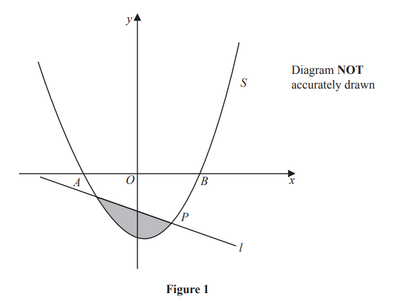

# Exam Questions — Quadratic Functions
**Equations, Identities & Inequalities** · Edexcel IGCSE Further Pure Maths (4PM1)
> Source: [https://www.savemyexams.com/igcse/further-maths/edexcel/19/topic-questions/equations-identities-and-inequalities/quadratic-functions/exam-questions/](https://www.savemyexams.com/igcse/further-maths/edexcel/19/topic-questions/equations-identities-and-inequalities/quadratic-functions/exam-questions/) · 18 questions · total 195 marks

## Q1 — medium — 13 marks · exam-questions

### 9((a)) — 4 marks — structured — from paper Specimen · 4PM1/01
The roots of a quadratic equation are $α$ and $β$ where $α+β=-\frac{7}{3}$ and $αβ=--2$

Find a quadratic equation, with integer coefficients, which has roots  $α$ and  $β$

### 9((b)) — 2 marks — structured — from paper Specimen · 4PM1/01
Given that $α>β$ and without solving the equation, show that $α--β=\frac{11}{3}$

### 9((c)) — 7 marks — structured — from paper Specimen · 4PM1/01
Given that $α>β$ and without solving the equation, form a quadratic equation, with integer coefficients, which has roots

$\frac{α+β}{α}$ and  $\frac{α-β}{β}$

## Q2 — medium — 13 marks · exam-questions

### 9((a)) — 3 marks — structured — from paper Specimen · Paper 2
$f(x)=7+4x--2x^{2}$

Given that $f(x)$ can be written in the form $P(x+Q)^{2}+R$ where $P,Q$ and $R$ are constants,

find the value of $P$, the value of $Q$ and the value of $R$.

### 9((b)) — 2 marks — structured — from paper Specimen · Paper 2
(i) Hence write down the maximum value of $f(x)$,

(ii) Write down the value of $x$ for which this maximum occurs.

### 9((c)) — 3 marks — structured — from paper Specimen · Paper 2
The curve $C$ has equation $y=7+4x--2x^{2}$

The line $l$ with equation $y=4--x$ intersects $C$ at two points.

Find the $x$ coordinates of these two points.

### 9((d)) — 5 marks — structured — from paper Specimen · Paper 2
The finite region bounded by the curve $C$ and the line $l$ is rotated $360^{\circ}$ about the $x$-axis.

Use algebraic integration to find, to 3 significant figures, the volume of the solid generated.

## Q3 — medium — 5 marks · exam-questions

### 2((a)) — 3 marks — structured — from paper June 2024 · Paper 1
$f(x)=2x^{2}+4x+9$

Given that $f(x)$ can be written in the form `A open parentheses x plus B close parentheses to the power of 2 space end exponent plus space C` , where $A,B$ and  $C$ are integers,

find the value of $A$, the value of $B$and the value of $C$

### 2((b)) — 2 marks — structured — from paper June 2024 · Paper 1
$f(x)=2x^{2}+4x+9$

Given that $f(x)$ can be written in the form `A open parentheses x plus B close parentheses squared plus C` , where $A,B$ and  $C$ are integers,

(i) Hence, or otherwise, find the value of $x$ for which `fraction numerator 1 over denominator straight f open parentheses x close parentheses end fraction`is a maximum

(ii) find the maximum value of  `fraction numerator 1 over denominator straight f open parentheses x close parentheses end fraction`

## Q4 — medium — 8 marks · exam-questions

### 3((a)) — 3 marks — structured — from paper June 2024 · Paper 1
Show that `sum from r equals 1 to n of open parentheses 5 r minus 3 close parentheses space equals space n over 2 open parentheses 5 n minus 1 close parentheses`

### 3((b)) — 2 marks — structured — from paper June 2024 · Paper 1
Hence, or otherwise, evaluate `sum from r equals 31 to 60 of open parentheses 5 r minus 3 close parentheses`

### 3((c)) — 3 marks — structured — from paper June 2024 · Paper 1
Given that `sum from r equals 1 to n of open parentheses 5 r minus 3 close parentheses space equals space 3783`

find the value of $n$

## Q5 — medium — 16 marks · exam-questions

### 10((a)) — 2 marks — structured — from paper June 2024 · Paper 1
The curve $C$ has equation $y=\frac{ax-5}{b-x}$ where $a$ and $b$ are integers and $x\neqb$

One intersection of $C$ with the coordinate axes is at the point with coordinates `open parentheses 5 over 4 comma space 0 close parentheses`

The asymptote parallel to the $y$-axis has equation $x=3$

Find the value of $a$ and the value of $b$

### 10((b)) — 5 marks — structured — from paper June 2024 · Paper 1
Sketch $C$, showing clearly the asymptotes with their equations and the coordinates of the points of intersection with the coordinate axes.

### 10((c)) — 9 marks — structured — from paper June 2024 · Paper 1
The straight line $l$ with equation $4y-7x=k$ has no points of intersection with $C$

Show, using algebra, that the range of possible values of $k$ can be written as

$m<k<n$

where $m$ and $n$ are integers to be found.

## Q6 — medium — 8 marks · exam-questions

### 2() — 8 marks — structured — from paper June 2024 · Paper 2
The quadratic equation $3x^{2}-5x+1=0$ has roots $α$ and $β$

Without solving the equation,

form a quadratic equation with integer coefficients, that has roots $\frac{α}{2β}$ and $\frac{β}{2α}$

## Q7 — medium — 10 marks · exam-questions

### 6((a)) — 3 marks — structured — from paper June 2024 · Paper 2

Figure 3 shows part of the curve $C$ with equation $y=\frac{1}{4x},x>0$ and part of the curve $S$ with equation `y space equals space 2 x squared space comma space x space greater-than or slanted equal to space 0`

The curve $C$ and the curve $S$ intersect at the point $A$

Find the coordinates of point $A$

### 6((b)) — 7 marks — structured — from paper June 2024 · Paper 2
The finite region $R$ , shown shaded in Figure 3, bounded by the curve $C$, the curve  $S$ and the straight line  $y=4$ is rotated through 360º about the $y$-axis.

Find, using algebraic integration, the exact volume of the solid formed.

## Q8 — medium — 18 marks · exam-questions

### 10((a)) — 4 marks — structured — from paper November 2024 · Paper 1
`straight f open parentheses x close parentheses equals 3 minus 4 x minus 9 x squared`

Given that `straight f open parentheses x close parentheses`can be expressed in the form `A minus B open parentheses x plus C close parentheses squared` where $A$, $B$ and $C$ are positive constants

find the value of $A$, the value of $B$and the value of $C$

### 10((b)) — 1 mark — structured — from paper November 2024 · Paper 1
`straight f open parentheses x close parentheses equals 3 minus 4 x minus 9 x squared`

Given that `straight f open parentheses x close parentheses`can be expressed in the form `A minus B open parentheses x plus C close parentheses squared` where $A$, $B$ and $C$ are positive constants

Hence write down the maximum value of `straight f open parentheses x close parentheses`

### 10((c)) — 6 marks — structured — from paper November 2024 · Paper 1
The equation `straight f open parentheses x close parentheses equals 0` has roots $α$ and $β$

Without solving the equation `straight f open parentheses x close parentheses equals 0`, form a quadratic equation, with integer coefficients, that has roots $\frac{3α}{β}$ and  $\frac{3β}{α}$

### 10((d)) — 1 mark — structured — from paper November 2024 · Paper 1
Show that $(x+y)^{3}=x^{3}+y^{3}+3xy(x+y)$

### 10((e)) — 6 marks — structured — from paper November 2024 · Paper 1
`g open parentheses x close parentheses equals 3 x squared plus q x plus r`    where $q$and  $r$ are constants

The equation $g(x)=0$ has roots $α^{2}-β$ and  $β^{2}-α$ where $α$ and  $β$are the roots of the equation `straight f open parentheses x close parentheses equals 0`

Using your answer to part (d), find in simplified exact form, the value of $q$ and the value of $r$

## Q9 — medium — 14 marks · exam-questions

### 11((a)) — 4 marks — structured — from paper June 2023 · Paper 1
$f(x)=10+6x-x^{2}$

Given that `straight f open parentheses x close parentheses` can be written in the form $A(x+B)^{2}+C$ where $A$,$B$ and $C$ are constants,

find the value of  $A$, the value of $B$ and the value of $C$

### 11((b)) — 2 marks — structured — from paper June 2023 · Paper 1
$f(x)=10+6x-x^{2}$

Given that `straight f open parentheses x close parentheses` can be written in the form $A(x+B)^{2}+C$ where $A$,$B$ and $C$ are constants,

Hence, or otherwise, find

(i) the value of $x$ for which `straight f open parentheses x close parentheses` has its greatest value

(ii) the greatest value of `straight f open parentheses x close parentheses`

### 11((c)) — 3 marks — structured — from paper June 2023 · Paper 1
The curve $C$ has equation $y=f(x)$

The curve $S$ with equation  $y=x^{2}-x+13$ intersects curve  $C$ at two points.

Find the $x$ coordinate of each of these two points.

### 11((d)) — 5 marks — structured — from paper June 2023 · Paper 1
$f(x)=10+6x-x^{2}$

Given that `straight f open parentheses x close parentheses` can be written in the form $A(x+B)^{2}+C$ where $A$,$B$ and $C$ are constants,

The curve $C$ has equation $y=f(x)$

The curve $S$ with equation  $y=x^{2}-x+13$ intersects curve  $C$ at two points.

Use algebraic integration to find the exact area of the finite region bounded by the curve $C$ and the curve $S$

## Q10 — medium — 12 marks · exam-questions

### 11((a)) — 6 marks — structured — from paper June 2023 · Paper 2
The roots of a quadratic equation $E$ are $α$and $β$ where $α>β>0$

Given that  $α-β=2\sqrt{6}$  and $α^{2}+β^{2}=30$

show that

(i) $αβ=3$

(ii) $α+β=6$

### 11((b)) — 4 marks — structured — from paper June 2023 · Paper 2
Without solving $E$

(i) find the value of  $α^{4}+β^{4}$

(ii) find the exact value of  $α^{4}--β^{4}$

### 11((c)) — 2 marks — structured — from paper June 2023 · Paper 2
Given that  $α^{4}=P+Q\sqrt{6}$ where $P$ and $Q$ are positive integers,

find the value of $P$ and the value of $Q$

## Q11 — medium — 7 marks · exam-questions

### 2((a)) — 3 marks — structured — from paper November 2023 · Paper 1
$g(x)=2x^{2}+\frac{1}{2}x-3$

Express `straight g open parentheses x close parentheses` in the form `p open parentheses x plus q close parentheses squared` where $p$, $q$ and $r$ are rational numbers to be found.

### 2((b)) — 2 marks — structured — from paper November 2023 · Paper 1
Find

(i) the minimum value of `straight g open parentheses x close parentheses`

(ii) the value of $x$at which this minimum occurs.

### 2((c)) — 2 marks — structured — from paper November 2023 · Paper 1
$h(x)=2x^{6}+\frac{1}{2}x^{3}-3$

Hence, or otherwise, write down

(i) the minimum value of `straight h open parentheses x close parentheses`

(ii) the value of $x$ at which this minimum occurs.

## Q12 — medium — 5 marks · exam-questions

### 1() — 5 marks — structured — from paper November 2023 · Paper 2
The equation $kx^{2}+8x+3k=0$ where $k$ is a constant, has real unequal roots.

Find the set of values of $k$ giving your answer in an exact simplified form.

## Q13 — medium — 15 marks · exam-questions

### 5((a)) — 3 marks — structured — from paper November 2023 · Paper 2

Figure 1 shows part of the curve $S$ with equation  $y=px^{2}+qx+r$ 
where $p$, $q$ and $r$ are constants.

The points $A$, $B$ and $P$ with coordinates (– 2, 0), (6, 0) and (4, – 6) respectively lie on $S$

Show that an equation of $S$ is $y=\frac{x^{2}}{2}-2x-6$

### 5((b)) — 5 marks — structured — from paper November 2023 · Paper 2

Figure 1 shows part of the curve $S$ with equation  $y=px^{2}+qx+r$ 
where $p$, $q$ and $r$ are constants.

The line $l$ is the normal to $S$ at the point $P$

Show that an equation of $l$ is $2y+x+8=0$

### 5((c)) — 7 marks — structured — from paper November 2023 · Paper 2

Figure 1 shows part of the curve $S$ with equation  $y=px^{2}+qx+r$ 
where $p$, $q$ and $r$ are constants.

The finite region shown shaded in Figure 1 is bounded by $S$ and  $l$

Use algebraic integration to find the exact area of the shaded region.

## Q14 — medium — 9 marks · exam-questions

### 7((a)) — 2 marks — structured — from paper November 2023 · Paper 2
Two numbers $x$ and $y$ are such that $3x-y=4$

$S=5x^{3}+y^{2}$

Show that  $S=5x^{3}+9x^{2}-24x+16$

### 7((b)) — 5 marks — structured — from paper November 2023 · Paper 2
Given that $x$ can vary,

use calculus to find the value of $x$for which $S$ is a minimum, justifying that this value of $x$ gives a minimum value of $S$

### 7((c)) — 2 marks — structured — from paper November 2023 · Paper 2
Find the minimum value of $S$

## Q15 — medium — 10 marks · exam-questions

### 10((a)) — 3 marks — structured — from paper November 2023 · Paper 2
The roots of a quadratic equation are $α$ and $β$ where

$α+β=-\frac{5}{2}\text{and}α^{3}+β^{3}=\frac{115}{8}$

Show that $αβ=4$

### 10((b)) — 7 marks — structured — from paper November 2023 · Paper 2
The roots of a quadratic equation are $α$ and $β$ where

$α+β=-\frac{5}{2}\text{and}α^{3}+β^{3}=\frac{115}{8}$

Form a quadratic equation with integer coefficients, that has roots

$\frac{α^{2}+1}{β}\text{and}\frac{β^{2}+1}{α}$

## Q16 — medium — 8 marks · exam-questions

### 5((a)) — 6 marks — structured — from paper January 2023 · Paper 1
Given that $k$ is a non‑zero constant

curve $C$ has equation `k x squared minus x y plus open parentheses k plus 1 close parentheses x equals 1`

straight line $l$ has equation $y=\frac{k}{2}x+1$

The point $A$is the only point that lies on both $C$ and $l$.

Find the value of  $k$

### 5((b)) — 2 marks — structured — from paper January 2023 · Paper 1
Hence, find the coordinates of $A$.

## Q17 — medium — 13 marks · exam-questions

### 3((a)) — 3 marks — structured — from paper January 2023 · Paper 2
$f(x)=8x^{2}+10x-3$

Given that `straight f open parentheses x close parentheses` can be written in the form `A open parentheses x plus B close parentheses squared plus C` where $A$, $B$ and $C$ are constants,

find the value of $A$, the value of $B$ and the value of $C$.

### 3((b)) — 2 marks — structured — from paper January 2023 · Paper 2
Hence, or otherwise, find,

(i) the value of $x$ for which `straight f open parentheses x close parentheses` has a minimum,

(ii) the minimum value of  `straight f open parentheses x close parentheses`.

### 3((c)) — 2 marks — structured — from paper January 2023 · Paper 2
The curve $C$ has equation `y equals straight f open parentheses x close parentheses`.

Find the $x$ coordinate of each of the points where $C$ crosses the $x$-axis.

### 3((d)) — 4 marks — structured — from paper January 2023 · Paper 2
The straight line $l$ has equation $y=2x+13$

Use algebra to find the coordinates of the two points of intersection of $C$ and  $l$ .

### 3((e)) — 2 marks — structured — from paper January 2023 · Paper 2
Using the same axes and the results of parts (b), (c) and (d),

sketch the curve $C$ and the straight line $l$ .

## Q18 — medium — 11 marks · exam-questions

### 8() — 11 marks — structured — from paper January 2023 · Paper 2
The quadratic equation

$x^{2}-4k\sqrt{2}x+2k^{4}-1=0$

where $k$ is a positive constant, has roots $α$ and $β$

Given that $α^{2}+β^{2}=66$ and that $α^{3}+β^{3}=p\sqrt{2}$ where $p$ is an integer,

find the value of $p$
