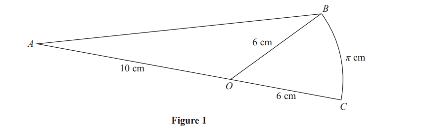
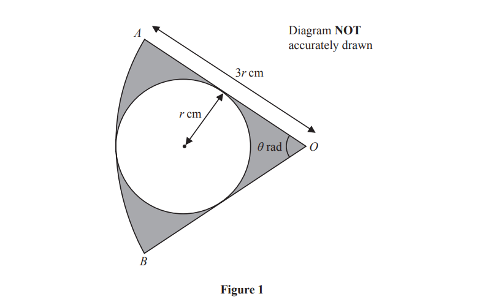
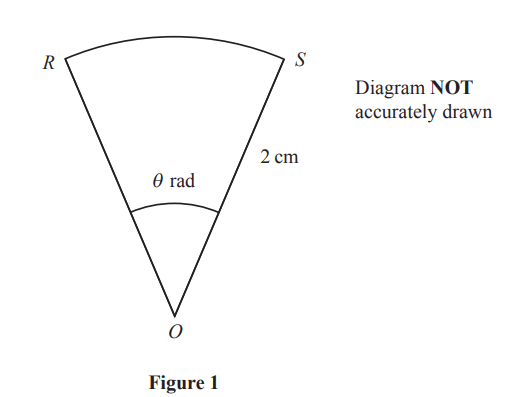
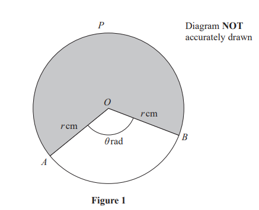
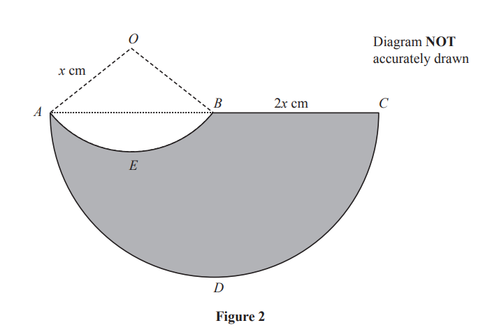
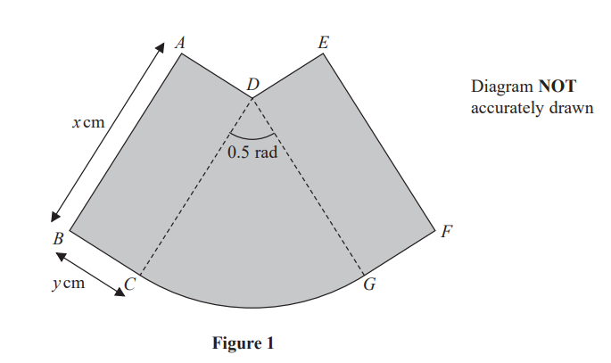

# Exam Questions — Radians
**Geometry & Trigonometry** · Edexcel IGCSE Further Pure Maths (4PM1)
> Source: [https://www.savemyexams.com/igcse/further-maths/edexcel/19/topic-questions/geometry-and-trigonometry/radians/exam-questions/](https://www.savemyexams.com/igcse/further-maths/edexcel/19/topic-questions/geometry-and-trigonometry/radians/exam-questions/) · 6 questions · total 46 marks

## Q1 — medium — 3 marks · exam-questions

### 2((b)) — 3 marks — structured — from paper Specimen · 4PM1/01

Figure 1 shows a shape $ABC$in which $AOB$ is a triangle, $AOC$ is a straight line and $OBC$ is a sector of a circle with centre $O$.

$AO=10$cm $,OC=OB=6$cm and the length of arc $BC=π$ cm.

Find, to 3 significant figures, the area of the shape $ABC$.

## Q2 — medium — 6 marks · exam-questions

### 3((a)) — 2 marks — structured — from paper June 2024 · Paper 2

Figure 1 shows the sector $AOB$ of a circle with centre $O$ and radius $3r$ cm

A circle with radius $r$ cm touches $OA$ and $OB$ and the arc $AB$

Angle $AOB$is $θ$ radians, where $0<θ<\frac{π}{2}$

Find the exact value of $θ$

### 3((b)) — 4 marks — structured — from paper June 2024 · Paper 2
The area of the region shown shaded in Figure 1 is $8π$ cm2

Find the value of $r$

## Q3 — medium — 5 marks · exam-questions

### 1((a)) — 2 marks — command: argue — structured — from paper November 2024 · Paper 2

Figure 1 shows sector $ROS$ of a circle with centre $O$ and radius 2 cm 
The size of angle  $ROS$ is $θ$ radians.

The area of sector $ROS$ is $\frac{π}{2}\mathrm{cm}^{2}$. Find the exact value of  $θ$

### 1((b)) — 3 marks — structured — from paper November 2024 · Paper 2

Figure 1 shows sector $ROS$ of a circle with centre $O$ and radius 2 cm 
The size of angle  $ROS$ is $θ$ radians.

The perimeter of sector $ROS$ is $P$ cm. Find the exact value of $P$

## Q4 — medium — 6 marks · exam-questions

### 3() — 6 marks — structured — from paper June 2023 · Paper 2

Figure 1 shows a circle, centre $O$, with radius $r$ cm.

The points $A$, $P$ and $B$ lie on the circle.

The obtuse angle $AOB=θ$ radians.

The area of the sector $APBO$, shown shaded, is 372.4 cm2 and the length of the arc $APB$ is 53.2cm.

Find, to 3 significant figures where appropriate, the value of

(i) $r$

(ii) $θ$

## Q5 — medium — 13 marks · exam-questions

### 9((a)) — 7 marks — structured — from paper November 2023 · Paper 2

A logo, $AEBCD$, is shown shaded in Figure 2.

The straight line $ABC$ is the diameter of the semicircle $ADC$
$AEB$ is an arc of a circle with centre $O$
All angles are measured in radians.

- $BC=2x\mathrm{cm}$
- $OA=OB=x\mathrm{cm}$
- $\mathrm{length} \mathrm{of} \mathrm{arc}AEB=1.8x\mathrm{cm}$

The perimeter of the logo is $P$

Show that  $P=ax(π+π\mathrm{sin}0.9+b)$ where $a$ and $b$ are constants to be found.

### 9((b)) — 6 marks — structured — from paper November 2023 · Paper 2
Given that $x=10\mathrm{cm}$,

find, in cm2 to 3 significant figures, the area of the logo.

## Q6 — medium — 13 marks · exam-questions

### 8((a)) — 5 marks — structured — from paper January 2023 · Paper 1

Figure 1 shows a badge, shown shaded, made from two identical rectangles, $ABCD$ and $DEFG$, and a sector $DCG$ of a circle with centre $D$.

Each rectangle measures  $x$ cm by $y$ cm.
The radius of the sector is  $x$ cm and the angle $CDG$ is 0.5 radians.

The area of the badge is 50 cm2
The perimeter of the badge is $P$ cm.

Show that

$P=2x+\frac{100}{x}$

### 8((b)) — 6 marks — structured — from paper January 2023 · Paper 1
Given that $x$ can vary,

use calculus, to find the exact value of  $x$  for which $P$ is a minimum. 
Justify that this value of $x$ gives a minimum value for $P$

### 8((c)) — 2 marks — structured — from paper January 2023 · Paper 1
Find the minimum value of $P$
Give your answer in the form $k\sqrt{2}$, where $k$ is an integer to be found.
