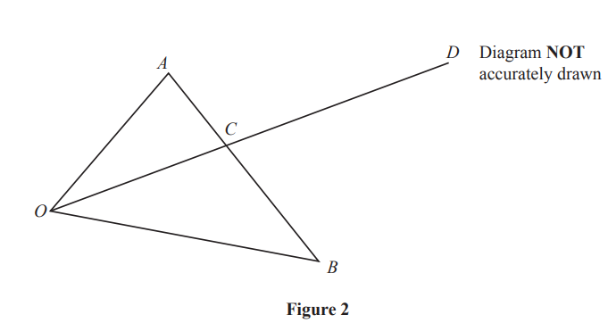
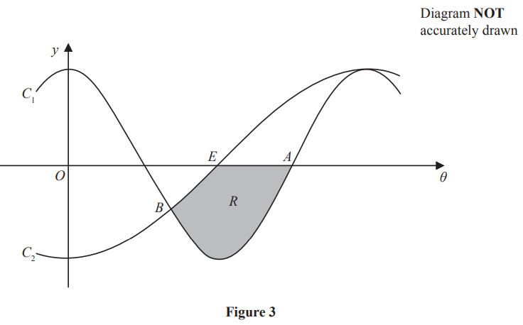
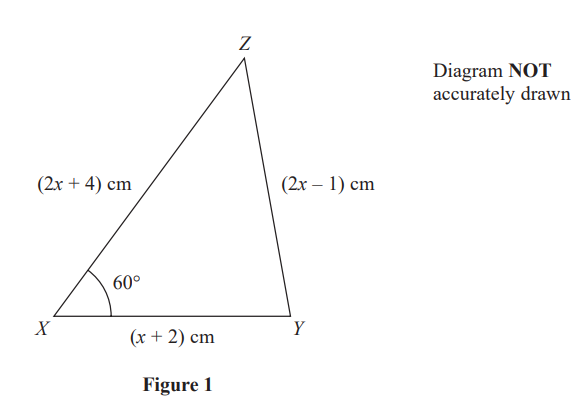

# Exam Questions — Trigonometric Formulae & Identities
**Geometry & Trigonometry** · Edexcel IGCSE Further Pure Maths (4PM1)
> Source: [https://www.savemyexams.com/igcse/further-maths/edexcel/19/topic-questions/geometry-and-trigonometry/trigonometric-formulae-and-identities/exam-questions/](https://www.savemyexams.com/igcse/further-maths/edexcel/19/topic-questions/geometry-and-trigonometry/trigonometric-formulae-and-identities/exam-questions/) · 16 questions · total 162 marks

## Q1 — medium — 3 marks · exam-questions

### 2((a)) — 3 marks — structured — from paper Specimen · 4PM1/01

Figure 1 shows a shape $ABC$in which $AOB$ is a triangle, $AOC$ is a straight line and $OBC$ is a sector of a circle with centre $O$.

$AO=10$cm $,OC=OB=6$cm and the length of arc $BC=π$ cm.

Find, to 3 significant figures, the length of $AB$.

## Q2 — medium — 15 marks · exam-questions

### 10((a)) — 3 marks — structured — from paper Specimen · 4PM1/01

Figure 2 shows a right pyramid $ABCDO$with a horizontal square base of side 8 cm. The vertical height of the pyramid is $h$ cm and $OA=OB=OC=OD=12$ cm.

Find the exact value of $h$.

### 10((b)) — 2 marks — structured — from paper Specimen · 4PM1/01
Find, to 1 decimal place, the size of the angle between $OA$ and the plane $ABCD$.

### 10((c)) — 2 marks — structured — from paper Specimen · 4PM1/01
Find, to 1 decimal place, the size of the angle between the plane $AOB$ and the plane $ABCD$.

### 10((d)) — 4 marks — structured — from paper Specimen · 4PM1/01
The midpoint of $OA$is  $P$ and $Q$ is the point on $BC$ such that $BQ:QC=3:1$

Show that $PQ=4\sqrt{5}$ cm.

### 10((e)) — 4 marks — structured — from paper Specimen · 4PM1/01
Find, to 1 decimal place, the size of angle $PQA$.

## Q3 — medium — 7 marks · exam-questions

### 5((a)) — 2 marks — structured — from paper Specimen · Paper 2
Show that $\mathrm{cos}(A-B)--\mathrm{cos}(A+B)=2\mathrm{sin}A\mathrm{sin}B$

### 5((b)) — 1 mark — structured — from paper Specimen  · Paper 2
Hence express $2\mathrm{sin}5x\mathrm{sin}3x$ in the form  $\mathrm{cos}mx-\mathrm{cos}nx$where $m$ and  $n$ are integers, giving the value of $m$ and the value of $n$,

### 5((c)) — 4 marks — structured — from paper Specimen · Paper 2
(i) Find `integral 4 sin space 5 theta space sin 3 theta space straight d theta`

(ii) Hence evaluate `integral subscript 0 superscript straight pi over 6 end superscript 4 sin space 5 theta space sin 3 theta space straight d theta`, giving your answer in the form  $\frac{a\sqrt{b}}{c}$ where $a$, $b$ and  $c$ are integers.

## Q4 — medium — 4 marks · exam-questions

### 1() — 4 marks — structured — from paper June 2024 · Paper 1
In triangle $ABC$, $AB$= $2x$cm, $BC=3x$ cm and $AC=4x$ cm

The area of triangle $ABC$ is $50$ cm2

Find, to 2 decimal places, the value of $x$

## Q5 — medium — 15 marks · exam-questions

### 9((a)) — 3 marks — structured — from paper June 2024 · Paper 2

Figure 5 shows a right triangular prism $ABCDEF$where $ABCD$ is a rectangle.

$AF=DEBF=CEAD=FE=BCAB=DC=24$ cm

`angle A B F space equals space angle D C E space equals space 45 degree     angle B A F space equals space angle C D E space equals 60 degree`

Using a formula from page 2,

show that $\mathrm{sin}AFB=\frac{\sqrt{2}+\sqrt{6}}{4}$

### 9((b)) — 5 marks — structured — from paper June 2024 · Paper 2
Without using a calculator,

show that `B F space equals space 12 open parentheses 3 square root of 2 space minus space square root of 6 close parentheses`cm

### 9((c)) — 3 marks — structured — from paper June 2024 · Paper 2
The angle between the plane $AEB$and the plane $ABCD$is $65^{\circ}$

Find, in cm to 2 significant figures, the length of $EF$

### 9((d)) — 4 marks — structured — from paper June 2024 · Paper 2
Find, in degrees to one decimal place, the size of the angle between the line $CF$and the plane $ABCD$

## Q6 — medium — 16 marks · exam-questions

### 11((a)) — 4 marks — structured — from paper June 2024 · Paper 2
Using [formulae ](https://cdn.savemyexams.com/uploads/2026/02/33569-EDX%20IGCSE%20Further%20Pure%20Maths%20Formulae%20Sheet.pdf), show that

(i) $\mathrm{cos}2A=2\mathrm{cos}^{2}A-1$

(3)

(ii) $\mathrm{sin}2A=2\mathrm{sin}A\mathrm{cos}A$

(1)

### 11((b)) — 4 marks — structured — from paper June 2024 · Paper 2
Show that $\mathrm{cos}^{3}A=\frac{\mathrm{cos}3A+3\mathrm{cos}A}{4}$

### 11((c)) — 4 marks — structured — from paper June 2024 · Paper 2
Hence, or otherwise, solve, giving exact values in terms of $π$

`8 space cos cubed space open parentheses theta over 2 close parentheses space minus space 6 space cos space open parentheses theta over 2 close parentheses space minus space 1 space equals space 0`   for `0 space less-than or slanted equal to space theta space less-than or slanted equal to space 2 straight pi`

### 11((d)) — 4 marks — structured — from paper June 2024 · Paper 2
Use algebraic integration to find the exact value of

`integral subscript 0 superscript straight pi over 6 end superscript open parentheses 4 space cos cubed space theta space minus space sin space 2 theta close parentheses space straight d theta`

## Q7 — medium — 5 marks · exam-questions

### 3((a)) — 5 marks — structured — from paper Nov 2024 · Paper 1
Triangle $ABC$is such that

$AC=10\mathrm{cm}BC=7\mathrm{cm} \mathrm{angle}CAB=25^{\circ}$

Given that angle $ABC$is obtuse,

find, in cm to one decimal place, the length of $AB$

## Q8 — medium — 11 marks · exam-questions

### 8((a)) — 2 marks — structured — from paper November 2024 · Paper 1
Using a [formula ](https://cdn.savemyexams.com/uploads/2026/02/33569-EDX%20IGCSE%20Further%20Pure%20Maths%20Formulae%20Sheet.pdf), show that

$\mathrm{tan}2A=\frac{2\mathrm{tan}A}{1-\mathrm{tan}^{2}A}$

### 8((b)) — 5 marks — structured — from paper November 2024 · Paper 1
Hence, solve the equation

$\mathrm{tan}A^{\circ}-\mathrm{tan}2A^{\circ}=0$              for `0 less-than or slanted equal to A less-than or slanted equal to 180`

### 8((c)) — 4 marks — structured — from paper November 2024 · Paper 1
Using a formula given on page 2, solve, giving your solutions as exact values

`cos open parentheses x minus pi over 6 close parentheses equals sin x`        for `negative pi less-than or slanted equal to x less-than or slanted equal to 2 pi`

## Q9 — medium — 12 marks · exam-questions

### 8((a)) — 3 marks — structured — from paper November 2024 · Paper 2

Figure 2 shows triangle $AOB$

$\overset{\rightarrow}{OA}=4a+5b\overset{\rightarrow}{OB}=8a-b\overset{\rightarrow}{OD}=15a+10b$      where `vertical line bold a vertical line equals vertical line bold b vertical line equals 1`

(i) Find $\overset{\rightarrow}{AB}$ in terms of $a$ and $b$

[2]

(ii) Find, in its simplest form, the exact value of `vertical line stack A B with rightwards arrow on top vertical line`

[1]

### 8((b)) — 4 marks — structured — from paper November 2024 · Paper 2

Figure 2 shows triangle $AOB$

$\overset{\rightarrow}{OA}=4a+5b\overset{\rightarrow}{OB}=8a-b\overset{\rightarrow}{OD}=15a+10b$      where `vertical line bold a vertical line equals vertical line bold b vertical line equals 1`

Find the area of triangle $AOB$

### 8((c)) — 5 marks — structured — from paper November 2024 · Paper 2

Figure 2 shows triangle $AOB$

$\overset{\rightarrow}{OA}=4a+5b\overset{\rightarrow}{OB}=8a-b\overset{\rightarrow}{OD}=15a+10b$      where `vertical line bold a vertical line equals vertical line bold b vertical line equals 1`

The point $C$ lies on $AB$ and $OD$ such that $O$, $C$ and $D$ are collinear.

Use a vector method to find vector  $\overset{\rightarrow}{OC}$ as a simplified expression in terms of  $a$ and $b$

## Q10 — medium — 14 marks · exam-questions

### 9((a)) — 2 marks — structured — from paper November 2024 · Paper 2
Using a [formula](https://cdn.savemyexams.com/uploads/2026/02/33569-EDX%20IGCSE%20Further%20Pure%20Maths%20Formulae%20Sheet.pdf), show that

$\mathrm{cos}2θ=2\mathrm{cos}^{2}θ-1$

### 9((b)) — 4 marks — structured — from paper November 2024 · Paper 2
Using a [formula](https://cdn.savemyexams.com/uploads/2026/02/33569-EDX%20IGCSE%20Further%20Pure%20Maths%20Formulae%20Sheet.pdf), show that

$\mathrm{cos}2θ=2\mathrm{cos}^{2}θ-1$

Hence show that

`integral subscript pi over 3 end subscript superscript fraction numerator 3 pi over denominator 4 end fraction end superscript open parentheses 2 space cos to the power of 2 space end exponent theta minus 1 close parentheses   d theta equals negative fraction numerator a plus square root of b over denominator c end fraction`

where $a$, $b$ and $c$ are integers to be found.

### 9((c)) — 8 marks — structured — from paper November 2024 · Paper 2

Figure 3 shows part of the curve $C_{1}$ with equation $y=2\mathrm{cos}^{2}θ-1$and part of the curve $C_{2}$ with equation $y=-\mathrm{cos}θ$

Point $B$ is the intersection of  $C_{1}$ and $C_{2}$ as shown in Figure 3

Point $A$`open parentheses fraction numerator 3 straight pi over denominator 4 end fraction comma 0 close parentheses` is the intersection of  $C_{1}$ with the $θ$-axis as shown in Figure 3

Point $E$ `open parentheses pi over 2 comma 0 close parentheses` is the intersection of  $C_{2}$ with the $θ$-axis as shown in Figure 3

The finite region $R$, shown shaded in Figure 3, is bounded by the $θ$-axis, $C_{1}$ and $C_{2}$

Use calculus to find, in its simplest form, the exact area of  $R$

## Q11 — medium — 13 marks · exam-questions

### 9((a)) — 4 marks — structured — from paper June 2023 · Paper 1
Using the [formulae](https://cdn.savemyexams.com/uploads/2026/02/33569-EDX%20IGCSE%20Further%20Pure%20Maths%20Formulae%20Sheet.pdf) , show that

(i) $\mathrm{cos}^{2}A=\frac{\mathrm{cos}2A+1}{2}$

(ii) $\mathrm{sin}^{2}A=\frac{1-\mathrm{cos}2A}{2}$

### 9((b)) — 5 marks — structured — from paper June 2023 · Paper 1
Show that

$(2\mathrm{sin}x-\mathrm{cos}x)(\mathrm{sin}x-3\mathrm{cos}x)=\frac{1}{2}(\mathrm{cos}2x-7\mathrm{sin}2x+5)$

### 9((c)) — 4 marks — structured — from paper June 2023 · Paper 1
$y=(2\mathrm{sin}x-\mathrm{cos}x)(\mathrm{sin}x-3\mathrm{cos}x)$

Solve, for  `0 degree less-than or slanted equal to x less-than or slanted equal to 180 degree`  the equation, $\frac{dy}{dx}=0$

Give your answers to the nearest whole number.

## Q12 — medium — 6 marks · exam-questions

### 6((a)) — 1 mark — structured — from paper June 2023 · Paper 2

Figure 3 shows a right triangular prism $ABCDEF$. A cross section $ABC$ of the prism is a triangle in which $AB=AC=r\mathrm{cm}$ and `angle C A B equals pi over italic 3`radians.

In the prism

$AE=BF=CD=5\text{cm}ED=EF=r\text{cm}$ and `angle D E F equals pi over italic 3` radians.

Show that the volume of the prism is $\frac{5\sqrt{3}}{4}r^{2}\text{cm}^{3}$

### 6((b)) — 5 marks — structured — from paper June 2023 · Paper 2

Figure 3 shows a right triangular prism $ABCDEF$. A cross section $ABC$ of the prism is a triangle in which $AB=AC=r\mathrm{cm}$ and `angle C A B equals pi over italic 3`radians.

The volume of the prism is increasing in such a way that the size of `angle C A B` and the size of `angle D E F` remain constant and the length of $AE$, the length of $BF$ and the length of $CD$ remain constant. 
The lengths of $AB,AC,ED$ and $EF$ are each increasing at a constant rate of 0.2cm / s

Find the exact rate of increase, in cm3 / s, of the volume of the prism when the area of the rectangular face $BCDF$ is 60 cm2

## Q13 — medium — 17 marks · exam-questions

### 10((a)) — 3 marks — structured — from paper November 2023 · Paper 1
Using [formulae](https://cdn.savemyexams.com/uploads/2026/02/33569-EDX%20IGCSE%20Further%20Pure%20Maths%20Formulae%20Sheet.pdf) , show that

(i) $\mathrm{sin}2A=2\mathrm{sin}A\mathrm{cos}A$

(ii) $\mathrm{cos}2A=2\mathrm{cos}^{2}A-1$

### 10((b)) — 4 marks — structured — from paper November 2023 · Paper 1
`straight f open parentheses theta close parentheses equals fraction numerator 2 tan theta over denominator 1 plus tan squared theta end fraction`

Show that $f(θ)=\mathrm{sin}2θ$

### 10((c)) — 6 marks — structured — from paper November 2023 · Paper 1
Solve, in radians to 3 significant figures, for `negative pi over 2 less-than or slanted equal to x less-than or slanted equal to pi over 2`, the equation

`5 space tan open parentheses x plus pi over 6 close parentheses equals open square brackets 1 plus tan squared open parentheses x plus pi over 6 close parentheses close square brackets open square brackets 1 minus 2 space cos squared open parentheses x plus pi over 6 close parentheses close square brackets`

### 10((d)) — 4 marks — structured — from paper November 2023 · Paper 1
Using calculus, find the exact value of

`integral subscript 0 superscript pi over 2 end superscript open parentheses fraction numerator 4 space tan space theta over denominator 1 plus tan squared space theta end fraction minus cos space 5 theta plus 2 close parentheses   straight d theta`

## Q14 — medium — 7 marks · exam-questions

### 2((a)) — 4 marks — structured — from paper November 2023 · Paper 2
In triangle $ABC$, $AB=3x\mathrm{cm}$, $BC=5x\mathrm{cm}$ and `angle A B C equals 110 degree`

Find, in degrees to one decimal place, the size of `angle B C A`

### 2((b)) — 3 marks — structured — from paper November 2023 · Paper 2
In triangle $ABC$, $AB=3x\mathrm{cm}$, $BC=5x\mathrm{cm}$ and `angle A B C equals 110 degree`

The area of triangle  $ABC$ is 24 cm2 

Find, to 3 significant figures, the value of $x$

## Q15 — medium — 4 marks · exam-questions

### 2() — 4 marks — structured — from paper January 2023 · Paper 2

Figure 1 shows triangle $XYZ$ in which

`X Y equals left parenthesis x plus 2 right parenthesis text  cm end text      X Z equals left parenthesis 2 x plus 4 right parenthesis text  cm end text      Y Z equals left parenthesis 2 x minus 1 right parenthesis text  cm end text      and space space angle Y X Z equals 60 degree`

Find the value of $x$

Give your answer in the form  $p+q\sqrt{3}$ where $p$ and $q$ are integers to be found.

## Q16 — medium — 13 marks · exam-questions

### 10((a)) — 5 marks — structured — from paper January 2023 · Paper 2
Using the [formulae ](https://cdn.savemyexams.com/uploads/2026/02/33569-EDX%20IGCSE%20Further%20Pure%20Maths%20Formulae%20Sheet.pdf), show that

(i) $\mathrm{sin}2θ=2\mathrm{sin}θ\mathrm{cos}θ$

[2]

(ii) $\mathrm{cos}2θ=2\mathrm{cos}^{2}θ-1$

[3]

### 10((b)) — 4 marks — structured — from paper January 2023 · Paper 2
Given that $θ\neq(90^{\circ}+180^{\circ}n)$   where $n\inℤ$

use the results from part (a) to show that $\mathrm{sin}2θ-\mathrm{tan}θ$ can be written as $\mathrm{tan}θ\mathrm{cos}2θ$

### 10((c)) — 4 marks — structured — from paper January 2023 · Paper 2
Solve for  $0<x<360$

$\mathrm{sin}2x^{\circ}-\mathrm{tan}x^{\circ}=0$
