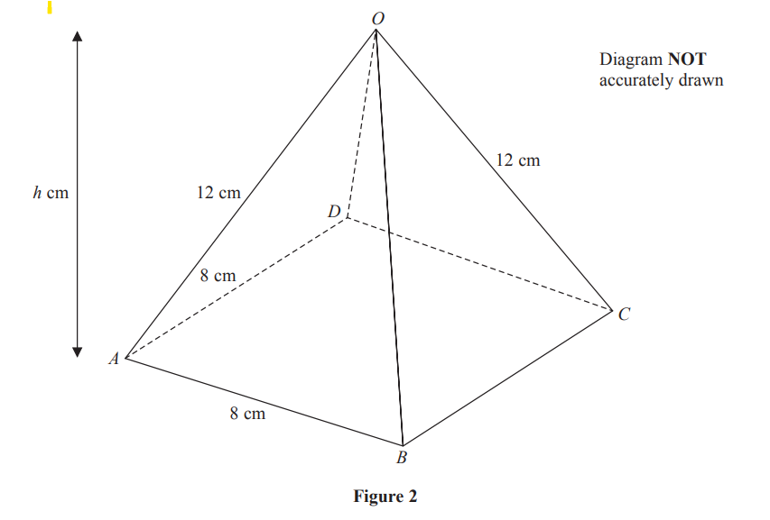
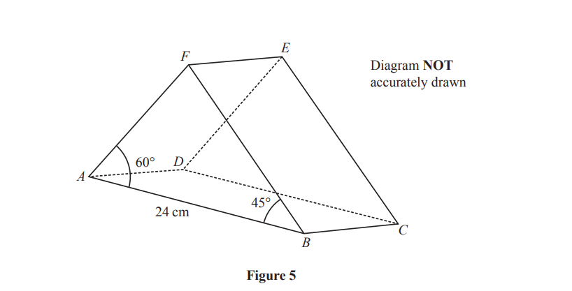
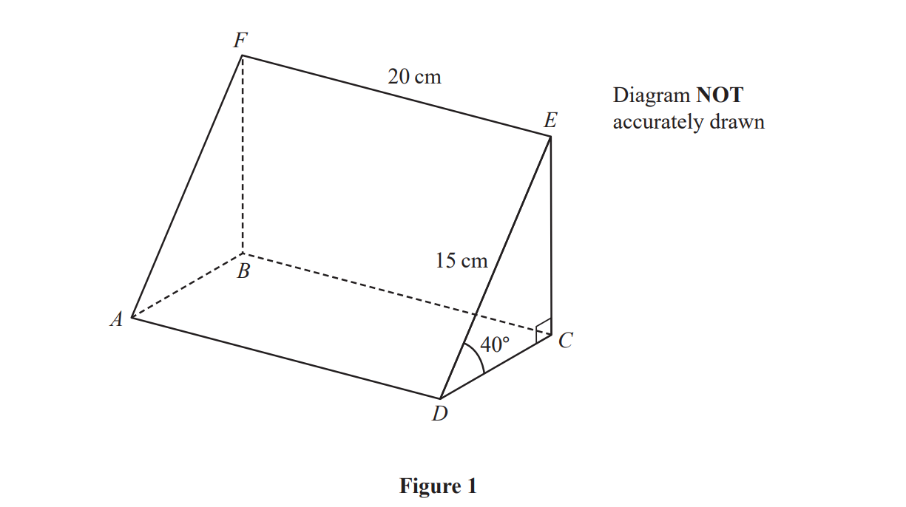
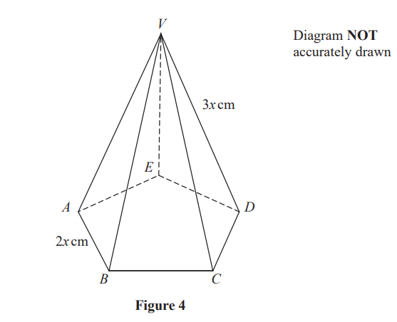
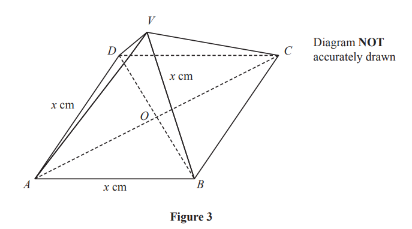
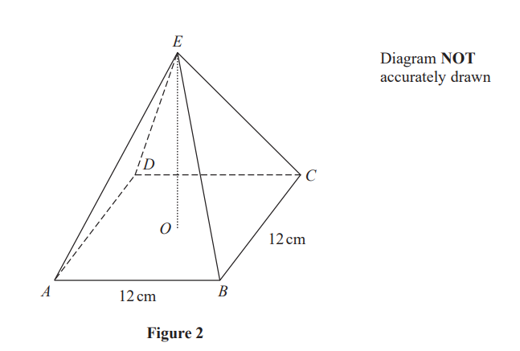

# Exam Questions — Trigonometric Ratios
**Geometry & Trigonometry** · Edexcel IGCSE Further Pure Maths (4PM1)
> Source: [https://www.savemyexams.com/igcse/further-maths/edexcel/19/topic-questions/geometry-and-trigonometry/trigonometric-ratios/exam-questions/](https://www.savemyexams.com/igcse/further-maths/edexcel/19/topic-questions/geometry-and-trigonometry/trigonometric-ratios/exam-questions/) · 7 questions · total 73 marks

## Q1 — medium — 15 marks · exam-questions

### 10((a)) — 3 marks — structured — from paper Specimen · 4PM1/01

Figure 2 shows a right pyramid $ABCDO$with a horizontal square base of side 8 cm. The vertical height of the pyramid is $h$ cm and $OA=OB=OC=OD=12$ cm.

Find the exact value of $h$.

### 10((b)) — 2 marks — structured — from paper Specimen · 4PM1/01
Find, to 1 decimal place, the size of the angle between $OA$ and the plane $ABCD$.

### 10((c)) — 2 marks — structured — from paper Specimen · 4PM1/01
Find, to 1 decimal place, the size of the angle between the plane $AOB$ and the plane $ABCD$.

### 10((d)) — 4 marks — structured — from paper Specimen · 4PM1/01
The midpoint of $OA$is  $P$ and $Q$ is the point on $BC$ such that $BQ:QC=3:1$

Show that $PQ=4\sqrt{5}$ cm.

### 10((e)) — 4 marks — structured — from paper Specimen · 4PM1/01
Find, to 1 decimal place, the size of angle $PQA$.

## Q2 — medium — 15 marks · exam-questions

### 9((a)) — 3 marks — structured — from paper June 2024 · Paper 2

Figure 5 shows a right triangular prism $ABCDEF$where $ABCD$ is a rectangle.

$AF=DEBF=CEAD=FE=BCAB=DC=24$ cm

`angle A B F space equals space angle D C E space equals space 45 degree     angle B A F space equals space angle C D E space equals 60 degree`

Using a formula from page 2,

show that $\mathrm{sin}AFB=\frac{\sqrt{2}+\sqrt{6}}{4}$

### 9((b)) — 5 marks — structured — from paper June 2024 · Paper 2
Without using a calculator,

show that `B F space equals space 12 open parentheses 3 square root of 2 space minus space square root of 6 close parentheses`cm

### 9((c)) — 3 marks — structured — from paper June 2024 · Paper 2
The angle between the plane $AEB$and the plane $ABCD$is $65^{\circ}$

Find, in cm to 2 significant figures, the length of $EF$

### 9((d)) — 4 marks — structured — from paper June 2024 · Paper 2
Find, in degrees to one decimal place, the size of the angle between the line $CF$and the plane $ABCD$

## Q3 — medium — 6 marks · exam-questions

### 4() — 6 marks — structured — from paper Nov 2024 · Paper 1

Figure 1 shows a right prism $ABCDEF$
Triangle $CDE$is a cross section of the prism.

- `space angle D C E space equals space angle A B F space equals space 90 degree`
- `angle E D C space equals space angle F A B space equals space 40 degree`
- $DE=AF=15\mathrm{cm}$
- $EF=DA=CB=20\mathrm{cm}$

Find, in degrees to one decimal place, the size of the angle between the line  $FD$and the plane $DCBA$

## Q4 — medium — 6 marks · exam-questions

### 9() — 6 marks — structured — from paper June 2023 · Paper 2

Figure 4 shows a right pyramid with vertex $V$ and base $ABCDE$which is a regular pentagon.

$AB=BC=CD=DE=EA=2x\mathrm{cm}\,VA=VB=VC=VD=VE=3x\mathrm{cm}$

Find, in degrees to one decimal place, the size of the angle between the plane $VBC$ and the base $ABCDE$

## Q5 — medium — 11 marks · exam-questions

### 6((a)) — 3 marks — structured — from paper November 2023 · Paper 1

Figure 3 shows a right pyramid with a horizontal square base.

$AB=BC=CD=DA=x\mathrm{cm}\,AV=BV=CV=DV=x\mathrm{cm}$

$O$ is the point of intersection of the diagonals of the base. 
The vertex $V$ of the pyramid is vertically above $O$

Show that  $VO=\frac{\sqrt{2}}{2}x\mathrm{cm}$

### 6((b)) — 2 marks — structured — from paper November 2023 · Paper 1
Find, in degrees, the size of the angle $AVC$

### 6((c)) — 3 marks — structured — from paper November 2023 · Paper 1
Find, in degrees to one decimal place, the size of the angle between the plane $VAB$ and the plane $VDC$.

### 6((d)) — 3 marks — structured — from paper November 2023 · Paper 1
The volume of the pyramid is 200 cm3

Given that the $\mathrm{volume} \mathrm{of}a\mathrm{pyramid}=\frac{1}{3}\times\mathrm{base} \mathrm{area}\times\mathrm{height}$

Find to 3 signficant figures, the value of $x$

## Q6 — medium — 13 marks · exam-questions

### 2((a)) — 4 marks — structured — from paper January 2023 · Paper 1
The point $A$ has coordinates (–5, 3), the point $B$ has coordinates (4, 0) and the point $C$ has coordinates (–1, 5).

The line $l$ passes through $C$ and is perpendicular to $AB$.

Find an equation of $l$ . 
Give your answer in the form  $ax+by+c=0$ where $a$, $b$ and $c$ are integers.

### 2((b)) — 3 marks — structured — from paper January 2023 · Paper 1
The line $l$  intersects $AB$ at the point $D$.

Show that the coordinates of $D$ are (-2, 2).

### 2((c)) — 2 marks — structured — from paper January 2023 · Paper 1
The point $A$ has coordinates (–5, 3), the point $B$ has coordinates (4, 0) and the point $C$ has coordinates (–1, 5).

Show that $l$ is not the perpendicular bisector of $AB$.

### 2((d)) — 4 marks — structured — from paper January 2023 · Paper 1
Find the value of `tan space angle A B C`.
Give your answer in its simplest form.

## Q7 — medium — 7 marks · exam-questions

### 5((a)) — 3 marks — structured — from paper January 2023 · Paper 2

Figure 2 shows a right pyramid with a square base $ABCD$ and vertex $E$.

The base of the pyramid is horizontal with  $AB=BC=12\mathrm{cm}$.
The diagonals of the base intersect at the point $O$.

The vertex  $E$ of the pyramid is vertically above $O$ and the angle between $EA$and the plane $ABCD$ is 30°

The height of the pyramid is $h$ cm.

Find the exact value of $h$

### 5((b)) — 4 marks — structured — from paper January 2023 · Paper 2
The point $F$ lies on $AD$ such that $AF:FD=1.4$

Calculate, to the nearest degree, the size of the angle $EFO$.
