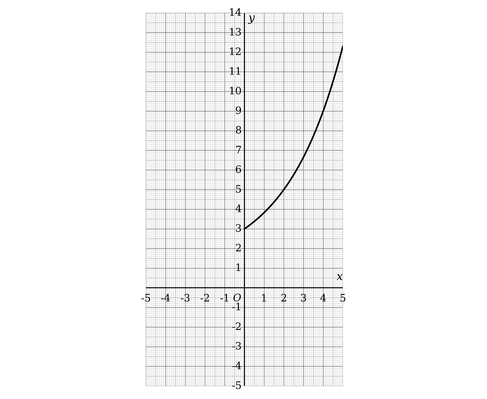
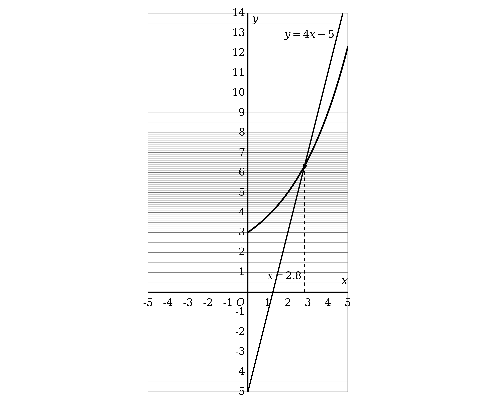
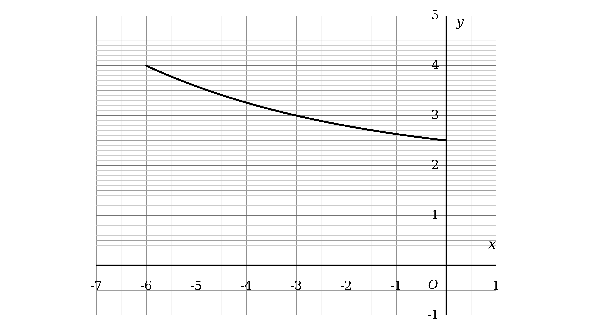
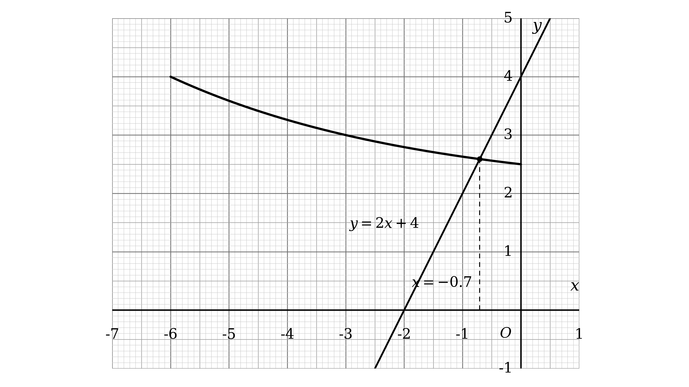

# Mark Schemes — Logarithms, Indices & Exponentials
**Logarithms, Indices & Surds** · Edexcel IGCSE Further Pure Maths (4PM1)

## Q1 — medium — 8 marks · exam-questions

### 7((a)) — 2 marks
Substitute each missing value of $x$ into `y = 2^{\left(\frac{x}{2} + 1\right)} + 1`

- Work out the index first, then the power, then add 1

For $x = 1$ the index is $\frac{1}{2} + 1 = 1 . 5$

$y = 2^{1.5} + 1$

$y = 3 . 828 \dots$

For $x = 2$ the index is $\frac{2}{2} + 1 = 2$

$y = 2^{2} + 1$

$y = 5$

For $x = 3$ the index is $\frac{3}{2} + 1 = 2 . 5$

$y = 2^{2.5} + 1$

$y = 6 . 656 \dots$

Round to 2 decimal places where the value is not exact

| $x$ | 0 | 1 | 2 | 3 | 4 | 5 |
|---|---|---|---|---|---|---|
| $y$ | 3 | **Final answer:** **3.83** | **Final answer:** **5** | **Final answer:** **6.66** | 9 | 12.31 |

**[B1 B1]**

> **[mark-scheme]**
> **B1**: Two of the three missing values correct.
> 
> **B1**: All three missing values correct, given to 2 decimal places where appropriate. Accept 5.00 for 5.

> **[exam-tip]**
> Work out the whole index before you use the power key on your calculator.
> 
> - `2^{\left(\frac{x}{2} + 1\right)}` is not the same as $2^{\frac{x}{2}} + 1$, and mis-reading the bracket is the usual cause of a wrong table
> 
> The two values already filled in are a free check on your method.
> 
> - If your working does not reproduce $y = 9$ when $x = 4$, something is wrong before you go any further

### 7((b)) — 2 marks
Plot the six points from the table, then join them with a single smooth curve

- Plot each point to within half a small square
- The curve rises slowly at first and then more steeply, so do not join the points with straight segments

**[B1 B1]**

> **[mark-scheme]**
> **B1**: All points plotted within an accuracy of half a small square.
> 
> **B1**: A smooth curve drawn through their plotted points. Follow through from an incorrect table in part (a).

> **[exam-tip]**
> Use a sharp pencil and mark each point with a small cross or dot, not a blob.
> 
> - Half a small square is the tolerance, so a thick mark can put you outside it
> 
> Join the points freehand in one smooth sweep.
> 
> - Drawing straight lines between the points, or going over the curve repeatedly until it is furry, both lose the second mark

### 7((c)) — 4 marks
The graph you have drawn is `y equals 2 to the power of open parentheses x over 2 plus 1 close parentheses end exponent plus 1`, so rearrange the equation until that expression appears

Start with the equation and use the power law on the left

`2 \text{log}_{2} \left(4 x - 6\right) - x = 2`

`2 \text{log}_{2} \left(4 x - 6\right) = x + 2`

**[M1]**

Divide through by 2

`\text{log}_{2} \left(4 x - 6\right) = \frac{x}{2} + 1`

**[M1]**

Write this in index form, which produces the expression from the graph

`4 x - 6 = 2^{\left(\frac{x}{2} + 1\right)}`

Add 1 to both sides, so that the right-hand side is exactly $y$

`4 x - 5 = 2^{\left(\frac{x}{2} + 1\right)} + 1`

So the straight line to draw is $y = 4 x - 5$

- Where it crosses the curve, the two sides of the equation are equal, and that is the root

**[M1]**

Read off the $x$ coordinate of the intersection, to 1 decimal place

$x = 2 . 8$

**[A1]**

> **[mark-scheme]**
> **M1**: Uses the power law to reach `2 \text{log}_{2} \left(4 x - 6\right) = x + 2` or an equivalent form.
> 
> **M1**: Divides by 2 to reach `\text{log}_{2} \left(4 x - 6\right) = \frac{x}{2} + 1`.
> 
> **M1**: Identifies and draws the straight line $y = 4 x - 5$ on the grid.
> 
> **A1**: $x = 2 . 8$. Accept answers in the range 2.7 to 2.9, since the value is read from a graph.

> **[exam-tip]**
> The phrase by drawing a suitable straight line tells you the plan: rearrange until one side is exactly the $y$ of the curve you already have.
> 
> - Whatever is left on the other side is the line, and it will always come out linear
> 
> Aim to finish with the printed curve expression untouched on one side.
> 
> - Here that means getting to `2^{\left(\frac{x}{2} + 1\right)} + 1`, which is why the last step is to add 1 to both sides
> 
> Draw the line right across the grid with a ruler.
> 
> - A short line stopping near the curve makes the intersection hard to read, and the answer is only as accurate as the drawing

## Q2 — medium — 7 marks · exam-questions

### 6() — 7 marks
Every logarithm has to be in the same base before the equation can be solved

- The awkward term here is $\text{log}_{x} 2$, so change that one into base 2

Use the change of base rule

$\text{log}_{x} 2 = \frac{\text{log}_{2}2}{\text{log}_{2}x}$

The numerator is $\text{log}_{2} 2$, which is 1

$\text{log}_{x} 2 = \frac{1}{\text{log}_{2}x}$

**[B1]**

Substitute this into the equation given in the question

$\text{log}_{2} x + \frac{6}{\text{log}_{2}x} = 7$

**[M1]**

Multiply every term by $\text{log}_{2} x$ to clear the fraction

`\left(\text{log}_{2} x\right)^{2} + 6 = 7 \text{log}_{2} x`

**[M1]**

Collect all the terms on one side, giving a quadratic in $\text{log}_{2} x$

`\left(\text{log}_{2} x\right)^{2} - 7 \text{log}_{2} x + 6 = 0`

**[A1]**

Factorise, treating $\text{log}_{2} x$ as the unknown

- It may help to write $y$ in place of $\text{log}_{2} x$ while you factorise

`\left(\text{log}_{2} x - 6\right) \left(\text{log}_{2} x - 1\right) = 0`

**[M1]**

Each bracket gives a value of $\text{log}_{2} x$

$\text{log}_{2} x = 6$

$\text{log}_{2} x = 1$

**[M1]**

Convert each one back into a value of $x$

- $\text{log}_{2} x = k$ means $x = 2^{k}$

$x = 2^{6}$

$x = 2^{1}$

$x=2,x=64$

**[A1]**

> **[mark-scheme]**
> **B1**: Uses the change of base rule to write $\text{log}_{x} 2$ as $\frac{1}{\text{log}_{2}x}$.
> 
> **M1**: Substitutes this into the equation, so that every logarithm is in base 2.
> 
> **M1**: Multiplies through by $\text{log}_{2} x$ and collects the terms on one side.
> 
> **A1**: Correct three-term quadratic `\left(\text{log}_{2} x\right)^{2} - 7 \text{log}_{2} x + 6 = 0`.
> 
> **M1**: A complete and correct method to solve your three-term quadratic, by factorising or by using the formula.
> 
> **M1**: Converts at least one value of $\text{log}_{2} x$ back into a value of $x$.
> 
> **A1**: Both $x = 2$ and $x = 64$.

> **[exam-tip]**
> The whole question turns on getting every logarithm into the same base first.
> 
> - The change of base rule is $\text{log}_{a} b = \frac{\text{log}_{c}b}{\text{log}_{c}a}$, and choosing base 2 here is what makes the numerator collapse to 1
> 
> Worth remembering as a shortcut: $\text{log}_{x} 2$ and $\text{log}_{2} x$ are reciprocals of one another.
> 
> Once you have a quadratic, keep track of what you are solving for.
> 
> - You are finding $\text{log}_{2} x$, not $x$, so stopping at $\text{log}_{2} x = 6$ throws away the final mark

## Q3 — medium — 9 marks · exam-questions

### 9((a)) — 2 marks
Rewrite the logarithm in index form

- $\text{log}_{a} 8 = \frac{3}{4}$ means that $a$ raised to the power $\frac{3}{4}$ gives 8

$a^{\frac{3}{4}} = 8$

Raise both sides to the power $\frac{4}{3}$, which is the reciprocal of $\frac{3}{4}$

$a = 8^{\frac{4}{3}}$

**[M1]**

The denominator 3 means take the cube root, and the numerator 4 means raise to the fourth power

`a = \left(\sqrt[3]{8}\right)^{4}`

$a = 2^{4}$

$a = 16$

**[A1]**

> **[mark-scheme]**
> **M1**: Rewrites the equation in index form as $a^{\frac{3}{4}} = 8$, or reaches $a = 8^{\frac{4}{3}}$.
> 
> **A1**: $a = 16$. Allow this mark even where the intermediate index notation is written loosely.

> **[exam-tip]**
> A logarithm statement and an index statement say the same thing two different ways.
> 
> - $\text{log}_{a} b = c$ is exactly the same as $a^{c} = b$, and swapping to the index form is almost always the way in
> 
> To undo a fractional power, raise to its reciprocal.
> 
> - Take the root first and the power second, so the numbers stay small: `\sqrt[3]{8} = 2` is much easier than $8^{4} = 4096$

### 9((b)) — 4 marks
The four terms are in three different bases, so nothing can be combined yet

- Change the two awkward terms, $\text{log}_{16} 8$ and $\text{log}_{4} 8$, into base 2

Apply the change of base rule to each of them

$4 \text{log}_{16} 8 = \frac{4\text{log}_{2}8}{\text{log}_{2}16}$

$6 x \text{log}_{4} 8 = \frac{6x\text{log}_{2}8}{\text{log}_{2}4}$

**[M1]**

Evaluate the two denominators

- $\text{log}_{2} 16 = 4$ and $\text{log}_{2} 4 = 2$

$4 \text{log}_{16} 8 = \text{log}_{2} 8$

$6 x \text{log}_{4} 8 = 3 x \text{log}_{2} 8$

The left-hand side of the identity now has every logarithm in base 2

$3 x \text{log}_{2} x - \text{log}_{2} 8 + 3 x \text{log}_{2} 8 - \text{log}_{2} x$

**[M1]**

Group the two $\text{log}_{2} x$ terms together, and the two $\text{log}_{2} 8$ terms together

`= \left(3 x - 1\right) \text{log}_{2} x + \left(3 x - 1\right) \text{log}_{2} 8`

Take out the common factor of `\left(3 x - 1\right)`

`= \left(3 x - 1\right) \left(\text{log}_{2} x + \text{log}_{2} 8\right)`

Use the addition law to combine the two logarithms into one

`= \left(3 x - 1\right) \text{log}_{2} 8 x`

**[M1]**

Finally use the power law, which moves a multiplier up to become an index

`\left(3 x - 1\right) \text{log}_{2} 8 x = \text{log}_{2} \left(8 x\right)^{3 x - 1} \textrm{ }\text{as required}`

**[A1]**

> **[mark-scheme]**
> **M1**: Uses the change of base rule on both $\text{log}_{16} 8$ and $\text{log}_{4} 8$, writing each with base 2.
> 
> **M1**: Evaluates the denominators to reach $3 x \text{log}_{2} x - \text{log}_{2} 8 + 3 x \text{log}_{2} 8 - \text{log}_{2} x$, or an equivalent correct expression.
> 
> **M1**: Factorises out `\left(3 x - 1\right)` and uses the addition law to reach `\left(3 x - 1\right) \text{log}_{2} 8 x`. Allow the equivalent route of writing the expression as $3 x \text{log}_{2} 8 x - \text{log}_{2} 8 x$ first.
> 
> **A1**: Reaches the printed result with no errors seen. An equivalent final step, such as `\text{log}_{2} \left(8 x\right)^{3 x} + \text{log}_{2} \left(8 x\right)^{- 1}` combined into a single logarithm, is acceptable.

> **[exam-tip]**
> With three different bases in one expression, converting to a common base is always the first move.
> 
> - Base 2 is the natural choice here because 4, 8 and 16 are all powers of 2
> 
> The factor `\left(3 x - 1\right)` is the clue that the printed answer has $3 x - 1$ as an index.
> 
> - Work backwards from the target if you get stuck: the power law tells you a bracket outside a logarithm must have come from an index
> 
> This is a show that question, so every step must be visible.
> 
> - Jumping from the change of base straight to the answer will not score the middle marks even if the final line is right

### 9((c)) — 3 marks
The word hence means you should use the identity you proved in part (b)

- The whole left-hand side can be replaced by the single logarithm

`\text{log}_{2} \left(8 x\right)^{3 x - 1} = 0`

A logarithm equals zero only when whatever is inside it equals 1

- $\text{log}_{2} 1 = 0$, because $2^{0} = 1$

`\left(8 x\right)^{3 x - 1} = 1`

**[M1]**

There are two separate ways a power can equal 1

- The index could be zero, since anything to the power zero is 1
- The base could be 1, since 1 to any power is 1

Take the index equal to zero first

$3 x - 1 = 0$

$x = \frac{1}{3}$

**[A1]**

Now take the base equal to 1

$8 x = 1$

$x = \frac{1}{8}$

Both values are positive, so $\text{log}_{2} x$ exists for each of them and both are valid

$x=\frac{1}{3},x=\frac{1}{8}$

**[A1]**

> **[mark-scheme]**
> **M1**: Sets the result of part (b) equal to zero and removes the logarithm, reaching `\left(8 x\right)^{3 x - 1} = 1` or `\left(3 x - 1\right) \text{log}_{2} 8 x = 0`.
> 
> **A1**: Either $x = \frac{1}{3}$ or $x = \frac{1}{8}$.
> 
> **A1**: Both $x = \frac{1}{3}$ and $x = \frac{1}{8}$.

> **[exam-tip]**
> This part is short only because part (b) did the work, so do not start again from the original four terms.
> 
> The step that costs marks is finding only one of the two solutions.
> 
> - A power equals 1 either because the index is zero or because the base is 1, and here each case gives a different value of $x$
> 
> Always check that each solution keeps every logarithm defined.
> 
> - Any value making $x$ or $8 x$ zero or negative would have to be rejected, though here both solutions are fine

## Q4 — medium — 11 marks · exam-questions

### 6((i)) — 4 marks
Both logarithms are in base $b$ already, so the laws of logarithms can be used straight away

Use the power law to write $\text{log}_{b} 9$ in terms of $\text{log}_{b} 3$

- $9 = 3^{2}$, so $\text{log}_{b} 9 = 2 \text{log}_{b} 3$

`5 \left(2 \text{log}_{b} 3 + \text{log}_{b} 3\right) = 3`

**[M1]**

Collect the like terms inside the bracket, then divide by 5

$3 \text{log}_{b} 3 = \frac{3}{5}$

$\text{log}_{b} 3 = \frac{1}{5}$

**[M1]**

Rewrite this in index form

- $\text{log}_{b} 3 = \frac{1}{5}$ means $b$ raised to the power $\frac{1}{5}$ gives 3

$b^{\frac{1}{5}} = 3$

**[M1]**

Raise both sides to the power 5

$b = 243$

**[A1]**

> **[mark-scheme]**
> **M1**: Uses the power law to write $\text{log}_{b} 9$ as $2 \text{log}_{b} 3$, giving an equation in $\text{log}_{b} 3$ only.
> 
> **M1**: Solves as far as $\text{log}_{b} 3 = \frac{1}{5}$.
> 
> **M1**: Rewrites your logarithm equation in index form, reaching $b^{\frac{1}{5}} = 3$.
> 
> **A1**: $b = 243$. Accept $3^{5}$.
> 
> Both approved methods earn full marks. If instead you combine the two logarithms first, the marks are awarded as follows.
> 
> **M1**: Uses the addition law to reach $5 \text{log}_{b} 27 = 3$.
> 
> **M1**: Solves as far as $\text{log}_{b} 27 = \frac{3}{5}$.
> 
> **M1**: Rewrites in index form, reaching $b^{\frac{3}{5}} = 27$.
> 
> **A1**: $b = 243$. Accept $27^{\frac{5}{3}}$.

> **[exam-tip]**
> There are two equally good first moves here, and both are worth full marks.
> 
> - Either use the power law to turn everything into $\text{log}_{b} 3$, or use the addition law to combine the pair into $\text{log}_{b} 27$
> - The power law route is slightly kinder at the end, because $b^{\frac{1}{5}} = 3$ leads straight to $3^{5}$
> 
> Whenever you are solving for the base itself, switch to index form as soon as you can.
> 
> - A logarithm equation with the unknown in the base is hard to work with, but $b^{\frac{1}{5}}=3$ is just an index equation

### 6() — 7 marks
Deal with the right-hand side first, since it is just a number

- $128 = 2^{7}$ and $4 = 2^{2}$, so $\text{log}_{4} 128 = \frac{7}{2}$

$8 \text{log}_{4} 128 = 28$

**[B1]**

Now convert the left-hand side into base 3

- Use the change of base rule on $\text{log}_{x} 27$

$3 \text{log}_{x} 27 = \frac{3\text{log}_{3}27}{\text{log}_{3}x}$

The numerator contains $\text{log}_{3} 27$, which is 3, so it becomes 9

$3 \text{log}_{x} 27 = \frac{9}{\text{log}_{3}x}$

The equation is now entirely in base 3

$3 \text{log}_{3} x + \frac{9}{\text{log}_{3}x} = 28$

**[M1]**

Multiply every term by $\text{log}_{3} x$ to clear the fraction

`3 \left(\text{log}_{3} x\right)^{2} + 9 = 28 \text{log}_{3} x`

**[M1]**

Collect everything on one side to give a quadratic in $\text{log}_{3} x$, then factorise

`3 \left(\text{log}_{3} x\right)^{2} - 28 \text{log}_{3} x + 9 = 0`

`\left(3 \text{log}_{3} x - 1\right) \left(\text{log}_{3} x - 9\right) = 0`

**[M1]**

Each bracket gives a value of $\text{log}_{3} x$

$\text{log}_{3} x = \frac{1}{3}$

$\text{log}_{3} x = 9$

**[A1]**

Convert each back into $x$ using $x = 3^{k}$

$x = 3^{\frac{1}{3}}$

$x = 3^{9}$

**[M1]**

The question asks for exact form, so leave the first as a power of 3

$x = 3^{\frac{1}{3}} , x = 3^{9}$

**[A1]**

> **[mark-scheme]**
> **B1**: Evaluates the right-hand side as 28.
> 
> **M1**: Uses the change of base rule on $\text{log}_{x} 27$ to give an equation in base 3 only.
> 
> **M1**: Multiplies through by $\text{log}_{3} x$ to clear the fraction. This mark depends on the previous method mark being earned.
> 
> **M1**: Forms the three-term quadratic and uses a complete and correct method to solve it. This mark depends on both previous method marks being earned.
> 
> **A1**: Both $\text{log}_{3} x = \frac{1}{3}$ and $\text{log}_{3} x = 9$.
> 
> **M1**: Converts at least one value of $\text{log}_{3} x$ back into a value of $x$.
> 
> **A1**: Both $x = 3^{\frac{1}{3}}$ and $x = 3^{9}$, or any equivalent exact form. Accept `\sqrt[3]{3}` and 19683.

> **[exam-tip]**
> Evaluate any purely numerical logarithm before you do anything else.
> 
> - Turning $8 \text{log}_{4} 128$ into 28 straight away leaves a much simpler equation to work with
> 
> The structure here is the same as any quadratic in a logarithm.
> 
> - Once you have $3 y^{2} - 28 y + 9 = 0$ with $y = \text{log}_{3} x$, it is an ordinary factorising problem
> 
> Exact form means leave the answer as a power.
> 
> - $3^{\frac{1}{3}}$ is exact, but a rounded decimal such as 1.44 is not, and would lose the final mark

## Q5 — medium — 8 marks · exam-questions

### 6() — 8 marks
The three terms use bases 2, 4 and $x$, so everything must be converted to a single base first

- Base 2 is the sensible choice, since 4 is a power of 2

Use the power law on the first two terms, and the change of base rule on the last two

$\text{log}_{2} x^{3} = 3 \text{log}_{2} x$

$\text{log}_{4} x^{2} = \frac{\text{log}_{2}x^{2}}{\text{log}_{2}4}$

$\text{log}_{x} 2 = \frac{\text{log}_{2}2}{\text{log}_{2}x}$

**[M1]**

Simplify each of these

- $\text{log}_{2} 4 = 2$ and $\text{log}_{2} 2 = 1$, and the power law turns $\text{log}_{2} x^{2}$ into $2 \text{log}_{2} x$

$\text{log}_{4} x^{2} = \frac{2\text{log}_{2}x}{2}$

$\text{log}_{4} x^{2} = \text{log}_{2} x$

$3 \text{log}_{x} 2 = \frac{3}{\text{log}_{2}x}$

**[M1]**

The equation is now entirely in base 2

$3 \text{log}_{2} x + \text{log}_{2} x - \frac{3}{\text{log}_{2}x} = 0$

**[B1]**

Multiply every term by $\text{log}_{2} x$ to clear the fraction

`3 \left(\text{log}_{2} x\right)^{2} + \left(\text{log}_{2} x\right)^{2} - 3 = 0`

**[M1]**

Collect the like terms

`4 \left(\text{log}_{2} x\right)^{2} = 3`

`\left(\text{log}_{2} x\right)^{2} = \frac{3}{4}`

Take the square root of both sides, keeping both signs

$\text{log}_{2} x = \pm \sqrt{\frac{3}{4}}$

**[M1]**

Convert each value back into $x$, using $\text{log}_{2} x = k$ meaning $x = 2^{k}$

$x = 2^{\sqrt{\frac{3}{4}}}$

$x = 2^{-\sqrt{\frac{3}{4}}}$

**[M1]**

Evaluate each and round to 3 significant figures

- Both values are positive, so $\text{log}_{2} x$ is defined for each and both are valid

`x = 1 . 82 , x = 0 . 549 \left(3 s . f .\right)`

**[A1 A1]**

> **[mark-scheme]**
> **M1**: Uses the change of base rule on $\text{log}_{4} x^{2}$ and on $\text{log}_{x} 2$, writing each with base 2.
> 
> **M1**: Simplifies using the power law and the values $\text{log}_{2} 4 = 2$ and $\text{log}_{2} 2 = 1$.
> 
> **B1**: A fully correct equation in base 2 only, $3 \text{log}_{2} x + \text{log}_{2} x - \frac{3}{\text{log}_{2}x} = 0$ or an equivalent form.
> 
> **M1**: Multiplies through by $\text{log}_{2} x$ to clear the fraction.
> 
> **M1**: Reaches `\left(\text{log}_{2} x\right)^{2} = \frac{3}{4}` and takes the square root, with both signs.
> 
> **M1**: Converts at least one value of $\text{log}_{2} x$ back into a value of $x$.
> 
> **A1**: Either $x = 1 . 82$ or $x = 0 . 549$.
> 
> **A1**: Both values correct to 3 significant figures. Accept answers which round to these.

> **[exam-tip]**
> With three different bases, decide on your common base before you write anything else.
> 
> - Pick the base that the others are powers of, which is 2 here
> 
> The two easy marks to drop are both about signs and roots.
> 
> - Taking the square root gives $\pm$, and forgetting the negative root loses one of the two answers entirely
> - The negative root gives a value of $x$ between 0 and 1, which is perfectly valid, so do not discard it as impossible
> 
> Exact form is $x = 2^{\pm\frac{\sqrt{3}}{2}}$, which is worth writing down before you reach for the calculator.
> 
> - Keep full accuracy until the very last step, then round once to 3 significant figures

## Q6 — medium — 8 marks · exam-questions

### 11() — 8 marks
Neither equation can be solved on its own, so first rewrite both using a consistent pair of bases

- Base 2 for the $x$ terms and base 3 for the $y$ terms is the tidiest choice here

Start with the first equation, and change $\text{log}_{4} x$ into base 2

$2 \text{log}_{4} x = \frac{2\text{log}_{2}x}{\text{log}_{2}4}$

The denominator is $\text{log}_{2} 4$, which is 2, so the two 2s cancel

$2 \text{log}_{4} x = \text{log}_{2} x$

**[M1]**

Split the right-hand side using the addition and power laws

- $\text{log}_{3} 3 = 1$, and the power law turns $\text{log}_{3} y^{2}$ into $2 \text{log}_{3} y$

$\text{log}_{3} 3 y^{2} = 1 + 2 \text{log}_{3} y$

**[B1]**

So the first equation becomes

$\text{log}_{2} x - 2 \text{log}_{3} y = 1$

Now do the same with the second equation

- The power law gives $\text{log}_{2} x^{3} = 3 \text{log}_{2} x$, and $\text{log}_{9} y$ changes into base 3

$8 \text{log}_{9} y = \frac{8\text{log}_{3}y}{\text{log}_{3}9}$

The denominator is $\text{log}_{3} 9$, which is 2, so the 8 halves

$8 \text{log}_{9} y = 4 \text{log}_{3} y$

**[M1]**

So the second equation becomes

$3 \text{log}_{2} x + 4 \text{log}_{3} y = 13$

**[M1]**

These are now just simultaneous equations, so write $u = \text{log}_{2} x$ and $v = \text{log}_{3} y$

$u - 2 v = 1$

$3 u + 4 v = 13$

Multiply the first equation by 2, then add it to the second to eliminate $v$

$2 u - 4 v = 2$

$5 u = 15$

**[M1]**

Solve for $u$, then substitute back for $v$

$u = 3$

$v = 1$

**[A1]**

Now undo the substitutions

- $\text{log}_{2} x = 3$ means $x = 2^{3}$, and $\text{log}_{3} y = 1$ means $y = 3^{1}$

$x = 2^{3}$

$y = 3^{1}$

**[M1]**

$x = 8 , y = 3$

**[A1]**

> **[mark-scheme]**
> **M1**: Uses the change of base rule on $\text{log}_{4} x$, writing it in base 2.
> 
> **B1**: Splits $\text{log}_{3} 3 y^{2}$ correctly into $1 + 2 \text{log}_{3} y$.
> 
> **M1**: Uses the power law and the change of base rule on the second equation, writing $8 \text{log}_{9} y$ as $4 \text{log}_{3} y$.
> 
> **M1**: A correct second equation, $3 \text{log}_{2} x + 4 \text{log}_{3} y = 13$ or an equivalent form.
> 
> **M1**: Solves your pair of simultaneous equations by any complete and correct method, to find a value for $\text{log}_{2} x$ or for $\text{log}_{3} y$. This mark depends on the earlier method marks being earned.
> 
> **A1**: Both $\text{log}_{2} x = 3$ and $\text{log}_{3} y = 1$.
> 
> **M1**: Converts at least one logarithm value back into a value of $x$ or $y$.
> 
> **A1**: Both $x = 8$ and $y = 3$.
> 
> There is no need to substitute $u$ and $v$; working directly in $\text{log}_{2} x$ and $\text{log}_{3} y$ scores identically. Converting both equations to a different common pair of bases, for example base 4 and base 3 throughout, is also fully acceptable and is marked to the same principles.

> **[exam-tip]**
> A pair of logarithm equations is usually an ordinary simultaneous equations problem in disguise.
> 
> - Once every term is a multiple of $\text{log}_{2} x$ or $\text{log}_{3} y$, treat those two as your unknowns
> 
> Substituting $u$ and $v$ is not required, but it makes the elimination step much harder to get wrong.
> 
> The most commonly missed step is splitting $\text{log}_{3} 3 y^{2}$.
> 
> - It is a product inside the logarithm, so it splits into $\text{log}_{3} 3 + \text{log}_{3} y^{2}$, and the first of those is simply 1
> 
> Remember to convert back at the end.
> 
> - Finding $u = 3$ is not the answer, since the question asks for $x$ and $y$

## Q7 — medium — 10 marks · exam-questions

### 7((a)) — 2 marks
Substitute each missing value of $x$ into `y = 0 . 5^{\left(\frac{x}{3} + 1\right)} + 2`

- Work out the index first, then the power, then add 2

For $x = - 3$ the index is $\frac{-3}{3} + 1 = 0$

$y = 0 . 5^{0} + 2$

$y = 3$

For $x = - 2$ the index is $\frac{-2}{3} + 1 = \frac{1}{3}$

$y = 0 . 5^{\frac{1}{3}} + 2$

$y = 2 . 7937 \dots$

For $x = - 1$ the index is $\frac{-1}{3} + 1 = \frac{2}{3}$

$y = 0 . 5^{\frac{2}{3}} + 2$

$y = 2 . 6299 \dots$

Round to 2 decimal places where the value is not exact

| $x$ | -6 | -5 | -4 | -3 | -2 | -1 | 0 |
|---|---|---|---|---|---|---|---|
| $y$ | 4 | 3.59 | 3.26 | **Final answer:** **3** | **Final answer:** **2.79** | **Final answer:** **2.63** | 2.5 |

**[B1 B1]**

> **[mark-scheme]**
> **B1**: Two of the three missing values correct.
> 
> **B1**: All three missing values correct to 2 decimal places. Allow 3.0 or 3.00 in place of 3.

> **[exam-tip]**
> A negative $x$ makes the index smaller, and a base below 1 means a smaller index gives a larger value.
> 
> - That is why this curve falls from left to right, unlike the usual growth curve
> 
> The entry at $x = - 3$ is worth spotting quickly.
> 
> - The index becomes exactly 0 there, and anything to the power 0 is 1, so $y = 3$ with no calculator needed

### 7((b)) — 2 marks
Plot the seven points from the table, then join them with a single smooth curve

- Plot each point to within half a small square
- The curve falls steadily and flattens out towards the right, so it must be a smooth curve rather than joined straight segments

**[B1 B1]**

> **[mark-scheme]**
> **B1**: All seven points plotted within half a small square. Follow through from an incorrect table in part (a).
> 
> **B1**: A smooth curve drawn through your plotted points, not straight line segments. Follow through from part (a).

> **[exam-tip]**
> Both marks here follow through from your table, so an arithmetic slip in part (a) does not cost you again.
> 
> - Plot what you actually worked out, and join it smoothly
> 
> The curve is quite flat on the right, so take care over the last few points.
> 
> - Between $x = - 2$ and $x = 0$ the value only drops by about 0.3, which is a third of a large square

### 7((c)) — 6 marks
The graph you have drawn is `y = 0.5^{\left(\frac{x}{3} + 1\right)} + 2`, so rearrange the equation until that expression appears

Use the power law on the logarithm, then move the other terms across

`3 \text{log}_{2} \left(2 x + 2\right) = - x - 3`

**[M1]**

Divide through by 3

`\text{log}_{2} \left(2 x + 2\right) = - \frac{x}{3} - 1`

Write this in index form

`2 x + 2 = 2^{\left(- \frac{x}{3} - 1\right)}`

**[M1]**

A negative index means a reciprocal, and $2^{-1} = 0 . 5$, so the base can be changed to 0.5

`2 x + 2 = 0.5^{\left(\frac{x}{3} + 1\right)}`

**[M1]**

Add 2 to both sides, so that the right-hand side is exactly $y$

`2 x + 4 = 0.5^{\left(\frac{x}{3} + 1\right)} + 2`

**[A1]**

So the straight line to draw is $y = 2 x + 4$

- Where it crosses the curve, the two sides of the equation are equal, and that is the root

**[M1]**

Read off the $x$ coordinate of the intersection, to 1 decimal place

$x = - 0 . 7$

**[A1]**

> **[mark-scheme]**
> **M1**: Uses the power law to reach `3 \text{log}_{2} \left(2 x + 2\right) = - x - 3`, or the equivalent `\text{log}_{2} \left(2 x + 2\right) = - \frac{x}{3} - 1`.
> 
> **M1**: Writes your logarithm equation in index form, reaching `2 x + 2 = 2^{\left(- \frac{x}{3} - 1\right)}`.
> 
> **M1**: Converts the base to 0.5, reaching `2 x + 2 = 0.5^{\left(\frac{x}{3} + 1\right)}`. Changing base within the logarithms instead, to reach `\text{log}_{0.5} \left(2 x + 2\right) = \frac{x}{3} + 1`, scores this mark equally.
> 
> **A1**: Correct rearrangement `2 x + 4 = 0.5^{\left(\frac{x}{3} + 1\right)} + 2`.
> 
> **M1**: Identifies and draws the straight line $y = 2 x + 4$ on the grid.
> 
> **A1**: $x = - 0 . 7$. Accept $- 0 . 8$, since the value is read from a graph.

> **[exam-tip]**
> The instruction to draw a suitable straight line means: rearrange until one side is exactly the $y$ of the curve you already have.
> 
> - Whatever remains on the other side is the line, and it always turns out to be linear
> 
> The step that catches people out is the change of base at the end.
> 
> - Your curve uses base 0.5 but the equation uses base 2, and $2^{-n} = 0 . 5^{n}$ is what links them
> - Getting `2 x + 2 = 2^{\left(- \frac{x}{3} - 1\right)}` and stopping there leaves you with nothing you can draw
> 
> Draw the line right across the grid with a ruler, and read the intersection to 1 decimal place.

## Q8 — medium — 8 marks · exam-questions

### 9() — 8 marks
The first equation gives $\text{e}^{2y}$ directly, so use it to get an expression for $2 y$

Rearrange the first equation

$\text{e}^{2y} = x - 2$

Take natural logarithms of both sides

`2 y = \text{ln} \left(x - 2\right)`

**[M1]**

Substitute this into the second equation, which removes $y$ altogether

`\text{ln} \left(x + 3\right) - \text{ln} \left(x - 2\right) - 1 = 0`

**[M1]**

Use the subtraction law to combine the two logarithms into one

`\text{ln} \left(\frac{x + 3}{x - 2}\right) = 1`

**[M1]**

A natural logarithm equal to 1 means the inside equals $\text{e}$

$\frac{x+3}{x-2} = \text{e}$

**[M1]**

Multiply both sides by `\left(x - 2\right)` and expand

$x + 3 = x \text{e} - 2 \text{e}$

Collect the $x$ terms on one side and the constants on the other

$3 + 2 \text{e} = x \text{e} - x$

**[M1]**

Factorise the right-hand side and divide

`3 + 2 \text{e} = x \left(\text{e} - 1\right)`

$x = \frac{3+2\text{e}}{\text{e}-1}$

**[A1]**

Now substitute this value back to find $y$

- Use `2 y = \text{ln} \left(x - 2\right)` from the first line, keeping full accuracy

`y = \frac{1}{2} \text{ln} \left(\frac{3 + 2 \text{e}}{\text{e} - 1} - 2\right)`

**[M1]**

Round each value to 2 decimal places, as the question asks

$x = 4 . 91 , y = 0 . 53$

**[A1]**

> **[mark-scheme]**
> **M1**: Rearranges the first equation and takes logarithms, reaching `2 y = \text{ln} \left(x - 2\right)` or an equivalent expression for $y$.
> 
> **M1**: Substitutes into the second equation to obtain an equation in $x$ only.
> 
> **M1**: Uses the subtraction law to combine the two logarithms into a single logarithm.
> 
> **M1**: Removes the logarithm correctly, reaching $\frac{x+3}{x-2} = \text{e}$.
> 
> **M1**: Multiplies out and collects the $x$ terms on one side. This mark depends on the previous method marks being earned, and there must be enough working shown for the step to be followed.
> 
> **A1**: $x = \frac{3+2\text{e}}{\text{e}-1}$, or 4.91 correct to 2 decimal places.
> 
> **M1**: Substitutes your value of $x$ back into either original equation to find $y$.
> 
> **A1**: $y = 0 . 53$ correct to 2 decimal places.
> 
> There are several valid routes through this question, for example working in $\text{e}^{2y}$ throughout rather than substituting for $x$ first. Any complete and correct method reaching $x = 4 . 91$ and $y = 0 . 53$ earns full marks, with the method marks awarded for the equivalent steps.

> **[exam-tip]**
> With one equation in $\text{e}^{2y}$ and one in $\text{ln}$, look for the substitution that removes a variable entirely.
> 
> - Making $2 y$ the subject of the first equation is what turns the pair into a single equation in $x$
> 
> Combine logarithms into one before you try to remove them.
> 
> - $\text{ln} A - \text{ln} B = \text{ln} \frac{A}{B}$, and you cannot undo two separate logarithms in one step
> 
> Keep $\text{e}$ exact all the way through and round only at the end.
> 
> - Rounding $\text{e}$ to 2.72 partway through will shift the second decimal place of your answers
> 
> Check your value of $x$ keeps every logarithm defined.
> 
> - `\text{ln} \left(x - 2\right)` needs $x > 2$, and 4.91 comfortably satisfies that
