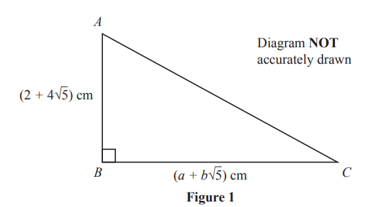

# Exam Questions — Surds
**Logarithms, Indices & Surds** · Edexcel IGCSE Further Pure Maths (4PM1)
> Source: [https://www.savemyexams.com/igcse/further-maths/edexcel/19/topic-questions/logarithms-indices-and-surds/surds/exam-questions/](https://www.savemyexams.com/igcse/further-maths/edexcel/19/topic-questions/logarithms-indices-and-surds/surds/exam-questions/) · 3 questions · total 20 marks

## Q1 — medium — 11 marks · exam-questions

### 8((a)) — 4 marks — structured — from paper Specimen · Paper 2
Expand $\frac{3}{\sqrt{1-2x}}$ in ascending powers of $x$ up to and including the term in $x^{3}$

and simplifying each term as far as possible.

### 8((b)) — 1 mark — structured — from paper Specimen · Paper 2
Write down the range of values of $x$ for which this expansion is valid.

### 8((c)) — 1 mark — structured — from paper Specimen · Paper 2
Show that $\frac{3}{\sqrt{0.9}}=\sqrt{10}$

### 8((d)) — 2 marks — structured — from paper Specimen · Paper 2
Express $\frac{1}{\sqrt{10}-3}$ in the form  $a\sqrt{10}+b$ , where $a$ and $b$ are integers.

### 8((e)) — 3 marks — structured — from paper Specimen · Paper 2
Hence, using your expansion with a suitable value for  $x$, obtain an approximation to  $5$ decimal places of  $\frac{1}{\sqrt{10}-3}$

## Q2 — medium — 5 marks · exam-questions

### 1() — 5 marks — structured — from paper June 2023 · Paper 2
Given that $\frac{a+2\sqrt{5}}{3-\sqrt{5}}=\frac{11+b\sqrt{5}}{2}$  where $a$ is an integer and $b$ is prime,

find the value of $a$  and the value of  $b$
Show your working clearly.

## Q3 — medium — 4 marks · exam-questions

### 1() — 4 marks — structured — from paper November 2023 · Paper 1

Figure 1 shows the triangle $ABC$

`angle A B C equals 90 degree      A B equals left parenthesis 2 plus 4 square root of 5 right parenthesis text  cm end text      B C equals left parenthesis a plus b square root of 5 right parenthesis text  cm  end text` where $a$ and $b$ are integers.

The area of triangle `A B C equals open parentheses 34 plus 11 square root of 5 close parentheses space cm squared`

Without using a calculator, find the value of  $a$ and the value of  $b$
