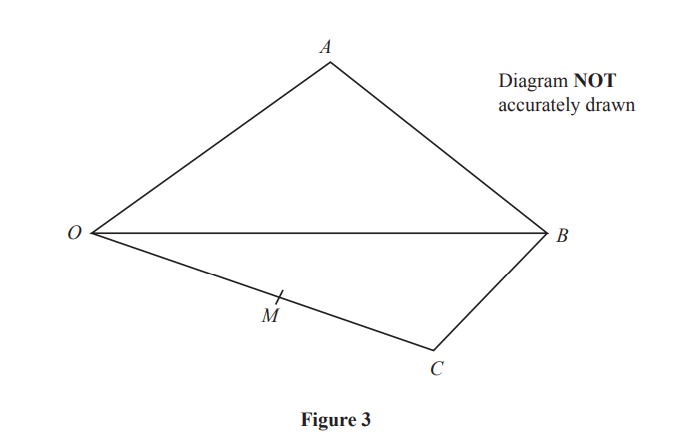
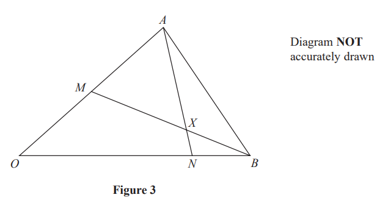

# Exam Questions — Vectors
**Vectors** · Edexcel IGCSE Further Pure Maths (4PM1)
> Source: [https://www.savemyexams.com/igcse/further-maths/edexcel/19/topic-questions/vectors/vectors/exam-questions/](https://www.savemyexams.com/igcse/further-maths/edexcel/19/topic-questions/vectors/vectors/exam-questions/) · 6 questions · total 57 marks

## Q1 — medium — 5 marks · exam-questions

### 3((a)) — 3 marks — structured — from paper Specimen · Paper 2
$O,A$ and $B$ are fixed points such that

$\overset{\rightarrow}{OA}=4i+3j\overset{\rightarrow}{OB}=8i+pj$ and     `open vertical bar stack A B with rightwards arrow on top close vertical bar space equals space 2 square root of 13`

Find the possible values of $p$.

### 3((b)) — 2 marks — structured — from paper Specimen · Paper 1
Given that $p>0$

find a unit vector parallel to $\overset{\rightarrow}{AB}$

## Q2 — medium — 11 marks · exam-questions

### 10((a)) — 3 marks — structured — from paper June 2024 · Paper 2
The points $A,B,C$ and $D$ are the vertices of a quadrilateral such that

$\overset{\rightarrow}{AB}=3a+4b\overset{\rightarrow}{AC}=7a+9b\overset{\rightarrow}{AD}=4a+5b$

Show that  $ABCD$is a parallelogram.

### 10((b)) — 8 marks — structured — from paper June 2024 · Paper 2
$BC$ is extended to the point $E$ such that $BCE$ is a straight line.

Point $F$ lies on $CD$ such that $CF:FD=1:2$

Given that $A,F$ and $E$ are collinear,

find the vector $\overset{\rightarrow}{AE}$ in the form $Xa+Yb$ where $X$and $Y$are rational numbers to be found.

## Q3 — medium — 12 marks · exam-questions

### 8((a)) — 3 marks — structured — from paper November 2024 · Paper 2

Figure 2 shows triangle $AOB$

$\overset{\rightarrow}{OA}=4a+5b\overset{\rightarrow}{OB}=8a-b\overset{\rightarrow}{OD}=15a+10b$      where `vertical line bold a vertical line equals vertical line bold b vertical line equals 1`

(i) Find $\overset{\rightarrow}{AB}$ in terms of $a$ and $b$

[2]

(ii) Find, in its simplest form, the exact value of `vertical line stack A B with rightwards arrow on top vertical line`

[1]

### 8((b)) — 4 marks — structured — from paper November 2024 · Paper 2

Figure 2 shows triangle $AOB$

$\overset{\rightarrow}{OA}=4a+5b\overset{\rightarrow}{OB}=8a-b\overset{\rightarrow}{OD}=15a+10b$      where `vertical line bold a vertical line equals vertical line bold b vertical line equals 1`

Find the area of triangle $AOB$

### 8((c)) — 5 marks — structured — from paper November 2024 · Paper 2

Figure 2 shows triangle $AOB$

$\overset{\rightarrow}{OA}=4a+5b\overset{\rightarrow}{OB}=8a-b\overset{\rightarrow}{OD}=15a+10b$      where `vertical line bold a vertical line equals vertical line bold b vertical line equals 1`

The point $C$ lies on $AB$ and $OD$ such that $O$, $C$ and $D$ are collinear.

Use a vector method to find vector  $\overset{\rightarrow}{OC}$ as a simplified expression in terms of  $a$ and $b$

## Q4 — medium — 10 marks · exam-questions

### 10() — 10 marks — structured — from paper June 2023 · Paper 1
$O$, $A$ and $B$ are fixed points such that

$\overset{\rightarrow}{OA}=(b+1)i+bj$
$\overset{\rightarrow}{AB}=3i$
The unit vector parallel to $\overset{\rightarrow}{OB}$ is `fraction numerator square root of 17 over denominator 34 end fraction   left square bracket left parenthesis 3 a plus 2 right parenthesis bold i plus b bold j right square bracket`

Given that $a$ and $b$ re constants where  $a>0$ and  $b>0$

find the exact value of

(i) $a$

[8]

(ii) $b$

[2]

## Q5 — medium — 9 marks · exam-questions

### 11((a)) — 3 marks — structured — from paper November 2023 · Paper 2

Figure 3 shows quadrilateral $OABC$ where

$\overset{\rightarrow}{OA}=4p+5q\overset{\rightarrow}{OB}=3p+q\overset{\rightarrow}{OC}=2p-4q$

The point $M$ is the midpoint of $OC$

Find $\overset{\rightarrow}{MA}$ as a simplified expression in terms of $p$ and $q$

### 11((b)) — 6 marks — structured — from paper November 2023 · Paper 2
The point $N$ lies on $OB$ such that $M$,  $N$ and $A$are collinear.

Find the ratio $MN:NA$

## Q6 — medium — 10 marks · exam-questions

### 11((a)) — 3 marks — structured — from paper January 2023 · Paper 1

Figure 3 shows triangle $OAB$ with $\overset{\rightarrow}{OA}=a$ and $\overset{\rightarrow}{OB}=b$

$M$ is the midpoint of $OA$.

$N$ is the point on $OB$ such that $ON:NB=3:1$

The lines $AN$ and $BM$ intersect at the point $X$.

Find expressions, in terms of $a$and $b$, for

(i) $\overset{\rightarrow}{AN}$

[2]

(ii) $\overset{\rightarrow}{BM}$

[1]

### 11((b)) — 7 marks — structured — from paper January 22023 · Paper 1
Using a vector method, find $AX:XN$
