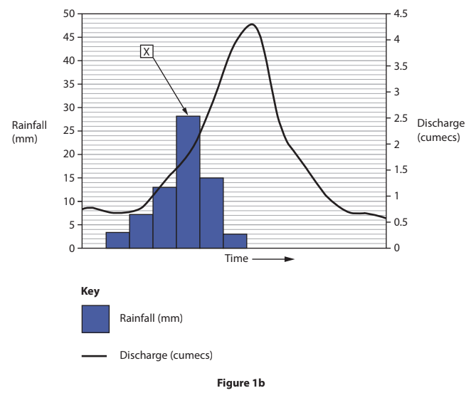
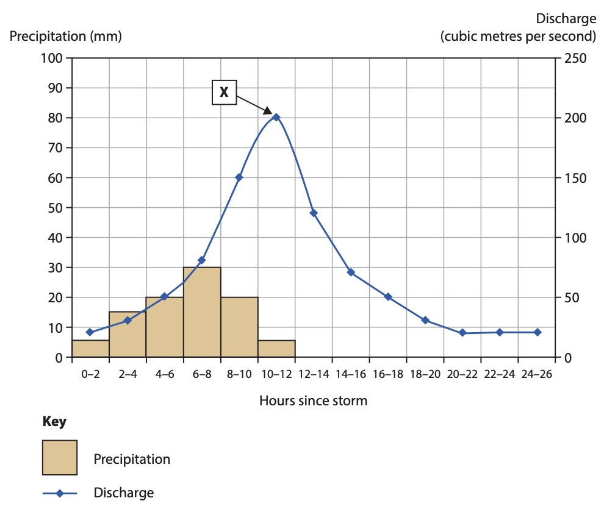
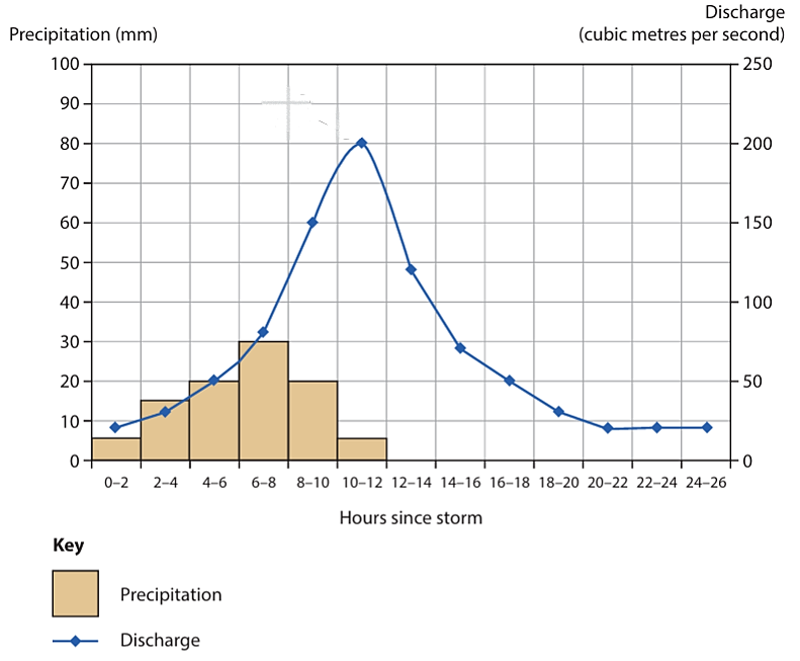
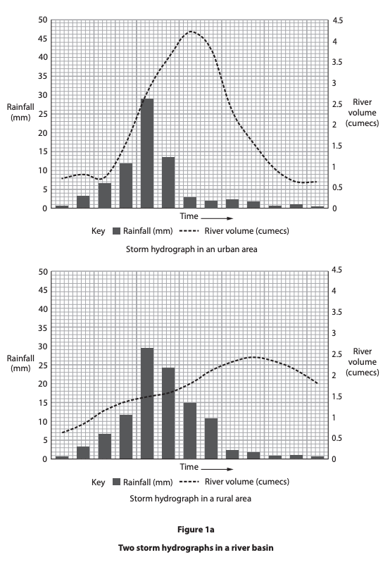
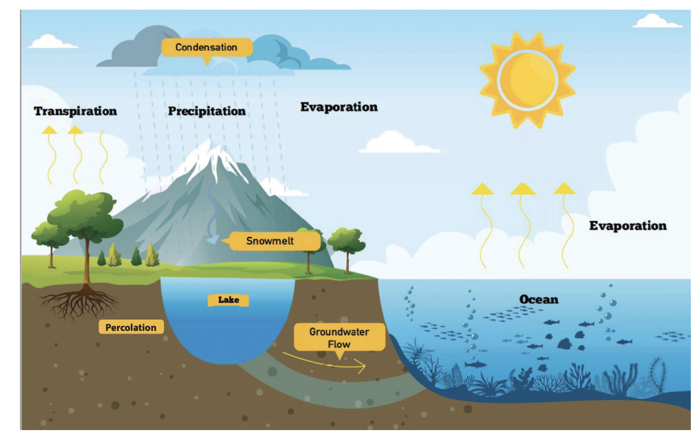
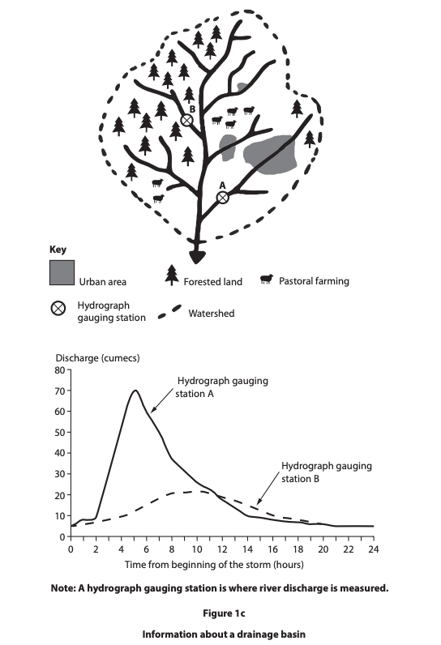

# Exam Questions — The Water Cycle & Drainage Basin System
**River Environments** · Edexcel IGCSE Geography (4GE1)
> Source: [https://www.savemyexams.com/igcse/geography/edexcel/19/topic-questions/1-river-environments/1-1-the-water-cycle-and-drainage-basin-system/exam-questions/](https://www.savemyexams.com/igcse/geography/edexcel/19/topic-questions/1-river-environments/1-1-the-water-cycle-and-drainage-basin-system/exam-questions/) · 22 questions · total 56 marks

## Q1 — easy — 2 marks · exam-questions

### 1() — 1 mark — command: state — structured — from paper June 2019 · 4GE1/01
State **one** store in the hydrological cycle.

### 1((a)) — 1 mark — multiple_choice — from paper June 2020 · 4GE1/01R
Identify the meaning of the term **river regime**.
- **A.** variation in river discharge throughout the year
- **B.** variation in river discharge over a day
- **C.** variation in river discharge over a month
- **D.** variation in river discharge throughout the week

## Q2 — easy — 3 marks · exam-questions

### 1((d)) — 2 marks — command: explain — structured — from paper June 2019 · 4GE1/01
Explain **one** method of water transfer in the hydrological cycle.

### 1() — 1 mark — multiple_choice — from paper June 2020 · 4GE1/01R
Identify the definition of the **hydrological cycle**.
- **A.** an open system made up of stores and transfers
- **B.** a closed system made up of only stores
- **C.** a closed system made up of stores and transfers
- **D.** an open system made up of only transfers

## Q3 — easy — 2 marks · exam-questions

### 1((d)) — 1 mark — multiple_choice — from paper June 2019 · 4GE1/01R
Identify the meaning of the term **river discharge**.
- **A.** the average speed of water in a river at one place at any one time
- **B.** the volume of water in a river at one place at any one time
- **C.** the average depth of a river at one place
- **D.** the average width of a river at one place

### 1() — 1 mark — command: state — structured — from paper June 2020 · 4GE1/01R
State** one **feature of a drainage basin.

## Q4 — easy — 3 marks · exam-questions

### 1() — 1 mark — multiple_choice — from paper June 2020 · 4GE1/01R
Identify the meaning of the term **drainage basin**.
- **A.** an area of land where water is stored
- **B.** an area of land where water levels vary
- **C.** an area of land where flooding occurs
- **D.** an area of land drained by a river

### 1((c)) — 2 marks — command: explain — structured — from paper June 2021 · 4GE1/01
Explain the term **lag time**.

## Q5 — easy — 1 marks · exam-questions

### 1((c)) — 1 mark — command: state — structured — from paper June 2020 · 4GE1/01R
State **one** physical factor that affects river discharge.

## Q6 — easy — 2 marks · exam-questions

### 1() — 1 mark — multiple_choice — from paper Nov 2021 · 4GE1/01
Identify **one** transfer in the hydrological cycle
- **A.** Groundwater
- **B.** Infiltration
- **C.** Interception
- **D.** Lake

### 2() — 1 mark — multiple_choice — from paper Nov 2021 · 4GE1/01
Identify the statement that best defines **evapotranspiration**
- **A.** Loss of water from the ground from water stores and plants
- **B.** Movement of water through the soil
- **C.** Loss of water from the atmosphere into other stores
- **D.** Movement of water over the ground into other stores

## Q7 — easy — 2 marks · exam-questions

### 1() — 1 mark — multiple_choice — from paper June 2022 · 4GE1/01
Identify the best definition of a watershed
- **A.** A boundary of a drainage basin
- **B.** Bend in a river
- **C.** Where a river meets the sea
- **D.** Where two rivers meet

### 2() — 1 mark — multiple_choice — from paper June 2022 · 4GE1/01R
Identify the best definition of a river mouth
- **A.** Bend in a river
- **B.** Starting point of a river
- **C.** Where two rivers meet
- **D.** Where a river meets the sea

## Q8 — easy — 2 marks · exam-questions

### 1() — 1 mark — command: state — structured — from paper June 2022 · 4GE1/01
State **one** transfer of the hydrological cycle

### 2() — 1 mark — command: state — structured — from paper June 2022 · 4GE1/01R
State** one** store in the hydrological cycle

## Q9 — easy — 1 marks · exam-questions

### 1() — 1 mark — command: identify — structured — from paper June 2022 · 4GE1/01
Study Figure 1b below

Identify the feature of the storm hydrograph labelled X

## Q10 — easy — 1 marks · exam-questions

### 1((a)) — 1 mark — multiple_choice — from paper May 2023 · 4GE1/01
Identify **one** physical factor that affects river regimes.
- **A.** amount of rainfall
- **B.** building a reservoir
- **C.** building a football stadium
- **D.** size of river mouth

## Q11 — easy — 1 marks · exam-questions

### 1((a)) — 1 mark — multiple_choice — from paper May 2023 · 4GE1/01
Identify the best definition of the term evaporation.
- **A.** any form of water that falls from the sky
- **B.** the emission of water vapour from leaves
- **C.** water changing from a gas to a liquid
- **D.** water changing from a liquid to a gas

## Q12 — easy — 1 marks · exam-questions

### 1() — 1 mark — multiple_choice
Identify the best definition of a river source.
- **A.** a smaller river that joins a larger river
- **B.** where the river meets the sea
- **C.** where the river starts
- **D.** where two rivers meet

## Q13 — easy — 1 marks · exam-questions

### 1((d)) — 1 mark — command: identify — structured — from paper May 2024 · 4GE1/01
Study Figure 1b in the Resource Booklet.

Identify the feature of the storm hydrograph labelled X.

*Figure 1b*

## Q14 — easy — 3 marks · exam-questions

### 1((a)) — 1 mark — multiple_choice — from paper May 2023 · 4GE1/01R
Identify the best definition of the term precipitation.
- **A.** any form of water that falls from the sky
- **B.** the emission of water vapour from leaves
- **C.** water changing from a gas to a liquid
- **D.** water changing from a liquid to a gas

### 1() — 2 marks — command: explain — structured — from paper May 2023 · 4GE1/01R
Explain **one** way temperature can affect river regimes

## Q15 — easy — 3 marks · exam-questions

### 1() — 3 marks — command: describe — structured
Study** Figure 2**, a flood hydrograph showing river discharge following a period of heavy rainfall.

Using **Figure 2**, describe the changes in river discharge shown.

## Q16 — easy — 3 marks · exam-questions

### 1() — 3 marks — command: explain — structured
Explain why deforestation in a drainage basin can increase the risk of flooding.

## Q17 — medium — 4 marks · exam-questions

### 1((c)) — 4 marks — command: suggest — structured — from paper Nov 2021 · 4GE1/01
Study Figure 1a which shows two storm hydrographs

Suggest two physical factors that affect the differences in lag time

## Q18 — medium — 3 marks · exam-questions

### 1((e)) — 3 marks — command: explain — structured — from paper June 2022 · 4GE1/01
Explain how urban land use can affect river regimes

## Q19 — medium — 4 marks · exam-questions

### 1((c)) — 4 marks — command: explain — structured — from paper June 2023 · 4GE1/01R
Study Figure 1a.

*Figure 1a - The hydrological Cycle*

Explain two transfers in the hydrological cycle shown.

## Q20 — medium — 3 marks · exam-questions

### 1((d)) — 3 marks — command: explain — structured — from paper June 2023 · 4GE1/01R
Explain how **one **physical factor can affect river regimes.

## Q21 — medium — 3 marks · exam-questions

### 1((f)) — 3 marks — command: explain — structured — from paper June 2024 · 4GE1/01
Explain **one** way dams can affect river regimes.

## Q22 — hard — 8 marks · exam-questions

### 1((h)) — 8 marks — command: analyse — structured — from paper June 2022 · 4GE1/01R
Study Figure 1c below

Analyse the factors that affect the river regime shown in figure 1c

