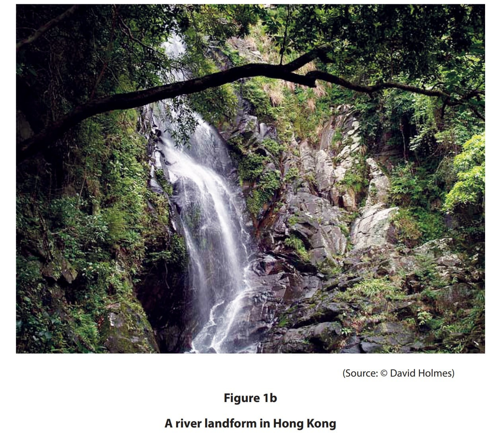
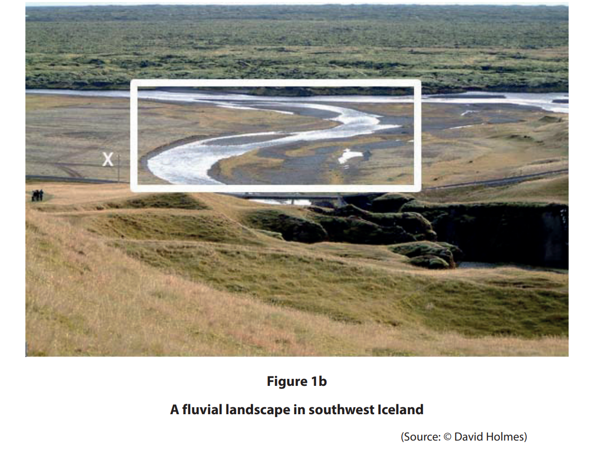
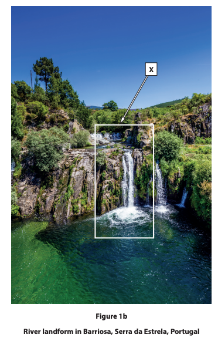
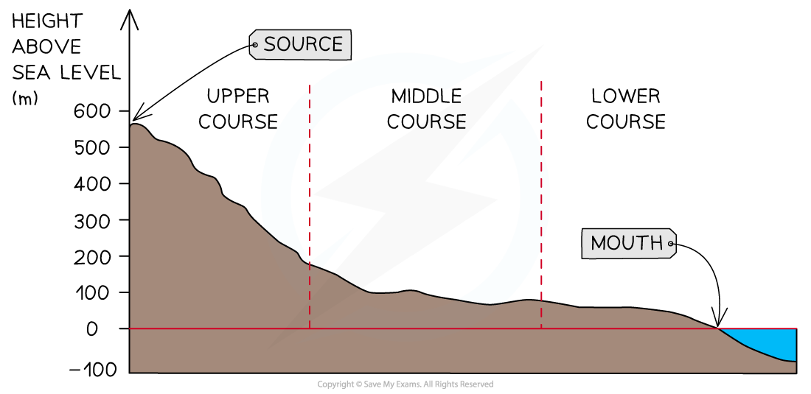
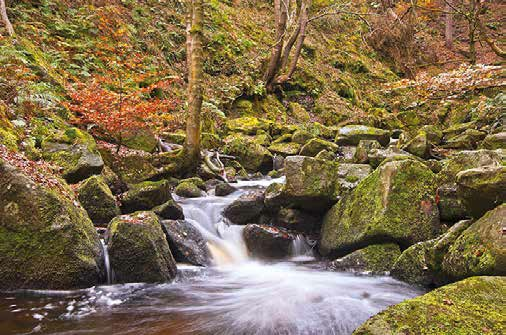
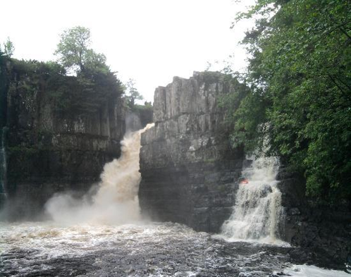

# Exam Questions — River Processes & Landforms
**River Environments** · Edexcel IGCSE Geography (4GE1)
> Source: [https://www.savemyexams.com/igcse/geography/edexcel/19/topic-questions/1-river-environments/1-2-river-processes-and-landforms/exam-questions/](https://www.savemyexams.com/igcse/geography/edexcel/19/topic-questions/1-river-environments/1-2-river-processes-and-landforms/exam-questions/) · 25 questions · total 67 marks

## Q1 — easy — 1 marks · exam-questions

### 1() — 1 mark — multiple_choice — from paper June 2017 · 4GE1/01
Which one of the following is the most important process in the river’s upper course?
- **A.** deposition
- **B.** headward erosion
- **C.** lateral erosion
- **D.** vertical erosion

## Q2 — easy — 2 marks · exam-questions

### 1((a)) — 1 mark — multiple_choice — from paper June 2019 · 4GE1/01
Identify the statement below that best describes the channel in the lower course of a river.
- **A.** small and fast river channel
- **B.** wide and deep river channel
- **C.** narrow and fast river channel
- **D.** small and narrow river channel

### 1() — 1 mark — multiple_choice — from paper June 2019 · 4GE1/01
Identify  **one** process of river erosion.
- **A.** levees
- **B.** abrasion
- **C.** overland flow
- **D.** discharge

## Q3 — easy — 2 marks · exam-questions

### 1((a)) — 1 mark — multiple_choice — from paper June 2019 · 4GE1/01R
Identify the statement below that best describes the channel shape in the upper course of a river.
- **A.** narrow river channel with shallow sides
- **B.** narrow river channel with steep sides
- **C.** wider river channel with shallow sides
- **D.** widest river channel with very shallow sides

### 1() — 1 mark — multiple_choice — from paper June 2019 · 4GE1/01R
Identify** one** process of river transportation.
- **A.** suspension
- **B.** abrasion
- **C.** attrition
- **D.** deposition

## Q4 — easy — 2 marks · exam-questions

### 1() — 1 mark — command: state — structured — from paper June 2019 · 4GE1/01
State **one** process of river transportation.

### 1((e)) — 1 mark — command: identify — structured — from paper June 2019 · 4GE1/01
Study Figure 1b below.

Identify the river landform.

## Q5 — easy — 1 marks · exam-questions

### 1((e)) — 1 mark — command: identify — structured — from paper June 2019 · 4GE1/01R
Study Figure 1b below.

Identify the river landform at X.

## Q6 — easy — 3 marks · exam-questions

### 1() — 1 mark — command: state — structured — from paper Nov 2021 · 4GE1/01
State **one** physical factor that influences the rate of erosion in a river

### 1() — 2 marks — command: explain — structured — from paper Nov 2021 · 4GE1/01
Explain how the process of hydraulic action erodes the river channel

## Q7 — easy — 1 marks · exam-questions

### 1((e)) — 1 mark — command: identify — structured — from paper Nov 2021 · 4GE1/01
Study Figure 1b shown below

Identify the landform labelled **X**

## Q8 — easy — 2 marks · exam-questions

### 1() — 1 mark — multiple_choice — from paper June 2022 · 4GE1/01
Identify** one **landform usually found in the upper course of a river
- **A.** Delta
- **B.** Estuary
- **C.** Oxbow lake
- **D.** Interlocking spurs

### 1((a)) — 1 mark — multiple_choice — from paper June 2022 · 4GE1/01R
Identify the characteristic usually found in the upper course of a river
- **A.** Frequent meanders
- **B.** Ox bow lakes
- **C.** Steep valley sides
- **D.** Flat wide floodplains

## Q9 — easy — 4 marks · exam-questions

### 1((c)) — 2 marks — command: explain — structured — from paper June 2022 · 4GE1/01
Explain how a river channel is eroded by solution (corrosion)

### 1((c)) — 2 marks — command: explain — structured — from paper June 2022 · 4GE1/01R
Explain **one **weathering process in a river valley.

## Q10 — easy — 2 marks · exam-questions

### 1() — 1 mark — multiple_choice — from paper June 2023 · 4GE/01
Identify the best definition of a meander.
- **A.** where two rivers meet.
- **B.** a bend in the river.
- **C.** the starting point of a river.
- **D.** where a river meets the sea.

### 2() — 1 mark — command: state — structured
State** one **type of erosion that takes place in a river.

## Q11 — easy — 2 marks · exam-questions

### 1() — 2 marks — command: define — structured — from paper June 2018 · 4GE1/01
Define the term mass movement?

## Q12 — easy — 2 marks · exam-questions

### 1() — 2 marks — command: explain — structured — from paper June 2024 · 4GE1/01
Explain the  process of saltation.

## Q13 — easy — 1 marks · exam-questions

### 1() — 1 mark — multiple_choice
Which of the following processes describes a river picking up and carrying material along its bed by rolling it?
- **A.** Saltation
- **B.** Traction
- **C.** Suspension
- **D.** Solution

## Q14 — easy — 1 marks · exam-questions

### 1() — 1 mark — multiple_choice
Study** Figure 1,** a diagram showing the long profile of a river.

In which part of the river's course is vertical erosion most dominant?
- **A.** Lower course
- **B.** Middle course
- **C.** At the mouth
- **D.** Upper course

## Q15 — easy — 2 marks · exam-questions

### 1() — 2 marks — command: describe — structured
Describe **two** characteristics of a V-shaped valley.

## Q16 — easy — 2 marks · exam-questions

### 1() — 2 marks — command: explain — structured
Explain how an **ox-bow lake** is formed.

## Q17 — medium — 3 marks · exam-questions

### 1() — 3 marks — command: identify — structured — from paper June 2017 · 4GE1/01
**River environments**

Study Figure 1 which shows the upper course of a river

**Figure 1**

Identify **three** features of the upper course of this river.

## Q18 — medium — 4 marks · exam-questions

### 1() — 4 marks — command: outline — structured — from paper June 2018 · 4GE1/01
Outline **two **factors which affect mass movement

## Q19 — medium — 4 marks · exam-questions

### 1((f)) — 4 marks — command: explain — structured — from paper June 2019 · 4GE1/01
Explain the formation of a river meander.

## Q20 — medium — 4 marks · exam-questions

### 1((f)) — 4 marks — command: explain — structured — from paper June 2019 · 4GE1/01R
Explain the formation of an oxbow lake.

## Q21 — medium — 7 marks · exam-questions

### 1() — 3 marks — command: identify — structured
Study Figure 1, which shows a waterfall

**Figure 1 - Waterfall**

Identify **three** features of the waterfall

### 2() — 4 marks — command: explain — structured
Explain the formation of a waterfall

## Q22 — medium — 4 marks · exam-questions

### 1((f)) — 4 marks — command: explain — structured — from paper Nov 2021 · 4GE1/01
Explain the formation of a levee.

## Q23 — medium — 4 marks · exam-questions

### 1((g)) — 4 marks — command: explain — structured — from paper June 2022 · 4GE1/01
Explain how erosion can form waterfalls

## Q24 — medium — 4 marks · exam-questions

### 1((g)) — 4 marks — command: explain — structured — from paper June 2022 · 4GE1/01R
Explain the formation of interlocking spurs

## Q25 — medium — 3 marks · exam-questions

### 1((e)) — 3 marks — command: explain — structured — from paper June 2023 · 4GE1/01
Explain how deposition leads to the formation of levees
