# Exam Questions — Management of River Environments
**River Environments** · Edexcel IGCSE Geography (4GE1)
> Source: [https://www.savemyexams.com/igcse/geography/edexcel/19/topic-questions/1-river-environments/1-3-management-of-river-environments/exam-questions/](https://www.savemyexams.com/igcse/geography/edexcel/19/topic-questions/1-river-environments/1-3-management-of-river-environments/exam-questions/) · 21 questions · total 93 marks

## Q1 — easy — 1 marks · exam-questions

### 1() — 1 mark — multiple_choice
Which one of the following flood prevention strategies is soft engineering?
- **A.** Afforestation
- **B.** Channel straightening
- **C.** Embankments
- **D.** Flood barrier

## Q2 — easy — 1 marks · exam-questions

### 1() — 1 mark — command: state — structured
State **one** physical factor which may lead to flooding

## Q3 — easy — 1 marks · exam-questions

### 1() — 1 mark — multiple_choice
Which of the following is an example of hard engineering?
- **A.** Afforestation
- **B.** Wetlands
- **C.** Dam
- **D.** Floodplain zoning

## Q4 — easy — 2 marks · exam-questions

### 1() — 2 marks — command: explain — structured
Explain **one **cause of rising global demand for water

## Q5 — easy — 1 marks · exam-questions

### 1() — 1 mark — multiple_choice
Which of the following is a human cause of flooding?
- **A.** Urbanisation
- **B.** Steep slopes
- **C.** Saturated soil
- **D.** High drainage density

## Q6 — medium — 4 marks · exam-questions

### 1((c)) — 4 marks — command: suggest — structured — from paper June 2019 · 4GE1/01
Study Figure 1a below.

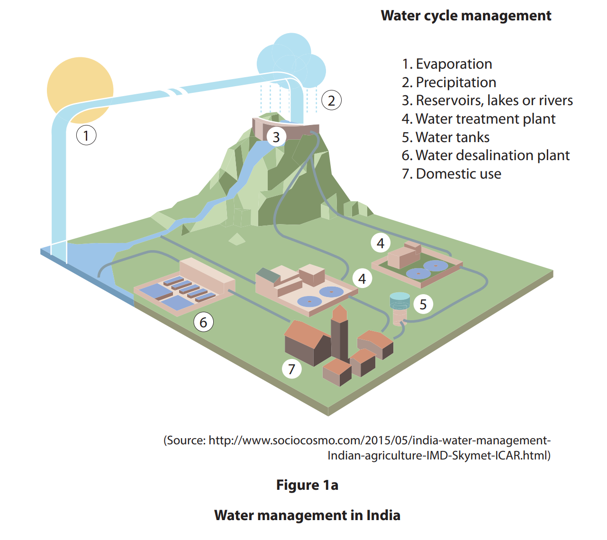

Suggest **two** ways people manage water supply.

## Q7 — medium — 4 marks · exam-questions

### 1((c)) — 4 marks — command: suggest — structured — from paper June 2019 · 4GE1/01R
Study Figure 1a below.

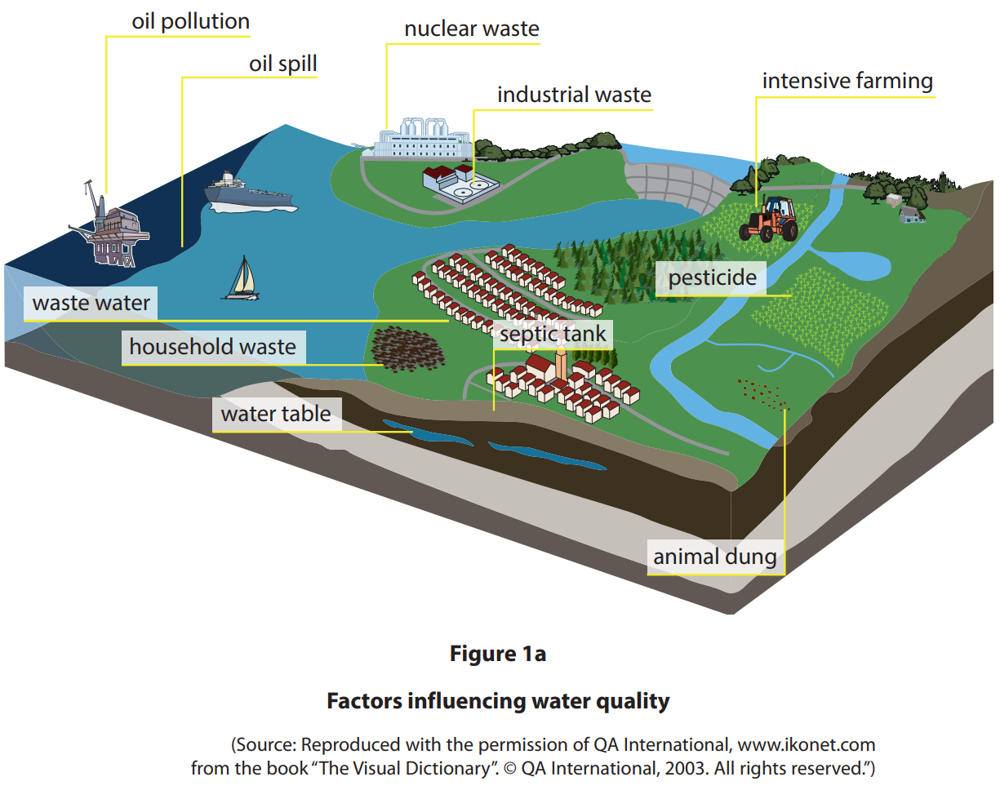

Suggest two ways in which water quality can be affected by people.

## Q8 — medium — 3 marks · exam-questions

### 1((d)) — 3 marks — command: explain — structured — from paper Nov 2021 · 4GE1/01
Explain **one** way industry can affect water quality

## Q9 — medium — 7 marks · exam-questions

### 1((d)) — 4 marks — command: explain — structured — from paper June 2022 · 4GE1/01
Study Figure 1a below

Explain one advantage and one disadvantage of the flood prevention methods shown

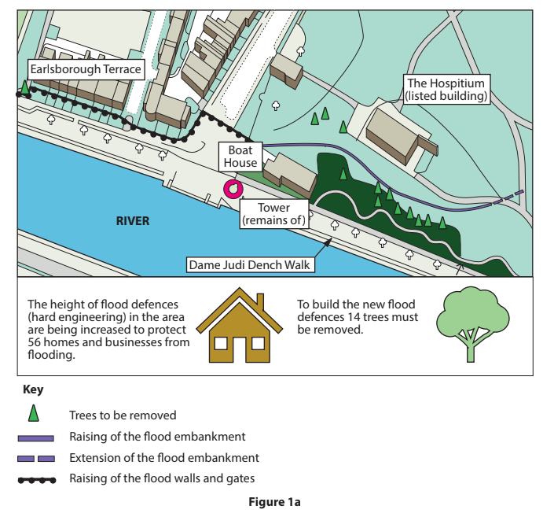

### 1((e)) — 3 marks — command: explain — structured — from paper June 2022 · 4GE1/01R
Explain **one** flood prevention method

## Q10 — medium — 4 marks · exam-questions

### 1((d)) — 4 marks — command: explain — structured — from paper June 2022 · 4GE1/01R
Study 1a below

Explain** two** ways human activity can affect water quality

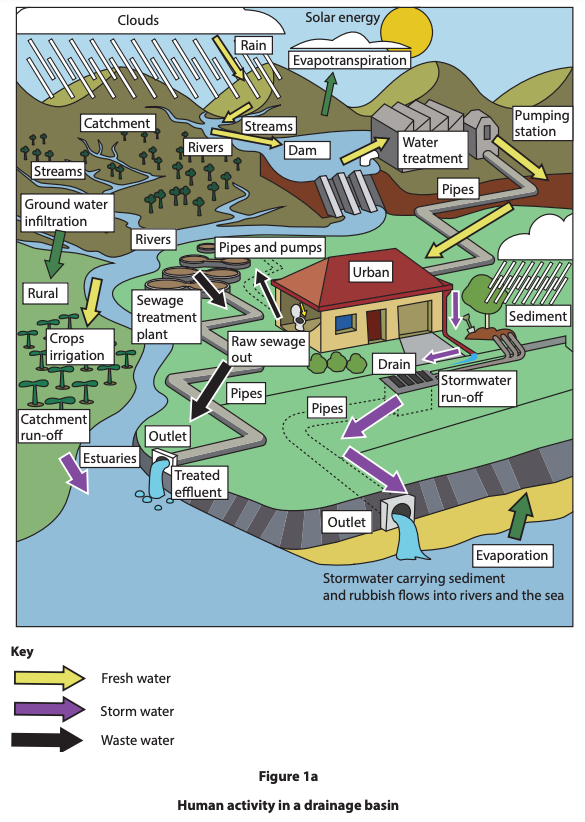

## Q11 — medium — 4 marks · exam-questions

### 1((e)) — 4 marks — command: explain — structured — from paper June 2024 · 4GE1/01
Explain** two** different causes of river water pollution.

## Q12 — medium — 4 marks · exam-questions

### 1((f)) — 4 marks — command: explain — structured — from paper June 2024 · 4GE1/01R
Explain** two **ways to prevent flooding.

## Q13 — medium — 4 marks · exam-questions

### 1((g)) — 4 marks — command: explain — structured — from paper June 2023 · 4GE1/01
Explain **two** causes of river flooding.

## Q14 — medium — 4 marks · exam-questions

### 1() — 4 marks — command: explain — structured
Referring to a named flood event you have studied, explain the physical and human causes of the flooding.

## Q15 — medium — 1 marks · exam-questions

### 1() — 1 mark — command: identify — structured
Study **Figure 3**, a photograph showing a hard engineering flood management scheme on a river in an urban area in the UK.

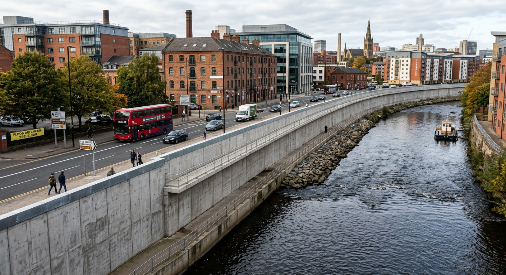

Identify **one **feature of the hard engineering scheme shown in **Figure 3.**

## Q16 — hard — 8 marks · exam-questions

### 1((g)) — 8 marks — command: analyse — structured — from paper June 2019 · 4GE1/01
Study Figure 1c and Figure 1d below.

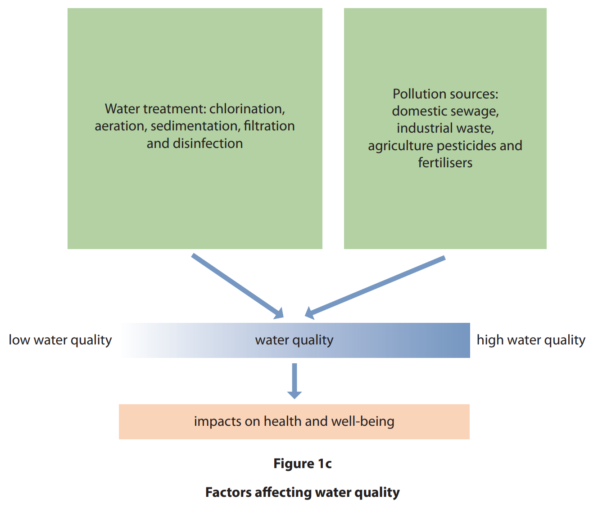

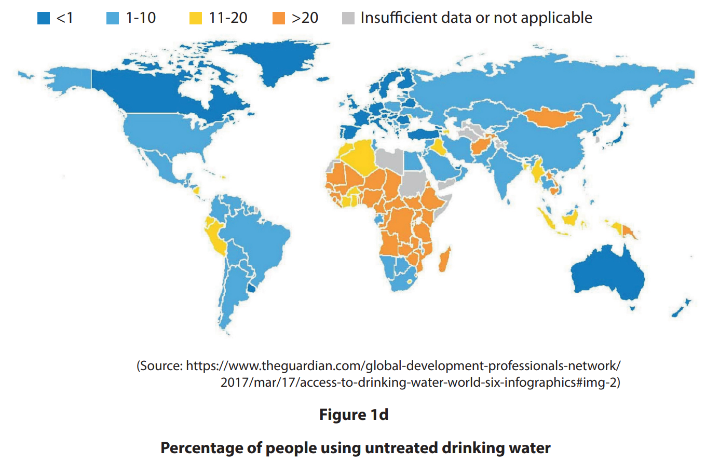

Analyse the reasons for variations in water quality.

## Q17 — hard — 8 marks · exam-questions

### 1((g)) — 8 marks — command: analyse — structured — from paper June 2019 · 4GE1/01R
Study Figure 1c and Figure 1d below

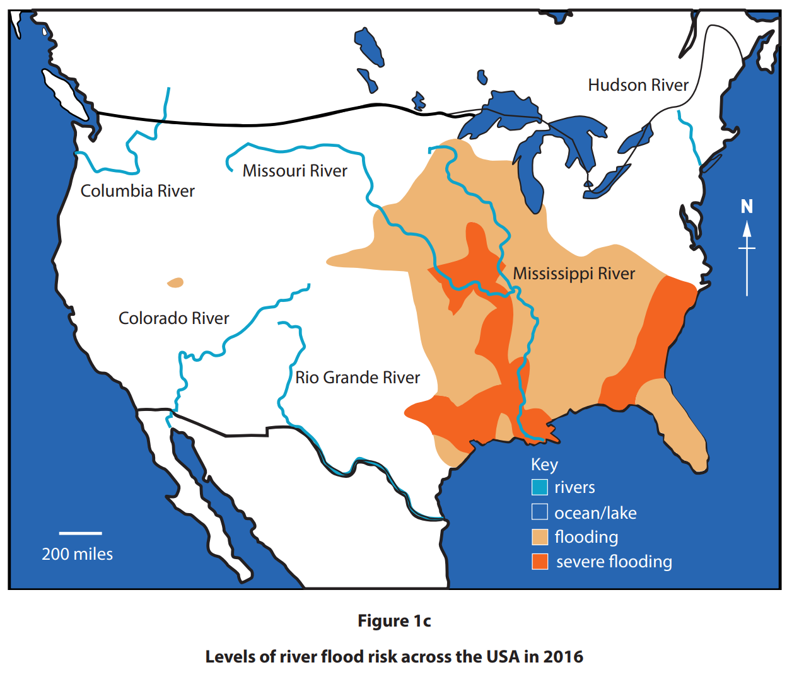

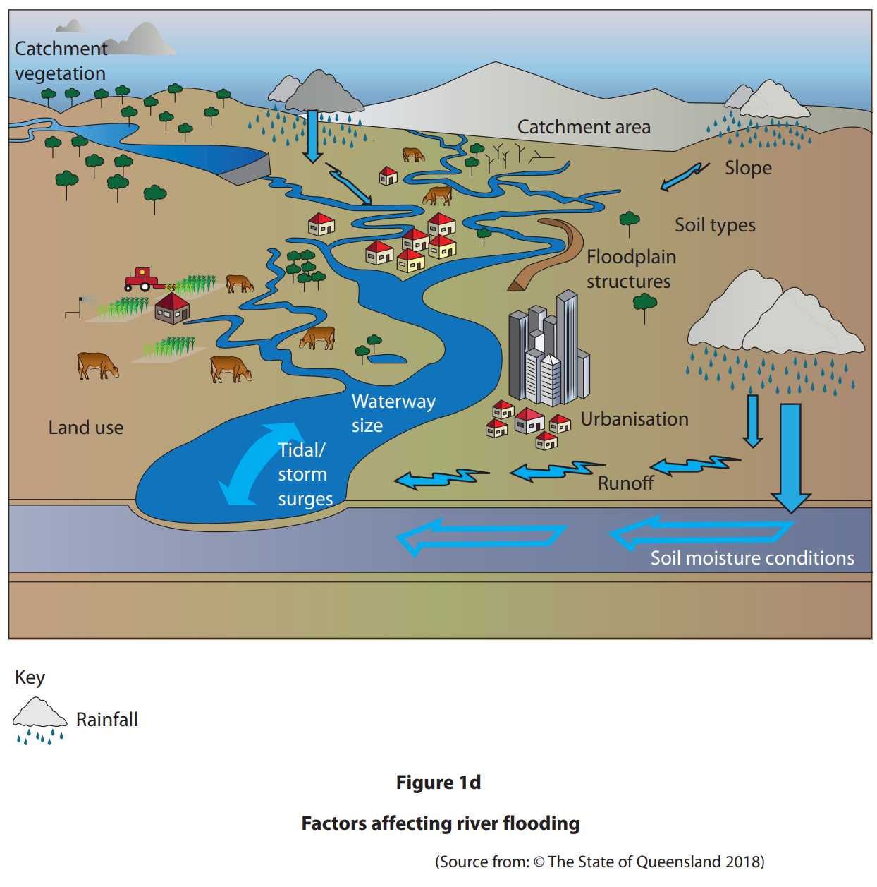

Analyse the reasons why areas differ in their risk of river flooding.

## Q18 — hard — 8 marks · exam-questions

### 1((g)) — 8 marks — command: analyse — structured — from paper Nov 2021 · 4GE1/01
Study Figure 1c which shows flood risk in Bangladesh

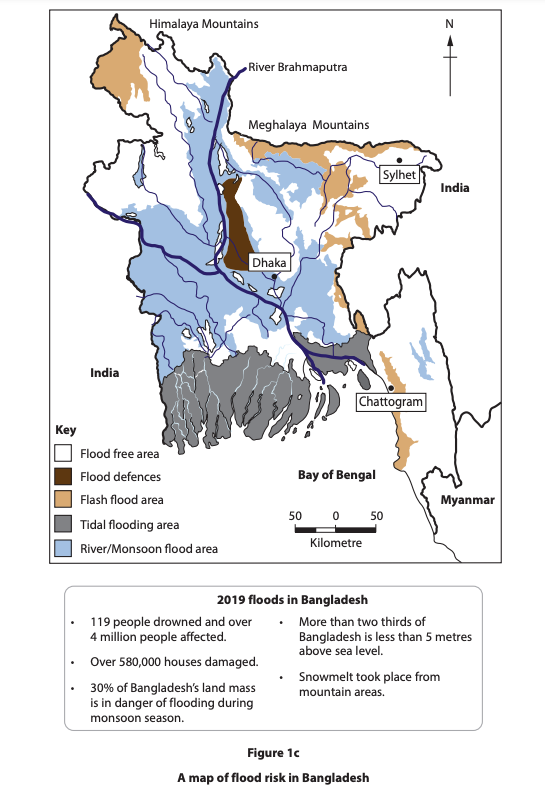

Analyse the factors which affect flood risk

## Q19 — hard — 8 marks · exam-questions

### 1((h)) — 8 marks — command: analyse — structured — from paper June 2022 · 4GE1/01
Study Figure 1c

Analyse the importance of this dam for managing the demand and supply of water

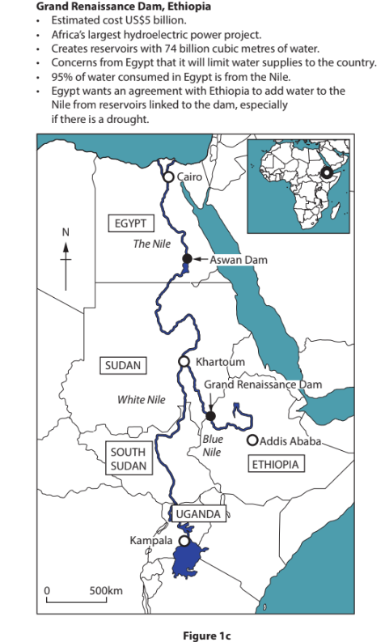

## Q20 — hard — 8 marks · exam-questions

### 1((d)) — 8 marks — command: discuss — structured — from paper June 2018 · 4GE1/01
Discuss the effectiveness of **two** different methods of flood control.

## Q21 — hard — 8 marks · exam-questions

### 1() — 8 marks — command: analyse — structured
Analyse this statement:

'Hard engineering strategies are more effective than soft engineering strategies at managing river flooding.'

You should refer to evidence and examples in your answer.
