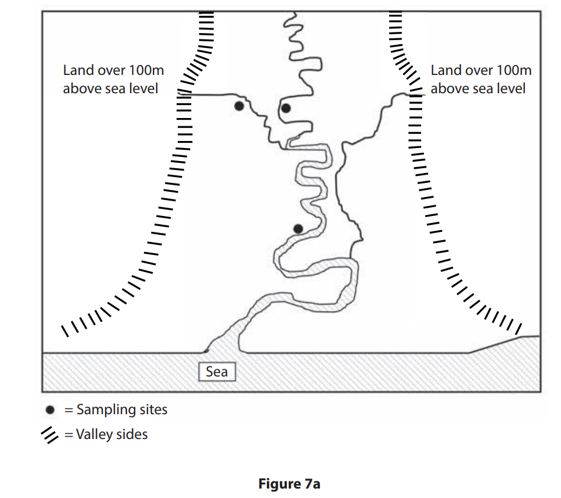
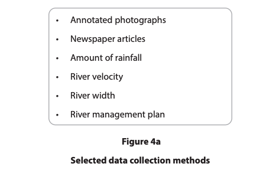
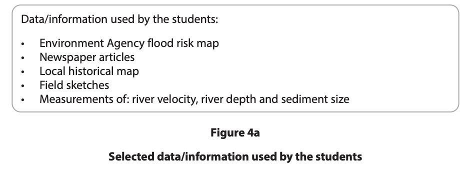

# Exam Questions — River Practical Skills
**River Fieldwork** · Edexcel IGCSE Geography (4GE1)
> Source: [https://www.savemyexams.com/igcse/geography/edexcel/19/topic-questions/10-river-fieldwork/10-1-river-practical-skills/exam-questions/](https://www.savemyexams.com/igcse/geography/edexcel/19/topic-questions/10-river-fieldwork/10-1-river-practical-skills/exam-questions/) · 16 questions · total 39 marks

## Q1 — easy — 1 marks · exam-questions

### 7() — 1 mark — multiple_choice — from paper June 2017 · 4GE1/01
Study Figure 7a which is a student’s sketch map showing the locations of three sampling sites for a river channel investigation.

Why is group work often better suited to river channel investigations than an individual working alone?

- **A.** Some rivers are polluted
- **B.** One person can carry the refreshments
- **C.** One person can record while others use the equipment
- **D.** The measuring equipment is heavy

## Q2 — easy — 2 marks · exam-questions

### 4() — 1 mark — multiple_choice — from paper June 2019 · 4GE1/01
A group of students have undertaken a study exploring changes in a river channel every 100 metres.

Identify the type of sampling method used.
- **A.** systematic
- **B.** random
- **C.** stratified
- **D.** opportunistic

### 4() — 1 mark — command: state — structured — from paper June 2019 · 4GE1/01
State **one** disadvantage of using one of the sampling methods in question (a) above.

Sampling Method.

## Q3 — easy — 2 marks · exam-questions

### 4((a)) — 2 marks — command: multiple — structured — from paper June 2019 · 4GE1/01R
A group of students have undertaken a study exploring changes in a river channel.

(i)

Identify one risk that the students may identify when undertaking a risk assessment for this investigation

(1)

(ii)

State one way that this risk could be managed.

(1)

## Q4 — easy — 2 marks · exam-questions

### 1() — 1 mark — multiple_choice — from paper Nov 2021 · 4GE1/01
Identify a suitable piece of equipment to measure river velocity
- **A.** Anemometer
- **B.** Quadrat
- **C.** Clinometer
- **D.** Stopwatch

### 2() — 1 mark — command: name — structured — from paper Nov 2021 · 4GE1/01
Name **one** type of sampling method

## Q5 — easy — 2 marks · exam-questions

### 1() — 2 marks — command: describe — structured — from paper Nov 2021 · 4GE1/01
Describe **one **way GIS might be used for fieldwork in a river environment

## Q6 — easy — 2 marks · exam-questions

### 1() — 1 mark — command: name — structured — from paper June 2022 · 4GE1/01
Name **one** piece of equipment the students could have used in their enquiry

### 2() — 1 mark — command: state — structured — from paper June 2022 · 4GE1/01
State **one** type of sampling students could have used to choose their data collection sites

## Q7 — easy — 2 marks · exam-questions

### 1() — 1 mark — multiple_choice — from paper June 2022 · 4GE1/01R
Study Figure 4a

Identify one type of quantitative data used by students

- **A.** Annotated photographs
- **B.** Newspaper articles
- **C.** Amount of rainfall
- **D.** River management plan

### 2() — 1 mark — command: state — structured — from paper June 2022 · 4GE1/01R
State **one **way maps could be used to support the enquiry

## Q8 — easy — 1 marks · exam-questions

### 1() — 1 mark — command: state — structured — from paper June 2022 · 4GE1/01R
State **one** piece of equipment that could be used to measure river velocity

## Q9 — easy — 2 marks · exam-questions

### 1() — 1 mark — multiple_choice — from paper June 2022 · 4GE1/01
A group of students have undertaken an enquiry that investigates the characteristics of a river along its course.

Study Figure 4a.

Identify one type of primary data used by the students.

- **A.** Environment Agency flood risk map
- **B.** field sketches
- **C.** local historical map
- **D.** newspaper articles

### 4() — 1 mark — command: name — structured — from paper June 2022 · 4GE1/01
Name one piece of equipment the students could have used in their enquiry.

## Q10 — easy — 1 marks · exam-questions

### 1() — 1 mark — command: state — structured
A group of students has undertaken an enquiry that investigated changes within a river channel along its course.

State **one **type of sampling students could have used in their enquiry.

## Q11 — easy — 2 marks · exam-questions

### 1() — 2 marks — command: explain — structured
A group of students has undertaken an enquiry that investigated changes within a river channel along its course.

Explain **one** factor that affected the students' choice of data collection sites.

## Q12 — easy — 2 marks · exam-questions

### 1() — 2 marks — command: explain — structured
A group of students has undertaken an enquiry that investigated changes within a river channel along its course.

Identify **one **health and safety risk that the students could face during their enquiry. Explain the impact this risk could have had.

## Q13 — medium — 6 marks · exam-questions

### 7() — 6 marks — command: outline — structured — from paper June 2017 · 4GE1/01
Outline three factors that should be considered when choosing a suitable sampling site for a river channel investigation.

## Q14 — medium — 3 marks · exam-questions

### 4((b)) — 3 marks — command: explain — structured — from paper June 2019 · 4GE1/01
To extend the river study, students were asked to use **one** other primary data method.

Explain **one** other primary data method they might have used.

## Q15 — medium — 6 marks · exam-questions

### 7() — 6 marks — command: outline — structured — from paper June 2017 · 4GE1/01
Outline each of the **three** following sampling methods used in geographical investigations.

- random sampling
- stratified sampling
- systematic sampling

## Q16 — medium — 3 marks · exam-questions

### 1() — 3 marks — command: explain — structured — from paper June 2022 · 4GE1/01R
Explain **one **fieldwork technique the students could have used to explore river channel changes
