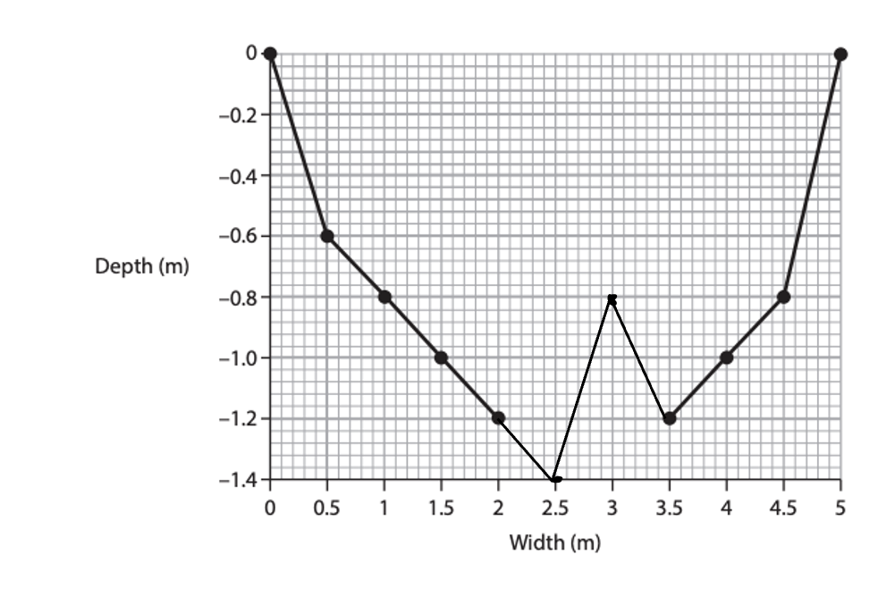
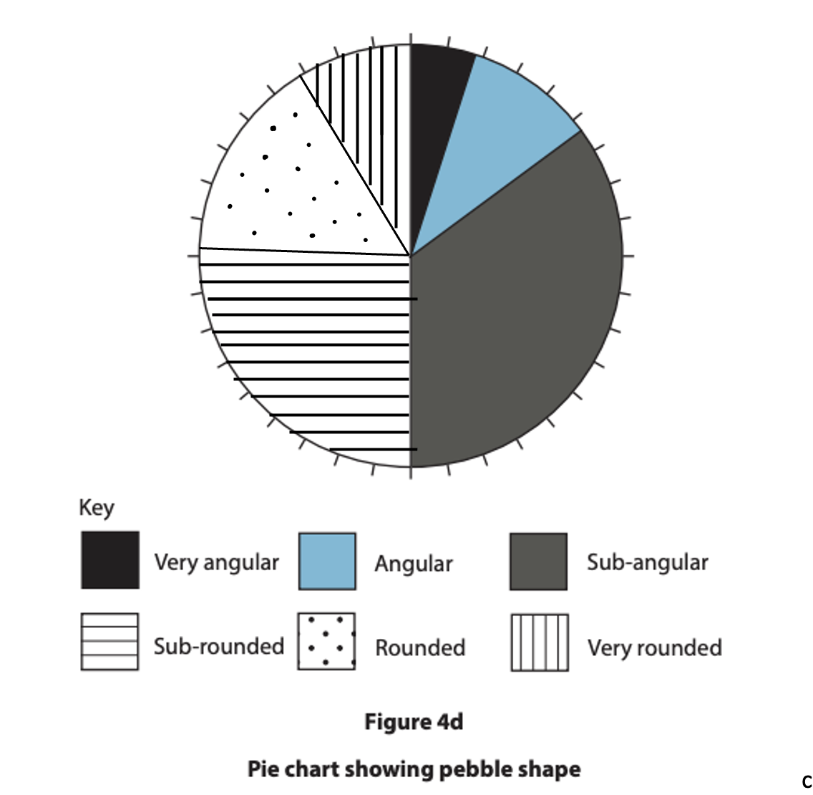

# Mark Schemes — River Enquiry Skills
**River Fieldwork** · Edexcel IGCSE Geography (4GE1)

## Q1 — easy — 6 marks · exam-questions

### 4() — 6 marks
(i) Award 1 mark for:

Correct method of working, showing addition, e.g. 102.3 or  13.1+15.4+16.8+20.0+37.0 **(1) ** Correct mean, written to one decimal place, 20.5** (1)**. **(2)**

Reject answer to 2dp, i.e. 20.46

(ii) Award 1 mark for each correct bar.

To be awarded the mark for the first bar, line must be drawn between 13-14. The second bar needs to be right on the line.

**Site 1=13.1 **

**Site 4=20.0**

Note width of the bars doesn’t matter.  There is no need for bars to be shaded.

(iii) Award 1 mark for an initial reason, and a further mark for extension of this point.

E.g.

- The cork could have got stuck as it flowed down the river **(1)** this would have slowed the cork down** (1)**.
- There could have been a strong wind blowing upstream **(1)** which would have slowed down the cork / which would have led to unreliable results **(1)**.
- Human error with the operation of the stopwatch **(1)** which meant that the timing was inaccurately recorded at this site **(1)**.
- The water was to shallow** (1)** so the float got stuck** (1)**.
- Difficultly with accurately measuring the distance of the float-run** (1)** leading to inaccurate measurements of speed/velocity** (1)**.

Accept any other appropriate response.

## Q2 — easy — 7 marks · exam-questions

### 4((a)) — 7 marks
(i) Correct method of working, showing addition, and then division by 5**(1)** and one mark for the correct mean, written to one decimal place, 20.2** (1)**

(ii) Award 1 mark for each correct bar.

To be awarded the mark for the first bar, line must be drawn between 21-22.  The second bar needs to be right on the line. Shading is not required.

(iii) One mark for an ‘x’ in box 5

(iv) Award 1 mark for an initial reason, and a further mark for extension of this point.   E.g. the cork could have got stuck as it flowed down the river** (1)** this would have slowed the cork down **(1)** there could have been a strong wind blowing upstream **(1)** which would have slowed down the cork / which would have led to unreliable results **(1)** Human error with the operation of the stop watch **(1)** which meant that the timing was inaccurately recorded at this site** (1)**

Accept any other appropriate response .

## Q3 — easy — 1 marks · exam-questions

### 1() — 1 marks
**Correct answer: B** — Field sketches

**The correct answer is  B**

Field sketches **(1)**

- No marks will be awarded if more than one answer is given
- The alternative answers are incorrect because:

  - A, C and D are all secondary data

## Q4 — easy — 2 marks · exam-questions

### 1() — 2 marks
| Indicative Content | General Guidance |
|---|---|
| - 1.2 + 1.0 + 1.2 + 1.3 = 4.7 - 4.7/4 = 1.175** (1)** - Rounded up = 1.2** (1)** | **2 mark**** question**  - The mean is calculated by adding the results for Site 2 and then dividing by number of results - 4 measurements - Take care not to include the figure for range - Showing working out means writing out all the figures as shown opposite - Remember to round up or down to give the result to one decimal places |

## Q5 — easy — 4 marks · exam-questions

### 1() — 2 marks
| Indicative Content | General Guidance |
|---|---|
| - Wider range - possible error in data collection - Only four pieces of data - more readings = greater accuracy - Float may have stuck - affecting readings - Human error - incorrect time | **2 mark**** question**  - The command word 'suggest' requires you to outline the reasons for why something might occur - One mark will be awarded for identifying a reason - A second mark will be awarded for explaining its impact on the results |

| Model Answer | Commentary |
|---|---|
| The students used a float which may have become stuck** (1)** this would result in it taking more time to travel the distance** (1)** | **Marks awarded 2/2**  - This is one way in which the question can be answered. Your answer does not have to be exactly the same - One mark is awarded for the float getting stuck - The second mark is awarded for explaining how this could impact on the time recorded |

### 2() — 2 marks
- Points must be plotted accurately
- Style must match the style used for plotting the rest of the graph

## Q6 — easy — 2 marks · exam-questions

### 1() — 2 marks
Add the five velocity measurements together, then divide by the number of measurements (5):

*1.2 + 2.0 + 1.4 + 1.2 + 1.0 = 6.8*

6.8 ÷ 5 = 1.36 **[1]**

Rounded to one decimal place = **1.4 m/s** **[1]**

> **[mark-scheme]**
> **Mark allocation**
> 
> - One mark for correct working: adding the correct five figures **and** dividing by 5 (the correct method)
> - One mark for the correct answer of 1.4, given to one decimal place (the unit m/s is encouraged)
> 
> **[2 marks]**
> 
> - The working mark requires the **correct method** (the correct figures added **and** divided by 5). Adding the values alone, or using the wrong operation, does **not** gain the working mark.
> - Working must be shown to gain full marks

## Q7 — easy — 4 marks · exam-questions

### 1() — 2 marks
- Remember to use the exact shading shown on the key
- One mark is awarded for the correct plotting of the lines
- The second mark is for shading the sections correctly

### 2() — 2 marks
| Indicative Content | Commentary |
|---|---|
| - Take more measurements. **(1)** - Compare results to another group.** (1)** - Ensure one person in the group is responsible for measurements.** (1)** | - Two marks will be awarded for any two of the answers listed opposite |

## Q8 — easy — 5 marks · exam-questions

### 4((b)) — 2 marks
Add the four velocity measurements for Site 2 together:

$1 . 2 + 1 . 0 + 1 . 2 + 1 . 3 = 4 . 7$

Divide the total by the number of measurements:

$4 . 7 \div 4 = 1 . 175$ **[1]**

To one decimal place, the mean velocity is 1.2 m/s **[1]**.

**[2 marks]**

> **[mark-scheme]**
> The command word is 'calculate'. This means you must work out a numerical value and show all your workings.
> 
> **Mark allocation**
> 
> This answer is assessed using a point-marked approach.
> 
> - One mark for correct working (adding the four values and dividing by four)
> - One mark for the correct answer of 1.2 m/s given to one decimal place
> - Maximum 2 marks
> 
> **Alternative content**
> 
> The answer above is just one example of how to respond to this question. Alternative information that could be provided in the answer includes:
> 
> - Full working shown as 4.7 divided by 4 = 1.175, rounded to 1.2
> - Award the working mark for a correct method even if the final rounding is wrong
> - Any other suitable response
> 
> **Common errors**
> 
> - Forgetting to round to one decimal place, leaving the answer as 1.175
> - Dividing by the wrong number of measurements
> - Not showing any workings, which loses the method mark

> **[exam-tip]**
> - Always show the full calculation, as the working is usually worth a mark on its own
> - Check the rounding rule: 1.175 rounds up to 1.2 because the digit after the first decimal place is 5 or more

### 4() — 1 marks
> **[mark-scheme]**
> Any **one** from:
> 
> - Random
> - Systematic
> - Stratified
> - Opportunistic

> **[exam-tip]**
> - A 'state' question needs only a one-word answer, so do not waste time explaining the method

### 4() — 2 marks
The float may have become caught on rocks or vegetation as it travelled **[1]**, which would have slowed it down and produced an inaccurate velocity reading **[1]**.

**[2 marks]**

> **[mark-scheme]**
> The command word is 'suggest'. This means you must give a reason and develop it, using the data to explain why the Site 1 results may not be reliable.
> 
> **Mark allocation**
> 
> This answer is assessed using a point-marked approach.
> 
> - One mark for each valid point
> - One mark for each valid development of a point
> - Maximum 2 marks
> 
> **Alternative content**
> 
> The answer above is just one example of how to respond to this question. Alternative information that could be provided in the answer includes:
> 
> - The measurements at Site 1 show a wide range (0.2 to 1.3), suggesting the readings were inconsistent
> - Human error in operating the stopwatch could have led to inaccurate timings
> - A strong wind could have affected the float and produced unreliable results
> - Too few measurements were taken to be confident the mean is representative
> - Any other suitable response
> 
> **Common errors**
> 
> - Stating a reason without developing it, so only one mark is earned
> - Describing how to collect the data rather than why it may be unreliable
> - Not linking the answer to the Site 1 data shown in Figure 4b

> **[exam-tip]**
> - Use the data in the figure as evidence, for example noting the large range in the Site 1 readings
> - For 2 marks, make a reason then develop it by stating the effect on the reliability of the results

## Q9 — easy — 2 marks · exam-questions

### 1() — 2 marks
First, arrange the scores for Site 3 in order:

*3, 3, 3, 4, 4, 4, 4, 5, 5, 4*

Arranged in order:

3, 3, 3, 4, 4, 4, 4, 4, 5, 5 **[1 mark]**

There are 10 values, so the median is the average of the 5th and 6th values.

5th value =* *4,* *6th* *value =* *4

Median =* *(4 + 4)* *÷* *2* *= **4**** [1 mark]**

> **[mark-scheme]**
> The command word '**calculate**' means you must show your working and give a numerical answer.
> 
> **Mark allocation**
> 
> This answer is assessed using a** point-marked** approach.
> 
> - **One mark** for correctly identifying the 5th and 6th values as both 4 by ordering the data to find the middle value
> - **One mark** for the correct final answer of 4
> 
> **[2 marks]**
> 
> **No marks for:**
> 
> - The mean (which gives 3.9)
> - An answer of 4 with no working shown (the mark for identifying the correct middle values cannot be awarded without evidence of ordering)
> 
> **Common errors**
> 
> - Calculating the mean instead of the median
> - Forgetting to reorder the data before finding the middle values
> - Selecting only the 5th value rather than averaging the 5th and 6th values in an even-numbered data set

> **[exam-tip]**
> **Always **write out the data in order before you do anything else.
> 
> **With **ten values, there is no single middle number. You must find the average of the 5th and 6th values.
> 
> **Always **show your working, even if you are confident in the answer, because the working itself earns a mark.

## Q10 — easy — 1 marks · exam-questions

### 1() — 1 marks
> **[mark-scheme]**
> Any **one **from:
> 
> - Bar chart
> - Line graph
> - Scatter graph
> - Divided bar chart or proportional bar chart
> 
> **[1 mark]**
> 
> **Do not accept:**
> 
> - A data collection method such as 'Power's Scale' or 'pebble sampling'
> - A pie chart (not appropriate for data plotted by site along a river)
> - A table of raw data (this is data recording, not data presentation)
> 
> **Common errors**
> 
> - Naming a data collection method rather than a presentation technique
> - Choosing a pie chart, which is used for proportional data rather than values across different sites

> **[exam-tip]**
> **Data **presentation means a visual display such as a graph, chart or map. It is not the same as data collection.
> 
> **Think **about what the data looks like: you have one median score per site, at six sites along the river. Which type of graph shows that most clearly?

## Q11 — medium — 7 marks · exam-questions

### 7() — 4 marks
Award 1 mark for each relevant secondary source identified e.g. NRA (National Rivers Authority) discharge data **(1)**; Met Office rainfall data** (1)**; geology map** (1)**; Ordnance Survey map** (1)** …

2nd marks can be given where the purpose of the information made clear e.g.

- NRA discharge data **(1)** > gives idea of normal flow **(1)**
- Geology map** (1)** > rock type information re river bed and tributaries **(1)**

For max marks at least one named source needed (e.g. Met Office, Ordnance Survey, Environment Agency, Severn Trent Water, Google Maps)

### 7() — 3 marks
Accept answers based on all three methods awarding marks per point of justification with a developed point worth 2 and possibly 3 marks e.g.

- systematic – no bias **(1)** by measuring at regular intervals **(1) **avoiding need for any personal judgement** (1)**
- stratified – good way to achieve representativeness **(1)** by basing sampling site on OS map **(1)** and pre-fieldwork visits **(1)**
- random – avoids site selection difficulties **(1)** by impersonalising sampling decision **(1)** no bias **(1)**

No mark for naming sampling procedure.

## Q12 — medium — 4 marks · exam-questions

### 4((b)) — 4 marks
Award 1 mark for a description of the technique and a further mark for a developed description **(1)**.

**Quantitative **

Description of how to calculate the cross section of the river measure from bank to bank and set intervals **(1)** transfer data onto graph paper to allow the area to be calculated **(1)**.

**Qualitative **

- Field sketches can be used to record the main features of the river profile at different sites** (1) **this will help the students identify differences **(1)**.
- Sediment colour/size/shape/form of Power’s scale **(1)** and changes across or downstream **(1)**.
- Ask public questions about the river **(1)**, could by interview or questionnaire regarding flooding/litter/ pollution etc.* ***(1)**.

Credit responses for qualitative which discuss questionnaire.

Accept any other appropriate response.

## Q13 — medium — 5 marks · exam-questions

### 7((c)) — 5 marks
(i) Credit any valid aim (accept objectives) for a channel investigation with expectation that it will relate to water flow or channel shape e.g.

- measure stream velocity* ***(1) **and its variations across the channel **(1)**
- map channel size** (1) **and bed roughness** (1)**.

Brevity = 1 mark. Full developed aim along lines of a title = 2 marks.

(ii) Credit any valid and distinctive reason why an investigation might not meet its aim. These will be generic to fieldwork and amount to aspects of investigation that might form part of evaluating the process and results

e.g.

- accuracy of data collected **(1)**
- sufficient data collected **(1)**
- careful data recording **(1)**
- accuracy of data collation (1) and data presentation** (1)**
- reliable analysis and interpretation of findings** (1)**
- validity of conclusions reached **(1)**
- realism and practicality of aim **(1)**

suitability of sites chosen** (1)**

## Q14 — medium — 3 marks · exam-questions

### 1() — 3 marks
| Indicative Content | General Guidance |
|---|---|
| - Easy to understand - Allow easy visualisation of patterns/connections - Can compare with other sites - Check hypothesis - Easy to construct - Can be completed by hand/in Excel | **3 mark**** question**  - The command word 'explain' requires you to identify and outline one advantage - One mark will be awarded for identifying the advantage. - Two further marks will be awarded for the explanation |

|   |   |
|---|---|
| (Line graphs) are easy to understand **(1)** which means connections are easily spotted** (1)** and anomalies can be identified **(1)** | **Marks awarded 3/3**  - This is one possible way to answer this question - your answer does not have to be exactly the same - One mark is awarded for easy to understand - Two marks are awarded for the additional detail regarding connections and anomalies |

## Q15 — medium — 3 marks · exam-questions

### 4() — 3 marks
A line graph can be used to present a river channel cross-section **[1]** because it clearly shows how depth changes continuously across the width of the channel **[1]**, which makes it easy to see the shape of the channel and identify the deepest point **[1]**.

**[3 marks]**

> **[mark-scheme]**
> The command word is 'explain'. This means you must give a reason and then develop it, showing why the advantage matters when presenting fieldwork results.
> 
> **Mark allocation**
> 
> This answer is assessed using a point-marked approach.
> 
> - One mark for each valid point
> - One mark for each valid development of a point
> - Maximum 3 marks
> 
> **Alternative content**
> 
> The answer above is just one example of how to respond to this question. Alternative information that could be provided in the answer includes:
> 
> - A line graph is suitable for continuous data such as a channel cross-section, so it shows a realistic profile of the river bed
> - Plotted points can be joined to reveal trends or patterns that are harder to see in a table of raw figures
> - It allows values between plotted points to be estimated by reading off the line
> - Anomalous results stand out clearly as points that do not fit the line
> - Any other suitable response
> 
> **Common errors**
> 
> - Simply describing what a line graph is rather than explaining an advantage
> - Giving an advantage without developing it, so only one mark is earned
> - Confusing a line graph with a bar graph, which is used to compare separate sites

> **[exam-tip]**
> - For a 3-mark 'explain' question, make one clear point and then develop it twice, or make a point and develop it once with a further consequence
> - Link your answer to the type of data being presented, as line graphs suit continuous data such as a cross-section

## Q16 — medium — 4 marks · exam-questions

### 1() — 1 marks
The value 4 stands out, as it is lower than the other scores at Site 6. **[1]**

> **[mark-scheme]**
> The command word '**identify**' means you only need to state the value. No explanation is required here.
> 
> **Mark allocation**
> 
> This answer is assessed using a** point-marked** approach.
> 
> - **One mark** correctly identifying the score of 4 as the anomalous result at Site 6
> 
> **[1 mark]**
> 
> **Common errors**
> 
> - Explaining why the value is anomalous rather than simply identifying it
> - Identifying an anomaly from the wrong site

> **[exam-tip]**
> **An **anomaly is a result that does not fit the pattern of the other values. Look at Site 6 and ask yourself: which value does not belong? One short sentence is all you need here.

### 2() — 3 marks
Human error during data collection could have caused the anomalous result. **[1]** A student may have picked up a pebble that had rolled down from upstream rather than from the riverbed at Site 6. **[1] **The pebble would have a lower roundness score than the others because the river had not fully transported or abraded it. **[1]**

> **[mark-scheme]**
> The command word '**suggest**' means you must apply your knowledge to give a plausible reason, even if it cannot be proved with certainty.
> 
> **Mark allocation**
> 
> This answer is assessed using a** point-marked** approach.
> 
> - **One mark** for identifying a valid reason for the anomaly
> - **One mark** for development of that reason
> - **One mark** for further development that links back to why the score is lower than expected
> 
> **[3 marks]**
> 
> **Alternative content**
> 
> The answer above is just one example of how to respond to this question. Alternative information that could be provided in the answer includes:
> 
> - Incorrect recording of pebble roundness
> - A tributary joining the river near Site 6 may have added more angular material
> - Any other appropriate response

> **[exam-tip]**
> **Don't **be tempted to explain why pebble roundness increases downstream, rather than specifically explaining the anomaly at Site 6.

## Q17 — hard — 8 marks · exam-questions

### 4((c)) — 8 marks
**Marking instructions **

Markers must apply the descriptors in line with the general marking guidance and the qualities outlined in the level based mark scheme below.

**Indicative content guidance**

The indicative content below is not prescriptive and candidates are not required to include all of it. Other relevant material not suggested below must also be credited.

Relevant points may include the following.

**AO3**

- Accuracy is about making judgements about how close conclusion are to the actual changes occurring in the river environment where the fieldwork was  carried out.
- Recognition of the extent to which there were equipment errors, e.g. faulty or uncalibrated equipment, and/or operator errors, e.g. misinterpreting the data being recorded, and how this might have affected that might have affected whether they were able to answer their enquiry questions.
- Recognition of whether there were issues with the design of the data collection and/or sampling methodologies, which may be flawed in terms of the location/number of sites (spatial), the time of year (temporal), or the equipment chosen.

**AO4  **

- There is evidence of using different skills and techniques to measure changes in a river channel.
- There is evidence of using different skills and techniques to reach conclusions about changes occurring in a river channel.
- There is evidence of using different skills and techniques to evaluate conclusions about changes occurring in a river channel.
- There is evidence of own fieldwork conclusions, i.e. reference to field data collected by the student.

If he enquiry question isn’t present do not penalise .

This question is about the candidates making a judgement of the success of their data analysis techniques. Candidates are expected to make a judgement. Candidates should identify strengths, weaknesses, alternative ways of analysing the data .

In this response there would be an expectation for the candidates to evaluate a number of different data analysis techniques.

Candidates should look to identify the appropriateness of data analysis techniques.

A view should be given on how successful or unsuccessful the data analysis techniques were and how they could be improved to help candidates understand the data collected more effectively .

For level 2 responses the candidate response will need to link to the evaluation to their study directly.   For level 3 response there should be a greater depth of evaluation.

Recognition of whether or not the data analysis was less successful because of the way it was designed/technique used.

How far data analysis helped draw a significant conclusion for the study .

An evaluation of how far the outcomes can be trusted (or repeated to obtain the same results).

## Q18 — hard — 8 marks · exam-questions

### 4((c)) — 8 marks
**Marking instructions **

Markers must apply the descriptors in line with the general marking guidance and the qualities outlined in the level based mark scheme below.

**Indicative content guidance **

The indicative content below is not prescriptive and candidates are not required to include all of it. Other relevant material not suggested below must also be credited.

**AO3  **

- Recognition of the extent to which there were equipment errors, e.g. faulty or uncalibrated equipment, and/or operator errors, e.g. misinterpreting the data being recorded, and how this might have affected that might have  affected whether they were able to answer their enquiry questions.
- Recognition of whether there were issues with the design of the data collection and/or sampling methodologies, which may be flawed in terms of the location/number of sites (spatial), the time of year (temporal), or the equipment chosen.
- Accuracy is about making judgements about how close conclusions are to the actual changes occurring in the river environment where the fieldwork was carried out.

**AO4  **

- There is evidence of using different skills and techniques to measure changes in a river channel – both design and techniques.
- There is evidence of using different skills and techniques to reach conclusions about changes occurring in a river channel.
- There is evidence of own fieldwork conclusions, i.e. reference to field data collected by the student.
- If the enquiry question isn’t present do not penalise.
- In this response there would be an expectation for the students to evaluate a number of different data collection techniques.
- This should an evaluation of primary and secondary data as appropriate.
- Students should look to identify the appropriateness of data collection techniques.
- A view should be  given on how successful or unsuccessful the data collection techniques were and how they could be improved to help students gather more effective results.
- For level 2 responses the student response will need to link to the evaluation to their study directly.
- For level 3 response there should be a greater range and depth of techniques evaluated.
- Recognition of whether or not the data collection was less successful because of the way it was designed
- Recognition of any faults in equipment or human error.
- How far data collection methods used produced reliable results
- An evaluation of how far the outcomes can be trusted (or repeated to obtain the same results).

## Q19 — hard — 8 marks · exam-questions

### 1() — 8 marks
The indicative content below is not prescriptive, and candidates are not required to include all of it. Other relevant material not suggested below must also be credited. This question is about candidates making a judgement of the data presentation methods and analysis that have been used to help students draw conclusions.

Candidates may note the extent to which the fieldwork presentation and analysis support the conclusions in Figures 4. Responses could include:

- Comments could be made on how relevant the conclusions are based on the presentation and analysis methods.
- Comments could address the suitability of the data presentation method to help draw conclusions.
- Comments could address the suitability of the data table to help draw conclusions.
- Comments on how anomalies could have affected the results and therefore the conclusion.
- Comments on the accuracy of students recording the data and the effect on conclusions.
- Comment on the distribution of site selection for data collection and the impact this could have on conclusions.
- Comments on other data that could have been collected.
- Comments on the value of the methods in relation to the aim of the investigation.

For level 2 responses candidates will need to link the conclusion to both data presentation methods and analysis. For level 3 responses there should be a greater depth of evaluation recognising the impact of the data collection presentation and analysis on the conclusions made.

## Q20 — hard — 8 marks · exam-questions

### 1() — 8 marks
'How does pebble roundness change downstream along the River Wye?'

I came to the conclusion that pebble roundness increases as you move downstream as erosion smooths pebbles as they are transported. **[K]** Overall, my data primarily supports this conclusion, but some accuracy and reliability issues make me less confident. **[Ap]**

The main method I used to collect data was the Power's Scale. I compared each pebble to a visual chart to assign it a roundness score between 1 and 6. **[E] **This method is subjective because different students may judge the same pebble differently. **[Ap]** This reduces accuracy because scores depend on the measurer rather than a precise instrument. **[Ap]**

To improve reliability, I measured ten pebbles at each site and calculated the median. **[E]** A median reduced the impact of outliers like Site 6's 4 score. **[Ap]** Ten pebbles is a small sample. A larger sample of twenty pebbles per site would have improved median reliability. **[Ap]**

I found that the median score increased from 2.5 at Site 1 to 5.5 at Site 6, supporting the erosion theory. **[E]** This consistency across all six sites supports my conclusion. **[Ap]**

However, the subjectivity of the Power's Scale means individual readings may not be accurate. A calliper measurement of roundness would improve accuracy in the future. **[Ap]**

> **[mark-scheme]**
> The command word '**evaluate**' means the answer must consider the strengths and limitations of the enquiry across more than one stage of the enquiry process and must reach a clear overall judgement.
> 
> **Mark allocation**
> 
> This answer is assessed using a level of response approach. Each point made in the answer does not equal a mark.
> 
> A top-level 3 answer **[8 marks]** will include specific examples that show:
> 
> - **AO1**: **[K]** knowledge about fieldwork methods, river processes and the enquiry context
> - **AO3**: **[Ap]** application of knowledge to evaluate the accuracy and reliability of data and to assess the validity of the conclusion
> - **AO4**: **[E]** use of specific evidence from the student's own enquiry to support evaluative judgements
> 
> **Alternative content**
> 
> The answer above is just one example of how to respond to this question and will depend on the example used. Alternative information that could be provided in the answer includes:
> 
> - Evaluation of the sampling method used (systematic, random or stratified) and whether it produced a representative sample of pebbles
> - Discussion of whether the number of sites was sufficient to draw a reliable conclusion about the whole river
> - Reference to secondary data sources such as Environment Agency records or OS maps and how these supported or challenged the primary data
> - Evaluation of data presentation choices and whether they clearly showed the downstream trend
> - Any weather or environmental conditions on the fieldwork day that may have affected the data collected
> - Discussion of the difference between accuracy (how close to the true value) and reliability (how repeatable) with specific reference to the student's own methods
> 
> **Common errors**
> 
> - Writing only about data collection
> - Confusing accuracy with reliability
> - Describing fieldwork rather than assessing its impact on the conclusion
> - Not including an overall judgement
> - Writing about coastal or hazardous environments fieldwork

> **[exam-tip]**
> **Know **the difference between accuracy and reliability before you enter the exam room.
> 
> - **Accuracy** asks: are my results close to the true value?
> - **Reliability **asks: if I repeated this, would I get the same results?
> - Use both words correctly and link them to specific parts of your own enquiry.
> 
> **A clear** overall judgement at the end is essential for Level 3. It does not need to be long. One sentence that directly answers whether and why your conclusion was accurate and reliable.
