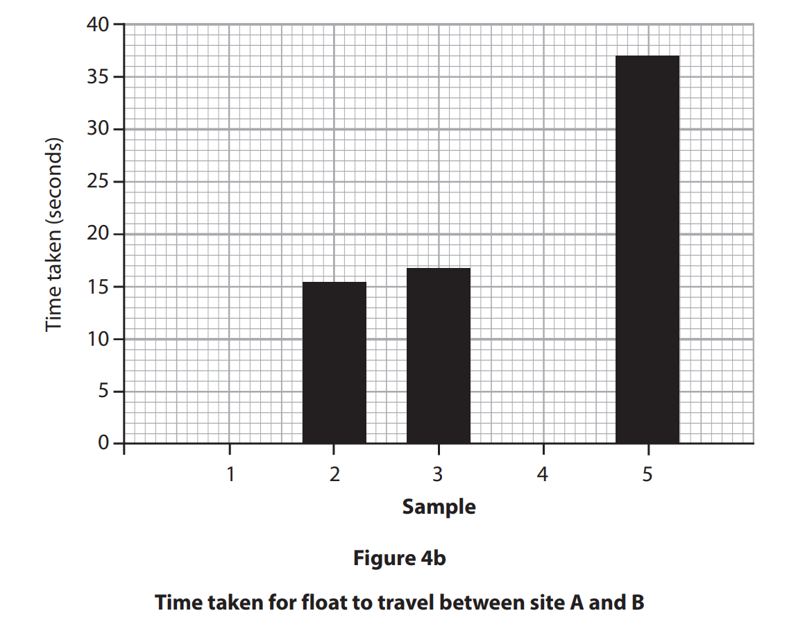
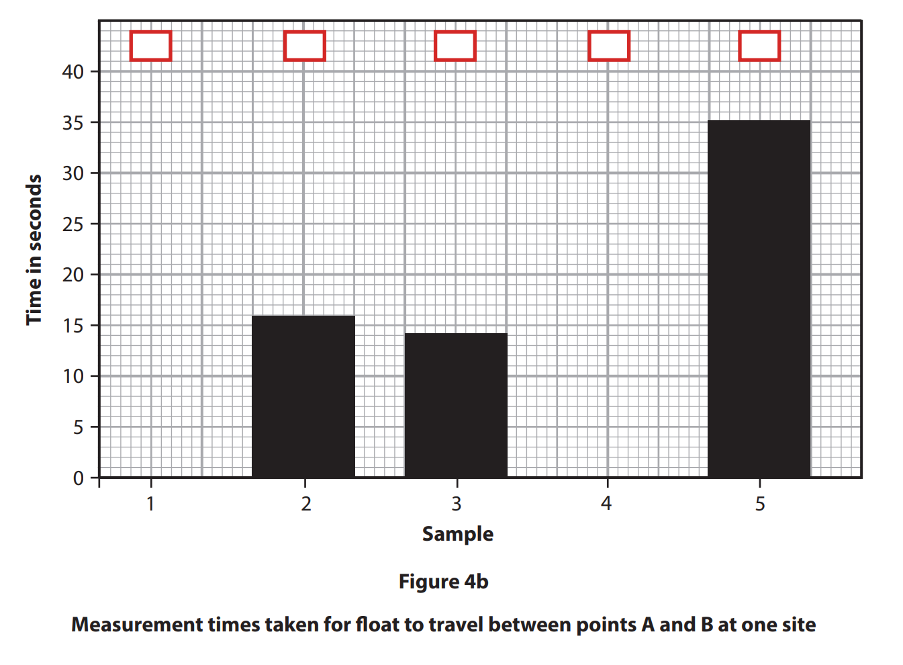
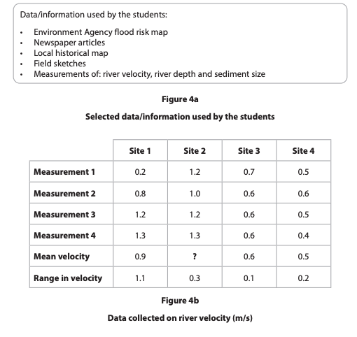
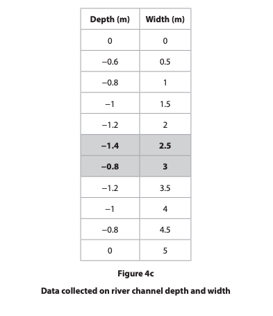
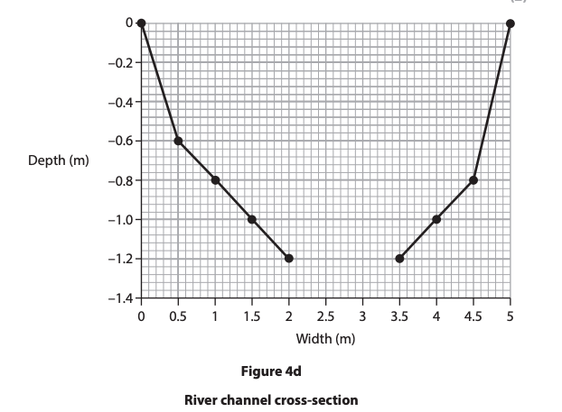
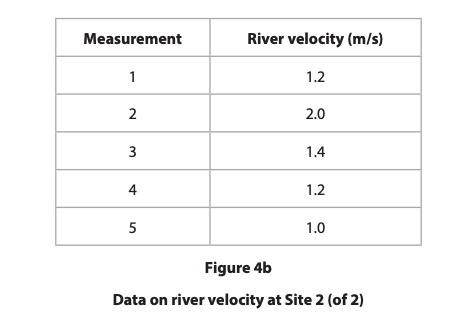
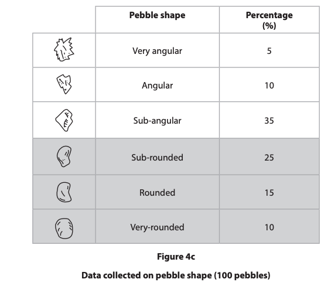
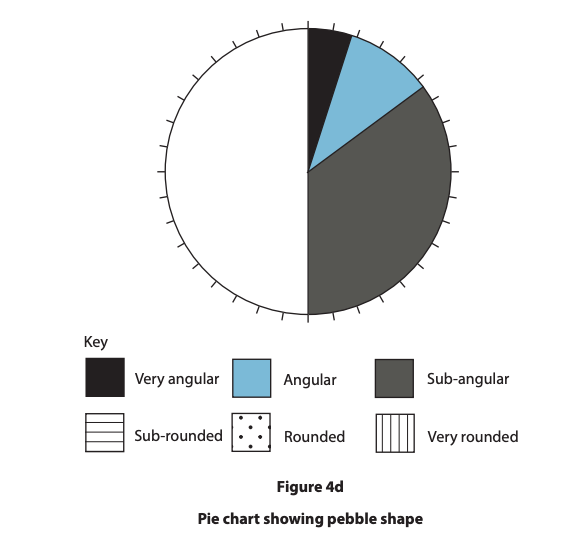
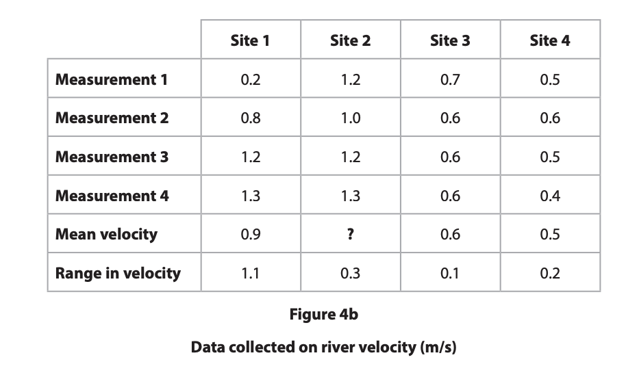
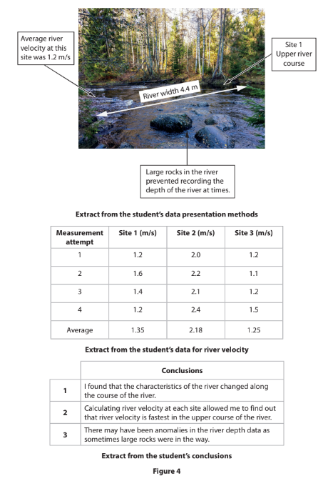

# Exam Questions — River Enquiry Skills
**River Fieldwork** · Edexcel IGCSE Geography (4GE1)
> Source: [https://www.savemyexams.com/igcse/geography/edexcel/19/topic-questions/10-river-fieldwork/10-2-river-enquiry-skills/exam-questions/](https://www.savemyexams.com/igcse/geography/edexcel/19/topic-questions/10-river-fieldwork/10-2-river-enquiry-skills/exam-questions/) · 20 questions · total 92 marks

## Q1 — easy — 6 marks · exam-questions

### 4() — 6 marks — command: multiple — structured — from paper June 2019 · 4GE1/01R
Study Figure 4a . It shows some sample data from one site on a river. A cork float was used to measure the time taken to travel between two points.

| Sample | Time taken (seconds) |
|---|---|
| 1 | 13.1 |
| 2 | 15.4 |
| 3 | 16.8 |
| 4 | 20.0 |
| 5 | 37.0 |

**Figure 4a **

**River data collected by a group of students **

(i)

Calculate the mean time taken for the cork float to travel from site A to site B

Give your answer to one decimal place.

(2)

(ii)

Complete Figure 4b below for samples 1 and 4 using data in Figure 4a.

(2)

(iii)

Sample 5 shows an anomalous result.

Suggest **one** possible explanation for this

(2)

## Q2 — easy — 7 marks · exam-questions

### 4((a)) — 7 marks — command: multiple — structured — from paper June 2019 · 4GE1/01
(i)

Study Figure 4a. It shows sample data on velocity from one site on a river. A cork float was used to measure the time taken to travel between two points, A and B.

Calculate the meantime taken for the cork float to travel between points A and B.

Give your answer to one decimal place.

You must show all your workings in the space below.

(2)

| Sample | Time taken (seconds) |
|---|---|
| 1 | 21.1 |
| 2 | 16.0 |
| 3 | 14.1 |
| 4 | 15.0 |
| 5 | 35.0 |

**Figure 4a **

**River data collected by a group of students **

(ii)

Using the data in Figure 4a (in the Resource Booklet), complete Figure 4b below for measurements 1 and 4.

(1)

(iii)

Mark an x in the box on Figure 4b which represents the float with the anomalous result.

(1)

(iv)

Suggest **one** explanation for this anomaly.

(3)

## Q3 — easy — 1 marks · exam-questions

### 1() — 1 mark — multiple_choice — from paper June 2022 · 4GE1/01
Study Figure 4a below

Identify one type of primary data used by the students

- **A.** Environment Agency flood risk map
- **B.** Field sketches
- **C.** Local historical map
- **D.** Newspaper articles

## Q4 — easy — 2 marks · exam-questions

### 1() — 2 marks — command: calculate — structured — from paper June 2022 · 4GE1/01
Study Figure 4b which shows some data about river velocity at four sites

Calculate the mean river velocity at Site 2

Give your answer to one decimal place

You must show all your workings

## Q5 — easy — 4 marks · exam-questions

### 1() — 2 marks — command: suggest — structured — from paper June 2022 · 4GE1/01
Suggest one reason why the data for Site 1 may not be reliable

### 2() — 2 marks — command: complete — structured — from paper June 2022 · 4GE1/01
Complete Figure 4d below using the data highlighted in Figure 4c

## Q6 — easy — 2 marks · exam-questions

### 1() — 2 marks — command: calculate — structured — from paper June 2022 · 4GE1/01R
Study Figure 4b which shows some data collected about river velocity

Calculate the mean velocity

Give your answer to one decimal place

You must show all your workings

## Q7 — easy — 4 marks · exam-questions

### 1() — 2 marks — command: complete — structured — from paper June 2022 · 4GE1/01R
Complete Figure 4d, using the data highlighted in figure 4c

### 2() — 2 marks — command: identify — structured — from paper June 2022 · 4GE1/01R
Identify **two** ways the students could have improved the reliability of the data collected

## Q8 — easy — 5 marks · exam-questions

### 4((b)) — 2 marks — command: calculate — structured — from paper June 2022 · 4GE1/01
Study Figure 4b, which shows some data about river velocity at four sites.

Calculate the mean river velocity at Site 2.

Give your answer to one decimal place. You must show all your workings in the space below.

### 4() — 1 mark — command: state — structured — from paper June 2022 · 4GE1/01
State one type of sampling students could have used to choose their data collection sites.

### 4() — 2 marks — command: suggest — structured — from paper June 2022 · 4GE1/01
Suggest one reason why the data for Site 1 may not be reliable.

## Q9 — easy — 2 marks · exam-questions

### 1() — 2 marks — command: show — structured
A student investigated how pebble roundness changes along a river. They measured the roundness of ten pebbles at each site using the Power's Scale, where 1 = very angular and 6 = well rounded. The results are shown in the table below.

| Site | Pebble roundness scores |
|---|---|
| 1 (upper course) | 1, 1, 2, 2, 2, 3, 3, 3, 4, 3 |
| 2 | 2, 2, 3, 3, 3, 3, 4, 4, 4, 5 |
| 3 | 3, 3, 3, 4, 4, 4, 4, 5, 5, 4 |
| 4 | 3, 4, 4, 4, 4, 5, 5, 5, 5, 4 |
| 5 | 4, 4, 4, 5, 5, 5, 5, 5, 6, 6 |
| 6 (lower course) | 4, 5, 5, 5, 5, 6, 6, 6, 6, 6 |

Calculate the median pebble roundness score for** Site 3. **

Show your working.

## Q10 — easy — 1 marks · exam-questions

### 1() — 1 mark — command: state — structured
State **one **method that the students could use to present pebble roundness data from their enquiry.

## Q11 — medium — 7 marks · exam-questions

### 7() — 4 marks — command: describe — structured — from paper June 2017 · 4GE1/01
Describe **two** sources of secondary information that might be useful in planning a river channel investigation.

### 7() — 3 marks — command: suggest — structured — from paper June 2017 · 4GE1/01
Suggest why one of the sampling methods named in (b)(i) would be appropriate to use in a river channel investigation. Sampling method

## Q12 — medium — 4 marks · exam-questions

### 4((b)) — 4 marks — command: describe — structured — from paper June 2019 · 4GE1/01R
To extend the river study, students were asked to use one additional quantitative and one qualitative technique. Describe two additional fieldwork techniques the students may have selected.

Quantitative

Qualitative

## Q13 — medium — 5 marks · exam-questions

### 7((c)) — 5 marks — command: multiple — structured — from paper June 2017 · 4GE1/01
(i)

Suggest one possible aim of a river channel investigation

(2)

(ii)

Identify three reasons why a river channel investigation might not achieve the aim given in (c)(i).

(3)

## Q14 — medium — 3 marks · exam-questions

### 1() — 3 marks — command: explain — structured — from paper June 2022 · 4GE1/01
Explain **one** advantage of using a line graph to present results

## Q15 — medium — 3 marks · exam-questions

### 4() — 3 marks — command: explain — structured — from paper June 2022 · 4GE1/01
Explain one advantage of using a line graph to present results.

## Q16 — medium — 4 marks · exam-questions

### 1() — 1 mark — command: identify — structured
Study the table below.

| Site | Pebble roundness scores |
|---|---|
| 1 (upper course) | 1, 1, 2, 2, 2, 3, 3, 3, 4, 3 |
| 2 | 2, 2, 3, 3, 3, 3, 4, 4, 4, 5 |
| 3 | 3, 3, 3, 4, 4, 4, 4, 5, 5, 4 |
| 4 | 3, 4, 4, 4, 4, 5, 5, 5, 5, 4 |
| 5 | 4, 4, 4, 5, 5, 5, 5, 5, 6, 6 |
| 6 (lower course) | 4, 5, 5, 5, 5, 6, 6, 6, 6, 6 |

Identify the anomalous result in the data for **Site 6**.

### 2() — 3 marks — command: suggest — structured
Suggest **one **reason why the anomalous result at Site 6 may have occurred.

## Q17 — hard — 8 marks · exam-questions

### 4((c)) — 8 marks — command: evaluate — structured — from paper June 2019 · 4GE1/01
You have studied river environments for your geographical enquiry.

Evaluate how successful your chosen data analysis methods were in answering your geographical enquiry question.

Enquiry question.

## Q18 — hard — 8 marks · exam-questions

### 4((c)) — 8 marks — command: evaluate — structured — from paper June 2019 · 4GE1/01R
You have studied river processes as part of your own geographical enquiry.

Evaluate the effectiveness of the data collection methods in relation to the purpose of the study.

Enquiry question .

## Q19 — hard — 8 marks · exam-questions

### 1() — 8 marks — command: evaluate — structured — from paper Nov 2021 · 4GE1/01
Study Figure 4 below. It shows some information about methods used, data collected and a conclusion.

The aim of the student’s enquiry was to examine change in river channel shape along the course of a river.

Evaluate how far the student’s data presentation methods and analysis helped the student to make their conclusions.

## Q20 — hard — 8 marks · exam-questions

### 1() — 8 marks — command: evaluate — structured
You have studied river environments as part of your own geographical enquiry.

Evaluate the accuracy and reliability of the conclusion you drew from your enquiry.

State the title of your geographical enquiry.
