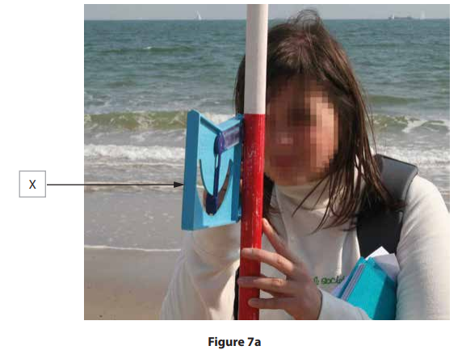
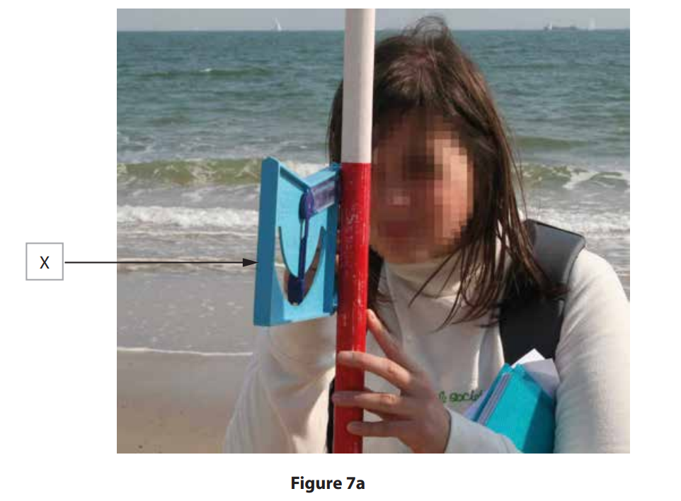
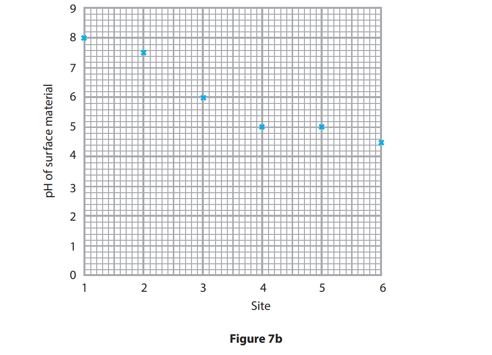
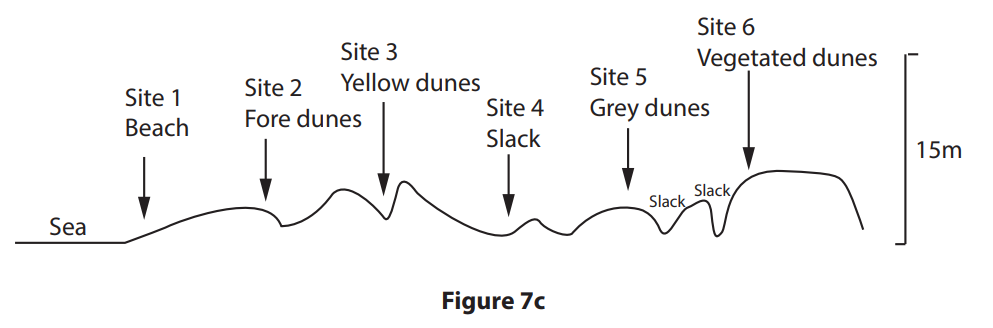

# Exam Questions — Coastal Practical Skills
**Coastal Fieldwork** · Edexcel IGCSE Geography (4GE1)
> Source: [https://www.savemyexams.com/igcse/geography/edexcel/19/topic-questions/11-coastal-fieldwork/11-1-coastal-practical-skills/exam-questions/](https://www.savemyexams.com/igcse/geography/edexcel/19/topic-questions/11-coastal-fieldwork/11-1-coastal-practical-skills/exam-questions/) · 9 questions · total 30 marks

## Q1 — easy — 6 marks · exam-questions

### 5() — 6 marks — command: multiple — structured — from paper June 2019 · 4GE1/01R
(i)

Study Figure 5a. It shows some sample data about shingle size along a stretch of coastline.

Calculate the mean shingle size across the five sites.

Give your answer to one decimal place.

You must show all your workings in the space below.

(2)

| Site | Mean shingle size  (mm) |
|---|---|
| 1 | 8.1 |
| 2 | 14.5 |
| 3 | 16.1 |
| 4 | 15.0 |
| 5 | 30.0 |

**Figure 5a **

**Coastal data collected by a group of students **

(ii)

Complete Figure 5b below for sites 1 and 4 using data in Figure 5a.

(2)

(iii)

Site 5 shows an anomalous result.

Suggest one possible explanation for this.

(2)

## Q2 — easy — 1 marks · exam-questions

### 7((a)) — 1 mark — multiple_choice — from paper June 2018 · 4GE1/01
Study Figure 7a which shows a student measuring a beach profile.

*Student completing coastal fieldwork*

Name the piece of equipment X.
- **A.** augur
- **B.** calliper
- **C.** clinometer
- **D.** quadrat

## Q3 — easy — 2 marks · exam-questions

### 5() — 2 marks — command: multiple — structured — from paper June 2019 · 4GE1/01
A group of students have investigated processes and landforms along a stretch of coastline.

(i)

Identify one risk that the students may identify when undertaking a risk assessment for this investigation.

(1)

(ii)

State one way that this risk could be managed.

(1)

## Q4 — easy — 1 marks · exam-questions

### 1() — 1 mark — command: state — structured
A group of students has undertaken an enquiry that investigated beach characteristics along a stretch of coastline.

State **one **type of sampling students could have used in their enquiry.

## Q5 — easy — 2 marks · exam-questions

### 1() — 2 marks — command: explain — structured
A group of students has undertaken an enquiry that investigated beach characteristics along a stretch of coastline.

Explain **one** factor that affected the students' choice of data collection sites.

## Q6 — easy — 2 marks · exam-questions

### 1() — 2 marks — command: explain — structured
A group of students has undertaken an enquiry that investigated beach characteristics along a stretch of coastline.

Identify **one **health and safety risk that the students could face during their enquiry. Explain the impact this risk could have had.

## Q7 — medium — 7 marks · exam-questions

### 7() — 7 marks — command: multiple — structured — from paper June 2018 · 4GE1/01
(i)

Study figure 7a. Describe how the piece of equipment **X** is used to measure a beach profile

(3)

(ii)

Suggest two factors that the student might have considered when choosing a site for this beach profile.

(4)

## Q8 — medium — 6 marks · exam-questions

### 7() — 6 marks — command: multiple — structured — from paper June 2018 · 4GE1/01
A student conducted their investigation at the back of a beach into the sand dune area shown on Figure 7c below.  Study Figure 7b which is a table and graph. The table shows the data collected on a sand dune transect. The pH data has been plotted on the graph.

(i)

**Plot **the data for plant species on the graph (Figure 7b).

| SITE | 1 | 2 | 3 | 4 | 5 | 6 |
|---|---|---|---|---|---|---|
| pH of surface material | 8.0 | 7.5 | 6.0 | 5.0 | 5.0 | 4.5 |
| Average no. of plant species per sq.m | 0 | 2 | 6 | 12 | 10 | 15 |

(4)

(ii)

Identify two sets of data that were needed to draw the transect in Figure 7c.

(2)

## Q9 — medium — 3 marks · exam-questions

### 5((b)) — 3 marks — command: explain — structured — from paper June 2019 · 4GE1/01
A group of students have investigated processes and landforms along a stretch of coastline. To extend the coastal study, students were asked to use one other primary data method.    Explain one other primary data method they might have used.
