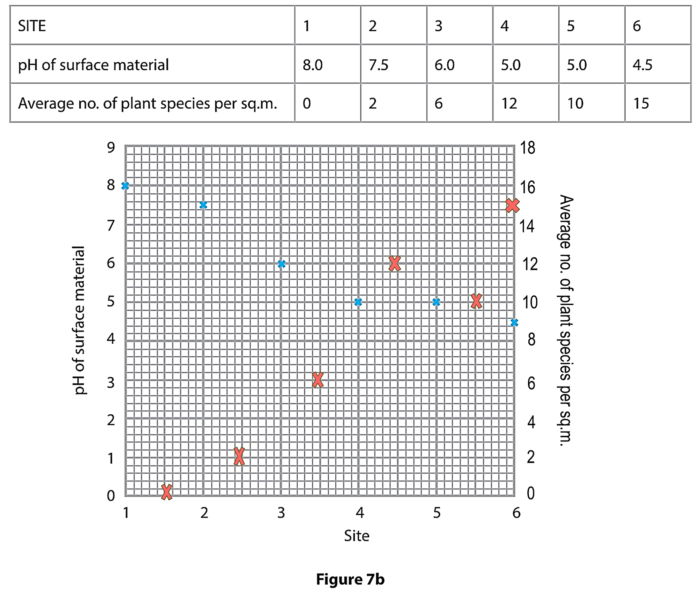
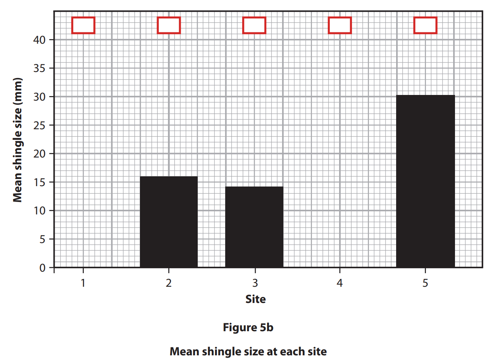
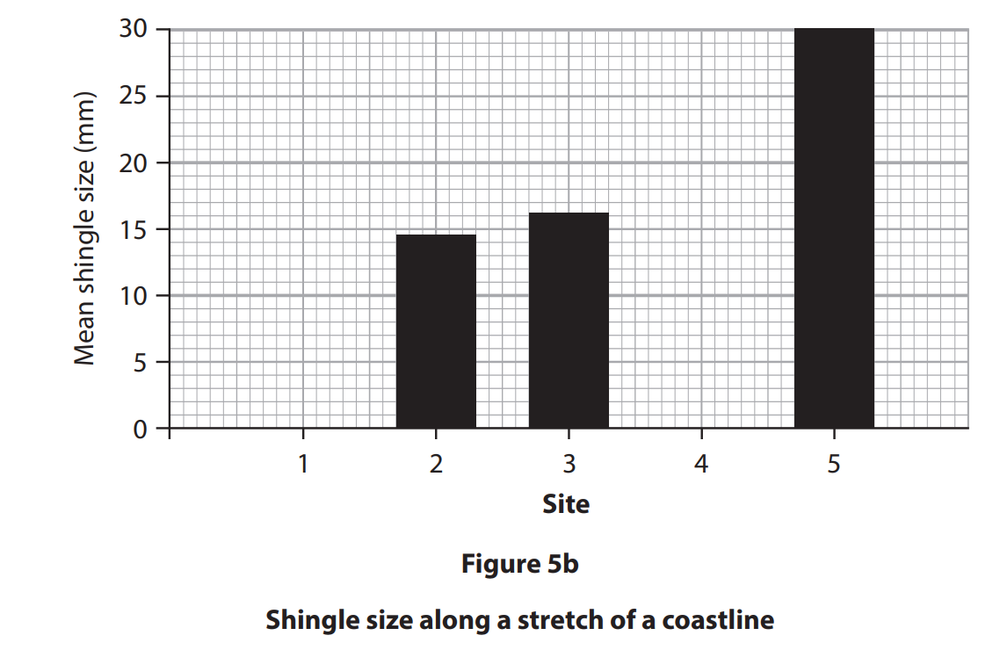

# Exam Questions — Coastal Enquiry Skills
**Coastal Fieldwork** · Edexcel IGCSE Geography (4GE1)
> Source: [https://www.savemyexams.com/igcse/geography/edexcel/19/topic-questions/11-coastal-fieldwork/11-2-coastal-enquiry-skills/exam-questions/](https://www.savemyexams.com/igcse/geography/edexcel/19/topic-questions/11-coastal-fieldwork/11-2-coastal-enquiry-skills/exam-questions/) · 7 questions · total 44 marks

## Q1 — easy — 2 marks · exam-questions

### 1() — 2 marks — command: calculate — structured
A student investigated how sediment size changes along a beach. They measured the length of ten pebbles at each site using a ruler. The median pebble length (in millimetres) at each site is shown in the table below.

| Site | Location on beach | Median pebble length (mm) |
|---|---|---|
| 1 | Western end | 68 |
| 2 |   | 57 |
| 3 |   | 49 |
| 4 |   | 61 |
| 5 |   | 38 |
| 6 | Eastern end | 27 |

Calculate the median of the **six site medians **shown in the table. Show your working.

## Q2 — easy — 1 marks · exam-questions

### 1() — 1 mark — command: state — structured
State **one **method that the students could use to present sediment size data from their enquiry.

## Q3 — medium — 11 marks · exam-questions

### 7() — 2 marks — command: suggest — structured — from paper June 2018 · 4GE1/01
** Figure 7b** is a table and graph.  The table shows the data collected on a sand dune transect.  The data has been plotted on the graph.

**Figure 7c** is a sketch of the transect from the data.

Suggest one advantage of locating the graph **(Figure 7b)** above the transect **(Figure 7c).**

### 7() — 6 marks — command: assess — structured — from paper June 2018 · 4GE1/01
Assess what conclusions can be reached about changes in pH and vegetation along the transect.

### 7() — 3 marks — command: suggest — structured — from paper June 2018 · 4GE1/01
Suggest how you might evaluate the conclusions reached in such an investigation.

## Q4 — medium — 8 marks · exam-questions

### 5((a)) — 8 marks — command: multiple — structured — from paper June 2019 · 4GE1/01
Study Figure 5a . It shows sample data on shingle size collected at five sites along a stretch of coastline.

(i)

Calculate the **mean **shingle size for the five sites. Give your answer to **one **decimal place. You **must **show all your workings in the space below.

| Site | Mean shingle size (mm) |
|---|---|
| 1 | 21.1 |
| 2 | 16.0 |
| 3 | 14.1 |
| 4 | 10.0 |
| 5 | 30.1 |

**Figure 5a ** ** Coastal data collected by a group of students **

(2)

(ii)

Using the data in Figure 5a, complete Figure 5b below for sites 1 and 4.

(1)

(iii)

Mark an x in the box on Figure 5b which represents the site with the anomalous result.

(1)

(iv)

Suggest one possible explanation for this anomaly

(4)

## Q5 — medium — 10 marks · exam-questions

### 5() — 6 marks — command: multiple — structured — from paper June 2019 · 4GE1/01R
(i)

Study Figure 5a . It shows some sample data about shingle size along a stretch of coastline.

Calculate the mean shingle size across the five sites.

Give your answer to one decimal place.

You must show all your workings in the space below.

| Site | Mean shingle size  (mm) |
|---|---|
| 1 | 8.1 |
| 2 | 14.5 |
| 3 | 16.1 |
| 4 | 15.0 |
| 5 | 30.0 |

**Figure 5a **

**Coastal data collected by a group of students **

(1)

(ii)

Complete Figure 5b below for sites 1 and 4 using data in Figure 5a.

(1)

(iii)

Site 5 shows an anomalous result.

Suggest one possible explanation for this.

(4)

### 5((b)) — 4 marks — command: describe — structured — from paper June 2019 · 4GE1/01R
To extend the coastal study, students were asked to use one additional quantitative and one qualitative technique.

Describe the two additional fieldwork techniques the students may have selected.

**Quantitative**

**Qualitative**

## Q6 — medium — 4 marks · exam-questions

### 1() — 1 mark — command: identify — structured
The median pebble length (in millimetres) at each site is shown in the table below.

| Site | Location on beach | Median pebble length (mm) |
|---|---|---|
| 1 | Western end | 68 |
| 2 |   | 57 |
| 3 |   | 49 |
| 4 |   | 61 |
| 5 |   | 38 |
| 6 | Eastern end | 27 |

Identify the anomalous result in the data.

### 2() — 3 marks — command: suggest — structured
Suggest **one **reason why the anomalous result at Site 4 may have occurred.

## Q7 — hard — 8 marks · exam-questions

### 1() — 8 marks — command: evaluate — structured
You have studied coastal environments as part of your own geographical enquiry.

Evaluate the accuracy and reliability of the conclusion you drew from your enquiry.

State the title of your geographical enquiry.
