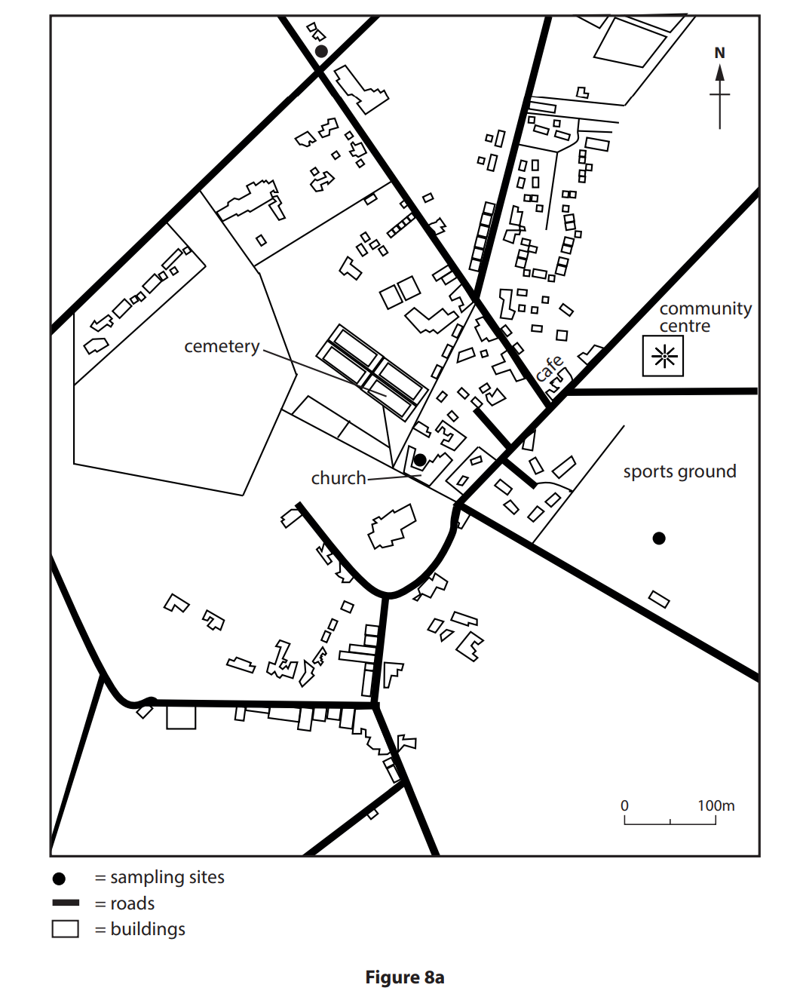
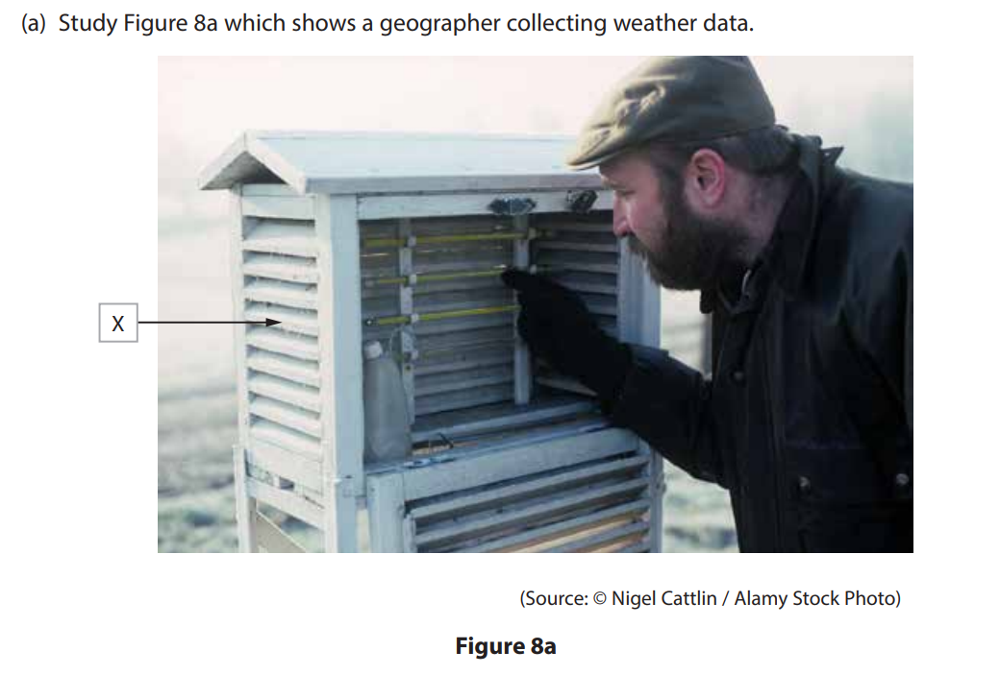
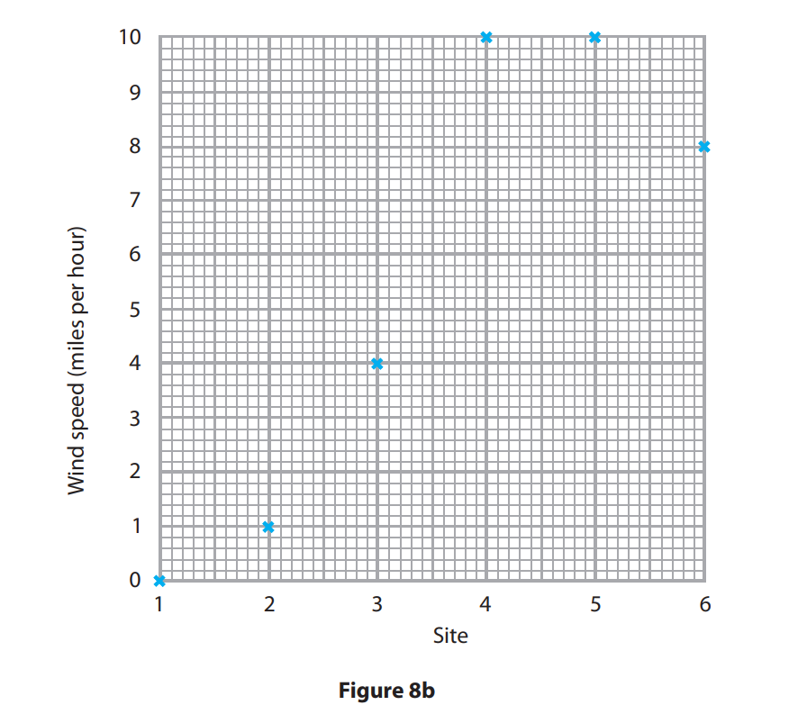
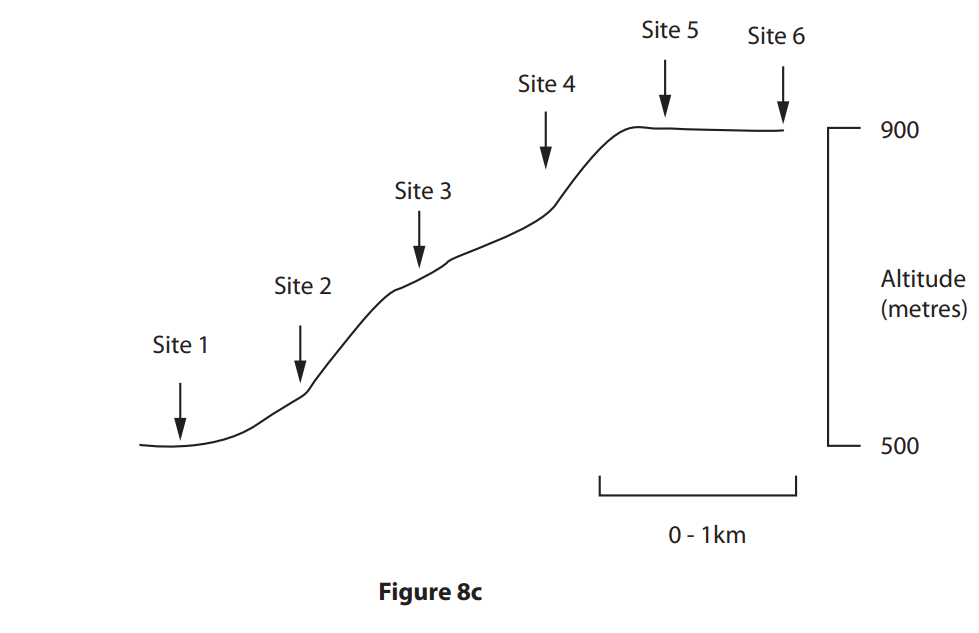
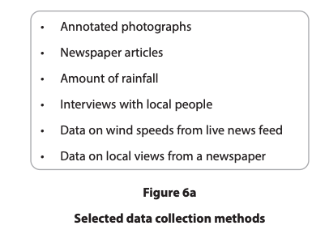

# Exam Questions — Hazardous Practical Skills
**Hazardous Fieldwork** · Edexcel IGCSE Geography (4GE1)
> Source: [https://www.savemyexams.com/igcse/geography/edexcel/19/topic-questions/12-hazardous-fieldwork/12-1-hazardous-practical-skills/exam-questions/](https://www.savemyexams.com/igcse/geography/edexcel/19/topic-questions/12-hazardous-fieldwork/12-1-hazardous-practical-skills/exam-questions/) · 14 questions · total 46 marks

## Q1 — easy — 1 marks · exam-questions

### 8() — 1 mark — multiple_choice — from paper June 2017 · 4GE1/01
Study Figure 8a which is a sketch map showing the locations of three sampling sites used in an investigation of the microclimate of a village.

Why is group work often better suited to microclimate investigations than an individual working alone?
- **A.** Some villages are polluted.
- **B.** One person can carry the refreshments
- **C.** One person can record while others use equipment.
- **D.** The measuring equipment is heavy.

## Q2 — easy — 7 marks · exam-questions

### 8() — 1 mark — multiple_choice — from paper June 2018 · 4GE1/01
Study Figure 8a which shows a geographer collecting weather data.

Name the piece of equipment X.
- **A.** Beaufort scale
- **B.** whirling hygrometer
- **C.** Stevenson screen
- **D.** rain gauge

### 8() — 6 marks — command: multiple — structured — from paper June 2018 · 4GE1/01
Study Figure 8b which is a table and graph. The table shows data collected up the hill slope shown in Figure 8c. The wind speed data has been plotted on the graph.

(i) **Plot the data** for temperature on the graph (Figure 8b).

(4)

| **SITE ** | 1 | 2 | 3 | 4 | 5 | 6 |
|---|---|---|---|---|---|---|
| Air temperature (°C) | 20.5 | 19.5 | 19.0 | 18.0 | 17.5 | 18.0 |
| Wind speed (miles per hour) | 0 | 1 | 4 | 10 | 10 | 8 |

(ii) Identify two sets of data needed to draw the hill slope profile shown in Figure 8c.

(2)

## Q3 — easy — 2 marks · exam-questions

### 6() — 1 mark — multiple_choice — from paper June 2019 · 4GE1/01
A group of students have investigated the physical processes involved in an extreme weather event, by recording a weather diary. The students used an anemometer to record wind speed every hour.

Identify the type of sampling method used.
- **A.** systematic
- **B.** random
- **C.** stratified
- **D.** opportunistic

### 6() — 1 mark — command: state — structured — from paper June 2019 · 4GE1/01
State one disadvantage of using one of the sampling methods in the question above, a(i)

## Q4 — easy — 2 marks · exam-questions

### 6() — 2 marks — command: multiple — structured — from paper June 2019 · 4GE1/01R
A group of students have investigated the physical processes involved in an extreme weather event, by recording a weather diary.

(i) Identify one risk that the students may identify when undertaking a risk assessment for this investigation.

(1)

(ii) State one way that this risk could be managed.

(1)

## Q5 — easy — 2 marks · exam-questions

### 4() — 1 mark — multiple_choice — from paper Nov 2021 · 4GE1/01
Identify a suitable piece of equipment to measure wind speed
- **A.** Anemometer
- **B.** Quadrat
- **C.** Clinometer
- **D.** Stopwatch

### 2() — 1 mark — command: name — structured — from paper Nov 2021 · 4GE1/01
Name **one** type of sampling method

## Q6 — easy — 2 marks · exam-questions

### 4() — 2 marks — command: describe — structured — from paper Nov 2021 · 4GE1/01
Describe **one **way GIS might be used for fieldwork in a hazardous environment

## Q7 — easy — 2 marks · exam-questions

### 4() — 1 mark — multiple_choice — from paper June 2022 · 4GE1/01R
Study Figure 6a

Identify one type of quantitative data used by the students

- **A.** Annotated photographs
- **B.** Newspaper articles
- **C.** Amount of rainfall
- **D.** Interviews with local people

### 2() — 1 mark — command: state — structured — from paper June 2022 · 4GE1/01R
State **one** way maps could be used to support the enquiry

## Q8 — easy — 1 marks · exam-questions

### 4() — 1 mark — command: state — structured — from paper June 2022 · 4GE1/01R
State **one** piece of equipment that could be used to measure rainfall

## Q9 — easy — 1 marks · exam-questions

### 1() — 1 mark — command: state — structured
A group of students has undertaken an enquiry that investigated changes in the weather as part of their studies into hazardous environments.

State **one **type of sampling students could have used in their enquiry.

## Q10 — easy — 2 marks · exam-questions

### 1() — 2 marks — command: explain — structured
A group of students has undertaken an enquiry that investigated changes in the weather as part of their studies into hazardous environments.

Explain **one** factor that affected the students' choice of data collection sites.

## Q11 — easy — 2 marks · exam-questions

### 1() — 2 marks — command: explain — structured
A group of students has undertaken an enquiry that investigated changes in the weather as part of their studies into hazardous environments.

Identify **one **health and safety risk that the students could face during their enquiry. Explain the impact this risk could have had.

## Q12 — medium — 12 marks · exam-questions

### 8() — 6 marks — command: outline — structured — from paper June 2017 · 4GE1/01
Outline three factors that should be considered when choosing a suitable sampling site for a microclimate investigation.

### 8() — 6 marks — command: outline — structured — from paper June 2017 · 4GE1/01
Outline each of the three following sampling methods used in geographical investigations.

- random sampling
- stratified sampling
- systematic sampling

## Q13 — medium — 7 marks · exam-questions

### 8() — 3 marks — command: describe — structured — from paper June 2018 · 4GE1/01

Describe how the piece of equipment X is used in collecting weather data.

### 8() — 4 marks — command: suggest — structured — from paper June 2018 · 4GE1/01
Suggest two factors that should be considered when choosing a suitable site at which to locate weather recording equipment such as that shown in figure 1

## Q14 — medium — 3 marks · exam-questions

### 1() — 3 marks — command: explain — structured — from paper June 2022 · 4GE1/01R
Explain **one** fieldwork technique the students could have used to explore weather characteristics
