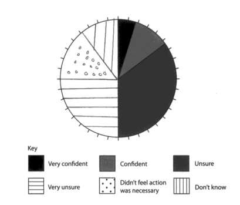

# Mark Schemes — Hazardous Enquiry Skills
**Hazardous Fieldwork** · Edexcel IGCSE Geography (4GE1)

## Q1 — easy — 2 marks · exam-questions

### 1() — 2 marks
Add the five rainfall figures together, then divide by the number of days (5):

*22 + 12 + 33 + 16 + 8 = 91*

91 ÷ 5 **[1]**

= **18.2 mm** **[1]**

> **[mark-scheme]**
> **Mark allocation**
> 
> - One mark for correct working: adding the correct five figures **and** dividing by 5 (the correct method)
> - One mark for the correct answer of 18.2, given to one decimal place
> 
> **[2 marks]**
> 
> - The working mark requires the **correct method** (the correct figures added **and** divided by 5). Adding the values alone, or using the wrong operation, does **not** gain the working mark.
> - Working must be shown to gain full marks

## Q2 — easy — 4 marks · exam-questions

### 1() — 2 marks
- Remember to use the exact shading shown on the key
- One mark is awarded for the correct plotting of the lines
- The second mark is for shading the sections correctly

### 2() — 2 marks
| Indicative Content | Commentary |
|---|---|
| - Ask more people ** (1)** - Compare results to another group. ** (1)** - Ensure one person in the group is responsible for measurements ** (1)** | - Two marks will be awarded for any two of the answers listed opposite |

## Q3 — easy — 2 marks · exam-questions

### 1() — 2 marks
First, arrange the six values in order from smallest to largest:

27.1, 28.4, 29.7, 31.2, 32.6, 33.8 **[1]**

There are 6 values, so the median is the average of the 3rd and 4th values.

3rd value = 29.7, 4th value = 31.2

Median = (29.7 + 31.2) ÷ 2 = 60.9 ÷ 2 = **30.45°C** **[1]**

> **[mark-scheme]**
> The command word '**calculate**' means you must show your working and give a numerical answer.
> 
> **Mark allocation**
> 
> This answer is assessed using a** point-marked** approach.
> 
> - **One mark** for correctly identifying the 3rd and 4th values as 29.7 and 31.2 after ordering the data to find the middle value
> - **One mark** for the correct final answer of 30.45°C or 30.5°C
> 
> **[2 marks]**
> 
> - The answer 30.45 without the unit '°C' is acceptable but the unit should be encouraged
> 
> **Do not accept:**
> 
> - The mean of the six values, which gives 30.47°C
> 
> **Common errors**
> 
> - Calculating the mean instead of the median. Students must read the command word carefully.
> - Forgetting to reorder the data before selecting the middle values, which leads to the incorrect 3rd and 4th values being used.
> - Selecting only the 3rd value rather than averaging the 3rd and 4th values in an even-numbered data set.

> **[exam-tip]**
> **Always **reorder the data before doing anything else. The values in the table are not in numerical order, and if you use them as they appear, you will get the wrong answer.
> 
> **With **six values there is no single middle number. Find the average of the 3rd and 4th values after ordering. Show every step clearly because the working earns a mark.

## Q4 — easy — 1 marks · exam-questions

### 1() — 1 marks
> **[mark-scheme]**
> Any **one **from:
> 
> - Line graph
> - Bar chart
> - Scatter graph
> - Annotated map showing temperature at each site using proportional symbols or isoline contours
> 
> **[1 mark]**
> 
> **Common errors**
> 
> - Naming a data collection method such as 'a thermometer' or 'a digital temperature sensor'
> - Choosing a pie chart, which is not appropriate for continuous or site-based temperature data
> - Using a raw data table, which is data recording rather than data presentation

> **[exam-tip]**
> **Data **presentation means a visual display such as a graph, chart or map. It is not the same as data collection.
> 
> **You **have one temperature value per site across six sites along a transect. A line graph is the best here because it would show the trend clearly and make the anomaly at Site 3 stand out visually. One named technique is all that is required here.

## Q5 — medium — 12 marks · exam-questions

### 8() — 4 marks
Award 1 mark for each relevant secondary source identified e.g. OS map** (1)**; local Met Office station records ** (1)**; local area weather forecast ** (1)**; compass directions ** (1)**; historic weather diaries ** (1)**; newspaper reports for area ** (1)**….

2nd marks can be given where purpose of source made clear e.g.

- OS map ** (1)** gives altitude of site ** (1)**
- compass directions ** (1)** gives aspect of site ** (1)**

For max marks at least one named source needed (e.g. Met Office, Ordnance Survey, Environment Agency, Severn Trent Water, Google Maps)

### 8() — 3 marks
Accept answers based on all three methods awarding marks per point of justification with a developed point worth 2 and possibly 3 marks e.g.

- systematic – no bias ** (1)** by measuring at regular intervals ** (1)** avoiding need for any personal judgement** (1)**
- stratified – good way to achieve representativeness ** (1)** by basing sampling site on OS map ** (1)** and pre-fieldwork visits ** (1)**
- random – avoids site selection difficulties ** (1)** by impersonalising sampling decision ** (1)** no bias ** (1)**

No mark for naming sampling procedure.

### 8() — 5 marks
(i) Credit any valid aim (accept objectives) for a microclimate investigation with 1 mark for brevity/basic strategy. 2nd mark requires fully developed aim along lines of a title e.g.

- measure weather conditions ** (1)** compare with another local site ** (1)**
- measure temperature … ** (1)** compare with Met Office station recordings for that area ** (1)**

(ii) Credit any valid and distinctive reason why an investigation might not meet its aim. These will be generic to fieldwork and amount to aspects of investigation that might form part of evaluating the process and results

e.g.

- accuracy of data collected** (1)**
- sufficient data collected** (1)**
- careful data recording ** (1)**
- accuracy of data collation ** (1)** and data presentation** (1)**
- reliable analysis and interpretation of findings ** (1)**
- validity of conclusions reached ** (1)**
- realism and practicality of aim** (1)**
- suitability of sites chosen ** (1)**

## Q6 — medium — 4 marks · exam-questions

### 1() — 1 marks
Site 3 with a temperature of 27.1°C, which is lower than expected given its location between Sites 2 and 4. **[1]**

> **[mark-scheme]**
> The command word '**identify**' means you only need to state the value. No explanation is required here.
> 
> **Mark allocation**
> 
> This answer is assessed using a** point-marked** approach.
> 
> - **One mark** correctly identifying 27.1°C at Site 3 as the anomalous result
> 
> **[1 mark]**

> **[exam-tip]**
> **An anomaly** is a result that does not fit the pattern of the other values. The general trend in this data is that pebble size decreases from west to east. Look for the value that breaks that trend. One sentence is all you need here.

### 2() — 3 marks
Site 3's anomalous result may be due to urban park vegetation cooling. **[1]** Evaporation from trees and grass lowers local temperatures by absorbing heat from the air. **[1] **Site 3 is located between two warmer urban sites, but dense vegetation creates a localised cool microclimate that lowers its temperature below the rural fringe-to-city centre trend. **[1]**

> **[mark-scheme]**
> The command word '**suggest**' means you must apply your knowledge to give a possible reason, even if it cannot be proved with certainty.
> 
> **Mark allocation**
> 
> This answer is assessed using a** point-marked** approach.
> 
> - **One mark** for identifying a valid reason for the anomaly
> - **One mark** for development of that reason
> - **One mark** for further development that links back to why the temperature at Site 3 is lower than the trend predicts
> 
> **[3 marks]**
> 
> **Alternative content**
> 
> The answer above is just one example of how to respond to this question. Alternative information that could be provided in the answer includes:
> 
> - Lack of impermeable surfaces in the park compared to surrounding sites
> - Shading from tree canopy at the measurement point
> - Human error in recording or equipment placement

> **[exam-tip]**
> **Don't **be tempted to explain the urban heat island effect rather than explaining why one specific site has a higher value than expected.

## Q7 — hard — 8 marks · exam-questions

### 1() — 8 marks
The indicative content below is not prescriptive, and candidates are not required to include all of it. Other relevant material not suggested below must also be credited. This question is about candidates making a judgement of the data presentation methods and analysis that have been used to help students draw conclusions. Candidates may note the extent to which the fieldwork presentation and analysis support the conclusions in Figures 6.

Responses could include:

- Comments could be made on how relevant the conclusions are based on the presentation and analysis methods.
- Comments could address the suitability of the data presentation method to help draw conclusions.
- Comments could address the suitability of the data table to help draw conclusions.
- Comments on how anomalies could have affected the results and therefore the conclusion.
- Comments on the accuracy of students recording the data and the effect on conclusions.
- Comment on the distribution of site selection for data collection and the impact this could have on conclusions.
- Comments on other data that could have been collected.
- Comments on the value of the methods in relation to the aim of the investigation.

For level 2 responses candidates will need to link the conclusion to both data presentation methods and analysis.

For level 3 responses there should be a greater depth of evaluation recognising the impact of the data collection presentation and analysis on the conclusions made.

## Q8 — hard — 8 marks · exam-questions

### 1() — 8 marks
'To what extent did prolonged heavy rainfall increase flood risk in the River Severn catchment in February?'

I concluded that saturated soil, impermeable urban surfaces, and high antecedent rainfall combined increase flood risk because water will reach the river channel faster. **[K] **Overall my data supports this conclusion, but some sites' accuracy and reliability issues limit my confidence. **[Ap]**

I measured river levels at three catchment gauging locations using a metre rule marked at a fixed point on each bridge as my primary data collection method. **[K] **Though cheap and simple, this method proved inaccurate. The water surface level fluctuated with each flow pulse, making it difficult to get an exact reading. This caused some readings to be slightly higher or lower than the measured water level. **[Ap]**

In two minutes, I took three readings at each measuring site and used the mean to reduce the impact of any single error. **[K]** I only visited each site once a day, so I couldn't get hourly river levels, which restricted my flood response speed conclusion. **[Ap]**

Secondary Environment Agency data revealed Shrewsbury Severn River levels reached 5.2 m above average in February, supporting my hypothesis. **[K]** This similarity between my main observations and the official record confirmed my flood risk conclusion. **[Ap]**

My conclusion is reliable because my trend matched my data and secondary evidence. A longer data collecting time and digital water level logger would have improved my findings' accuracy and reliability. **[Ap]**

> **[mark-scheme]**
> The command word '**evaluate**' means the answer must consider the strengths and limitations of the enquiry across more than one stage of the enquiry process and must reach a clear overall judgement.
> 
> **Mark allocation**
> 
> This answer is assessed using a level of response approach. Each point made in the answer does not equal a mark.
> 
> A top-level 3 answer **[8 marks]** will include specific examples that show:
> 
> - **AO1**: **[K]**  knowledge about weather hazards, flood processes, fieldwork methods and the enquiry context
> - **AO3**: **[Ap]** application of knowledge to evaluate the accuracy and reliability of data and to assess the validity of the conclusion
> 
> **Alternative content**
> 
> The answer above is just one example of how to respond to this question and will depend on the example used. Alternative information that could be provided in the answer includes:
> 
> - How Environment Agency flood records, Met Office rainfall data, and newspaper reports supported or challenged primary data
> - Data presentation and whether graphs or maps clearly showed the rainfall-flood risk relationship
> - Discussion of how data collection timing relative to the flood peak may have affected the data recorded
> - A comparison of accuracy and reliability using the student's hazardous environments methods
> - Possible ethical or practical issues with collecting data during a flood, such as restricted access to flooded sites

> **[exam-tip]**
> **Know **the difference between accuracy and reliability.
> 
> - **Accuracy** asks: are my results close to the true value?
> - **Reliability **asks: if I repeated this, would I get the same results?
> - Use both words correctly and link them to specific parts of your own enquiry.
> 
> **A clear** overall judgement at the end is essential for Level 3. It does not need to be long. One sentence that directly answers whether and why your conclusion was accurate and reliable.
> 
> **One **final and important reminder: this question must be answered using your hazardous environments fieldwork, which must be based on an extreme weather event. Answers about tectonic hazards will score zero regardless of their quality.
