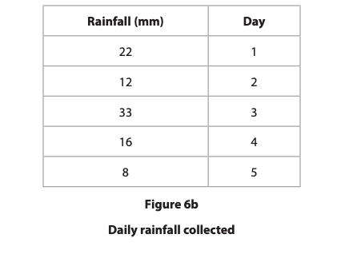
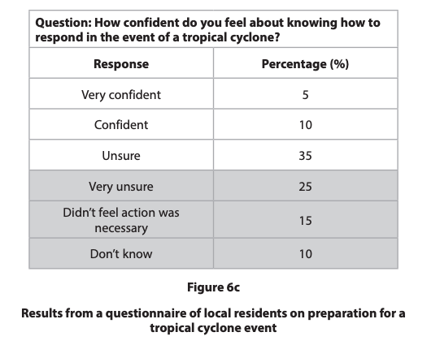
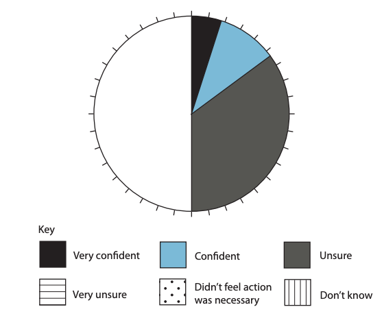
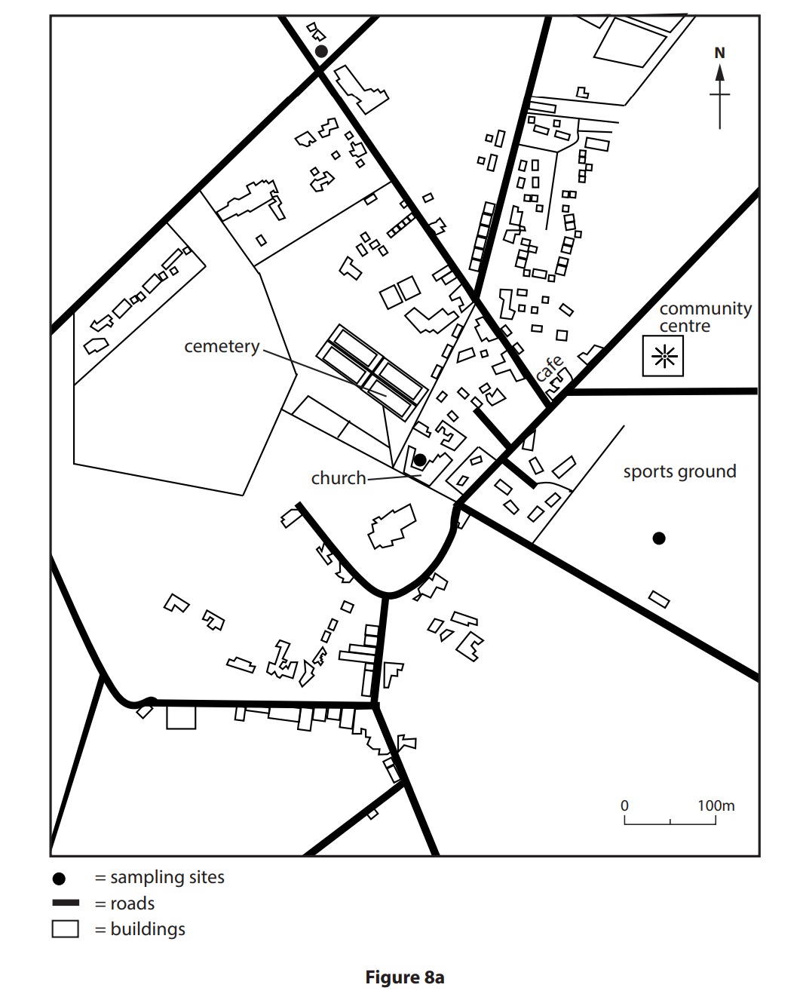
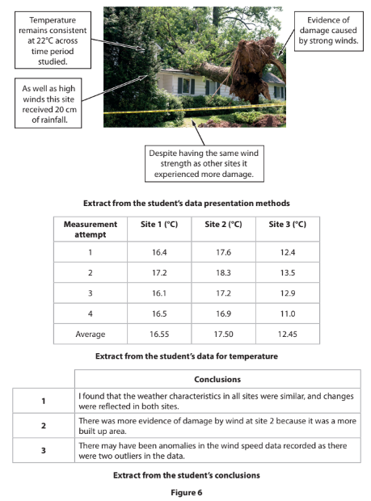

# Exam Questions — Hazardous Enquiry Skills
**Hazardous Fieldwork** · Edexcel IGCSE Geography (4GE1)
> Source: [https://www.savemyexams.com/igcse/geography/edexcel/19/topic-questions/12-hazardous-fieldwork/12-2-hazardous-enquiry-skills/exam-questions/](https://www.savemyexams.com/igcse/geography/edexcel/19/topic-questions/12-hazardous-fieldwork/12-2-hazardous-enquiry-skills/exam-questions/) · 8 questions · total 41 marks

## Q1 — easy — 2 marks · exam-questions

### 1() — 2 marks — command: calculate — structured — from paper June 2022 · 4GE1/01R
Study Figure 6b which shows some data about rainfall over 5 days during a tropical cyclone event

Calculate the mean rainfall

Give your answer to one decimal place

You must show all your workings

## Q2 — easy — 4 marks · exam-questions

### 1() — 2 marks — command: complete — structured — from paper June 2022 · 4GE1/01R
Complete Figure 6d below using the data highlighted in 6c

### 2() — 2 marks — command: identify — structured — from paper June 2022 · 4GE1/01R
Identify** two** ways the students could have improved the reliability of the data collected

## Q3 — easy — 2 marks · exam-questions

### 1() — 2 marks — command: show — structured
A student investigated how air temperature varies across an urban area during a heatwave. They recorded air temperature in degrees Celsius at six sites along a transect from the rural fringe to the city centre. The results are shown in the table below.

| Site | Location | Air temperature (°C) |
|---|---|---|
| 1 | Rural fringe | 28.4 |
| 2 | Suburban housing | 29.7 |
| 3 | Urban park | 27.1 |
| 4 | Inner suburb | 31.2 |
| 5 | City centre edge | 32.6 |
| 6 | City centre core | 33.8 |

Calculate the median air temperature recorded across the** six sites. **

Show your working.

## Q4 — easy — 1 marks · exam-questions

### 1() — 1 mark — command: state — structured
State **one **method that the students could use to present air temperature data from their enquiry.

## Q5 — medium — 12 marks · exam-questions

### 8() — 4 marks — command: describe — structured — from paper June 2017 · 4GE1/01
Study Figure 8a which is a sketch map showing the locations of three sampling sites used in an investigation of the microclimate of a village.

Describe two sources of secondary information that might be useful in planning a microclimate investigation.

### 8() — 3 marks — command: suggest — structured — from paper June 2017 · 4GE1/01
Suggest why one of the sampling methods named in (b)(i) would be appropriate to use in a microclimate investigation.

Sampling method ________

### 8() — 5 marks — command: multiple — structured — from paper June 2017 · 4GE1/01
(i) Suggest one possible aim of a microclimate investigation.

(2)

(ii) Identify three reasons why a microclimate investigation might not achieve the aim given in (c)(i).

(3)

## Q6 — medium — 4 marks · exam-questions

### 1() — 1 mark — command: identify — structured
The recorded air temperatures (°C) at each site are shown in the table below.

| Site | Location | Air temperature (°C) |
|---|---|---|
| 1 | Rural fringe | 28.4 |
| 2 | Suburban housing | 29.7 |
| 3 | Urban park | 27.1 |
| 4 | Inner suburb | 31.2 |
| 5 | City centre edge | 32.6 |
| 6 | City centre core | 33.8 |

Identify the anomalous result in the data.

### 2() — 3 marks — command: suggest — structured
Suggest **one **reason why the anomalous result at Site 3 may have occurred.

## Q7 — hard — 8 marks · exam-questions

### 1() — 8 marks — command: evaluate — structured — from paper Nov 2021 · 4GE1/01
Study Figure 6 below. It shows some information about methods used, data collected and a conclusion

The aim of the student's investigation was to examine change in local weather conditions.

Evaluate how far the student's data presentation methods and analysis helped the student make their conclusions.

## Q8 — hard — 8 marks · exam-questions

### 1() — 8 marks — command: evaluate — structured
You have studied hazardous environments as part of your own geographical enquiry.

Evaluate the accuracy and reliability of the conclusion you drew from your enquiry.

State the title of your geographical enquiry.
