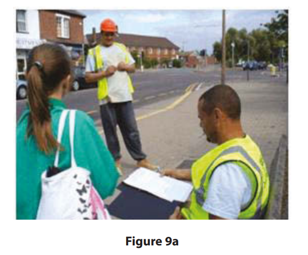
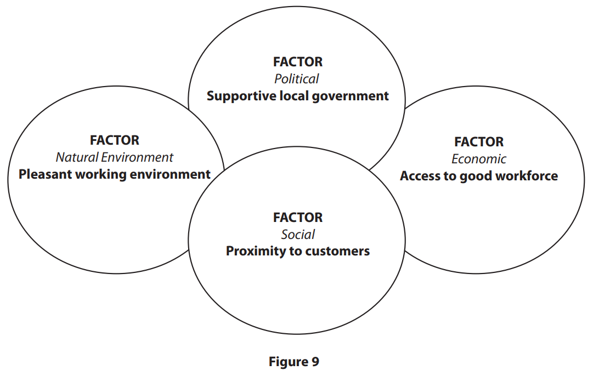
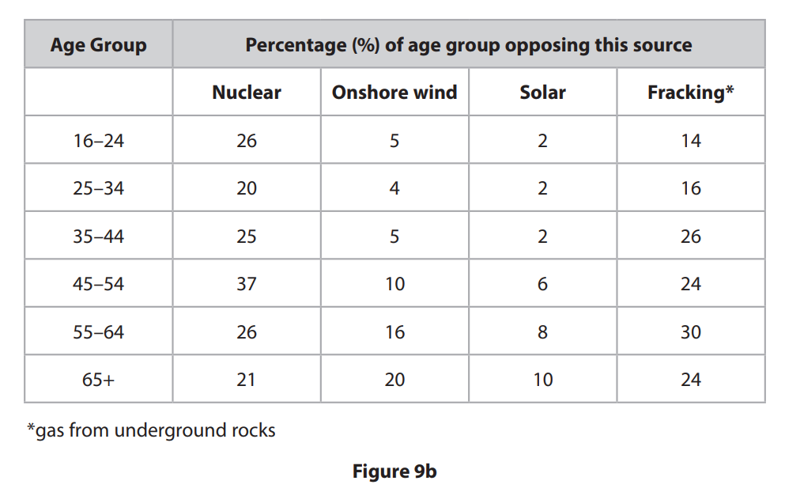
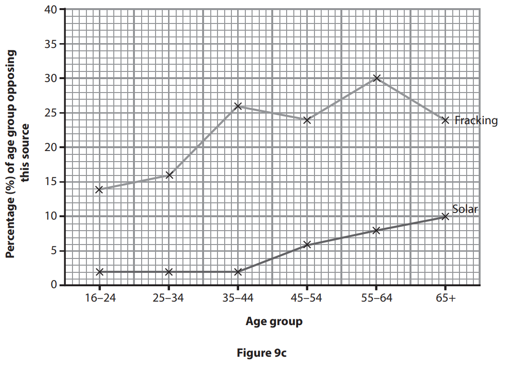
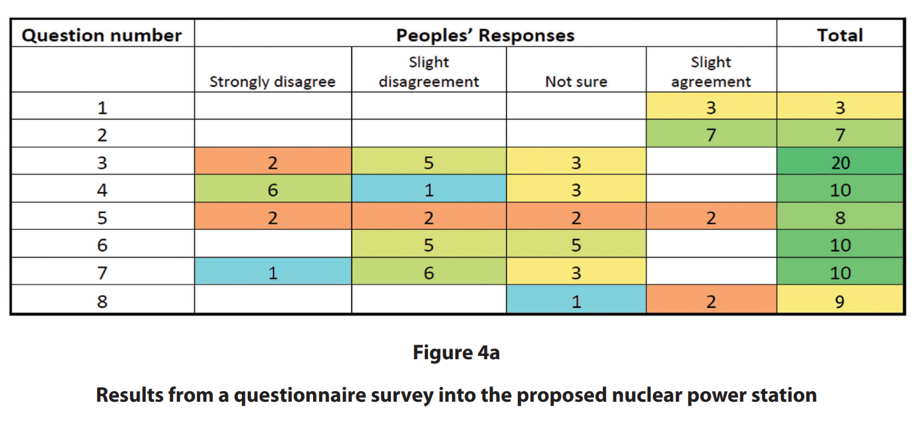
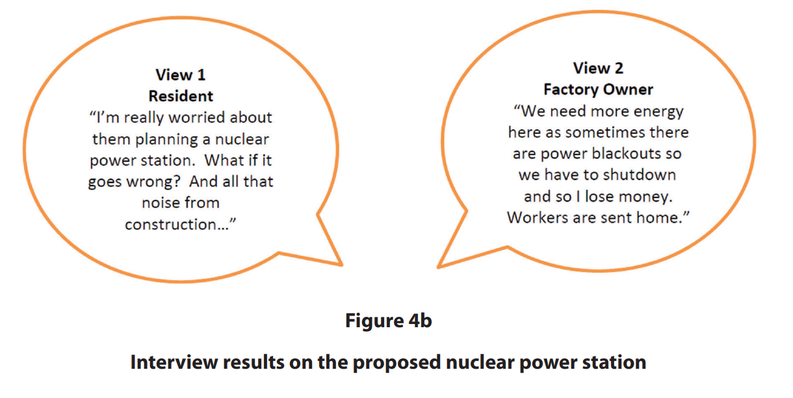

# Exam Questions — Economic Activity & Energy Practical Skills
**Economic Activity & Energy Fieldwork** · Edexcel IGCSE Geography (4GE1)
> Source: [https://www.savemyexams.com/igcse/geography/edexcel/19/topic-questions/13-economic-activity-and-energy-fieldwork/13-1-economic-activity-and-energy-practical-skills/exam-questions/](https://www.savemyexams.com/igcse/geography/edexcel/19/topic-questions/13-economic-activity-and-energy-fieldwork/13-1-economic-activity-and-energy-practical-skills/exam-questions/) · 11 questions · total 46 marks

## Q1 — easy — 3 marks · exam-questions

### 9() — 1 mark — multiple_choice — from paper June 2017 · 4GE1/01
Study Figure 9a which shows a student using a questionnaire to collect opinions on energy sources.

How is the student collecting opinions?

- **A.** Going to homes and asking people to complete a questionnaire.
- **B.** Creating an online questionnaire.
- **C.** Stopping people in the street to complete a questionnaire.
- **D.** Sending a questionnaire by post.

### 9() — 2 marks — command: identify — structured — from paper June 2017 · 4GE1/01
Identify **two** health and safety risks of carrying out fieldwork in urban locations.

## Q2 — easy — 3 marks · exam-questions

### 4() — 1 mark — command: state — structured — from paper June 2019 · 4GE1/02
You have studied economic activity and energy as part of your own geographical enquiry.

State the title of your geographical enquiry

State one type of sampling you used in your geographical enquiry.

### 4((b)) — 2 marks — command: explain — structured — from paper June 2019 · 4GE1/02
Explain **one** way you managed a risk associated with your primary data collection.

## Q3 — easy — 2 marks · exam-questions

### 9() — 2 marks — command: suggest — structured — from paper June 2018 · 4GE1/01
Study Figure 9 which was produced by a group of students as part of their investigation of the location of **either** factories or services.

Suggest **one** possible aim of this investigation.

## Q4 — easy — 1 marks · exam-questions

### 1() — 1 mark — command: state — structured
A group of students has undertaken an enquiry that investigated how energy use is changing in Thornfield, a small market town in northern England.

They wanted to find out whether renewable energy adoption was increasing across different parts of the town.

State **one** type of sampling that the students could have used to select their data collection sites.

## Q5 — easy — 3 marks · exam-questions

### 1() — 3 marks — command: explain — structured
The students visited five sites in the small market town of Thornfield and recorded the number of solar panels visible on buildings.

Explain **one **risk that the students may have faced during their fieldwork in Thornfield, and describe how they could have managed it.

## Q6 — easy — 2 marks · exam-questions

### 1() — 2 marks — command: explain — structured
The students visited five sites and recorded the number of solar panels visible on buildings. They also completed an environmental quality survey (EQS) at each site, scoring each location out of 10, where 10 represents the highest environmental quality.

**Figure 1: **Solar panel count and environmental quality scores across five sites in Thornfield

| Site | Location type | Number of solar panels recorded | Environmental quality score (out of 10) |
|---|---|---|---|
| 1 | Town centre | 3 | 4 |
| 2 | Inner suburb | 8 | 6 |
| 3 | Outer suburb | 19 | 8 |
| 4 | Rural fringe | 24 | 9 |
| 5 | Industrial area | 1 | 3 |

Using **Figure 1,** explain **one **way the students could have used secondary data to support their enquiry into changing energy use in Thornfield.

## Q7 — medium — 4 marks · exam-questions

### 9() — 4 marks — command: describe — structured — from paper June 2018 · 4GE1/01
Study Figure 9 which was produced by a group of students as part of their investigation of the location of **either** factories or services.

Describe two sources of secondary information that might have been useful as part of the pre-fieldwork and planning stage.

## Q8 — medium — 4 marks · exam-questions

### 9() — 4 marks — command: suggest — structured — from paper June 2018 · 4GE1/01
Suggest what factors students might consider in undertaking a risk assessment at **either** a factory **or** services location

## Q9 — hard — 8 marks · exam-questions

### 9() — 8 marks — command: what — structured — from paper June 2017 · 4GE1/01
What conclusions can be reached from an analysis of Figures 9b and 9c?

## Q10 — hard — 8 marks · exam-questions

### 4((e)) — 8 marks — command: evaluate — structured — from paper June 2019 · 4GE1/02R
Study Figures 4a and 4b. They show two different data presentation techniques from a student’s fieldwork into energy use.

"The aim of the student’s investigation was to identify attitudes towards the plans for a new nuclear power station in north-west India." The student carried out two different types of surveys into people’s opinions and attitudes towards the proposed energy development.

Evaluate the student’s data presentation techniques.

## Q11 — hard — 8 marks · exam-questions

### 9() — 8 marks — command: describe — structured — from paper June 2018 · 4GE1/01
Study Figure 9 which was produced by a group of students as part of their investigation of the location of **either** factories or services.

Describe the use of equipment and the field techniques that might have been used when collecting information in this type of investigation.

Equipment

Field techniques
