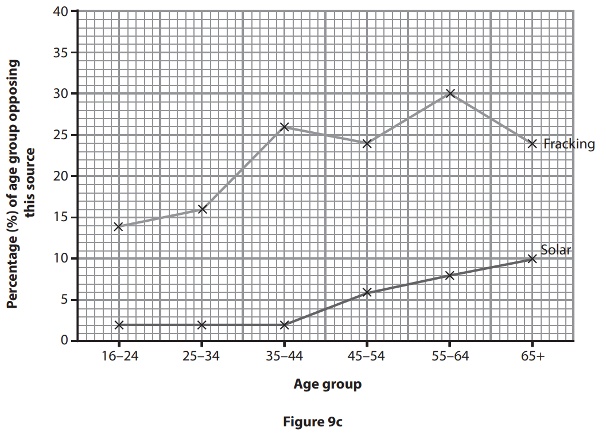
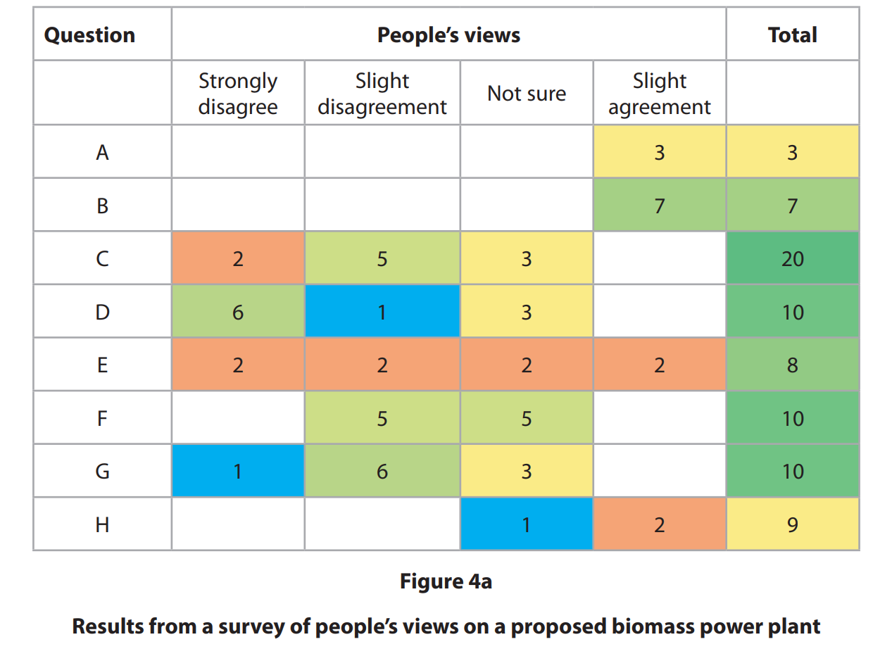
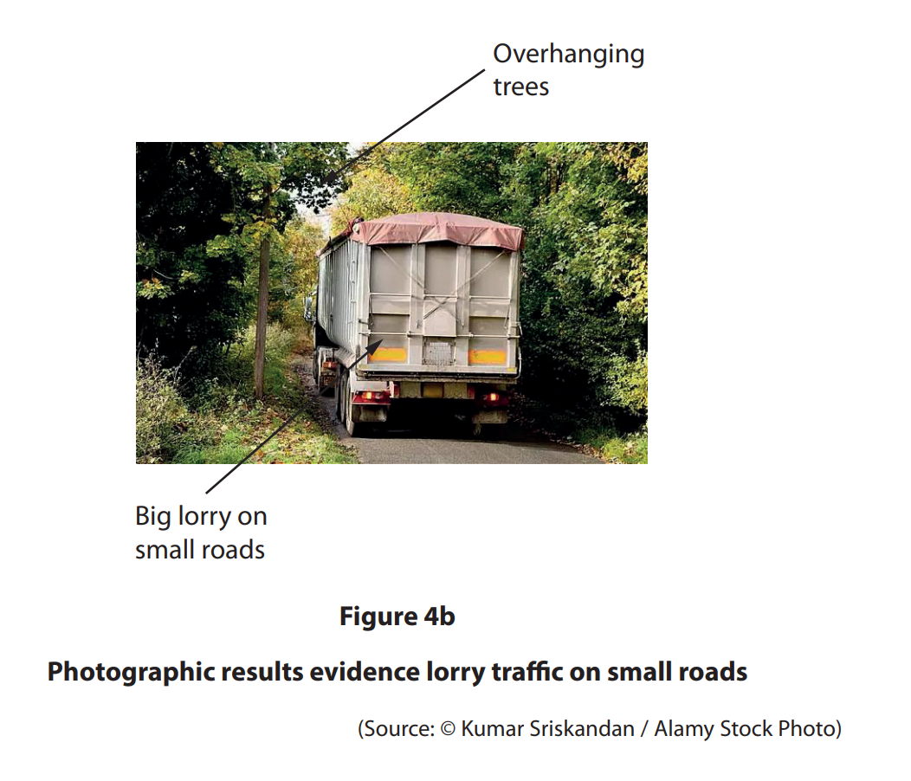
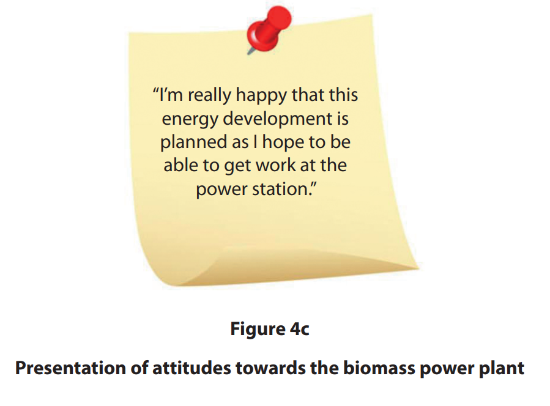

# Exam Questions — Economic Activity & Energy Enquiry Skills
**Economic Activity & Energy Fieldwork** · Edexcel IGCSE Geography (4GE1)
> Source: [https://www.savemyexams.com/igcse/geography/edexcel/19/topic-questions/13-economic-activity-and-energy-fieldwork/13-2-economic-activity-and-energy-enquiry-skills/exam-questions/](https://www.savemyexams.com/igcse/geography/edexcel/19/topic-questions/13-economic-activity-and-energy-fieldwork/13-2-economic-activity-and-energy-enquiry-skills/exam-questions/) · 13 questions · total 65 marks

## Q1 — easy — 2 marks · exam-questions

### 4((b)) — 2 marks — command: explain — structured — from paper June 2019 · 4GE1/02R
State the title of your geographical enquiry.

Explain **one** reason why this title was suitable for your geographical enquiry.

## Q2 — easy — 3 marks · exam-questions

### 4() — 3 marks — command: multiple — structured — from paper June 2019 · 4GE1/02R
You have studied economic activity and energy as part of your own geographical enquiry.

(i) State  **one **type of secondary data you used in your geographical enquiry.

(1)

(ii)  Explain** one** way this secondary data helped you when  investigating energy.

(2)

## Q3 — easy — 4 marks · exam-questions

### 9() — 4 marks — command: complete — structured — from paper June 2017 · 4GE1/01
Study Figure 9b which shows some results of a survey about the use of four energy sources.

| **Age Group** | **Percentage (%) of age**  **group opposing this source** |   |   |   |
|---|---|---|---|---|
|   | **Nuclear ** | **Onshore **  **wind ** | **Solar** | **Fracking*** |
| 16-24 | 26 | 5 | 2 | 14 |
| 25–34 | 20 | 4 | 2 | 16 |
| 35–44 | 25 | 5 | 2 | 26 |
| 45–54 | 37 | 10 | 6 | 24 |
| 55–64 | 26 | 16 | 8 | 30 |
| 65+ | 21 | 20 | 10 | 24 |

*gas from underground rocks

**Figure 9b **

Complete Figure 9c by representing the data for nuclear and onshore winds

## Q4 — easy — 2 marks · exam-questions

### 1() — 2 marks — command: describe — structured
The students visited five sites and recorded the number of solar panels visible on buildings. They also completed an environmental quality survey (EQS) at each site, scoring each location out of 10, where 10 represents the highest environmental quality.

Using **Figure 1**, describe the relationship between the number of solar panels recorded and the environmental quality score.

| Site | Location type | Number of solar panels recorded | Environmental quality score (out of 10) |
|---|---|---|---|
| 1 | Town centre | 3 | 4 |
| 2 | Inner suburb | 8 | 6 |
| 3 | Outer suburb | 19 | 8 |
| 4 | Rural fringe | 24 | 9 |
| 5 | Industrial area | 1 | 3 |

**Figure 1: **Solar panel count and environmental quality scores across five sites in Thornfield

## Q5 — medium — 10 marks · exam-questions

### 9() — 4 marks — command: describe — structured — from paper June 2017 · 4GE1/01
Describe the factors to be considered in preparing a questionnaire.

### 9() — 6 marks — command: multiple — structured — from paper June 2017 · 4GE1/01
(i) Study Figure 9b which shows some results of a survey about the use of four energy sources.

Justify the technique used in Figure 9c to represent the results shown in Figure 9b.

| **Age Group** | **Percentage (%) of age**  **group opposing this source** |   |   |   |
|---|---|---|---|---|
|   | **Nuclear ** | **Onshore **  **wind ** | **Solar** | **Fracking*** |
| 16-24 | 26 | 5 | 2 | 14 |
| 25–34 | 20 | 4 | 2 | 16 |
| 35–44 | 25 | 5 | 2 | 26 |
| 45–54 | 37 | 10 | 6 | 24 |
| 55–64 | 26 | 16 | 8 | 30 |
| 65+ | 21 | 20 | 10 | 24 |

*gas from underground rocks

**Figure 9b **

(3)

(ii) Suggest additional information that might be collected to improve this investigation.

(3)

## Q6 — medium — 7 marks · exam-questions

### 9() — 7 marks — command: multiple — structured — from paper June 2018 · 4GE1/01
(i) Suggest** two** ways ICT might have been used in this type 
of investigation.

(4)

(ii) Outline **one** named quantitative technique might have been used to analyse the fieldwork information.

(3)

## Q7 — medium — 7 marks · exam-questions

### 4((c)) — 3 marks — command: draw — structured — from paper June 2019 · 4GE1/02
Draw an annotated sketch map or annotated diagram to show how you selected locations to collect your fieldwork data.

### 4((d)) — 4 marks — command: explain — structured — from paper June 2019 · 4GE1/02
Explain **two** limitations of the method that you used to collect **qualitative data**.

## Q8 — medium — 3 marks · exam-questions

### 4() — 3 marks — command: multiple — structured — from paper June 2019 · 4GE1/02R
You have studied economic activity and energy as part of your own geographical enquiry.

(i) State **one **type of secondary data you used in your geographical enquiry.

(1)

(ii) Explain** one** way this secondary data helped you when investigating energy.

(2)

## Q9 — medium — 3 marks · exam-questions

### 4((c)) — 3 marks — command: explain — structured — from paper June 2019 · 4GE1/02R
Explain **one** limitation of a method that you used to collect **quantitative data.**

## Q10 — medium — 4 marks · exam-questions

### 4((d)) — 4 marks — command: explain — structured — from paper June 2019 · 4GE1/02R
Explain **two** methods you used to analyse some of your fieldwork data.

- Method 1
- Method 2

## Q11 — medium — 4 marks · exam-questions

### 1() — 4 marks — command: explain — structured
Using **Figure 1,** explain **one **advantage and **one** disadvantage of presenting the solar panel data as a bar graph.

| Site | Location type | Number of solar panels recorded | Environmental quality score (out of 10) |
|---|---|---|---|
| 1 | Town centre | 3 | 4 |
| 2 | Inner suburb | 8 | 6 |
| 3 | Outer suburb | 19 | 8 |
| 4 | Rural fringe | 24 | 9 |
| 5 | Industrial area | 1 | 3 |

**Figure 1: **Solar panel count and environmental quality scores across five sites in Thornfield

## Q12 — hard — 8 marks · exam-questions

### 4((e)) — 8 marks — command: evaluate — structured — from paper June 2019 · 4GE1/02
Study Figures 4a, 4b and 4c . They show three different data presentation techniques from a student’s investigation into developing energy resources.

The aim of the student’s enquiry was to investigate the attitudes towards the plans for a new biomass power station in a rural part of Ireland.

The student used three different presentation techniques to help understand people’s opinions towards the proposed energy development.

Evaluate how effective the techniques were in presenting the data and information collected.

## Q13 — hard — 8 marks · exam-questions

### 1() — 8 marks — command: evaluate — structured
You have studied economic activity and energy as part of your own geographical enquiry.

**Evaluate** the reliability of the data you collected during your enquiry. In your answer, refer to both your **primary **and **secondary** **data**.

State the title of your geographical enquiry.
