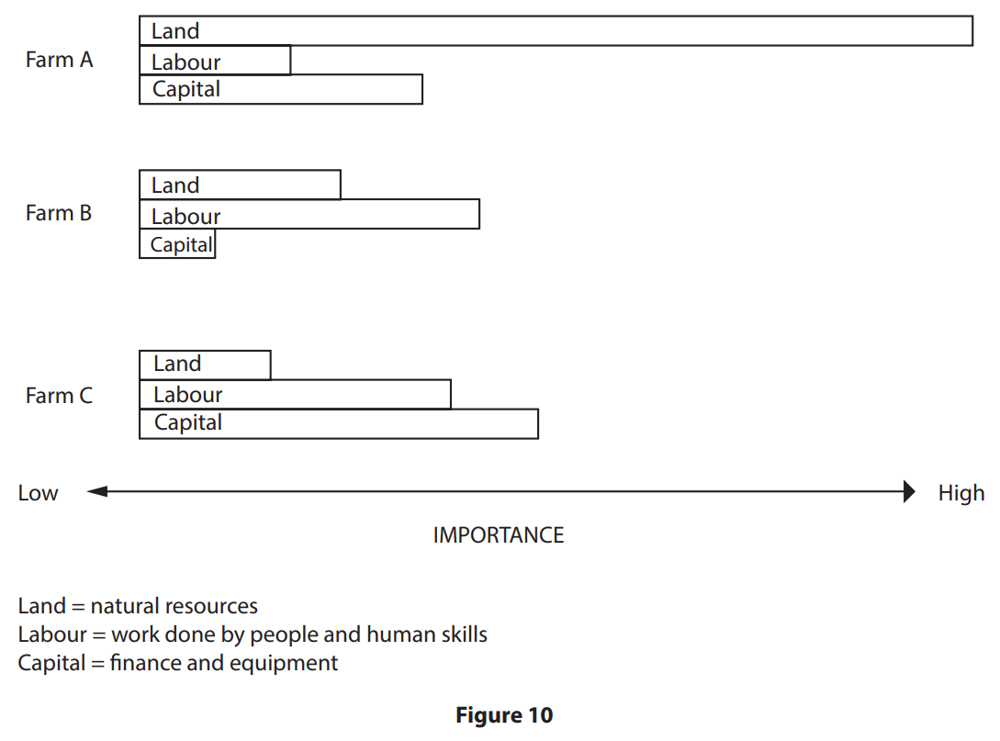

# Exam Questions — Rural Practical Skills
**Rural Fieldwork** · Edexcel IGCSE Geography (4GE1)
> Source: [https://www.savemyexams.com/igcse/geography/edexcel/19/topic-questions/14-rural-fieldwork/14-1-rural-practical-skills/exam-questions/](https://www.savemyexams.com/igcse/geography/edexcel/19/topic-questions/14-rural-fieldwork/14-1-rural-practical-skills/exam-questions/) · 10 questions · total 37 marks

## Q1 — easy — 2 marks · exam-questions

### 10((a)) — 2 marks — command: suggest — structured — from paper June 2018 · 4GE1/01
Study Figure 10 which was produced by a group of students as part of their investigation of three farm systems

Suggest one possible aim of this investigation.

## Q2 — easy — 5 marks · exam-questions

### 5((a)) — 3 marks — command: multiple — structured — from paper June 2019 · 4GE1/02
You have studied rural environments as part of your own geographical enquiry. State the title of your geographical enquiry.

(i) State **one** type of sampling you used in your geographical 
enquiry.

(1)

(ii) Explain **one **way this sampling technique helped you to collect reliable data or information

(2)

### 5((b)) — 2 marks — command: explain — structured — from paper June 2019 · 4GE1/02
Explain **one **way you managed a risk associated with your primary data collection

## Q3 — easy — 3 marks · exam-questions

### 5((a)) — 3 marks — command: multiple — structured — from paper June 2019 · 4GE1/02R
You have studied rural environments as part of your own geographical enquiry.

(i) State **one **type of secondary data you used in your 
geographical enquiry.

(1)

(ii) Explain **one** way this secondary data helped you when 
investigating rural environments.

(2)

## Q4 — easy — 1 marks · exam-questions

### 1() — 1 mark — command: state — structured
A group of geography students investigated how farming has changed in Ashdale, a rural landscape in the Yorkshire Dales.

They wanted to find out whether farming activity and land use had changed over time across different parts of the area.

State **one **type of sampling the students could have used to select their five data collection sites.

## Q5 — easy — 2 marks · exam-questions

### 1() — 2 marks — command: explain — structured
The students visited five farms in Ashdale, in the Yorkshire Dales, and recorded the dominant land use at each location.

Explain **one **way the students could have managed a risk during their fieldwork in Ashdale.

## Q6 — medium — 4 marks · exam-questions

### 10((a)) — 4 marks — command: describe — structured — from paper June 2018 · 4GE1/01
Study Figure 10 which was produced by a group of students as part of their investigation of three farm systems

Describe two sources of secondary information that might have been useful as part of the pre-fieldwork and planning stage.

## Q7 — medium — 6 marks · exam-questions

### 10((a)) — 4 marks — command: suggest — structured — from paper June 2018 · 4GE1/01
Study Figure 10 which was produced by a group of students as part of their investigation of three farm systems

Suggest what factors students might consider in undertaking a risk assessment on a farm location.

### 5((b)) — 2 marks — command: explain — structured — from paper June 2019 · 4GE1/02
Explain **one** way you managed a risk associated with your primary data collection.

## Q8 — medium — 3 marks · exam-questions

### 5((a)) — 3 marks — command: multiple — structured — from paper June 2019 · 4GE1/02
You have studied rural environments as part of your own geographical enquiry.  State the title of your geographical enquiry.

(i) State **one** type of sampling you used in your geographical enquiry.

(1)

(ii) Explain **one** way this sampling technique helped you to collect reliable data or information.

(2)

## Q9 — medium — 3 marks · exam-questions

### 5((a)) — 3 marks — command: multiple — structured — from paper June 2019 · 4GE1/02R
You have studied rural environments as part of your own geographical enquiry.

(i) State **one **type of secondary data you used in your 
geographical enquiry.

(1)

(ii) Explain **one** way this secondary data helped you when 
investigating rural environments.

(2)

## Q10 — hard — 8 marks · exam-questions

### 10((a)) — 8 marks — command: describe — structured — from paper June 2018 · 4GE1/01
Study Figure 10 which was produced by a group of students as part of their investigation of three farm systems

Describe the use of equipment and the field techniques that might have been used when collecting information in this type of investigation.

Equipment

Field techniques
