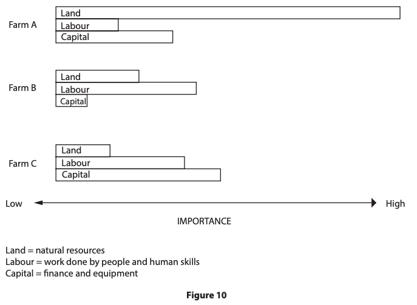
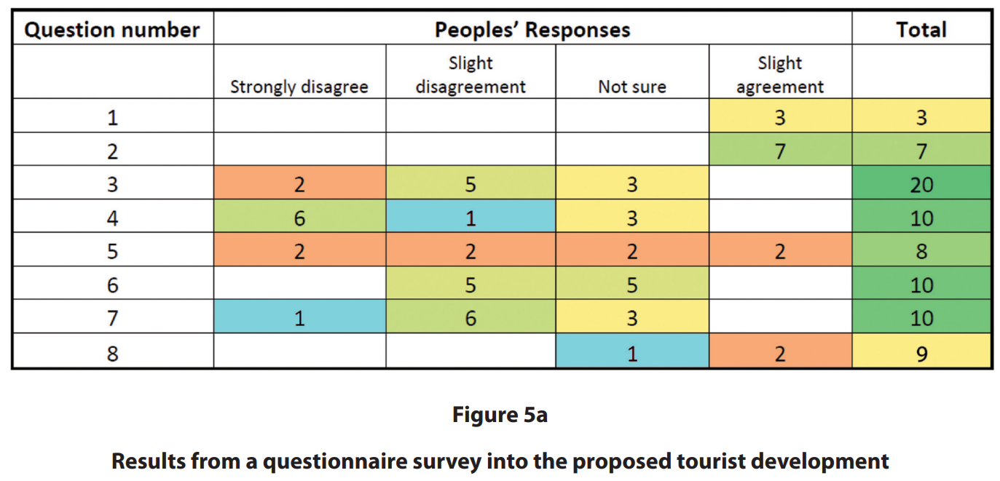
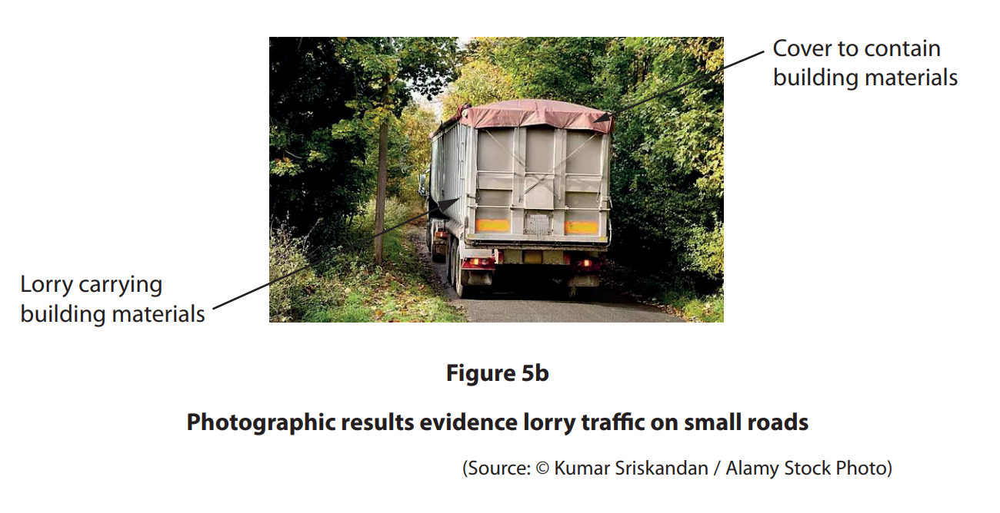
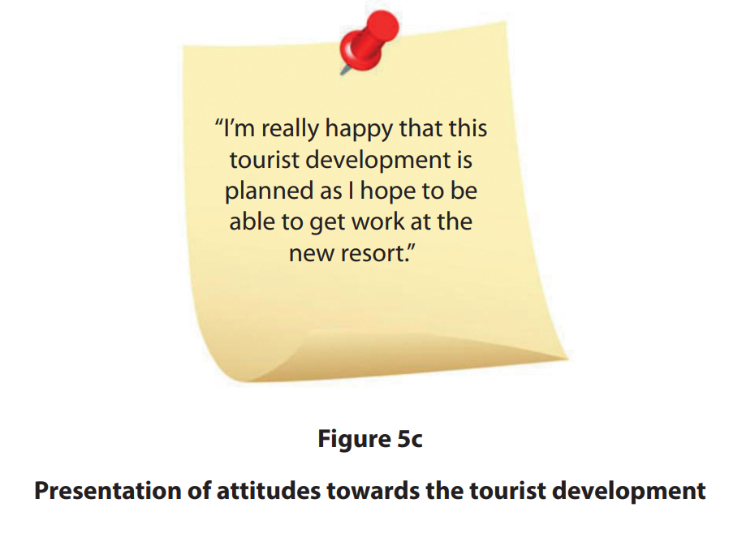
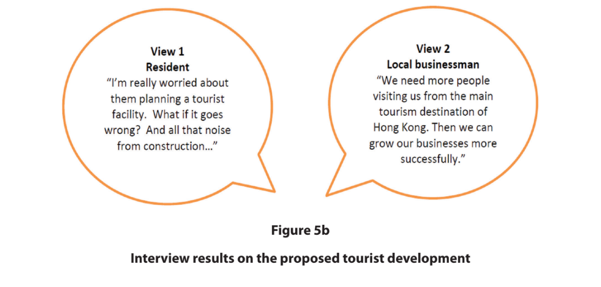

# Exam Questions — Rural Enquiry Skills
**Rural Fieldwork** · Edexcel IGCSE Geography (4GE1)
> Source: [https://www.savemyexams.com/igcse/geography/edexcel/19/topic-questions/14-rural-fieldwork/14-2-rural-enquiry-skills/exam-questions/](https://www.savemyexams.com/igcse/geography/edexcel/19/topic-questions/14-rural-fieldwork/14-2-rural-enquiry-skills/exam-questions/) · 12 questions · total 56 marks

## Q1 — easy — 2 marks · exam-questions

### 5((b)) — 2 marks — command: explain — structured — from paper June 2019 · 4GE1/02R
State the title of your geographical enquiry.

Explain one reason why this title was suitable for your geographical enquiry

## Q2 — easy — 3 marks · exam-questions

### 1() — 3 marks — command: explain — structured
The students visited five sites and recorded the dominant land use at each location. They also completed a landscape change score at each site, rating the evidence of farming change out of 10, where 10 represents the highest amount of observable change.

**Figure 1: **Dominant land use and landscape change scores across five sites in Ashdale

| Site | Location type | Dominant land use | Landscape change score (out of 10) |
|---|---|---|---|
| 1 | Valley floor | Arable farming | 8 |
| 2 | Lower hillside | Improved grassland | 6 |
| 3 | Upper hillside | Rough grazing | 3 |
| 4 | Moorland edge | Abandoned farmland | 7 |
| 5 | Village fringe | Residential development | 9 |

Using **Figure 1**, explain how the students could have used secondary data to support their enquiry into farming change in Ashdale.

## Q3 — easy — 2 marks · exam-questions

### 1() — 2 marks — command: describe — structured
The students visited five farms and recorded the dominant land use at each location. They also completed a landscape change score at each site, rating the evidence of farming change out of 10, where 10 represents the highest amount of observable change.

**Figure 1:** Dominant land use and landscape change scores across five sites in Ashdale

| Site | Location type | Dominant land use | Landscape change score (out of 10) |
|---|---|---|---|
| 1 | Valley floor | Arable farming | 8 |
| 2 | Lower hillside | Improved grassland | 6 |
| 3 | Upper hillside | Rough grazing | 3 |
| 4 | Moorland edge | Abandoned farmland | 7 |
| 5 | Village fringe | Residential development | 9 |

Using **Figure 1**, describe the pattern of landscape change scores across the five sites in Ashdale.

## Q4 — medium — 4 marks · exam-questions

### 10((a)) — 4 marks — command: suggest — structured — from paper June 2018 · 4GE1/01
Study Figure 10 which was produced by a group of students as part of their investigation of three farm systems

Suggest two ways ICT might have been used in this type of investigation.

## Q5 — medium — 3 marks · exam-questions

### 10((a)) — 3 marks — command: outline — structured — from paper June 2018 · 4GE1/01
Study Figure 10 which was produced by a group of students as part of their investigation of three farm systems

Outline one named quantitative technique might have been used to analyse the fieldwork information.

Named technique

## Q6 — medium — 7 marks · exam-questions

### 5((c)) — 3 marks — command: draw — structured — from paper June 2019 · 4GE1/02
Draw an annotated sketch map or annotated diagram to show how you selected locations to collect your fieldwork data.

### 5((d)) — 4 marks — command: explain — structured — from paper June 204GE1/02R19 · 4GE1/02R
Explain  two methods you used to analyse some of your fieldwork data.

Method 1    
Method 2

## Q7 — medium — 4 marks · exam-questions

### 5((d)) — 4 marks — command: explain — structured — from paper June 2019 · 4GE1/02
Explain two limitations of the method that you used to collect qualitative data.

## Q8 — medium — 3 marks · exam-questions

### 5((c)) — 3 marks — command: explain — structured — from paper June 2019 · 4GE1/02R
Explain one limitation of a method that you used to collect quantitative data.

## Q9 — medium — 4 marks · exam-questions

### 1() — 4 marks — command: explain — structured
Using **Figure 1**, explain **one advantage **and **one** **disadvantage **of presenting the landscape change score data as a pie chart.

| Site | Location type | Dominant land use | Landscape change score (out of 10) |
|---|---|---|---|
| 1 | Valley floor | Arable farming | 8 |
| 2 | Lower hillside | Improved grassland | 6 |
| 3 | Upper hillside | Rough grazing | 3 |
| 4 | Moorland edge | Abandoned farmland | 7 |
| 5 | Village fringe | Residential development | 9 |

**Figure 1: **Dominant land use and landscape change scores across five sites in Ashdale

## Q10 — hard — 8 marks · exam-questions

### 5((e)) — 8 marks — command: evaluate — structured — from paper June 2019 · 4GE1/02
Study Figures 5a, 5b and 5c . They show three different data presentation techniques from a student’s investigation into the changing use of rural environments. "The aim of the student’s enquiry was to investigate the attitudes towards the plans for a new tourist development in the New Territories, Hong Kong. The student used three different presentation techniques to help understand people’s opinions towards the proposed tourist development."

Evaluate how effective the techniques were in presenting the data and information collected.

## Q11 — hard — 8 marks · exam-questions

### 5((e)) — 8 marks — command: evaluate — structured — from paper June 2019 · 4GE1/02R
Study Figures 5a and 5b .  It shows two different data presentation techniques from a student’s fieldwork into the use of rural environments. The aim of the student’s investigation was to identify attitudes towards the plans for a new tourist development in the New Territories, Hong Kong. The student carried out two different types of surveys into people’s opinions and attitudes towards the proposed tourist development. Evaluate the student’s data presentation techniques.

## Q12 — hard — 8 marks · exam-questions

### 1() — 8 marks — command: evaluate — structured
You have studied rural environments as part of your own geographical enquiry.

Evaluate the reliability of the data you collected during your enquiry. In your answer, refer to both your primary and secondary data.

State the title of your geographical enquiry.
