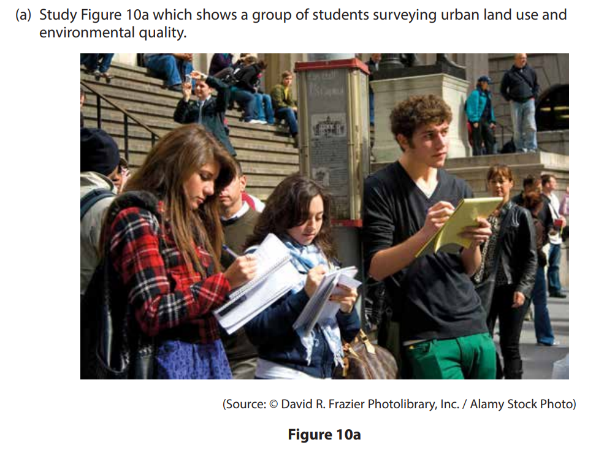

# Exam Questions — Urban Practical Skills
**Urban Fieldwork** · Edexcel IGCSE Geography (4GE1)
> Source: [https://www.savemyexams.com/igcse/geography/edexcel/19/topic-questions/15-urban-fieldwork/15-1-urban-practical-skills/exam-questions/](https://www.savemyexams.com/igcse/geography/edexcel/19/topic-questions/15-urban-fieldwork/15-1-urban-practical-skills/exam-questions/) · 8 questions · total 17 marks

## Q1 — easy — 1 marks · exam-questions

### 10((a)) — 1 mark — multiple_choice — from paper June 2017 · 4GE1/01
Study Figure 10a which shows a group of students surveying urban land use and environmental quality.

How are the students recording the information?

- **A.** by looking at photos
- **B.** by reading online articles
- **C.** by making notes outdoors
- **D.** by having phone interviews

## Q2 — easy — 2 marks · exam-questions

### 10((a)) — 2 marks — command: identify — structured — from paper June 2017 · 4GE1/01
Identify two health and safety risks for students carrying out fieldwork in urban locations.

## Q3 — easy — 2 marks · exam-questions

### 6((b)) — 2 marks — command: explain — structured — from paper June 2019 · 4GE1/02
Explain one way you managed a risk associated with your primary data collection.

## Q4 — easy — 3 marks · exam-questions

### 6((a)) — 3 marks — command: multiple — structured — from paper June 2019 · 4GE1/02
You have studied urban environments as part of your own geographical enquiry.  State the title of your geographical enquiry.

(i) State one type of sampling you used in your geographical enquiry.

(1)

(ii) Explain one way this sampling technique helped you to collect reliable data or information.

(2)

## Q5 — easy — 3 marks · exam-questions

### 6((a)) — 3 marks — command: multiple — structured — from paper June 2019 · 4GE1/02R
You have studied the use of central/inner urban environments as part of your own geographical enquiry.

(i) State one type of secondary data you used in your geographical enquiry.

(1)

(ii) Explain one way this secondary data helped you when investigating the use of central/inner urban environments.

(2)

## Q6 — easy — 1 marks · exam-questions

### 1() — 1 mark — command: state — structured
A group of geography students investigated how environmental quality changes across different zones of Millbrook, a medium-sized town in the East Midlands.

They wanted to find out whether environmental quality varied between the town centre and the outer suburbs.

State **one** type of sampling the students used to select their data collection sites.

## Q7 — easy — 2 marks · exam-questions

### 1() — 2 marks — command: explain — structured
The students visited five sites along a transect from the town centre outwards and completed an environmental quality survey (EQS) at each location, scoring each site out of 20, where 20 represents the highest environmental quality. They also recorded the percentage of buildings in a poor state of repair at each site.

**Figure 1: **Environmental quality scores and building condition across five sites in Millbrook

| Site | Location | EQS score (out of 20) | Percentage of buildings in poor repair (%) |
|---|---|---|---|
| 1 | Town centre (CBD) | 7 | 38 |
| 2 | Inner city | 9 | 29 |
| 3 | Inner suburb | 13 | 14 |
| 4 | Outer suburb | 17 | 6 |
| 5 | Rural fringe | 19 | 2 |

Explain **one **way the students could have used secondary data to support their enquiry into environmental quality change in Millbrook.

## Q8 — easy — 3 marks · exam-questions

### 1() — 3 marks — command: explain — structured
The students visited five sites along a transect from the town centre outwards and completed an environmental quality survey (EQS) at each location.

Explain **one **risk that the students may have faced during their fieldwork in Millbrook, and describe how they could have managed it.
