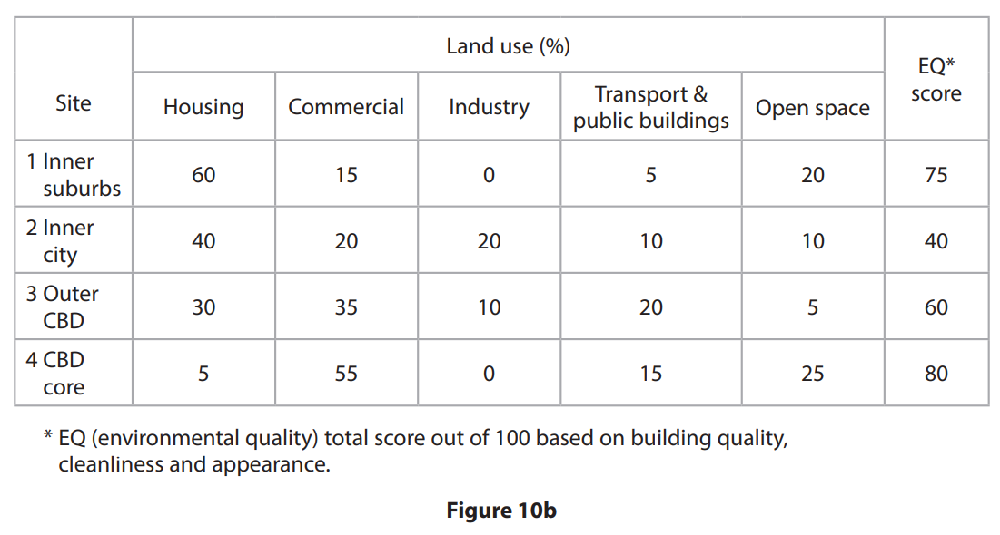
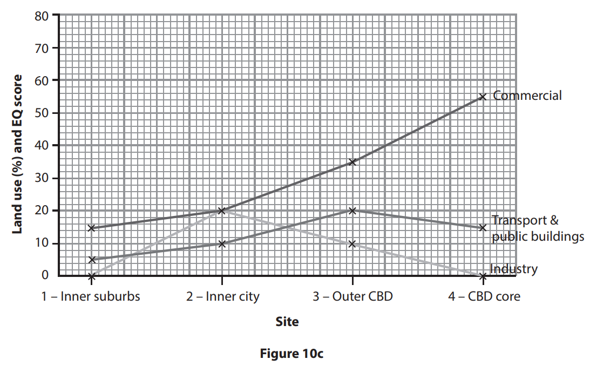

# Exam Questions — Urban Enquiry Skills
**Urban Fieldwork** · Edexcel IGCSE Geography (4GE1)
> Source: [https://www.savemyexams.com/igcse/geography/edexcel/19/topic-questions/15-urban-fieldwork/15-2-urban-enquiry-skills/exam-questions/](https://www.savemyexams.com/igcse/geography/edexcel/19/topic-questions/15-urban-fieldwork/15-2-urban-enquiry-skills/exam-questions/) · 10 questions · total 49 marks

## Q1 — easy — 4 marks · exam-questions

### 10((a)) — 4 marks — command: describe — structured — from paper June 2017 · 4GE1/01
Describe the factors to be considered in preparing a recording sheet for an environmental quality survey.

## Q2 — easy — 3 marks · exam-questions

### 6((c)) — 3 marks — command: draw — structured — from paper June 2019 · 4GE1/02
Draw an annotated sketch map or annotated diagram to show how you selected locations to collect your fieldwork data.

## Q3 — easy — 4 marks · exam-questions

### 6((d)) — 4 marks — command: explain — structured — from paper June 2019 · 4GE1/02
Explain two limitations of the method that you used to collect qualitative data.

## Q4 — easy — 2 marks · exam-questions

### 6((b)) — 2 marks — command: explain — structured — from paper June 2019 · 4GE1/02R
State the title of your geographical enquiry.

Explain **one **reason why this title was suitable for your geographical enquiry.

## Q5 — easy — 3 marks · exam-questions

### 6((c)) — 3 marks — command: explain — structured — from paper June 2019 · 4GE1/02R
Explain **one **limitation of a method that you used to collect quantitative data.

## Q6 — easy — 4 marks · exam-questions

### 6((d)) — 4 marks — command: explain — structured — from paper June 2019 · 4GE1/02R
Explain **two **methods you used to analyse some of your fieldwork data.

## Q7 — easy — 2 marks · exam-questions

### 1() — 2 marks — command: describe — structured
Using **Figure 1**, describe the relationship between the environmental quality score and the percentage of buildings in poor repair.

| Site | Location | EQS score (out of 20) | Percentage of buildings in poor repair (%) |
|---|---|---|---|
| 1 | Town centre (CBD) | 7 | 38 |
| 2 | Inner city | 9 | 29 |
| 3 | Inner suburb | 13 | 14 |
| 4 | Outer suburb | 17 | 6 |
| 5 | Rural fringe | 19 | 2 |

**Figure 1:** Environmental quality scores and building condition across five sites in Millbrook

## Q8 — medium — 15 marks · exam-questions

### 10((b)) — 15 marks — command: multiple — structured — from paper June 2017 · 4GE1/01
Study Figure 10b which shows some results of a survey into land use and environmental quality (EQ score) along an urban transect.

(i) Complete Figure 10c by representing the data for housing, open space and  EQ score.

(ii) Justify the technique used in Figure 10c to represent the results shown in Figure 10b.

(iii) What conclusions can be reached from an analysis of Figures 10b and 10c?

(iv) Suggest additional information that might be collected to improve this investigation.

## Q9 — medium — 4 marks · exam-questions

### 1() — 4 marks — command: explain — structured
**Figure 1:** Environmental quality scores and building condition across five sites in Millbrook

| Site | Location | EQS score (out of 20) | Percentage of buildings in poor repair (%) |
|---|---|---|---|
| 1 | Town centre (CBD) | 7 | 38 |
| 2 | Inner city | 9 | 29 |
| 3 | Inner suburb | 13 | 14 |
| 4 | Outer suburb | 17 | 6 |
| 5 | Rural fringe | 19 | 2 |

Using** Figure 1**, explain** one advantage **and **one disadvantage** of presenting the environmental quality score data as a line graph.

## Q10 — hard — 8 marks · exam-questions

### 1() — 8 marks — command: evaluate — structured
You have studied urban environments as part of your own geographical enquiry.

Evaluate the reliability of the data you collected during your enquiry. In your answer, refer to both your primary and secondary data.

State the title of your geographical enquiry.
