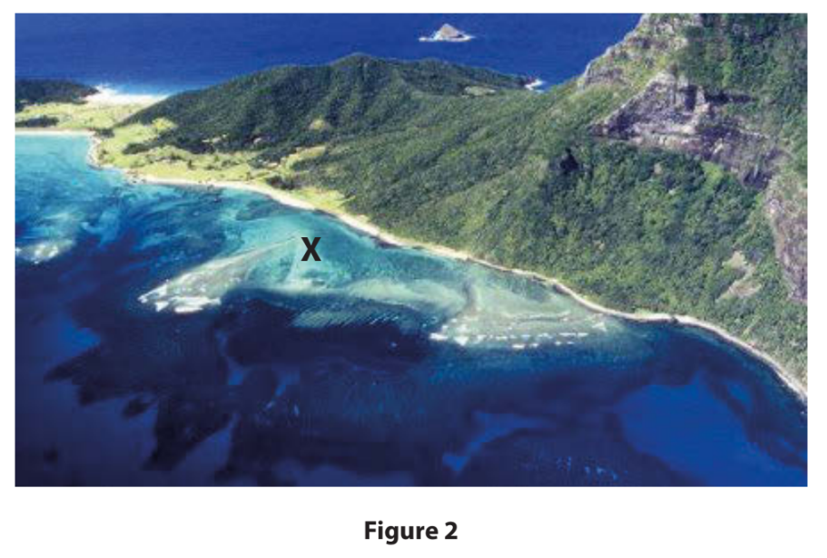
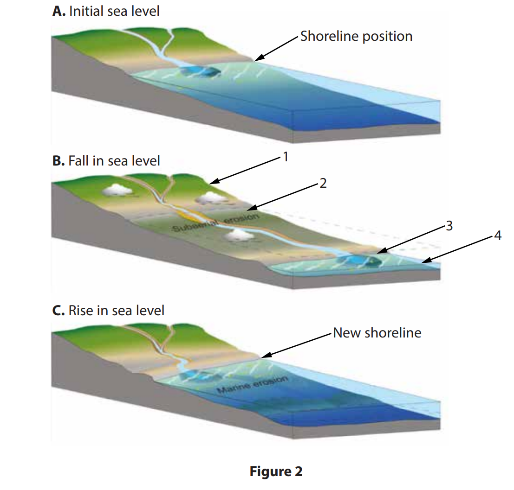
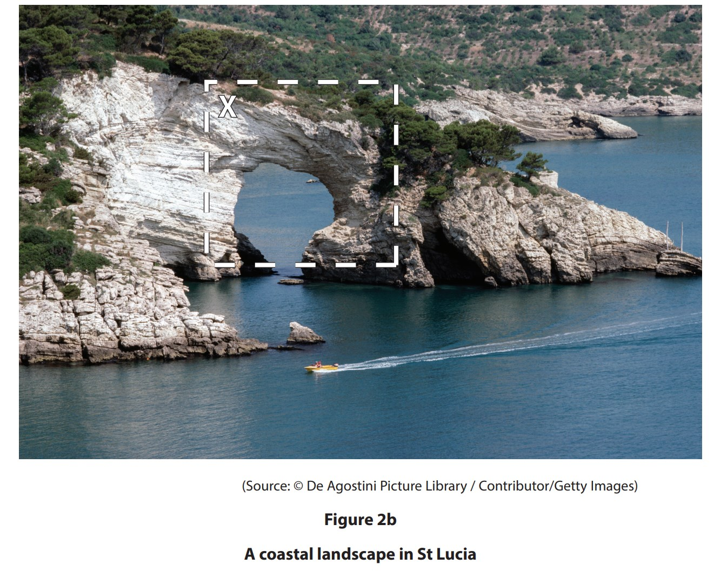
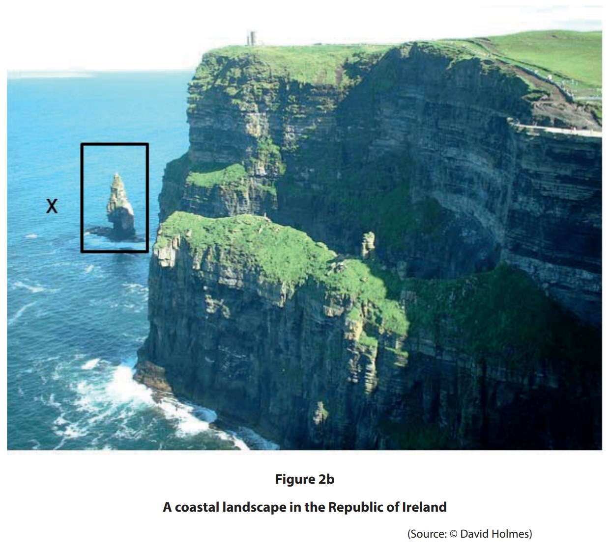
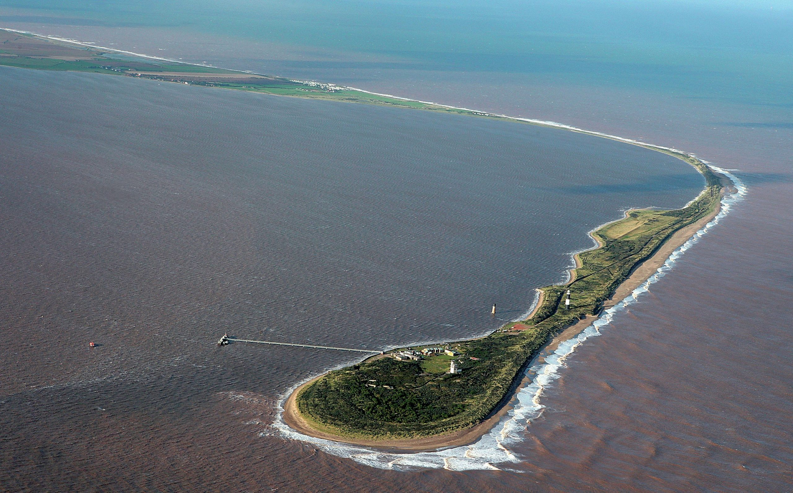
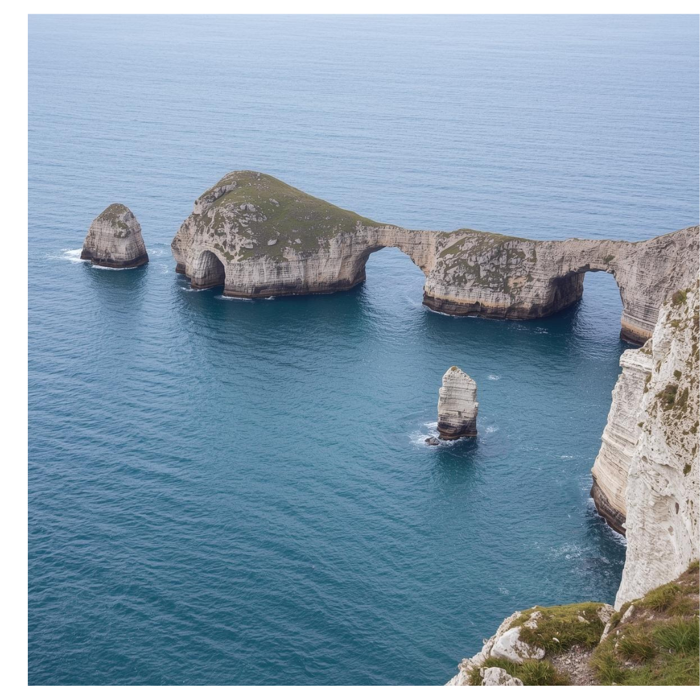
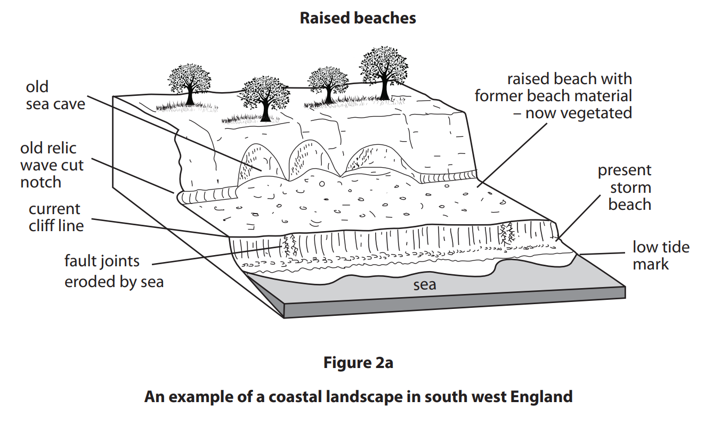
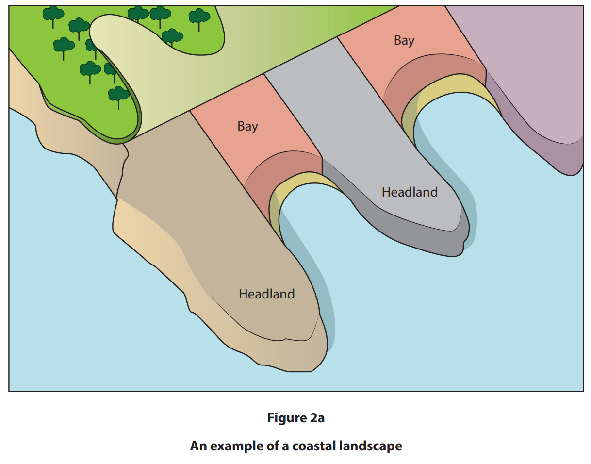
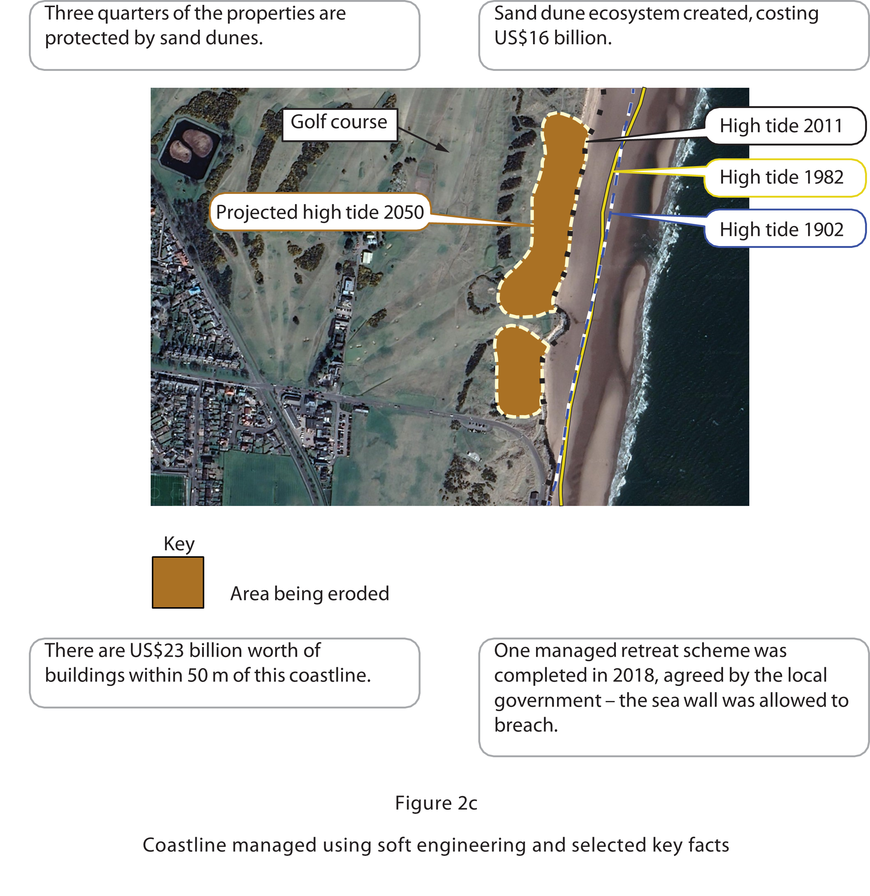

# Exam Questions — Coastal Processes & Landforms
**Coastal Environments** · Edexcel IGCSE Geography (4GE1)
> Source: [https://www.savemyexams.com/igcse/geography/edexcel/19/topic-questions/2-coastal-environments/2-1-coastal-processes-and-landforms/exam-questions/](https://www.savemyexams.com/igcse/geography/edexcel/19/topic-questions/2-coastal-environments/2-1-coastal-processes-and-landforms/exam-questions/) · 32 questions · total 104 marks

## Q1 — easy — 3 marks · exam-questions

### 2() — 2 marks — command: identify — structured — from paper June 2017 · 4GE1/01
Study Figure 2 which shows a stretch of tropical coastline.

Identify two other physical features of this coastline.

### 2() — 1 mark — command: suggest — structured — from paper June 2017 · 4GE1/01
Suggest one way in which vegetation can affect this coastline.

## Q2 — easy — 1 marks · exam-questions

### 2() — 1 mark — multiple_choice — from paper June 2018 · 4GE1/01
Study Figure 2 which shows a coastal area at three different times.

Identify where the new shoreline is in diagram B.
- **A.** 1
- **B.** 2
- **C.** 3
- **D.** 4

## Q3 — easy — 4 marks · exam-questions

### 2() — 2 marks — command: identify — structured — from paper June 2018 · 4GE1/01
Study Figure 2, which shows a coastal area at three different times.

Identify which of the two sea-level changes (in diagrams B or C) results in a loss of land.

### 2() — 2 marks — command: identify — structured — from paper June 2018 · 4GE1/01
Identify two impacts that a fall in sea level has on the coastal area.

## Q4 — easy — 1 marks · exam-questions

### 2((a)) — 1 mark — multiple_choice — from paper June 2019 · 4GE1/01
Identify the statement below that best describes the characteristics of a destructive wave.
- **A.** long wavelength and weak backwash
- **B.** short wavelength and strong backwash
- **C.** long wavelength and strong backwash
- **D.** short wavelength and weak backwash

## Q5 — easy — 1 marks · exam-questions

### 2() — 1 mark — multiple_choice — from paper June 2019 · 4GE1/01
Identify **one** erosional landform.
- **A.** spit
- **B.** cave
- **C.** bar
- **D.** beach

## Q6 — easy — 3 marks · exam-questions

### 2() — 1 mark — command: state — structured — from paper June 2019 · 4GE1/01
State **one **type of mass movement that affects coastal landscapes.

### 2() — 2 marks — command: explain — structured — from paper June 2019 · 4GE1/01
Explain one type of mechanical weathering that occurs at the coast.

## Q7 — easy — 1 marks · exam-questions

### 2((e)) — 1 mark — command: identify — structured — from paper June 2019 · 4GE1/01
Study Figure 2b below.

Identify the coastal landform at X.

## Q8 — easy — 1 marks · exam-questions

### 2((a)) — 1 mark — multiple_choice — from paper June 2019 · 4GE1/01R
Identify the statement below that best describes the characteristics of a constructive wave.
- **A.** long wavelength and  weak backwash
- **B.** short wavelength and strong backwash
- **C.** long wavelength and strong backwash
- **D.** short wavelength and weak backwash

## Q9 — easy — 1 marks · exam-questions

### 2() — 1 mark — multiple_choice — from paper June 2019 · 4GE1/01R
Identify  **one** depositional landform.
- **A.** headland
- **B.** spit
- **C.** cave
- **D.** stack

## Q10 — easy — 3 marks · exam-questions

### 2() — 1 mark — command: state — structured — from paper June 2019 · 4GE1/01R
State one type of weathering that affects coastal landscapes.

### 2() — 2 marks — command: explain — structured — from paper June 2019 · 4GE1/01R
Explain the process of longshore drift.

## Q11 — easy — 1 marks · exam-questions

### 2((e)) — 1 mark — command: identify — structured — from paper June 2019 · 4GE1/01R
Study Figure 2b below.

Identify the coastal landform **X**.

## Q12 — easy — 1 marks · exam-questions

### 2() — 1 mark — multiple_choice — from paper June 2024 · 4GE1/01
Identify the best definition of backwash.
- **A.** distance between two wave crests
- **B.** friction between wind and water surface
- **C.** movement of water down the beach
- **D.** movement of water up the beach

## Q13 — easy — 1 marks · exam-questions

### 2((a)) — 1 mark — multiple_choice — from paper June 2024 · 4GE1/01r
Identify the best definition of chemical weathering.
- **A.** acids in water dissolve rock
- **B.** movement of rock from one place to another
- **C.** plant roots burrow into cracks
- **D.** water freezing and thawing breaks rocks

## Q14 — easy — 1 marks · exam-questions

### 2() — 1 mark — multiple_choice — from paper June 2024 · 4GE1/01r
Identify one type of coastal mass movement.
- **A.** saltation
- **B.** slumping
- **C.** suspension
- **D.** traction

## Q15 — easy — 1 marks · exam-questions

### 1() — 1 mark — multiple_choice
Which of the following processes describes the force of waves compressing air in cracks in a cliff face, causing the rock to break apart?
- **A.** Abrasion
- **B.** Attrition
- **C.** Hydraulic action
- **D.** Solution

## Q16 — easy — 1 marks · exam-questions

### 1() — 1 mark — multiple_choice
Identify the coastal landform shown in **Figure 1.**

- **A.** Bar
- **B.** Beach
- **C.** Tombolo
- **D.** Spit

## Q17 — easy — 2 marks · exam-questions

### 1() — 2 marks — command: describe — structured
Describe **two **characteristics of a destructive wave.

## Q18 — easy — 2 marks · exam-questions

### 1() — 2 marks — command: explain — structured
Explain how a **spit **is formed.

## Q19 — easy — 3 marks · exam-questions

### 1() — 3 marks — command: explain — structured
Study **Figure 2**, a photograph showing a stretch of coastline.

Using** Figure 2**, describe the sequence of coastal landforms shown and explain how they were formed.

## Q20 — medium — 6 marks · exam-questions

### 2() — 2 marks — command: what — structured — from paper June 2017 · 4GE1/01
What is meant by the term **sea-level change**?

### 2() — 4 marks — command: outline — structured — from paper June 2017 · 4GE1/01
Outline **two** impacts that sea-level changes can have on coastlines.

## Q21 — medium — 4 marks · exam-questions

### 1() — 4 marks — command: explain — structured
Explain two different physical processes that operate along a coastline.

## Q22 — medium — 4 marks · exam-questions

### 2((c)) — 4 marks — command: suggest — structured — from paper June 2019 · 4GE1/01
Study Figure 2a in the Resource Booklet.

Suggest **two **ways changes in sea level have created coastal landforms.

## Q23 — medium — 4 marks · exam-questions

### 2((f)) — 4 marks — command: explain — structured — from paper June 2019 · 4GE1/01
Explain the formation of a headland.

## Q24 — medium — 4 marks · exam-questions

### 2((c)) — 4 marks — command: suggest — structured — from paper June 2019 · 4GE1/01R
Study Figure 2a below.

Suggest **two** ways geology influences the shape of this coastline.

## Q25 — medium — 4 marks · exam-questions

### 2((f)) — 4 marks — command: explain — structured — from paper June 2019 · 4GE1/01R
Explain the formation of a cliff.

## Q26 — medium — 4 marks · exam-questions

### 2((c)) — 4 marks — command: explain — structured — from paper Nov 2024 · 4GE1/01
Explain **two **processes of weathering in a coastal environment.

## Q27 — medium — 4 marks · exam-questions

### 2((f)) — 4 marks — command: explain — structured — from paper June 2024 · 4GE1/01
Explain **two** physical factors that affect coastal deposition.

## Q28 — hard — 8 marks · exam-questions

### 1() — 8 marks — command: assess — structured
Assess the relative importance of marine erosion and sub-aerial processes in the formation of coastal landforms.

## Q29 — hard — 8 marks · exam-questions

### 2((h)) — 8 marks — command: analyse — structured — from paper Nov 2024 · 4GE1/01
Study Figure 2c.

Analyse the reasons soft engineering may lead to conflict between different users of the coast.

## Q30 — hard — 8 marks · exam-questions

### 1() — 8 marks — command: assess — structured
Assess how geology affects the formation of headlands and bays.

## Q31 — hard — 6 marks · exam-questions

### 1() — 6 marks — command: assess — structured
Assess the importance of coastal ecosystems in protecting coastlines from erosion.

## Q32 — hard — 8 marks · exam-questions

### 1() — 8 marks — command: assess — structured
Assess the relative importance of marine erosion and sub-aerial processes in shaping coastal landforms.
