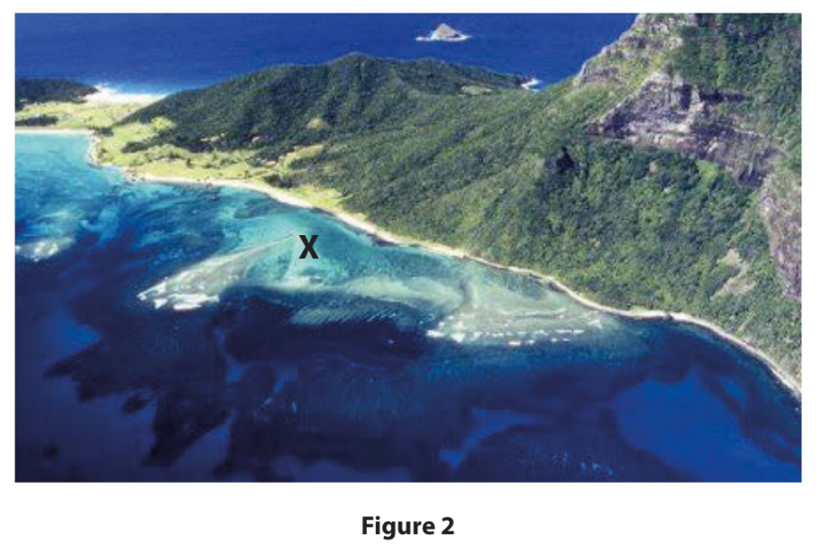
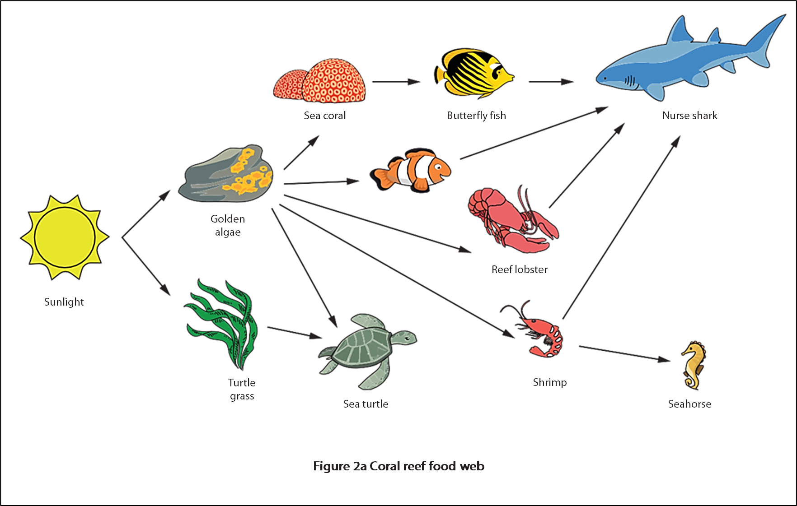
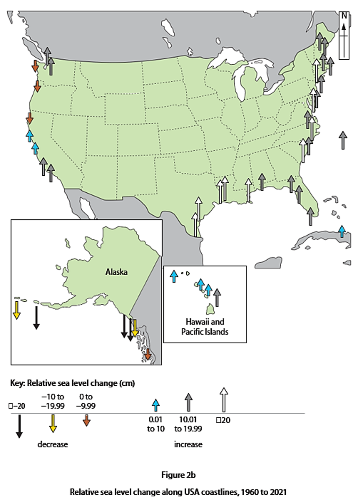

# Exam Questions — Ecosystems of the Coastline
**Coastal Environments** · Edexcel IGCSE Geography (4GE1)
> Source: [https://www.savemyexams.com/igcse/geography/edexcel/19/topic-questions/2-coastal-environments/2-2-ecosystems-of-the-coastline/exam-questions/](https://www.savemyexams.com/igcse/geography/edexcel/19/topic-questions/2-coastal-environments/2-2-ecosystems-of-the-coastline/exam-questions/) · 13 questions · total 38 marks

## Q1 — easy — 1 marks · exam-questions

### 2() — 1 mark — multiple_choice — from paper June 2017 · 4GE1/01
**Coastal environments**

Study Figure 2 which shows a stretch of tropical coastline.

Identify the coastal ecosystem at **X**.
- **A.** coral reef
- **B.** mangrove
- **C.** salt marsh
- **D.** sand dune

## Q2 — easy — 3 marks · exam-questions

### 2((d)) — 3 marks — command: explain — structured — from paper June 2019 · 4GE1/01
Explain **one **physical factor that influences the distribution of mangrove ecosystems.

## Q3 — easy — 3 marks · exam-questions

### 2((d)) — 3 marks — command: explain — structured — from paper June 2019 · 4GE1/01R
Explain  **one** physical factor that influences the distribution of coral reef ecosystems.

## Q4 — easy — 1 marks · exam-questions

### 2((d)) — 1 mark — command: identify — structured — from paper Nov 2024 · 4GE1/01
Identify the abiotic factor shown in the food web.

## Q5 — easy — 2 marks · exam-questions

### 2((e)) — 2 marks — command: explain — structured — from paper Nov 2024 · 4GE1/01
Explain **one** characteristic of a mangrove ecosystem.

## Q6 — easy — 1 marks · exam-questions

### 2() — 1 mark — command: define — structured — from paper Nov 2024 · 4GE1/01
Define the term mass movement.

## Q7 — easy — 3 marks · exam-questions

### 2((d)) — 3 marks — command: explain — structured — from paper June 2024 · 4GE1/01r
Explain one characteristic of a sand dune ecosystem.

## Q8 — medium — 6 marks · exam-questions

### 2() — 2 marks — command: what — structured — from paper June 2018 · 4GE1/01
What is meant by the term **ecosystem**?

### 2() — 4 marks — command: outline — structured — from paper June 2018 · 4GE1/01
Outline **two **physical factors affecting the distribution of coastal ecosystems.

## Q9 — medium — 4 marks · exam-questions

### 2((f)) — 4 marks — command: suggest — structured — from paper Nov 2024 · 4GE1/01
Study Figure 2b.

Suggest **two** impacts that sea level change may have had on this coastline.

You must refer to the resource in your answer.

## Q10 — medium — 4 marks · exam-questions

### 1() — 4 marks — command: explain — structured
Explain how coral reefs protect coastlines.

## Q11 — medium — 4 marks · exam-questions

### 1() — 4 marks — command: explain — structured
Explain how mangroves help reduce coastal flooding.

## Q12 — medium — 4 marks · exam-questions

### 1() — 4 marks — command: explain — structured
Explain **two **ways coastal ecosystems reduce erosion.

## Q13 — medium — 2 marks · exam-questions

### 2((c)) — 2 marks — command: explain — structured — from paper June 2023 · 4GE1/01
Explain **one **way human activity can threaten coastal ecosystems.
