# Exam Questions — Management of Coasts
**Coastal Environments** · Edexcel IGCSE Geography (4GE1)
> Source: [https://www.savemyexams.com/igcse/geography/edexcel/19/topic-questions/2-coastal-environments/2-3-management-of-coasts/exam-questions/](https://www.savemyexams.com/igcse/geography/edexcel/19/topic-questions/2-coastal-environments/2-3-management-of-coasts/exam-questions/) · 23 questions · total 112 marks

## Q1 — easy — 1 marks · exam-questions

### 1() — 1 mark — command: identify — structured
Identify one method of hard engineering.

## Q2 — easy — 2 marks · exam-questions

### 1() — 2 marks — command: explain — structured
Explain one disadvantage of using groynes.

## Q3 — easy — 3 marks · exam-questions

### 2((d)) — 3 marks — command: explain — structured — from paper June 2024 · 4GE1/01R
Explain why **one **conflict might occur between different users of coastlines.

## Q4 — easy — 1 marks · exam-questions

### 1() — 1 mark — command: state — structured
State **one** aim of coastal management.

## Q5 — easy — 2 marks · exam-questions

### 1() — 2 marks — command: explain — structured
Explain **one **advantage of using rock armour.

## Q6 — easy — 3 marks · exam-questions

### 2((g)) — 3 marks — command: explain — structured — from paper Nov  2024 · 4GE1/01
Explain **one **way building design can reduce the impact of coastal flooding.

## Q7 — easy — 3 marks · exam-questions

### 1() — 3 marks — command: explain — structured
Explain why rising sea levels increase the risk of coastal flooding.

## Q8 — easy — 1 marks · exam-questions

### 1() — 1 mark — command: identify — structured
Study **Figure 3**, a photograph showing coastal management schemes.

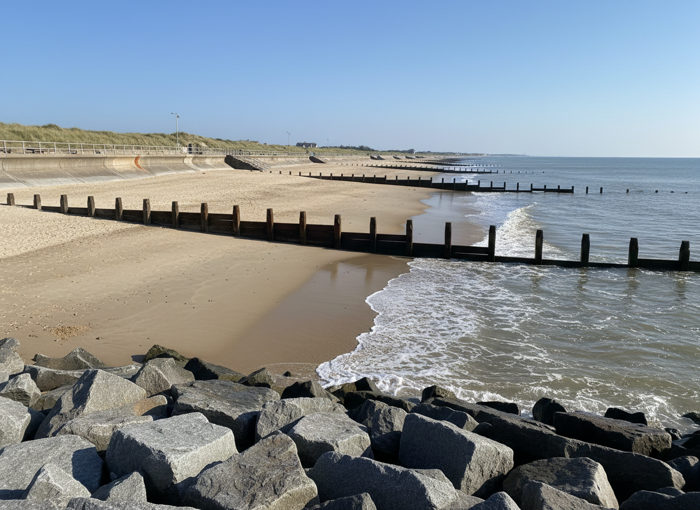

Identify **one **coastal management scheme shown in **Figure 3**.

## Q9 — medium — 4 marks · exam-questions

### 2((c)) — 4 marks — command: suggest — structured — from paper June 2024 · 4GE1/01
Study Figure 2a .

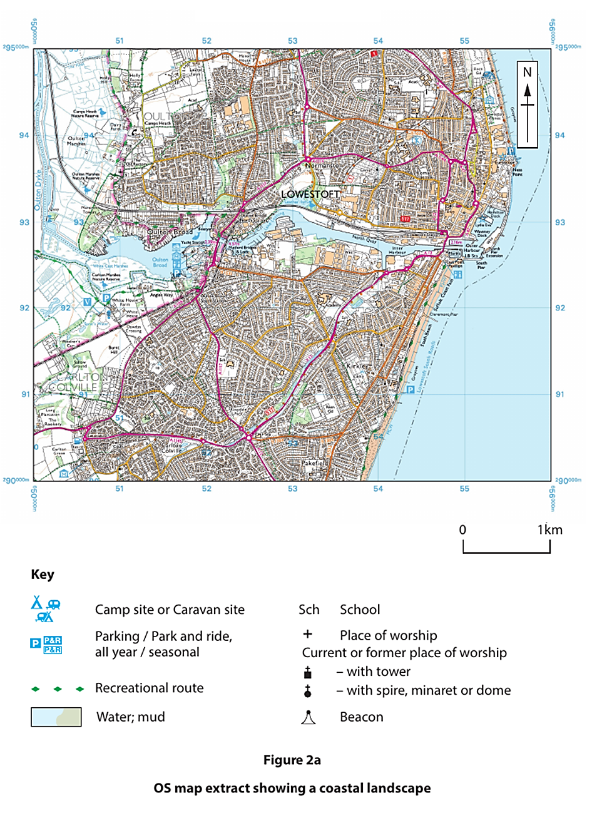

Suggest **two **reasons that hard engineering is suitable for this stretch of coastline.

## Q10 — medium — 4 marks · exam-questions

### 2((e)) — 4 marks — command: suggest — structured — from paper June 2024 · 4GE1/01r
Study Figure 2a  and  suggest **two **reasons soft engineering is suitable for this stretch of coastline.

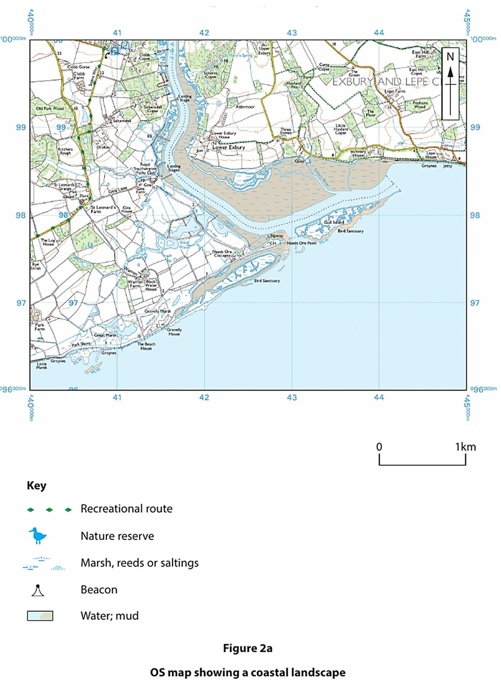

## Q11 — medium — 4 marks · exam-questions

### 2((g)) — 4 marks — command: explain — structured — from paper May  2023 · 4GE1/01
Explain **one** advantage and **one** disadvantage of soft engineering strategies.

## Q12 — medium — 4 marks · exam-questions

### 1() — 4 marks — command: compare — structured
Compare hard engineering and soft engineering methods used to manage coastal flooding.

## Q13 — medium — 4 marks · exam-questions

### 2((f)) — 4 marks — command: suggest — structured — from paper Nov 2024 · 4GE1/01
Study Figure 2b

Suggest **two **impacts sea level change may have had on this coastline.

You must refer to the resource in your answer.

## Q14 — medium — 4 marks · exam-questions

### 1() — 4 marks — command: explain — structured
Referring to a named coastal location you have studied, explain the physical and human causes of coastal erosion at that location.

## Q15 — hard — 8 marks · exam-questions

### 2((d)) — 8 marks — command: discuss — structured — from paper June 2017 · 4GE1/01
Discuss the conflicting views that affect the choice of management for **one **named stretch of coastline.

## Q16 — hard — 8 marks · exam-questions

### 2((g)) — 8 marks — command: analyse — structured — from paper June 2019 · 4GE1/01
Study Figure 2c and Figure 2d below.

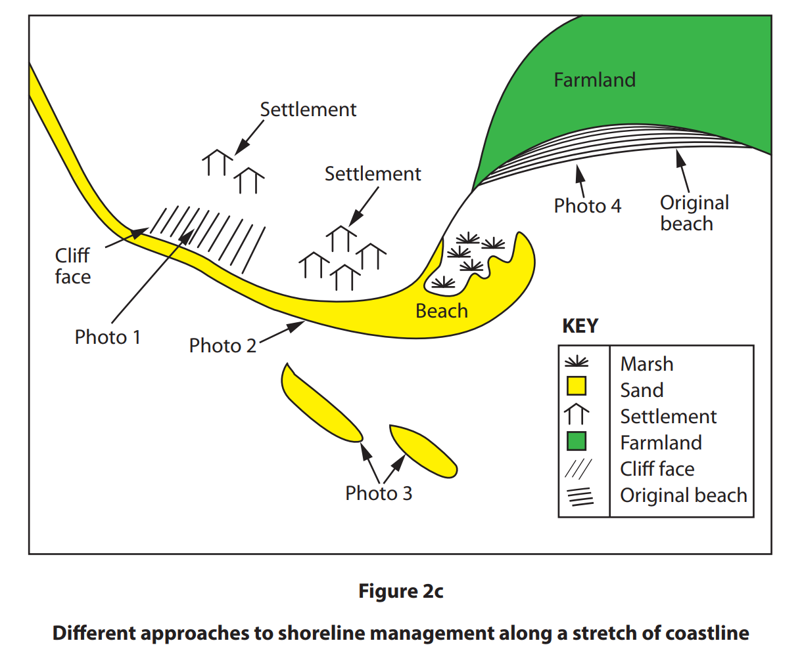

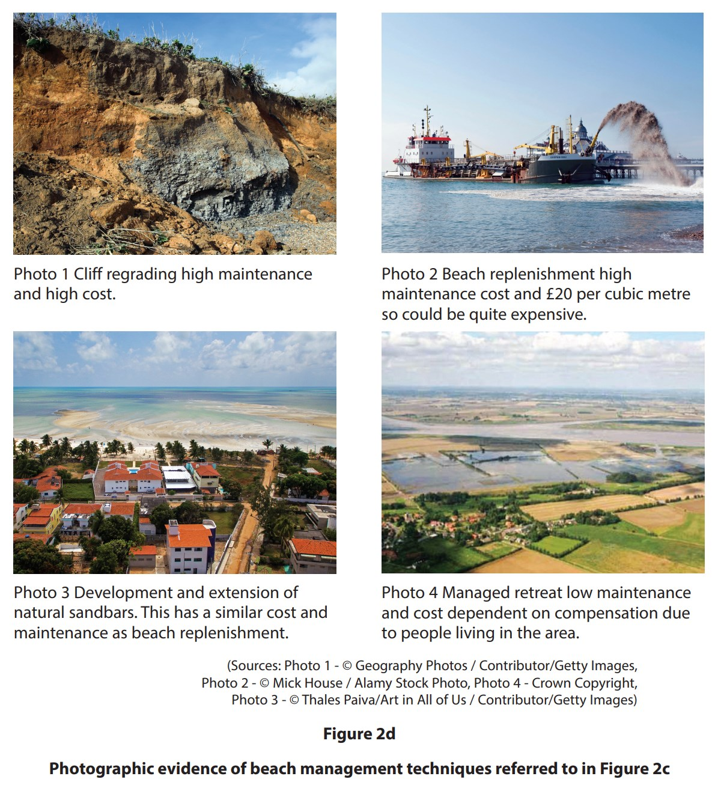

Analyse the reasons for the choice of different soft engineering strategies shown.

## Q17 — hard — 8 marks · exam-questions

### 2((g)) — 8 marks — command: analyse — structured — from paper June 2019 · 4GE1/01R
Study Figure 2c and Figure 2d below.

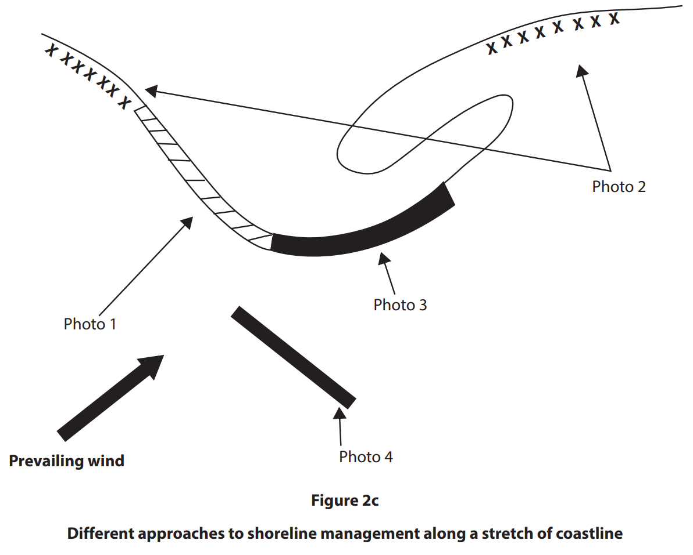

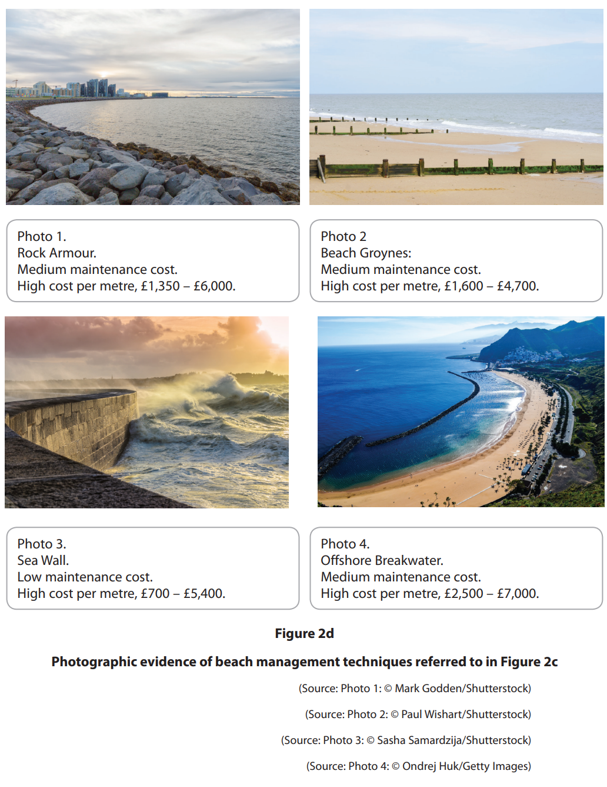

Analyse the reasons for the choice of the different hard engineering strategies shown.

## Q18 — hard — 8 marks · exam-questions

### 2((g)) — 8 marks — command: analyse — structured — from paper June 2024 · 4GE1/01R
Study Figure 2c

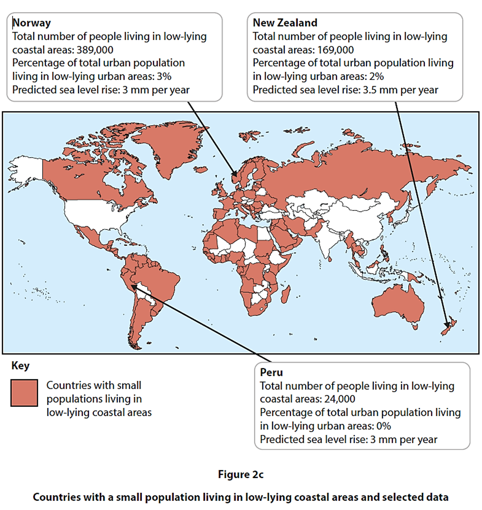

Analyse the possible reasons why the populations of some countries are less at risk from coastal flooding than others.

You must refer to the resource in your answer.

## Q19 — hard — 8 marks · exam-questions

### 1() — 8 marks — command: assess — structured
Assess the effectiveness of hard and soft engineering in managing coastal erosion.

## Q20 — hard — 8 marks · exam-questions

### 2((h)) — 8 marks — command: analyse — structured — from paper May 2023 · 4GE1/01
Study Figure 2c and Figure 2d.

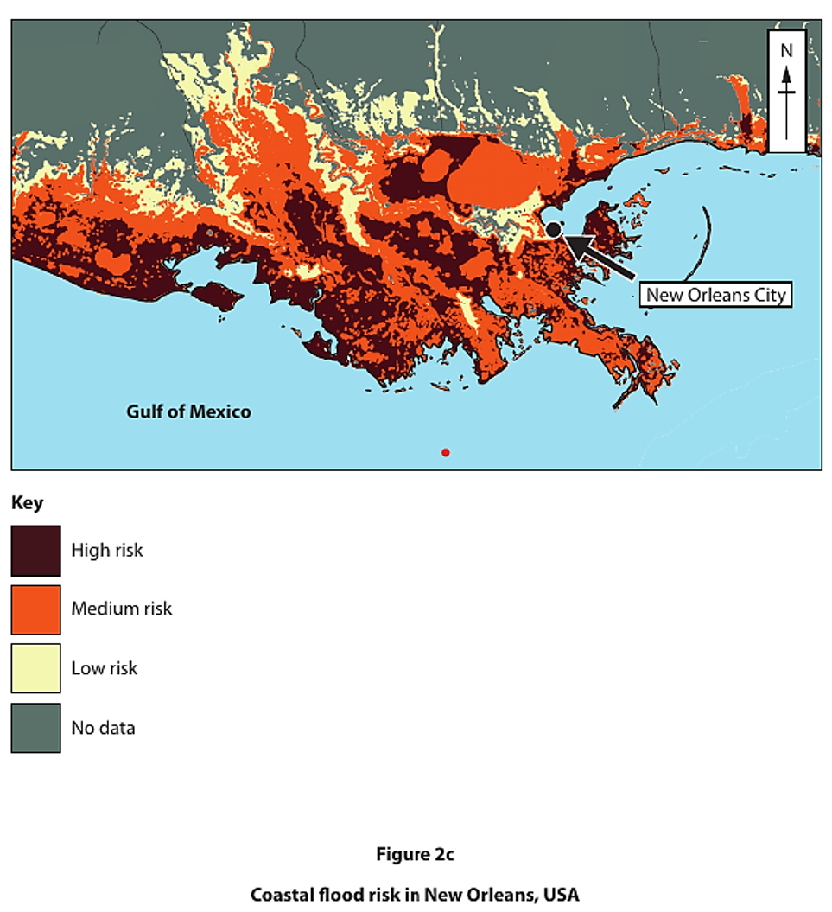

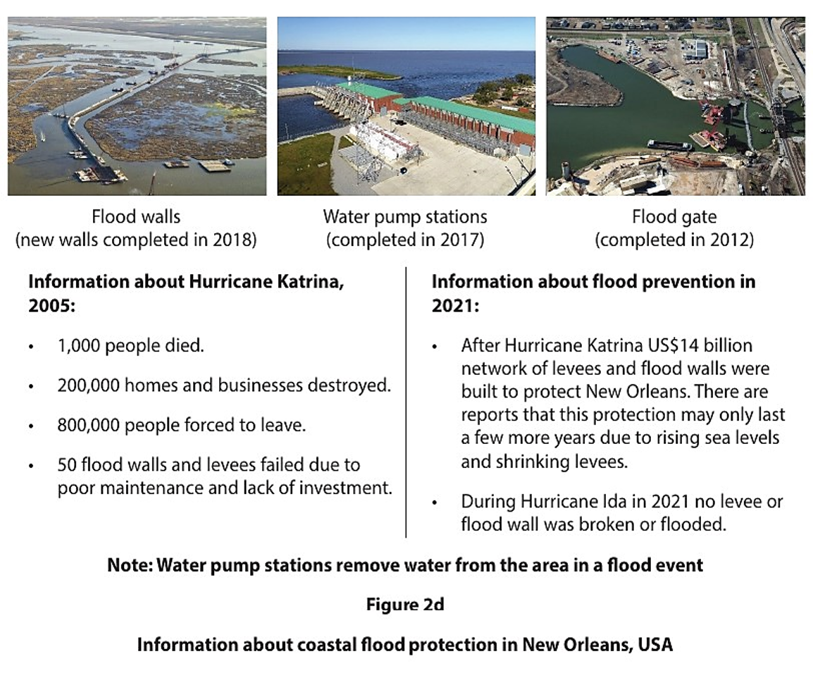

Analyse the effectiveness of the coastal flood prevention strategies shown.

Refer to the resources in your answer.

## Q21 — hard — 8 marks · exam-questions

### 2((g)) — 8 marks — command: analyse — structured — from paper May 2023 · 4GE1/01r
Study Figure 2c and Figure 2d.

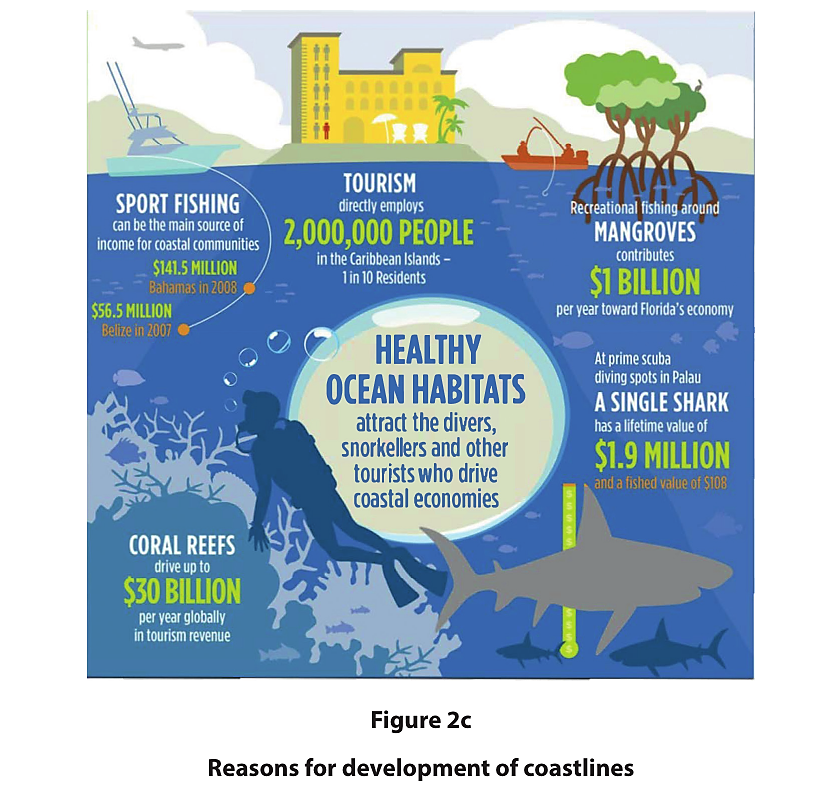

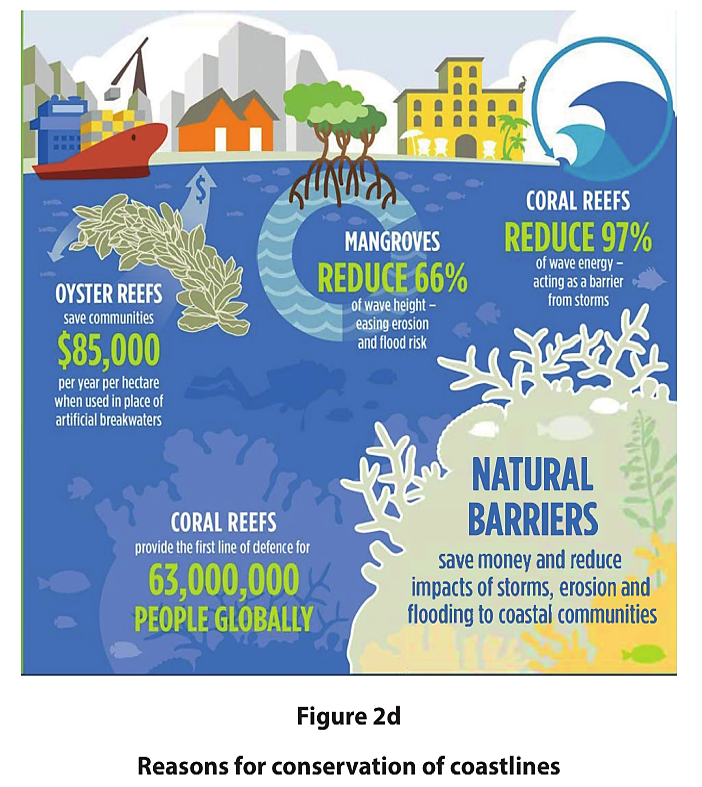

Analyse why conflicts between development and conservation occur in coastal areas.

Refer to the resources in your answer.

## Q22 — hard — 8 marks · exam-questions

### 1() — 8 marks — command: analyse — structured
Analyse the importance of conserving coastal ecosystems compared with developing coastal areas for economic gain.

## Q23 — hard — 8 marks · exam-questions

### 1() — 8 marks — command: analyse — structured
Using examples, analyse this statement.

'Hard engineering strategies are more effective than soft engineering strategies at protecting coastlines.'
