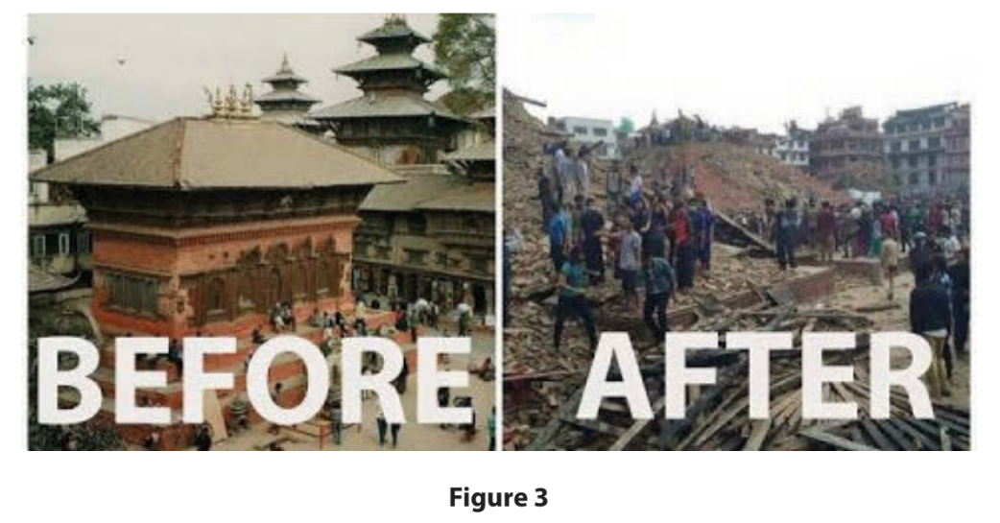
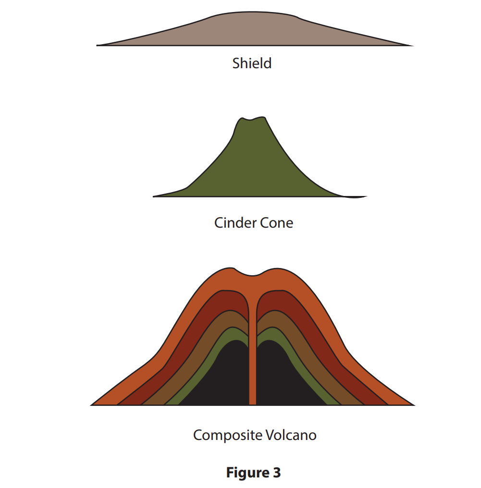
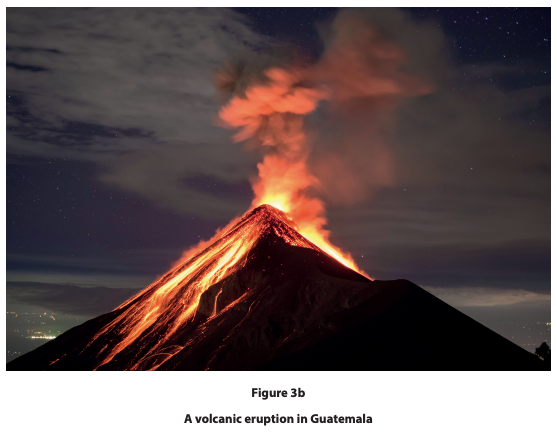
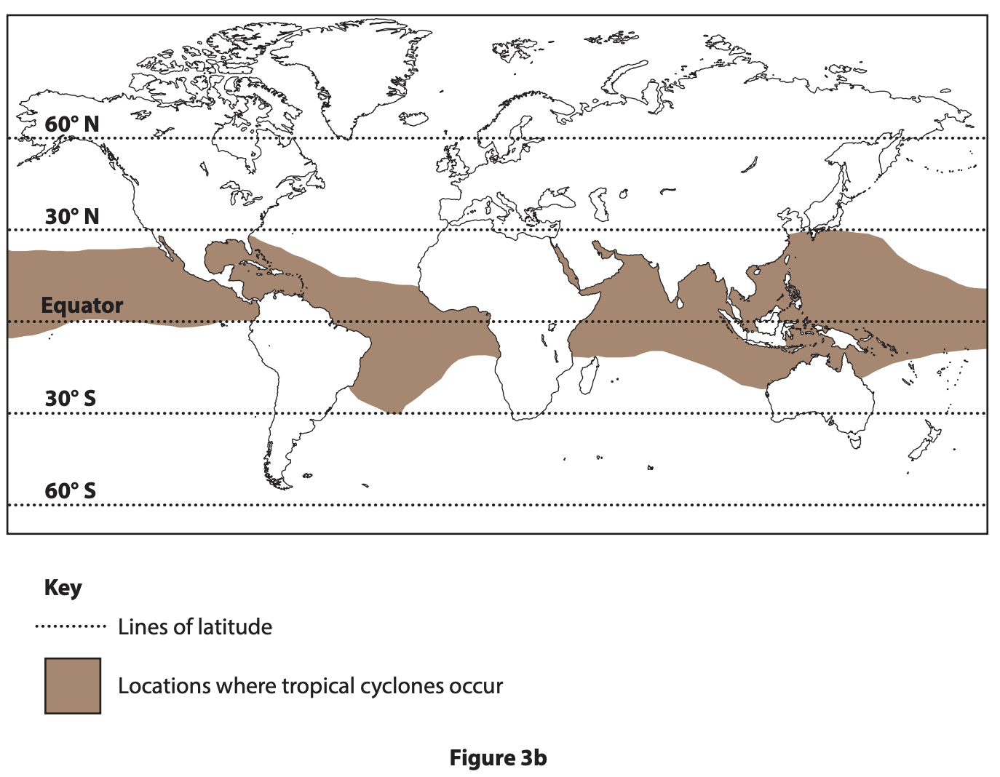
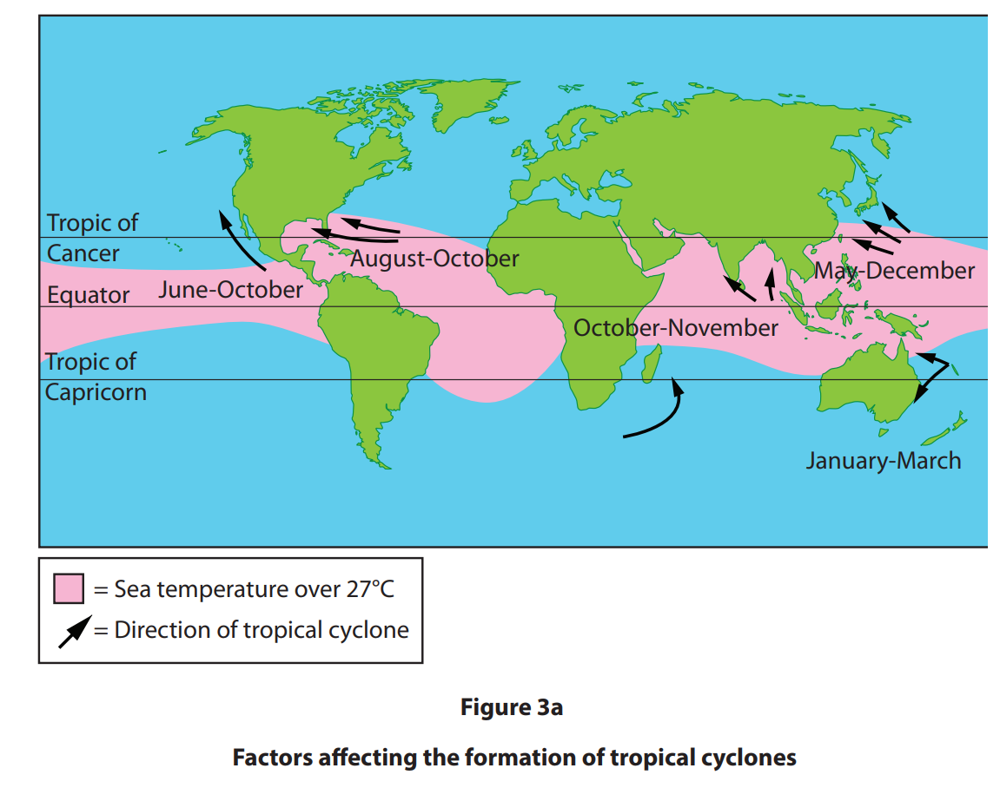
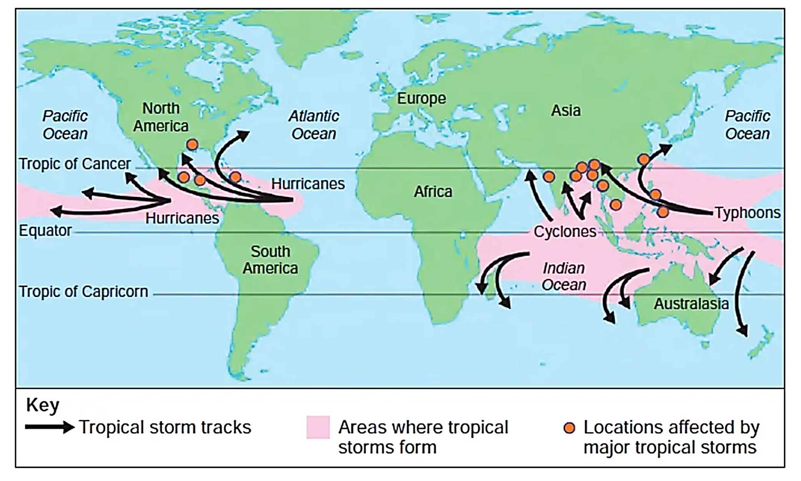
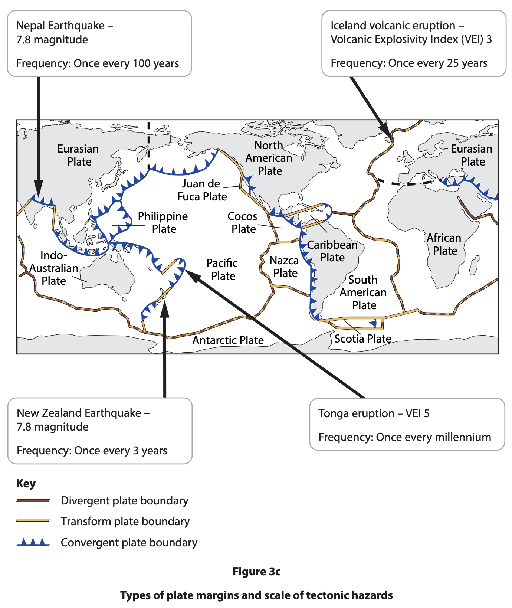

# Exam Questions — Anatomy of Natural Hazards
**Hazardous Environments** · Edexcel IGCSE Geography (4GE1)
> Source: [https://www.savemyexams.com/igcse/geography/edexcel/19/topic-questions/3-hazardous-environments/3-1-anatomy-of-natural-hazards/exam-questions/](https://www.savemyexams.com/igcse/geography/edexcel/19/topic-questions/3-hazardous-environments/3-1-anatomy-of-natural-hazards/exam-questions/) · 32 questions · total 88 marks

## Q1 — easy — 1 marks · exam-questions

### 3() — 1 mark — multiple_choice — from paper June 2017 · 4GE1/01
Study Figure 3 which shows an area of Kathmandu, Nepal, before and after a hazard event which affected much of the country.

Which **one** of the following is the most likely cause of this hazard event?
- **A.** earthquake
- **B.** coastal flooding
- **C.** heavy rainfall
- **D.** volcanic eruption

## Q2 — easy — 4 marks · exam-questions

### 3() — 2 marks — command: identify — structured — from paper June 2018 · 4GE1/01
**Hazardous environments**

Study Figure 3, which shows the shapes of three types of volcano.

Identify **two** ways in which the volcanoes differ in shape.

### 3() — 1 mark — multiple_choice — from paper June 2018 · 4GE1/01
Study Figure 3 which shows the shapes of three types of volcano.

Indicate the reason for the shape of the shield volcano.
- **A.** fast flowing lava eruption
- **B.** explosive eruption
- **C.** ash eruption
- **D.** slow flowing lava eruption

### 3() — 1 mark — command: which — structured — from paper June 2018 · 4GE1/01
Which type of volcano is formed by the eruption of different types of material?

## Q3 — easy — 5 marks · exam-questions

### 3((a)) — 1 mark — multiple_choice — from paper June 2019 · 4GE1/01
Identify the statement below that best describes the epicentre of an earthquake.
- **A.** the area around the earthquake on the surface
- **B.** the point on the Earth’s surface directly above the focus
- **C.** the area around the earthquake underground
- **D.** the location underground where the earthquake occurs

### 3() — 1 mark — command: state — structured — from paper June 2019 · 4GE1/01
State **one** measure of earthquake intensity

### 3() — 1 mark — command: state — structured — from paper June 2019 · 4GE1/01
State **one** characteristic of a volcanic eruption.

### 3() — 2 marks — command: explain — structured — from paper June 2019 · 4GE1/01
Explain **one** cause of an earthquake event.

## Q4 — easy — 2 marks · exam-questions

### 3((a)) — 1 mark — multiple_choice — from paper June 2019 · 4GE1/01R
Identify the statement below that best describes a destructive (convergent) plate margin.
- **A.** the plates pull apart and magma rises
- **B.** the plates push together and both plates are destroyed
- **C.** the plates pull apart and volcanoes erupt
- **D.** the plates push together and one plate is destroyed

### 3() — 1 mark — multiple_choice — from paper June 2019 · 4GE1/01R
Identify  **one** measurement of a volcanic hazard.
- **A.** Volcanic Mercalli Scale
- **B.** Volcanic Saffir-Simpson Scale
- **C.** Volcanic Explosivity Index
- **D.** Volcanic Eruption Source

## Q5 — easy — 2 marks · exam-questions

### 3() — 2 marks — command: what — structured — from paper June 2018 · 4GE1/01
What is meant by the term **natural disaster**?

## Q6 — easy — 1 marks · exam-questions

### 1() — 1 mark — multiple_choice — from paper Nov 2021 · 4GE1/01
Identify the factor that produces the occurrence of an earthquake
- **A.** Ocean surface movement
- **B.** Tsunami wave formation
- **C.** Tectonic plate movement
- **D.** Average temperature change

## Q7 — easy — 2 marks · exam-questions

### 1() — 1 mark — command: identify — structured — from paper Nov 2021 · 4GE1/01
Study Figure 3b which shows a volcanic eruption

Identify one hazard associated with the volcanic eruption

### 2() — 1 mark — multiple_choice — from paper June 2022 · 4GE1/01R
Identify the best definition of an earthquake epicentre
- **A.** Point on the earth's surface where tectonic plates meet
- **B.** Point in the earth's crust that collapses
- **C.** Point in the earth's crust where lava escapes
- **D.** Point on the earth's surface directly above the focus

## Q8 — easy — 2 marks · exam-questions

### 1() — 1 mark — multiple_choice — from paper June 2022 · 4GE0/01
Identify a type of plate boundary
- **A.** Asymmetrical
- **B.** Constructive
- **C.** Hot spot
- **D.** Mantle

### 2() — 1 mark — multiple_choice — from paper June 2022 · 4GE0/01
Identify** one** characteristic of a tropical cyclone
- **A.** Areas of very high pressure
- **B.** Very little rainfall
- **C.** Low wind speeds
- **D.** Eye in the centre

## Q9 — easy — 2 marks · exam-questions

### 1() — 1 mark — command: state — structured — from paper June 2022 · 4GE0/01
State **one** factor that can affect tropical cyclone formation

### 2() — 1 mark — multiple_choice — from paper June 2022 · 4GE1/01R
Identify a feature of a tropical cyclone
- **A.** Crater
- **B.** Constructive
- **C.** Eye
- **D.** Mantle

## Q10 — easy — 2 marks · exam-questions

### 1((c)) — 2 marks — command: explain — structured — from paper June 2022 · 4GE1/01R
Explain **one **factor that affects the distribution of tropical cyclones

## Q11 — easy — 1 marks · exam-questions

### 1() — 1 mark — command: identify — structured
Study Figure 3b.

Identify the latitude range in which tropical cyclones mainly occur.

## Q12 — easy — 1 marks · exam-questions

### 3() — 1 mark — multiple_choice — from paper Nov 2024 · 4GE1/01
Identify one feature of a volcano.
- **A.** Crater
- **B.** Epicentre
- **C.** Eye
- **D.** Focus

## Q13 — easy — 1 marks · exam-questions

### 3((a)) — 1 mark — multiple_choice — from paper Nov 2023 · 4GE1/01
Identify the feature of an earthquake.
- **A.** Cone
- **B.** Crater
- **C.** Epicentre
- **D.** Eye

## Q14 — easy — 1 marks · exam-questions

### 1() — 1 mark — multiple_choice — from paper Nov 2023 · 4GE1/01
Identify the best definition of Coriolis force.
- **A.** The wall of cloud that surrounds the eye.
- **B.** The deflection of air due to the Earth’s rotation.
- **C.** The force placed on the surface by the air above
- **D.** The region of calm weather in the centre

## Q15 — easy — 1 marks · exam-questions

### 3((a)) — 1 mark — multiple_choice — from paper June 2023 · 4GE1/01R
Identify the natural hazard.
- **A.** car emission pollution
- **B.** nuclear meltdown
- **C.** oil slick from a ship
- **D.** volcanic eruption

## Q16 — easy — 4 marks · exam-questions

### 3() — 1 mark — multiple_choice — from paper June 2023 · 4GE1/01R
Identify a factor that affects development of tropical cyclones.
- **A.** large areas of high pressure
- **B.** warm sea surface temperatures
- **C.** an undersea earthquake
- **D.** pyroclastic flows

### 3() — 1 mark — command: state — structured — from paper June 2023 · 4GE1/01R
State **one** measure of tropical cyclone intensity.

### 3() — 2 marks — command: explain — structured — from paper June 2023 · 4GE1/01R
Explain how the Coriolis force affects tropical cyclones.

## Q17 — easy — 1 marks · exam-questions

### 1() — 1 mark — multiple_choice
Which of the following plate boundary types is most associated with earthquake and volcanic activity?
- **A.** Conservative boundary
- **B.** Collision boundary
- **C.** Destructive boundary
- **D.** Constructive boundary

## Q18 — easy — 1 marks · exam-questions

### 1() — 1 mark — multiple_choice
Which** **of the following conditions is essential for a tropical cyclone to form?
- **A.** Sea surface temperature above 10°C
- **B.** Sea surface temperature above 27°C
- **C.** Land surface temperature above 27°C
- **D.** Wind speeds above 120 km/h

## Q19 — easy — 1 marks · exam-questions

### 1() — 1 mark — command: state — structured
State **one **type of extreme weather hazard.

## Q20 — easy — 2 marks · exam-questions

### 1() — 2 marks — command: explain — structured
Explain **one **reason why tropical cyclones lose strength when they move over land.

## Q21 — easy — 3 marks · exam-questions

### 1() — 3 marks — command: explain — structured
Explain why volcanic eruptions do not occur at conservative plate boundaries.

## Q22 — medium — 4 marks · exam-questions

### 3((c)) — 4 marks — command: suggest — structured — from paper June 2019 · 4GE1/01R
Study Figure 3a below.

Suggest **two** factors that influence the distribution of a tropical cyclone.

## Q23 — medium — 4 marks · exam-questions

### 3((c)) — 4 marks — command: suggest — structured — from paper June 2019 · 4GE1/01
Study Figure 3a below.

Suggest a factor that influences the cause and another factor that influences the direction of tropical cyclones.

## Q24 — medium — 3 marks · exam-questions

### 3((d)) — 3 marks — command: explain — structured — from paper June 2019 · 4GE1/01
Explain  **one** way earthquakes can form tsunamis.

## Q25 — medium — 3 marks · exam-questions

### 3((d)) — 3 marks — command: explain — structured — from paper June 2019 · 4GE1/01R
Explain  **one** way a hotspot can lead to a tectonic hazard.

## Q26 — medium — 3 marks · exam-questions

### 1() — 3 marks — command: explain — structured — from paper Nov 2021 · 4GE1/01
Explain the cause of an earthquake

## Q27 — medium — 4 marks · exam-questions

### 1() — 4 marks — command: suggest — structured
**Figure 2** shows the global distribution of tropical cyclones.

Using **Figure 2**, suggest **two **reasons for the distribution of tropical cyclones.

## Q28 — medium — 4 marks · exam-questions

### 3((f)) — 4 marks — command: explain — structured — from paper Nov 2021 · 4GE1/01
Explain why volcanoes do not always form on plate boundaries

## Q29 — medium — 8 marks · exam-questions

### 3((g)) — 4 marks — command: explain — structured — from paper June 2022 · 4GE1/01
Explain how volcanoes are formed at a destructive plate boundary

### 3((g)) — 4 marks — command: explain — structured — from paper June 2022 · 4GE1/01R
Explain why earthquakes occur at destructive plate margins

## Q30 — medium — 4 marks · exam-questions

### 1() — 4 marks — command: explain — structured
Explain why ocean temperature and wind shear are important factors in tropical cyclone formation.

## Q31 — medium — 3 marks · exam-questions

### 3((c)) — 3 marks — command: explain — structured — from paper June 2023 · 4GE1/01R
Explain the formation of a constructive plate margin.

## Q32 — hard — 8 marks · exam-questions

### 3((g)) — 8 marks — command: analyse — structured — from paper Nov 2023 · 4GE0/01
Study Figure 3c.

Analyse the influence plate margin type has on the scale of tectonic hazards. Refer to the resource in your answer

